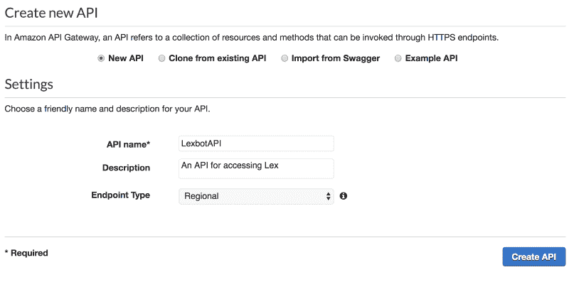
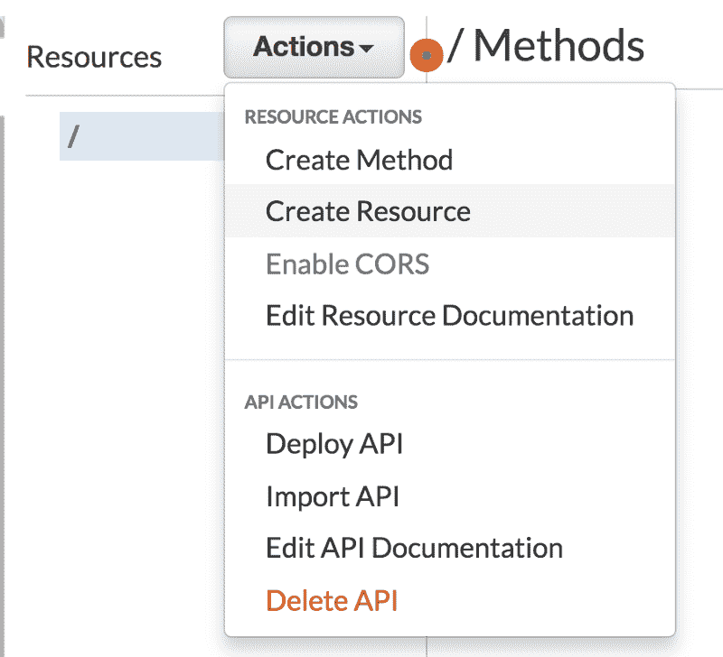
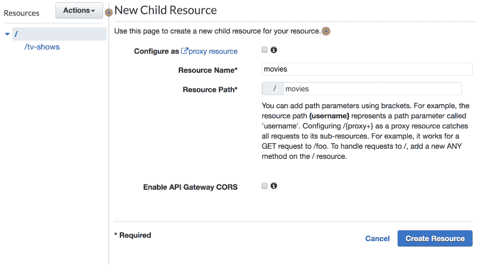
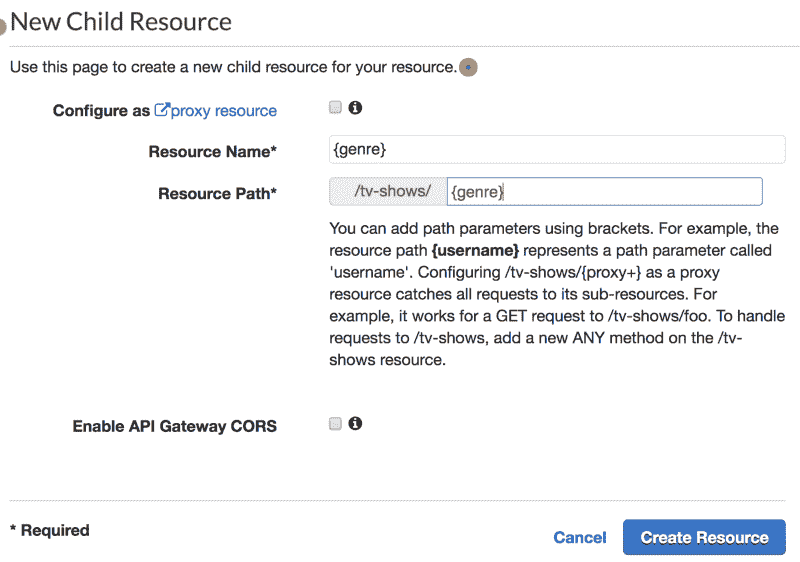
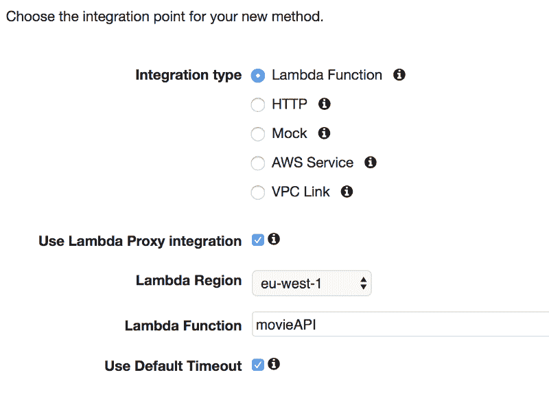
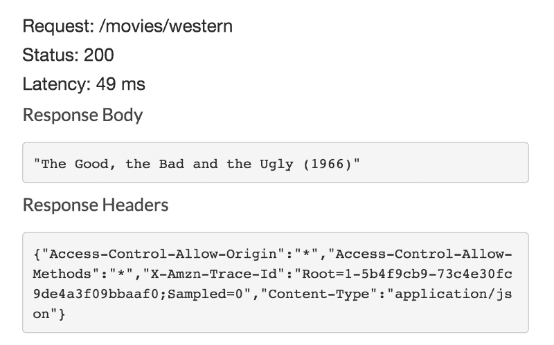

# 如何用 Lambdas 和 API Gateway 构建 API

> 原文：<https://www.freecodecamp.org/news/building-an-api-with-lambdas-and-api-gateway-11254e23b703/>

你想访问你的数据库，控制你的系统，还是从另一个网站执行一些代码？一个 API 可以帮你做所有这些事情，而且它们非常容易设置。

API 是一个 URL，您可以执行`GET` *、* `PUT` *、* `POST`和`DELETE` 请求来控制另一个服务。如果你自己做一个，那么你可以构建这些 API 在幕后做任何你想做的事情。常见的用途是提供数据库控制、在第三方 API 上执行操作(API-exception)或控制另一个服务。

[https://www.youtube.com/embed/4_WI8ZGIcXY?feature=oembed](https://www.youtube.com/embed/4_WI8ZGIcXY?feature=oembed)

### 为什么要使用 API？

你可能会问，当我们可以直接访问数据库或在网站上运行代码时，我们为什么需要 API。相对于在你的网站上运行代码，API 有几个巨大的优势。

#### 隐藏您的访问密钥和令牌

这可能是使用 API 的**最重要的原因。如果您正在访问一个数据库，那么您将需要数据库细节以及用户和访问令牌/密钥数据。**

如果你从网站上访问数据库，那么你会在你网站的源代码中得到所有这些细节。这是非常糟糕的做法，因为任何人都可以查看源代码控制并窃取您的详细信息。这听起来不算太糟，但如果这些是你的 AWS 或谷歌云计算凭证呢？访问你网站的人可以利用这些在你的账户上随心所欲地运行，给你留下一大笔账单。

从 API 后面运行这些过程意味着没有人能看到任何私有的细节——他们不能窃取这些细节用于他们自己的项目。如果你把你的网站代码存储在 GitHub 或者其他公共源码控件中，那么这也意味着它们在那里是不可见的。

#### 在别处运行代码

如果您没有使用任何其他服务，也没有使用任何密钥，该怎么办？如果您正在运行大量或复杂的代码，或者如果您不希望其他人阅读您的代码并发现它是如何工作的，那么您仍然可以使用 API。

#### 控制谁可以访问


[Locked, closed green door](https://www.pexels.com/photo/door-green-closed-lock-4291/).

提供 API 还允许您限制谁能够访问数据库或运行代码。您可以通过要求一个 API 密钥来做到这一点。该键用于识别发出请求的用户，然后允许或拒绝该请求。

这可以用于只允许少数人访问服务，甚至创建一个分层系统。这就是很多付费 API 的工作方式。每个人都被给予免费但有限的访问，然后你允许付费访问服务的高级部分或只是更高的请求率。

### 构建 API

现在我们知道了为什么我们想要创建一个 API 的一些原因，让我们就这么做吧。我们将使用 API Gateway 和 AWS Lambdas，因为这比运行服务器更简单。确保您拥有 AWS 帐户并已登录。

#### 设置 API 网关

我们将首先打开 API 网关服务，然后单击“Get Started”*。*在接下来的页面中，我们需要选择【新 API】*选项。然后，我们将为我们的 API 命名和描述，并单击“创建 API”。*

**

*点击“创建 API”*将进入 API 的配置页面。**

**我们需要做的第一件事是在 API 上添加一个资源。使用资源允许我们使用嵌套斜杠将相似的 API 调用组合在一起。我们将创建一个 API，用于推荐观看的内容。因此我们可以将`/tv-shows` 和`/movies`作为两个基本方法。**

**点击“操作”下拉菜单，选择“创建资源”*。*命名您的资源，确保它们都在“/”路径中。**

********

**我们希望用户能够去“/电影/恐怖”或“/电视节目/喜剧”，我们可以通过添加路径参数来做到这一点。这些是我们可以在 API 内部访问的变量。要创建其中一个，我们需要将资源设置为`{resourceName}`，如下所示。对于“电视节目”和“电影”来说，这是可以做到的。**

****

**现在我们有了长度和类型，我们可以创建获取数据和向表中添加数据的方法。选择其中一个`{genre}`资源，点击【操作】，然后再*创建方法 **。** 这将在资源下方创建一个灰色小框，我们可以单击它。我们将从一个`GET` 请求开始，因此选择它并单击勾选按钮。***

*这是我们决定如何处理请求的地方。我们将使用 AWS Lambdas，但是我们需要在完成方法设置之前创建它们。*

#### *创造兰姆达斯*

*我们能够使用 Lambdas 来响应这些 API 请求，这很好，因为它们只在我们需要的时候运行。它们也很容易创建，所以这就是我们现在要做的。*

*在 Lambda 控制台中，单击“创建函数”。然后我们可以将我们的第一个 API 函数`movieAPI`*命名为运行节点 8.10，并“从模板创建新角色” **。** 我们将我们的新角色命名为“tableAPI”，并添加“简单微服务权限”作为唯一的模板。**

*所有代码都可以在[https://github . com/samw software/Projects/tree/master/movie API](https://github.com/SamWSoftware/Projects/tree/master/movieAPI)找到*

*点击“创建函数”,我们将进入 Lambda 窗口。向下滚动到“功能代码”部分，我们将更改代码。我们要做的第一件事是检查使用了什么请求方法。*

```
*`exports.handler = async (event) => {
    console.log(event);
    if (event.httpMethod === 'PUT'){
        let response = putMovie(event)
        return done(response);
    } else if (event.httpMethod === 'GET'){
        let response = getMovie(event);
        return done(response);
    }
};`*
```

*我们将从编写`getMovie`函数开始。该函数将从路径参数中获取`genre`开始。这就是使用路径参数可以使这个过程变得容易的地方。*

```
*`const getMovie = event => {
    let genre = event.pathParameters.genre;
    return;
}`*
```

*根据用户要求的类型，我们将为他们推荐一部电影。我从[每个流派](https://www.imdb.com/list/ls000441429/)的 25 部顶级电影中复制了这些，并将它们添加到一个以该流派为关键字的对象中。然后，我们可以通过获取所请求类型的值来获取影片。*

```
*`const movies = {
    action: 'Desperado (1995)',
    fantasy: 'Inception (2010)',
    ...
    horror: 'Black Swan (2010)'
}

const getMovie = event => {
    let genre = event.pathParameters.genre;
    return movies[genre];
}`*
```

*这意味着电影的标题正被传递到`done` 函数中。使用这个函数是因为 API Gateway 希望数据以非常特定的格式返回。这个函数将一个字符串转换成所需的格式。*

```
*`const done = response => {
    return {
        statusCode: '200',
        body: JSON.stringify(response),
        headers: {
            'Content-Type': 'application/json',
            'Access-Control-Allow-Methods': '*',
            'Access-Control-Allow-Origin': '*'
        }
    }
}`*
```

*我们可以对一个`tv-showsAPI`函数做非常类似的事情，重用大部分代码。只需将功能名称和电影建议更改为电视节目。*

#### *将 Lambdas 连接到 API 网关*

*回到 API Gateway，我们可以将新的 Lambdas 添加到我们之前创建的方法中。我们需要确保“使用 Lambda 代理集成”被选中，并且我们指向正确的 Lambda。点击“保存”将询问您访问该 Lambda 的权限，对此我们可以给出“确定”*。**

**

*这样做对于`GET` 这两种资源和方法我们都可以开始测试。选择方法应该会显示一个方法执行图。这听起来很复杂，但我们唯一需要的是“测试”部分。*

*单击“TEST”将打开一个新的部分，我们可以在这里试用 API。这里可以设置很多东西，但是我们唯一关心的是`Path {genre}` **。** 我们需要将它设置为我们请求的流派。输入“西方”作为流派并点击“测试”按钮会得到如下响应:*

**

*我们的 API 开始工作了！现在我们需要确保其他人可以访问它。这有两个步骤。*

1.  *我们启用 CORS —选择“{流派}”*资源，然后单击“操作”和“启用 CORS”*。*将所有内容保留为默认值，当询问时，点击“是，替换现有值”*。***
2.  **部署我们的 API —单击“操作”和*“部署 API”。将部署阶段设置为“[新阶段]”，然后为您的阶段命名，如“生产”或*“*公共”*。****

**一旦您的 API 部署完毕，您应该会得到一个如下所示的 URL。这是你的 API 的基础。你可以添加`/movies/western`来访问你的 API。**

```
**`https://{uniqueCode}.execute-api.eu-west-1.amazonaws.com/production`**
```

**您的 API URL 可能类似于:**

```
**`https://fds1fe31fes476s.execute-api.eu-west-1.amazonaws.com/production/movies/western`**
```

**本文到此为止。在下一个版本中，我们将把这个 API 连接到 Dynamo 表，让用户在每个流派中投票选出他们最喜欢的电影。你可以阅读下面的文章。**

**[**使用 Lambdas 和 API 网关构建 API—第 2 部分**](https://medium.com/@samwsoftware/building-an-api-with-lambdas-and-api-gateway-part-2-7c674a0eb121)
[*在第一部分中，我们创建了一个 API，它将请求传递给 Lambda，后者返回热门电视节目或电影……*](https://medium.com/@samwsoftware/building-an-api-with-lambdas-and-api-gateway-part-2-7c674a0eb121)
[medium.com](https://medium.com/@samwsoftware/building-an-api-with-lambdas-and-api-gateway-part-2-7c674a0eb121)**