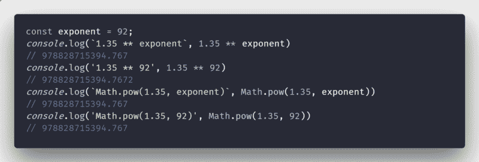
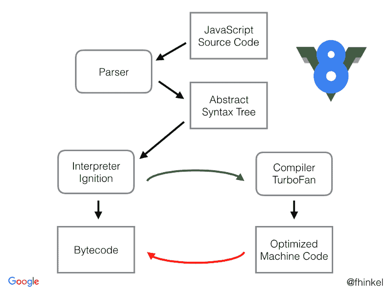

# 我在 V8 的指数运算符中发现了一个错误

> 原文：<https://www.freecodecamp.org/news/i-found-a-bug-in-v8s-exponentiation-operator-dcddfa5b8482/>

克里斯托弗·米歇尔

# 我在 V8 的指数运算符中发现了一个错误


Photo by [Ritchie Valens](https://unsplash.com/photos/fAMG3PDk830?utm_source=unsplash&utm_medium=referral&utm_content=creditCopyText) on [Unsplash](https://unsplash.com/search/photos/bug?utm_source=unsplash&utm_medium=referral&utm_content=creditCopyText)

我一直以为新的 ES6 取幂运算符`[x ** y](https://tc39.github.io/ecma262/#sec-exp-operator-runtime-semantics-evaluation)`和`[Math.pow(x,y)](https://tc39.github.io/ecma262/#sec-math.pow)`是一样的。

事实上，这就是规范对`Math.pow`的描述:

> 返回 12.6.4 中指定的基数和指数应用**运算符的结果。

12.6.4 — *应用**运算符*表明结果是*依赖于实现的* —但是`**`和`Math.pow`之间应该没有差异。

但是，在当前 V8 JS 引擎(Chrome / Node)中评估以下内容会导致以下结果:

```
console.log('1.35 ** 92', 1.35 ** 92)                   // 978828715394.7672console.log('Math.pow(1.35, 92)', Math.pow(1.35, 92))   // 978828715394.767
```

取幂运算符`**`返回更精确的近似值。

但这并不是取幂运算符唯一的怪异之处:让我们尝试用变量( [REPL](https://repl.it/@MrToph/ExponentiationBugs) )来计算同样的值——这应该不会有什么不同:



```
const exponent = 92;console.log(`1.35 ** exponent`, 1.35 ** exponent)                   // 978828715394.767console.log('1.35 ** 92', 1.35 ** 92)                               // 978828715394.7672console.log(`Math.pow(1.35, exponent)`, Math.pow(1.35, exponent))   // 978828715394.767console.log('Math.pow(1.35, 92)', Math.pow(1.35, 92))               // 978828715394.767
```

但事实确实如此:`1.35 ** 92`不同于`1.35 ** exponent`。

这里发生的事情是，编译器处理 JS 代码`1.35 ** 92`，它已经被[常量折叠](https://en.wikipedia.org/wiki/Constant_folding)

这是有意义的，因为 V8 真的编译成机器码。

与执行字节码或解释字节码相比，V8 通过在执行之前将 JavaScript 编译成本机代码来提高性能。

V8 首先用他们的**点火解释器解释 JS 代码。**它用**涡轮风扇编译器** [**优化**机器代码](https://v8project.blogspot.com/2017/05/launching-ignition-and-turbofan.html)进行第二次运行。



From [Understanding V8’s bytecode](https://medium.com/dailyjs/understanding-v8s-bytecode-317d46c94775)

涡轮风扇现在做**不断折叠。**它的取幂算法比 JIT 编译器的(点火)取幂算法有更好的精度。

如果你在其他 JS 引擎中尝试同样的方法，比如 Firefox 的 *SpiderMonkey* ，结果是在所有计算中保持一致的`978828715394.767`值。

#### 是虫子吗？

我会这么说，尽管在我的代码中这并不严重。但是它仍然没有遵循说明`Math.pow`和`**`应该产生相同值的规范。

如果你用 babel 编译代码，`x ** y`被翻译成`Math.pow(x,y)`，这再次导致编译和未编译代码之间的差异。正如我们所见，`Math.pow(1.35, 92)`是**而不是**被优化(只有**运算符**似乎被 V8 优化了)。因此，当[传输到 ES5](https://babeljs.io/repl/#?babili=false&browsers=&build=&builtIns=false&spec=false&loose=false&code_lz=IwOgzArABAVDUE4BMQ&debug=false&forceAllTransforms=false&shippedProposals=false&circleciRepo=&evaluate=true&fileSize=false&sourceType=module&lineWrap=false&presets=es2015%2Creact%2Cstage-2&prettier=false&targets=&version=6.26.0&envVersion=) 时，`1.35 ** 92`会产生不同的代码。

利用这个 bug，不考虑任何干净的代码实践，我们可以编写一个很好的函数来确定我们是否运行在 Chrome 上(除非你传输你的代码？):

```
function isChrome() {    return 1.35 ** 92 !== Math.pow(1.35, 92)}
```

仍然比用户代理字符串更具可读性。？

最初发布于 [cmichel.io](https://cmichel.io/bugs-in-exponentiation-operator/)

