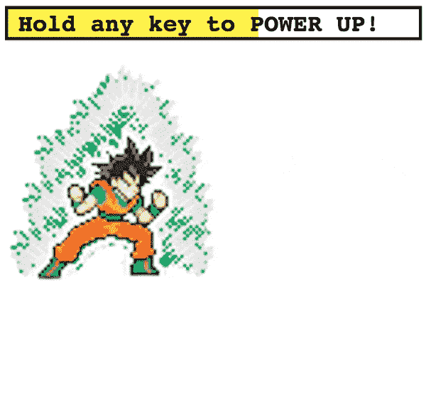
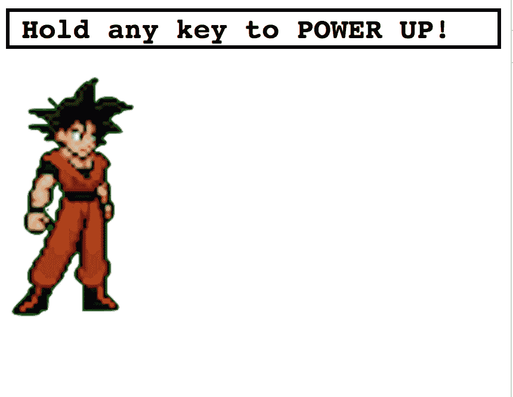
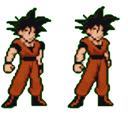
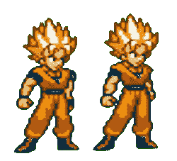
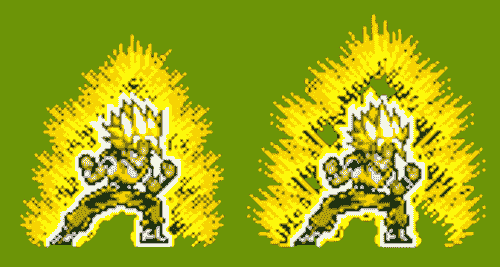
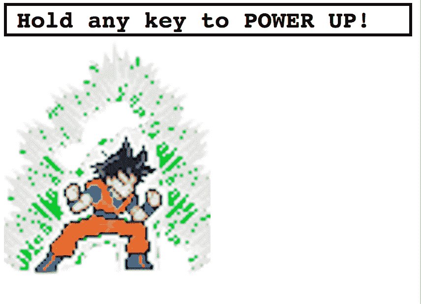
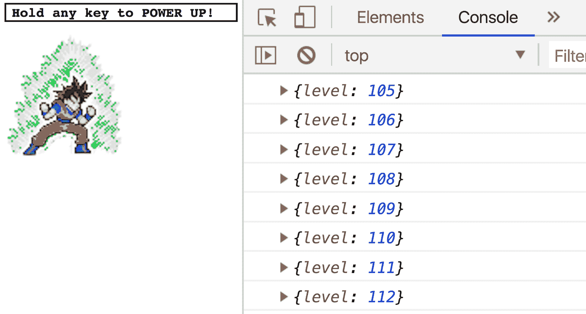
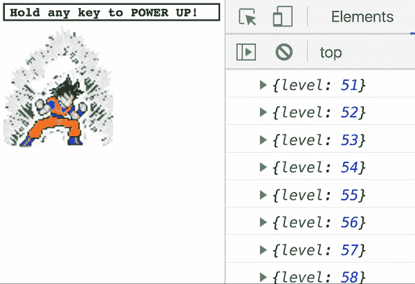
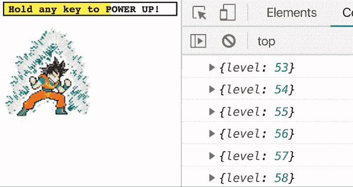

# 用 RxJS Observables 去超级赛亚人

> 原文：<https://www.freecodecamp.org/news/go-super-saiyan-with-rxjs-observables-d4681ae51930/>

我小时候喜欢龙珠 Z，成年后依然喜欢。

在众多可笑的变形中，最初的超级赛亚人仍然是我的最爱。


> 没有什么和原作一样

我也越来越喜欢 RxJS，所以为什么不把这两者结合起来进行终极对决呢？

### 让我们去超级赛亚人

用四个 sprite 工作表和一点 HTML、CSS 和 RxJS，我们可以重新创建这个传奇的转换！



这是我们要做的。很刺激，对吧？！？

### 设置

一切都在我的 GitHub 上。

```
cd ./wherever-you-want
git clone [https://github.com/yazeedb/dbz-rxjs](https://github.com/yazeedb/dbz-rxjs)
cd dbz-rxjs 
```

在您最喜欢的浏览器中打开`index.html`，在您最喜欢的文本编辑器中打开项目，您就可以开始了！

今天没有吗？

为了简洁起见，我将使用缩写“超级喷机”而不是“超级赛亚人”。

### 训练的第一天



你会注意到小悟空已经在移动了。因为我们关注的是 RxJS，所以我们将只略读项目的起点。

下面是主要的 HTML:

```
<div id="root">
  <div id="meter-container">
    <span>Hold any key to POWER UP!</span>
    <div id="meter"></div>
  </div>

  <div id="sprite" class="base"></div>
</div> 
```

底部`div`有`class="base"`，对应这个 CSS:

```
.base,
.ssj {
  width: 120px;
  height: 250px;
  animation: stand 0.8s steps(2) infinite;
}

.base {
  background-image: url('img/goku-standing-sheet.png');
} 
```

这将设置悟空的宽度、高度和站立动画。

如果你看他的基础/ssj 精灵表，这是两个不同的位置，我们每 0.8 秒在它们之间切换。

 

切换操作在`style.css`底部进行:

```
@keyframes stand {
  from {
    background-position: 0px;
  }
  to {
    background-position: -255px;
  }
} 
```

通电时也是如此:

 

```
@keyframes powerup {
  from {
    background-position: 0px;
  }
  to {
    background-position: -513px;
  }
} 
```

当我们操作它的时候，我们会盖住能量计。

### 掌握 DOM 元素

`index.html`已经通过 CDN 包含了`RxJS@6.2.1`,所以您已经被覆盖了。

在`app.js`中，让我们捕获我们感兴趣的 DOM 元素:

```
const sprite = document.querySelector('#sprite');
const meterContainer = document.querySelector('#meter-container');
const meter = document.querySelector('#meter'); 
```

我更喜欢别名`document.querySelector`,这样使用它不会导致我手腕疼痛。

```
const $ = document.querySelector.bind(document);**
const sprite = $('#sprite');
const meterContainer = $('#meter-container');
const meter = $('#meter'); 
```

接下来，我们将创建一个`main`函数并立即调用它。

```
// ...

const main = () => {
  // do something
};
main(); 
```

### 启动电源

下面是`main`的第一段代码:

```
const main = () => {
  const { fromEvent } = rxjs;

  const begin = fromEvent(document, 'keydown');
  const end = fromEvent(document, 'keyup');
}; 
```

小悟空应该在一个键被按住的时候开机，放开那个键的时候关机。我们可以使用`fromEvent`操作符来创建两个可观测量:

*   `begin`:当用户按下**键**时发出通知。
*   `end`:每当用户**放开**一个键时发出通知。

然后，我们可以**订阅**这些排放，并采取行动。要获得开机动画，给`sprite`一个`powerup`类名。

```
begin.subscribe(() => {
  sprite.classList.add('powerup');
}); 
```



它可以工作，但是按下一个键会使他永远通电…

我们还必须订阅`end` observable，这样我们就知道何时放开了按键。

```
end.subscribe(() => {
  sprite.classList.remove('powerup');
}); 
```

现在他在你的命令下上下移动。

### 制造踏板车

任何一个 DBZ 迷都见过 scouter，一个用来追踪能量水平的小眼镜(直到第 20 集……)。


> 必修> 9000 笑话

随着赛亚人能量的增加，他们的能量等级也在增加。不可思议吧？

我们需要一种方法来追踪小悟空上升时的能量等级，并在比如说 100 点后触发超级喷机变身。

我们可以从 1 开始关闭他的电源，当用户按下一个键时增加电源。

#### RxJS 运算符

运营商才是 RxJS 真正出彩的地方。我们可以使用纯函数来描述数据应该如何通过流进行转换。

当用户按住一个键时，让我们将这些排放量转换成一个随时间增加的数字。

#### 扫描

扫描操作员非常适合这个任务。它就像`Array.reduce`，但是当它减少的时候会放出**。**

例如，如果您有一个数字数组:

```
nums = [1, 2, 3, 4, 5]; 
```

并且希望把它们加起来，`reduce`是一个很棒的选择。

```
nums.reduce((a, b) => a + b, 0);
// 15 
```

如果您想在每次添加时看到它，该怎么办？

输入`scan`。你可以在我们应用的控制台上运行这个。

```
const { from } = rxjs;
const { scan } = rxjs.operators;

from([1, 2, 3, 4, 5])
  .pipe(scan((a, b) => a + b, 0))
  .subscribe(console.log);

// 1 (0 + 1)
// 3 (1 + 2)
// 6 (3 + 3)
// 10 (6 + 4)
// 15 (10 + 5) 
```

看看排放量是如何随着时间的推移而增加的？我们可以在小悟空通电的时候这样做！

```
const { fromEvent } = rxjs;
const { scan, tap } = rxjs.operators;

const begin = fromEvent(document, 'keydown');
const end = fromEvent(document, 'keyup');

begin
  .pipe(
    scan((level) => level + 1, 1),
    tap((level) => {
      console.log({ level });
    })
  )
  .subscribe(() => {
    sprite.classList.add('powerup');
  }); 
```

我们在`1`开始他的等级，每次`keydown`事件触发时增加 1。

而 [tap 操作符](https://www.learnrxjs.io/operators/utility/do.html)操作符让我们可以在不干扰管道的情况下快速记录数值。



> 我的力量无限接近最大！

### 去超级赛亚人

我们已经努力训练了，是时候改变了。

操作员追踪小悟空的能量等级。现在我们需要去超级喷机，当它发出 100。

我建了一个`levels: transformations`的地图。可以放在`main`正上方。

```
const powerLevels = {
  100: {
    current: 'base',
    next: 'ssj'
  }
};

const main = () => {
  // ...
}; 
```

这有点矫枉过正，但是应该可以简化未来转换的添加。

当能量等级达到那个`powerLevels`图中的一个数字时，我们将从`sprite`中移除它的`current`等级，并添加`next`等级。

这让我们可以顺利地从一个转换过渡到下一个。

这是代码。

```
const { fromEvent } = rxjs;
const { filter, map, scan, tap } = rxjs.operators;

const begin = fromEvent(document, 'keydown');
const end = fromEvent(document, 'keyup');

begin
  .pipe(
    scan((level) => level + 1, 1),
    tap((level) => {
      console.log({ level });
      sprite.classList.add('powerup');
    }),
    map((level) => powerLevels[level]),
    filter((level) => level && level.next)
  )
  .subscribe(({ current, next }) => {
    sprite.classList.remove(current);
    sprite.classList.add(next);
  }); 
```

#### 映射和过滤

添加`powerup`类现在发生在`tap`内部，因为它应该总是发生。然而，**的超级喷机变身，不该**总发生。

使用`map`，最新功率水平成为`powerLevels`图中的一个条目。我们使用`filter`来检查条目是否存在**并且**是否具有`.next`属性。

如果是这样，那就意味着小悟空可以走得更远！我们的`.subscribe`将在`sprite`上交换`current`和`next`作为类名。

最终结果？



### 功率表

你和我一样开心，对吧？不幸的是，我们的用户不会。

他们看不出悟空的异能水平有多高！他们不知道如何打开 DevTools 控制台。我们必须补救！

让我们通过填充功率表来提高我们的 UX。你可以把这个放在`main`上面。

```
const fillMeter = (level) => {
  const limit = 100;

  if (level >= limit) {
    return;
  }

  const containerWidth = meterContainer.offsetWidth;
  const newWidth = (level / limit) * containerWidth;

  meter.style.width = `${newWidth}px`;
}; 
```

并在内部称之为`tap`。

```
tap((level) => {
  console.log({ level });
  sprite.classList.add('powerup');
  fillMeter(level);
}); 
```

我们开始吧:



### 甚至更进一步

解锁更多的变换只是添加精灵，并更新我们的`powerLevels`地图。如果你感兴趣，在[回购](https://github.com/yazeedb/dbz-rxjs)上提交一份 PR，我们一定会谈的。

这里是[原始精灵表](https://www.deviantart.com/bruguii/art/goku-fin-jus-268665173)。尽情享受吧！