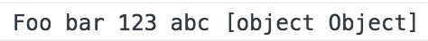
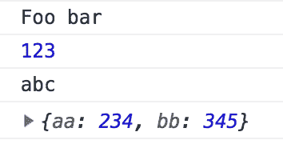
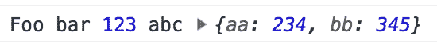
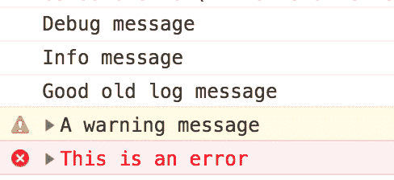
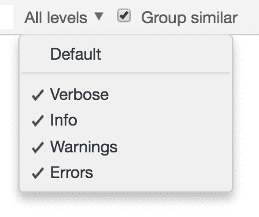
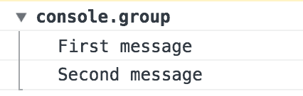
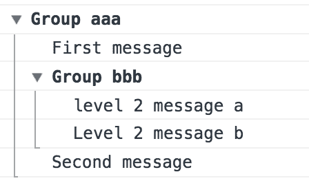
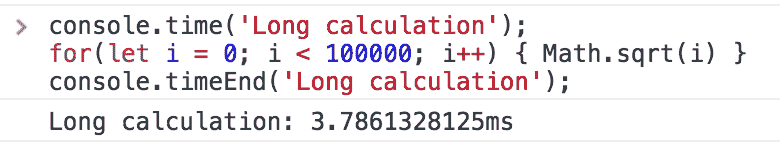
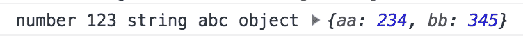
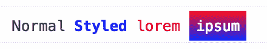

# 如何超越 console.log 并充分利用浏览器的调试控制台

> 原文：<https://www.freecodecamp.org/news/how-to-go-beyond-console-log-and-get-the-most-out-of-your-browsers-debugging-console-e185256a1115/>

吉拉德·达雅吉

对象是浏览器的一个非常有用的特性，已经存在很多年了。它提供对浏览器调试控制台的访问。
大多数 web 开发人员知道如何使用`console.log`将消息打印到控制台。但是我发现许多人不知道`console`的其他特性，尽管它们对每个网络开发者都非常有用。

在这篇文章中，我将回顾一些鲜为人知的特性和功能。我希望你会发现它们有用且有趣，并将它们融入到你的日常工作流程和代码中。

我添加了每个示例的结果截图。如果您想亲自尝试，只需打开 DevTools 并复制粘贴示例。

### 使用多个参数

将几个值记录在一起是很常见的。这些可能是带有相关值的消息或几个相关变量的内容。

以下是我见过的开发人员实现这一目标的两种方式:

#### 1.串并置

```
const a = 123;const b = 'abc';const c = {aa: 234, bb: 345};console.log('Foo bar ' + a + ' ' + b + ' ' + c);
```



Result of string concatenation

#### 2.使用多个呼叫

```
const a = 123;const b = 'abc';const c = {aa: 234, bb: 345};console.log('Foo bar');console.log(a);console.log(b);console.log(c);
```



Result of multiple calls

这些方法可能有效，但是:

*   它们不灵活
*   它们可读性不强
*   它们写起来很麻烦
*   它们需要特殊的方法来正确处理对象变量

输出许多变量有几个更好的选择。快速数据转储最有用的方法是向`console.log`发送多个参数，如下所示:

```
const a = 123;const b = 'abc';const c = {aa: 234, bb: 345};console.log('Foo bar', a, b, c);
```



Result of multiple arguments

这对于调试来说非常方便，但是输出不太可控。对于要被读取的输出(比如一个库)，我会使用一个不同的方法，稍后我们会讲到。

### 使用不同的日志级别

除了大家熟悉的`console.log`之外，还有对应不同日志级别的其他日志记录方法:

```
console.debug('Debug message');console.info('Info message');console.log('Good old log message');console.warn('A warning message');console.error('This is an error');
```



Log levels as seen in Google Chrome

每个日志级别可能有不同的默认样式，这使得一眼就能发现错误和警告更加容易。

您通常还可以过滤您希望在 DevTools 控制台中可见的日志级别。这可能有助于减少混乱。



Filtering log levels in Google Chrome

不同级别的外观和过滤粒度因浏览器而异。

### 控制台线路分组

有时，将日志消息分组在一起很有用。它可以允许更有组织和可读性的输出。

这实际上很容易实现:

```
console.group();console.log('First message');console.log('Second message');console.groupEnd();
```



Grouped log messages

请注意，日志组也可以嵌套和标记:

```
console.group('Group aaa');console.log('First message');console.group('Group bbb');console.log('level 2 message a');console.log('Level 2 message b');console.groupEnd();console.log('Second message');console.groupEnd();
```



Nested and labeled groups

如果您希望群组显示为折叠状态，请使用`console.groupCollapsed()`

### 衡量绩效

测量代码中各点之间的时间可以作为检查某些操作性能的快速方法。

下面是一个简单的方法:

```
const start = Date.now();// do some stuffconsole.log('Took ' + (Date.now() - start) + ' millis');
```

这是可行的，但还有一种更优雅的方式来实现类似的东西:

```
console.time('Label 1');// do some stuffconsole.timeEnd('Label 1');
```



Measuring time with the console

代码更短，测量更精确，您可以在一个页面上并行跟踪多达 10，000 个不同的计时器。

### 字符串替换

之前我们了解到，您可以向`console.log`传递多个参数来同时输出多个值。实现类似功能的另一种方法是使用字符串替换。这种方法需要熟悉可用的占位符，但可以更好地控制输出。

```
const a = 123;const b = 'abc';const c = {aa: 234, bb: 345};console.log('number %d string %s object %o', a, b, c);
```



Logging with string substitution

查看文档(最后的链接)以获得可用占位符的列表。

### 式样

对不同的日志消息采用不同的样式来增加可读性可能会很好。

我们已经提到过，浏览器为某些日志级别提供了不同的默认样式，但是这也可以根据您的特定需求进行定制。样式是使用 CSS 规则的子集完成的，作为第二个参数传入一个字符串，并使用标记`%c`应用。

请注意，日志消息的不同部分可以有不同的样式。

例如:

```
console.log("Normal %cStyled %clorem %cipsum", "color: blue; font-weight: bold", "color: red", "background-image: linear-gradient(red, blue); color: white; padding: 5px;");
```



Styled log messages

### 摘要

在这篇文章中，我们看到了`console`的一些我认为不太为人所知但更有用的特性。这绝不是`console`能做的所有事情的详尽列表，因为它还有更多锦囊妙计。

如果这让你感兴趣，并且你想知道你还能用`console`做什么，我推荐你阅读 MDN 上的[相关文档，并在 DevTools 中尝试。](https://developer.mozilla.org/en-US/docs/Web/API/console)

如果你觉得这很有用，请在社交媒体上分享这篇文章。
*你也可以在 twitter 上关注我(@giladaya)。感谢阅读！*