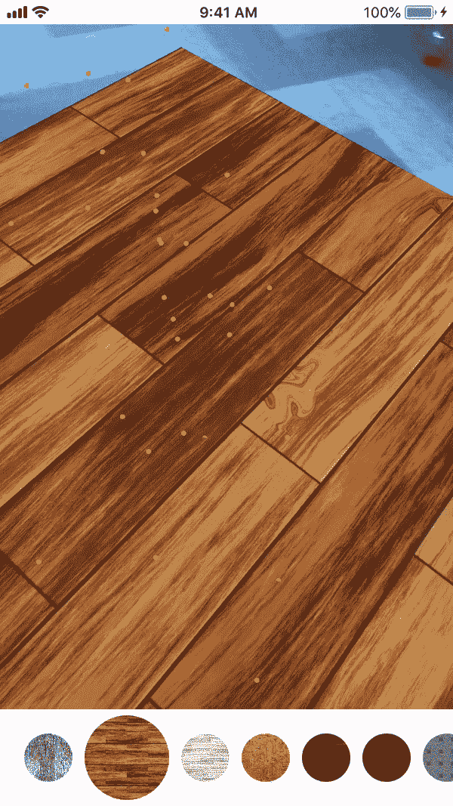
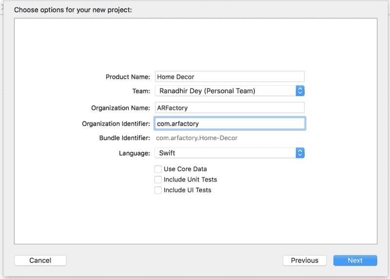
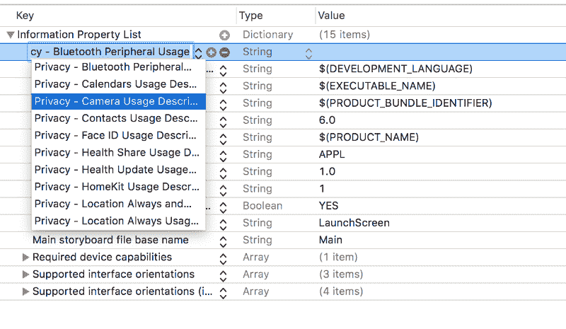
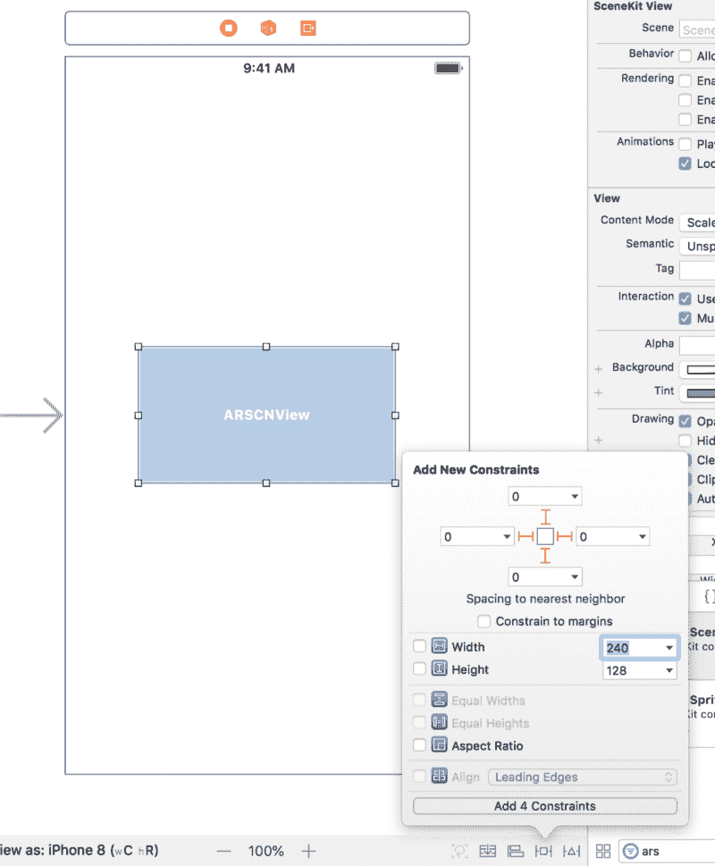
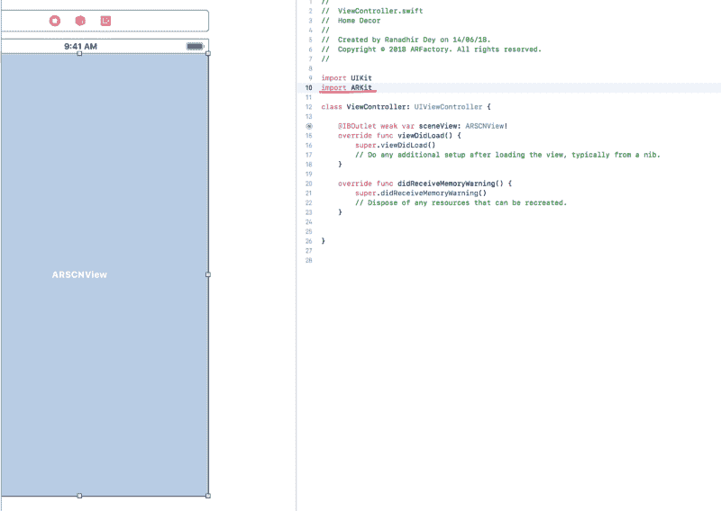
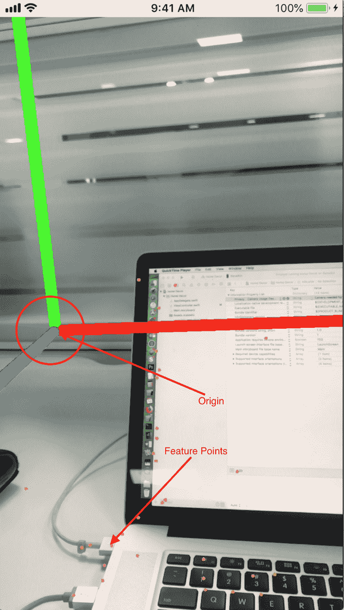
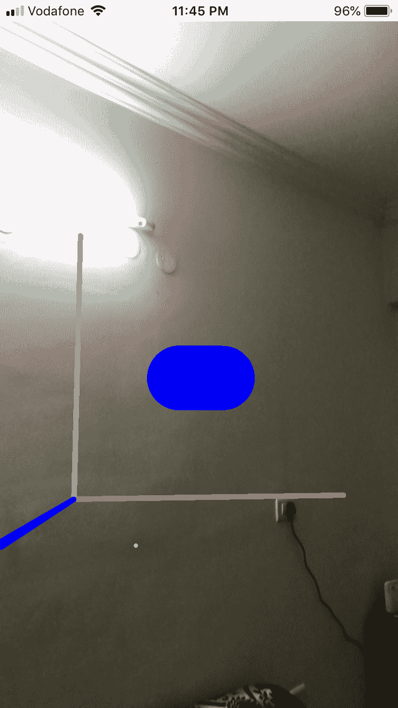
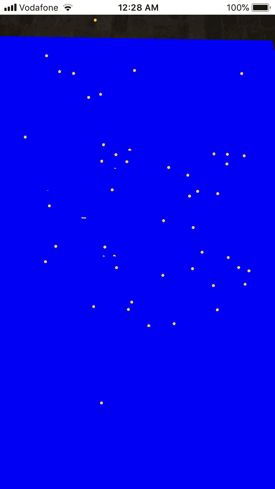
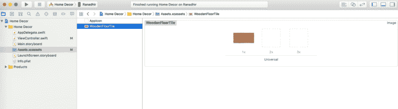
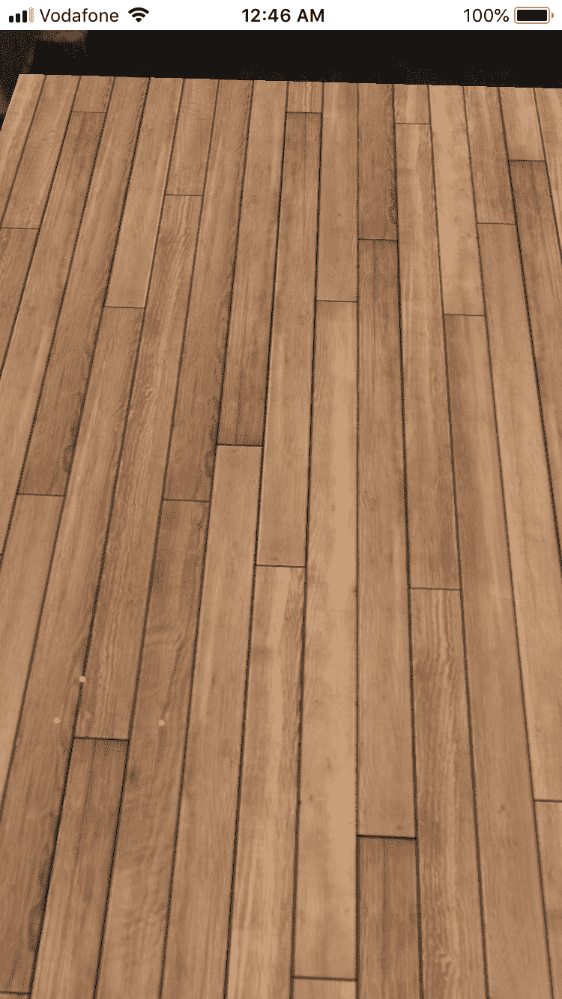

# 如何在 Swift 中开始增强现实，简单的方法

> 原文：<https://www.freecodecamp.org/news/how-to-get-started-with-ar-in-swift-the-easy-way-7399fe1c82f5/>

作者:拉纳迪尔·戴

# 如何在 Swift 中开始增强现实，简单的方法

如果你环顾四周，这是技术的黄金时代。每一个主题演讲都为现有的技术添加了新的东西。看到这些新兴技术如何拓展了我们的想象力，令人兴奋不已。作为开发人员，我们必须为自己是这些技术的第一手用户而感到自豪。

但是每一项新技术都伴随着相当陡峭的学习曲线。你不能在 Youtube 上看一个主题演讲或视频，然后开始开发一个应用程序。但好消息是，有了 Swift 中的 AR，使用基本的 AR 应用程序变得非常容易。苹果公司已经帮你完成了大部分繁重的工作。跟着做，你会发现它有多简单。

### **让我们开始吧……**

在本教程中，我们将学习 Swift 中 AR 的必要工具和技术，这将允许我们创建一个应用程序，用一些很酷的地砖和木质纹理装饰您的地板。完成后的应用程序将如下所示:



让我们首先在 Xcode 中创建一个**单视图**应用程序，并将其命名为 Home Decor。



### **添加摄像机权限**

现在，我们要做的第一件事是导航到 info.plist 文件，并启用相机使用。相机功能是 AR 应用程序需要的第一件事。找到相机使用描述键，如下图所示，并给它一个合适的信息。该消息将在应用程序首次启动时显示，同时向用户询问相机权限。



### **为应用添加 ARKit 功能**

转到 Main.storyboard .在 ViewController 上拖放一个 ARKit SceneKit 视图，并将 ARSCNView 固定到 ViewController 的边缘。



为 ViewController 类创建一个 IBOutlet，并将其命名为 sceneView。一旦你这样做，一个错误声明**未声明的 ARSCNView** *，*将会弹出，因为我们的视图控制器不能识别 ARSCNView 类型的任何东西。为了解决这个问题，并使用其他 ARKit 特性，我们需要将 ARKit 导入到视图控制器中。



现在从 storyboard 移动到 view controller.swift 文件。在 viewDidLoad()方法之前声明一个 ARWorldTrackingConfiguration 类型的属性，并将其命名为 config。我们的视图控制器将如下所示(我已经移除了 didReceiveMemoryWarning 方法):

```
import UIKitimport ARKit
```

```
class ViewController: UIViewController {
```

```
@IBOutlet weak var sceneView: ARSCNView!let config = ARWorldTrackingConfiguration()
```

```
override func viewDidLoad() {super.viewDidLoad()}
```

### **允许调试**

该配置变量将决定场景会话的配置。我们将在本节的后面看到它的用法。现在，在 super.viewDidLoad()之后的 viewDidLoad 方法中，添加以下内容:

```
sceneView.debugOptions = [ARSCNDebugOptions.showFeaturePoints, ARSCNDebugOptions.showWorldOrigin]
```

在这里，我们为 sceneView 启用了调试选项，scene view 只不过是具有 AR 框架功能的摄像机视图。arscndebugoptions . showworld origin 将在屏幕上显示世界原点。这将帮助我们找到所有其他位置的参考点。arscndebugoptions . showfeaturepoints 将在屏幕上显示 AR 摄像机在周围环境中识别的所有点。

现在要启动 AR 会话，我们需要使用 config 变量中提到的配置在场景视图中运行一个会话。在 sceneView.debugOptions 行的正下方，写入:

```
sceneView.session.run(config)
```

现在在你的设备上运行这个应用程序(不是在模拟器上，因为它没有摄像头)。你写的要求允许拍照的提示会出现，你需要允许。等待一会儿，它会加载世界原点。



如果你在这里，你已经有一个 AR 应用程序在运行。恭喜你！

### **AR 轴如何工作**

红色条或 X 轴用于将对象定位在世界原点的左侧或右侧。绿色条或 Y 轴用于将对象定位到世界原点的顶部或底部。蓝条或 Z 轴用于确定物体与世界原点的距离。

X 的正值会将对象放置在世界原点的右侧，负值会将其放置在左侧。Y 的正值将把它放在顶部，负值将把它放在世界原点的底部。Z 的正值将使它更靠近世界原点，负值将使它远离世界原点。

### **添加虚拟物体**

让我们给场景添加一些虚拟物体。3D 胶囊会是个不错的选择。声明一个类型为 [SCNNode](https://developer.apple.com/documentation/scenekit/scnnode?changes=_8) 的胶囊节点，并给它一个[胶囊](https://developer.apple.com/documentation/scenekit/scncapsule?changes=_5)的几何图形。高度为 0.1 米，半径为 0.03 米。

```
let capsuleNode = SCNNode(geometry: SCNCapsule(capRadius: 0.03, height: 0.1
```

现在将其定位在世界原点左侧 0.1 米处，世界原点上方 0.1 米处，距离世界原点 0.1 米处:

```
capsuleNode.position = SCNVector3(0.1, 0.1, -0.1)
```

现在，将节点添加到场景中:

```
sceneView.scene.rootNode.addChildNode(capsuleNode)
```

sceneView 包含一个场景，该场景负责以 SCNNode 格式保存将形成 3D 场景的所有 3D 对象。我们将胶囊添加到场景的根节点。根节点的位置与世界原点的位置完全对齐。这意味着它的位置是(0，0，0)。

目前，我们的 viewDidLoad 方法如下所示:

```
override func viewDidLoad() {
```

```
super.viewDidLoad()
```

```
sceneView.debugOptions = [ARSCNDebugOptions.showFeaturePoints, ARSCNDebugOptions.showWorldOrigin]
```

```
sceneView.session.run(config)
```

```
let capsuleNode = SCNNode(geometry: SCNCapsule(capRadius: 0.03, height: 0.1))
```

```
capsuleNode.position = SCNVector3(0.1, 0.1, -0.1)
```

```
sceneView.scene.rootNode.addChildNode(capsuleNode)
```

```
}
```

现在运行应用程序。


酷！我们刚刚在现实世界中放置了一个虚拟物体。你可以玩不同的位置和不同的几何形状来探索更多。现在让我们将胶囊绕 Z 轴旋转 90 度，使其平放在 X 轴上，并将其颜色变为蓝色。

### **欧拉角**

欧拉角决定了一个节点的显示角度。我们将看到如何使用它来旋转胶囊。

每个几何图形都可以添加定义几何图形外观的材质。材质具有漫反射属性，设置该属性后，会将其内容扩散到整个几何体。

在 viewDidLoad 中，在设置了胶囊的位置后添加下面的行。

```
capsuleNode.geometry?.firstMaterial?.diffuse.contents = UIColor.blue //1capsuleNode.eulerAngles = SCNVector3(0,0,Double.pi/2)//2
```

在这里，在第一行，我们将节点的第一个材质设置为蓝色，它将在胶囊上展开，看起来是蓝色的。在第 2 行中，我们将 Z 欧拉角设置为 90 度弧度。最后，我们的视图如下所示加载:

```
override func viewDidLoad() {
```

```
super.viewDidLoad()
```

```
sceneView.debugOptions = [ARSCNDebugOptions.showFeaturePoints, ARSCNDebugOptions.showWorldOrigin]
```

```
sceneView.session.run(config)
```

```
let capsuleNode = SCNNode(geometry: SCNCapsule(capRadius: 0.03, height: 0.1))
```

```
capsuleNode.position = SCNVector3(0.1, 0.1, -0.1)
```

```
capsuleNode.geometry?.firstMaterial?.diffuse.contents = UIColor.blue //1
```

```
capsuleNode.eulerAngles = SCNVector3(0,0,Double.pi/2)//2
```

```
sceneView.scene.rootNode.addChildNode(capsuleNode)
```

```
}
```

现在运行应用程序。



太好了！墙上有一个蓝色的睡眠胶囊！您甚至可以添加纹理作为漫射内容，使对象看起来更真实。当我们在地板上放置瓷砖的纹理时，我们将在下一节使用它。

既然我们已经成功地在现实世界中放置了虚拟物体，是时候用虚拟地砖来装饰我们的现实地板了。为了实现地板效果，我们将使用一个[平面](https://developer.apple.com/documentation/scenekit/scnplane)几何图形。SCNPlane 不像其他 3D 几何图形那样有任何深度，这使它非常适合我们的应用程序。

### **ARSCENEView 代表**

在开始楼层检测之前，我们将探索 sceneView 的一些委托方法，以了解我们具备哪些功能来与正在进行的 AR 会话进行交互。

```
func renderer(SCNSceneRenderer, didAdd: SCNNode, for: ARAnchor)
```

每当我们移动或倾斜带有 AR 会话的设备时，ARKit 会尝试在周围找到不同的 ARAnchors。一个 [ARAnchor](https://developer.apple.com/documentation/arkit/aranchor) 包含关于真实世界位置和方向的信息，可以用来放置一个物体。

一旦找到不同的锚点，一个新的节点将使用相同的信息添加到场景中，以容纳这个新找到的锚点。这个委托方法会告诉我们这一点。我们将使用它来查找地板上放置瓷砖的所有位置。

```
func renderer(_ renderer: SCNSceneRenderer, didUpdate node: SCNNode, for anchor: ARAnchor)
```

大多数时候，从锚点添加的所有节点都属于同一个对象。假设你在地板上走来走去，设备在不同的位置找到了许多锚。它试图为这些锚点添加所有节点，因为它认为所有这些锚点属于不同的对象。

但是 ARKit 最终认识到它们都属于同一楼层，所以它通过附加其他重复节点的维度来更新第一层节点。这个委托方法会告诉我们这一点。

```
func renderer(SCNSceneRenderer, didRemove: SCNNode, for: ARAnchor)
```

在用所有其他重复节点的维度更新第一个唯一节点后，ARKit 删除所有重复节点，委托方法通知我们。我们将在我们的应用程序中使用上述所有的委托方法(它们的目的将变得更加清晰)。

### **平面检测**

目前，我们的场景正在试图收集它遇到的所有锚，因为这是默认的行为。但是由于地板是一个水平面，我们只对水平面上的锚感兴趣。因此，回到我们的 viewDidLoad 方法，在运行会话的行之前(即在 sceneView.session.run(config)行之前)编写下面的代码**。**

```
config.planeDetection = .horizontal
```

在 viewDidLoad 方法中，您可以删除 sceneView.session.run(config)之后的所有内容，因为这是为了将胶囊放在屏幕上，我们不再需要它了。由于我们将使用上述所有委托方法，我们需要使我们的 viewController 成为 sceneView 的委托。在 viewDidLoad()方法的右大括号之前，添加下面一行。

```
sceneView.delegate = self
```

您现在应该会得到一个错误，因为我们的视图控制器仍然不符合 sceneView 委托。为了实现这一点，让我们在 ViewController.swift 文件的末尾创建一个视图控制器的扩展。

```
extension ViewController:ARSCNViewDelegate{}
```

didAdd SCNNode delegate 方法将在每次发现地板的一部分并基于锚点向场景添加新节点时触发。在这个方法中，我们将创建一个 floor 节点，并将它作为最近添加的节点的子节点添加到锚的位置。

ARArchor 可以有四种不同的类型来解决四种不同的目的。这里我们只对检测水平面或垂直面的 ARPlaneAnchor 感兴趣。

### **创建 AR 楼层节点**

让我们创建一个接收 ARPlaneAnchor 作为参数的函数，在锚的位置创建一个 floor 节点，并返回它。

```
func createFloorNode(anchor:ARPlaneAnchor) ->SCNNode{
```

```
let floorNode = SCNNode(geometry: SCNPlane(width: CGFloat(anchor.extent.x), height: CGFloat(anchor.extent.z))) //1
```

```
floorNode.position=SCNVector3(anchor.center.x,0,anchor.center.z)                                               //2
```

```
floorNode.geometry?.firstMaterial?.diffuse.contents = UIColor.blue                                             //3
```

```
floorNode.geometry?.firstMaterial?.isDoubleSided = true                                                        //4
```

```
floorNode.eulerAngles = SCNVector3(Double.pi/2,0,0)                                                    //5
```

```
return floorNode                                                                                               //6
```

```
}
```

让我们一行一行地检查这个函数，并更详细地讨论它。请按照每一行的描述，因为这是最棘手的部分。

1.我们正在创建一个几何形状为 SCNPlane 的节点，其大小与锚点相同。ARPlaneAnchor 的范围保存位置信息。extent.z 被用作 height 而不是 extent.y，这一事实可能有点令人困惑。如果你想象一个三维立方体被放在地板上，你想让它沿着 2D 表面变平，你可以把 y 变为零，它就会变平。现在，为了得到这个 2D 曲面的长度，你会考虑 z，不是吗？我们的地板是平的，所以我们需要一个平的节点，而不是立方体。

2.我们正在设置节点的位置。因为我们不需要任何高度，所以我们把 y 设为 0。

3.将地板颜色设置为蓝色。

4.材料颜色将只显示在一面，除非我们特别提到它是双面的。

5.默认情况下，平面将垂直放置。为了使它水平，我们需要将其旋转 90 度。

### **实现委托方法**

现在，让我们实现 didAdd SCNNode 委托方法。

```
func renderer(_ renderer: SCNSceneRenderer, didAdd node: SCNNode, for anchor: ARAnchor) {
```

```
guard let planeAnchor = anchor as? ARPlaneAnchor else {return} //1
```

```
let planeNode = createFloorNode(anchor: planeAnchor) //2
```

```
node.addChildNode(planeNode) //3
```

```
}
```

在第 1 行中，我们检查锚是否是一个 ARPlaneAnchor，因为我们只处理这种类型的锚。

在第 2 行，基于锚创建了一个新节点。在第 3 行，它被添加到节点中。

现在，在 didUpdate SCNNode 委托中，我们将删除所有楼层节点。我们这样做是因为当前节点的尺寸已经改变，旧的楼层节点不匹配。然后，我们将再次向这个更新的节点添加一个新的楼层节点。

```
func renderer(_ renderer: SCNSceneRenderer, didUpdate node: SCNNode, for anchor: ARAnchor) {
```

```
guard let planeAnchor = anchor as? ARPlaneAnchor else {return}
```

```
node.enumerateChildNodes { (node, _) in
```

```
node.removeFromParentNode()
```

```
}
```

```
let planeNode = createFloorNode(anchor: planeAnchor)
```

```
node.addChildNode(planeNode)
```

```
}
```

在 didRemove SCNNode 委托方法中，我们希望以文明的方式清除所有垃圾节点。

```
func renderer(_ renderer: SCNSceneRenderer, didRemove node: SCNNode, for anchor: ARAnchor) {
```

```
guard let _ = anchor as? ARPlaneAnchor else {return}
```

```
node.enumerateChildNodes { (node, _) in
```

```
node.removeFromParentNode()
```

```
}
```

```
}
```

唷！就是这样！运行应用程序。



### **添加平铺效果**

等等，什么？蓝色地板？不，我们还没有完全完成。只需一个小小的改变，我们就会拥有一个令人惊叹的地板！

要把蓝色地板换成瓷砖，我们需要一个纹理。让我们谷歌一下地砖纹理。我搜索了一下“木地板纹理”，发现了一些很漂亮的纹理图片。将它们中的任何一个保存在 Mac 上，并将其拖到 Assets.xcassets。



我把它命名为 WoodenFloorTile。你想叫它什么都可以。再次返回到 ViewController.swift 文件。在 createFloorNode 函数中，不要将 UIColor.blue 设置为漫射内容，而是使用您在 asset 文件夹中为图像指定的名称将其设置为 UIImage。

```
floorNode.geometry?.firstMaterial?.diffuse.contents = UIImage(named: "WoodenFloorTile")
```

现在运行应用程序，等待世界原点加载。一旦检测到楼层，就四处移动以更新节点信息。



哇，你的地板真漂亮！你可以下载多个纹理并把它们放在一个列表视图中。这允许你根据选择的纹理来改变地板，就像在第一部分中显示的那样。

从 GitHub 下载完整的项目。

现在你有一个漂亮的地板，你一定缺少一些漂亮的家具来让你的房间看起来更漂亮！我们以后会处理这个问题。