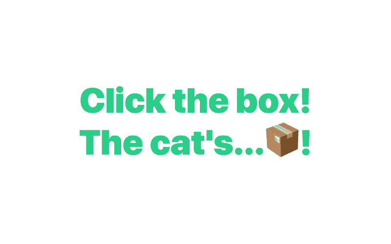
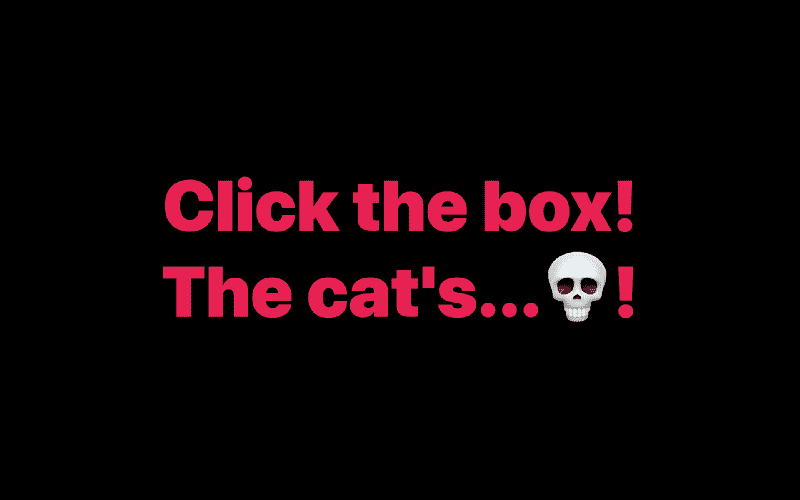
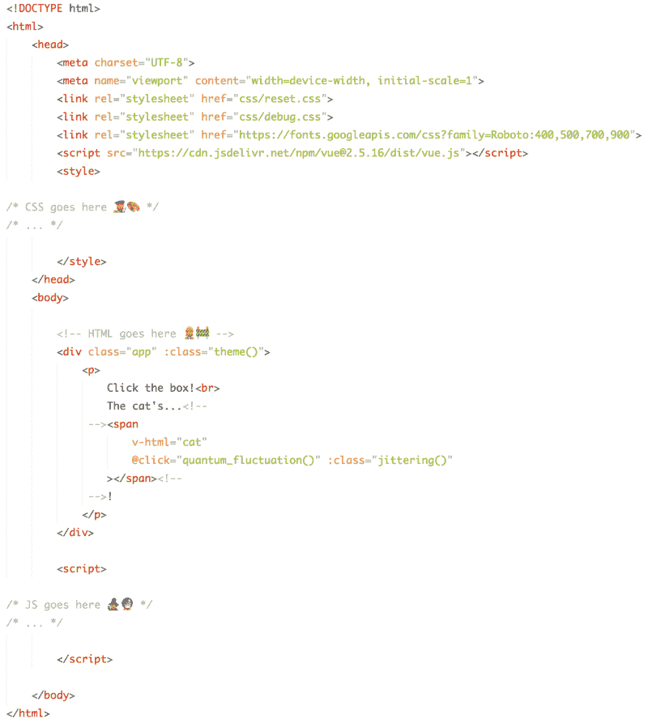
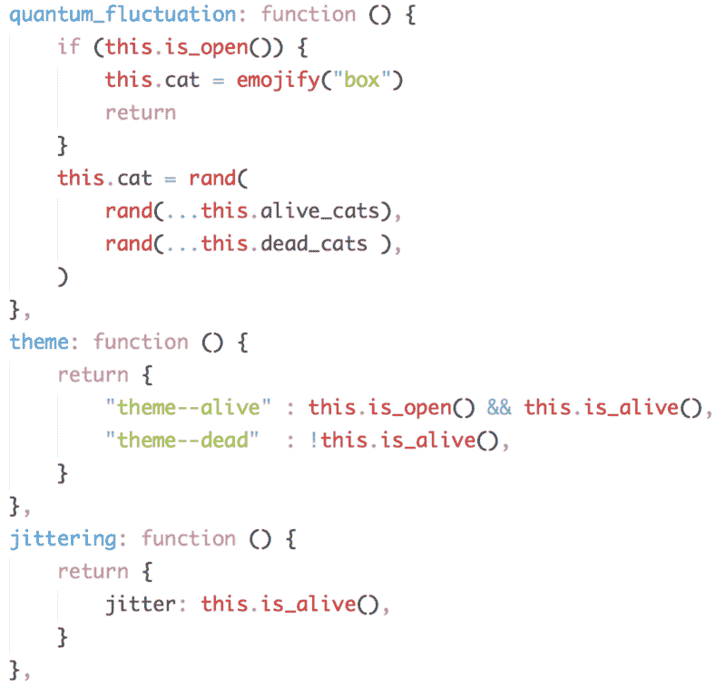
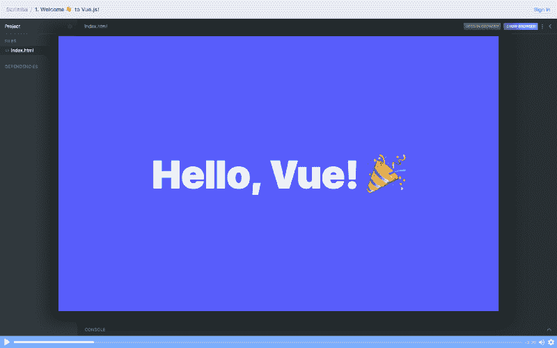

# 我们如何构建薛定谔的 div？用 Vue！

> 原文：<https://www.freecodecamp.org/news/how-we-can-build-schrodingers-div-with-vue-4068f6423830/>

作者 ZAYDEK

# 我们如何构建薛定谔的 div？用 Vue！

#### 我们有 50%的机会做对…

在我开始写这篇文章之前，我只想分享我正在开发一个产品，我很乐意收集一些关于如何更好地为 web 开发人员服务的数据。我创建了一个[简短问卷](https://twitter.com/username_ZAYDEK/status/1103914471267790854)在阅读这篇文章之前或之后进行检查。请检查一下，谢谢！现在，回到我们的常规节目。

### 你好互联网！

你可能不知道我是谁*咳*我是[Zaydek](https://twitter.com/username_ZAYDEK)*咳*但是我知道你是谁！你是一个有抱负的、崭露头角的 web 开发人员，对学习一些新技术感兴趣，但是有点犹豫，因为框架来来去去，而 JavaScript 很好..JavaScript！说得轻一点。

因此，请允许我占用您几分钟的时间，来为为什么学习 Vue 是一个伟大的决定做一个令人信服的论证。你应该学习它，不仅是为了你的资格，也是为了学习一个有良好文档记录和编排的软件所带来的纯粹的乐趣和喜悦。

#### 这怎么还教我？我刚刚发布的 Vue 课程中的作品和更多内容。从基础开始学习 Vue，并学习如何构建一些东西！点击这里免费注册！

[Click to enroll in my free Vue course!](https://scrimba.com/g/glearnvue)

#### Scrimba.com 是一个学习和分享如何编程的新的互动网站。截屏可以被打断和编辑，让学习变得活跃和有趣！

### 你好，菲利克斯！

薛定谔的猫是一个病态的思想实验，由阿尔伯特·爱因斯坦和埃尔温·薛定谔提出来嘲笑量子物理学的荒谬。这是一个(难以想象的)实验，微观层面的随机性可以在我们经历的宏观世界中进行测量。具有讽刺意味的是，它已经成为解释量子物理的核心！

你可以在这里了解更多关于这个实验及其起源的信息。

事情是这样的:你有一只猫。你把它放在一个密封的盒子里。盒子里放着一些放射性物质，在一个多小时内，如果它的原子电离，有 50%的可能性。盒子里还放着一个盖革计数器，这是一种测量设备。如果它检测到一个电离的原子，它会释放一个锤子，打碎一小瓶毒药，从而杀死猫！？？

这里有一个关于薛定谔猫的更学术的解释:

> 该场景呈现了一只猫可能同时活着和死去，这种状态被称为量子叠加，是与一个可能发生也可能不发生的随机亚原子事件联系在一起的结果…

> …薛定谔不希望把死猫和活猫的想法作为一种严肃的可能性来推广；相反，他打算用这个例子来说明现有的量子力学观点的荒谬性。

> — [维基百科](https://en.wikipedia.org/wiki/Schr%C3%B6dinger%27s_cat#Origin_and_motivation)

这就是我们要用 Vue 构建的东西！？这并不难，但我们有点作弊，因为我们将依赖 JavaScript 的伪随机工具，而不是电离原子！

对于这个课程，你应该知道一些 JavaScript 和一些 HTML。但是[在我刚刚发布的课程](https://scrimba.com/g/glearnvue)中，我花了 10 分钟来教授启动和运行 Vue 所需的 JavaScript 的绝对基础知识！[所以别忘了报名哦！](https://scrimba.com/g/glearnvue)

### 构建薛定谔方程

Click to roll the dice.. ?

使用 Vue，我们可以将一个点击处理程序绑定到一个包含`?,`的`span`——我撒谎了，它不是一个`div`——并从？ `o` r？`em` ojis。点击它会调用一个模拟掷骰子的函数，并显示我们的猫是死是活。并且再次点击可以将状态重置回原始的封闭框。这都可以通过 Vue 的 v-h `tml, @` cl `ick, a` nd :cl `ass at`属性来实现。

为引起人的注意时所发的声音..完整代码可在第八期截屏中找到。

`
 里面是一个 p 那`shows Click the box! The ca` ts…？！另外在中，p `is a` span 和一些属性`tes. v` -html `and emoj` ify()是我用来将表情符号显示为图像的技术。

`@click="quantum_fluctuation()"`是我如何将一个功能附加到被点击的`span`上，以及`:class="jittering()"`——也是`:class="theme()"`——产生微妙的特殊效果。

现在让我们来理解一下`quantum_fluctuation()`是如何工作的:当被调用时，它调用 JavaScript 的`Math.random()`来影响我们的猫的状态，猫被初始化为`?,`并从中选择一个？ `o` r？`em` ojis。

请记住，我为了更大的画面混淆了一些细节，即我们将猫的状态，例如`this.cat`，存储在数据中，并且函数调用设置了`this.cat`状态，该状态也在 DOM 中得到更新。

当然你可以在[对应的截屏](https://scrimba.com/p/pZ45Hz/ceJ3vUL)中了解更多`this.cat`、`rand()`、`this.alive_cats`、`this.dead_cats`、`this.is_open()`、`this.is_alive()`的实现。

为了了解`:classes`是如何工作的，这些函数返回 JavaScript 对象，这些对象根据应用程序的状态绑定普通的 CSS 类。这是一件大事，因为这意味着我们的 CSS 可以被认为是活的。哇哦！！

最重要的一点是，现在一个人创造基于网络的产品和服务来模仿现代本地应用程序的快速性是可以想象的，也是明智的，所有这些都没有相同的技术债务。这是一件大事，因为虽然原生应用很好，但它们确实需要额外的步骤，并且经常需要几十甚至一百 MB 来下载。？

#### 学习 Vue 还有很多东西要学，所以我就这个主题又写了两篇文章。求求你，看完这篇文章，看看吧！

Left: “[Learn Vue.js in this free course! ?✨”](https://medium.freecodecamp.org/learn-vue-js-in-our-free-course-85d5df41e47f) Right: “H[ow to make a ? color picker with Vue!”](https://medium.freecodecamp.org/how-to-make-a-color-picker-with-vue-9640043b6c82)

### Vue 是伪装成框架的超级大国

我喜欢创造有意义价值的软件——不仅仅是对最终用户，也对选择学习和使用它的开发者。良好记录和编排的软件学习起来感觉很棒，当开发人员体验与期望的用户体验相当时感觉更棒。Vue 也不例外，对 Vue 编程是一种幸福的体验，比预期的要容易得多。

我很长一段时间拒绝学习 JavaScript，因为来自高性能、并发和静态编程语言，我已经习惯了对 JavaScript 的普遍忽视。然而，在我了解了一些 Vue 之后，最吸引我的是 Vue 提供了一个用 JavaScript 编程的惯用指南，因此减轻了负担，也教授了良好的编程实践。

现在是进入 web 开发的最佳时机。随着 CSS Flexbox 和 Grid 的引入，web 设计至少变得简单、有趣、强大了一个数量级。有了 Go 这样的后端语言和 Vue 这样令人愉快的前端框架，一个程序员/设计师现在可以做过去需要整个团队或公司才能做的事情。

#### 所以，请到美丽的世界中去，学习一些 Vue 吧！可以(！)做出惊人的事情，甚至改变别人的生活，甚至是你自己的生活。如果有帮助的话，[试试免费课程](https://scrimba.com/g/glearnvue)！

