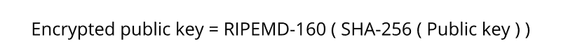
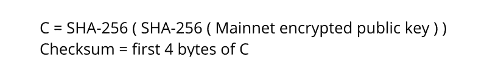
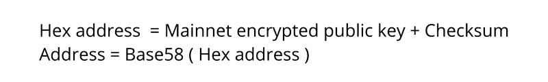
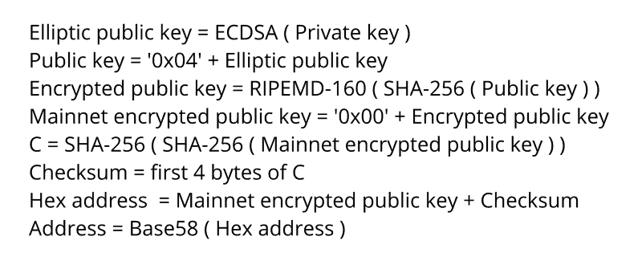

# 如何从私钥创建比特币钱包地址

> 原文：<https://www.freecodecamp.org/news/how-to-create-a-bitcoin-wallet-address-from-a-private-key-eca3ddd9c05f/>

在前一篇文章中，我们研究了生成私钥的不同方法。无论您选择哪种方法，最终都会得到 32 字节的数据。这是我们在那篇文章结尾得到的结论:

`60cf347dbc59d31c1358c8e5cf5e45b822ab85b79cb32a9f3d98184779a9efc2`

在整篇文章中，我们将使用这个私钥来导出一个公钥和比特币钱包的地址。

我们要做的是对私钥进行一系列转换，得到一个公钥，然后得到一个钱包地址。这些转换中的大多数被称为哈希函数。这些哈希函数是单向转换，不可逆转。我们不会讨论函数本身的机制——有很多很好的文章涉及到这一点。相反，我们将看看如何以正确的顺序使用这些功能，可以引导您找到您可以使用的比特币钱包地址。

### 椭圆曲线加密

我们需要做的第一件事是将 ECDSA 或椭圆曲线数字签名算法应用于我们的私钥。椭圆曲线是由方程`y² = x³ + ax + b`定义的曲线，具有选定的`a`和`b`。有一系列这样的曲线广为人知并被广泛使用。比特币使用的是 **secp256k1** 曲线。如果你想了解更多关于椭圆曲线密码的知识，我会推荐你参考[这篇文章](https://hackernoon.com/what-is-the-math-behind-elliptic-curve-cryptography-f61b25253da3)。

通过将 ECDSA 应用于私钥，我们得到一个 64 字节的整数。它由两个 32 字节的整数组成，这两个整数表示连接在一起的椭圆曲线上的点的 X 和 Y。

对于我们的例子，我们得到了:`1e7bcc70c72770dbb72fea022e8a6d07f814d2ebe4de9ae3f7af75bf706902a7b73ff919898c836396a6b0c96812c3213b99372050853bd1678da0ead14487d7`。

在 Python 中，它看起来像这样:

```
public_key_bytes = codecs.decode(public_key, ‘hex’)
# Run SHA-256 for the public key
sha256_bpk = hashlib.sha256(public_key_bytes)
sha256_bpk_digest = sha256_bpk.digest()
# Run RIPEMD-160 for the SHA-256
ripemd160_bpk = hashlib.new(‘ripemd160’)
ripemd160_bpk.update(sha256_bpk_digest)
ripemd160_bpk_digest = ripemd160_bpk.digest()
ripemd160_bpk_hex = codecs.encode(ripemd160_bpk_digest, ‘hex’)
```

注意:从代码中可以看出，在我使用来自`ecdsa`模块的方法之前，我使用`codecs`解码了私钥。这与 Python 关系更大，与算法本身关系更小，但是我将解释我们在这里做什么来消除可能的混淆。

在 Python 中，至少有两个类可以保存私钥和公钥:“str”和“bytes”。第一个是字符串，第二个是字节数组。Python 中的加密方法使用“bytes”类，将其作为输入并作为结果返回。

现在，这里有一个小陷阱:一个字符串，比方说，`4f3c`不等于字节数组`4f3c`，它等于包含两个元素的字节数组，`O&`lt；。ode 方法就是这么做的:它将一个字符串转换成一个字节数组。这对于我们在本文中要做的所有加密操作都是一样的。

### 公开密钥

一旦我们完成了 ECDSA，我们需要做的就是在我们的公钥的开头添加字节`0x04`。结果就是一个比特币全公钥，对于我们来说等于:`041e7bcc70c72770dbb72fea022e8a6d07f814d2ebe4de9ae3f7af75bf706902a7b73ff919898c836396a6b0c96812c3213b99372050853bd1678da0ead14487d7`。

### 压缩公钥

但是我们可以做得更好。您可能还记得，公钥是曲线上的某个点(X，Y)。我们知道曲线，对于每个 X，只有两个 y 定义了曲线上的点。那为什么要留下你呢？相反，让我们保留 X 和 Y 的符号。以后，如果需要，我们可以从中导出 Y。

具体如下:我们从 ECDSA 公钥中取 X。现在，如果 Y 的最后一个字节是偶数，我们添加`0x02`,如果最后一个字节是奇数，添加字节`0x03`。

在我们的例子中，最后一个字节是奇数，所以我们加上`0x03`得到压缩的公钥:`031e7bcc70c72770dbb72fea022e8a6d07f814d2ebe4de9ae3f7af75bf706902a7`。这个密钥包含相同的信息，但是它几乎是未压缩密钥的两倍短。酷！

以前，钱包软件使用长的完整版本的公钥，但现在大多数都改用压缩密钥。

### 加密公钥

从现在开始，我们需要做一个钱包地址。无论您选择哪种获取公钥的方法，都要经历相同的过程。显然，地址会有所不同。在本文中，我们将使用压缩版本。

这里我们需要做的是对公钥应用 SHA-256，然后对结果应用 RIPEMD-160。顺序很重要。

SHA-256 和 RIPEMD-160 是两种哈希函数，同样，我们不会深入讨论它们如何工作的细节。重要的是，现在我们有了 160 位整数，它将用于进一步的修改。让我们称之为加密公钥。对于我们的例子，加密的公钥是`453233600a96384bb8d73d400984117ac84d7e8b`。



下面是我们如何在 Python 中加密公钥:

```
public_key_bytes = codecs.decode(public_key, ‘hex’)# Run SHA-256 for the public keysha256_bpk = hashlib.sha256(public_key_bytes)sha256_bpk_digest = sha256_bpk.digest()# Run RIPEMD-160 for the SHA-256ripemd160_bpk = hashlib.new(‘ripemd160’)ripemd160_bpk.update(sha256_bpk_digest)ripemd160_bpk_digest = ripemd160_bpk.digest()ripemd160_bpk_hex = codecs.encode(ripemd160_bpk_digest, ‘hex’)
```

### 添加网络字节

比特币有两个网络，主网络和测试网络。主网络是所有人用来转移硬币的网络。测试网络是为了测试新功能和软件而创建的——你猜对了。

我们想生成一个地址在 mainnet 上使用，所以我们需要在加密的公钥上添加`0x00`字节。结果是`00453233600a96384bb8d73d400984117ac84d7e8b`。对于测试网，这将是`0x6f`字节。

### 校验和

现在我们需要计算 mainnet 键的校验和。校验和的概念是确保数据(在我们的例子中是密钥)在传输过程中没有被破坏。钱包软件应查看校验和，如果校验和不匹配，则将地址标记为无效。

为了计算密钥的校验和，我们需要应用 SHA-256 两次，然后取结果的前 4 个字节。对于我们的例子，双 SHA-256 是`512f43c48517a75e58a7ec4c554ecd1a8f9603c891b46325006abf39c5c6b995`，因此校验和是`512f43c4`(注意 4 个字节是 8 个十六进制数字)。



计算地址校验和的代码如下:

```
# Double SHA256 to get checksum
sha256_nbpk = hashlib.sha256(network_bitcoin_public_key_bytes)
sha256_nbpk_digest = sha256_nbpk.digest()
sha256_2_nbpk = hashlib.sha256(sha256_nbpk_digest)
sha256_2_nbpk_digest = sha256_2_nbpk.digest()
sha256_2_hex = codecs.encode(sha256_2_nbpk_digest, ‘hex’)
checksum = sha256_2_hex[:8]
```

### 正在获取地址

最后，要创建一个地址，我们只需将 mainnet 键和校验和连接起来。对于我们的例子来说，这就是。

就是这样！这是本文开头的私钥的钱包地址。

但是你可能会注意到有些不对劲。你可能见过一些比特币地址，它们看起来并不像那样。嗯，原因是它们是用 [Base58](https://en.wikipedia.org/wiki/Base58) 编码的。这有点奇怪。

下面是将十六进制地址转换为 Base58 地址的算法:

```
def base58(address_hex):
    alphabet = ‘123456789ABCDEFGHJKLMNPQRSTUVWXYZabcdefghijkmnopqrstuvwxyz’
    b58_string = ‘’
    # Get the number of leading zeros
    leading_zeros = len(address_hex) — len(address_hex.lstrip(‘0’))
    # Convert hex to decimal
    address_int = int(address_hex, 16)
    # Append digits to the start of string
    while address_int > 0:
        digit = address_int % 58
        digit_char = alphabet[digit]
        b58_string = digit_char + b58_string
        address_int //= 58
    # Add ‘1’ for each 2 leading zeros
    ones = leading_zeros // 2
    for one in range(ones):
        b58_string = ‘1’ + b58_string
    return b58_string
```

我们得到的是`17JsmEygbbEUEpvt4PFtYaTeSqfb9ki1F1`，一个压缩的比特币钱包地址。



### 结论

钱包密钥生成过程可分为四个步骤:

*   使用 ECDSA 创建公钥
*   用 SHA-256 和 RIPEMD-160 加密密钥
*   使用双 SHA-256 计算校验和
*   用 Base58 对密钥进行编码。

根据公钥的形式(完整的或压缩的)，我们得到不同的地址，但两者都是完全有效的。

下面是未压缩公钥的完整算法:



如果你想玩代码，我把它发布到了 [Github 库](https://github.com/Destiner/blocksmith)。

我正在 freeCodeCamp News 上开设一门关于加密货币的课程。第一部分是对区块链的详细描述。

我还在 Twitter 上发表了一些关于加密的随机想法，所以你可能想看看。