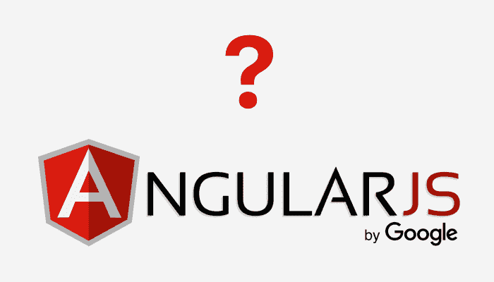

# 为什么 AngularJS 是我软件开发的首选框架

> 原文：<https://www.freecodecamp.org/news/why-is-angularjs-the-most-preferred-framework-for-software-development-5253c2c569c9/>

作者:瑞秋·雷

# **为什么 AngularJS 是我软件开发的首选框架**

AgularJS 是当今最通用、最流行的框架之一。谷歌在 2012 年推出了它。它提供了一个可扩展的基础设施，支持谷歌最大的应用程序。

AngularJS Development

[**AngularJS**](https://angularjs.org/) ，一个结构化的 JavaScript 框架，构建动态的单页面应用。它是一个支持多种平台的客户端框架。这个框架的所有功能和命令都使用 HTML 脚本编写的代码模板。

此外，AngularJS 框架有许多强大的功能。这些特性允许将任何应用程序逻辑从 DOM(文档对象模型)操作中分离出来。它还提供了许多令人惊叹的有用特性。这就是为什么 [**AngularJS 开发**](https://www.goodfirms.co/directory/languages/top-software-development-companies/angularjs) 往往是商家的首选。

### **以下是 AngularJS 提供的功能列表**

#### **1。模型视图控制器(MVC)框架**

MVC 是一种开发 web 应用程序的软件设计模式。它由以下部分组成:

**模型:**模式的第一层，负责维护数据。它类似于原始数据类型，如布尔值、数字、字符串或对象。这是最简单的脚本，没有任何 getter 和 sorter 方法。

**视图:**负责向用户显示部分数据。它们以控制器动作触发的特定格式显示数据。

**控制器:**控制模型和视图的交互。它响应用户输入并与数据模型对象交互。控制器接收输入，验证输入，然后执行操作。

由于 AngularJS 是一个开源脚本，工作模型基于 MVC 模式和最新的客户端 JavaScript。AngularJS 中的模型视图框架控制架构是简单、通用和动态的。

MVC 使构建独立的客户端应用程序变得更加容易。有了 AngularJS，即使 MVC 元素是单独开发的，你也可以把它们组合起来。不需要编写额外的代码来将所有属性组合在一起。

#### **2。HTML 用户界面**

AngularJS 的用户界面是建立在 HTML 之上的。它是一种声明性语言，标签较短，非常容易理解。甚至它提供的界面也是有组织的、流畅的、结构化的。

很多时候，开发、组织和重组 JavaScript 接口变得很复杂。所以，HTML 接口也可以规范应用程序的实现。因此，不需要理解程序流程和加载，你可以定义你想要的，AngularJS 会切割出依赖关系。

#### **3。POJO 型号**

与其他框架相比，AngularJS 使用 POJO(普通旧 JavaScript)对象。现在，这意味着您不需要添加额外的 getter 和 setter 元素来绑定 AngularJS 和额外的数据源。

POJO 模型还提供了自发的和计划良好的对象。开发人员必须创建具有所需属性的对象循环和数组循环。然后他们需要调整和重构它。

这使得 AngularJS 能够自给自足且易于使用。POJO 模型的良好规划和快速应用是在您的下一个开发项目中使用 AngularJS 的[原因之一。](https://topcompaniesreview.wordpress.com/2018/05/15/what-makes-angularjs-a-powerful-javascript-framework-for-your-web-development/)

#### **4。谷歌上的活跃社区**

每当您想要采用一个开发框架时，您总是会寻找良好的社区支持。AngularJS 在这里也没有让人失望。

为什么？因为谷歌维护 AngularJS。除此之外，它是在 MIT 许可下发布的，可以在 GitHub 上下载。

因此，如果您有任何维护问题或遇到困难，有许多论坛可以解决您的疑问。此外，如果您有任何建议或任何可以改进的东西，源代码很容易下载。

#### **5。路由**

路由基本上是从一个视图到另一个视图的过渡。现在，这是单页应用程序的关键方面。

在单页应用程序中，所有内容都在一个页面中。开发人员不希望用户每次点击菜单或子菜单时都被重定向到一个新页面。开发人员希望内容在同一个页面上异步加载，只改变 URL。

几乎所有的网站都采用这种方法。一些流行的平台如 Chrome 应用商店和 Twitter 就是单页应用的最好例子。这种方法帮助用户感觉好像他们正在与桌面应用程序交互。

现在，有了 AngularJS，这变得很容易，你可以为不同的 URL 创建不同的视图。AngularJS 还使您能够为特定的 URL 请求在主页中加载适当的视图。这也是[开发者喜爱 AngularJS](https://www.goodfirms.co/directory/languages/top-software-development-companies) 的另一个原因。

#### **6。双向绑定**

数据绑定是视图和模型之间数据的自动同步。视图表示 HTML，模型表示 JavaScript 变量。

在 AngularJS 中，您可以轻松地构建一个模板，该模板可以将不同的组件与不同的模型绑定在一起。这样，每当任何 HTML 或视图组件的值不同时，绑定的模型值也会得到更新。

假设输入文本值发生变化，那么绑定的模型也会相应地发生变化和更新。为了控制变化的数据，不需要编写单独的回调函数集。

通过双向数据绑定，应用程序的表示层变得非常简单。因此，用户界面是干净的，并具有改进的吸引力。此外，复杂的数据操作和计算可以轻松完成。

### **总而言之**

使用 AngularJS 构建的跨浏览器 web 应用程序具有用户友好性和交互性。AngularJS 的另一个好处是，它分析页面 DOM，然后构建基于 AngularJS 特定元素的绑定。

因此，与其他框架相比，它大大减少了编码部分。一个应用程序的单一代码集，你的任务就完成了。此外，更少的编码意味着减少出错的机会。

AngularJS 是一个伟大的多功能框架，它可以加速你的开发过程。它提供了依赖注入和深度链接，是软件开发的健壮平台。