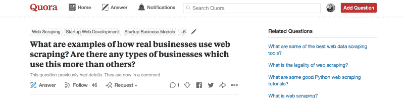
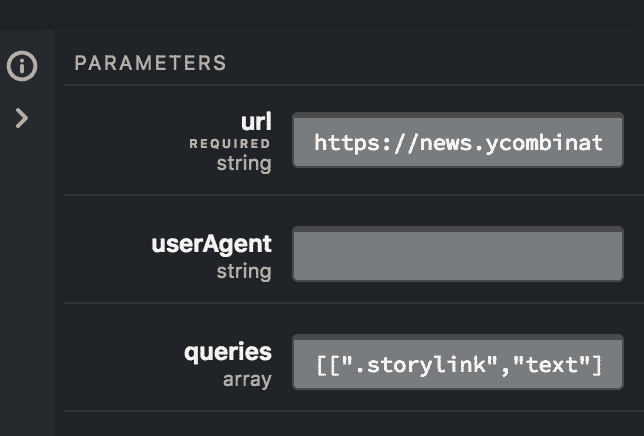
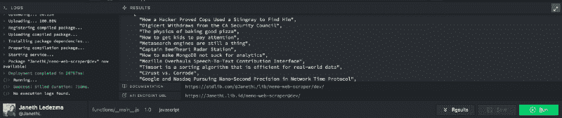
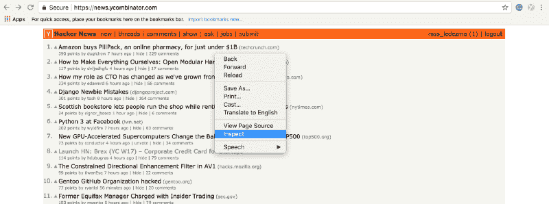
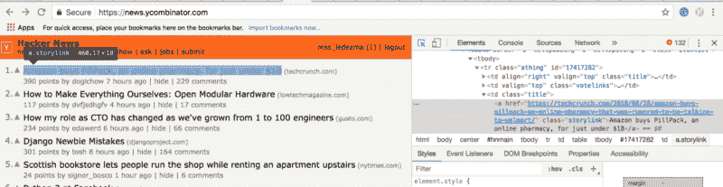
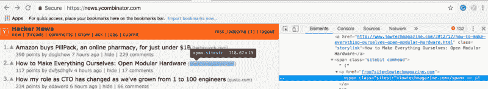
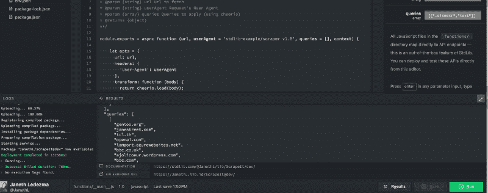

# 如何使用标准库和 Node.js 轻松抓取网站信息

> 原文：<https://www.freecodecamp.org/news/scrape-websites-for-information-easily-using-code-xyz-and-node-js-8be3e2f938ab/>

作者 Janeth Ledezma

# 如何使用标准库和 Node.js 轻松抓取网站信息

web scraper 是一种工具，它允许我们选择网站的非结构化数据并将其转换为结构化数据库。那么 web scraper 在哪里会派上用场呢？我已经列出了我最喜欢的用例，让您对推出自己的用例感到兴奋！

[This question on Quora](https://www.quora.com/What-are-examples-of-how-real-businesses-use-web-scraping-Are-there-any-types-of-businesses-which-use-this-more-than-others) encouraged me to build my web scraper.

*   抓取房地产列表——企业使用网络抓取来收集已经列出的房产
*   从零售商或制造商网站上收集产品/产品评论，展示在您的网站上，提供规格/价格对比
*   抓取新闻网站以应用自定义分析和管理(手动或自动)，为您的受众提供更有针对性的新闻
*   收集电子邮件地址以挖掘潜在客户

你可以在这里阅读 [web scraper 的其他便利用例](https://www.quora.com/What-are-examples-of-how-real-businesses-use-web-scraping-Are-there-any-types-of-businesses-which-use-this-more-than-others)。

现在让我们开始吧！举个简单的例子，我们将抓取黑客新闻的首页来获取链接的标题。

如果你还不熟悉[标准库](https://stdlib.com/?utm_source=content&utm_medium=blog&utm_campaign=scrape_service)，那你一定会喜欢！[标准库](https://www.freecodecamp.org/news/scrape-websites-for-information-easily-using-code-xyz-and-node-js-8be3e2f938ab/undefined)是一个 API 开发和发布平台，可以帮助您使用浏览器内 API 编辑器[在标准库上构建和发布代码。](https://code.stdlib.com)

### 第一步:在标准库上登录代码

第一步是前往[https://code.stdlib.com](https://code.stdlib.com)/创建一个免费账户。[标准库上的代码](https://code.stdlib.com)是由[标准库](https://stdlib.com/?utm_source=content&utm_medium=blog&utm_campaign=scrape_service)的团队构建的在线 API 编辑器——一个用于快速构建 API、webhooks 和工作流自动化任务的嵌入式开发环境。

在左下角点击**(签到)**。如果您有一个[标准库](https://stdlib.com/?utm_source=content&utm_medium=blog&utm_campaign=scrape_service)账户，点击**已经注册，**并使用您的[标准库](https://stdlib.com/?utm_source=content&utm_medium=blog&utm_campaign=scrape_service)凭证登录。将弹出一个模态，提示您声明一个名称空间(这是您的用户名)。输入您的电子邮件并选择密码。

创建帐户后，将出现一个不同的模块，列出订购计划。你只需要一个免费账户就可以开始了，但是你可以在这里阅读更多关于标准图书馆的定价包。

一旦你点击**订阅+赚取积分，**你应该会看到一个确认消息弹出。

点击**继续**返回登陆页面。

### 第二步:选择 Web Scraper 源代码

从源代码中选择**API**按钮**。** [标准库](https://stdlib.com/?utm_source=content&utm_medium=blog&utm_campaign=scrape_service)源代码旨在简化不同类型项目的创建。源代码为样板代码和目录设置等提供了默认值，因此您可以直接开发和实现更复杂的功能。

您应该会看到一个已发布源代码的列表。向下滚动并选择 **@nemo/web -scraper** 。确保为你的 API 输入你想要的名字，然后点击**ok**(或者按回车键)

然后，您将在:`functions/__main__.js`下看到您的端点代码

在右侧，您会注意到一个参数框。

在 URL 必需的参数类型中:

`[https://news.ycombinator.com/](https://news.ycombinator.com/)`

在查询中键入:

`[[".storylink", "text"]]`

选择绿色的**运行**按钮。

几秒钟之内，你就会在标准库的[代码的**结果**部分下，看到一个来自](https://code.stdlib.com)[黑客新闻](https://news.ycombinator.com/)首页的链接标题列表。您将注意到一个文档门户——将文档 URL 复制并粘贴到浏览器的一个新选项卡中，以查看您的 API 在标准库上的信息。

### 它是如何工作的？

web scraper 向 URL 发出一个简单的 GET 请求，并在结果页面上运行一系列查询，然后返回给您。它使用强大的 [cheerio](https://github.com/cheeriojs/cheerio) DOM(文档对象模型)处理器，使我们能够使用 [CSS 选择器](https://www.w3schools.com/cssref/css_selectors.asp)从页面中抓取数据！CSS 选择器是用来选择你想要组织的元素的模式。

### **如何使用 CSS 选择器进行查询**

网页是用 HTML 等标记语言编写的。HTML 元素是 HTML 文档或网页的一个组成部分。元素定义了信息在浏览器上向人眼显示的方式，比如图像、多媒体、文本、样式表、脚本等。

对于这个例子，我们使用了“[”。class "选择器](https://www.w3schools.com/cssref/css_selectors.asp) (class = "。storylink”)从黑客新闻首页的所有元素中获取所有超链接的标题。

如果你想知道如何找到组成一个网站的元素的名字，请允许我向你展示！

启动[谷歌浏览器](https://www.google.com/chrome/?brand=CHBD&gclid=EAIaIQobChMI87WK1Iya3AIVh_hkCh1hMgIIEAAYASAAEgKilfD_BwE&gclsrc=aw.ds&dclid=CLuW3dWMmtwCFcq5ZAodXTwHBA)，输入我们的[黑客新闻](https://news.ycombinator.com/)网址`[https://news.ycombinator.com/](https://news.ycombinator.com/)`。然后右击任意文章标题，选择“ **inspect。**“这将在谷歌浏览器上打开网络控制台。或者可以用**命令键** ( **⌘) +选项键(⌥ ) + J 键。**

Right Click and Select Inspect

web 开发人员控制台将在屏幕右侧打开。请注意，当您选择链接的标题时，控制台上的一个部分也会突出显示。突出显示的元素将“类”定义为“故事链接”现在你知道如何在任何网站上找到元素的名称了！

如果你想在[黑客新闻](https://news.ycombinator.com/)上查询不同的元数据，将光标悬停在上面。下面你可以看到我是如何找到的。class selector = "sitestr "通过将鼠标悬停在 Hacker News 上的元素上来查询链接的 URL。

### 就这样，也谢谢大家！

感谢阅读！我希望您能在这里、**给我发电子邮件**，或者在 Twitter 上关注[标准库](http://www.stdlib.com?utm_source=content&utm_medium=blog&utm_campaign=scrape_service)、 [@StdLibHQ](https://twitter.com/StdLibHQ) 。如果你想让标准库团队展示或分享什么令人兴奋的东西，请告诉我——我很乐意帮忙！

Janeth Ledezma 是 Standard Library 和 Berkeley grad-go bears 的开发者支持者。？当她不学习阿拉伯语或健身时，你会发现她骑着她的 CBR500R。？？在 Twitter @ms [s_ledezma 上关注她的标准图书馆之旅。](https://twitter.com/mss_ledezma)