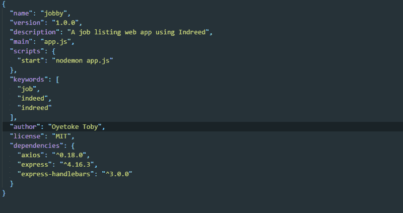
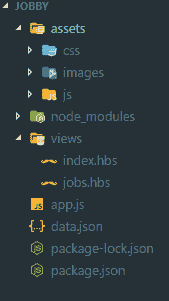
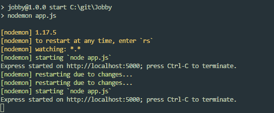
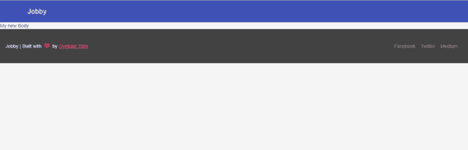
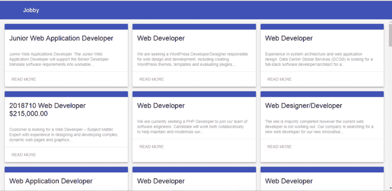
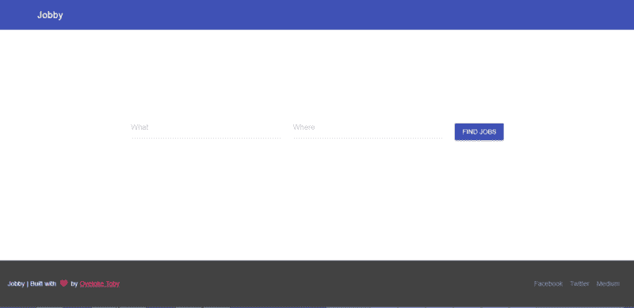
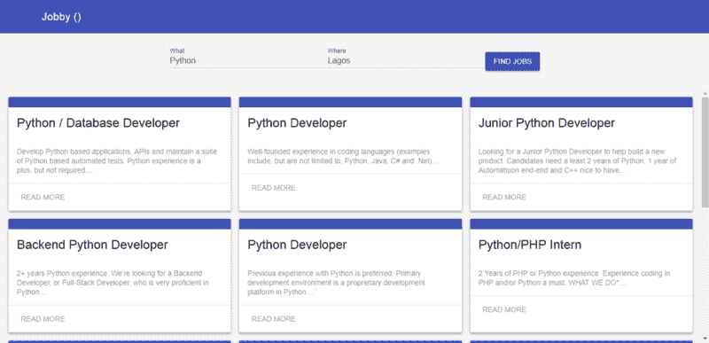

# 我如何使用 Node.js 构建工作抓取 web 应用程序

> 原文：<https://www.freecodecamp.org/news/how-i-built-a-job-scraping-web-app-using-node-js-and-indreed-7fbba124bbdc/>

作者:奥耶托克·鸢·伊曼纽尔

# 我如何使用 Node.js 构建工作抓取 web 应用程序


多亏了 Indreed，从网上抓取工作现在变得更容易了。

### 确实是这样

Indreed 是一个 Rest API，用于抓取网络上的工作。它由我的个人 web 抓取项目提供支持，并基于 rest API。这是一个真正的 Rest API，可以在使用任何编程语言的任何平台上使用。它支持 CORs，所以你可以从外部网页使用它。Indreed 支持多种过滤器，您可以使用这些过滤器来微调您的工作结果。有了 Indreed，你可以在网上获得几乎所有你需要的关于工作的信息。文件可以在这里[找到。](https://documenter.getpostman.com/view/4679966/indreed/RWEiLy2s)

### 构建 Web 应用程序

在本教程中，我们将使用 Node.js 构建一个工作列表 web 应用程序。我们将使用的技术堆栈包括:

1.  用于执行 Rest API 调用的 Axios
2.  [表示](https://expressjs.com/)为服务器
3.  [手柄](http://handlebarsjs.com/)为模板语言。
4.  是的，我们将为我们的 UI/UX 使用 [MDL](http://getmdl.io) 。

让我们开始吧…

打开您的终端:

```
mkdir jobby && cd jobbynpm init -ynpm install --save express axios express-handlebarsnpm install --save-dev nodemon
```

完成后，在您喜欢的文本编辑器中打开创建的`package.json`文件，您应该会看到如下内容:



package.json

我已经添加了一个描述，将我的 main 指向`app.js`，并添加了关键字、我的名字和 nodemon 用于实时重载。

现在让我们设置一个基本的 express 服务器和手柄模板引擎。在您的项目目录中创建`app.js`文件:

确保您有如下所示的相同文件夹结构:



folder setup (ignore the `data.json)`

现在我们需要在 views 文件夹中创建一个`index.hbs`文件来保存我们的 HTML:

运行 app，基本可以用`node app.js`。万一要用 nodemon，可以做`nodemon app.js`。



您现在可以在浏览器中打开`[http://localhost:5000](http://localhost:5000)`。



万岁！

现在让我们尝试使用 axios 从 Indreed API 获取作业，然后使用 handlebars 对其进行格式化。

打开`app.js`并更新`app.get("/")`:

然后用以下内容替换`{{ body }}`:

```
<div class="mdl-grid portfolio-max-width">{{# each jobs }}   <div class="mdl-cell mdl-card mdl-shadow--4dp portfolio-card">   <div class="mdl-card__media"></div>   <div class="mdl-card__title">   <h2 class="mdl-card__title-text">{{ this.title }}</h2>   </div>   <div class="mdl-card__supporting-text">   {{ this.summary }}   </div>   <div class="mdl-card__actions mdl-card--border">   <a class="mdl-button mdl-button--colored mdl-js-button mdl-js-   ripple-effect mdl-button--accent" href="{{ this.url }}">Read   more</a>   </div>   </div>{{/each}}</div>
```

**注**:对此，我们只显示`title`、`summary`和`url`。您还可以添加其他信息，请查看。

刷新它，你会惊叹:



恭喜，您刚刚构建了一个简单的工作列表 web 应用程序。

让我们来分解一下我们刚刚构建的内容:

*   我们使用`*axios*`向 Indreed API 发送了一个`*GET*`请求
*   这获取了 web 开发人员的工作列表
*   并返回我们传递到手柄中的 JSON 数据来帮助我们遍历它
*   显示结果。

我们的应用程序只是显示`web developer`工作。如果我们希望看到其他类型的工作呢？从代码方面去改变它是愚蠢的。因此，我们接下来要做的是创建一个简单的表单来过滤作业结果。

让我们创建一个`/search`端点:

接下来，创建`search.hbs`:

让我们添加一些 CSS:

接下来，用这个更新你的主页模板:

现在我们已经完成了模板，让我们去清理我们的`app.js`:

就这样，我们结束了。



### 一些建议

1.  **位置**:检测用户位置的应用程序是你可以添加的东西，让 Indreed 更加智能。我建议你使用 [Express-IP](https://www.npmjs.com/package/express-ip) ，一个获取 IP 信息的快速中间件。您可以按如下方式使用它:

如果您在本地主机上，可能会返回 null(这就是为什么有 if 语句的原因)。

2.**高级搜索结果** : Indreed 有多种过滤器可以用来过滤你的工作结果，我们只使用了`q`和`l`。因此，您可以添加一个利用一些可用过滤器的表单:

3.**认证**:您可以添加一个认证系统，为用户个性化搜索结果。这样，用户可以选择他们想看的工作类别，当他们登录时，你可以继续推荐相关的工作。

4.**缓存:**如果您想在不通过认证的情况下为用户个性化搜索结果，您可以选择使用**缓存。**

### 短信

我是 Indreed API 的创建者，它目前处于 Alpha 阶段。正如你所看到的，它托管在 Heroku 上，在结构、性能、速度和托管方面仍然需要很多改进。为了推进这项工作，你可以联系我(oyetoketoby80[at]gmail.com)或通过我的 patreon 页面提供帮助。[http://patreon.com/oyetoketoby](http://patreon.com/oyetoketoby)

本文到此为止。你可以从[这里](https://github.com/CITGuru/Jobby)获取代码，也可以查看现场演示:【http://jobbyio.herokuapp.com】T2。

如果你喜欢这篇文章，请鼓掌并分享给其他人。