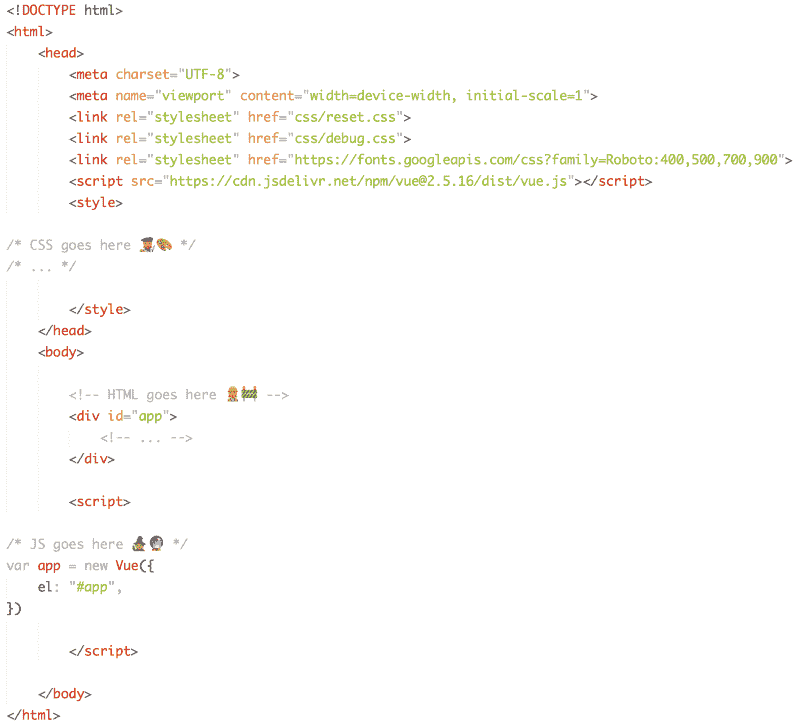
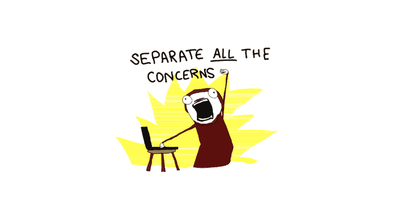
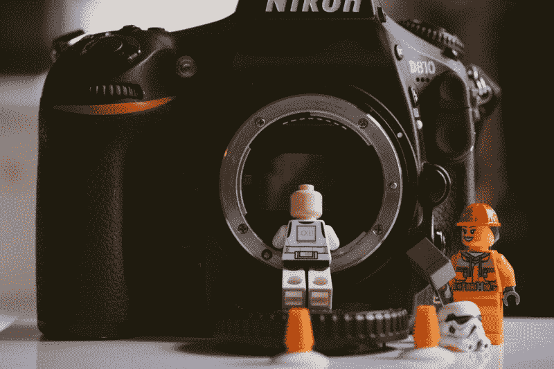

# 在这个免费的课程中学习 Vue.js！？✨

> 原文：<https://www.freecodecamp.org/news/learn-vue-js-in-our-free-course-85d5df41e47f/>

作者 ZAYDEK

# 在这个免费的课程中学习 Vue.js！？✨

#### 让我们做些有意义的事情

在我开始写这篇文章之前，我只想分享我正在开发一个产品，我很乐意收集一些关于如何更好地为 web 开发人员服务的数据。我创建了一个[简短问卷](https://twitter.com/username_ZAYDEK/status/1103914471267790854)在阅读这篇文章之前或之后进行检查。请检查一下，谢谢！现在，回到我们的常规节目。

### 你好互联网！

你可能不知道 Vue 是什么——没关系——见鬼，你可能不知道，肯定不知道我是谁！我是 [Zaydek](http://twitter.com/username_ZAYDEK) ，是一名经验丰富的平面设计师和程序员。[我刚刚发布了一个免费课程](https://scrimba.com/g/glearnvue)来帮助开发者学习一些 Vue！我在这里向您介绍学习和使用这个令人惊叹的开源框架所带来的所有可能性。

在这篇文章中，我详细介绍了如何考虑 Vue。我还迭代了开始编写静态和动态网站所需的构件，比使用普通 JavaScript 要容易一个数量级。？Vue 既是编写 web 应用程序的范例，也是学习和编程 JavaScript 的惯用指南。

#### 我也教 JavaScript？✨需要开始学习我刚刚发布的 Vue 课程。从基础开始学习 Vue，以及如何构建一些东西。点击这里免费注册！

Click to enroll in my free Vue course!

该课程在[Scrimba.com](https://scrimba.com/g/glearnvue)上讲授，这是一个**新的互动网站，用于学习和分享如何编码**。截屏可以被打断和编辑，使学习变得活跃和有趣。

### Vue 不是一个东西

一个框架可以被认为是一个通用的工具箱，配备了解决不同问题的工具，但是所有的工具一起帮助完成一些任务。就 Vue 而言，这个任务就是轻松地构建可维护的、习惯性的 web 应用——真的——并从中获得乐趣！

让我们客观地看待事情。Vue 可以像一个脚本标签一样简单，我们可以将它包含在我们的网站中，将它们转化为 web 应用程序。但它也可以是一个完整的生态系统，依靠构建过程来简化复杂而强大的 web 应用程序。

在本文和本课程中，我将重点学习 Vue 提出的核心概念，并假设不了解命令行或什么是构建过程。

### 课程涵盖的内容

本课程分为三个部分:

1.  学习开始使用 Vue 所需的最基本的 JavaScript
2.  学习 Vue 的核心概念，以及
3.  两个更高级的例子概述(我做的两个可爱好玩的 web apps:薛定谔的 Div？那 a 呢。颜色选择器)。

我喜欢 Vue 的一点是，它为如何思考和构建 web 应用程序提出了一些有趣的想法。有几个想法我认为是最有趣的——尽管这并不能暗示 Vue 能做的所有事情:

*   从 DOM 中分离数据
*   惯用的 JavaScript
*   模板和基于组件的 HTML
*   管理事件处理

但是在我们开始之前，让我们先来看看如何通过一个简单的脚本标签将 Vue 连接到一个网站:

你可以把一个网络应用想象成一个网站的内部或者顶部。因此，一个 web 应用程序在`
开始它的生命，从脚本标签内部插入 i `n via new Vue({ el: "#a` pp" }。这就是我们如何创建从 JavaScript 到 HTML 的关系(`wh` ere el 是 element 的缩写)。

这是第一个选项，Vue 支持很多选项，比如`data`和`methods`。这些类似于我们的 web 应用程序的变量和函数。

**注意:** Vue 有两种口味:？有 d [开发](https://cdn.jsdelivr.net/npm/vue/dist/vue.js)和 p [生产](https://cdn.jsdelivr.net/npm/vue)版本。开发版本会发出详细的错误消息和警告，以支持开发人员在 Vue 中工作。生产版本针对速度和大小进行了优化。

除此之外，[还有一个官方的 Chrome 扩展](https://chrome.google.com/webstore/detail/vuejs-devtools/nhdogjmejiglipccpnnnanhbledajbpd)，使得管理应用程序的状态和调试变得不那么痛苦。

### 从 DOM 中分离数据

Credit [Daniel Cheung](https://unsplash.com/photos/bO4UR1VzQu8)

如前所述，Vue 提出的一个很好的建议是将数据从 DOM 中分离出来。DOM 代表文档-对象-模型，它可以被认为是组成我们网站的元素树。开始和结束元素之间的文本就是我所说的数据。在 Vue 中，我们不硬编码它——我们把它分离出来，放入前面提到的来自 Vue 实例内部的`data`对象。

这种想法也被称为虚拟 DOM。这似乎无关紧要，但事实是，将数据放在一个地方意味着我们知道如何以及在哪里更新它。因为 Vue 是反应性的，每当我们更新所述数据时，这种变化就会在我们的 web 应用中传播。由于这种关系，可以认为 Vue 中的数据比普通 HTML 中的数据更有活力。

这些想法将在第三个视频中探讨。

### 惯用的 JavaScript

Credit [Daniel Cheung](https://unsplash.com/photos/ZqqlOZyGG7g)

对我来说，Vue 让 JavaScript 成为一门值得学习的语言，因为它让 JavaScript 有了意义。我的意思是，从一个`new Vue({ ... })`内部，我们如何以及在哪里学习争论 JavaScript。如上所示，变量是附加到`data`对象的键值对，函数是附加到第二个对象`methods`的键值对。对象数据和方法都是可选的——记住，这些是我们的 web 应用程序的选项。

但是 Vue 走得更远:Vue 有很多选项，这些选项是以我们在 Vue 实例中挂接的对象的形式出现的。总的来说，这类似于用 JavaScript 编程的惯用指南和方法。因此，留给程序员的架构决策很少。这意味着编写和阅读 Vue 有一种连贯性和优雅，比解构一个普通的 JavaScript 应用程序如何工作更容易掌握。

这些想法将在第四部电影中探讨。

### 模板化 HTML

Credit [Daniel Cheung](https://unsplash.com/photos/dDppsuM_UpE)

大多数人不会认为 HTML 是一种编程语言。但我认为编程语言的目的的合理定义是这样的:解释和转换数据，比如读取和编译源代码。

鉴于 Vue 的属性，比如`v-for`、`v-if`等等，对我来说，HTML 开始类似于一种带有控制流的编程语言。这意味着我们可以更好地控制我们程序的数据流(例如，我们网站的内容或者我一直称之为数据的东西)。

值得一提的是，模板框架，如 [Jekyll](https://jekyllrb.com/) 和 [Hugo](https://gohugo.io/) ，是用来帮助开发者使用一种控制流创作基于静态的网站的。尽管这很好，但它仅限于静态网站，因为这些框架编译成 HTML，而不是解释 HTML。

能够访问实时控制流，比如 for 循环和 if 语句，意味着 Vue 可以做更多的事情，而且是实时的。这是网站和网络应用程序(静态内容和动态内容)的最大区别之一。

这些想法将在第五部电影中探讨。

### 组件和道具

Credit [James Pond](https://unsplash.com/photos/jnL0gfo_5Rg)

我花了很长时间才意识到变量和属性之间的区别。变量存储数据，而属性是 JavaScript 中附加到对象的变量。所以组件可以被认为是 HTML 混合。一个什么？mixin 就像一个函数，但是它不是返回数据，而是将数据混合到文档中。例如，它为我们编写 HTML，因此我们不必重复自己！

这不是一件小事。Vue 中组件和 props 的好处意味着我们可以将整个 HTML 代码块重构为一行程序，可以通过 props 进行定制。这意味着我们现在可以创作自定义元素，公开对其内部的访问，而不会使公共 HTML 过于复杂。这对于可维护和可读的代码来说都是一个巨大的胜利。

这些想法将在第六部电影中探讨。

### 管理事件处理

Credit [James Pond](https://unsplash.com/photos/gQ-h3k7vHjc)

虽然我们到目前为止谈论的一切都很吸引人，但它没有谈到用户交互，这是网站与 web 应用程序之间的关键区别之一。一个网站通常意味着某种或多或少静态的东西，除了收集数据之外，并没有被设计或打算与用户进行太多的交互。在一个实际的 web 应用程序中，类似于本地应用程序，交互是最重要的。？这种想法也被称为动态网站或 web 应用程序。

由于 Vue 既是一个框架又是一个生态系统，它对此也有惯用的解决方案。我在课程中教授的最简单的一个是`@click="function()"`处理程序，我们将它作为 HTML 属性插入到元素中。这个简单的代码片段为我们提供了一种与数据交互的方式，就像我们插入到元素中的属性一样简单。这意味着我们可以遵从 JavaScript，而不是 HTML 或 CSS 来实现丰富的用户交互。

这些想法将在第七部电影中探讨。

#### 学习 Vue 还有很多东西要学，所以我就这个主题又写了两篇文章。求求你，看完这篇文章，看看吧！

Left: “[Building Schrödinger’s div ? with Vue!”](https://medium.freecodecamp.org/building-schr%C3%B6dingers-div-with-vue-4068f6423830) Right: “H[ow to make a ? color picker with Vue!”](https://medium.freecodecamp.org/how-to-make-a-color-picker-with-vue-9640043b6c82)

### Vue 让网络变得有意义

在 Vue 之前，我熟悉 HTML 和 CSS。我很乐意制作一些吸引人的网站，但仅此而已。我探索了一些框架(就像我在这篇文章中讨论的关于静态编译的那些)，并仔细研究了 Angular 和 React，但是在探索这些框架时，我没有得到正确的感觉。我想要的是轻便和直观的东西，我相信我已经在 Vue 身上找到了。

最后，如果我们能创造出我们想要构建的东西，那么我们使用什么工具并不重要。但问题是，很难将工具与用于构建产品或服务的思维分开。这既是好事也是坏事。一方面，它会让我们变得小心眼。但另一方面，我们使用的工具也可以作为学习新的有趣想法的教学工具。我爱那些同时又忍不住教我的工具，也因为这个原因我不能更推荐 Vue 了！

所以，请到美丽的世界中去，学习一些 Vue 吧！可以(！)做出惊人的事情，甚至改变别人的生活，甚至是你自己的生活。如果有帮助的话，[试试免费课程](https://scrimba.com/g/glearnvue)！

