# 在 ASP.NET 核心 2.0 中使用 Google 进行身份验证

> 原文：<https://www.freecodecamp.org/news/authentication-using-google-in-asp-net-core-2-0-5ec32c803e23/>

作者:安基特·夏尔马

# 在 ASP.NET 核心 2.0 中使用 Google 进行身份验证


Photo by [Jason Blackeye](https://unsplash.com/photos/8yYAaguVDgY?utm_source=unsplash&utm_medium=referral&utm_content=creditCopyText) on [Unsplash](https://unsplash.com/search/photos/security?utm_source=unsplash&utm_medium=referral&utm_content=creditCopyText)

### 介绍

有时，我们希望用户使用他们现有的来自第三方应用程序的凭证登录，比如脸书、Twitter、Google 等等。在这篇文章中，我们将研究使用谷歌账户对 ASP.NET 核心应用的认证。

### 先决条件

*   安装。NET Core 2.0.0 以上 SDK 从[这里](https://www.microsoft.com/net/core#windowscmd)。
*   从[这里](https://www.visualstudio.com/downloads/)安装最新版本的 Visual Studio 2017。

### 创建 MVC Web 应用程序

打开 Visual Studio 并选择文件>>新建>>项目。选择项目后，将会打开一个“新项目”对话框。选择。NET Core 内的 Visual C#菜单从左侧面板。然后，选择“ASP。NET Core Web Application”从可用的项目类型。将**项目的名称设为** *s* GoogleAuth，然后按 OK。参考这张图。

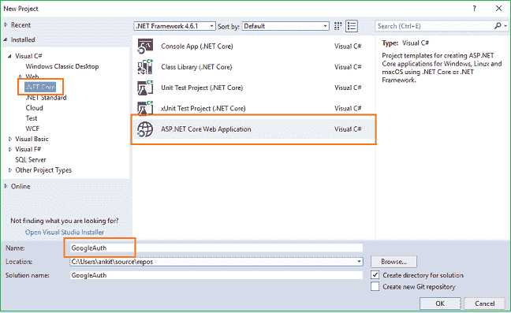

单击 OK 后，将打开一个新对话框，要求您选择项目模板。您可以在模板窗口的左上角看到两个下拉菜单。选择”。NET Core”和“ASP。NET Core 2.0”。然后，选择“Web 应用程序(模型-视图-控制器)”模板。单击“更改验证”按钮，将会打开“更改验证”对话框。选择“个人用户帐户”并单击确定。现在，再次单击 OK 创建我们的 web 应用程序。

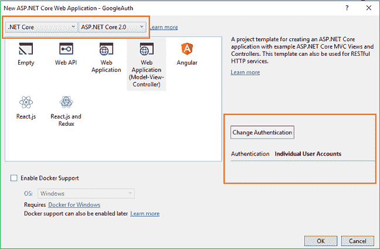

在运行应用程序之前，我们需要将迁移应用到我们的应用程序中。

导航到工具>>获取软件包管理器>>软件包管理器控制台。

它将打开软件包管理器控制台。输入 **Update-Database** 命令，并点击回车。这将使用实体框架代码优先迁移来更新数据库。


按 F5 运行应用程序。您将看到一个主页，如下所示。

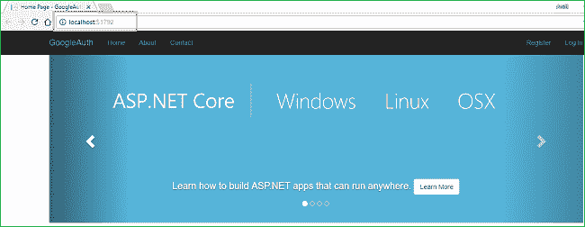

请注意浏览器地址栏中的 URL。在这种情况下，URL 是 [http://localhost:51792/。](http://localhost:51792/.)我们需要这个 URL 来配置我们的 Google 应用程序，这将在下一节中进行。

### 创建谷歌应用程序

我们需要在 Google API 控制台上创建一个新的 Google 应用程序。导航到[https://console . developers . google . com/project selector/APIs/library](https://console.developers.google.com/projectselector/apis/library)并使用您的 Google 帐户登录。如果您没有 Google 帐户，您需要创建一个。没有 Google 帐户，您无法继续。登录后，您将被重定向到 API 管理器库页面，如下所示。

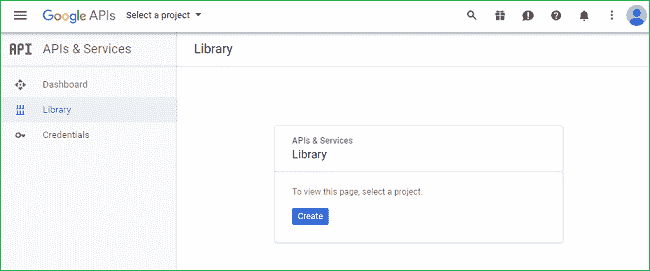

单击“创建”按钮，转到“新建项目”页面，在这里您需要创建一个新项目。“项目名称”字段将自动填充谷歌提供的默认名称。如果您愿意，可以用自己的自定义名称覆盖它。对于本教程，我们将使用默认名称。接受服务条款然后点击**创建** 按钮*。*

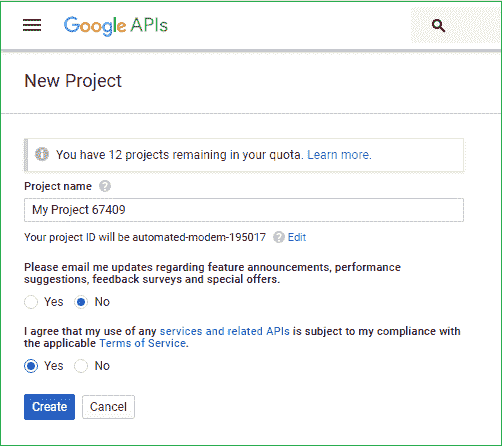

您的项目将被成功创建，您将被重定向到 API 库页面，如下所示。

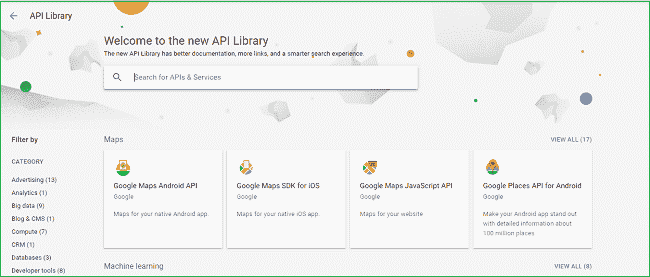

在搜索栏中搜索 Google+ API，并从搜索结果中选择 Google+ API。参考下图。

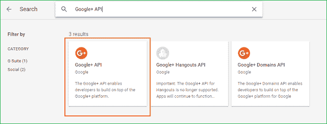

选择 Google+ API 选项后，你将被重定向到如下所示的页面，在这里你需要点击 **Enable** 按钮。

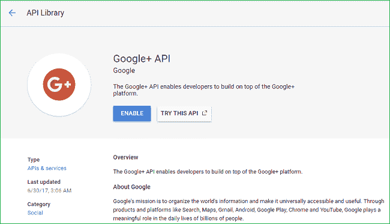

此后，Google+ API 将被启用，您将被重定向到 API 主页。点击页面右侧的**创建凭证** 按钮，为您的 API 配置密码。

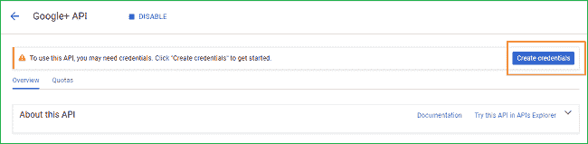

您将看到一个“向您的项目添加凭据”表单。

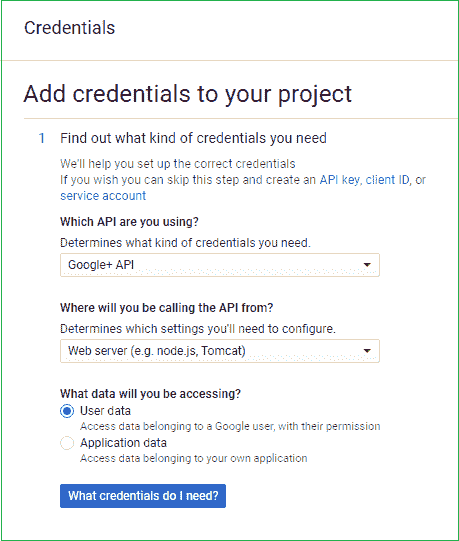

该表单有三个部分。

如下所述填写各部分的详细信息。

#### 第 1 部分—了解您需要哪种凭证

*   你用的是哪个 API？— Google+ API
*   您将从哪里调用 API？— Web 服务器(例如 Node.js、Tomcat)
*   您将访问哪些数据？—用户数据

并点击**我需要什么凭证**按钮。您将被重定向到第 2 部分

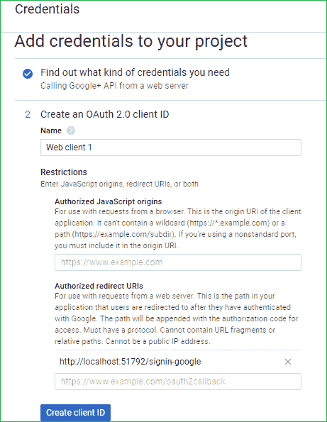

#### 第 2 部分—创建 OAuth 2.0 客户端 ID

*   name——Google 提供的默认值。
*   授权的 JavaScript 来源—留空。
*   授权重定向 URIs——给你的应用程序的基本 URL 加上 **/signin-google** 。对于本教程，URL 将是[http://localhost:51792/sign in-Google。](http://localhost:51792/signin-google.)输入网址后，按 TAB 添加数值。

之后，点击**创建客户端 ID** 按钮。您将被重定向到第 3 部分。

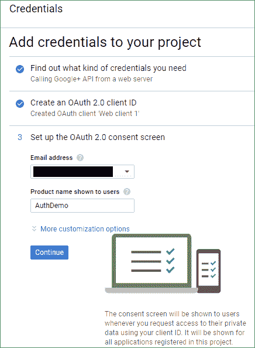

#### 第 3 部分—设置 OAuth 2.0 同意屏幕

*   电子邮件地址—从下拉列表中选择您的电子邮件地址。为了保密，该值在上面的图像中被掩盖了。
*   向用户显示的产品名称—输入任何产品名称。这里我们使用“AuthDemo”作为产品名称。

**注意**:请勿在您的产品名称中使用“Google”一词。系统会提示您出现错误，并且不允许您创建应用程序。这意味着“GoogleAuthDemo”是一个无效的名称。

点击继续。

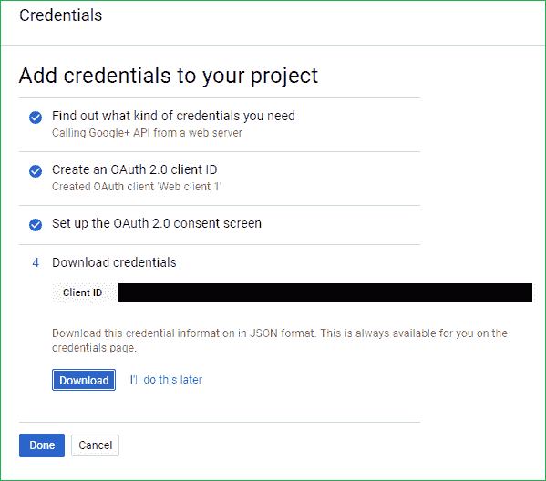

您的凭据已成功创建。点击**下载**下载一个 JSON 文件到你的本地机器，里面有你所有的应用秘密，然后点击**完成**完成这个过程。

打开刚刚下载的 **client_id.json** 文件，记下 **ClientId** 和 **ClientSecret** 字段。我们将需要这些值在我们的 web 应用程序中配置 Google 身份验证。

### 将您的 Web 应用程序配置为使用 Google 身份验证

我们需要在应用程序中存储 ClientId 和 ClientSecret 字段值。为此，我们将使用 Secret Manager 工具。Secret Manager 工具是一个项目工具，可用于存储密码、API 密钥等秘密。在开发过程中为一个. NET 核心项目。借助秘密管理器工具，我们可以将应用程序秘密与特定项目相关联，并在多个项目之间共享它们。

再次打开 web 应用程序，并在解决方案资源管理器中右击该项目。从上下文菜单中选择**管理用户机密**。

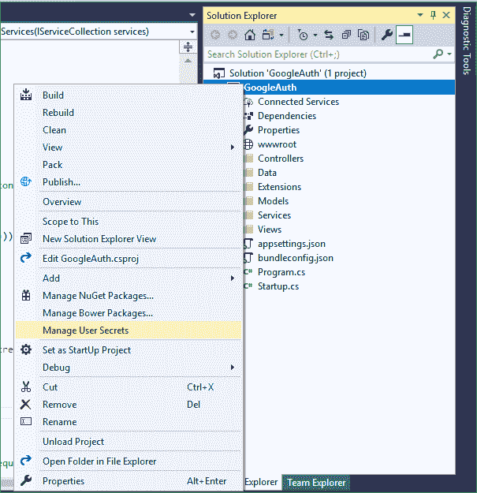

一个 **secrets.json** 文件将会打开。将以下代码放入其中:

```
{  
  "Authentication:Google:ClientId": "Your Google ClientId here",  
  "Authentication:Google:ClientSecret": "Your Google ClientSecret here"  
}
```

现在打开 **Startup.cs** 文件，将以下代码放入 **ConfigureServices** 方法中:

```
services.AddAuthentication().AddGoogle(googleOptions =>  
{  
    googleOptions.ClientId = Configuration["Authentication:Google:ClientId"];  
    googleOptions.ClientSecret = Configuration["Authentication:Google:ClientSecret"];  
});
```

在这段代码中，我们读取 ClientId 和 ClientSecret 以进行身份验证。所以最后， **Startup.cs** 会是这个样子:

```
using System;  
using System.Collections.Generic;  
using System.Linq;  
using System.Threading.Tasks;  
using Microsoft.AspNetCore.Builder;  
using Microsoft.AspNetCore.Identity;  
using Microsoft.EntityFrameworkCore;  
using Microsoft.AspNetCore.Hosting;  
using Microsoft.Extensions.Configuration;  
using Microsoft.Extensions.DependencyInjection;  
using GoogleAuth.Data;  
using GoogleAuth.Models;  
using GoogleAuth.Services;  

namespace GoogleAuth  
{  
    public class Startup  
    {  
        public Startup(IConfiguration configuration)  
        {  
            Configuration = configuration;  
        }  

        public IConfiguration Configuration { get; }  

        // This method gets called by the runtime. Use this method to add services to the container.  
        public void ConfigureServices(IServiceCollection services)  
        {  
            services.AddDbContext<ApplicationDbContext>(options =>  
                options.UseSqlServer(Configuration.GetConnectionString("DefaultConnection")));  

            services.AddIdentity<ApplicationUser, IdentityRole>()  
                .AddEntityFrameworkStores<ApplicationDbContext>()  
                .AddDefaultTokenProviders();  

            services.AddAuthentication().AddGoogle(googleOptions =>  
            {  
                googleOptions.ClientId = Configuration["Authentication:Google:ClientId"];  
                googleOptions.ClientSecret = Configuration["Authentication:Google:ClientSecret"];  
            });  

            // Add application services.  
            services.AddTransient<IEmailSender, EmailSender>();  

            services.AddMvc();  
        }  

        // This method gets called by the runtime. Use this method to configure the HTTP request pipeline.  
        public void Configure(IApplicationBuilder app, IHostingEnvironment env)  
        {  
            if (env.IsDevelopment())  
            {  
                app.UseBrowserLink();  
                app.UseDeveloperExceptionPage();  
                app.UseDatabaseErrorPage();  
            }  
            else  
            {  
                app.UseExceptionHandler("/Home/Error");  
            }  

            app.UseStaticFiles();  

            app.UseAuthentication();  

            app.UseMvc(routes =>  
            {  
                routes.MapRoute(  
                    name: "default",  
                    template: "{controller=Home}/{action=Index}/{id?}");  
            });  
        }  
    }  
}
```

这样，我们的应用程序就准备好了。

### 执行演示

启动应用程序，然后单击主页右上角的登录。

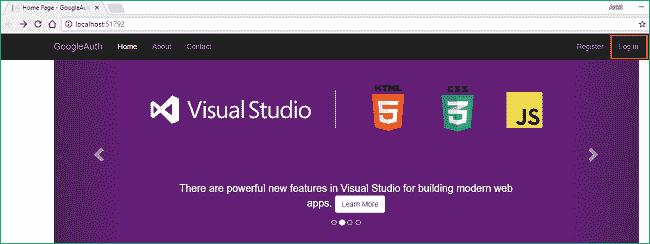

您将被重定向到[http://localhost:51792/Account/log in](http://localhost:51792/Account/Login)页面，您可以在页面右侧看到使用 Google 登录的选项。

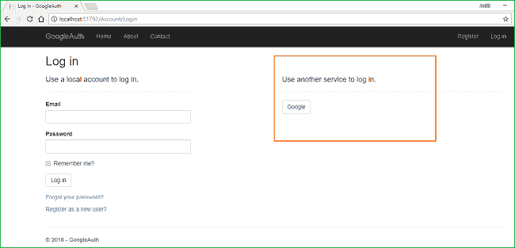

点击**谷歌**按钮将带您进入谷歌登录页面。在那里，您将被要求填写您的谷歌凭据，并授权谷歌应用程序使用您的谷歌帐户。

在 Google 成功认证后，您将被重定向到应用程序中的注册页面，在这里您需要填写一个电子邮件 id 来标记您的帐户。您用于登录的 Gmail id 将会被填入电子邮件 id 字段。如果您想使用另一个邮件 id，可以在此处更改。

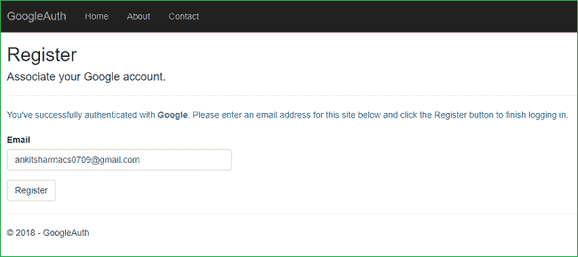

单击注册，您将再次被重定向到主页。但是这次你也可以看到你注册的邮箱在右上角。

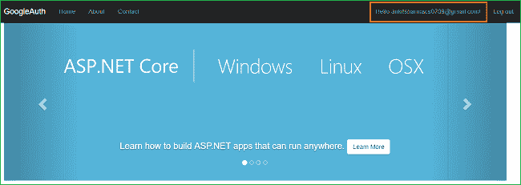

### 结论

我们已经成功创建和配置了一个 Google+应用程序，并使用它来验证我们的 ASP.NET 核心应用程序。

可以从 [GitHub](https://github.com/AnkitSharma-007/ASPCore.GoogleAuth) 获取源代码。

请注意， **secrets.json** 文件包含虚拟值。在执行它之前，你需要用你的谷歌应用的键替换这些值。

你也可以在 [C#角](http://www.c-sharpcorner.com/article/authentication-using-google-in-asp-net-core-2-0/)找到这篇文章。

你可以看看我在 ASP 上的其他文章。网芯[这里](http://ankitsharmablogs.com/category/asp-net-core/)

### 请参见

*   [在 ASP.NET 核心 2.0 中使用 LinkedIn 进行身份验证](http://ankitsharmablogs.com/authentication-using-linkedin-asp-net-core-2-0/)
*   [在 ASP.NET 核心 2.0 中使用 Twitter 认证](http://ankitsharmablogs.com/authentication-using-twitter-in-asp-net-core-2-0/)
*   [在 ASP.NET 核心 2.0 中使用脸书进行认证](http://ankitsharmablogs.com/authentication-using-facebook-in-asp-net-core-2-0/)
*   [使用 ASP.NET 核心 2.0 进行 Cookie 认证](http://ankitsharmablogs.com/cookie-authentication-with-asp-net-core-2-0/)
*   [ASP.NET 核心—使用谷歌认证器的双因素认证](http://ankitsharmablogs.com/asp-net-core-two-factor-authentication-using-google-authenticator/)

最初发表于