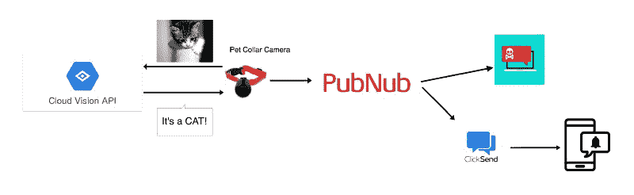

# 如何使用 Google Cloud Vision API 并点击发送来跟踪您的宠物

> 原文：<https://www.freecodecamp.org/news/how-to-use-the-google-cloud-vision-api-and-clicksend-to-keep-tabs-on-your-pets-6024b4daac29/>

作者:Namratha Subramanya

# 如何使用 Google Cloud Vision API 并点击发送来跟踪您的宠物


和人一样，狗也会被各种东西吓到。大多数情况下，这是因为有负面的经历，或者当他们天生的恐惧出现时没有得到处理。在这篇文章中，我们将创建一种方法来确保你的狗是安全的，当你离开。

您可以在狗狗的项圈上安装一个可以捕捉图像的摄像头，并使用 Vision API 来检测和识别图像。

假设你的狗害怕猫，你想确保你的毛茸茸的小朋友在你不在的时候在后院玩耍时不会受到猫的伤害。您可以构建一个应用程序，当 Cloud Vision API 识别出猫时，您可以向您的设备发送短信提醒。

在本教程中，您将了解如何使用 Google Cloud Vision API 识别图像，并使用 ClickSend API 通过短信提醒用户。PubNub 构成了应用程序的框架，并将各种功能相互连接。

[**完整的 GitHub 项目回购可在此处获得。**](https://github.com/namrathasubramanya/PubNub-VisionAPI-ClickSend)

### 让我们开始建造吧

假设你的笔记本电脑的摄像头是固定在你的狗的项圈上的摄像头。下面是打开您的网络摄像头并为您拍照的代码。您可以设置一个时间间隔来频繁捕捉图像。这些图像进入画布元素，并可以保存在您的设备上。你可以在下面找到点击和保存图片的代码。

### 云视觉 API

谷歌云视觉 API 使开发人员能够通过其强大的机器学习模型来理解图像的内容。要开始实现 Vision API，您需要在这里创建一个新项目[。在创建新项目之前，您需要设置您的付费帐户。在这之后，您需要启用 Vision API。](https://console.cloud.google.com/cloud-resource-manager?_ga=2.203919383.-603090119.1528760418)

有关更多详细信息，请查看此快速启动[链接](https://cloud.google.com/vision/docs/quickstart)。

在您的终端中运行以下命令:

```
pip install --upgrade google-cloud-vision
```

要运行客户端库，您必须首先通过创建服务帐户[并设置环境变量来设置身份验证。](https://console.cloud.google.com/apis/credentials)

*   从**服务账户**下拉列表中选择**新的服务账户**。
*   在**服务帐户名称**字段中输入名称。
*   不要从**角色**下拉列表中选择值。访问此服务不需要任何角色。
*   点击**创建**。将出现一条注释，警告此服务帐户没有角色。
*   点击**创建无角色**。包含您的密钥的 JSON 文件将下载到您的计算机上。

现在将环境变量`GOOGLE_APPLICATION_CREDENTIALS`设置为包含您的服务帐户密钥的 JSON 文件的文件路径。这可以通过以下方式完成:

对于 Linux/Mac OS:

```
export GOOGLE_APPLICATION_CREDENTIALS="[PATH]"
```

对于 Windows:

```
set GOOGLE_APPLICATION_CREDENTIALS=[PATH]
```

现在，您已经准备好运行识别图像的代码了。下面是 Python 代码，它从保存快照的目录(我的目录是下载)中获取快照，并用标签进行响应。

图像识别的结果通过 [PubNub 实时消息](https://www.pubnub.com/docs/tutorials/pubnub-publish-subscribe/?utm_source=Syndication&utm_medium=Medium&utm_campaign=SYN-CY18-Q2-Medium-June-28)发送给用户。您只需为您的设备订阅一个通道，比如说，`alert_notify`Vision API 会将图像识别的结果发送到该通道。



### 使用 PubNub 的 Web 通知警报

你现在必须初始化你的 PubNub 键。[注册一个 PubNub 账户](https://www.pubnub.com/docs/tutorials/pubnub-publish-subscribe/?utm_source=Syndication&utm_medium=Medium&utm_campaign=SYN-CY18-Q2-Medium-June-28)并在[管理面板](https://admin.pubnub.com/#/login/?utm_source=Syndication&utm_medium=Medium&utm_campaign=SYN-CY18-Q2-Medium-June-28)中创建一个项目。

现在，您可以在 Python 代码中发布警报消息，并将其作为 web 推送通知发送到您的设备。反过来，该设备订阅`alert_notify`频道，并从您的相机接收警告信息。

您可以使用 HTML5 中的[通知 API](https://developer.mozilla.org/en-US/docs/Web/API/notification) 来设计 web 推送通知。

### 单击发送 API

[ClickSend API](https://developers.clicksend.com/) 允许开发人员将短信、语音、传真、帖子或电子邮件集成到他们的应用程序中。您可以使用 PubNub 向您的移动设备发送短信和网络推送通知。ClickSend API 为开发者提供了完善的文档。

可以使用 ClickSend 的 [HTTP API](https://clicksendhttpapiv2.docs.apiary.io/#) 。每次 Vision API 识别图像时，您的设备都会收到一条短信。

### 恭喜你。

现在，您已经设置了 Cloud Vision API 和 ClickSend API，通过 PubNub 的发布-订阅相互通信，您将能够在每次您的相机捕捉到猫的图像时接收发送到您设备的 web 通知和短信提醒。毫无疑问，这是使用不同 API 构建应用程序并通过 PubNub 连接它们的一个很好的起点。

*最初发表于[www.pubnub.com](https://www.pubnub.com/blog/image-recognition-using-vision-api-and/?utm_source=Syndication&utm_medium=Medium&utm_campaign=SYN-CY18-Q2-Medium-June-28)。*