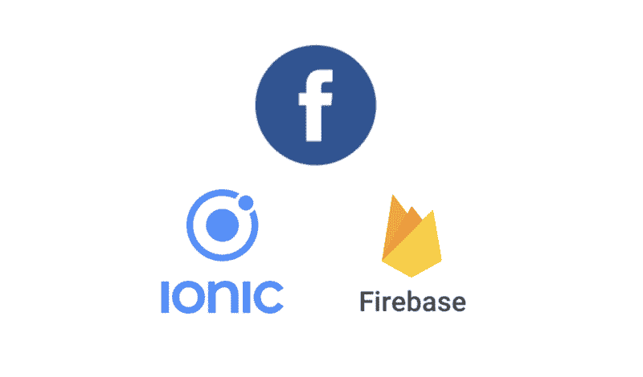
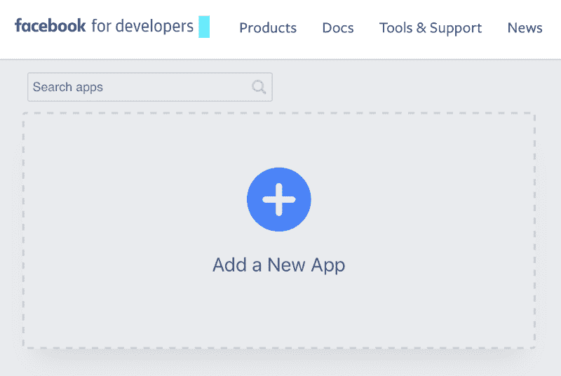
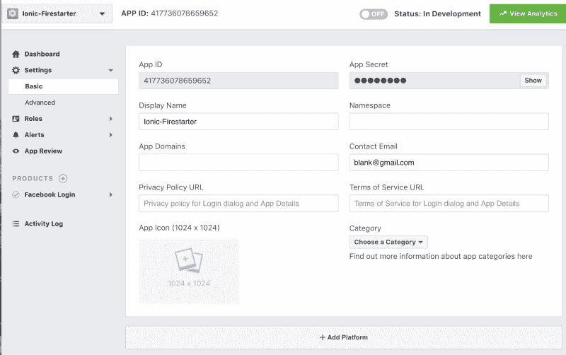
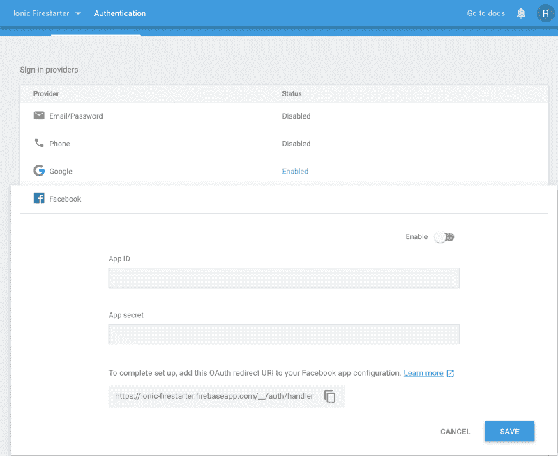

# 如何用 Firebase 和 Ionic 开发一个优秀的脸书登录流程

> 原文：<https://www.freecodecamp.org/news/how-to-develop-a-great-facebook-login-flow-with-firebase-and-ionic-656a295c4fe9/>

瑞安·戈登

# 如何用 Firebase 和 Ionic 开发一个优秀的脸书登录流程



对于那些不想创建和记住另一个用户名:密码组合的用户来说，使用 Ionic 社交登录是很有帮助的。相反，您可以允许用户使用他们已经拥有的帐户登录。你不需要存储散列密码进行比较，你不需要处理发送注册电子邮件，你也不需要重置密码。用户选择的提供商将为您处理所有这一切。

你想看看代码而不是跟帖吗？请给[回购](https://github.com/Ryan-Gordon/Ionic-Firestarter)一颗星，在你觉得有帮助的时候！

这篇文章的一些内容和我页面上的其他教程非常相似。如果你已经安装了 ionic 和 Node 并且有了项目设置，你可以在这里跳转到代码[。](#6156)

要完成本教程，您需要安装 Node.js 和 Ionic。

要安装 ionic 和 cordova，这是插件目前需要的，在安装 Node 之后，在您的终端中运行以下命令:

```
npm install -g ionic cordova
```

如果您得到 EACCES: permission denied，您可能需要使用 sudo 运行该命令。


用 ionic start<appname><template></template></appname>

脸书登录的代码将被放入一个 provider 类中，该类将被任何需要使用该登录方法的页面调用。

```
ionic g provider auth
```

### 使用 Firebase 设置应用程序并获取凭据

为了让 Firebase 与脸书平台一起工作，我们需要执行三个步骤:

—在脸书开发者门户中设置新的应用程序

—在 Firebase 上设置脸书登录

—实施签到流程

#### 脸书开发者门户

脸书开发者门户是所有可用的开发者工具和 API 的接口。我们将使用它在脸书端设置登录 API。



为你的应用程序选择名称和联系电子邮件。联系电子邮件可能会显示给用户，所以请确保它是专业的。

在这之后，应用程序将在 facebook 中创建，我们可以将插件添加到我们的应用程序中！

将有两个插件需要。科尔多瓦插件设计用于脸书本地工作，以及它的包装。

```
$ ionic plugin add cordova-plugin-facebook4 --variable APP_ID="123456789" --variable APP_NAME="myApplication"
```

您需要为您的真实凭证替换值或`APP_ID`和`APP_NAME`。您可以在脸书开发者的仪表板中找到这两个工具。

另一个插件将允许我们通过 TypeScript 处理第一个插件。

```
npm install --save @ionic-native/facebook 
```

现在我们已经安装了插件并连接到脸书控制台。

最后有两个步骤:选择我们将在 FB 开发者门户上使用的平台，并在 app.module 中导入。

#### 在 FB 门户中选择平台

我们的应用程序已经创建，但是我们需要指定哪些应用程序可以使用我们的登录 API。这是通过添加带有我们指定的捆绑包 ID 的平台来实现的。



要开始单击添加平台，请选择 Android 或 iOS。两个平台都需要知道应用程序在部署时生成的 ID。

位于 config.xml 顶部的 ID 值将用于 Google Play 商店包名称和 BundleID。

> 不要忘记将插件导入到您的`*app.module.ts*`中，并将其指定为项目的提供者。

### 在 Firebase 上设置脸书登录

在 Firebase 中设置登录将是最简单的任务。一旦在 FB 开发人员的门户上创建了应用程序，它将有一个 APPID 和一个 APPSECRET。将 Firebase 链接到我们的脸书应用程序需要这两个值。



一旦输入了这些值，单击 enable 就可以了！

### 实现登录流程

在所有的配置之后，我们已经完成了有趣的部分:编码和测试！

如果你一直在关注，两个脸书离子插件现在已经安装，应用程序设置在 Firebase 和 FB 开发门户网站。

在我们可以在代码中使用插件之前，我们必须导入它，并用构造函数将它纳入范围。在这之后，我们可以在这个提供者的任何地方免费使用这个插件。

```
import { Facebook } from '@ionic-native/facebook';

@Injectable()

export class AuthProvider {

constructor(private googlePlus: GooglePlus, private facebook:Facebook) {

}
```

如果你看过其他帖子，登录代码看起来会很熟悉。我们在这里做的是使用原生脸书插件做一个登录流程。如果成功，使用提供的 authresponse 并登录 Firebase。

通过导入 auth provider，可以在应用程序中的任何地方调用该函数。使用它的预期方式是某个页面(如`home.ts`)将在作用域中包含 AuthProvider。当用户单击 FB 登录按钮时，我们将把登录委托给我们的 AuthProvider。

现在，当这个函数被调用时，一个原生的脸书用户界面将会弹出，要求登录。或者，如果用户已经登录，它将只要求 OAuth 许可——就是这样！我们得到一个令牌，我们可以用它来制作一个凭证，然后用这个凭证登录 Firebase。

```
facebookLogin(): Promise<any> {
    return this.facebook.login(['email'])
      .then( response => {
        const facebookCredential = firebase.auth.FacebookAuthProvider
          .credential(response.authResponse.accessToken);

        firebase.auth().signInWithCredential(facebookCredential)
          .then( success => { 
            console.log("Firebase success: " + JSON.stringify(success)); 
          });

      }).catch((error) => { console.log(error) });
  }
```

facebookLogin.ts

### 结论

在本文中，我们设置了脸书登录 API，并使用跨平台解决方案让用户登录我们的脸书 Firebase。

与 Google 登录一样，需要进行一些配置(尽管没那么多)。现在的好处是，我们的用户可以使用他们现有的脸书帐户登录我们构建的任何网络应用程序。如果你也关注了第一篇文章，那么这个应用程序现在已经有了谷歌和脸书的登录功能！

这篇教程(以及我所有的其他教程)的所有代码都可以在这里找到。我的目标是实现尽可能多的 Firebase 特性，是的，我正在寻找贡献者！

如果你想访问代码，这里也有一个回购的链接:

[**Ryan-Gordon/Ionic-Firestarter**](https://github.com/Ryan-Gordon/Ionic-Firestarter)
[*Ionic-Firestarter——Ionic Firestarter 是一个开源项目，展示了在…*](https://github.com/Ryan-Gordon/Ionic-Firestarter)
[github.com](https://github.com/Ryan-Gordon/Ionic-Firestarter)实现的不同 Firebase 特性

想在爱奥尼亚上找一些类似的帖子吗？这里是我完成的其他几个帖子:

[**如何动态主题化你的 Ionic 应用程序并让你的用户开心**
*为你的移动应用程序设计一个时尚的配色方案可能很耗时。为什么不让用户自己选择…*](https://www.freecodecamp.org/news/how-to-dynamically-theme-your-ionic-application-and-make-your-users-happy-ffa17e15dbf7/)

[**用离子型**](https://medium.com/@ryangordon210/alternative-sign-in-methods-for-firebase-with-ionic-52714ee9be83)
[*替代 Firebase 的登录方法在我关于 Firebase 登录的其他帖子中，有一个焦点放在了社交提供商上。这个强调的要点是……*](https://medium.com/@ryangordon210/alternative-sign-in-methods-for-firebase-with-ionic-52714ee9be83)