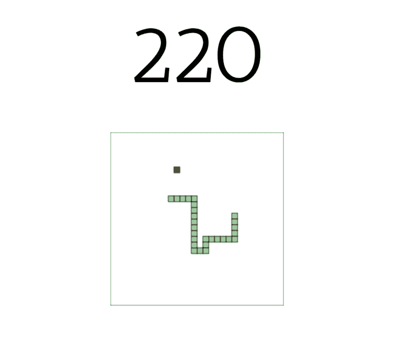
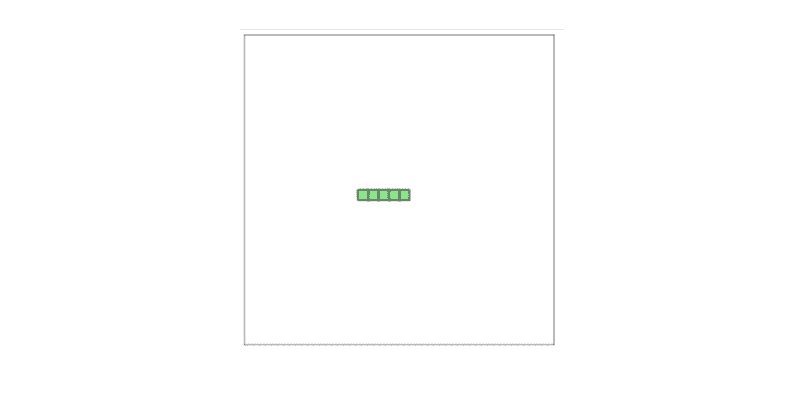
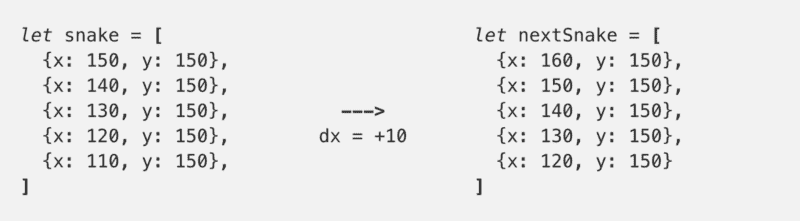
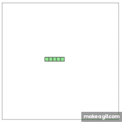
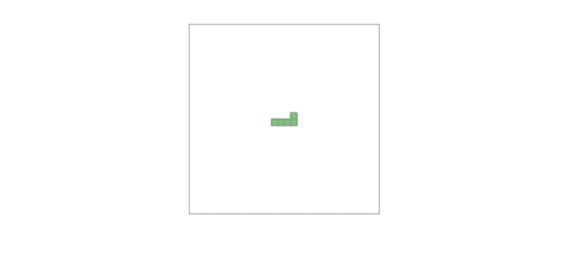
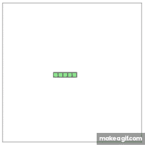
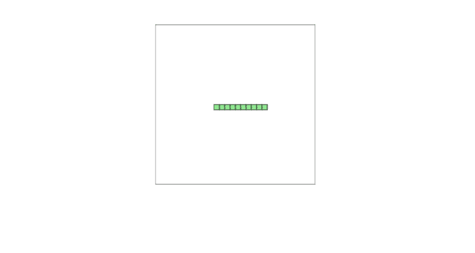
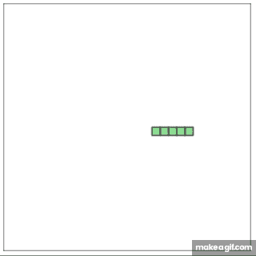
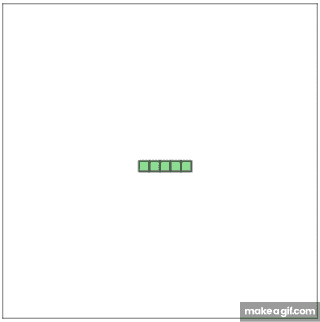

# 像程序员一样思考:如何只用 JavaScript、HTML 和 CSS 构建 Snake

> 原文：<https://www.freecodecamp.org/news/think-like-a-programmer-how-to-build-snake-using-only-javascript-html-and-css-7b1479c3339e/>

作者 Panayiotis Nicolaou

# 像程序员一样思考:如何只用 JavaScript、HTML 和 CSS 构建 Snake



你好吗？

欢迎加入。今天我们将开始一次激动人心的冒险，在那里我们将制作自己的贪吃蛇游戏？。你将学会如何通过把问题分解成更小更简单的步骤来解决它。在这段旅程结束时，你会学到一些新东西，你会有信心自己探索更多。

如果你是编程新手，我推荐你去看看 [freeCodeCamp](https://www.freecodecamp.org/) 。这是一个学习的好地方…你猜对了…免费。我就是这样开始的？

好了，好了，闹够了——你准备好开始了吗？

> 你可以在这里找到最终代码[，在这里](https://github.com/supergoat/snake)找到现场演示[。](https://snake-cdxejlircg.now.sh)

### 入门指南

让我们首先创建一个包含所有代码的文件“snake.html”。

因为这是一个 HTML 文件，我们首先需要的是 HTML 的声明:

很好，现在继续，在你喜欢的浏览器中打开`snake.html`。你应该能看到**欢迎来到 Snake！**


**snake.html** opened in chrome

我们有了一个良好的开端？

### 创建画布

为了能够创建我们的游戏，我们必须使用 HTML `[<canv](https://www.w3schools.com/html/html5_canvas.asp)`作为>。这是使用 JavaScript 绘制图形的工具。

用以下内容替换`snake.html`中的欢迎信息:

```
<canvas id="gameCanvas" width="300" height="300">&lt;canvas>
```

id 是标识画布的东西，应该总是被指定。我们稍后将使用它来访问画布。宽度和高度是画布的尺寸，也应该被指定。在这种情况下，300 x 300 像素。

您的 snake.html 文件现在应该看起来像这样。

如果你刷新先前打开的浏览器页面，你会看到一个空白页。这是因为，默认情况下，画布是空的，没有背景。让我们解决这个问题。？

#### 给画布一个背景色和边框

为了使我们的画布可见，我们可以通过编写一些 JavaScript 代码给它一个边框。为此，我们需要插入`<script><`；/script>tag`s after t`he</canvas>，我们所有的 JavaScript 代码都将放在这里。

> 如果你把`*<scri*` pt >标签放在`*e the &l*` t 之前；canvas >你的代码不会工作，因为 HTML 不会被加载。

我们现在可以写一些 JavaScript 代码，在封闭的`<script><`；/script >标签。如下所示更新您的代码。

首先，我们使用之前指定的 id (gameCanvas)获取 canvas 元素。然后我们得到画布的“2d”上下文，这意味着我们将绘制到 2D 空间。

最后，我们画一个 300 x 300 的白色矩形，带有黑色边框。这覆盖了整个画布，从左上角(0，0)开始。

如果你在你的浏览器中重新加载`snake.html`，你应该会看到一个带有黑色边框的白盒！干得好，我们有一块画布可以用来创建我们的贪吃蛇游戏了！？迎接下一个挑战！

### 代表我们的蛇

为了让我们的蛇游戏运行，我们需要知道蛇在画布上的位置。为此，我们可以将蛇表示为一个坐标数组。因此，要在画布(150，150)中间创建一条水平蛇，我们可以编写以下代码:

```
let snake = [  {x: 150, y: 150},  {x: 140, y: 150},  {x: 130, y: 150},  {x: 120, y: 150},  {x: 110, y: 150},];
```

请注意，所有零件的 y 坐标始终为 150。每个部分的 x 坐标是前一部分的-10px(向左)。数组`{x: 150, y: 150}`中的第一对坐标代表蛇最右边的头部。

当我们在下一节画蛇的时候，这一点会变得更清楚。

### 创造和绘制我们的蛇

为了在画布上显示这条蛇，我们可以编写一个函数，为每对坐标绘制一个矩形。

```
function drawSnakePart(snakePart) {  ctx.fillStyle = 'lightgreen';  ctx.strokestyle = 'darkgreen';
```

```
 ctx.fillRect(snakePart.x, snakePart.y, 10, 10);  ctx.strokeRect(snakePart.x, snakePart.y, 10, 10);}
```

接下来，我们可以创建另一个在画布上打印零件的函数。

```
function drawSnake() {  snake.forEach(drawSnakePart);}
```

我们的`snake.html`文件现在应该是这样的:

如果你现在刷新你的浏览器页面，你会在画布中间看到一条绿色的蛇。厉害！？



### 使蛇能够水平移动

接下来我们想给蛇移动的能力。但是我们怎么做呢？？

嗯，要让蛇向右移动一步(10px)，我们可以将蛇的每一个部分的**的 x 坐标增加 10px (dx = +10px)。为了让蛇向左移动，我们可以将蛇的每一个**部分的**的 x 坐标减少 10px (dx = -10)。**

> **dx** 是蛇的水平速度。

创建一条向右移动了 10px 的蛇应该是这样的



创建一个名为`advanceSnake`的函数，我们将使用它来更新 snake。

```
function advanceSnake() {  const head = {x: snake[0].x + dx, y: snake[0].y};
```

```
 snake.unshift(head);
```

```
 snake.pop();}
```

首先，我们为蛇创建一个新的头部。然后我们使用 [unshift](https://developer.mozilla.org/en-US/docs/Web/JavaScript/Reference/Global_Objects/Array/unshift) 将新的头部添加到 **snake** 的开头，并使用 [pop](https://developer.mozilla.org/en-US/docs/Web/JavaScript/Reference/Global_Objects/Array/pop) 移除 **snake** 的最后一个元素。通过这种方式，所有其他蛇的部分都移动到位，如上图所示。

嘣？，你已经掌握了窍门。

### 使蛇能够垂直移动

要上下移动我们的蛇，我们不能将所有的 y 坐标改变 10px。这会使整条蛇上下移动。



相反，我们可以改变头部的 y 坐标。减小 10px 将蛇向下移动，增大 10px 将蛇向上移动。这将使蛇正确移动。

幸运的是，由于我们编写`advanceSnake`函数的方式，这很容易做到。在`advanceSnake`内，更新头部，使头部的 y 坐标增加 **dy** 。

```
const head = {x: snake[0].x + dx, y: snake[0].y + dy};
```

为了测试我们的`advanceSnake`函数是如何工作的，我们可以在`drawSnake`函数之前临时调用它。

```
// Move on step to the rightadvanceSnake()
```

```
// Change vertical velocity to 0dx = 0;// Change horizontal velocity to 10dy = -10;
```

```
// Move one step upadvanceSnake();
```

```
// Draw snake on the canvasdrawSnake();
```

这是目前为止我们的`snake.html`文件的样子。

刷新浏览器，可以看到我们的蛇动了。成功！



### 重构我们的代码

在我们继续之前，让我们做一些重构，移动在函数内部绘制画布的代码。这将在下一节中帮助我们。

> **“代码重构**是在不改变现有计算机**代码、**外部行为的情况下，对其进行重构的过程。”——[维基百科](https://en.wikipedia.org/wiki/Code_refactoring)

```
function clearCanvas() {  ctx.fillStyle = "white";  ctx.strokeStyle = "black";
```

```
 ctx.fillRect(0, 0, gameCanvas.width, gameCanvas.height);  ctx.strokeRect(0, 0, gameCanvas.width, gameCanvas.height);}
```

我们正在大踏步前进！？

### 让我们的蛇自动移动

好了，现在我们已经成功地重构了代码，我们可以让蛇自动移动了。

之前，为了测试我们的`advanceSnake`函数是否工作，我们调用了它两次。一次让蛇向右移动，一次让蛇向上移动。

因此，如果我们想让蛇向右移动五步，我们将连续调用`advanceSnake()`五次。

```
clearCanvas();advanceSnake();advanceSnake();advanceSnake();advanceSnake();advanceSnake();drawSnake();
```

但是，如上图连续调用五次，会让蛇向前跳 50px。



相反，我们想让蛇看起来一步一步地向前移动。

为此，我们可以使用 [setTimeout](https://www.w3schools.com/Jsref/met_win_settimeout.asp) ，在每次调用之间添加一点延迟。我们还需要确保每次调用`advanceSnake`时都调用`drawSnake`。如果我们不这样做，我们将无法看到显示蛇移动的中间步骤。

```
setTimeout(function onTick() {  clearCanvas();  advanceSnake();  drawSnake();}, 100);
```

```
setTimeout(function onTick() {  clearCanvas();  advanceSnake();  drawSnake();}, 100);
```

```
...
```

```
drawSnake();
```

注意我们是如何在每个`*setTimeout*`内部调用`*clearCanvas()*`的。这是为了移除蛇之前的所有位置，否则会留下痕迹。



虽然，上面的代码有问题。这里没有告诉程序它必须在移动到下一个 **setTimeout** 之前等待 **setTimeout** 。这意味着蛇将**仍然**向前跳 50px，但是在**稍微延迟**之后。

为了解决这个问题，我们必须将代码封装在函数中，一次调用一个函数。

```
stepOne();    function stepOne() {  setTimeout(function onTick() {    clearCanvas();    advanceSnake();    drawSnake();   // Call the second function   stepTwo();  }, 100)}
```

```
function stepTwo() {  setTimeout(function onTick() {    clearCanvas();    advanceSnake();    drawSnake();    // Call the third function    stepThree();  }, 100)}
```

```
...
```

我们如何让我们的蛇保持移动？我们可以创建一个函数`main`并反复调用它，而不是创建无数个相互调用的函数。

```
function main() {  setTimeout(function onTick() {    clearCanvas();    advanceSnake();    drawSnake();
```

```
 // Call main again    main();  }, 100)}
```

瞧啊。我们现在有了一条会一直向右移动的蛇。虽然，一旦它到达画布的尽头，它就继续它那通向未知的无限旅程？。我们会及时解决的，耐心点，年轻的学徒。？。



### 改变蛇的方向

我们的下一个任务是当一个箭头键被按下时改变蛇的方向。在`drawSnakePart`函数后添加以下代码。

```
function changeDirection(event) {  const LEFT_KEY = 37;  const RIGHT_KEY = 39;  const UP_KEY = 38;  const DOWN_KEY = 40;
```

```
 const keyPressed = event.keyCode;  const goingUp = dy === -10;  const goingDown = dy === 10;  const goingRight = dx === 10;  const goingLeft = dx === -10;
```

```
 if (keyPressed === LEFT_KEY && !goingRight) {    dx = -10;    dy = 0;  }
```

```
 if (keyPressed === UP_KEY && !goingDown) {    dx = 0;    dy = -10;  }
```

```
 if (keyPressed === RIGHT_KEY && !goingLeft) {    dx = 10;    dy = 0;  }
```

```
 if (keyPressed === DOWN_KEY && !goingDown) {    dx = 0;    dy = 10;  }}
```

这里没有什么棘手的事情。我们检查按下的键是否与箭头键之一匹配。如果是这样，我们改变垂直和水平速度，如前所述。

请注意，我们还会检查蛇是否在朝着新的预期方向的相反方向移动。这是为了防止我们的蛇反转，例如，当蛇向**左侧移动时，按下**右**箭头键。**



Snake reversing

为了将`changeDirection`连接到我们的游戏，我们可以使用[文档](https://www.w3schools.com/Jsref/dom_obj_document.asp)上的 [addEventListener](https://developer.mozilla.org/en-US/docs/Web/API/EventTarget/addEventListener) 来‘监听’按键被按下的时间。然后我们可以用 [keydown](https://developer.mozilla.org/en-US/docs/Web/Events/keydown) 事件调用`changeDirection`。在`main`函数后添加以下代码。

```
document.addEventListener("keydown", changeDirection)
```

你现在应该能够使用四个箭头键来改变蛇的方向。干得好，你火了？！

接下来，让我们看看如何生产食物和培养蛇。

### 为蛇制造食物

对于我们的蛇食，我们必须生成一组随机的坐标。我们可以使用一个辅助函数`randomTen`来产生两个数字。一个用于 x 坐标，一个用于 y 坐标。

我们还必须确保食物不在蛇现在所在的地方。如果是的话，我们必须找一个新的食物地点。

```
function randomTen(min, max) {  return Math.round((Math.random() * (max-min) + min) / 10) * 10;}
```

```
function createFood() {  foodX = randomTen(0, gameCanvas.width - 10);  foodY = randomTen(0, gameCanvas.height - 10);
```

```
 snake.forEach(function isFoodOnSnake(part) {    const foodIsOnSnake = part.x == foodX && part.y == foodY    if (foodIsOnSnake)      createFood();  });}
```

然后，我们必须创建一个函数来在画布上绘制食物。

```
function drawFood() { ctx.fillStyle = 'red'; ctx.strokestyle = 'darkred'; ctx.fillRect(foodX, foodY, 10, 10); ctx.strokeRect(foodX, foodY, 10, 10);}
```

最后我们可以在调用`main`之前调用`createFood`。不要忘记更新`main`来使用`drawFood`功能。

```
function main() {  setTimeout(function onTick() {    clearCanvas();    drawFood()    advanceSnake();    drawSnake();
```

```
 main();  }, 100)}
```

### 养蛇

培养我们的蛇很简单。我们可以更新我们的`advanceSnake`函数来检查蛇头是否接触到食物。如果是，我们可以跳过去除蛇的最后一部分，创建一个新的食物位置。

```
function advanceSnake() {  const head = {x: snake[0].x + dx, y: snake[0].y};
```

```
 snake.unshift(head);
```

```
 const didEatFood = snake[0].x === foodX && snake[0].y === foodY;  if (didEatFood) {    createFood();  } else {    snake.pop();  }}
```

#### 记录分数

为了让玩家更享受这个游戏，我们还可以增加一个分数，当蛇吃东西的时候分数会增加。

创建一个新的变量 score，并在 snake 声明后将其设置为 0。

```
let score = 0;
```

接下来，在画布前添加一个 id 为“score”的新 div。我们可以用这个来显示分数。

```
<div id="score">0</div><canvas id="gameCanvas" width="300" height="300"></canvas>
```

最后更新`advanceSnake`增加并显示蛇吃食物时的分数。

```
function advanceSnake() {  ...
```

```
 if (didEatFood) {    score += 10;    document.getElementById('score').innerHTML = score;
```

```
 createFood();  } else {    ...  }}
```

唷，那真是太多了，但我们已经走了很长一段路？

### 结束游戏

还有最后一个棋子，那就是结束游戏？。为此，我们可以创建一个函数 d `idGameEnd` ，当游戏结束时返回 t**true**，否则返回 f **alse** 。

```
function didGameEnd() {  for (let i = 4; i < snake.length; i++) {    const didCollide = snake[i].x === snake[0].x &&      snake[i].y === snake[0].y
```

```
 if (didCollide) return true  }
```

```
 const hitLeftWall = snake[0].x < 0;  const hitRightWall = snake[0].x > gameCanvas.width - 10;  const hitToptWall = snake[0].y &lt; 0;  const hitBottomWall = snake[0].y > gameCanvas.height - 10;
```

```
 return hitLeftWall ||          hitRightWall ||          hitToptWall ||         hitBottomWall}
```

首先，我们检查蛇头是否接触到了蛇的另一部分，如果是，则返回 **true** 。

> 注意，我们从索引 4 开始循环。这有两个原因。第一个是如果索引为 0，那么 **didCollide** 将立即评估为真，因此游戏将结束。第二是，前三个部分不可能互相接触。

接下来，我们检查这条蛇是否碰到了画布的任何一面墙，如果碰到了，返回 **true** ，否则返回 **false** 。

现在，如果`didEndGame`返回 true，我们可以在`main`函数中提前返回，从而结束游戏。

```
function main() {  if (didGameEnd()) return;
```

```
 ...}
```

我们的 snake.html 现在应该是这样的:

你现在有了一个可以玩的贪吃蛇游戏，并且可以和你的朋友分享。但是在庆祝之前，让我们看看最后一个问题。这将是最后一次，我保证。

### 偷偷摸摸的虫子？

如果你玩游戏的次数足够多，你可能会注意到有时游戏会意外结束。这是一个很好的例子，说明了 bug 是如何潜入我们的程序并造成麻烦的？。

当一个错误出现时，解决它的最好方法是首先有一个可靠的方法来重现它。也就是说，想出导致意外行为的精确步骤。然后你需要理解为什么它们会导致意外的行为，然后想出一个解决方案。

#### 复制 bug

在我们的例子中，重现 bug 的步骤如下:

*   这条蛇正在向左移动
*   玩家按下向下箭头键
*   玩家立即按下右箭头键(在 100 毫秒过去之前)
*   游戏结束


#### 理解这个 bug

让我们一步一步分解发生了什么。

**蛇向左移动**

*   水平速度，dx 等于-10
*   `main`函数被调用
*   调用，将蛇向左推进-10px。

**玩家按下向下箭头键**

*   `changeDirection`叫做
*   `keyPressed === DOWN_KEY && dy !goingUp`评估为真
*   dx 更改为 0
*   dy 变为+10

**玩家立即按下右箭头(在 100 毫秒过去之前)**

*   `changeDirection`叫做
*   `keyPressed === RIGHT_KEY && !goingLeft`评估为真
*   dx 变为+10
*   dy 变为 0

**游戏结束**

*   `main`功能在 100ms 后被调用**。**
*   调用，使蛇向右前进 10px。
*   `const didCollide = snake[i].x === snake[0].x && snake[i].y === snake[0].y`评估为真
*   `didGameEnd`返回 true
*   `main`函数提前返回
*   游戏结束

#### 修复 bug

在研究了所发生的事情之后，我们得知游戏结束是因为蛇倒车了。

那是因为当玩家按下向下箭头时，dx 被设置为 0。从而`keyPressed === RIGHT_KEY && !goingLeft`评估为真，dx 变为 10。

值得注意的是，方向的改变发生在 100 毫秒之前**。如果 100 毫秒过去了，那么这条蛇会先向下迈一步，而不会后退。**

为了修复我们的 bug，我们必须确保我们只能在调用了`main`和`advanceSnake`之后改变方向。我们可以创建一个变量**改变方向。当`changeDirection`被调用时，这将被设置为真，当`advanceSnake`被调用时，这将被设置为假。**

在我们的`changeDirection`函数中，如果**改变方向**为真，我们可以提前返回。

```
function changeDirection(event) {  const LEFT_KEY = 37;  const RIGHT_KEY = 39;  const UP_KEY = 38;  const DOWN_KEY = 40;
```

```
 if (changingDirection) return;
```

```
 changingDirection = true;
```

```
 ...}
```

```
function main() {  setTimeout(function onTick() {    changingDirection = false;        ...
```

```
 }, 100)}
```

这是我们 snake.html 的最终版本

> 注意到我还添加了一些样式吗？& `*lt;style><*`之间；/style >标签。那就是让画布和乐谱出现在屏幕中间。

### 结论

恭喜你！！？？

我们已经到达了旅程的终点。我希望你喜欢和我一起学习，现在有信心继续你的下一次冒险。

但这并不一定要在这里结束。我的下一篇文章将重点帮助你开始进入**开源**的**非常**令人兴奋的世界。

开源是了解**许多新事物和结识了不起的人的好方法。这是非常有益的，但是一开始会很可怕？。**

如果您想在我的下一篇文章发表时收到通知，可以关注我！？

很高兴能和你一起踏上这段旅程。

下次见。✨