# Vue 手册:对 Vue.js 的全面介绍

> 原文：<https://www.freecodecamp.org/news/the-vue-handbook-a-thorough-introduction-to-vue-js-1e86835d8446/>

> 在[vuehandbook.com](https://vuehandbook.com)获得这篇 PDF/ePub/MOBI 格式的文章

Vue 是一个非常流行的 JavaScript 前端框架，正在经历巨大的增长。

它很简单，很小(大约 24KB)，而且性能很好。感觉和其他所有的 JavaScript 前端框架和视图库都不一样。让我们找出原因。

### 一、什么是 JavaScript 前端框架？

如果你不确定 JavaScript 框架是什么，Vue 是第一次接触 JavaScript 框架的绝佳选择。

JavaScript 框架帮助我们创建现代应用程序。现代 JavaScript 应用程序主要在 Web 上使用，但也支持许多桌面和移动应用程序。

直到 21 世纪初，浏览器才具备现在的功能。它们的功能要弱得多，而且在它们内部构建复杂的应用程序在性能上是不可行的。工具甚至不是人们想得到的东西。

当谷歌发布了谷歌地图和 T2 GMail 这两款运行在浏览器中的应用时，一切都改变了。 [Ajax](https://developer.mozilla.org/en-US/docs/Web/Guide/AJAX/Getting_Started) 让异步网络请求成为可能。随着时间的推移，开发人员开始在 Web 平台之上构建，而工程师则在平台本身上工作——浏览器、Web 标准、浏览器 API 和 JavaScript 语言。

像 jQuery T1 和 T2 Mootools T3 这样的库是第一批基于 JavaScript 的大型项目，并且一度非常流行。他们基本上提供了一个更好的 API 来与浏览器交互，并为各种浏览器之间的错误和不一致提供了解决方法。

像 [Backbone](http://backbonejs.org/) 、 [Ember](https://www.emberjs.com/) 、 [Knockout](http://knockoutjs.com/) 和 [AngularJS](https://angularjs.org/) 这样的框架是现代 JavaScript 框架的第一波浪潮。

第二波，也就是现在的这一波，以[反应](https://reactjs.org/)、[棱角](https://angular.io/)和 [Vue](https://vuejs.org/) 为主要演员。

请注意，jQuery、Ember 和我提到的其他项目仍在被大量使用、积极维护，数百万网站依赖于它们。

也就是说，技术和工具在发展，作为一名 JavaScript 开发人员，你现在可能需要了解 React、Angular 或 Vue，而不是那些旧的框架。

框架抽象了与浏览器和 DOM 的交互。我们不再通过在 DOM 中引用元素来操作它们，而是在更高的层次上声明性地定义元素并与之交互。

使用框架就像使用 C 编程语言而不是使用 T2 汇编语言来编写系统程序。这就像用电脑写文件，而不是用打字机。这就像拥有一辆自动驾驶汽车，而不是自己驾驶汽车。

嗯，没那么远，但你明白了。你不用使用浏览器提供的低级 API 来操作元素，不用构建非常复杂的系统来编写应用程序，而是使用由非常聪明的人构建的工具，让我们的生活变得更加轻松。

### Vue 的流行

Vue.js 到底有多火？

Vue 有:

*   2016 年 GitHub 上 7600 颗星
*   2017 年 GitHub 上 36700 颗星

截至 2018 年 6 月，它在 GitHub 上拥有超过 100，000+颗星。

它的 [npm](https://www.npmjs.com/) 下载量每天都在增长，现在每周大约有 35 万次下载。

鉴于这些数据，我认为 Vue 非常受欢迎。

相对而言，它与几年前诞生的 React 拥有大约相同数量的 GitHub 恒星。

当然，数字不是一切。我对 Vue 的印象是开发者喜欢它。

Vue 兴起的一个关键时间点是 Laravel 生态系统的采用，这是一个非常流行的 PHP web 应用程序框架。但是从那以后，它在许多其他开发社区中变得广泛。

#### 为什么开发者喜欢 Vue

首先，Vue 被称为渐进式框架。

这意味着它适应开发者的需求。其他框架需要开发人员或团队的完全认可，并且通常希望您重写现有的应用程序，因为它们需要一些特定的约定。Vue 很高兴地以一个简单的`script`标签进入你的应用程序，它可以随着你的需求增长，从 3 行扩展到管理你的整个视图层。

你不需要了解 [webpack](https://webpack.js.org/) 、 [Babel](https://babeljs.io/) 、npm 或者任何关于 Vue 的东西。但是当你准备好的时候，Vue 会让你很容易依赖它们。

这是一个很好的卖点，特别是在当前 JavaScript 前端框架和库的生态系统中，这些框架和库往往会疏远新手和经验丰富的开发人员，他们会在可能性和选择的海洋中感到迷失。

Vue.js 可能是最容易接近的前端框架。有些人将 Vue 称为新的 jQuery，因为它很容易通过脚本标签进入应用程序，并逐渐从那里获得空间。这是一种赞美，因为 jQuery 在过去几年统治了 Web，并且它仍然在大量的网站上工作。

Vue 是通过挑选 Angular、React 和 Knockout 等框架的最佳想法，以及挑选这些框架做出的最佳选择而构建的。通过排除一些不太出色的，它开始是一个“最好的”集合，并从那里发展起来。

#### Vue.js 在框架中处于什么位置？

房间里的两头大象，在谈论 web 开发的时候，都反应迟钝，棱角分明。相对于这两大流行框架，Vue 如何定位自己？

Vue 是尤雨溪在谷歌开发 AngularJS (Angular 1.0)应用程序时创建的。它诞生于创建更高性能的应用程序的需要。Vue 选择了 Angular 的一些模板语法，但是去掉了 Angular 所需要的固执己见的复杂堆栈，使它变得非常有性能。

新的 Angular (Angular 2.0)也解决了许多 AngularJS 问题，但方式非常不同。它还需要买入 [TypeScript](https://www.typescriptlang.org/) ，这并不是所有的开发者都喜欢使用(或者想要学习)。

反应呢？Vue 从 React 获得了许多好的想法，最重要的是虚拟 DOM。但是 Vue 通过某种自动依赖管理来实现它。这将跟踪哪些组件受到状态更改的影响，以便当状态属性更改时，仅重新渲染这些组件。

另一方面，在 React 中，当影响组件的状态的一部分改变时，组件将被重新呈现。默认情况下，它的所有子对象也会被重新渲染。为了避免这种情况，你需要使用每个组件的`shouldComponentUpdate`方法，并确定该组件是否应该被重新渲染。这让 Vue 在易用性和开箱即用的性能增益方面有了一点优势。

与 React 的一大区别是 JSX。虽然技术上你可以在 Vue 中使用 JSX，但这并不是一种流行的方法，而是使用了[模板系统](https://vuejs.org/v2/guide/syntax.html)。任何 HTML 文件都是有效的 Vue 模板。JSX 与 HTML 非常不同，对于团队中可能只需要使用应用程序 HTML 部分的人来说，比如设计师，有一个学习曲线。

Vue 模板非常类似于[小胡子](http://mustache.github.io/)和[车把](https://handlebarsjs.com/)(尽管它们在灵活性方面有所不同)。因此，已经使用过 Angular 和 Ember 等框架的开发人员更熟悉它们。

官方的状态管理库 [Vuex](https://vuex.vuejs.org/) 遵循 Flux 架构，在概念上有点类似于 [Redux](https://redux.js.org/) 。同样，这也是 Vue 积极的一面，它在 React 中看到了这种好的模式，并将其借鉴到自己的生态系统中。虽然你可以在 Vue 上使用 Redux，但 Vuex 是专门为 Vue 及其内部工作而定制的。

Vue 很灵活，但核心团队维护着两个对任何 web 应用程序都非常重要的包(如路由和状态管理),这一事实使它比 React 少得多。比如:`vue-router`和`vuex`是 Vue 成功的关键。

您不需要选择或担心您选择的库将来是否会得到维护，是否会跟上框架的更新。因为它们是官方的，所以它们是适合它们的规范的首选库(当然，你可以选择使用你喜欢的)。

与 React 和 Angular 相比，Vue 与众不同的一点是，Vue 是一个独立项目:它没有像脸书或谷歌这样的大公司支持。

相反，它完全由社区支持，通过捐赠和赞助来促进发展。这确保了 Vue 的路线图不是由单个公司的议程驱动的。

### 你的第一个 Vue 应用

如果您从未创建过 Vue.js 应用程序，我将指导您创建一个应用程序，以便您理解它是如何工作的。

#### 第一个例子

首先，我将通过使用 Vue 的最基本的例子。

您创建一个 HTML 文件，其中包含:

```
<html>
  <body>
    <div id="example">
      <p>{{ hello }}</p>
    </div>
    <script src="https://unpkg.com/vue"></script>
    <script>
        new Vue({
            el: '#example',
            data: { hello: 'Hello World!' }
        })
    </script>
  </body>
</html>
```

然后在浏览器中打开它。那是你的第一个 Vue 应用！页面应该显示“Hello World！”消息。

我把脚本标签放在了主体的末尾，这样它们在 DOM 加载后就可以按顺序执行了。

这段代码的作用是实例化一个新的 Vue 应用程序，链接到`#example`元素作为它的模板。通常使用 CSS 选择器来定义它，但是您也可以传入一个`HTMLElement`。

然后，它将该模板与`data`对象相关联。这是一个特殊的对象，承载我们希望 Vue 呈现的数据。

在模板中，特殊的`{{ }}`标签表示这是模板的动态部分，其内容应该在 Vue 应用程序数据中查找。

你可以在 [CodePen](https://codepen.io/flaviocopes/pen/YLoLOp) 上看到这个例子。

CodePen 与使用普通的 HTML 文件略有不同，您需要在笔设置中将它配置为指向 Vue 库位置:

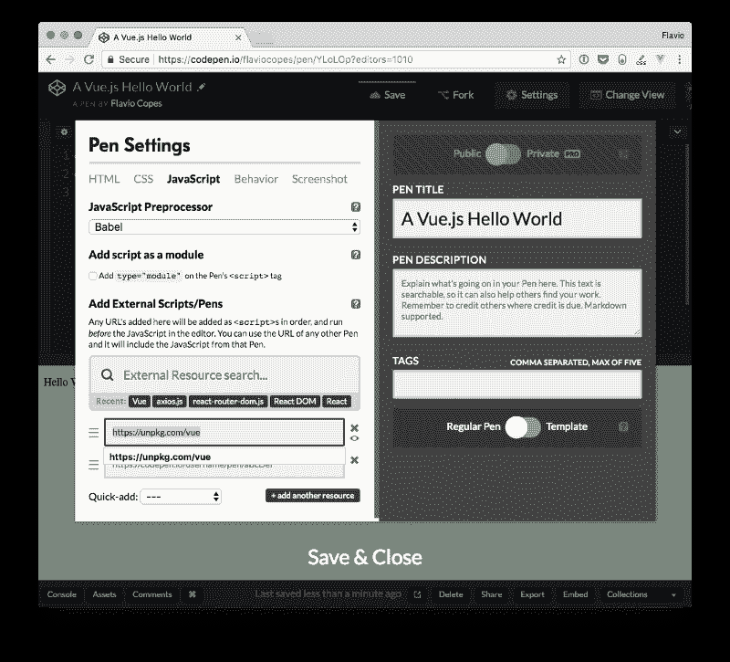

#### 第二个例子:Vue CLI 默认应用

让我们把游戏升级一点。我们要构建的下一个应用已经完成，它是 Vue CLI 的默认应用。

什么是 Vue CLI？这是一个命令行实用程序，通过为您搭建一个应用程序框架，并提供一个示例应用程序，帮助您加快开发速度。

有两种方法可以获得此应用程序:

**在本地使用 Vue CLI**

第一种方法是在您的计算机上安装 Vue CLI 并运行命令:

```
vue create <enter the app name>
```

**使用 CodeSandbox**

一个更简单的方法，不需要安装任何东西，就是去 [CodeSandbox](https://codesandbox.io/s/vue) 。该链接打开 Vue CLI 默认应用程序。

CodeSandbox 是一个很酷的代码编辑器，允许你在云端构建应用程序。您可以使用任何 npm 包，并且可以轻松地与 [Zeit Now](https://zeit.co/now) 集成以实现轻松部署，还可以与 [GitHub](https://github.com/) 集成以管理版本。

无论您选择在本地使用 Vue CLI，还是通过 CodeSandbox，让我们详细检查一下 Vue 应用程序。

### 文件结构

除了包含配置的`package.json`之外，这些文件包含在初始项目结构中:

*   `index.html`
*   `src/App.vue`
*   `src/main.js`
*   `src/assets/logo.png`
*   `src/components/HelloWorld.vue`

#### `index.html`

`index.html`文件是主 app 文件。

在主体中，它只包含一个简单的元素:`<div id="app">` < /div >。这是 Vue 应用程序将用来附加到 DOM 的元素。

```
<!DOCTYPE html>
<html>

<head>
  <meta charset="utf-8">
  <meta name="viewport" content="width=device-width,initial-scale=1.0">
  <title>CodeSandbox Vue</title>
</head>

<body>
  <div id="app"></div>
  <!-- built files will be auto injected -->
</body>

</html>
```

#### `src/main.js`

这是驱动我们应用程序的主要 JavaScript 文件。

我们首先从`App.vue`导入 Vue 库和 App 组件。

我们将`productionTip`设置为`false`，以避免 Vue 在控制台中输出“您正处于开发模式”的提示。

接下来，我们创建 Vue 实例，将它分配给由`#app`标识的 DOM 元素，这是我们在`index.html`中定义的，我们告诉它使用 App 组件。

```
// The Vue build version to load with the `import` command
// (runtime-only or standalone) has been set in webpack.base.conf with an alias.
import Vue from 'vue'
import App from './App'

Vue.config.productionTip = false

/* eslint-disable no-new */
new Vue({
  el: '#app',
  components: { App },
  template: '<App/>'
})
```

#### `src/App.vue`

`App.vue`是单个文件组件。它包含三大块代码:HTML、CSS 和 JavaScript。

这乍一看似乎很奇怪，但是单个文件组件是创建自包含组件的好方法，这些组件在单个文件中包含了它们需要的所有内容。

我们有标记，将与之交互的 JavaScript，以及应用于它的样式，这些样式可以有范围，也可以没有范围。在这种情况下，它没有限定作用域，只是输出 CSS，就像普通的 CSS 一样应用到页面上。

有趣的部分在于`script`标签。

我们从`components/HelloWorld.vue`文件导入一个组件，我们将在后面描述。

这个组件将在我们的组件中被引用。这是一种依赖。我们将输出这段代码

```
<div id="app">
  
  <HelloWorld/>
</div>
```

从这个组件，你可以看到它引用了`HelloWorld`组件。Vue 会自动将组件插入这个占位符中。

```
<template>
  <div id="app">
    
    <HelloWorld/>
  </div>
</template>

<script>
import HelloWorld from './components/HelloWorld'

export default {
  name: 'App',
  components: {
    HelloWorld
  }
}
</script>

<style>
#app {
  font-family: 'Avenir', Helvetica, Arial, sans-serif;
  -webkit-font-smoothing: antialiased;
  -moz-osx-font-smoothing: grayscale;
  text-align: center;
  color: #2c3e50;
  margin-top: 60px;
}
</style>
```

#### `src/components/HelloWorld.vue`

这里是`HelloWorld`组件，由 App 组件包含。

该组件输出一组链接和一条消息。

还记得上面我们讲过的 App.vue 中的 CSS 吗，没有限定作用域？组件已经限定了 CSS 的范围。

您可以通过查看`style`标签轻松确定它。如果它有`scoped`属性，那么它的作用域:`<style scop` ed >

这意味着生成的 CSS 将通过一个由 Vue 透明地应用的类唯一地指向组件。你不需要担心这个，而且你知道 CSS 不会**泄露**到页面的其他部分。

组件输出的消息存储在 Vue 实例的`data`属性中，并在模板中输出为`{{ msg }}`。

存储在`data`中的任何东西都可以通过自己的名字在模板中直接访问。我们不需要说`data.msg`，只需要说`msg`。

```
<template>
  <div class="hello">
    <h1>{{ msg }}</h1>
    <h2>Essential Links</h2>
    <ul>
      <li>
        <a
          href="https://vuejs.org"
          target="_blank"
        >
          Core Docs
        </a>
      </li>
      <li>
        <a
          href="https://forum.vuejs.org"
          target="_blank"
        >
          Forum
        </a>
      </li>
      <li>
        <a
          href="https://chat.vuejs.org"
          target="_blank"
        >
          Community Chat
        </a>
      </li>
      <li>
        <a
          href="https://twitter.com/vuejs"
          target="_blank"
        >
          Twitter
        </a>
      </li>
      <br>
      <li>
        <a
          href="http://vuejs-templates.github.io/webpack/"
          target="_blank"
        >
          Docs for This Template
        </a>
      </li>
    </ul>
    <h2>Ecosystem</h2>
    <ul>
      <li>
        <a
          href="http://router.vuejs.org/"
          target="_blank"
        >
          vue-router
        </a>
      </li>
      <li>
        <a
          href="http://vuex.vuejs.org/"
          target="_blank"
        >
          vuex
        </a>
      </li>
      <li>
        <a
          href="http://vue-loader.vuejs.org/"
          target="_blank"
        >
          vue-loader
        </a>
      </li>
      <li>
        <a
          href="https://github.com/vuejs/awesome-vue"
          target="_blank"
        >
          awesome-vue
        </a>
      </li>
    </ul>
  </div>
</template>

<script>
export default {
  name: 'HelloWorld',
  data() {
    return {
      msg: 'Welcome to Your Vue.js App'
    }
  }
}
</script>

<!-- Add "scoped" attribute to limit CSS to this component only -->
<style scoped>
h1,
h2 {
  font-weight: normal;
}
ul {
  list-style-type: none;
  padding: 0;
}
li {
  display: inline-block;
  margin: 0 10px;
}
a {
  color: #42b983;
}
</style>
```

#### 运行应用程序

CodeSandbox 有一个很酷的预览功能。您可以运行应用程序并编辑源代码中的任何内容，使其立即反映在预览中。

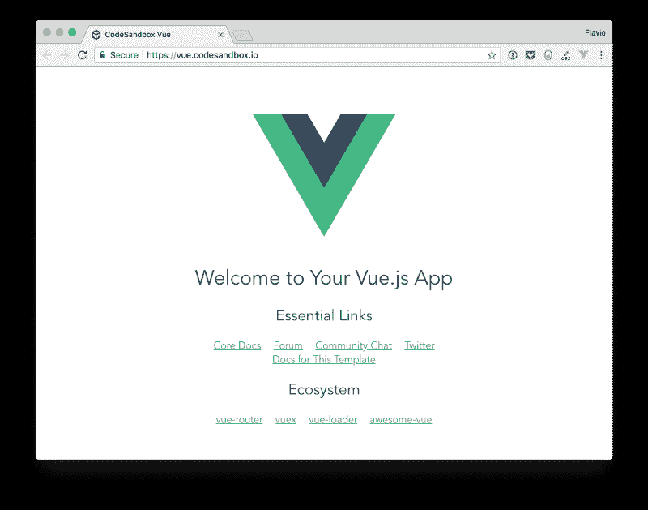

### Vue CLI

CodeSandbox 非常适合在线编码和工作，无需在本地设置 Vue。在本地工作的一个好方法是设置 Vue CLI(命令行界面)。让我们进一步了解一下。

在前面的例子中，我介绍了一个基于 Vue CLI 的示例项目。Vue CLI 到底是什么，它如何融入 Vue 生态系统？此外，我们如何在本地设置一个基于 Vue CLI 的项目？让我们来了解一下！

**注意:**现在正在对 CLI 进行大规模的修改，从版本 2 升级到版本 3。虽然还不稳定，但我将描述版本 3，因为它比版本 2 有了巨大的改进，非常不同。

#### 装置

Vue CLI 是一个命令行实用程序，您可以使用 npm 全局安装它:

```
npm install -g @vue/cli
```

或者使用纱线:

```
yarn global add @vue/cli
```

一旦你这样做了，你就可以调用`vue`命令。

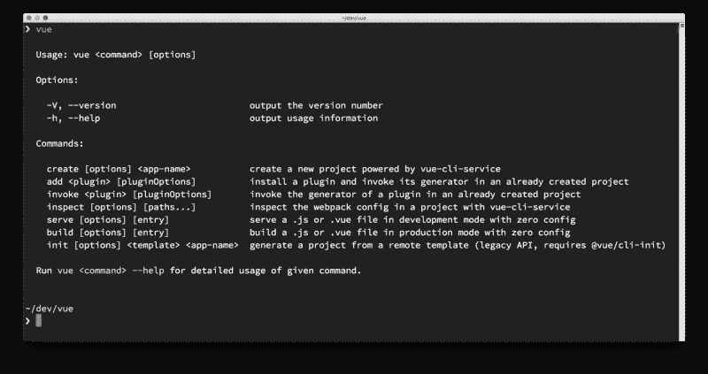

#### Vue CLI 提供了什么？

CLI 对于快速开发 Vue.js 至关重要。

它的主要目标是确保您需要的所有工具都在一起工作，执行您需要的功能，并抽象出单独使用每个工具所需的所有本质配置细节。

它可以执行初始项目设置和搭建。

这是一个灵活的工具。一旦你用 CLI 创建了一个项目，你就可以去调整配置，而不必**弹出**你的应用程序(就像你用`create-react-app`做的那样)。

当你从`create-react-app`弹出时，你可以更新和调整你想要的，但你不能依赖`create-react-app`提供的酷功能。

您可以进行任何配置，并且仍然能够轻松升级。

在您创建和配置应用程序之后，它将作为一个运行时依赖工具，构建在 Webpack 之上。

第一次接触 CLI 是在创建新的 Vue 项目时。

#### 如何使用 CLI 创建新的 Vue 项目

使用 CLI 要做的第一件事是创建一个 Vue 应用程序:

```
vue create example
```

酷的是这是一个互动的过程。您需要选择一个预设。默认情况下，有一个预置提供了 Babel 和 [ESLint](https://eslint.org/) 的集成:


我将按下向下箭头⬇️，手动选择我想要的功能:

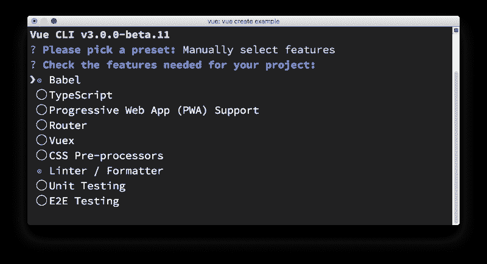

按`space`启用你需要的一个东西，然后按`enter`继续。由于我选择了`Linter / Formatter`，Vue CLI 提示我进行配置。我选择了`ESLint + Prettier`，因为这是我最喜欢的设置:

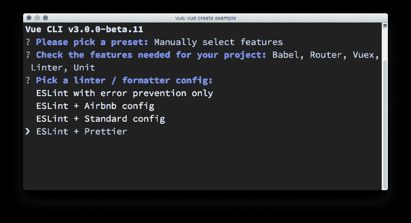

接下来的事情是选择如何应用林挺。我选择`Lint on save`。

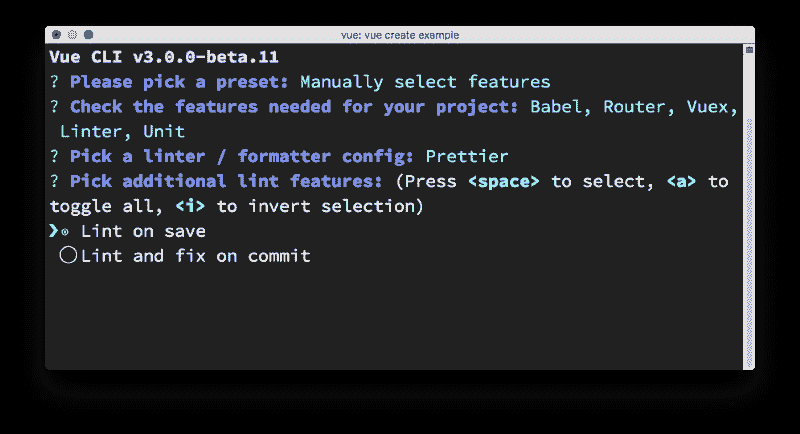

接下来:测试。Vue CLI 让我在两个最流行的单元测试解决方案中进行选择: [Mocha + Chai](https://mochajs.org/) 和 [Jest](https://jestjs.io/) 。


Vue CLI 询问我将所有配置放在哪里:在`package.json`文件中，还是在专用配置文件中，每个工具一个。我选择了后者。

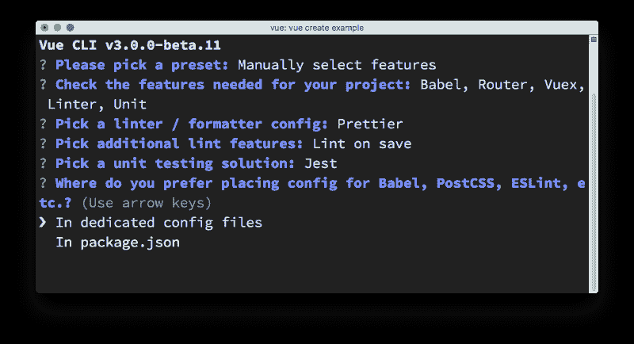

接下来，Vue CLI 询问我是否要保存这些预设，并允许我在下次使用 Vue CLI 创建新应用程序时选择它们。这是一个非常方便的功能，因为快速设置我的所有偏好可以降低复杂性:

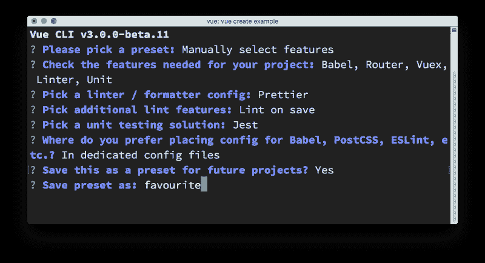

然后 Vue CLI 问我是喜欢用[纱](https://yarnpkg.com/lang/en/)还是 NPM:

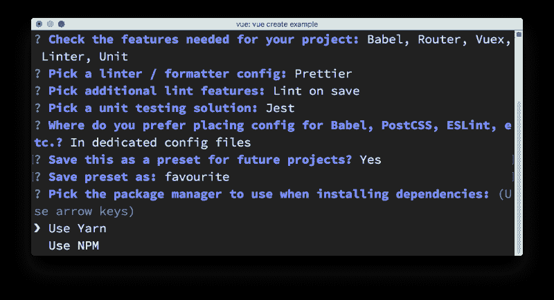

这是它问我的最后一个问题，然后它继续下载依赖项并创建 Vue 应用程序:


#### 如何启动新创建的 Vue CLI 应用程序

Vue CLI 已经为我们创建了应用程序，我们可以进入`example`文件夹并运行`yarn serve`以开发模式启动我们的第一个应用程序:

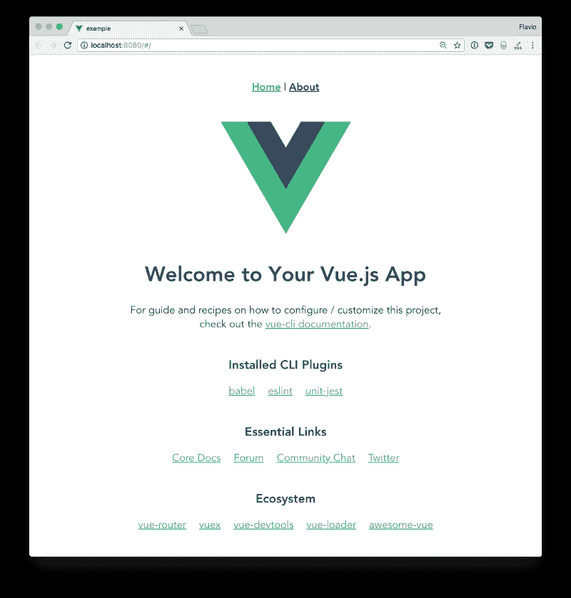

starter 示例应用程序源代码包含几个文件，包括`package.json`:


这是定义所有 CLI 命令的地方，包括我们一分钟前使用的`yarn serve`。其他命令是

*   `yarn build`，开始生产构建
*   `yarn lint`、跑棉绒
*   `yarn test:unit`，运行单元测试

我将在单独的教程中描述由 Vue CLI 生成的示例应用程序。

#### Git 储存库

注意到 VS 代码左下角的`master`字了吗？这是因为 Vue CLI 会自动创建一个存储库，并进行第一次提交。所以我们可以直接跳进去，改变事情，我们知道我们改变了什么:


这太酷了。有多少次你一头扎进去，改变了一些东西，却发现，当你想提交结果的时候，你没有提交初始状态？

#### 从命令行使用预设

您可以跳过交互式面板，指示 Vue CLI 使用特定的预设:

```
vue create -p favourite example-2
```

#### 预置存储的位置

预设存储在您个人目录的`.vuejs`文件中。以下是我创建第一个“喜爱的”预置后的结果:

```
{
  "useTaobaoRegistry": false,
  "packageManager": "yarn",
  "presets": {
    "favourite": {
      "useConfigFiles": true,
      "plugins": {
        "@vue/cli-plugin-babel": {},
        "@vue/cli-plugin-eslint": {
          "config": "prettier",
          "lintOn": [
            "save"
          ]
        },
        "@vue/cli-plugin-unit-jest": {}
      },
      "router": true,
      "vuex": true
    }
  }
}
```

#### 插件

从阅读配置可以看出，一个预置基本上就是插件的集合，加上一些可选的配置。

一旦创建了一个项目，您可以使用`vue add`添加更多的插件:

```
vue add @vue/cli-plugin-babel
```

所有这些插件都在最新版本中使用。您可以通过传递 version 属性来强制 Vue CLI 使用特定版本:

```
"@vue/cli-plugin-eslint": {
  "version": "^3.0.0"
}
```

如果一个新版本有重大变化或错误，并且您需要在使用它之前等待一段时间，这是非常有用的。

#### 远程存储预设

通过创建一个包含一个`preset.json`文件的存储库，可以将一个预置存储在 GitHub(或其他服务)中，该文件包含一个预置配置。

从上面提取，我做了一个样本[预置](https://github.com/flaviocopes/vue-cli-preset/blob/master/preset.json)，它包含这个配置:

```
{  "useConfigFiles": true,  "plugins": {    "@vue/cli-plugin-babel": {},    "@vue/cli-plugin-eslint": {      "config": "prettier",      "lintOn": [        "save"      ]    },    "@vue/cli-plugin-unit-jest": {}  },  "router": true,  "vuex": true}
```

它可用于引导新的应用程序，使用:

```
vue create --preset flaviocopes/vue-cli-preset example3
```

### Vue CLI 的另一个用途:快速原型制作

到目前为止，我已经解释了如何使用 Vue CLI 从头开始创建一个新项目，包括所有的附加功能。但是对于真正快速的原型开发，您可以创建一个真正简单的 Vue 应用程序(甚至是一个自包含在单个。vue 文件)并提供该文件，而不必下载`node_modules`文件夹中的所有依赖项。

怎么会？首先安装`cli-service-global`全局包:

```
npm install -g @vue/cli-service-global
```

```
//or
```

```
yarn global add @vue/cli-service-global
```

创建 app.vue 文件:

```
<template>    <div>        <h2>Hello world!</h2>        <marquee>Heyyy</marquee>    </div></template>
```

然后跑

```
vue serve app.vue
```


The standalone app

您可以服务于更有组织的项目，由 JavaScript 和 HTML 文件组成。默认情况下，Vue CLI 使用`main.js / index.js` 作为其入口点，您可以设置一个`package.json`和任何工具配置。`vue serve`将它捡起来。

因为这使用了全局依赖，所以除了演示或快速测试之外，它不是最佳的方法。

运行`vue build`将为项目在`dist/`中的部署做准备，并将生成所有相应的代码(也用于供应商依赖)。

#### 网络包

在内部，Vue CLI 使用 Webpack，但是配置是抽象的，我们甚至看不到文件夹中的配置文件。您仍然可以通过调用`vue inspect`来访问它:


### 视图 DevTools

当你第一次尝试使用 Vue 时，如果你打开浏览器开发者工具，你会发现这条消息:“下载 Vue Devtools 扩展以获得更好的开发体验:[https://github.com/vuejs/vue-devtools](https://github.com/vuejs/vue-devtools)”

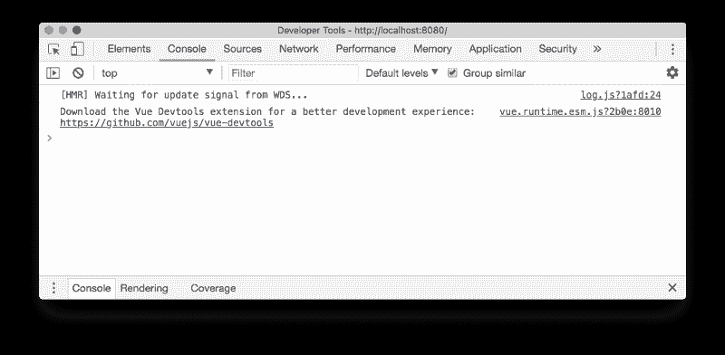

Hint to install the Vue devtools

这是一个安装 Vue Devtools 扩展的友好提醒。那是什么？任何流行的框架都有自己的 devtools 扩展，它通常会向浏览器开发人员工具添加一个新面板，比浏览器默认提供的面板更加专业。在这种情况下，面板将让我们检查我们的 Vue 应用程序并与之交互。

在构建 Vue 应用时，这个工具将是一个惊人的帮助。开发人员工具只能在 Vue 应用程序处于开发模式时检查它。这确保了没有人可以使用它们来与您的生产应用程序交互，并将使 Vue 更具性能，因为它不必关心开发工具。

我们来装吧！

安装 Vue 开发工具有三种方式:

*   在 Chrome 上
*   在 Firefox 上
*   作为独立的应用程序

自定义扩展不支持 Safari、Edge 和其他浏览器，但使用独立应用程序，您可以调试在任何浏览器中运行的 Vue.js 应用程序。

#### 安装在 Chrome 上

在谷歌浏览器[商店](https://chrome.google.com/webstore/detail/vuejs-devtools/nhdogjmejiglipccpnnnanhbledajbpd)上转到这个页面，点击`**Add to Chrome**`。

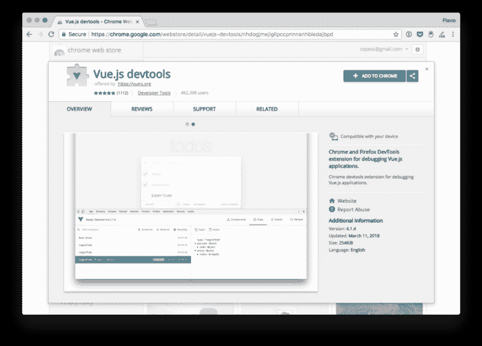

完成安装过程:

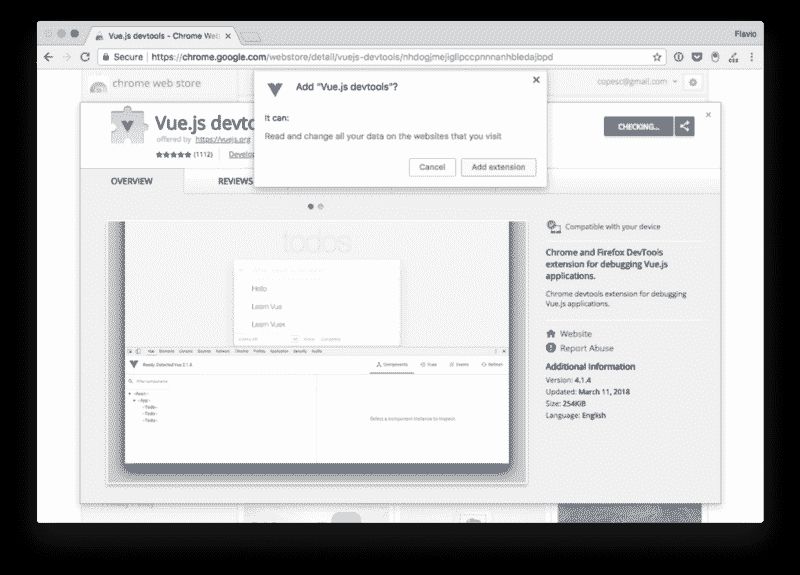

Vue.js devtools 图标显示在工具栏中。如果页面没有运行 Vue.js 实例，它将呈灰色显示。

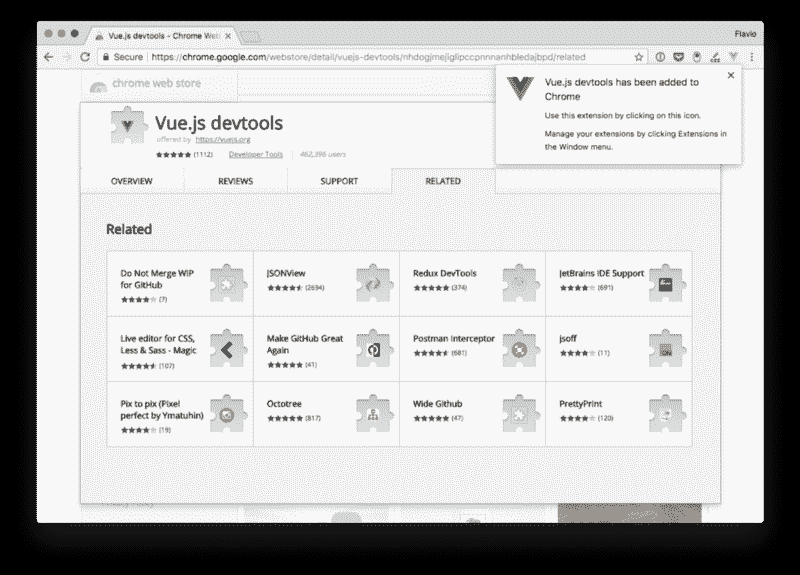

如果检测到 Vue.js，图标会显示 Vue 徽标的颜色。

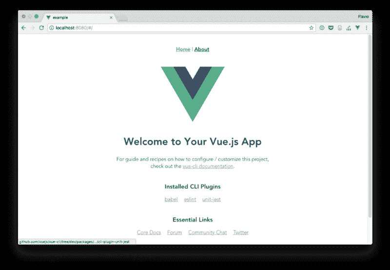

这个图标除了告诉我们**是一个 Vue.js 实例**之外什么也不做。要使用 devtools，我们必须使用“视图→开发人员→开发人员工具”或`Cmd-Alt-i`打开开发人员工具面板

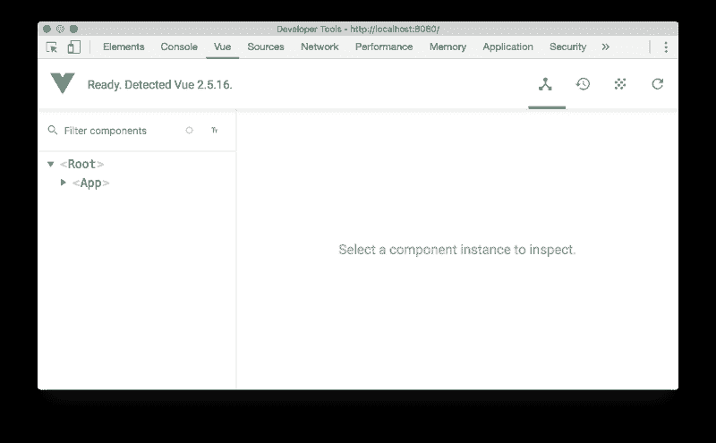

#### 在 Firefox 上安装

你可以在 Mozilla 附加组件[商店](https://addons.mozilla.org/en-US/firefox/addon/vue-js-devtools/)中找到 Firefox 开发工具扩展。

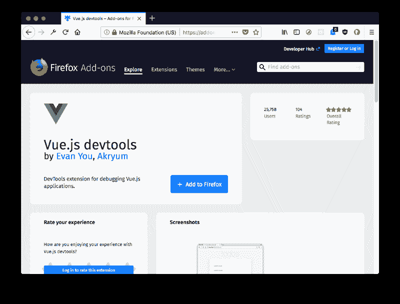

点击“添加到 Firefox ”,扩展将被安装。和 Chrome 一样，工具栏中会出现一个灰色图标

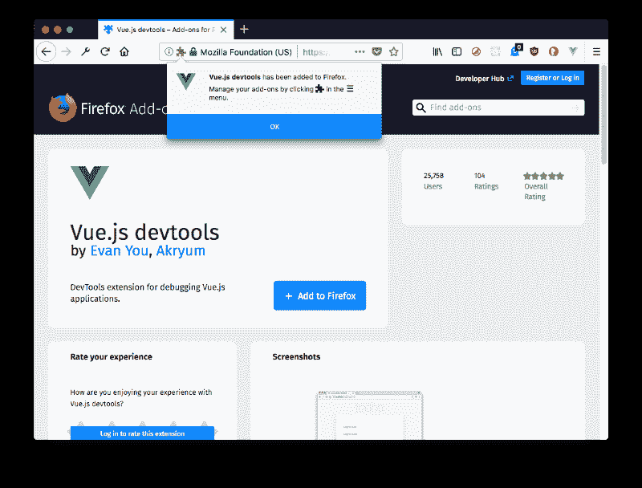

当您访问一个运行 Vue 实例的站点时，它会变成绿色，当我们打开开发工具时，我们会看到一个“Vue”面板:

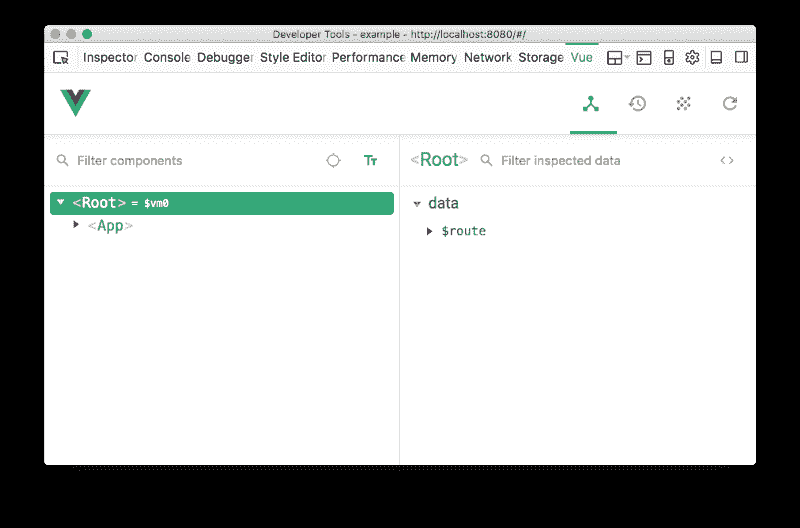

#### 安装独立应用程序

或者，您可以使用 DevTools 独立应用程序。

只需使用以下工具安装即可:

```
npm install -g @vue/devtools
```

```
//or
```

```
yarn global add @vue/devtools
```

并通过调用以下命令来运行它:

```
vue-devtools
```

这将打开独立的电子应用程序。

现在，粘贴它向您显示的脚本标记

```
<script src="http://localhost:8098"></script>
```

在项目`index.html`文件中，等待应用程序重新加载。它会自动连接到应用程序。

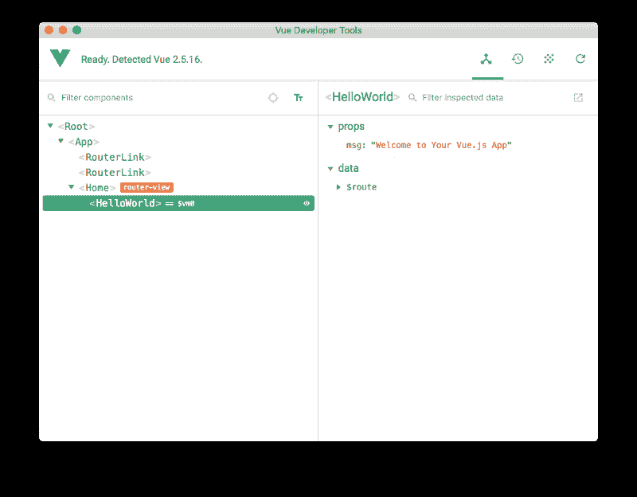

#### 如何使用开发者工具

如上所述，可以通过在浏览器中打开开发者工具并移动到 Vue 面板来激活 Vue DevTools。

另一个选项是右键单击页面中的任何元素，然后选择“检查 Vue 组件”:

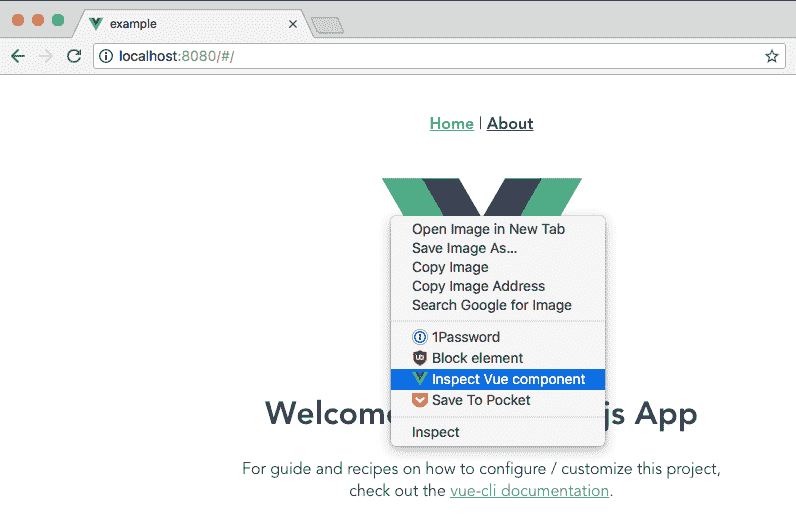

当 Vue DevTools 面板打开时，我们可以导航组件树。当我们从左边的列表中选择一个组件时，右边的面板会显示它包含的属性和数据:

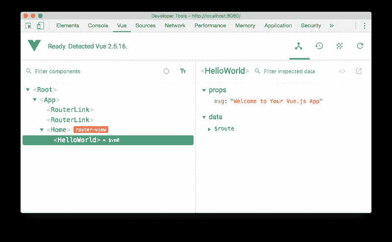

顶部有四个按钮:

*   **组件**(当前面板)，列出当前页面运行的所有组件实例。Vue 可以同时运行多个实例。例如，它可以用独立的轻量级应用程序管理你的购物车和幻灯片。
*   **Vuex** 是您可以检查通过 Vuex 管理的状态的地方。
*   **事件**显示所有发出的事件。
*   **刷新**重新加载 devtools 面板。

注意到组件旁边的小文本了吗？这是一种使用控制台检查组件的简便方法。按“esc”键会在 devtools 的底部显示控制台，您可以键入`$vm0`来访问 Vue 组件:

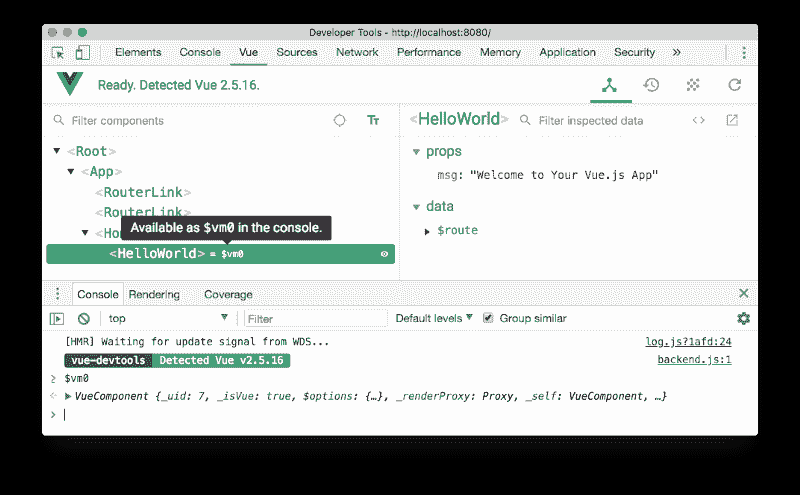

不用在代码中将组件赋给一个全局变量，就可以检查组件并与之交互，这非常酷。

#### 过滤器组件

开始输入组件名，组件树将过滤掉不匹配的组件。

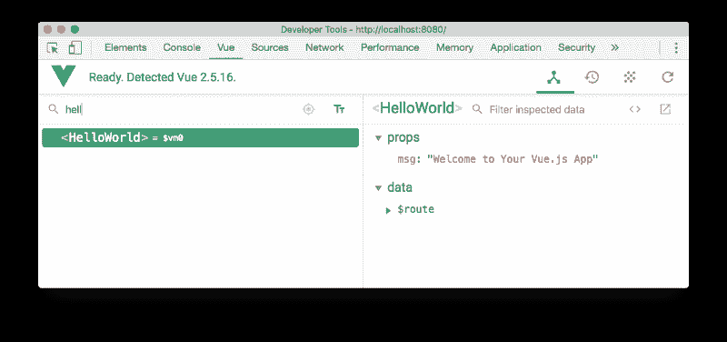

#### 在页面中选择一个组件

点击`**Select component in the page**`按钮。


Select component in the page

您可以将鼠标悬停在页面中的任何组件上，单击它，它将在 devtools 中打开。

#### 格式化组件名称

您可以选择在 camelCase 中显示组件或使用破折号。

#### 过滤检查的数据

在右侧面板上，您可以键入任何单词来过滤不匹配的属性。

#### 检查 DOM

单击 Inspect DOM 按钮，进入 DevTools 元素检查器，组件会生成 DOM 元素:

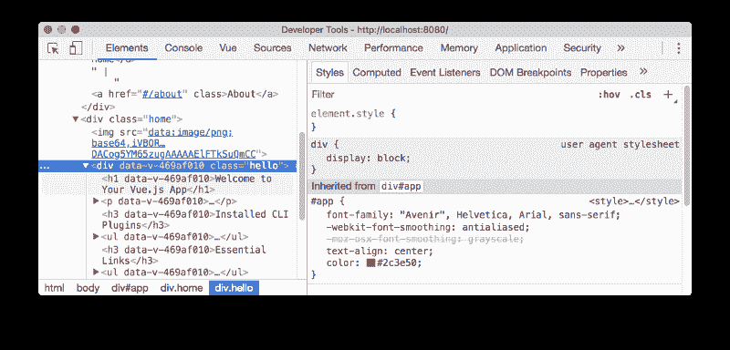

Inspect the DOM

#### 在编辑器中打开

任何用户组件(不是框架级组件)都有一个按钮，可以在默认编辑器中打开它。非常方便。

### 使用 Vue 的设置与代码

Visual Studio Code 是目前世界上使用最多的代码编辑器之一。像许多软件产品一样，编辑器也有一个周期。曾经 [TextMate](https://macromates.com/) 是开发者的最爱，后来是[崇高文本](https://www.sublimetext.com/)，现在是 VS 代码。

受欢迎的酷之处在于，人们会花大量时间为他们能想到的任何东西开发插件。

一个这样的插件是一个很棒的工具，可以帮助我们 Vue.js 开发者。

#### 艺术品或古董

它叫做 Vetur，非常受欢迎(超过 300 万次下载)，你可以在 Visual Studio Marketplace 上找到它[。](https://marketplace.visualstudio.com/items?itemName=octref.vetur)

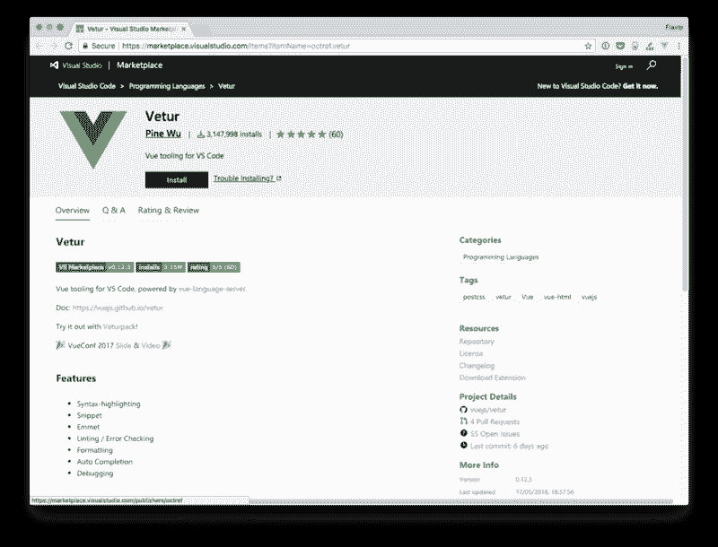

#### 安装 vertu

单击 Install 按钮将触发 VS 代码中的安装面板:

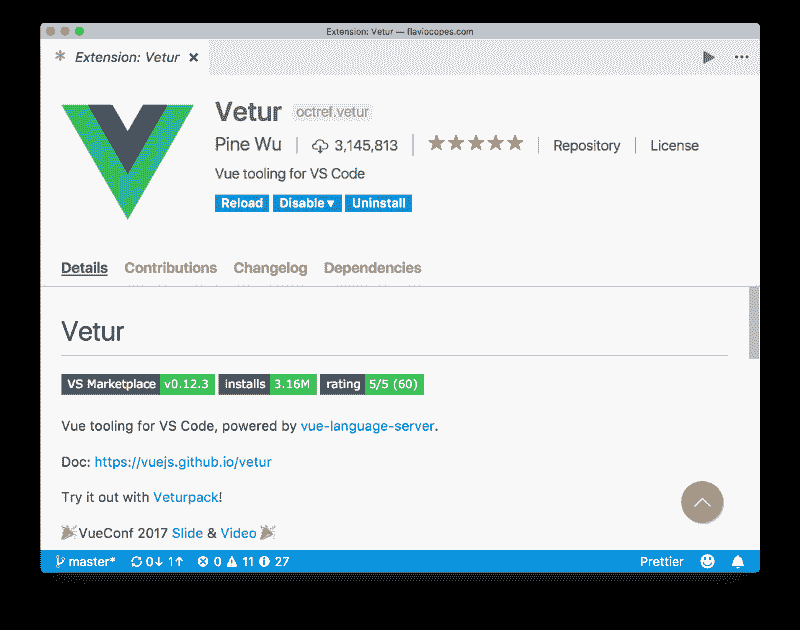

您也可以简单地在 VS 代码中打开扩展并搜索“vetur”:

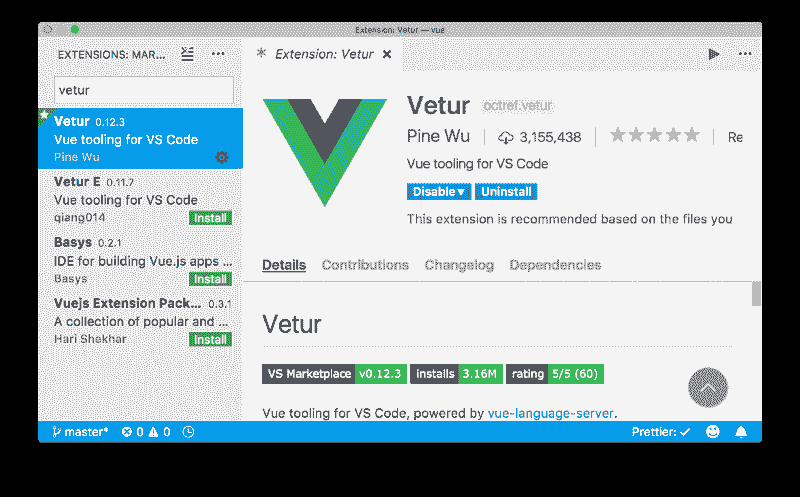

这个扩展提供了什么？

#### 语法突出显示

Vetur 为所有的 Vue 源代码文件提供语法高亮显示。

如果没有 Vetur，VS 代码将以这种方式显示一个`.vue`文件:

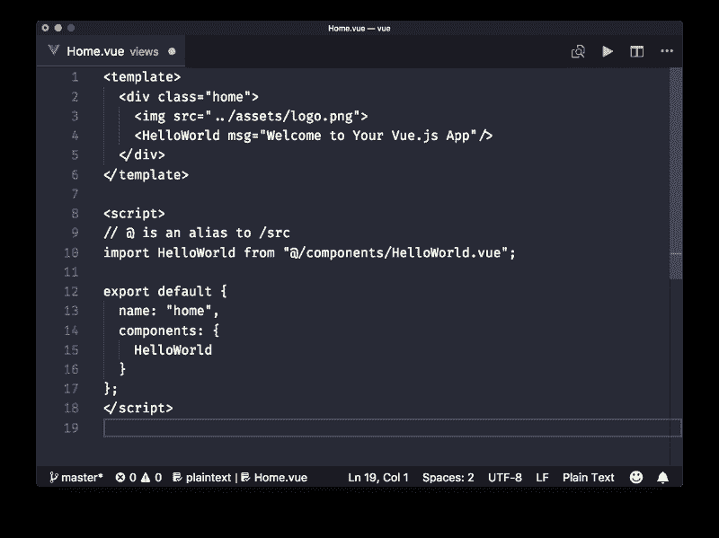

安装 Vetur 后:

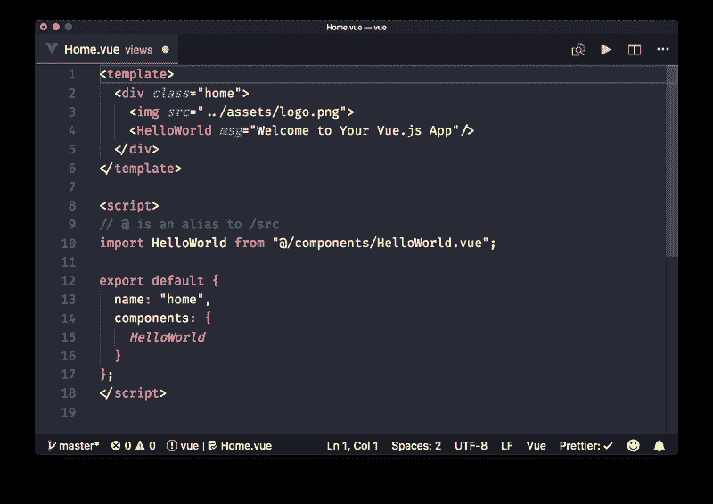

VS 代码能够从文件的扩展名中识别包含在文件中的代码类型。

使用单个文件组件，您可以在同一个文件中混合不同类型的代码，从 CSS 到 JavaScript 到 HTML。

默认情况下，VS 代码不能识别这种情况，Vetur 为您使用的每种代码都提供了语法高亮显示。

除其他外，Vetur 还支持:

*   超文本标记语言
*   半铸钢ˌ钢性铸铁(Cast Semi-Steel)
*   Java Script 语言
*   哈巴狗
*   Haml
*   SCSS
*   PostCSS
*   厚颜无耻
*   唱针
*   以打字打的文件

#### 片段

与语法突出显示一样，由于 VS 代码不能确定包含在一个`.vue`文件的一部分中的代码种类，它不能提供我们都喜欢的代码片段。片段是我们可以添加到文件中的代码片段，由专门的插件提供。

Vetur 让 VS Code 能够在单个文件组件中使用您喜欢的片段。

#### 智能感知

[智能感知](https://code.visualstudio.com/docs/editor/intellisense)也由 Vetur 为每种不同的语言启用，具有自动完成功能:

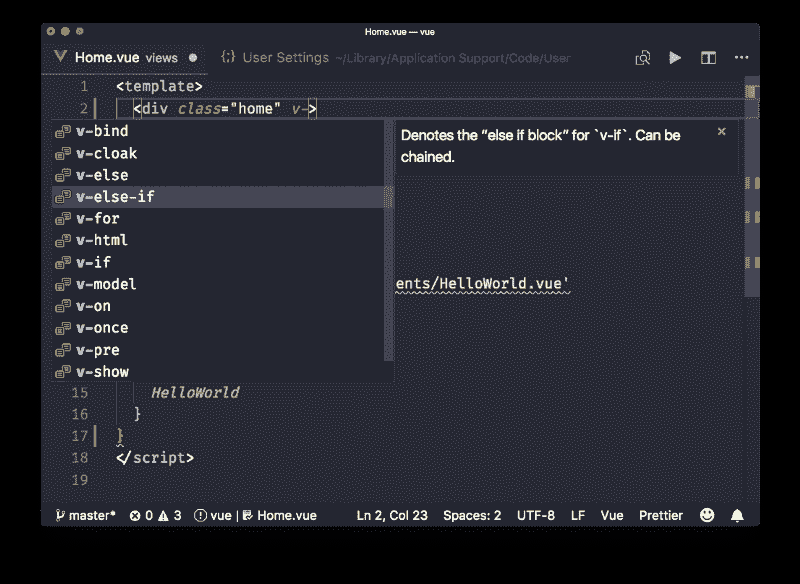

#### 脚手架

除了支持定制代码片段，Vetur 还提供了自己的代码片段集。每一个都用自己的语言创建一个特定的标签(模板、脚本或样式):

*   `scaffold`
*   `template with html`
*   `template with pug`
*   `script with JavaScript`
*   `script with TypeScript`
*   `style with CSS`
*   `style with CSS (scoped)`
*   `style with scss`
*   `style with scss (scoped)`
*   `style with less`
*   `style with less (scoped)`
*   `style with sass`
*   `style with sass (scoped)`
*   `style with postcss`
*   `style with postcss (scoped)`
*   `style with stylus`
*   `style with stylus (scoped)`

如果您键入`scaffold`，您将得到一个单文件组件的启动包:

```
<template>
```

```
</template>
```

```
<script>export default {
```

```
}</script>
```

```
<style>
```

```
</style>
```

其他的是特定的，创建一个单独的代码块。

**注:上表中的**(作用域)表示仅适用于当前组件。

#### 蚂蚁

默认支持流行的 HTML/CSS 缩写引擎 Emmet 。您可以键入一个 Emmet 缩写，按下`tab` VS Code 会自动将其扩展为 HTML 的等效形式:

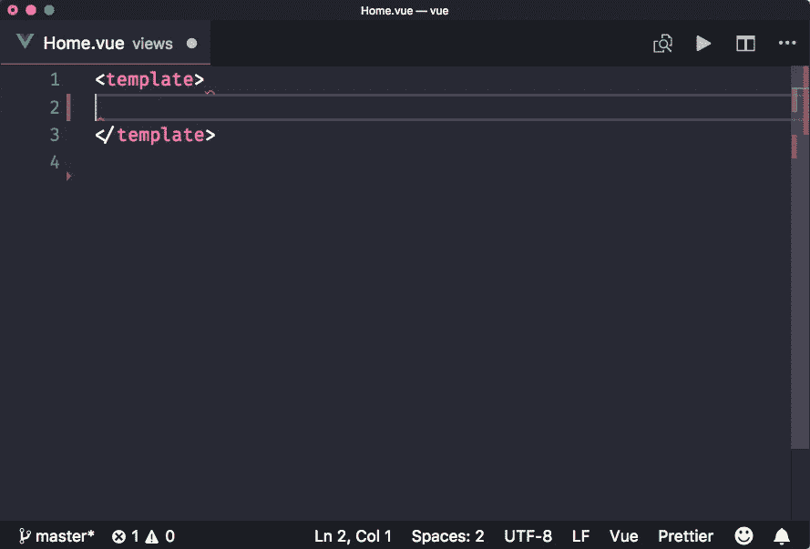

#### 林挺和错误检查

Vetur 通过 [VS Code ESLint 插件](https://marketplace.visualstudio.com/items?itemName=dbaeumer.vscode-eslint)与 ESLint 集成。

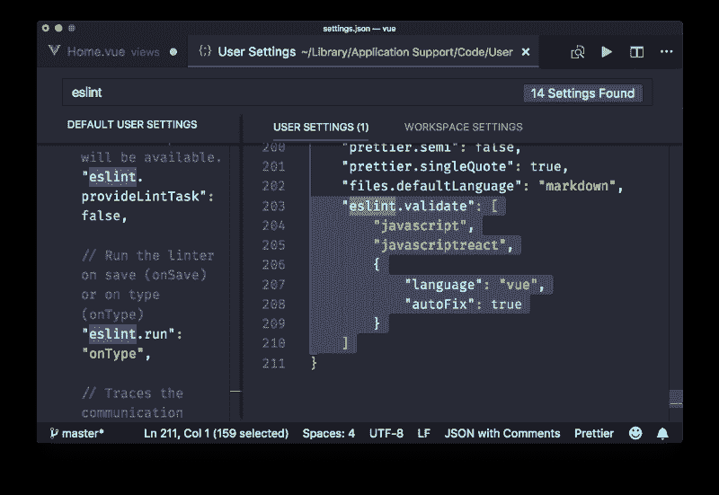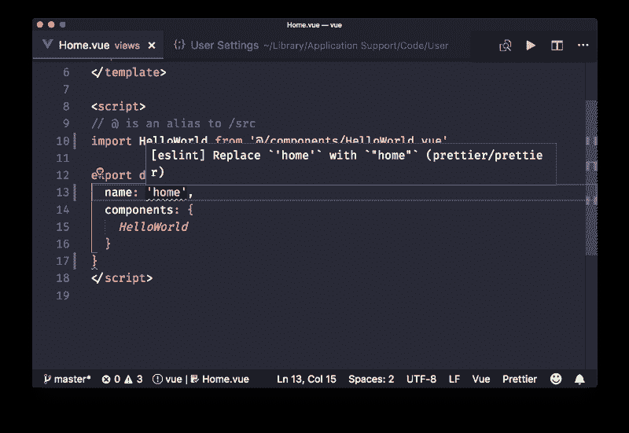

#### 代码格式

Vetur 提供代码格式化的自动支持，以便在保存时格式化整个文件——结合`"editor.formatOnSave"` VS 代码设置。

您可以通过在 VS 代码设置中设置`vetur.format.defaultFormatter.XXXXX`到`none`来选择禁用某些特定语言的自动格式化。要更改其中一个设置，只需开始搜索字符串，并在右侧面板的用户设置中覆盖您想要的内容。

大多数受支持的语言使用[prettle](https://prettier.io/)进行自动格式化，这是一个正在成为行业标准的工具。它使用你更漂亮的配置来决定你的偏好。

### Vue 组件简介

组件是接口的单个独立单元。它们可以有自己的状态、标记和样式。

#### 如何使用组件

Vue 组件可以通过四种主要方式来定义。我们用暗语说吧。

首先是:

```
new Vue({  /* options */})
```

第二是:

```
Vue.component('component-name', {  /* options */})
```

第三种是通过使用本地组件。这些组件只能由特定的组件访问，在其他地方是不可用的(非常适合封装)。

第四个是在`.vue`文件中，也叫单文件组件。

让我们详细研究前三种方法。

当你构建一个不是单页面应用程序(SPA)的应用程序时，使用`new Vue()`或`Vue.component()`是使用 Vue 的标准方式。更确切地说，当您只是在某些页面中使用 Vue.js 时，您会使用这种方法，比如在联系人表单或购物车中。或者，所有页面都使用 Vue，但是服务器呈现布局，您将 HTML 提供给客户端，然后客户端加载您构建的 Vue 应用程序。

在 SPA 中，是 Vue 构建 HTML，更常见的是使用单个文件组件，因为它们更方便。

通过在 DOM 元素上挂载 Vue 来实例化它。如果你有一个`<div id="app">` < /div >标签，你将使用:

```
new Vue({ el: '#app' })
```

用`new Vue`初始化的组件没有对应的标签名，所以它通常是主容器组件。

应用程序中使用的其他组件使用`Vue.component()`进行初始化。这样一个组件允许您定义一个标签——使用它您可以在应用程序中多次嵌入组件——并在`template`属性中指定组件的输出:

```
<div id="app">  <user-name name="Flavio"></user-name></div>
```

```
Vue.component('user-name', {  props: ['name'],  template: '<p>Hi {{ name }}</p>'})
```

```
new Vue({  el: '#app'})
```

[参见 JSFiddle 上的](https://jsfiddle.net/flaviocopes/nvgedhq4/)

我们在做什么？我们在`#app`上初始化一个 Vue 根组件，在里面，我们使用 Vue 组件`user-name`，它抽象出我们对用户的问候。

该组件接受一个属性，它是我们用来将数据向下传递给子组件的属性。

在`Vue.component()`调用中，我们将`user-name`作为第一个参数传递。这为组件提供了一个名称。你可以用两种方式写这个名字。第一个是我们用过的，叫做烤肉串盒。第二个名为 PascalCase，类似于 camelCase，但第一个字母大写:

```
Vue.component('UserName', {  /* ... */})
```

Vue 会自动在内部创建一个从`user-name`到`UserName`的别名，反之亦然，你可以随便用。通常最好在 JavaScript 中使用`UserName`，在模板中使用`user-name`。

#### 本地组件

使用`Vue.component()`创建的任何组件都是全局注册的。您不需要将它赋给一个变量，或者传递它以便在模板中重用它。

通过将定义组件对象的对象赋给变量，可以在本地封装组件:

```
const Sidebar = {  template: '<aside>Sidebar</aside>'}
```

然后通过使用`components`属性使其在另一个组件中可用:

```
new Vue({  el: '#app',  components: {    Sidebar  }})
```

您可以在同一个文件中编写组件，但是最好的方法是使用 JavaScript 模块:

```
import Sidebar from './Sidebar'
```

```
export default {  el: '#app',  components: {    Sidebar  }}
```

#### 重用组件

子组件可以多次添加。每个单独的实例都独立于其他实例:

```
<div id="app">  <user-name name="Flavio"></user-name>  <user-name name="Roger"></user-name>  <user-name name="Syd"></user-name></div>
```

```
Vue.component('user-name', {  props: ['name'],  template: '<p>Hi {{ name }}</p>'})
```

```
new Vue({  el: '#app'})
```

[参见 JSFiddle 上的](https://jsfiddle.net/flaviocopes/3kebv908/)

#### 组件的构造块

到目前为止，我们已经看到了组件如何接受`el`、`props`和`template`属性。

*   `el`仅在使用`new Vue({})`初始化的根组件中使用，并标识组件将挂载的 DOM 元素。
*   列出了我们可以传递给子组件的所有属性
*   `template`是我们可以设置组件模板的地方，它将负责定义组件生成的输出。

组件接受其他属性:

*   `data`组件本地状态
*   `methods`:组件方法
*   `computed`:与组件相关联的计算属性
*   `watch`:组件观察者

### 单个文件组件

Vue 组件可以在 JavaScript 文件(`.js`)中声明，如下所示:

```
Vue.component('component-name', {  /* options */})
```

或者还有:

```
new Vue({  /* options */})
```

或者可以在一个`.vue`文件中指定。

`.vue`文件非常酷，因为它允许您定义:

*   JavaScript 逻辑
*   HTML 代码模板
*   CSS 样式

都在一个文件里。因此，它获得了单个文件组件的名称。

这里有一个例子:

```
<template>  <p>{{ hello }}</p></template>
```

```
<script>export default {  data() {    return {      hello: 'Hello World!'    }  }}</script>
```

```
<style scoped>  p {    color: blue;  }</style>
```

多亏了 Webpack 的使用，所有这些都成为可能。Vue CLI 使这变得非常简单，并且开箱即可支持。没有 Webpack 设置，文件无法使用，因此，它们不太适合只在页面上使用 Vue 的应用程序，而不是成熟的单页面应用程序(SPA)。

由于单个文件组件依赖于 Webpack，我们可以免费使用现代 Web 功能。

你的 CSS 可以用 SCSS 或者手写笔来定义，模板可以用 Pug 来构建，你所要做的就是向 Vue 声明你将使用哪种语言的预处理器。

支持的预处理程序列表包括

*   以打字打的文件
*   SCSS
*   厚颜无耻
*   较少的
*   PostCSS
*   哈巴狗

我们可以使用现代 JavaScript(ES6–7–8 ),而不考虑使用 Babel 集成的目标浏览器，ES 模块也是如此，因此我们可以使用`import/export`语句。

我们可以使用 CSS 模块来限定 CSS 的范围。

说到 CSS 的作用域，通过使用`<style scop` ed >标签，单个文件组件使得编写不会**向其他组件泄露**的 CSS 变得绝对容易。

如果省略`scoped`，你定义的 CSS 将是全局的。但是添加了`scoped`标签，Vue 会自动为组件添加一个特定的类，对你的应用程序来说是唯一的，所以 CSS 保证不会泄露给其他组件。

也许您的 JavaScript 很庞大，因为您需要处理一些逻辑。如果您想为您的 JavaScript 使用一个单独的文件呢？

您可以使用`src`属性将其具体化:

```
<template>  <p>{{ hello }}</p></template><script src="./hello.js"></script>
```

这也适用于您的 CSS:

```
<template>  <p>{{ hello }}</p></template><script src="./hello.js"></script><style src="./hello.css"></style>
```

注意我是如何使用

```
export default {  data() {    return {      hello: 'Hello World!'    }  }}
```

在组件的 JavaScript 中设置数据。

您将看到的其他常见方式有:

```
export default {  data: function() {    return {      name: 'Flavio'    }  }}
```

以上相当于我们之前做的。

或者:

```
export default {  data: () => {    return {      name: 'Flavio'    }  }}
```

这是不同的，因为它使用了箭头函数。箭头函数很好，直到我们需要访问一个组件方法。如果我们需要使用`this`，这是一个问题，并且这样的属性没有绑定到使用箭头函数的组件。所以必须使用常规的 T2 函数而不是箭头函数。

您可能还会看到:

```
module.exports = {  data: () => {    return {      name: 'Flavio'    }  }}
```

这是使用 [CommonJS](http://requirejs.org/docs/commonjs.html) 语法，它也能工作。但是我推荐使用 ES 模块语法，因为这是一个 JavaScript 标准。

### “模板”视图

Vue.js 使用的模板语言是 HTML 的超集。

任何 HTML 都是有效的 Vue.js 模板。除此之外，Vue.js 还提供了两个强大的功能:插值和指令。

这是一个有效的 Vue.js 模板:

```
<span>Hello!</span>
```

这个模板可以放在显式声明的 Vue 组件中:

```
new Vue({  template: '<span>Hello!</span>'})
```

或者它可以放入单个文件组件中:

```
<template>  <span>Hello!</span></template>
```

第一个例子非常简单。下一步是让它输出组件状态的一部分，例如，一个名称。

这可以通过插值来实现。首先，我们向组件添加一些数据:

```
new Vue({  
  data: {    
    name: 'Flavio'  
  },  
  template: '<span>Hello!</span>'
})
```

然后我们可以使用双括号语法将它添加到模板中:

```
new Vue({  data: {    name: 'Flavio'  },  template: '<span>Hello {{name}}!</span>'})
```

有趣的是。看到我们刚刚怎么用`name`代替`this.data.name`了吗？

这是因为 Vue.js 做了一些内部绑定，让模板像在本地一样使用属性。非常方便。

在单个文件组件中，这将是:

```
<template>  <span>Hello {{name}}!</span></template>
```

```
<script>export default {  data() {    return {      name: 'Flavio'    }  }}</script>
```

我在导出中使用了常规函数。为什么不是箭头函数？

这是因为在`data`中，我们可能需要访问组件实例中的方法，如果`this`没有绑定到组件，我们就不能这样做，所以我们不能使用箭头函数。

请注意，我们可以使用一个箭头函数，但是我需要记住切换到一个常规函数，以防我使用`this`。我想最好谨慎行事。

现在，回到插值。

`{{ name }}`应该提醒你小胡子/车把模板插值，但这只是一个视觉提醒。

虽然在那些模板引擎中它们是“哑的”，但是在 Vue 中，你可以做更多的事情，而且它更灵活。

您可以在插值中使用任何 JavaScript 表达式，但是您只能使用一个表达式:

```
{{ name.reverse() }}
```

```
{{ name === 'Flavio' ? 'Flavio' : 'stranger' }}
```

Vue 提供了对模板中一些全局对象的访问，包括数学和日期，因此您可以使用它们:

```
{{ Math.sqrt(16) * Math.random() }}
```

最好避免在模板中添加复杂的逻辑，但是 Vue 允许这样做的事实给了我们更多的灵活性，尤其是在尝试的时候。

我们可以首先尝试将一个表达式放在模板中，然后再将它移动到一个计算属性或方法中。

任何插值中包含的值都将在它所依赖的任何数据属性发生变化时进行更新。

您可以通过使用`v-once`指令来避免这种反应。

结果总是被转义，所以输出中不能有 HTML。

如果你需要一个 HTML 代码片段，你需要使用`v-html`指令。

### 使用 CSS 样式化组件

向 Vue.js 组件添加 CSS 的最简单的方法是使用`style`标签，就像在 HTML 中一样:

```
<template>  <p style="text-decoration: underline">Hi!</p></template>
```

```
<script>export default {  data() {    return {      decoration: 'underline'    }  }}</script>
```

这是你能得到的最静态的。如果想在组件数据中定义`underline`呢？你可以这样做:

```
<template>  <p :style="{'text-decoration': decoration}">Hi!</p></template>
```

```
<script>export default {  data() {    return {      decoration: 'underline'    }  }}</script>
```

`:style`是`v-bind:style`的简称。我将在本教程中使用这种简写方式。

注意我们是如何用引号将`text-decoration`括起来的。这是因为破折号不是有效 JavaScript 标识符的一部分。

您可以通过使用 Vue.js 支持的特殊 camelCase 语法来避免引号，并将其重写为`textDecoration`:

```
<template>  <p :style="{textDecoration: decoration}">Hi!</p></template>
```

您可以引用一个计算属性，而不是将对象绑定到`style`:

```
<template>  <p :style="styling">Hi!</p></template>
```

```
<script>export default {  data() {    return {      textDecoration: 'underline',      textWeight: 'bold'    }  },  computed: {    styling: function() {      return {        textDecoration: this.textDecoration,        textWeight: this.textWeight      }    }  }}</script>
```

Vue 组件生成普通的 HTML，因此您可以选择为每个元素添加一个类，并添加一个相应的 CSS 选择器，该选择器具有样式化它的属性:

```
<template>  <p class="underline">Hi!</p></template>
```

```
<style>.underline { text-decoration: underline; }</style>
```

你可以这样使用 SCSS:

```
<template>  <p class="underline">Hi!</p></template>
```

```
<style lang="scss">body {  .underline { text-decoration: underline; }}</style>
```

你可以像上面的例子一样硬编码这个类。或者，您可以将该类绑定到组件属性，使其成为动态的，并且仅在数据属性为 true 时应用于该类:

```
<template>  <p :class="{underline: isUnderlined}">Hi!</p></template>
```

```
<script>export default {  data() {    return {      isUnderlined: true    }  }}</script>
```

```
<style>.underline { text-decoration: underline; }</style>
```

而不是将一个对象绑定到类，就像我们对`<p :class="{text: isText}">H` i！< /p >，可以直接绑定一个字符串，这样会引用一个数据属性:

```
<template>  <p :class="paragraphClass">Hi!</p></template>
```

```
<script>export default {  data() {    return {      paragraphClass: 'underline'    }  }}</script>
```

```
<style>.underline { text-decoration: underline; }</style>
```

您可以分配多个类，在这种情况下，可以通过向`paragraphClass`添加两个类，也可以通过使用一个数组:

```
<template>  <p :class="[decoration, weight]">Hi!</p></template>
```

```
<script>export default {  data() {    return {      decoration: 'underline',      weight: 'weight',    }  }}</script>
```

```
<style>.underline { text-decoration: underline; }.weight { font-weight: bold; }</style>
```

使用类绑定中内联的对象也可以做到这一点:

```
<template>  <p :class="{underline: isUnderlined, weight: isBold}">Hi!</p></template>
```

```
<script>export default {  data() {    return {      isUnderlined: true,      isBold: true    }  }}</script>
```

```
<style>.underline { text-decoration: underline; }.weight { font-weight: bold; }</style>
```

你可以把这两种说法结合起来:

```
<template>  <p :class="[decoration, {weight: isBold}]">Hi!</p></template>
```

```
<script>export default {  data() {    return {      decoration: 'underline',      isBold: true    }  }}</script>
```

```
<style>.underline { text-decoration: underline; }.weight { font-weight: bold; }</style>
```

您也可以使用返回对象的计算属性，当您有许多 CSS 类要添加到同一个元素时，这种方法最有效:

```
<template>  <p :class="paragraphClasses">Hi!</p></template>
```

```
<script>export default {  data() {    return {      isUnderlined: true,      isBold: true    }  },  computed: {    paragraphClasses: function() {      return {        underlined: this.isUnderlined,        bold: this.isBold      }    }  }}</script>
```

```
<style>.underlined { text-decoration: underline; }.bold { font-weight: bold; }</style>
```

注意，在 computed 属性中，您需要使用`this.[propertyName]`来引用组件数据，而在模板数据中，属性被方便地放在第一级属性中。

任何没有像第一个例子中那样硬编码的 CSS 都将由 Vue 处理，Vue 很好地为我们自动添加了 CSS 前缀。这允许我们编写干净的 CSS，同时仍然针对旧的浏览器(这仍然意味着 Vue 支持的浏览器，所以 IE9+)。

### 指令

我们在 Vue.js 模板和插值中看到了如何在 Vue 模板中嵌入数据。

本节解释了 Vue.js 在模板:指令中提供的另一项技术。

指令基本上类似于添加在模板中的 HTML 属性。它们都以`v-`开头，表示这是一个 Vue 特殊属性。

让我们详细看看每个 Vue 指令。

#### `v-text`

你可以使用`v-text`指令来代替插值。它执行相同的工作:

```
<span v-text="name"></span>
```

#### `v-once`

您知道`{{ name }}`如何绑定到组件数据的`name`属性。

任何时候`name`组件数据发生变化，Vue 都会更新浏览器中显示的值。

除非您使用`v-once`指令，它基本上就像一个 HTML 属性:

```
<span v-once>{{ name }}</span>
```

#### `v-html`

当您使用内插法打印数据属性时，HTML 会被转义。这是 Vue 用来自动防御 XSS 攻击的一个很好的方法。

但是，有些情况下，您希望输出 HTML 并让浏览器解释它。您可以使用`v-html`指令:

```
<span v-html="someHtml"></span>
```

#### `v-bind`

插值只适用于标签内容。不能用在属性上。

属性必须使用`v-bind`:

```
<a v-bind:href="url">{{ linkText }}</a>
```

`v-bind`如此常见，以至于有一个简写的语法:

```
<a v-bind:href="url">{{ linkText }}</a><a :href="url">{{ linkText }}</a>
```

#### 使用`v-model`进行双向绑定

`v-model`例如，让我们绑定一个表单输入元素，当用户改变字段内容时，让它改变 Vue 数据属性:

```
<input v-model="message" placeholder="Enter a message"><p>Message is: {{ message }}</p>
```

```
<select v-model="selected">  <option disabled value="">Choose a fruit</option>  <option>Apple</option>  <option>Banana</option>  <option>Strawberry</option></select><span>Fruit chosen: {{ selected }}</span>
```

#### 使用表达式

您可以在指令中使用任何 JavaScript 表达式:

```
<span v-text="'Hi, ' + name + '!'"></span>
```

```
<a v-bind:href="'https://' + domain + path">{{ linkText }}</a>
```

指令中使用的任何变量都引用相应的数据属性。

#### 条件式

在指令中，您可以使用三元运算符来执行条件检查，因为这是一个表达式:

```
<span v-text="name == Flavio ? 'Hi Flavio!' : 'Hi' + name + '!'"></span>
```

有专门的指令允许你执行更有组织的条件:`v-if`、`v-else`和`v-else-if`。

```
<p v-if="shouldShowThis">Hey!</p>
```

`shouldShowThis`是包含在组件数据中的布尔值。

#### 环

`v-for`允许您呈现项目列表。与`v-bind`结合使用，设置列表中每个项目的属性。

您可以迭代一个简单的值数组:

```
<template>  <ul>    <li v-for="item in items">{{ item }}</li>  </ul></template>
```

```
<script>export default {  data() {    return {      items: ['car', 'bike', 'dog']    }  }}</script>
```

或者在一系列物体上:

```
<template>  <div>    <!-- using interpolation -->    <ul>      <li v-for="todo in todos">{{ todo.title }}</li>    </ul>    <!-- using v-text -->    <ul>      <li v-for="todo in todos" v-text="todo.title"></li>    </ul>  </div></template>
```

```
<script>export default {  data() {    return {      todos: [        { id: 1, title: 'Do something' },        { id: 2, title: 'Do something else' }      ]    }  }}</script>
```

`v-for`可以给你指数使用:

```
<li v-for="(todo, index) in todos"></li>
```

#### 事件

`v-on`允许你监听 DOM 事件，并在事件发生时触发一个方法。这里我们听一个点击事件:

```
<template>  <a v-on:click="handleClick">Click me!</a></template>
```

```
<script>export default {  methods: {    handleClick: function() {      alert('test')    }  }}</script>
```

您可以将参数传递给任何事件:

```
<template>  <a v-on:click="handleClick('test')">Click me!</a></template>
```

```
<script>export default {  methods: {    handleClick: function(value) {      alert(value)    }  }}</script>
```

一小部分 JavaScript(单个表达式)可以直接放入模板中:

```
<template>  <a v-on:click="counter = counter + 1">{{counter}}</a></template>
```

```
<script>export default {  data: function() {    return {      counter: 0    }  }}</script>
```

仅仅是一种事件。一个常见的事件是`submit`，您可以使用`v-on:submit`绑定它。

`v-on`是如此常见，以至于有一个简写的语法，它就是`@`:

```
<a v-on:click="handleClick">Click me!</a><a @click="handleClick">Click me!</a>
```

#### 显示或隐藏

您可以选择仅在 Vue 实例的特定属性评估为 true 时显示 DOM 中的元素，使用`v-show`:

```
<p v-show="isTrue">Something</p>
```

元素仍然被插入到 DOM 中，但是如果条件不满足，则被设置为`display: none`。

#### 事件指令修饰符

Vue 提供了一些可选的事件修饰符，您可以与`v-on`结合使用，这些修饰符会自动让事件做一些事情，而无需您在事件处理程序中显式编码。

一个很好的例子是`.prevent`，它在事件上自动调用`preventDefault()`。

在这种情况下，表单不会导致页面重新加载，这是默认行为:

```
<form v-on:submit.prevent="formSubmitted"></form>
```

其他修改量包括`.stop`、`.capture`、`.self`、`.once`、`.passive`，在正式文件中有详细描述[。](https://vuejs.org/v2/guide/events.html#Event-Modifiers)

#### 自定义指令

Vue 默认指令已经让您做了很多工作，但是如果您愿意，您可以随时添加新的自定义指令。

如果您有兴趣了解更多信息，请阅读此处的。

### 方法

#### Vue.js 方法有哪些？

Vue 方法是与 Vue 实例相关联的函数。

方法是在`methods`属性中定义的:

```
new Vue({  methods: {    handleClick: function() {      alert('test')    }  }})
```

或者在单个文件组件的情况下:

```
<script>export default {  methods: {    handleClick: function() {      alert('test')    }  }}</script>
```

当您需要执行一个动作，并在元素上附加一个`v-on`指令来处理事件时，方法特别有用。比如这个，它在元素被点击时调用`handleClick`:

```
<template>  <a @click="handleClick">Click me!</a></template>
```

#### 将参数传递给 Vue.js 方法

方法可以接受参数。

在这种情况下，您只需在模板中传递参数:

```
<template>  <a @click="handleClick('something')">Click me!</a></template>
```

```
new Vue({  methods: {    handleClick: function(text) {      alert(text)    }  }})
```

或者在单个文件组件的情况下:

```
<script>export default {  methods: {    handleClick: function(text) {      alert(text)    }  }}</script>
```

#### 如何从方法中访问数据

您可以使用`this.propertyName`来访问 Vue 组件的任何数据属性:

```
<template>  <a @click="handleClick()">Click me!</a></template>
```

```
<script>export default {  data() {    return {      name: 'Flavio'    }  },  methods: {    handleClick: function() {      console.log(this.name)    }  }}</script>
```

我们不一定要用`this.data.name`，只用`this.name`。Vue 确实为我们提供了一个透明的绑定。使用`this.data.name`会引发一个错误。

正如您在前面的**事件**描述中看到的，方法与事件紧密相连，因为它们被用作事件处理程序。每次事件发生时，都会调用该方法。

### 观察者

观察器是一个特殊的 Vue.js 特性，它允许您监视组件状态的一个属性，并在属性值改变时运行一个函数。

这里有一个例子。我们有一个组件显示名称，并允许您通过单击按钮来更改它:

```
<template>  <p>My name is {{name}}</p>  <button @click="changeName()">Change my name!</button></template>
```

```
<script>export default {  data() {    return {      name: 'Flavio'    }  },  methods: {    changeName: function() {      this.name = 'Flavius'    }  }}</script>
```

当名称改变时，我们需要做一些事情，比如打印控制台日志。

我们可以通过向`watch`对象添加一个名为我们想要监视的数据属性的属性来做到这一点:

```
<script>export default {  data() {    return {      name: 'Flavio'    }  },  methods: {    changeName: function() {      this.name = 'Flavius'    }  },  watch: {    name: function() {      console.log(this.name)    }  }}</script>
```

分配给`watch.name`的函数可以选择接受 2 个参数。第一个是新的属性值。第二个是旧的财产价值:

```
<script>export default {  /* ... */  watch: {    name: function(newValue, oldValue) {      console.log(newValue, oldValue)    }  }}</script>
```

不能像使用计算属性那样从模板中查找观察器。

### 计算属性

#### 什么是计算属性

在 Vue.js 中，您可以使用括号输出任何数据值:

```
<template>  <p>{{ count }}</p></template>
```

```
<script>export default {  data() {    return {      count: 1    }  }}</script>
```

该属性可以承载一些小型计算。例如:

```
<template>  {{ count * 10 }}</template>
```

但是你只能使用一个 JavaScript 表达式。

除了这个技术限制之外，您还需要考虑模板应该只关心向用户显示数据，而不是执行逻辑计算。

要做比单个表达式更多的事情，并拥有更多的声明性模板，可以使用计算属性。

计算的属性在 Vue 组件的`computed`属性中定义:

```
<script>export default {  computed: {
```

```
 }}</script>
```

#### 计算属性的示例

下面是一个使用计算属性`count`来计算输出的例子。

注意:

1.  我没必要打电话给`{{ count() }}`。Vue.js 自动调用该函数
2.  我使用常规函数(不是箭头函数)来定义`count`计算属性，因为我需要能够通过`this`访问组件实例。

```
<template>  <p>{{ count }}</p></template>
```

```
<script>export default {  data() {    return {      items: [1, 2, 3]    }  },  computed: {    count: function() {      return 'The count is ' + this.items.length * 10    }  }}</script>
```

#### 计算属性与方法

如果你已经了解了 Vue 方法，你可能想知道有什么不同。

首先，方法必须被调用，而不仅仅是被引用，所以您需要做:

```
<template>  <p>{{ count() }}</p></template>
```

```
<script>export default {  data() {    return {      items: [1, 2, 3]    }  },  methods: {    count: function() {      return 'The count is ' + this.items.length * 10    }  }}</script>
```

但是主要的区别是计算的属性被缓存。

在`items`数据属性改变之前，`count`计算属性的结果被内部缓存。

**重要提示:**计算属性仅在无功源更新时更新。常规的 JavaScript 方法不是反应式的，所以一个常见的例子是使用`Date.now()`:

```
<template>  <p>{{ now }}</p></template>
```

```
<script>export default {  computed: {    now: function () {      return Date.now()    }  }}</script>
```

它会渲染一次，然后即使组件重新渲染也不会更新。当 Vue 组件退出并重新初始化时，它只是在页面刷新时更新。

在这种情况下，方法更适合您的需要。

### 方法与观察器和计算属性

现在您已经了解了方法、观察器和计算属性，您可能想知道什么时候应该使用其中一个而不是其他的。

下面是这个问题的分解。

#### 何时使用方法

*   对 DOM 中发生的一些事件做出反应
*   当组件中发生某种情况时调用一个函数。您可以从计算属性或观察器中调用方法。

#### 何时使用计算属性

*   您需要从现有数据源合成新数据
*   您在模板中使用了一个变量，该变量是根据一个或多个数据属性构建的
*   您希望将一个复杂的、嵌套的属性名简化为一个可读性更好、更易于使用的名称(但是当原始属性发生变化时要更新它)
*   您需要从模板中引用一个值。在这种情况下，创建一个计算属性是最好的，因为它被缓存了。
*   您需要监听不止一个数据属性的变化

#### 何时使用观察器

*   您希望在数据属性发生变化时进行监听，并执行一些操作
*   你想听一个合适值变化
*   你只需要监听一个特定的属性(不能同时监听多个属性)
*   您希望观察一个数据属性，直到它达到某个特定值，然后再做一些事情

### Props:将数据传递给子组件

Props 是组件从包含它们的组件(父组件)接受数据的方式。

当一个组件需要一个或多个属性时，它必须在它的`props`属性中定义它们:

```
Vue.component('user-name', {  props: ['name'],  template: '<p>Hi {{ name }}</p>'})
```

或者，在 Vue 单个文件组件中:

```
<template>  <p>{{ name }}</p></template>
```

```
<script>export default {  props: ['name']}</script>
```

#### 接受多个道具

您可以拥有多个属性，只需将它们附加到数组中:

```
Vue.component('user-name', {  props: ['firstName', 'lastName'],  template: '<p>Hi {{ firstName }} {{ lastName }}</p>'})
```

#### 设置道具类型

通过使用对象而不是数组，使用属性的名称作为每个属性的键，使用类型作为值，可以非常简单地指定属性的类型:

```
Vue.component('user-name', {  props: {    firstName: String,    lastName: String  },  template: '<p>Hi {{ firstName }} {{ lastName }}</p>'})
```

您可以使用的有效类型有:

*   线
*   数字
*   布尔代数学体系的
*   排列
*   目标
*   日期
*   功能
*   标志

当类型不匹配时，Vue 会在控制台中向您发出警告(在开发模式下)。

道具类型可以更清晰。

您可以允许多个不同的值类型:

```
props: {  firstName: [String, Number]}
```

#### 将道具设置为强制

您可以要求道具是强制性的:

```
props: {  firstName: {    type: String,    required: true  }}
```

#### 设置道具的默认值

您可以指定默认值:

```
props: {  firstName: {    type: String,    default: 'Unknown person'  }}
```

对于对象:

```
props: {  name: {    type: Object,    default: {      firstName: 'Unknown',      lastName: ''    }  }}
```

`default`也可以是返回适当值的函数，而不是实际值。

您甚至可以构建一个定制的验证器，这对于复杂的数据来说很酷:

```
props: {  name: {    validator: name => {      return name === 'Flavio' //only allow "Flavios"    }  }}
```

#### 将道具传递给组件

使用以下语法将属性传递给组件

```
<ComponentName color="white" />
```

如果你传递的是一个静态值。

如果是数据属性，则使用

```
<template>  <ComponentName :color=color /></template>
```

```
<script>...export default {  //...  data: function() {    return {      color: 'white'    }  },  //...}</script>
```

您可以在 prop 值中使用三元运算符来检查真值条件并传递依赖于它的值:

```
<template>  <ComponentName :colored="color == 'white' ? true : false" /></template>
```

```
<script>...export default {  //...  data: function() {    return {      color: 'white'    }  },  //...}</script>
```

### 在 Vue 中处理事件

#### 什么是 Vue.js 事件？

Vue.js 允许我们通过在元素上使用`v-on`指令来拦截任何 DOM 事件。

如果我们想在这个元素中发生点击事件时做些什么:

```
<template>  <a>Click me!</a></template>
```

我们添加一个`v-on`指令:

```
<template>  <a v-on:click="handleClick">Click me!</a></template>
```

Vue 还为此提供了一个非常方便的替代语法:

```
<template>  <a @click="handleClick">Click me!</a></template>
```

你可以选择使用或不使用括号。`@click="handleClick"`相当于`@click="handleClick()"`。

`handleClick`是附加到组件的方法:

```
<script>export default {  methods: {    handleClick: function(event) {      console.log(event)    }  }}</script>
```

这里你需要知道的是，你可以从 events: `@click="handleClick(param)"`传递参数，它们会在方法内部被接收。

#### 访问原始事件对象

在许多情况下，您会想要对事件对象执行操作或在其中查找一些属性。你如何访问它？

使用特殊的`$event`指令:

```
<template>  <a @click="handleClick($event)">Click me!</a></template>
```

```
<script>export default {  methods: {    handleClick: function(event) {      console.log(event)    }  }}</script>
```

如果你已经传递了一个变量:

```
<template>  <a @click="handleClick('something', $event)">Click me!</a></template>
```

```
<script>export default {  methods: {    handleClick: function(text, event) {      console.log(text)      console.log(event)    }  }}</script>
```

从那里你可以调用`event.preventDefault()`，但是有一个更好的方法:事件修饰符。

#### 事件修改器

不要在你的方法中弄乱 DOM“东西”,告诉 Vue 为你处理事情:

*   `@click.prevent`呼叫`event.preventDefault()`
*   `@click.stop`呼叫`event.stopPropagation()`
*   `@click.passive`使用 addEventListener 的[被动选项](https://developer.mozilla.org/en-US/docs/Web/API/EventTarget/addEventListener#Parameters)
*   `@click.capture`使用事件捕获而不是事件冒泡
*   `@click.self`确保点击事件不是从子事件冒泡而来，而是直接发生在该元素上
*   事件只会被触发一次

所有这些选项都可以通过附加一个修饰符来组合。

有关传播、冒泡和捕获的更多信息，请参见我的 [JavaScript 事件指南](https://flaviocopes.com/javascript-events)。

### 使用插槽注入内容

组件可以选择完全定义其内容，如下所示:

```
Vue.component('user-name', {  props: ['name'],  template: '<p>Hi {{ name }}</p>'})
```

或者它也可以让父组件通过使用插槽向其中注入任何类型的内容。

什么是插槽？

你通过把`<slot>&`lt；组件模板中的/slot >:

```
Vue.component('user-information', {  template: '<div class="user-information"><slot></slot></div>'})
```

使用该组件时，在开始和结束标记之间添加的任何内容都将被添加到槽占位符内:

```
<user-information>  <h2>Hi!</h2>  <user-name name="Flavio"></user-information>
```

如果您在`<slot>&`lt；/slot >标签，如果没有传入任何内容，它将作为默认内容。

复杂的组件布局可能需要更好的方式来组织内容。

输入**命名插槽**。

使用命名槽，您可以将槽的一部分分配到组件模板布局中的特定位置，并且您可以对任何标签使用一个`slot`属性，以将内容分配到该槽。

任何模板标签之外的任何东西都被添加到主`slot`中。

为了方便起见，我在这个例子中使用了一个`page`单个文件组件:

```
<template>  <div>    <main>      <slot></slot>    </main>    <sidebar>      <slot name="sidebar"></slot>    </sidebar>  </div></template>
```

```
<page>  <ul slot="sidebar">    <li>Home</li>    <li>Contact</li>  </ul>
```

```
 <h2>Page title</h2>  <p>Page content</p></page>
```

### 过滤器，模板的助手

过滤器是 Vue 组件提供的一项功能，允许您对模板动态数据的任何部分应用格式和转换。

它们不会改变组件的数据或任何东西，但它们只会影响输出。

假设您正在打印一个姓名:

```
<template>  <p>Hi {{ name }}!</p></template>
```

```
<script>export default {  data() {    return {      name: 'Flavio'    }  }}</script>
```

如果你想检查`name`是否真的包含一个值，如果不是，打印“there”，那么我们的模板将打印“Hi there！”？

输入过滤器:

```
<template>  <p>Hi {{ name | fallback }}!</p></template>
```

```
<script>export default {  data() {    return {      name: 'Flavio'    }  },  filters: {    fallback: function(name) {      return name ? name : 'there'    }  }}</script>
```

注意应用过滤器的语法，即`| filterName`。如果您熟悉 Unix，那就是 Unix 管道操作符，它用于将一个操作的输出作为输入传递给下一个操作。

组件的`filters`属性是一个对象。单个过滤器是接受一个值并返回另一个值的函数。

返回值是实际打印在 Vue.js 模板中的值。

当然，过滤器可以访问组件数据和方法。

过滤器有什么好的用例？

*   转换字符串，例如，大写或小写
*   格式化价格

上面你看到了一个过滤器的简单例子:`{{ name | fallback }}`。

通过重复管道语法，可以链接过滤器:

```
{{ name | fallback | capitalize }}
```

这首先应用了`fallback`过滤器，然后是`capitalize`过滤器(我们没有定义，但是试着做一个！).

高级过滤器也可以接受参数，使用普通函数参数语法:

```
<template>  <p>Hello {{ name | prepend('Dr.') }}</p></template>
```

```
<script>export default {  data() {    return {      name: 'House'    }  },  filters: {    prepend: (name, prefix) => {      return `${prefix} ${name}`    }  }}</script>
```

如果将参数传递给过滤器，第一个传递给过滤器函数的总是模板插值中的项目(在本例中为`name`)，后面是您传递的显式参数。

您可以使用多个参数，用逗号分隔它们。

注意我使用了一个箭头函数。我们通常避免在方法和计算属性中使用箭头函数，因为它们几乎总是引用`this`来访问组件数据。但是在这种情况下，过滤器不需要访问`this`而是通过参数接收它需要的所有数据，我们可以放心地使用更简单的 arrow 函数语法。

[这个](https://www.npmjs.com/package/vue2-filters)包里有很多预制好的滤镜供你直接在模板里使用，包括`capitalize`、`uppercase`、`lowercase`、`placeholder`、`truncate`、`currency`、`pluralize`等等。

### 组件间的通信

Vue 中的组件可以通过各种方式进行通信。

#### 使用道具

第一种方法是使用道具。

父代通过向组件声明添加参数来“传递”数据:

```
<template>  <div>    <Car color="green" />  </div></template>
```

```
<script>import Car from './components/Car'
```

```
export default {  name: 'App',  components: {    Car  }}</script>
```

道具是单向的:从父母到孩子。每当父对象更改道具时，新值都会发送给子对象并重新渲染。

反之则不然，你永远不应该在子组件中改变道具。

#### 利用事件在孩子和父母之间进行交流

事件允许您从子节点到父节点进行通信:

```
<script>export default {  name: 'Car',  methods: {    handleClick: function() {      this.$emit('clickedSomething')    }  }}</script>
```

当将组件包含在其模板中时，父组件可以使用`v-on`指令来截取它:

```
<template>  <div>    <Car v-on:clickedSomething="handleClickInParent" />    <!-- or -->    <Car @clickedSomething="handleClickInParent" />  </div></template>
```

```
<script>export default {  name: 'App',  methods: {    handleClickInParent: function() {      //...    }  }}</script>
```

当然，您可以传递参数:

```
<script>export default {  name: 'Car',  methods: {    handleClick: function() {      this.$emit('clickedSomething', param1, param2)    }  }}</script>
```

并从父节点中检索它们:

```
<template>  <div>    <Car v-on:clickedSomething="handleClickInParent" />    <!-- or -->    <Car @clickedSomething="handleClickInParent" />  </div></template>
```

```
<script>export default {  name: 'App',  methods: {    handleClickInParent: function(param1, param2) {      //...    }  }}</script>
```

#### 使用事件总线在任何组件之间进行通信

使用事件，你不局限于父子关系。可以使用所谓的事件总线。

上面我们使用了`this.$emit`在组件实例上发出一个事件。

我们可以做的是在一个更容易访问的组件上发出事件。

`this.$root`，词根成分，常用于此。

您还可以创建一个专用于此作业的 Vue 组件，并将其导入到您需要的位置。

```
<script>export default {  name: 'Car',  methods: {    handleClick: function() {      this.$root.$emit('clickedSomething')    }  }}</script>
```

任何其他组件都可以侦听该事件。您可以在`mounted`回调中这样做:

```
<script>export default {  name: 'App',  mounted() {    this.$root.$on('clickedSomething', () => {      //...    })  }}</script>
```

这就是 Vue 提供的开箱即用。

当你不再需要它时，你可以看看 Vuex 或其他第三方库。

### 使用 Vuex 管理状态

Vuex 是 Vue.js 的官方状态管理库。

它的工作是在应用程序的组件之间共享数据。

Vue.js 中现成的组件可以使用

*   props，将状态从父组件传递给子组件
*   事件，从子组件更改父组件的状态，或将根组件用作事件总线

有时事情会变得比这些简单选项所允许的更复杂。

在这种情况下，一个好的选择是将状态集中在单个存储中。这就是 Vuex 所做的。

#### 为什么应该使用 Vuex？

Vuex 并不是你在 Vue 中唯一可以使用的状态管理选项(你也可以使用 [Redux](https://medium.com/@quincylarson/17a99705b8e1) )，但它的主要优势是它是官方的，它与 Vue.js 的集成是它闪光的地方。

有了 React，你就有了不得不从众多可用的库中选择一个的麻烦，因为生态系统是巨大的，并且没有实际的标准。最近 Redux 是最受欢迎的选择，MobX 紧随其后。有了 Vue，我甚至可以说，除了 Vuex，你不需要四处寻找任何东西，尤其是在开始的时候。

Vuex 从 React 生态系统中借用了许多想法，因为这是 Redux 推广的流量模式。

如果你已经知道 Flux 或者 Redux，Vuex 会很熟悉。如果你没有，没问题——我会从头开始解释每一个概念。

Vue 应用程序中的组件可以有自己的状态。例如，输入框将在本地存储输入的数据。这很好，即使使用 Vuex，组件也可以有本地状态。

当你开始做大量工作来传递一个状态时，你知道你需要像 Vuex 这样的东西。

在这种情况下，Vuex 为状态提供了一个中央存储库，您可以通过请求存储库来改变状态。

依赖于特定状态的每个组件都将使用存储上的 getter 来访问它，这确保了一旦状态发生变化，它就会得到更新。

使用 Vuex 会给应用程序带来一些复杂性，因为需要以某种方式进行设置才能正常工作。但是，如果这有助于解决无组织的道具传递和事件系统，如果太复杂，可能会发展成意大利面混乱，那么它是一个好的选择。

#### 我们开始吧

在本例中，我从一个 Vue CLI 应用程序开始。Vuex 也可以通过直接加载到脚本标签中来使用。但是，由于 Vuex 更适合较大的应用程序，所以您更有可能在更结构化的应用程序上使用它，比如那些您可以使用 Vue CLI 快速启动的应用程序。

我使用的例子是 put CodeSandbox，这是一个很棒的服务，有一个 Vue CLI [示例](https://codesandbox.io/s/vue)可以使用。我推荐用它来玩一玩。

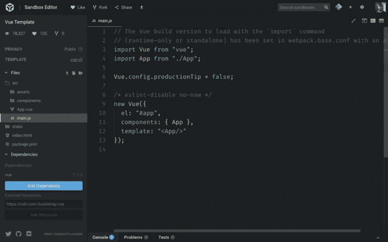

在那里，点击 Add dependency 按钮，输入“vuex”并点击它。

现在 Vuex 将被列在项目依赖项中。

要在本地安装 Vuex，只需在项目文件夹中运行`npm install vuex`或`yarn add vuex`即可。

#### 创建 Vuex 商店

现在我们准备创建我们的 Vuex 商店。

这个文件可以放在任何地方。一般建议放在`src/store/store.js`文件中，我们就这么做。

在这个文件中，我们初始化 Vuex 并告诉 Vue 使用它:

```
import Vue from 'vue'import Vuex from 'vuex'
```

```
Vue.use(Vuex)
```

```
export const store = new Vuex.Store({})
```

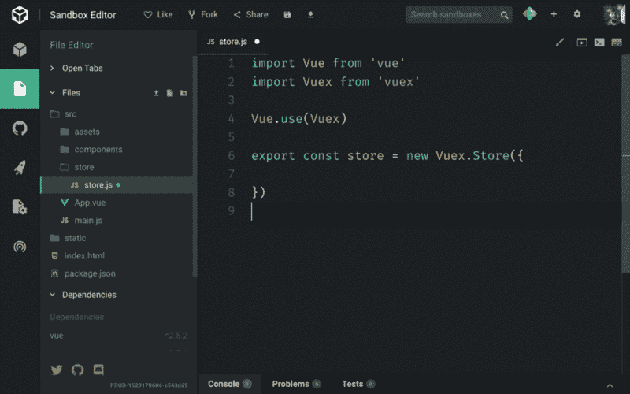

我们导出一个 Vuex store 对象，它是使用`Vuex.Store()` API 创建的。

#### 商店的使用案例

现在我们已经有了一个框架，让我们为 Vuex 想出一个好的用例，这样我就可以介绍它的概念了。

例如，我有两个兄弟组件，一个有输入字段，另一个打印输入字段内容。

当输入字段被更改时，我想同时更改第二个组件中的内容。非常简单，但这将为我们完成工作。

#### 介绍我们需要的新组件

我删除了 HelloWorld 组件，并添加了一个表单组件和一个显示组件。

```
<template>  <div>    <label for="flavor">Favorite ice cream flavor?</label>    <input name="flavor">  </div></template>
```

```
<template>  <div>    <p>You chose ???</p>  </div></template>
```

#### 将这些组件添加到应用程序中

我们将它们添加到`App.vue`代码中，而不是 HelloWorld 组件中:

```
<template>  <div id="app">    <Form/>    <Display/>  </div></template>
```

```
<script>import Form from './components/Form'import Display from './components/Display'
```

```
export default {  name: 'App',  components: {    Form,    Display  }}</script>
```

#### 将状态添加到存储中

有了这个，我们回到 store.js 文件。我们将一个名为`state`的属性添加到存储中，它是一个包含`flavor`属性的对象。最初这是一个空字符串。

```
import Vue from 'vue'import Vuex from 'vuex'
```

```
Vue.use(Vuex)
```

```
export const store = new Vuex.Store({  state: {    flavor: ''  }})
```

当用户在输入字段中输入内容时，我们会更新它。

#### 添加一个突变

除非使用突变，否则无法操纵状态。我们设置了一个突变，将在`Form`组件中使用它来通知商店状态应该改变。

```
import Vue from 'vue'import Vuex from 'vuex'
```

```
Vue.use(Vuex)
```

```
export const store = new Vuex.Store({  state: {    flavor: ''  },  mutations: {    change(state, flavor) {      state.flavor = flavor    }  }})
```

#### 添加一个 getter 来引用状态属性

有了这个设置，我们需要添加一个查看状态的方法。我们使用 getters 来实现。我们为`flavor`属性设置了一个 getter:

```
import Vue from 'vue'import Vuex from 'vuex'
```

```
Vue.use(Vuex)
```

```
export const store = new Vuex.Store({  state: {    flavor: ''  },  mutations: {    change(state, flavor) {      state.flavor = flavor    }  },  getters: {    flavor: state => state.flavor  }})
```

注意`getters`是一个对象。`flavor`是这个对象的一个属性，它接受状态作为参数，并返回状态的`flavor`属性。

#### 将 Vuex 商店添加到应用程序

现在商店已经可以使用了。我们回到我们的应用程序代码，在 main.js 文件中，我们需要导入状态并使它在我们的 Vue 应用程序中可用。

我们补充

```
import { store } from './store/store'
```

我们将它添加到 Vue 应用程序中:

```
new Vue({  el: '#app',  store,  components: { App },  template: '<App/>'})
```

一旦我们添加了这个，因为这是主要的 Vue 组件，每个 Vue 组件中的`store`变量将指向 Vuex 商店。

#### 使用提交更新用户操作的状态

让我们在用户输入内容时更新状态。

我们通过使用`store.commit()` API 来做到这一点。

但是首先，让我们创建一个当输入内容改变时调用的方法。我们使用`@input`而不是`@change`,因为后者只有当焦点离开输入框时才会被触发，而`@input`在每次按键时都会被调用。

```
<template>  <div>    <label for="flavor">Favorite ice cream flavor?</label>    <input @input="changed" name="flavor">  </div></template>
```

```
<script>export default {  methods: {    changed: function(event) {      alert(event.target.value)    }  }}</script>
```

现在我们有了风味的价值，我们使用 Vuex API:

```
<script>export default {  methods: {    changed: function(event) {      this.$store.commit('change', event.target.value)    }  }}</script>
```

看看我们如何使用`this.$store`引用商店？这要归功于主 Vue 组件初始化中包含了`store`对象。

`commit()`方法接受一个变异名称(我们在 Vuex 存储中使用了`change`)和一个有效载荷，它将作为回调函数的第二个参数传递给变异。

#### 使用 getter 打印状态值

现在我们需要使用`$store.getters.flavor`在显示模板中引用这个值的 getter。`this`可以被删除，因为我们在模板中，而`this`是隐式的。

```
<template>  <div>    <p>You chose {{ $store.getters.flavor }}</p>  </div></template>
```

完整的工作源代码可在[这里](https://codesandbox.io/s/zq7k7nkzkm)获得。

这个难题中仍然缺少许多概念:

*   行动
*   模块
*   助手
*   插件

但是现在你已经有了基础知识，可以去阅读官方文件了。

### 使用 Vue 路由器处理 URL

在 JavaScript web 应用程序中，路由器是将当前显示的视图与浏览器地址栏内容同步的部分。

换句话说，当您点击页面中的某个内容时，它是使 URL 发生变化的部分，并且当您点击特定的 URL 时，它有助于显示正确的视图。

传统上，Web 是围绕 URL 构建的。当你点击某个网址时，就会显示一个特定的页面。

随着在浏览器内部运行并改变用户所见的应用程序的引入，许多应用程序打破了这种交互，您必须用浏览器的历史 API 手动更新 URL。

当您需要将 URL 同步到应用程序中的视图时，您需要一个路由器。这是一个非常普遍的需求，现在所有主要的现代框架都允许您管理路由。

Vue 路由器库是 Vue.js 应用程序的必经之路。Vue 不强制使用这个库。你可以使用任何你想要的通用路由库，或者创建你自己的历史 API 集成，但是使用 Vue 路由器的好处是它是官方的。

这意味着它是由维护 Vue 的同一批人来维护的，因此您可以在框架中获得更一致的集成，并保证它在未来无论如何都是兼容的。

#### 装置

Vue 路由器可通过 npm 获得，包名为`vue-router`。

如果您通过脚本标签使用 Vue，您可以使用

```
<script src="https://unpkg.com/vue-router"></script>
```

UNPKG 是一个非常方便的工具，通过一个简单的链接就可以在浏览器中找到每个 npm 包。

如果您使用 Vue CLI，请使用以下方式安装:

```
npm install vue-router
```

一旦您安装了`vue-router`并使用脚本标签或通过 Vue CLI 使其可用，您现在就可以将它导入到您的应用程序中。

你在`vue`之后导入，你调用`Vue.use(VueRouter)`让**在 app 里面安装**:

```
import Vue from 'vue'import VueRouter from 'vue-router'
```

```
Vue.use(VueRouter)
```

在您调用`Vue.use()`传递路由器对象后，在应用程序的任何组件中，您都可以访问这些对象:

*   `this.$router`是路由器对象
*   `this.$route`是当前路线对象

#### 路由器对象

当 Vue 路由器安装在根 Vue 组件中时，可以使用`this.$router`从任何组件访问路由器对象，它提供了许多很好的特性。

我们可以让应用程序导航到一条新的路线

*   `this.$router.push()`
*   `this.$router.replace()`
*   `this.$router.go()`

这类似于历史 API 的`pushState`、`replaceState`和`go`方法。

*   `push()`用于转到新路线，向浏览器历史记录中添加新项目
*   是一样的，除了它没有把一个新的状态推向历史

使用示例:

```
this.$router.push('about') //named route, see laterthis.$router.push({ path: 'about' })this.$router.push({ path: 'post', query: { post_slug: 'hello-world' } }) //using query parameters (post?post_slug=hello-world)this.$router.replace({ path: 'about' })
```

`go()`来回移动，接受一个可以是正数或负数的数字，以返回到历史记录中:

```
this.$router.go(-1) //go back 1 stepthis.$router.go(1) //go forward 1 step
```

#### 定义路线

在这个例子中，我使用的是 Vue 单个文件组件。

在模板中，我使用了一个包含三个组件的`nav`标签，这三个组件分别是 Home、Login 和 About。URL 是通过`to`属性分配的。

`router-view`组件是 Vue 路由器放置与当前 URL 匹配的内容的地方。

```
<template>  <div id="app">    <nav>      <router-link to="/">Home</router-link>      <router-link to="/login">Login</router-link>      <router-link to="/about">About</router-link>    </nav>    <router-view></router-view>  </div></template>
```

默认情况下，`router-link`组件呈现一个`a`标签(您可以更改)。每当路线改变时，无论是通过点击链接还是通过改变 URL，一个`router-link-active`类都会被添加到引用活动路线的元素中，允许您对其进行样式化。

在 JavaScript 部分，我们首先包含并安装路由器，然后定义三个路由组件。

我们将它们传递给`router`对象的初始化，并将这个对象传递给 Vue 根实例。

代码如下:

```
<script>import Vue from 'vue'import VueRouter from 'vue-router'
```

```
Vue.use(Router)
```

```
const Home  = {  template: '<div>Home</div>'}
```

```
const Login = {  template: '<div>Login</div>'}
```

```
const About = {  template: '<div>About</div>'}
```

```
const router = new VueRouter({  routes: [    { path: '/', component: Home },    { path: '/login', component: Login },    { path: '/about', component: About }  ]})
```

```
new Vue({  router}).$mount('#app')</script>
```

通常，在 Vue 应用程序中，您可以使用以下方法实例化和挂载根应用程序:

```
new Vue({  render: h => h(App)}).$mount('#app')
```

当使用 Vue 路由器时，不传递`render`属性，而是使用`router`。

以上示例中使用的语法:

```
new Vue({  router}).$mount('#app')
```

是以下内容的简写:

```
new Vue({  router: router}).$mount('#app')
```

在示例中，我们将一个`routes`数组传递给`VueRouter`构造函数。该数组中的每条路线都有一个`path`和`component`参数。

如果您也传递了一个`name`参数，那么您就有了一个命名的路由。

#### 使用命名路由向路由器推送和替换方法传递参数

还记得我们之前是如何使用路由器对象来推送新状态的吗？

```
this.$router.push({ path: 'about' })
```

有了命名的路由，我们可以向新路由传递参数:

```
this.$router.push({ name: 'post', params: { post_slug: 'hello-world' } })
```

同样的道理也适用于`replace()`:

```
this.$router.replace({ name: 'post', params: { post_slug: 'hello-world' } })
```

#### 当用户点击一个`router-link?`时会发生什么

应用程序将呈现与传递给链接的 URL 相匹配的路由组件。

处理 URL 的新路由组件被实例化并调用其保护程序，旧路由组件将被销毁。

#### 路线守卫

既然提到了警卫，那就介绍一下吧。

你可以把它们看作生命周期挂钩或中间件。这些是在应用程序执行期间的特定时间调用的函数。您可以加入并改变路由的执行，重定向或简单地取消请求。

您可以通过向路由器的`beforeEach()`和`afterEach()`属性添加回调来拥有全局防护。

*   在确认导航之前调用`beforeEach()`
*   当`beforeEach()`被执行并且所有组件`beforeRouterEnter`和`beforeRouteUpdate`守卫被调用时，但在导航被确认之前，调用`beforeResolve()`。最后的检查。
*   确认导航后调用`afterEach()`

“导航确认”是什么意思？我们马上就能看到。与此同时，把它想象成“应用程序可以去那条路线”。

用法是:

```
this.$router.beforeEach((to, from, next) => {  // ...})
```

```
this.$router.afterEach((to, from) => {  // ...})
```

`to`和`from`代表我们来往的路线对象。

`beforeEach`有一个额外的参数`next`，如果我们用`false`作为参数调用它，将会阻止导航并导致它无法确认。

就像在节点中间件中，如果你熟悉的话，`next()`应该总是被调用，否则执行会卡住。

单线部件也有防护装置:

*   `beforeRouteEnter(from, to, next)`在当前路线被确认之前被调用
*   当路由改变但管理它的组件不变时，调用`beforeRouteUpdate(from, to, next)`(关于动态路由，见`next`
*   当我们离开这里的时候就叫做

我们提到了导航。为了确定导航到某条路线是否被确认，Vue 路由器执行一些检查:

*   它调用当前组件中的`beforeRouteLeave` guard
*   它调用路由器`beforeEach()`守卫
*   它调用任何需要重用的组件中的`beforeRouteUpdate()`,如果有的话
*   它调用路线对象上的`beforeEnter()`守卫(我没有提到但是你可以在这里[看](https://router.vuejs.org/guide/advanced/navigation-guards.html#per-route-guard))
*   它调用我们应该进入的组件中的`beforeRouterEnter()`
*   它调用路由器`beforeResolve()`守卫
*   如果一切正常，导航被确认！
*   它调用路由器`afterEach()`守卫

您可以使用特定于路由的保护(在动态路由的情况下是`beforeRouteEnter`和`beforeRouteUpdate`)作为生命周期挂钩，这样您就可以启动数据获取请求。

#### 动态路由

上面的例子显示了基于 URL 的不同视图，处理`/`、`/login`和`/about`路线。

一个非常常见的需求是处理动态路由，比如将所有帖子放在`/post/`下，每个帖子都有一个 slug 名称:

*   `/post/first`
*   `/post/another-post`
*   `/post/hello-world`

您可以使用动态分段来实现这一点。

这些是静态片段:

```
const router = new VueRouter({  routes: [    { path: '/', component: Home },    { path: '/login', component: Login },    { path: '/about', component: About }  ]})
```

我们添加了一个动态段来处理博客帖子:

```
const router = new VueRouter({  routes: [    { path: '/', component: Home },    { path: '/post/:post_slug', component: Post },    { path: '/login', component: Login },    { path: '/about', component: About }  ]})
```

注意`:post_slug`语法。这意味着您可以使用任何字符串，这将被映射到`post_slug`占位符。

你不局限于这种语法。Vue 依靠[这个库](https://github.com/pillarjs/path-to-regexp)来解析动态路由，你可以用正则表达式去放肆。

现在，在 Post route 组件中，我们可以使用`$route`引用 route，使用`$route.params.post_slug`引用 post slug:

```
const Post = {  template: '<div>Post: {{ $route.params.post_slug }}</div>'}
```

我们可以使用这个参数从后端加载内容。

在同一个 URL 中，您可以拥有任意数量的动态段:

`/post/:author/:post_slug`

还记得我们之前讨论过当用户导航到一条新路线时会发生什么吗？

在动态路由的情况下，会发生一些不同。

为了提高 Vue 的效率，它不再销毁当前的 route 组件并重新实例化它，而是重用当前的实例。

当这种情况发生时，Vue 调用`beforeRouteUpdate`生命周期事件。

在那里，您可以执行任何您需要的操作:

```
const Post = {  template: '<div>Post: {{ $route.params.post_slug }}</div>'  beforeRouteUpdate(to, from, next) {    console.log(`Updating slug from ${from} to ${to}`)    next() //make sure you always call next()  }}
```

#### 使用道具

在示例中，我使用了`$route.params.*`来访问路线数据。组件不应该与路由器紧密耦合，相反，我们可以使用 props:

```
const Post = {  props: ['post_slug'],  template: '<div>Post: {{ post_slug }}</div>'}
```

```
const router = new VueRouter({  routes: [    { path: '/post/:post_slug', component: Post, props: true }  ]})
```

注意传递给 route 对象的`props: true`启用了这个功能。

#### 嵌套路由

之前我提到过，在同一个 URL 中，您可以拥有任意多的动态段，比如:

`/post/:author/:post_slug`

因此，假设我们有一个负责第一个动态段的作者组件:

```
<template>  <div id="app">    <router-view></router-view>  </div></template>
```

```
<script>import Vue from 'vue'import VueRouter from 'vue-router'
```

```
Vue.use(Router)
```

```
const Author  = {  template: '<div>Author: {{ $route.params.author}}</div>'}
```

```
const router = new VueRouter({  routes: [    { path: '/post/:author', component: Author }  ]})
```

```
new Vue({  router}).$mount('#app')</script>
```

我们可以在作者模板中插入第二个`router-view`组件实例:

```
const Author  = {  template: '<div>Author: {{ $route.params.author}}<router-view></router-view></div>'}
```

我们添加了 Post 组件:

```
const Post = {  template: '<div>Post: {{ $route.params.post_slug }}</div>'}
```

然后，我们将在`VueRouter`配置中注入内部动态路由:

```
const router = new VueRouter({  routes: [{    path: '/post/:author',    component: Author,    children: [      path: ':post_slug',      component: Post    ]  }]})
```

感谢您的阅读！

> 在[vuehandbook.com](https://vuehandbook.com)获得这篇文章的 PDF/ePub/Kindle 电子书