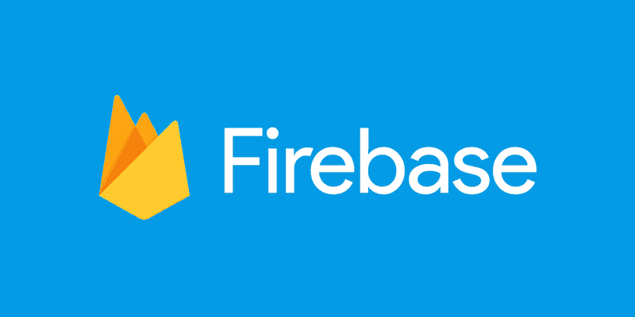
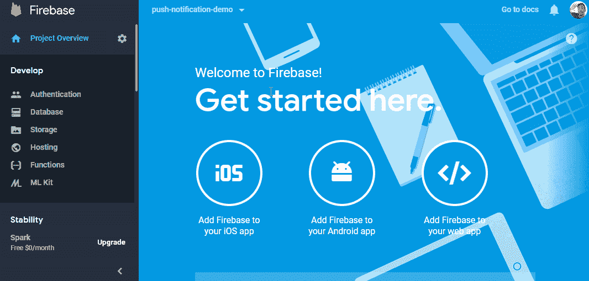
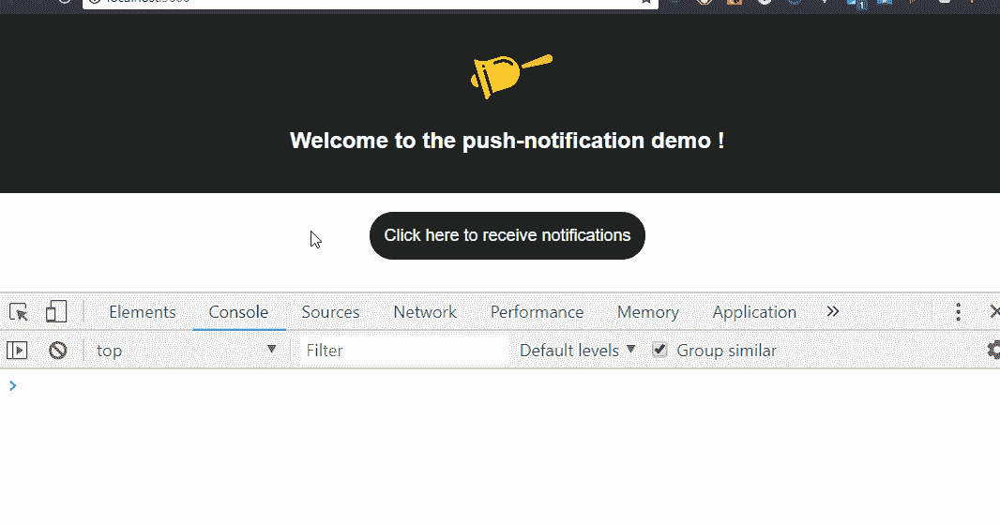
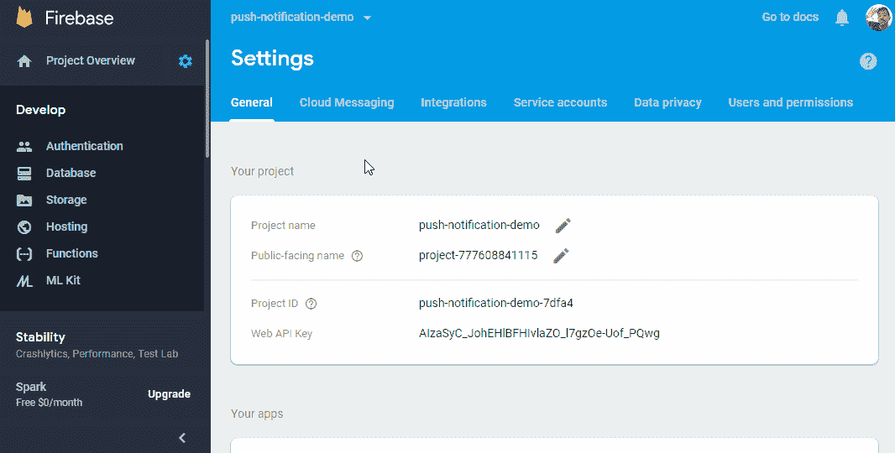
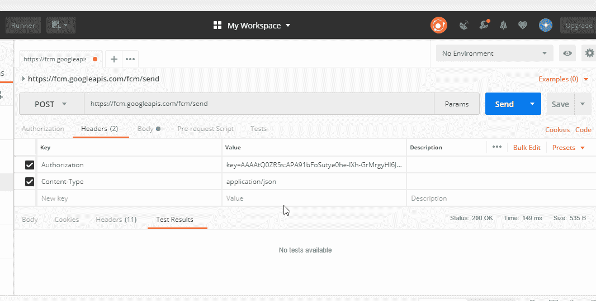
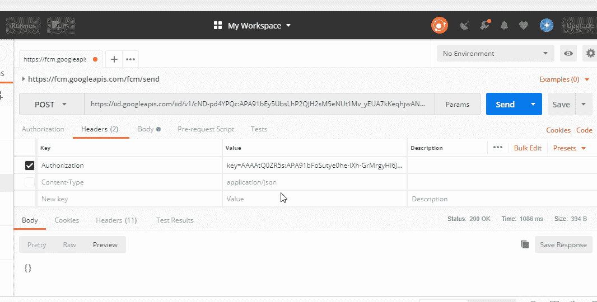
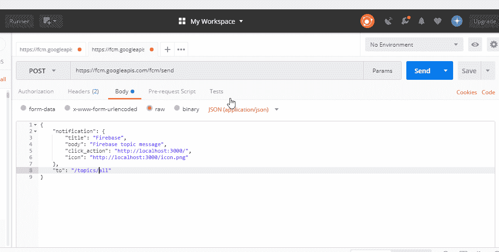

# 如何用 Firebase 给 web app 添加推送通知？+?

> 原文：<https://www.freecodecamp.org/news/how-to-add-push-notifications-to-a-web-app-with-firebase-528a702e13e1/>

作者莱昂纳多·卡多佐

# 如何用 Firebase 给 web app 添加推送通知？+?



随着 web 应用程序的发展，在 web 应用程序中遇到通常与本机应用程序相关联的功能变得越来越常见。许多网站通过浏览器向用户发送 web 应用程序中发生的各种事件的通知。

今天，我将向您详细展示使用 **Firebase** 在您的 web 应用程序中实现这些功能所需的步骤。

### 基于 Firebase 的通知

Firebase 是一个为移动和网络应用程序提供各种服务的平台，帮助开发人员快速构建具有大量功能的应用程序。

为了发送通知，我们将使用名为[云消息](https://firebase.google.com/docs/cloud-messaging/)的服务，它允许我们使用 HTTP 请求向任何设备发送消息。

### 项目设置

首先，你需要有一个 [Firebase](https://console.firebase.google.com) 账户，你需要在里面创建一个新项目。

对于这个演示设置，我将使用一个用 [**create-react-app**](https://github.com/facebook/create-react-app) 创建的简单项目，但是您可以在任何使用 JavaScript 的地方使用相同的代码。

除此之外，我们需要将 Firebase 库添加到项目中。

```
npm install firebase --save
```

### 所以让我们开始编码吧！

现在我们已经完成了设置，我们可以开始编写负责通知的模块了。

让我们在项目目录中创建一个名为`push-notification.js`的文件。

在文件内部，让我们创建一个初始化 Firebase 并传递项目密钥的函数。

```
import firebase from 'firebase';

export const initializeFirebase = () => {
  firebase.initializeApp({
    messagingSenderId: "your messagingSenderId"
  });
}
```

现在我们有了需要调用的函数。

在项目的入口点内，导入函数并调用它。

```
import React from 'react';
import ReactDOM from 'react-dom';
import App from './App';
import { initializeFirebase } from './push-notification';

ReactDOM.render(<App />, document.getElementById('root'));
initializeFirebase();
```

> 你可以在 **Firebase 控制台中找到你的项目的关键。**



Getting the keys

#### 服务人员

> 服务人员是浏览器在后台运行的脚本，独立于网页，支持不需要网页或用户交互的功能。

为了接收 **onMessage** 事件，你的应用需要一个服务人员。默认情况下，当您启动 Firebase 时，它会查找一个名为`firebase-messaging-sw.js`的文件。

但是如果您已经有了一个服务工作器，并且想要利用它来接收通知，那么您可以在 Firebase 启动时指定它将使用哪个服务工作器。例如:

```
export const inicializarFirebase = () => {
  firebase.initializeApp({
    messagingSenderId: 'your messagingSenderId'
  });

navigator.serviceWorker
    .register('/my-sw.js')
    .then((registration) => {
      firebase.messaging().useServiceWorker(registration);
    });
}
```

当你的应用在后台时，这个服务人员将基本上导入显示通知所需的脚本。

我们需要将`firebase-messaging-sw.js`添加到为您提供文件的位置。由于我正在使用 create-react-app，我将把它添加到 public 文件夹中，内容如下:

```
importScripts('https://www.gstatic.com/firebasejs/4.8.1/firebase-app.js');
importScripts('https://www.gstatic.com/firebasejs/4.8.1/firebase-messaging.js');

firebase.initializeApp({
    messagingSenderId: "your messagingSenderId again"
});

const messaging = firebase.messaging();
```

### 请求发送通知的权限

好吧，每个人都知道进入站点并请求授权来发送通知是多么令人讨厌。所以我们换个方式吧！
让用户选择是否接收通知。

首先，让我们创建发出请求并返回用户令牌的函数。

在我们的 push-notification.js 文件中，添加函数:

```
export const askForPermissioToReceiveNotifications = async () => {
  try {
    const messaging = firebase.messaging();
    await messaging.requestPermission();
    const token = await messaging.getToken();
    console.log('token do usuário:', token);

    return token;
  } catch (error) {
    console.error(error);
  }
}
```

我们需要从某个地方调用这个函数，所以我将在单击按钮时添加它。

```
import React from 'react';
import { askForPermissioToReceiveNotifications } from './push-notification';

const NotificationButton = () => (
    <button onClick={askForPermissioToReceiveNotifications} >
      Clique aqui para receber notificações
    </button>
);

export default NotificationButton;
```

好吧，让我们看看它的效果:



### 发送通知

要发送通知，我们需要向 Firebase API 发出请求，通知它用户将收到的令牌。

> 在下面的例子中，我使用的是 Postman，但是您可以从任何其他 REST 客户端这样做。

基本上，我们需要通过在请求体中发送一个 JSON 来向[https://fcm.googleapis.com/fcm/send](https://fcm.googleapis.com/fcm/send)发出一个 POST 请求。

下面是将要发送的 JSON 的结构:

```
{
    "notification": {
        "title": "Firebase",
        "body": "Firebase is awesome",
        "click_action": "http://localhost:3000/",
        "icon": "http://url-to-an-icon/icon.png"
    },
    "to": "USER TOKEN"
}
```

在请求头中，我们需要传递 Firebase 中项目的服务器密钥和内容类型:

```
Content-Type: application/json
Authorization: key=SERVER_KEY
```

> 服务器密钥可以在 Firebase 控制台的 Cloud Messaging 选项卡下的项目设置中找到。



#### 实际通知

> 请记住，只有当您的应用程序最小化或在后台时，通知才会出现。



这就是我们向设备发送直接通知的方式。

### 向一组用户发送通知

好了，现在我们已经看到了如何向一个用户发送通知，那么我们如何一次向多个用户发送通知呢？

为了做到这一点，Firebase 有一个名为 **topic** 的特性，您可以为一个特定的主题插入多个令牌，并且可以通过一个请求向所有这些令牌发送相同的通知。

#### 如何做到这一点

我们基本上会向地址[https://iid.googleapis.com/iid/v1/**令牌**/rel/topics/**TOPIC _ NAME**](https://iid.googleapis.com/iid/v1/TOKEN/rel/topics/TOPICO_NAME)，发送一个 POST 请求，传递主题名和 URL 中的令牌。

不要忘记在标题中传递我们用来发送通知的相同授权。



向订阅任何主题的用户发送通知与向单个用户发送通知非常相似。不同的是，我们需要将**"中的主题名称传递给"**属性，而不是令牌。

请参见下面的示例:

```
{
    "notification": {
        "title": "Firebase",
        "body": "Firebase topic message",
        "click_action": "http://localhost:3000/",
        "icon": "http://localhost:3000/icon.png"
    },
    "to": "/topics/TOPIC_NAME"
}
```



#### 结论

感谢你阅读这篇文章！我希望你现在明白如何使用推送通知。带有演示代码的存储库可以在[这里](https://github.com/Leocardoso94/push-notification-demo)找到。

要获得我未来帖子的通知，请在 [GitHub](https://github.com/Leocardoso94) 或 [Twitter](https://twitter.com/Leocardoso94_) 上关注我。