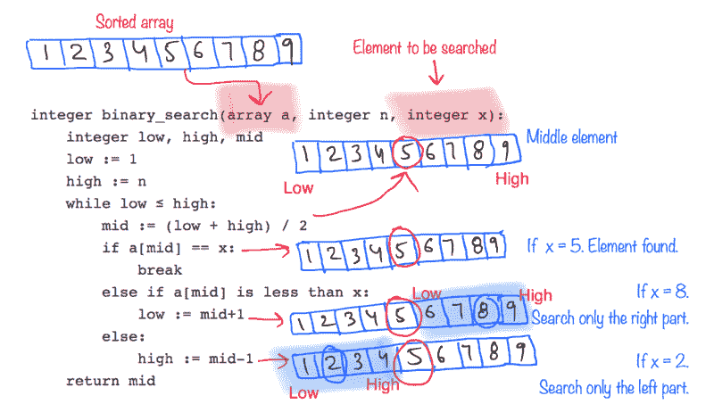
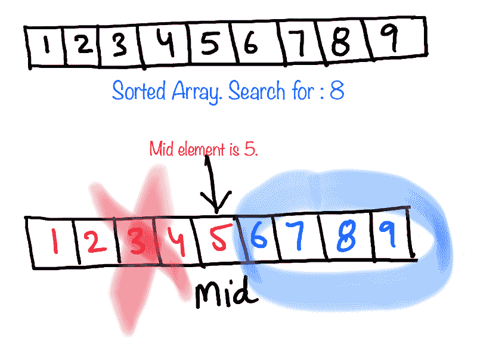
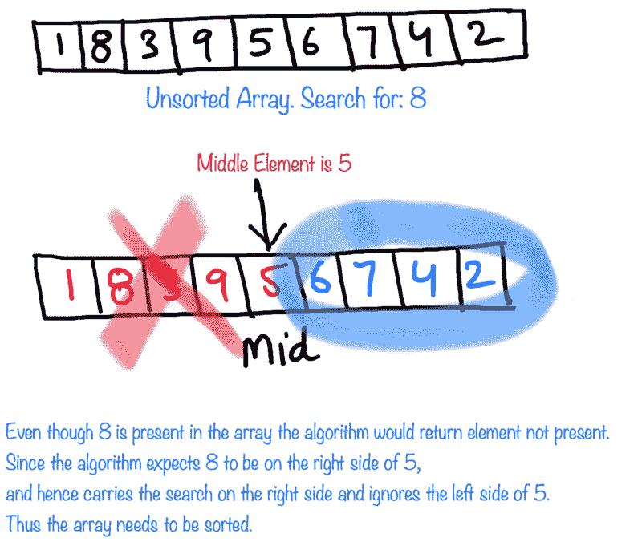
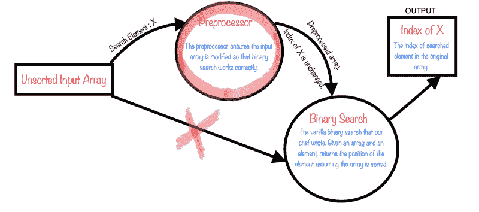
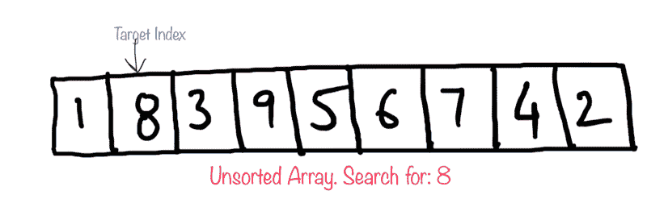
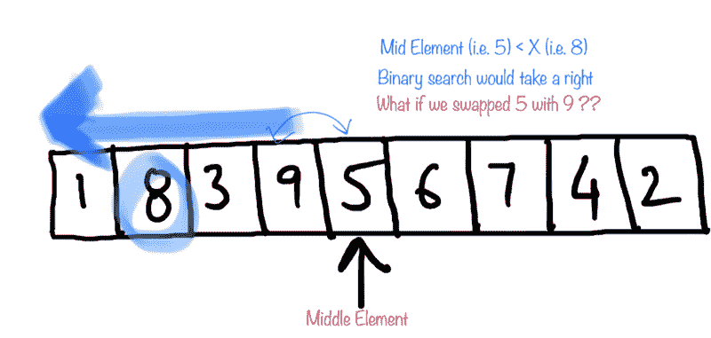
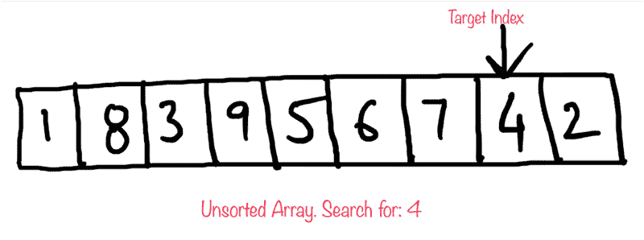
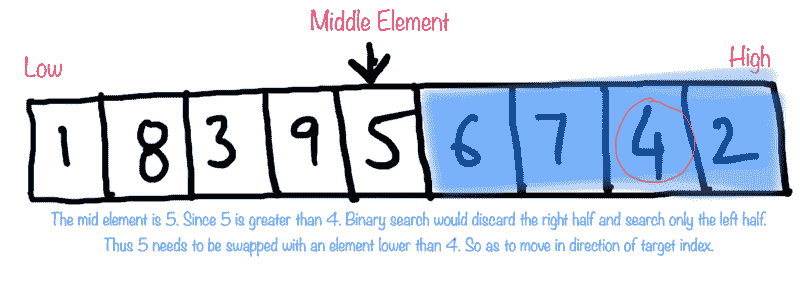
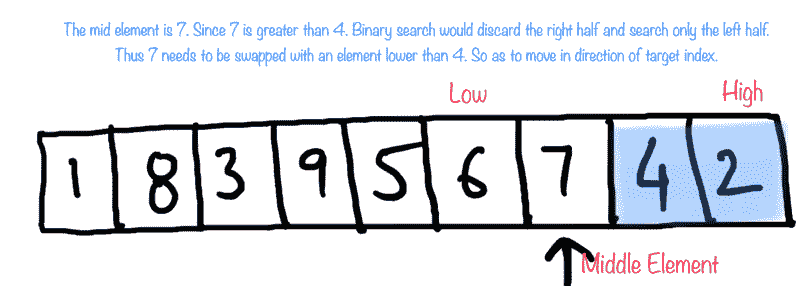

# 一个扭曲的二分搜索法故事

> 原文：<https://www.freecodecamp.org/news/a-twisted-tale-of-binary-search-49f5ac01e83d/>

由 divya 性腺

# 一个扭曲的二分搜索法故事


Source: [https://www.pinterest.com/pin/261912534550561245/?lp=true](https://www.pinterest.com/pin/261912534550561245/?lp=true)

太棒了。这就是我现在的感觉。写我的第一篇个人科技文章。

我必须说我有很多东西要和你们分享，也有很多东西要学。所以，没有任何进一步的麻烦，让我们开始吧。是的，抓紧——因为故事有了转折。？

### 二进位检索

我们都听说过经典的 [2 个鸡蛋和 100 个故事](https://www.geeksforgeeks.org/puzzle-set-35-2-eggs-and-100-floors/)问题。我有类似的东西给你。

你有一座 100 层的建筑，有一条规则:

`**People with pets can only occupy top floors**`

你的朋友想在这栋楼里买一套公寓。她太害怕宠物了，不敢住在它们附近，但是你爱它们。她问你是否能帮她找到宠物友好楼层的确切位置。她想探索所有可用的不同选项，所以你需要从底层开始找出哪些楼层是不允许宠物进入的。

大楼管理人员正在度假。在每一层楼，电梯旁边都有一块告示牌，告诉你该楼层是否允许宠物入内。但是你太懒了，因为电梯太慢了，所以你不会在每层楼都停下来检查宠物指示牌。

你是做什么的？


The two possible sign boards. #GoRed is what your friend roots for.

电梯在每一层楼都要停一分钟，然后再启动。是的，就是这么糟糕。但在楼层之间，导航相当顺畅。你必须尽快完成。

你如何着手做这件事？

### 迭代方法

一个简单的方法是从建筑物的最底层(底层)开始，在每一层不停地停止电梯，检查该层张贴的标志。当你发现宠物友好的标志时，你停下来。

**最好的情况**是底层有宠物标志。意味着整栋楼都有宠物。你的朋友不可能在这里买公寓。

**一般情况**是你走到第 50 层，中间每一层都停下来，最后找到一个宠物指示牌。所以你的朋友可以从 1-49 英镑买一个。

最糟糕的情况是，你到达了第 100 层，在每层楼停下来，却发现整栋楼都没有宠物指示牌。所以你的朋友可以从 1 英镑到 100 英镑购买任何公寓，但谁在乎呢，你花了将近两个小时才发现这一点。？？。

在算法上，给定一个 100 个布尔值的数组，数组的索引代表建筑楼层，0 代表不允许宠物进入的楼层，而 1 代表允许宠物进入的楼层。根据建筑物的规则，数组的形式如下

```
000... 1111...
```

也就是全 0 后面全 1，因为只有顶层可以是允许养宠物的地方。

给定这个数组，我们需要找到有`1`的第一个索引。这个问题的线性搜索算法很简单，遍历数组，寻找一个`1`，找到后返回。

正如所料，这个算法的复杂度是`O(n)`,其中 n = 100。你需要想出比这更快的东西。在每一层楼都停下来是不可行的，因为在最坏的情况下，你要花很多时间才能走完整栋大楼。

### 二分搜索法方法

比方说，你从一楼出发，不停地到达 50 楼。在第 50 层，你停下来，走出电梯，检查标志。广告牌上写着`“No Pets”`。这意味着，在第 50 层之前，绝对没有宠物。

现在知道你把搜索空间缩小到另一半，也就是 51-100 层。这意味着只需一次停留，你就能覆盖半个建筑，因为你肯定知道前半部分没有任何宠物。太神奇了！

继续前进，你再次把剩下的楼层分成两半，乘电梯直接去 75 楼。你可以看到那里有一块招牌。这意味着它开始出现的楼层必须在 50–75 之间。您可以继续遵循类似的方法，将剩余的楼层分成两半并检查，直到您找到带有`“Pets”`标牌的第一层。

你看，每次你做一个决定，你把你的搜索空间分成两半，用一半的搜索空间前进。这就是我们缩小搜索范围的方法。因为我们总是将搜索空间一分为二，选择其中一个，这就是为什么这种类型的搜索策略被称为`Binary`搜索策略。

那不是更快吗？

让我们来看看这个的算法。



Binary Search Algorithm

如果您一直密切关注并掌握了该算法，您将会意识到二分搜索法算法工作的一个硬性条件。条件是数组需要事先排序。在我们的例子中，建筑楼层从 1 到 100 排序，我们可以很容易地将搜索空间一分为二。

让我们来看一个示例数组，它是经过排序的，并尝试在其中搜索一个元素。



在上面的例子中，要搜索的元素是 8。给定的数组是按升序排序的数组。一旦我们找到中间的元素(即 5)，我们就会看到要搜索的元素大于当前的索引元素。因为数组是按升序排序的，所以 8 应该在数组的右边，而不能在左边。

所以我们忽略 5 左边的元素，继续搜索剩下的元素，最终找到 8。



另一方面，如果数组没有排序呢？即使我们知道当前元素是 5，并且我们知道我们需要搜索 8，我们也不确定哪个方向是正确的。如果我们最终认为数组已经排序，并应用二分搜索法，转到正确的部分，我们将永远找不到 8。

所以二分搜索法本质上希望你的数组被排序。

这是我们刚刚看到的标准二分搜索法算法。但是，正如文章的标题所暗示的，这个故事有一个转折！

我是一个热衷于竞争的程序员，在 [CodeChef May Long Challenge](https://www.codechef.com/MAY18B/problems/FAKEBS) 中有一个有趣的二分搜索法算法变体。

本质上，厨师编写了经典的二分搜索法，假设输入数组将被排序。班里的其他孩子都抄袭他的代码，因为 Chef 是班里最好的程序员。他的假设可能会让整个班级付出赋值分数的代价，因为输入数组事先没有排序。

主厨唯一能做的就是通过交换一些数字对来预处理数组，以便二分搜索法过程仍然返回正确的索引。



**注意:**上述预处理器应该返回修改后的数组，以便二分搜索法正确工作。但是，正如问题陈述所要求的，我们只是试图确定二分搜索法在给定输入的未排序阵列上正确工作所需的交换次数。如果这种修改对于给定的数组和元素是不可能的，则该算法也将返回-1。

这里的想法很简单。

我们需要理解两个基本步骤。我称之为 **TI-ME** 步骤。也许这能帮你记起我们在这里做什么。

a.**T**arget**I**index:要搜索的元素的索引。我们需要知道这一点，因为这个指数将帮助我们推动修改。因为我们每次修改任何一个元素，都需要向着这个索引航行，而不是远离它。

b.元素:如果你仔细观察二分搜索法，就会发现是当前搜索空间的中间元素推动了下一步行动。如果这个中间元素把我们引向错误的方向，我们需要用合适的元素来替换。



We are searching for 8 in the above unsorted array. We already saw in the examples above a normal binary search would fail for an unsorted array.



Mid elements give direction to binary search. Middle element 5 would take binary search to go right. This way we would never find `8\. If we swap 5 with an element greater than 8 we would force the search to go to left.`

所以，这里的整个想法是，我们交换所有被错误放置的中间元素。

二分搜索法算法(相对于要搜索的元素的中间元素的值，即 X)可以将我们带到数组的左半部分或右半部分。因此，中间元素放置错误有两种可能性:

1.  要搜索的元素在中间元素的右边，但是由于`Element[Mid] > Element[Target Ind` ex】，二分搜索法将不得不忽略右半部分并移向左半部分。运筹学
2.  要搜索的元素在中间元素的左边，但是由于`Element[Mid] < Element[Target Ind` ex】，二分搜索法将不得不忽略左半部分并向右半部分移动。

因此，如果一个中间元素被错误地放置，以至于需要一个数字`X`来代替`X < Element[Target Ind` ex]，那么我们为它维护一个计数器并调用`it count_low_nee` ded。

类似地，如果一个中间元素被错误地放置，以至于需要一个数字`X`来代替`X > Element[Target Ind` ex]，那么我们为它维护一个计数器并调用`it count_high_nee` ded。

此外，如果我们在搜索数字时简单地在给定的数组上运行二分搜索法算法，就会有一些数字被正确地放置。这些将是在对应于给定元素`X`(要搜索的元素)的正确方向上驱动二分搜索法的中间元素。这些数字不能作为交换的一部分，因为它们相对于`X`的位置是正确的。

让我们先看看这个算法的伪代码，然后再看一个例子。

```
function can_preprocess(arr, X){     low = 0     high= 0
```

```
while X is not found {          mid = (low + high) / 2          if arr[mid] == X {             break                     }
```

```
correctly_placed_low = 0          correctly_placed_high = 0          count_low_needed = 0          count_high_needed = 0
```

```
if `mid` suggests we should go right for X {               if X is actually on the right {                   correctly_placed_low ++               }               else {                   count_low_needed ++               }          } else {               if X is actually on the left {                  correctly_placed_high ++               }                else {                  count_high_needed ++               }          }
```

```
modify low and high according to           where `X` actually is with respect to `mid`
```

```
}
```

```
// Total smaller numbers available for swapping     TSM = sorted_index[X] - correctly_placed_low
```

```
// Total Larger numbers available for swapping     TLM = (N - sorted_index[X]) - correctly_placed_high
```

```
if count_low_needed > TSM or count_high_needed > TLM {          return -1     }
```

```
return max(count_low_needed, count_high_needed)
```

**注意:**问题语句为我们固定输入数组，并在输入数组中反复传递要搜索的值。因此，我们可以在原始数组上迭代一次，以知道要搜索的元素的实际位置(本质上是创建一个字典)。

此外，我们需要`sorted_index[X]`告诉我们数组中有多少值小于或大于元素`X`。我们可以对数组进行排序，并创建另一个字典来存储排序后的数组中每个元素的位置。

让我们在模拟运行一个示例的同时，浏览一下所提出的算法的步骤。

1.  给定一个未排序的数组，需要搜索`X = 4`。因此，我们的目标指数是 7。



2.中间元素索引 ut Element[Mid] > Element[Target 索引]，ed = 1



3.中间元素索引 n, Element[Mid] > Element[Target Index]，`hence count_low_need` ed = 2



4.二分搜索法返回正确指数所需的互换总数将是两个元素小于 4 的互换。我们有更少的数字`1, 3 or 2`用于交换，因此我们可以成功地交换该阵列，以便二分搜索法正确地找到`4`。

下面是给定问题的 Python 代码。每一步都在评论里有解释。

这种扭曲二分搜索法算法的时间复杂度仍然是`O(nlogn)`。

我希望你能够理解二分搜索法算法的内部工作原理，并且在解决这个有趣的问题时也能从中获得乐趣。如果你觉得这篇文章有用，请尽可能地传播和分享你的爱。？