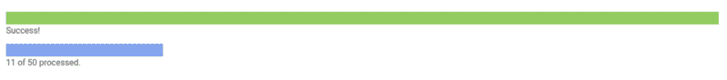
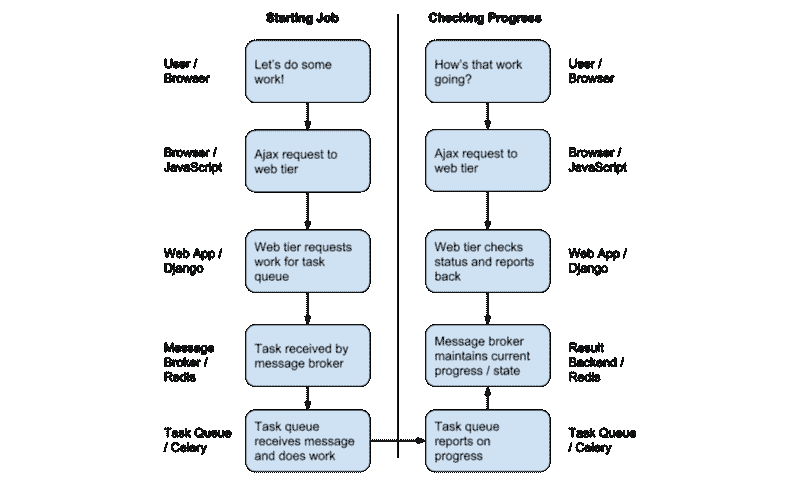
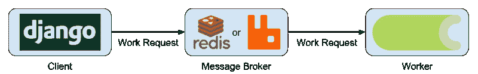

# 如何用 Django 和 Celery 为 web 创建一个进度条

> 原文：<https://www.freecodecamp.org/news/how-to-build-a-progress-bar-for-the-web-with-django-and-celery-12a405637440/>

#### 让表面上简单得可笑的东西变得惊人的复杂

进度条是我们生活中最常见、最熟悉的 UI 组件之一。每当我们下载文件、安装软件或在电子邮件中添加附件时，我们都会看到它们。它们存在于我们的浏览器、手机甚至电视中。

然而，制作一个好的进度条是一项非常复杂的任务！

在这篇文章中，我将描述制作一个网页质量进度条的所有组成部分，希望到最后你能很好地理解你自己构建进度条所需要的一切。

这个帖子描述了我必须要学的所有东西(还有一些我没有学到的东西！)来制作 [celery-progress](https://github.com/czue/celery-progress) ，这是一个库，希望它能让你的 Django/Celery 应用程序更容易地加入无依赖的进度条。

也就是说，这篇文章中的大部分概念应该可以跨所有语言/环境翻译，所以即使你不使用 Python，你也可以学到一些新东西。

### 为什么是进度条？

这可能是显而易见的，但只是为了解决这个问题——我们为什么要使用进度条？

最基本的原因是为用户提供反馈，因为他们需要的时间比他们习惯等待的时间要长。据 [kissmetrics](https://blog.kissmetrics.com/loading-time/) 统计，40%的人会放弃一个加载时间超过 3 秒的网站！虽然您可以使用类似旋转器的东西来帮助减少这种等待，但在用户等待某件事情发生时，一种经过验证的真实方法是使用进度条。

一般来说，进度条是很棒的**，只要事情花费的时间超过几秒** ，你就可以合理地估计它的进度。



Progress bars can be used to show the status of something and its result

一些例子包括:

*   当您的应用程序第一次加载时(如果加载需要很长时间)
*   处理大量数据导入时
*   准备下载文件时
*   当用户在队列中等待处理他们的请求时

### 进度条的组件

好了，有了这些，让我们进入如何实际建立这些东西！

它只是屏幕上的一个小条。会有多复杂？

其实挺！

以下组件通常是任何进度条实现的一部分:

1.  一个**前端**，通常包括进度的可视化表示和(可选的)基于文本的状态。
2.  一个**后端**，它将实际执行您想要监控的工作。
3.  前端将工作移交给后端的一个或多个通信通道。
4.  后端向前端传达进度的一个或多个通信通道。

我们可以立即看到复杂性的一个内在来源。我们既想让**在后台做一些工作**，又想让**在前台展示这些工作**。这直接意味着我们将涉及多个需要彼此异步交互的流程。

这些沟通渠道是复杂性所在。在一个相对标准的 Django 项目中，**前端浏览器**可能会向**后端 web 应用** (Django)提交一个 AJAX HTTP 请求(JavaScript)。这反过来可能通过**消息代理** (RabbitMQ/Redis)将请求传递给**任务队列** (Celery)。然后整个事情需要逆向发生才能把信息传回前端！

整个过程可能如下所示:



The big picture of everything involved in making a good progress bar

让我们深入研究所有这些组件，看看它们在实际例子中是如何工作的。

### 前端

前端绝对是进度条最容易的部分。只需几行 HTML/CSS 代码，您就可以使用背景颜色和宽度属性快速创建一个外观不错的水平栏。加入一点 JavaScript 来更新它，你就可以开始了！

```
function updateProgress(progressBarElement, progressBarMessageElement, progress) {
  progressBarElement.style.backgroundColor = '#68a9ef';
  progressBarElement.style.width = progress.percent + "%";
  progressBarMessageElement.innerHTML = progress.current + ' of ' + progress.total + ' processed.';
}

var trigger = document.getElementById('progress-bar-trigger');
trigger.addEventListener('click', function(e) {
  var barWrapper = document.getElementById('progress-wrapper');
  barWrapper.style.display = 'inherit'; // show bar
  var bar = document.getElementById("progress-bar");
  var barMessage = document.getElementById("progress-bar-message");
  for (var i = 0; i < 11; i++) {
    setTimeout(updateProgress, 500 * i, bar, barMessage, {
      percent: 10 * i,
      current: 10 * i,
      total: 100
    })
  }
})
```

### 后端

后端同样简单。本质上，这只是一些将在您的服务器上执行的代码，以完成您想要跟踪的工作。这通常是在您使用的任何应用程序堆栈中编写的(在本例中是 Python 和 Django)。这是一个过于简化的后端版本:

```
def do_work(self, list_of_work): 
    for work_item in list_of_work: 
        do_work_item(work_item) 
    return 'work is complete'
```

### 做工作

好了，我们有了前端进度条，也有了工作执行者。下一步是什么？

嗯，我们实际上还没有说这项工作将如何开始。让我们从这里开始。

#### 错误的方法:在 Web 应用程序中完成

在典型的 ajax 工作流中，这将按如下方式工作:

1.  前端向 web 应用发起请求
2.  Web 应用程序在请求中工作
3.  完成后，Web 应用程序返回响应

在 Django 看来，应该是这样的:

```
def my_view(request): 
    do_work() 
    return HttpResponse('work done!')
```

#### *错误的方法:从视图中调用函数*

这里的问题是`do_work`函数可能会做很多耗时的工作(如果不是这样，为它添加进度条就没有意义了)。

在一个视图中做大量的工作通常被认为是一种不好的做法，原因有几个，包括:

*   由于人们必须等待很长时间的请求才能完成，因此会造成较差的用户体验
*   大量长时间运行的工作请求(可能是恶意或意外触发的)会使您的站点面临潜在的稳定性问题

出于这些原因以及其他原因，我们需要一种更好的方法来解决这个问题。

#### 更好的方法:异步任务队列(又名芹菜)

大多数现代 web 框架已经创建了**异步任务队列**来处理这个问题。在 Python 中，最常见的是[芹菜](http://www.celeryproject.org/)。在 Rails 中，有 [Sidekiq](https://sidekiq.org/) (其中有)。

这些之间的细节有所不同，但它们的基本原理是相同的。基本上，不是在一个 HTTP 请求中工作，这个请求可能需要任意长的时间——并且以任意的频率被触发——而是将工作放在一个队列中，并且有后台进程——通常被称为**workers**——拾取作业并执行它们。

这种异步架构有几个好处，包括:

*   不要在 web 流程中做长时间运行的工作
*   启用已完成工作的速率限制—工作可能会受到可用工作进程数量的限制
*   使工作能够在针对 it 进行优化的机器上进行，例如，具有大量 CPU 的机器

### 异步任务的机制

异步架构的基本机制相对简单，包括三个主要组件:**客户端**、**工作器**和**消息代理**。

**客户端**主要负责创建新任务。在我们的例子中，客户端是 Django 应用程序，它通过网络请求根据用户输入创建任务。

**工作人员**是完成工作的实际流程。这些是我们的芹菜工人。您可以在任意数量的机器上运行任意数量的工作线程，这允许任务处理的高可用性和水平伸缩。

客户端和任务队列通过一个**消息代理**相互对话，消息代理负责从客户端接收任务，并将它们交付给工作人员。对于 Celery 来说，最常见的消息代理是 RabbitMQ，尽管 Redis 也是一个常用的、具有完整功能的消息代理。



Basic workflow of passing messages to an asynchronous worker process

当构建一个标准的 celery 应用程序时，您通常会开发客户机和工作器代码，但是消息代理将是一个基础设施，您只需要站起来就可以了(除此之外，几乎可以忽略)。

#### 一个例子

虽然这一切听起来相当复杂，但 Celery 做得很好，通过良好的编程抽象让我们变得非常容易。

要将我们的工作函数转换成可以异步执行的东西，我们所要做的就是添加一个特殊的装饰器:

```
from celery import task 
# this decorator is all that's needed to tell celery this is a
# worker task
@task 
def do_work(self, list_of_work): 
    for work_item in list_of_work: 
        do_work_item(work_item) 
    return 'work is complete'
```

#### *注释一个要从芹菜中调用的工作函数*

类似地，从 Django 客户端异步调用函数也同样简单:

```
def my_view(request): 
    # the .delay() call here is all that's needed
    # to convert the function to be called asynchronously     
    do_work.delay() 
    # we can't say 'work done' here anymore 
    # because all we did was kick it off 
    return HttpResponse('work kicked off!')
```

#### *异步调用工作函数*

只需几行额外的代码，我们就可以将我们的工作转换成异步架构！只要您已经配置并运行了您的 worker 和 broker 进程，这就应该*正常工作*。

### 跟踪进度

好了，我们终于让任务在后台运行了。但是现在我们想跟踪它的进展。那到底是怎么做到的呢？

我们还需要做一些事情。首先，我们需要一种方法来跟踪工人工作的进展。然后，我们将需要沟通的进展，所有的方式回到我们的前端，所以我们可以更新页面上的进度条。再一次，这比你想象的要复杂得多！

#### 使用观察者对象跟踪工作进程

具有开创性的[四人帮的设计模式](https://www.amazon.com/gp/product/0201633612/)的读者可能熟悉[观察者模式](https://en.wikipedia.org/wiki/Observer_pattern)。典型的观察者模式包括一个跟踪状态的**主题**，以及一个或多个对状态做出响应的**观察者**。在我们的进度场景中，主体是正在工作的工作者进程/功能，观察者是将要跟踪进度的东西。

有许多方法可以链接主体和观察者，但是最简单的方法是将观察者作为参数传递给执行工作的函数。

看起来像这样:

```
@task 
def do_work(self, list_of_work, progress_observer):     
    total_work_to_do = len(list_of_work)     
    for i, work_item in enumerate(list_of_work):             
        do_work_item(work_item)         
        # tell the progress observer how many out of the total items 
        # we have processed
        progress_observer.set_progress(i, total_work_to_do)        
    return 'work is complete'
```

#### *使用观察员监控工作进度*

现在我们所要做的就是传入一个有效的`progress_observer`，瞧，我们的进度将被跟踪！

### 将进度反馈给客户端

你可能会想*“等一下……你刚刚调用了一个名为 set_progress 的函数，你实际上什么也没做！”*

真的！那么这个*实际上*是如何工作的呢？

记住——我们的目标是将这些进度信息一直上传到网页上，这样我们就可以向用户展示正在发生的事情。但是进度跟踪一直发生在工作进程中！我们现在正面临着与之前交付异步任务时类似的问题。

幸运的是，Celery 还提供了一种将消息**传回**给客户端的机制。这是通过一种叫做[结果后端](http://docs.celeryproject.org/en/latest/userguide/tasks.html#result-backends)的机制来完成的，而且，像[经纪人](http://docs.celeryproject.org/en/latest/getting-started/brokers/)一样，你可以选择几个不同的后端。RabbitMQ 和 Redis 都可以用作代理和结果后端，是合理的选择，尽管从技术上讲代理和结果后端之间没有耦合。

无论如何，就像经纪人一样，细节通常不会出现，除非你在做一些非常高级的事情。但关键是你把任务*的结果贴在某个地方*(用任务的惟一 ID)，然后其他进程可以通过向后端请求 ID 来获得任务的信息。

在 Celery 中，这通过与任务相关联的`state`被很好地抽象出来。`state`允许我们设置一个总体状态，以及给任务附加任意的元数据。这是一个完美的地方来存储我们目前的和总的进展。

#### 设置状态

```
task.update_state( 
    state=PROGRESS_STATE, 
    meta={'current': current, 'total': total} 
)
```

#### 阅读状态

```
from celery.result import AsyncResult 
result = AsyncResult(task_id) 
print(result.state) # will be set to PROGRESS_STATE print(result.info) # metadata will be here
```

### 向前端获取进度更新

既然我们可以从工作人员/任务中获取进度更新，并将其放入任何其他客户端，那么最后一步就是将该信息放入前端并显示给用户。

如果你想变得更有趣，你可以使用类似 websockets 的东西来实时地做到这一点。但是最简单的方法是不时地轮询一个 URL 来检查进度。我们可以通过 Django 视图和流程将进度信息作为 JSON 提供给客户端。

Django 观点:

```
def get_progress(request, task_id): 
    result = AsyncResult(task_id) 
    response_data = { 
        'state': result.state, 
        'details': self.result.info,
    } 
    return HttpResponse(
        json.dumps(response_data), 
        content_type='application/json'
    )
```

Django 视图以 JSON 的形式返回进度。

JavaScript 代码:

```
function updateProgress (progressUrl) {
    fetch(progressUrl).then(function(response) { 
        response.json().then(function(data) { 
            // update the appropriate UI components 
            setProgress(data.state, data.details); 
            // and do it again every half second
            setTimeout(updateProgress, 500, progressUrl); 
        }); 
    }); 
}
```

用于轮询进度和更新 UI 的 Javascript 代码。

### 把所有的放在一起

从表面上看，这已经是我们日常生活中非常简单的一部分了。我希望你已经学到了一些东西。

如果你需要一种简单的方法来为你的 Django/celery 应用程序制作进度条，你可以查看一下[celery-progress](https://github.com/czue/celery-progress)——我写的这个库可以让这一切变得更简单。在 Django 的 Build 上还有一个[的演示。](https://buildwithdjango.com/projects/celery-progress/)

感谢阅读！如果你想在我发布关于用 Python 和 Django 构建事物的内容时得到通知，请注册接收下面的更新！

*最初发表于[buildwithdjango.com](https://buildwithdjango.com/blog/post/celery-progress-bars/)。*