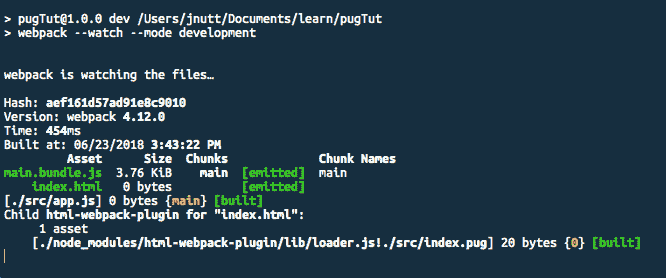

# 用 Pug 让多页 HTML 开发更简单

> 原文：<https://www.freecodecamp.org/news/make-multipage-html-development-suck-less-with-pug-fb23bc8e7874/>

#### 灵感来自一个真实的故事

### 让我们开始一段旅程…

想象一下，你在你所选择的城市的一家自由职业代理公司的电话名单上。现在让我们假设你在收件箱里收到了一封很好的邮件。你打开邮件，它看起来很正常。

> 我们有一个开发人员立即开始今天的需要。

这个消息看起来很正常。

我们有一个开发人员立即开始今天的需要。

作为一个喜欢吃食物来生存的人，你输入一些信息并申请。

按下发送键后五分钟内，你会接到一个电话。10 分钟后，你就可以进入服务器了。

不用说，你在赶时间。截止日期是今天。

你打开 HTML 文件，惊恐地看着它们。

代码到处都是，杂乱无章。更不用说，你必须在五个不同的页面上调整页眉和页脚。

你做的第一件事是运行它通过[美化](https://github.com/google/code-prettify)(感谢上帝美化)。这就解决了问题，但是还有更多问题。这是一个静态的 HTML 站点，这意味着你对全局内容(页眉、页脚等等)所做的每一个更改，你都必须复制到每个 ****和**** 文件中。哦，我的天。

你打算怎么办？？？

很简单，你要创建一个 Webpack 文件来处理编写 HTML 的垃圾部分，而且要做得很快。

## 以下是你需要熟悉的内容:

*   Javascript！(因为 Webpack)
*   HTML！(因为这就是互联网的组成)
*   CSS！(因为谁喜欢丑的东西？)
*   帕格！(因为这就是本文的重点！)
*   npm(因为是上帝)
*   基本的命令行知识(因为通过下载做事情是愚蠢的…)
*   知道谁是金凯瑞(因为 gif)

如果你不熟悉帕格，你仍然可以通过这种方式管理自己。但是如果你有时间的话，读一读吧。我推荐用哈巴狗学习[哈巴狗。或者他们的](https://codepen.io/mimoduo/post/learn-pug-js-with-pugs)[医生](https://pugjs.org/api/getting-started.html)。我想那些也不错。

以下是我对此使用的版本:

*   html-loader: 0.5.5，
*   html 网页包插件:3.2.0，
*   pug-html-loader: 1.1.5，
*   网络包:4.12.0
*   webpack-cli: 3.0.8
*   国家预防机制:6.1.0
*   节点:10.4.0

****更新:**** 我做了一个视频！如果你不想读，但宁愿听我的声音 30 分钟，那就去看看吧。

[https://www.youtube.com/embed/vBJwetqiX0g?feature=oembed](https://www.youtube.com/embed/vBJwetqiX0g?feature=oembed)

# 第一步。组织您的项目结构

这是我喜欢为这些类型的项目组织文件夹的方式。

```
src/
oldHTML/
dist/
images/
css/
webpack.config
```

我喜欢把所有的 HTML 原件放在一个单独的文件夹里，不能不小心删除。Webpack 比 Gulp 更友好一些，我以前也曾让它删除整个文件夹？。这个结构足以让我们开始。

# 第二步。加速 npm 发动机

旁白:由于一些原因，我最近从`yarn`回到了`npm`。其中之一是它停止工作，我没有耐心让它再次工作。有趣的文章[在这里](https://mixmax.com/blog/to-yarn-and-back-again-npm)，如果你想阅读更多。

总之，初始化那个 npm。

```
npm init -y
```

注意:(这里的 ****-y**** 是如果你不想回答它的任何问题)

## 安装开发依赖项。

别担心，我会边走边解释。

```
npm install -D webpack webpack-cli pug-html-loader html-webpack-plugin html-loader
```

## **添加一些脚本到 package.json**

默认情况下，package.json 有一个脚本，但是我们需要添加几个。

```
"dev": "webpack --watch --mode development",
"prod": "webpack --mode production"
```

这是我喜欢包括的两个。第一个将在开发模式下运行 Webpack(注意:- mode 标志是 Webpack 4 的新功能),并观察文件的变化。第二个是当我们想在生产中运行 Webpack 时，这通常会缩小东西。

它应该是这样的:

```
"name": "pugTut",
"version": "1.0.0",
"description": "",
"main": "index.js",
"scripts": {
"test":
  "dev": "webpack --watch --mode development",
  "prod": "webpack --mode production"
},
.....more code
```

## **创建几个启动文件来测试我们的 Webpack 配置**

Webpack 需要一个入口点，所以让我们创建一个。在 ****src/**** 文件夹中创建一个 ****app.js**** 。可以是空白的。没关系。它还需要一个初始的 pug 文件来编译。在 ****src/**** 文件夹中也创建一个 ****index.pug**** 文件。

## **在根目录下创建并设置 web pack . config . js**

好的，如果你以前没有使用过 Webpack，我将逐一介绍每一部分，让你(也希望是我)对这个配置文件中的 wtf 有一个大致的了解。

首先，让我们声明我们的依赖关系。

```
// webpack.config.js
const path = require('path');
const webpack = require('webpack');
const HtmlWebpackPlugin = require('html-webpack-plugin');
```

****path**** 是一个原生的节点依赖，所以你不必担心在你的 package.json 中需要它

****【网袋】**** 是，好网袋……

****HtmlWebpackPlugin****就是我们提取 HTML 的方式。我不是 Webpack 如何工作的专家。据我所知，由于它被设计成使用 JavaScript，我们必须在配置文件中有加载器来提取 HTML 和 CSS 之类的东西。****HtmlWebpackPlugin****是我们如何对从加载器中提取的 HTML 做一些有用的事情。

酷吗？下一步…

```
const pug = {
  test: /\.pug$/,
  use: ['html-loader?attrs=false', 'pug-html-loader']
};
```

这个方法是 [Wes Bos](https://wesbos.com/) 用的，我很喜欢，所以就用了。例如，我们必须定义如何处理某些文件类型的规则。在我看来，将它放入变量中会使它更易读。无论如何，我们用一个正则表达式设置一个测试用例，然后定义我们想要使用的加载器。不管出于什么原因，加载程序的排列顺序与您想象的相反。我肯定有一个解释，但我找不到。

迷茫？也就是说，如果我们想用 pug 编译成 HTML，我们按照上面的顺序写:我们的****HTML loader****->****pug loader****。然而，实际上当代码运行时，它首先运行****pug loader****…然后运行 ****HTML loader**** 。没错。

注意:现在不要担心`?attrs=false`，稍后我会解释。

酷吗？下一步…

```
const config = {
  entry: './src/app.js',
  output: {
    path: path.resolve(__dirname, 'dist'),
    filename: '[name].bundle.js'
  },
  module: {
    rules: [pug]
  },
  plugins: [
    new HtmlWebpackPlugin({
      filename: 'index.html',
      template: 'src/index.pug',
      inject: false
    })
 ]
};
module.exports = config;
```

天啊。那是一大堆东西。我们来分解一下。

****入口**** 就是我们 JS 文件的入口点。

****输出**** 定义了我们想要我们的 JS 文件去哪里。这不是我们的 HTML 文件要去的地方。如上所述， ****路径**** 是一个节点模块。 ****__dirname**** 是我们可以从 Node 中得到的变量。文件名就是我们想要命名的 JS 文件。`[name]`是一个替换。在这种情况下，它使用条目文件的文件名。如果您想要一个唯一的标识符，您也可以使用`[hash]`。

****模块**** 定义了不同的模块。出于本教程的目的，只有一个具有一组规则的模块。 ****规则**** 定义了我们将用于该模块的规则。我们将之前制作的 ****pug**** 变量放入其中。这么漂亮，这么干净。

最后，插件是我们添加任何第三方东西的地方。在我们的例子中，我们使用****HtmlWebpackPlugin****来处理我们的 pug 文件。

****文件名**** 是我们希望我们的 HTML 文件被称为什么。 ****模板**** 是正在编译的 pug 文件。 ****注入**** 是:“将所有资产注入给定的模板中。”我把它设置为假，因为…嗯，老实说，我不记得了。

关于****HtmlWebpackPlugin****最棘手的事情之一是，你必须为每个 HTML 文件创建一个 ****条目。我试图找到一个解决办法，但没有找到简单的解决办法。****

```
// webpack.config.js
const path = require('path');
const webpack = require('webpack');
const HtmlWebpackPlugin = require('html-webpack-plugin');
const pug = {
  test: /\.pug$/,
  use: ['html-loader?attrs=false', 'pug-html-loader']
};
const config = {
  entry: './src/app.js',
  output: {
    path: path.resolve(__dirname, 'dist'),
    filename: '[name].bundle.js'
  },
  module: {
    rules: [pug]
  },
  plugins: [
    new HtmlWebpackPlugin({
      filename: 'index.html',
      template: 'src/index.pug',
      inject: false
    })
 ]
};
module.exports = config;
```

在我们继续之前，让我们确保我们的代码工作！运行脚本。

```
npm run dev
```

如果一切顺利，您应该会看到如下内容:



我们已经走了很长一段路。这是一份礼物:

# 第三步。把书页分成几部分

这是魔法开始发生的地方。我知道看起来我们已经工作了一段时间却没有什么收获，但是相信我…这是值得的。

对帕格来说，最重要的特征之一是偏音。这个想法是用一个文件来保存你的大部分全局代码(head、header、footer、nav 等等),用单独的文件来保存你的所有内容。

让我们做几个文件。您应该已经创建了 ****index.pug**** 文件，但是让我们再创建一个， ****layout.pug**** 。

```
src/
- index.pug
- layout.pug
```

# 第四步。设置布局文件

布局文件基本上是整个网站的主要模板。它将拥有所有的全局的东西，例如头，页眉和页脚。

```
//- layout.pug
doctype html
html
  head
    title I'm a title
  body
    block header
    block content
    block footer
  script(src="somescript.js")
```

我想需要解释的是，帕格完全基于缩进，类似于 YAML。这是光荣的，因为这意味着不再有结束标签！然而，这可能会抛出一些问题，尤其是那些一开始就有糟糕的缩进的问题。因此，只要确保开始缓慢，并确保一切都缩进正确，你会没事的。

查看我们的 layout.pug 文件，您会看到一些熟悉的 HTML 标签与不熟悉的标签混在一起。我强烈建议在您选择的编辑器中为 pug 下载语法高亮显示。如果您使用的是 VSCode，默认情况下应该会附带它。感谢微软。

我认为这很容易弄清楚，但是让我们看看文档的实质，以确保我们知道发生了什么。

```
head
  title I'm a title
body
  block header
  block content
  block footer
script(src="somescript.js")
```

****头部**** ， ****身体**** ， ****标题**** ， ****脚本**** 都是正常的标签，但是什么是地狱 ****屏蔽**** ？ ****块**** 是我们如何定义动态内容的。基本上，这是在告诉帕格，有些内容要放在这里。希望当我们创建自己的页面文件时会更有意义。

# 第五步。创造更多的部分

让我们利用这个 index.pug 文件。

```
//- index.pug
extends layout
block content
  p Woah.
```

查看我们的索引文件，对于整个 HTML 页面来说，它似乎太小了。那是因为那个小小的 ****延伸了**** 的小伙子。extends 告诉 pug 你想使用另一个 pug 文件作为模板，在我们的例子中是**T5 布局。** 那么下面那个 ****块 conten**** t 就是引用我们放在 ****layout.pug**** 文件中的内容。

如果你的网络包还在后台运行，它应该会重新编译，你会在你的 ****dist/**** 文件夹中得到一个全新的**。如果没有，请再次运行 Webpack。**

# **第六步。抓取所有旧的 HTML**

**这些启动文件很好，但我们需要取得一些真正的进展。我们需要开始抓住 HTML 并使用它！幸运的是，pug 可以识别普通的旧 HTML 标签，所以你可以复制所有你想要的 HTML 内容，然后粘贴进去。**

**它可能看起来像这样:**

```
`extends layout
block content
  <h1>blerb</h1>
  <p>Woah.</p>`
```

**好吧，没那么简单。**

**就像我提到的，pug 是基于缩进的。为了让自己的生活更轻松，我建议在粘贴到 pug 文件之前，删除 HTML 文件中的所有缩进。它将大部分工作，但你可能要欺骗它一点。幸运的是， ****pug-html-loader**** 会在它试图编译时告诉我们它有什么问题。下一步有一些常见问题的例子。**

# **第七步。开始优化**

**我不想撒谎，当你第一次使用 HTML 时，Webpack 不会喜欢的。以下是一些需要注意的事项:**

## ****图像****

1.  **确保图片的链接是好的。不管出于什么原因，如果 src = "images/"而不是 src= "/images/"**

**2.我早些时候承诺过要回到原来的样子，好了，我们到了！**

**这是来自 [html 加载器](https://www.npmjs.com/package/html-loader)站点的简介，解释了它的作用。**

> **要完全禁用标签属性处理(例如，如果您在客户端处理图像加载)，您可以传入`attrs=false`。**

```
`html-loader?attrs=false` 
```

## ****Javascript****

**pug 对脚本标签中的 JS 不太友好。如果你粘贴的是常规的开始和结束 JS 脚本标签，它可能会正常工作。但是，如果您想使用 pug script 标记，只需确保在末尾添加一个句点，如下所示:**

# **第八步。制作更多的页面并开始转换成 pug 标签**

**显然，如果你只做索引页，这是没有用的。无论你在做什么，只要为你想要的每一页创建一个新文件。此外，确保在 Webpack 的 ****插件**** 部分创建新的****HtmlWebpackPlugin****条目。**

**它最终会变成这样:**

```
`//webpack.config.js
...previous code...
plugins: [
    new HtmlWebpackPlugin({
      filename: 'index.html',
      template: 'src/index.pug',
      inject: false
    }),
    new HtmlWebpackPlugin({
      filename: 'contact.html',
      template: 'src/contact.pug',
      inject: false
    })
  ]
...more code...`
```

**你不必马上把所有东西都转换成 pug 格式。事实上，如果你有一个巨大的 HTML 网站，那么你可以边走边做，但是这样会更容易。**

## ****包括****

**如果我们不讨论 includes，这就不是一个很好的教程。还记得布局文件中的那些块吗？好吧，如果你不希望布局文件太大，你可以创建单独的文件，在编译时放入。例如，如果你想创建一个包含所有文件头信息的文件。以这种方式分解对缩进也有很大帮助。**

**在新文件夹“包括”中创建一个新文件“头”:**

```
`src/
-- includes/
   header.pug`
```

**在这个文件中，把你想要的放在文件头。**

```
`//- header.pug
header
  h1 I'm a header`
```

**现在回到 layout.pug 并包含它。**

```
`//- layout.pug
doctype html
html
  head
    title I'm a title
  body
    block header
      include includes/header
    block content
    block footer
  script(src="somescript.js")`
```

# **第七步。想玩花样吗？**

**使用 pug 和 webpack 可以做更多的事情。然而，我认为我们已经到达了基础的尽头。尽管如此，看看[混音](https://pugjs.org/language/mixins.html)。那些东西太神奇了。**

# **包扎**

**我强烈建议慢慢引入 HTML，否则你会一次调试 1000 个错误。**