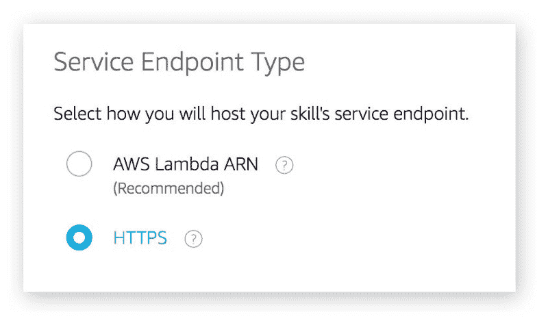
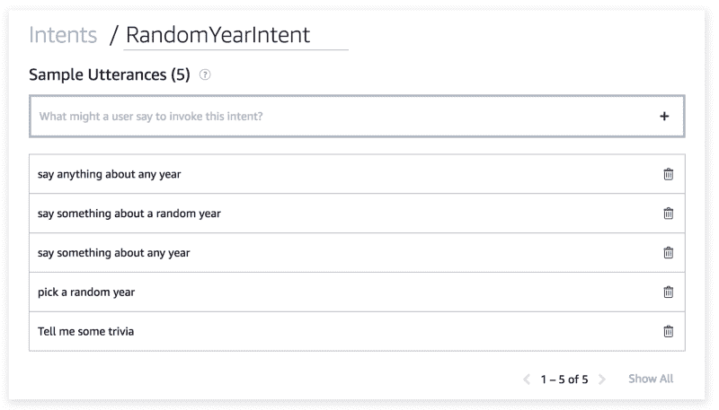
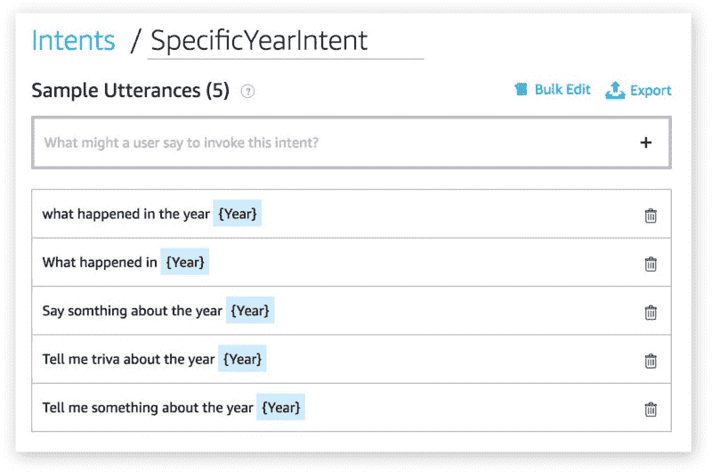

# 如何实现与 Spring Boot 的 Alexa 技能

> 原文：<https://www.freecodecamp.org/news/implementing-an-alexa-skill-with-spring-boot-also-why-would-you-do-such-a-thing-9992c0797646/>

拉斐尔的画

# 如何实现与 Spring Boot 的 Alexa 技能

#### 为什么你会做这种事


Alexa 实现自定义[技能](https://en.wikipedia.org/wiki/Amazon_Alexa#Alexa_Skills_Kit)有两种方式。

第一种是最常见的，也是亚马逊推荐的方式。使用 [AWS Lambda](https://aws.amazon.com/lambda/) ，一种无服务器的计算机服务。关于该主题的文章和教程并不缺乏。这不是其中之一。

第二种方式远不常见。这是使用您管理的 HTTPS web 服务托管端点。找到这种方法的好例子有点困难。本文将尝试这样做，并将使用 [Spring Boot](https://spring.io/projects/spring-boot) 作为实现的基础。



Endpoint configuration in the Alexa Skills Developer Console

但是在我们跳到**如何**之前，让我们先谈谈**为什么**:

*   为什么不使用 AWS Lambda？
*   为什么要忽略亚马逊的一个推荐呢？

这些问题很重要。你会发现很多关于用 Lambda 构建技能的很好的例子和文档，但是没有多少可供选择的。同样重要的是，如果你相信这个前提——我也相信——这个世界正在走向无服务器化。这是詹姆斯·贝斯维克关于这个话题的一篇[的伟大文章](https://read.acloud.guru/six-months-of-serverless-lessons-learned-f6da86a73526)。走 HTTPS 路线会让你走上一条孤独的道路，但有时这没关系。

以下是你可能想要或需要走那条孤独之路的一些原因。

*   你可以使用任何编程语言来编写你的 Alexa web 服务。
*   如果您已经部署了现有的 RESTful 服务，并且希望利用这些基础设施/投资。
*   如果您的 [CISO](https://en.wikipedia.org/wiki/Chief_information_security_officer) 不允许异地或基于云的基础架构。
*   如果你喜欢孤独的小路。

在我的例子中，我决定探索非 Lambda 路径，主要是因为我已经有了一个现有的服务层，我想利用它。我想重用一些 POJOs 和方法，而不必公开新的端点。当然，我可以创建 Lambdas 来简单地处理这些服务，这是一个有效的模式。但是我不想再增加一层部署脚本、测试和监控。

你可能有你自己的原因。如果我正在构建一个新的 [greenfield](https://en.wikipedia.org/wiki/Greenfield_project) 应用程序，我可能会选择 Lambda 路径。

### 先决条件

你将使用 [Alexa 开发者控制台](https://developer.amazon.com/alexa)来注册你的技能，定义意图和话语，并测试它。我假设您已经创建了一个开发者帐户，并且可以在控制台中设置一个新的自定义技能。

### Spring Boot·亚历克莎的技能

本文的其余部分将向您展示将 Alexa 技能添加到您现有的 Spring Boot 应用程序中是多么容易。为了证明这一点，我们将创建一项技能，用于查找特定年份或随机年份的有趣事实。您可以通过说出以下内容来与我们的技能互动:

```
Alexa, ask my demo app to tell me trivia about a random year.Alexa, ask my demo app, what happened in the year 1984? 
```

好吧，是的，这是一个非常无用的技能。但它将展示 Alexa 应用程序的所有重要方面，包括:

*   自定义意图处理
*   使用插槽，会话管理
*   内置意图处理

为了实现这一点，我们的示例技能将调用一个免费的第三方 API 来查找琐事信息，使用奇妙的 [NumbersAPI](http://numbersapi.com/#42) 。非常感谢[大卫](https://twitter.com/divad12)和[马克](https://github.com/mduan)创造了这个有趣的服务。

### 入门指南

重要的事情先来。将 [Alexa 技能工具包 SDK](https://mvnrepository.com/artifact/com.amazon.alexa/alexa-skills-kit) 添加到您的“pom.xml”文件中。在撰写本文时，SDK 的最新版本是 1.8.1。

```
<dependency>    <groupId>com.amazon.alexa</groupId>    <artifactId>alexa-skills-kit</artifactId>    <version>1.8.1</version></dependency>
```

SDK 包括一个名为`SpeechletServlet`的特殊 servlet，您需要将它作为应用程序引导的一部分来加载。这其实很容易做到。

servlet 是一个工作狂。它处理托管技能的所有混乱的[需求，例如验证请求是由 Alexa 发送的，验证签名，以及检查时间戳。对我们来说幸运的是，我们不需要处理这些令人头疼的事情。我们只需要加载 servlet。我们是这样做的:](https://developer.amazon.com/docs/custom-skills/host-a-custom-skill-as-a-web-service.html)

简单。您可以在上面看到，我们已经创建了一个加载 servlet 的配置类。在第 10 行，你可以看到`SpeechletServlet`被实例化了，然后在第 13 行它被 Spring 注册了。

这就是加载 servlet 所需要做的全部工作。

正如我提到的，servlet 负责与 Alexa 的所有复杂的握手通信。在此之后，servlet 将实际的交互业务逻辑委托给一个 **Speechlet** ，您必须实现它。您可以在第 11 行看到，我命名为`HandlerSpeechlet`的 Speechlet 被分配给了 servlet。每次 Alexa 交互都会调用这个 Speechlet。

Speechlet 只是一个 POJO，它符合 Alexa Skills SDK 中定义的 SpeechletV2 接口。这是界面的样子。

实现这四种方法是你的工作。

它们都很重要，但是大部分工作都发生在`OnIntent()`中，当用户说一些有意义的话时，它就会被调用。如果你是 Alexa 编程词汇的新手，你应该读一下[意图、话语和插槽:开发语音](https://medium.com/screenmedia-lab/utterances-slots-and-skills-the-new-vocabulary-needed-to-develop-for-voice-7428bff4ed79)所需的新词汇。

### 定义意图

跳转到 [Alexa 开发者控制台](https://developer.amazon.com/alexa)。在控制台中设置一个新的自定义技能——这部分非常简单。我将我的技能命名为“MyDemoApp”，在调用菜单下，我将技能调用名称设置为“my demo app”。

回想一下，在这篇文章的前面，我说过你可以通过说这样的话来与我们的技能互动:

```
Alexa, ask my demo app to tell me trivia about a random year.Alexa, ask my demo app, what happened in the year 1984?
```

你可以看到上面每个句子都是以唤醒词(“Alexa”)和技能调用名(“我的演示 app”)开头的。

```
Alexa, ask my demo app ...
```

技能调用名称之后的所有内容都被称为**话语**。您的工作是在开发人员控制台中列出话语，并将它们映射到意图。一个意图通常有许多表达，代表用户可能说的变化。例如，以下所有话语本质上都是一样的:

```
tell me trivia about a random year.say something about any year.pick a random year.tell me some trivia.say anything about any year.
```

所有这些话语都意味着同样的事情，因此可以映射到一个单一的意图。在我的申请中，我称之为“RandomYearIntent”。这是它在开发者控制台中的样子。



### 回到编写代码

定义了我们的第一个意图后，现在是时候跳回我们的 Spring 应用程序并编写一些代码了。让我们编辑我们的“HandlerSpeechlet”。现在，让我们跳过 Speechlet 的`onSessionStarted`和`onLaunch`方法，直接进入`onIntent`方法。

因为我们的应用程序最终将处理多个意图，所以我们首先需要确定哪个意图被调用。

在第 10 行，我们现在有了意图的名称。在我们目前的例子中，这应该是`RandomYearIntent`。在这一点上，您可能想写一堆反对 intent 名称的`if-else`语句，但是让我们尝试一些更聪明的方法。

通过确保我们的意图遵循特定的命名约定，我们可以使用一些 Spring 魔法来为每个意图加载和调用专门的处理程序。接下来的内容并不是 Alexa Skills SDK 特有的。这只是我自己处理多重意图的方式。有许多方法可以实现这个逻辑。这是我的。

让我们从定义一个接口开始，我们将为所有的处理程序使用这个接口。让我们将`IntentHandler`创建为:

接下来，对于每个意图，我们将创建一个实现这个接口的类。我们还会小心地将我们的类命名为与 intent 名称相同的名称，并附加“Handler”一词。例如，对于意图“RandomYearIntent”，我们将创建一个名为`RandomYearIntentHandler` *的类。*

好吧，让我们暂时不去实现它。我们将返回到我们的“HandlerSpeechlet”*来添加代码，该代码将把控制权传递给我们的新“RandomYearIntentHandler”。基本策略是依靠我们的命名约定“intent name”+“Handler”。*

*我从下面的代码中删除了一些细节和错误处理，这样我们就可以专注于重要的部分。在本文末尾，您可以找到我的 GitHub repo 的链接，其中包含完整的代码。*

*查看下面的第 12 行和第 13 行，它们构造了类名，然后让 Spring 查找具有该名称的注册 bean。最后，在第 17 行，我们将控制权交给那个处理程序。*

### *RandomYearIntentHandler*

*现在，我们已经准备好调用专门的意图处理程序了。让我们回到我们的“RandomYearIntentHandler”的实现。这个特定的意图很简单。下面是完整的实现。*

*简单！你听懂第一行的注释了吗？这个注释是一个很酷的小技巧，它将告诉 Spring 创建这个类的一个实例作为 Bean。这就是我们如何能够使用`beanFactory.getBean(handlerBeanName)`访问 Speechlet 中的处理程序。*

*在第 11 行，我们创建了一个介于 1900 年和当前年份之间的随机数。然后我们调用[数字 API](http://numbersapi.com/#42) 来获取关于那一年的琐事。*

*在第 14 和 15 行，我们创建了一个`Card`和一个`Speech`。`Card`是显示在你的 Alexa 移动应用程序中的内容，或者是显示在 Echo Show 的屏幕上的内容。语音是向用户反馈的内容。*

*是我创建的一个简单的类。这里就不赘述了，不过大家可以在 [GitHub](https://github.com/raf66/AlexSpringBootWeb/blob/master/src/main/java/net/fiol/demo/alexa/utils/AlexaUtils.java) 上回顾一下。*

### *这很简单——老虎机呢？*

*槽基本上是话语中的**变量。回头看看我们应用程序中的两个意图。第二个意图，我将命名为“SpecificYearIntent”，允许用户说出任何年份。例如:***

```
*`Alexa, ask my demo app, what happened in the year 1984?`*
```

*在上面的话语中，年份是高度可变的。我们不想为每一个可能的年份定义一个话语。相反，我们将使用一个槽来定义这个发音，如下所示:*

```
*`Alexa, ask my demo app, what happened in the year {Year}?`*
```

*{Year}代表一个数字。回到我们的开发人员控制台，我们将设置一个新的“SpecificYearIntent”意图及其相关语句，如下所示:*

*

SpecificYearIntent utterances* 

*我定义了一个名为“Year”的槽，它的类型是“AMAZON”。号”。现在，在我的处理程序中，我可以很容易地通过名称获取槽值。*

*第 13 行是我们解析年份`Slot`的地方。剩下的都是样板 Java 代码，遵循与第一个意图相同的模式——调用 NumbersAPI 服务并处理响应。*

### *会话和状态*

*在本文中，我没有涉及 Speechlet 的`OnSessionStarted`或`OnLaunch`方法，但是我在 GitHub 的[示例项目中包含了`OnLaunch`的一个实现。](https://github.com/raf66/AlexSpringBootWeb)*

*您可以使用`Session`对象来存储在对话模式下跨调用保留的变量。当用户调用您的技能，但不说出可识别的话语时，会出现对话模式。例如:*

```
*`Alex, open my demo app.`*
```

```
*`>> Hello.  Here are some things you can say: Tell me something about a random year.  Or, what happened in nineteen eighty-nine?`*
```

```
*`What happened in the year 1984?`*
```

```
*`>> 1984 is the year that the European Economic Community makes £1.8 million available to help combat the Ethiopian famine on October 25th.`* 
```

```
*`>> What else can I tell you? Say "Help" for some suggestions.`*
```

```
*`Cancel.`*
```

```
*`>> OK.  Goodbye.`*
```

*你会在我的源代码中注意到我有一个名为`setConversationMode`的方法。它只是在会话中设置一个变量，让我知道我们处于对话模式。*

### *摘要*

*用 Spring Boot 编写 Alexa 技能相当容易，并且可以成为重用现有基础设施的一种强有力的方式。[从 GitHub](https://github.com/raf66/AlexSpringBootWeb) 下载完整的应用程序，了解更多详情。*

*如果你在南佛罗里达地区，你可以用我的 [Cutler Stew 技能](https://www.amazon.com/Rafael-Fiol-Cutler-Stew/dp/B0793FRYJG)(与 Spring Boot 一起建造)来了解我的乐队 Cutler Stew 下一次表演的时间和地点。*