# 我如何用 Figma 设计一个著名的立体建筑

> 原文：<https://www.freecodecamp.org/news/how-i-designed-a-popular-landmark-building-in-isometric-3d-using-figma-f059fe333459/>

作者:Gbolahan Taoheed Fawale

# 我如何用 Figma 设计一个著名的立体建筑

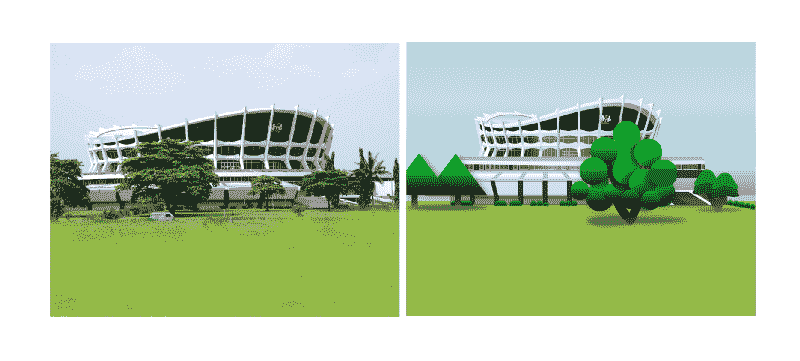

Original image vs my isometric 3D image.

这篇文章并不完全遵循传统的教程格式。这是讲故事和广泛解释的结合，是我思想的一个很好的记录表达。

自从我在[图玛](https://www.figma.com)中设计了我的第一个 3D 物体后，我对重新创造不同的复杂物体和插图变得更感兴趣了。这将最终帮助我提高我的设计技能。我想做出让人惊叹的设计。你真的用 Figma 做到了吗？”我想听他们表达他们的惊讶，因为他们认为 Figma 只是一个 UI 设计工具。

这就是我个人希望 Figma 在我的社区内外的定位。就像开发人员说的，“重要的不是可用的工具，而是这些工具能被很好地利用。”事实上，这是关于如何使用这些工具来达到预期的结果。此外，软件开发最重要的方面是什么决定了你对特定编程语言的熟练程度。不过，我也做一些前端工作。

我有一些设计项目以及附带的帖子，我将努力记录我是如何创建它们的。当我完成后，我会尽快把这些公之于众。

虽然等轴测设计逐渐流行起来，但我想让我的设计超越传统的等轴测 3D 设计。我希望他们朝着更现实的方向前进，同时保持他们的原创性。

现在，让我们回到正题。我想把它带回去寻根(非洲人，a-woo！我知道我们中的一些人知道流行的 JJC 歌曲。Lol。)嗯，这是我的等距尼日利亚 3D 地标项目的第一个设计，也是最复杂的设计之一。我相信，如果我能成功地设计这个建筑(拉各斯的国家剧院)，我就能轻松地设计任何其他立体的三维物体。

### **第一阶段:预设计**

一开始，我花了一些时间研究这座建筑。我把从谷歌上得到的一张图片带到我的 Figma 工作区，以此作为参考点。在我进行设计的时候，我一直在研究参考图片，并不断调整设计，直到我得到一些精美的作品。

我对待我的设计就像我想在纸上画或画它们一样。我研究阴影、透视、对比、方向和光的反射。这些是创建等轴测三维对象和真实插图时要注意的一些最重要的元素和功能。有策略地应用渐变层给物体以立体的外观。

### **第二阶段:适当的设计(创造剧院的上座部分)**

首先，我用一个矩形创建了建筑上部的主体。然后我修改矩形，给我一个类似于我在参考照片中的形状。之后，我对建筑的另一部分(矩形)做了类似的处理，看起来像是在第一个后面，请看下面的第二个图像。

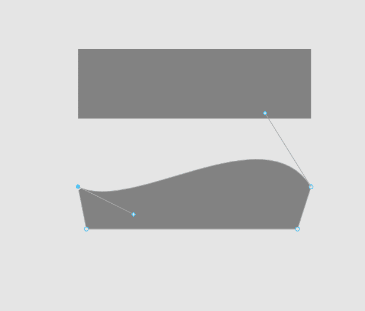

Step 1 of design.

现在，我们需要复制这两个形状，编辑它们，使它们看起来更大，并将它们放在初始/原始层的后面。这为后来看起来像真实建筑结构的屋顶/顶部打下了基础。下图演示了这一过程。

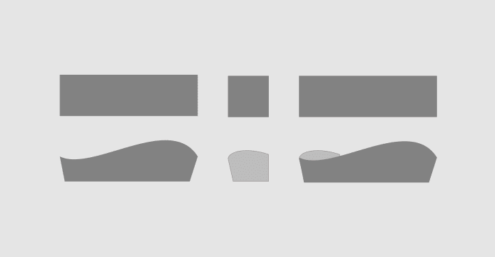

Step 2 of design: laying foundation

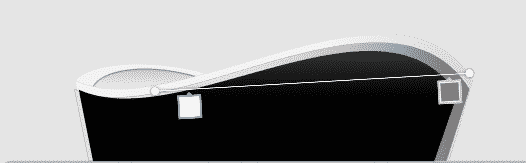

Gradient fill.

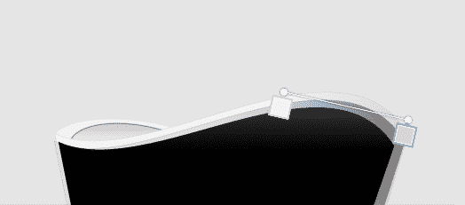

Gradient fill 2.

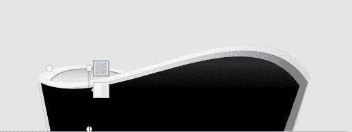

Gradient fill 3.

一旦完成，下一个阶段是创造建筑的下部。

### **第三阶段:剧院舞台外部设计**

我创建了一个矩形，左上角和右上角的圆角半径为 100 像素，还应用了线性渐变填充。拐角半径和坡度用于表示结构是圆形的。结果就是下图。

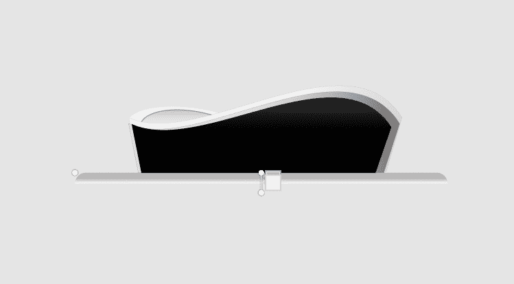

接下来，我添加了另一个渐变填充的矩形，并将其向底部弯曲。这一阶段的两个矩形显示了我们上面创建的第一部分的混凝土基底也是圆形的。新的矩形具有更宽的周长，因此它比它上面的部分向外延伸得更多。这也反映在矩形的宽度上。组合的结果如下图所示。

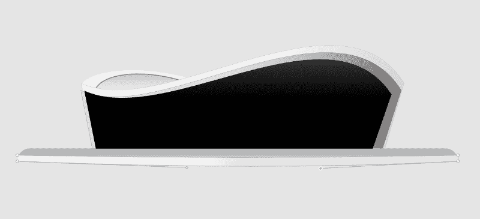

事情越来越有趣了。在下图中，我创建了另一个矩形，然后应用线性渐变填充。你可以看到中心更亮，有一种闪亮的效果。这样做是为了给下一层玻璃效果，如参考照片所示。

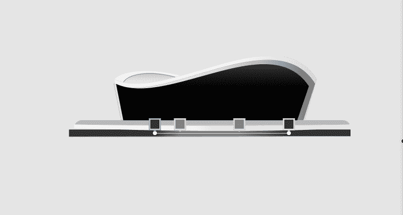

玻璃质层是复杂的形状(许多相似形状的单层)。我使用复杂的形状来减少我的图层面板中的图层数量，在设计时没有分组或展平图层。你可以在这里 阅读我在上面的帖子 [**。紧接着，我添加了另一个矩形，如下图所示。这部分形成了一堵墙，作为建筑不同开口和入口的分界线。**](https://medium.com/figma-africa/figma-tutorial-creating-complex-shapes-in-figma-chessboard-example-615c36ae0302)

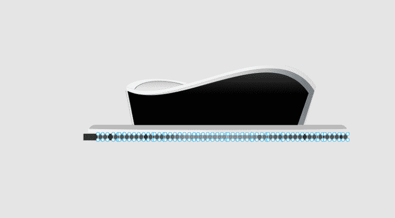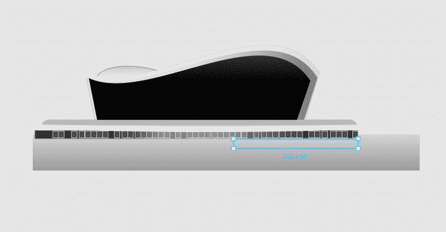

### **第四阶段:底层设计**

接下来，我添加了另一个矩形层，我编辑和修改后看起来就像下面的图片。这一层形成了下一层的顶部。它，以及我之后将添加的其他层，都在结构的外观以及观众对它的感知中发挥作用。

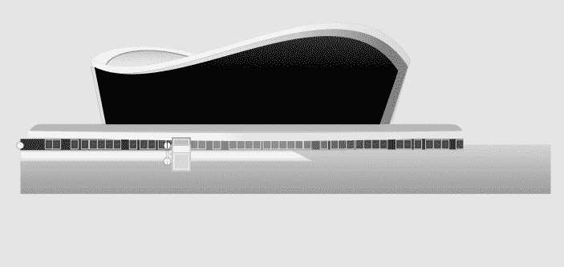

我添加了另一个模糊的矩形，为我在下一张图片中创建的下一层形成阴影。

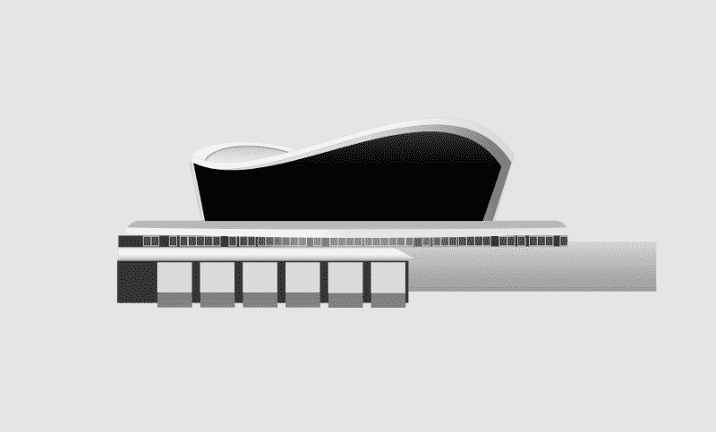

在上面的图片中，我创建了 12 个矩形，整齐地放置在彼此的顶部，我修改后得到了下面的图片

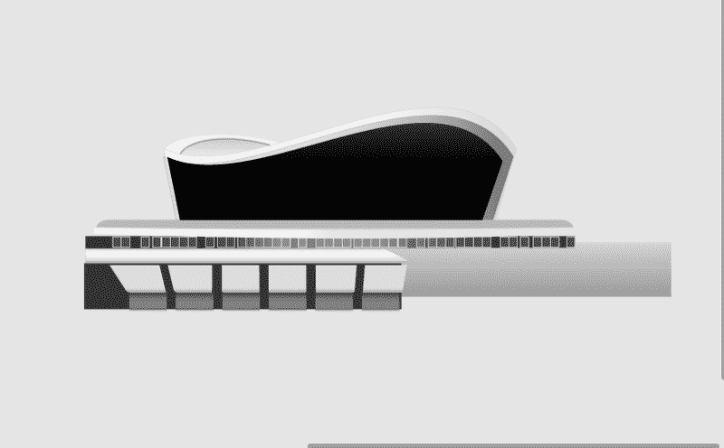

### **第五阶段:添加更多效果**

我对上面的六个浅灰色矩形应用了线性渐变填充和阴影。渐变让它看起来像一堵墙，光线从墙上反射回来。我添加了阴影来加强这个外观和效果。下面较暗的矩形只是平面墙/建筑的基础。六个浅灰色矩形的阴影向外延伸到它正在投射的上方弯曲的墙壁/柱子。

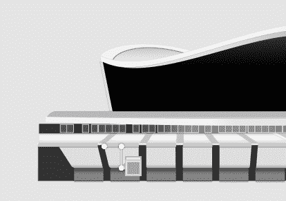

Gradient fill.

我还对深灰色的矩形应用了渐变填充。这些更暗，因为它们是建筑的最低部分。

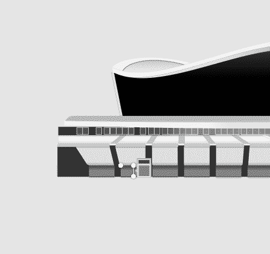

在这个阶段，我需要添加一些层来完善外观。我添加了另外五个窄矩形来适应我创建的 12 个矩形之间的空间。

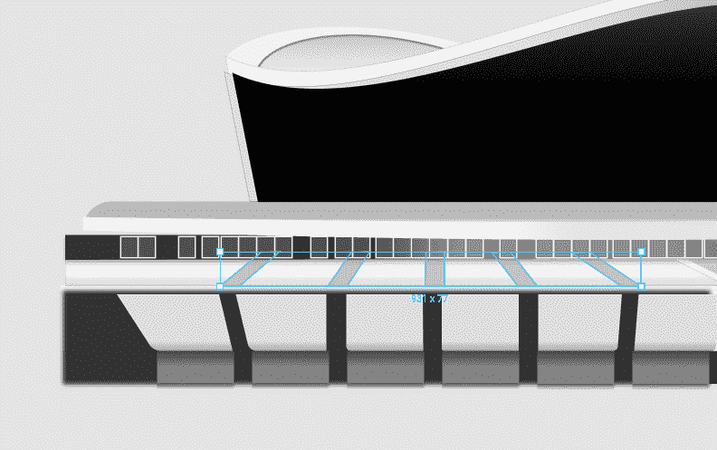

然后我添加了一些窄矩形，并垂直放置。这给出了一个真实建筑的厚块/柱效果，在六个灰色矩形与它上面的平面层相遇的地方。如下图所示。

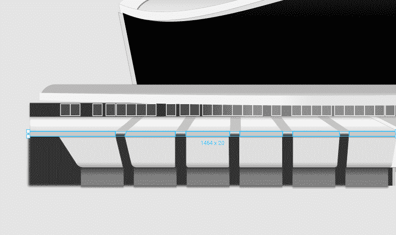

在这一点上，仍然缺少一些东西。我添加了新的矩形层，并对它们进行了修改，在我上面创建的 12 个矩形的最右边添加了一个看起来像墙的层。正如在参考照片中捕捉到的，我修改了最轻的矩形，并将其放在 12 个矩形的后面。它现在更加向右突出。我修改了较暗的矩形，如下图所示:

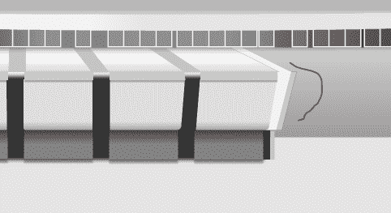

### **第六阶段:处理外柱**

我回到上面的部分，把一些东西放在适当的位置。如下图所示，我创建了窄矩形来代表垂直的柱子。

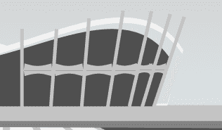

vertical pillars

然后我创建了另一组矩形。这些被修改了，还有一个被反方向翻转了。我把这两个形状组合在一起，形成水平的内柱，然后复制成下图的样子。尽管现在它们还没有整齐地排列好，但我稍后会处理它。

在这篇文章的后面部分，你会发现每个单独的水平柱子的上部比下部更亮。此外，靠近建筑物左侧的灯比右侧的灯更亮——还记得建筑物是圆形结构吗？

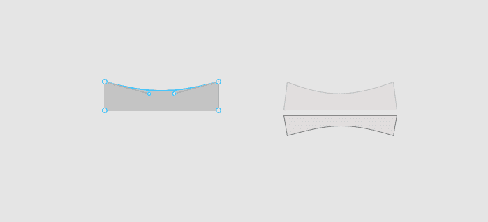

Horizontal pillars

### **第七阶段:设计屋顶**

我在垂直柱子的最顶端施了一些魔法。我创建了一个新的矩形，并使用“编辑对象”选项来修改它，看起来就像下面这样。我对它进行了修改，以适应屋顶圆形结构的不同部分。你可以看到它们大小不同，也反映了从顶部照射到它们身上的光量。

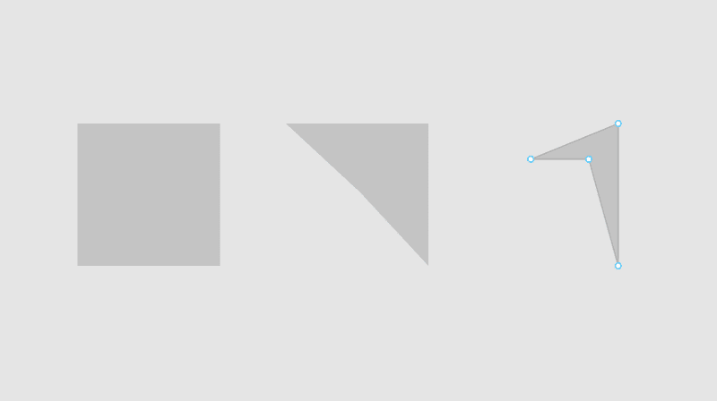

Creating roof tops

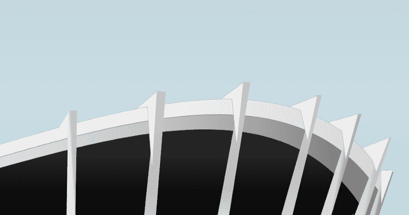

Rooftops

下图中的屋顶只是我修改过的矩形，并填充了颜色以与屋顶本身的表面融合。我创建了另一个副本，将它向上移动了一点，在最顶端的边缘有一种笔触，给它一种与天空形成对比的效果。如果我不那样做，它就会消失在背景的天空中。

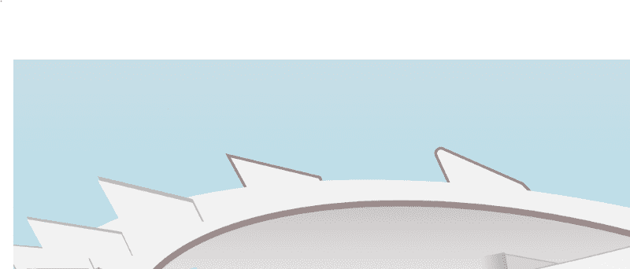

在下图中，黄色箭头显示了建筑的方向和曲率。落在建筑物屋顶上的光线反射完全不同，使我们看到建筑物的一些部分较暗，而另一些部分较亮。随着建筑物向右弯曲，标有蓝色的区域更亮，尺寸也更大。朝向左侧，它们变得更暗更矮，直到建筑的圆形结构变得更加明显，在左侧更高。

这就像你在有急转弯的路上行驶一样——当你驶过弯道时，你只能看得更远。正是这些小东西让眼睛将建筑感知为一个圆形结构。

### **阶段 8:给柱子添加效果**

以下是我对垂直柱子应用线性渐变填充的不同方式的图片。这给了他们一个坚实的外观。你还会观察到垂直的柱子是倾斜的，以符合建筑的弯曲方向？

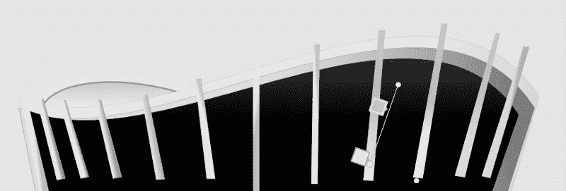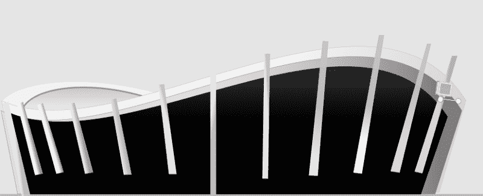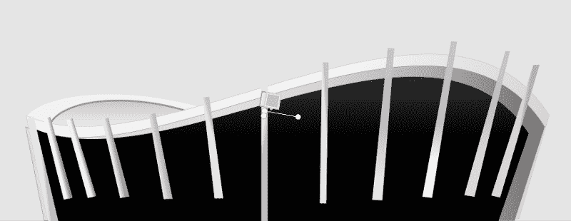

### **第九阶段:添加窗户和玻璃墙**

就在添加围绕建筑的垂直柱子之前，我创建了复杂的线条形状。这些看起来像抛光的木块，整齐地并排排列。我用它作为建筑上部外墙的填充层，然后对它进行模糊处理。结果如下图所示。

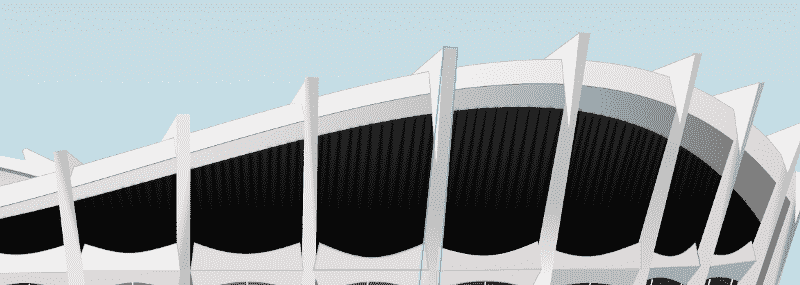

Blurred black lines

我也做了一些类似的事情来创建下图中的玻璃窗。

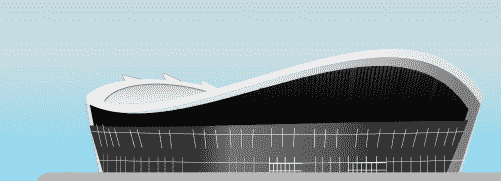

你会注意到下图中白线后面的黑色背景。在这一层，我应用了渐变填充来给玻璃墙/窗户一个闪亮的效果，并给建筑一个圆形的结构。这就是为什么矩形的左右两边比明亮的中间部分暗的原因。你还会注意到白线是弯曲和倾斜的，与垂直的柱子平行。

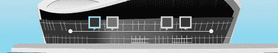

最终结果如下所示。

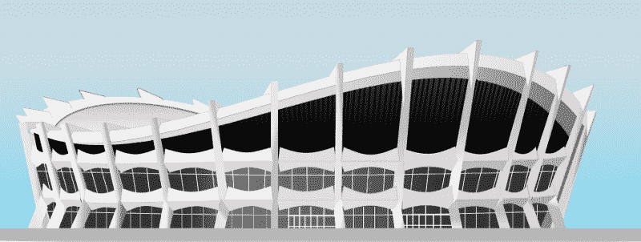

玻璃使中心看起来更明亮，因为这是我们的眼睛唯一能看到的建筑部分。它反映了天空和周围的环境，但由于建筑物的圆形结构，向左和向右移动会变得更暗。如果这是一座普通的非圆形玻璃建筑或摩天大楼，所有的玻璃都会闪闪发亮！

我不断调整设计，在垂直的柱子上应用渐变，给它们一个立体的外观。垂直支柱的下部向外弯曲以支撑该结构。考虑到垂直的柱子是矩形的，而不是我用钢笔工具创建的形状，我想了一会儿我将如何实现这一点。经过进一步的检查，我发现有必要添加另一个矩形，并在两个矩形的交叉处使用渐变来混合它们。

#### **幕后的东西**

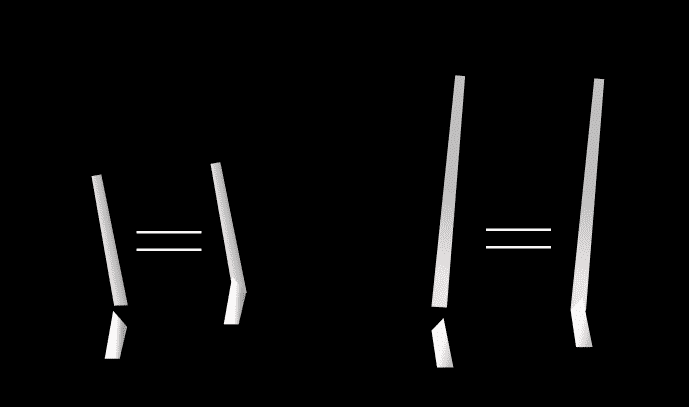

Behind the scenes ? lower portion of the pillar

你会注意到我对水平柱子做了一些改变，以反映下图中光线的效果和方向。每个水平支柱的上部比下部轻。水平支柱的整体外观朝向建筑物的右侧部分变得更暗/更暗淡。

在右边建筑的下部，我添加了一些矩形来代表建筑的入口/车道。我通过应用内部阴影来描绘一个入口隧道。

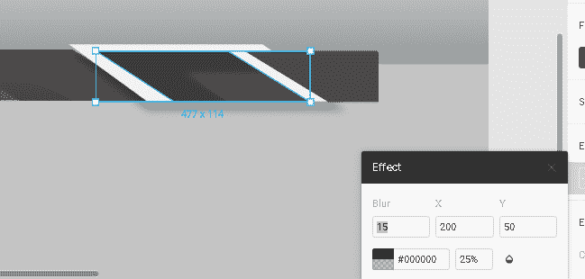

然后我处理了下面的天空图像和周围的风景。代表建筑物周围植被的绿色平面只是一个单色填充的大矩形(您可以在第二个图像中看到草层的图像)。

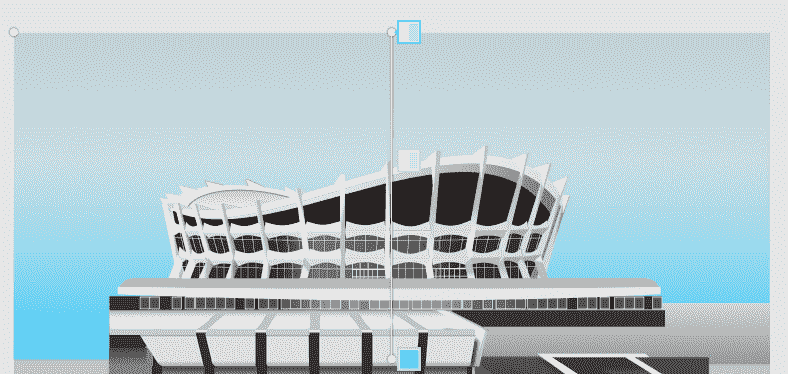

Gradient to form the sky.

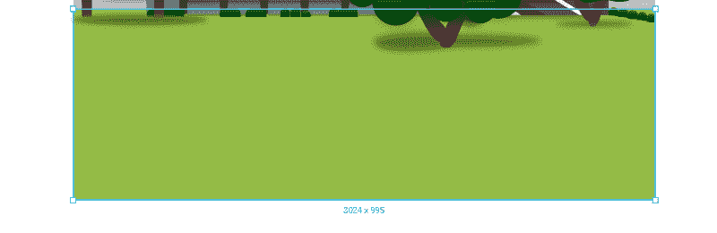

reactangular grass layer

### 第十阶段:尼日利亚盾形纹章

在这个阶段，我几乎完成了设计。因为我不满意，我试图创造尼日利亚的盾形纹章。不过，这是一个很快的过程，因为我更喜欢设计一些不完美的东西，而不是什么都不放。

马和鹰是使用钢笔工具创建的。对于“Y”部分，盾牌下面的层和盾牌背景是修改后的形状。我还在组合的盾形纹章上应用了阴影，让它从背景中“弹出”。

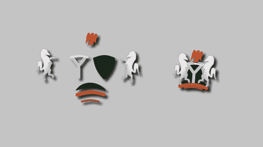

Rough sketch (Coat of Arms).

### 第 11 阶段:植被和地理

还有树！使用阴影和渐变图层的原因是为了描绘不同的隐藏树枝和树叶在树的不同部分相互投射阴影。我还把有圆圈的树做得更大、更近，并且有策略地放置。树木在下面投下阴影，在观众眼中给建筑一种遥远的效果。

树下的阴影只是被拉伸的圆形，看起来像一个碟子，看起来是平的。这些然后被模糊，看起来像真正的阴影。

Tree shadows.

我还在设计中创建了一些对象来代表灌木和绿花。这些被种植在不同的位置，看起来像参考图像。灌木和花是我创建的矩形，在上部应用圆角，填充渐变层，并进行模糊处理以产生远处的效果。物体越近越清晰，但是灌木和花离得很远。这也是它们尺寸小的原因。

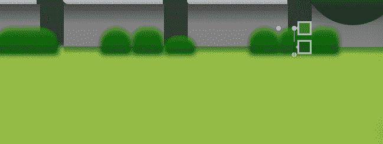

Shrubs when zoomed.

最终的设计如下所示。

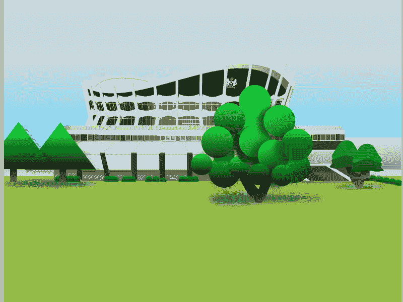

这里设计的链接是****。****

**感谢阅读**

**你可以在推特 [**这里**](https://twitter.com/GbMillz) 联系我**

**别忘了在这里 **加入 Figma 非洲社区。****