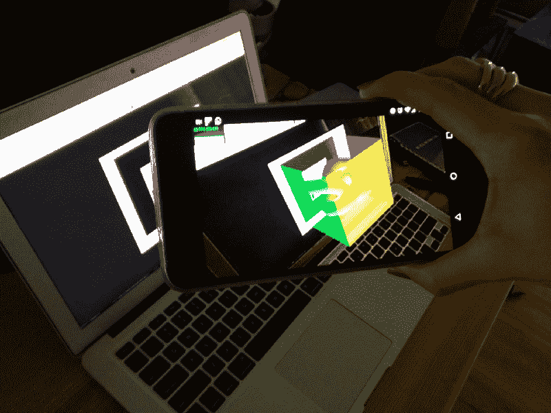
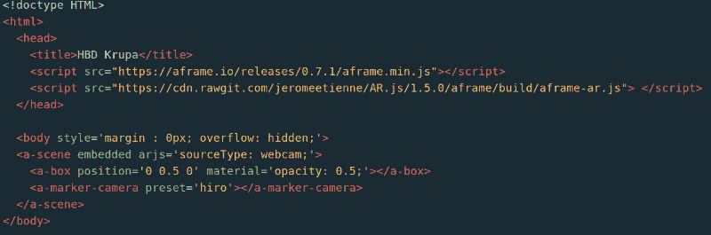
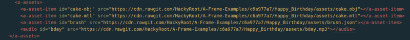
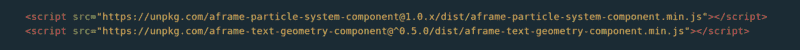
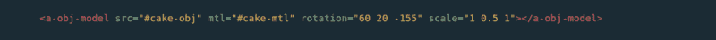
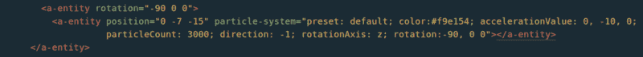
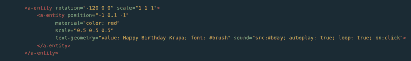
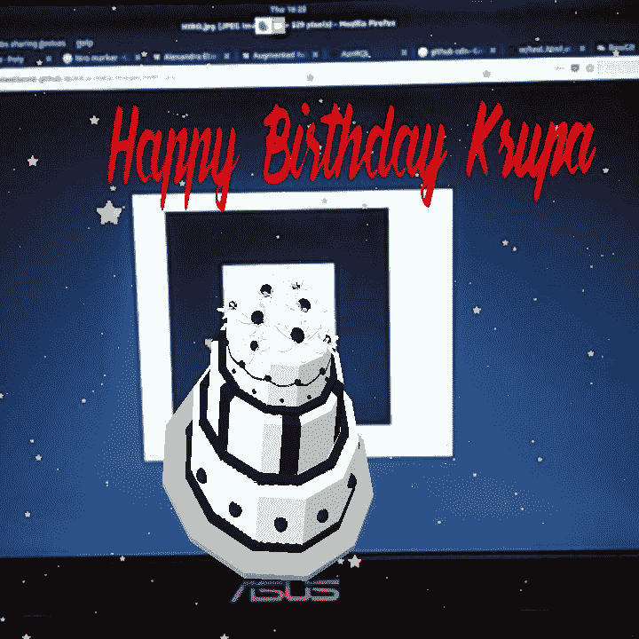

# 如何使用增强现实祝某人生日快乐

> 原文：<https://www.freecodecamp.org/news/how-to-wish-someone-happy-birthday-using-augmented-reality-3809776cb655/>

我有一个朋友的生日快到了，所以我想为她做些特别的事情。因为她和我一样是个科技迷，所以我不能只给她一个简单的生日礼物，比如泰迪熊或者巧克力。于是，我开始在网上寻找独特的方式祝她生日快乐。

我最后看了一个视频，视频中一个男孩用虚拟现实向一个女孩求婚。所以，我决定——就是这样！这就是我要做的。但不是求婚那部分。

当我为 Mozilla 做贡献的时候，我已经使用[**A-Frame**](https://aframe.io/)**——**Mozilla 的网络框架创建了几个小的虚拟现实项目，用于构建虚拟现实体验。而且相信我，即使你不太懂 VR 或者 AR，你也可以用 A-Frame 轻松创建一个 VR 场景。唯一的先决条件是 HTML，在这里你可以轻松学会[。不过，为了更好地理解，我建议你去参加](https://www.w3schools.com/Html/) [A-Frame 学校](https://aframe.io/aframe-school/#/)，这是一个为初学者准备的很好的教程集。

所以我决定使用 A-Frame，但是我想要的不仅仅是一个简单的显示“生日快乐”的虚拟场景。最终我选择了打造一个 AR 场景。我发现了一个很棒的项目叫做[AR.js](https://github.com/jeromeetienne/AR.js/blob/master/README.md) **。**如果你想开始学习 AR.js，这里有一篇[适合初学者的好文章](https://medium.com/arjs/augmented-reality-in-10-lines-of-html-4e193ea9fdbf) **。**

### 构建一个基本的增强现实网络应用



AR Scene, created using AR.js

要观看 AR 场景，您必须:

*   在桌面浏览器中打开这张 [HIRO 标记图像](https://jeromeetienne.github.io/AR.js/data/images/HIRO.jpg)。
*   在手机浏览器中打开这个 AR web 应用程序，并将其指向您的屏幕。

当你扫描一个标记(这里是 HIRO 标记)，它会在你的手机上显示一个 AR 场景，就像上面的图像一样。我用的是普通的 HIRO 马克笔，但是你也可以[创建自己的马克笔](https://medium.com/arjs/how-to-create-your-own-marker-44becbec1105)。

所以，在添加了所有这些库之后，我的代码看起来像这样:



Basic AR web app [ [Demo](https://hackyroot.github.io/A-Frame-Examples/Happy_Birthday/Basic.html) ]

请注意，在访问任何 AR web 应用程序时，如果您收到任何要求允许访问网络摄像头的提示，请允许它。不然 app 就不行了。

### 添加 3D 模型和字体

所以，现在我们有了一个简单的 AR 网络应用程序在我们的设备上运行。但是没有蛋糕的生日算什么呢？！幸运的是，A-Frame 支持三种类型的 3D 模型: [glTF](https://aframe.io/docs/0.8.0/components/gltf-model.html) 、 [OBJ](https://aframe.io/docs/0.8.0/components/obj-model.html) 和 [COLLADA](https://aframe.io/docs/0.8.0/components/collada-model.html) 。点击了解更多关于 A-Frame [中 3D 模型的信息。](https://aframe.io/docs/0.8.0/introduction/models.html)

我从[谷歌聚](https://poly.google.com/) **下载了一些蛋糕的 3D 模型文件。**您可以使用 *< a-asse* ts >标签导入 A-Frame 中的任何资产文件。如果您想要使用不同的字体，也可以导入单独的字体。

我非常确信 A 形架是最棒的。但是，等等…

### 添加音频

没有生日歌的生日也是不完整的，对吗？A-Frame 也支持音频文件。你可以使用 *<奥迪* o >标签导入你的文件，在< a-assets >标签下。



Import asset files

### 添加粒子

当你听到生日时，你会想到什么——当然是在蛋糕之后？一个**方，**对吧？所以，让我们使用 [A-Frame 的粒子系统组件](https://github.com/IdeaSpaceVR/aframe-particle-system-component)，给我们的 AR 场景添加五彩纸屑。



Add libraries for confetti and 3D text

### 让我们把它们放在一起

#### 3D 模型

这段代码将显示蛋糕的 3D 模型。但是正如你所看到的，我已经在*旋转*和*缩放*字段中添加了一些值。所以，我们来讨论一下。根据 A-frame 的 [GitHub 页面](https://github.com/aframevr/aframe/blob/master/docs/components/rotation.md):

*   **旋转**:旋转组件定义一个实体的方向，以度为单位。它将俯仰(`x`)、偏航(`y`)和滚动(`z`)作为三个空格分隔的数字来表示旋转的度数。
*   **Scale**:Scale 组件定义一个实体的收缩、拉伸或倾斜变换。X、Y 和 Z 轴需要三个比例因子。
*   **MTL:** 代表素材库文件(。 **mtl** 素材库**文件**包含一个或多个材质定义，每个定义都包含单个材质的颜色、纹理和反射贴图。这些应用于对象的曲面和顶点。材料**文件**以 ASCII 格式存储，并具有。 **mtl** 扩展。
*   **OBJ** :一种文件格式，是为了从不同的 3D 应用程序中导入和导出几何图形而创建的。这是许多 3D 设计解决方案常用的文件类型。
*   建议:如果你没有看到你的模型，试着缩小它。与 A 形框架的比例相比，OBJ 模型通常具有非常大的比例。

如果你想知道我是怎么知道旋转的精确值的，我不知道。我使用了一个由 Mozilla 团队开发的神奇工具，名为 [A-Frame Inspector](https://github.com/aframevr/aframe-inspector) ，专为这个目的而设计。

要了解更多关于 *< a-obj-model* >的信息，请访问 [thi](https://aframe.io/docs/0.8.0/primitives/a-obj-model.html) s 链接。



Display 3D model of Cake

#### 微粒

嗯，这些代码乍一看可能让人不知所措，但请相信我，事实并非如此。我们之前讨论了轮换，但是我们也来讨论一下其他字段:

*   **位置**:将实体放置在三维空间的某个点上。位置将坐标值作为三个空格分隔的数字。
*   **预设**:预设配置。可能的值有:`default`、`dust`、`snow`、`rain`。在这里，我们选择默认，以显示开始。
*   **颜色**:描述一个粒子的颜色。该属性是一个“值随寿命变化”的属性，这意味着可以给定一组值来描述粒子寿命期间特定值的变化。
*   **加速度值**:描述该发射器的基础加速度。
*   **粒子数**:这个发射器将容纳的粒子总数。
*   **方向**:发射器的方向。如果值为`1`，发射器将在粒子生命周期开始时启动。如果值为`-1`，发射器将在粒子生命周期结束时启动，并向后运行。
*   **旋转轴**:描述该发射器的旋转轴。可能的值有`x`、`y`和`z`。

要了解更多关于 **A-Frame 的粒子组件系统***请访问此[链接](https://www.npmjs.com/package/aframe-particle-system-component)。*

**

#### *文本和音频*

*嗯，你也可以使用 *< a-tex* t >，但是我决定使用[的文本几何组件](https://www.npmjs.com/package/aframe-text-geometry-component)来获得更多选项。它用于将文本生成为单个几何图形。*

*   ***Material** :文本几何组件只定义几何图形。我们可以将任何 three.js 材质应用于几何体。*

```
*`<a-entity text="value: HELLO" material="color: red; src: #texture"></a-entity>`*
```

*更多详情，请访问 three.js 的[文档](https://threejs.org/docs/)。*

*   ***文本几何**:字符串和字体值。(你应该编辑这部分的文字，否则你最后会祝我的朋友生日快乐？？)*
*   ***声音**:将实体定义为声音或音频的来源。*
*   ***自动播放** *:* 描述是否自动播放设定好的声音。*
*   ***循环** *:* 描述声音播放完毕后是否循环播放。*
*   ***On** :实体播放声音前要听的事件。*

**

### *资源:*

*   *[源代码](https://github.com/HackyRoot/A-Frame-Examples/tree/master/Happy_Birthday)*
*   *[演示](https://hackyroot.github.io/A-Frame-Examples/Happy_Birthday/demo.html)*

*是的，你做到了？？？。您已经创建了您的第一个 AR 应用程序。如果你做的一切都是正确的，你现在应该看到类似下图的东西:*

*

Finally, Happy Birthday Krupa!* 

*如果你喜欢我的作品，请在 Medium @ [Pratik Parmar](https://www.freecodecamp.org/news/how-to-wish-someone-happy-birthday-using-augmented-reality-3809776cb655/undefined) 上关注我，或者在[LinkedIn](https://www.linkedin.com/in/pratik-parmar-8853597a/) 上加我。如果你需要任何帮助，请随时在 Twitter 上联系我: [Pratik Parmar](https://www.freecodecamp.org/news/how-to-wish-someone-happy-birthday-using-augmented-reality-3809776cb655/undefined) 或者在下面留言。*

*除了在 Mozilla 的开源贡献之外，我还是微软的学生伙伴和 GDG 巴罗达的社区成员。我要感谢 [Mozilla](https://www.freecodecamp.org/news/how-to-wish-someone-happy-birthday-using-augmented-reality-3809776cb655/undefined) 和 [MozillaIN](https://twitter.com/MozillaIN) 社区为我提供了学习 VR/AR 和开源的机会和资源。*

*这是我， **Pratik Parmar** 结束了下一次科技冒险。通话完毕…*

*[编辑:谢谢你 [Vikranth Kanumuru](https://www.freecodecamp.org/news/how-to-wish-someone-happy-birthday-using-augmented-reality-3809776cb655/undefined) 提醒我源代码的 URL 被破坏了。现已更新，请立即尝试。继续编码，继续摇摆]*