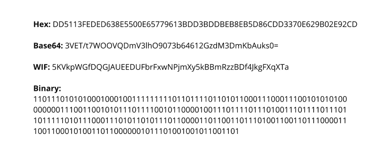
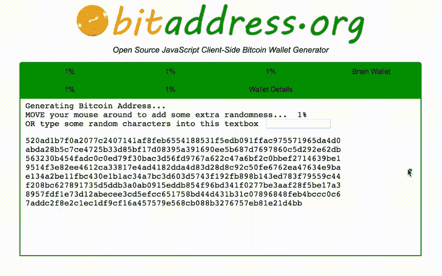

# 如何生成你自己的比特币私钥

> 原文：<https://www.freecodecamp.org/news/how-to-generate-your-very-own-bitcoin-private-key-7ad0f4936e6c/>

在加密货币中，私钥允许用户访问他们的钱包。持有私钥的人完全控制那个钱包里的硬币。为此，你应该保密。如果您真的想自己生成密钥，那么以安全的方式生成它是有意义的。

在这里，我将介绍私钥，并向您展示如何使用各种加密函数生成自己的密钥。我将提供算法的描述和 Python 代码。

### 我需要生成私钥吗？

大多数时候你不知道。例如，如果你使用像比特币基地或 Blockchain.info 这样的网络钱包，它们会为你创建和管理私钥。交易所也是一样。

移动钱包和桌面钱包通常也会为您生成一个私钥，尽管它们可能会选择用您自己的私钥创建一个钱包。

那么，为什么要产生它呢？以下是我的理由:

*   你想确保没人知道这个密钥
*   你只是想了解更多关于密码学和随机数生成(RNG)

### 私钥到底是什么？

从形式上来说，比特币(和许多其他加密货币)的私钥是一系列 32 字节。现在，有很多方法来记录这些字节。它可以是一串 256 个 1 和 0(32 * 8 = 256)或 100 个骰子滚动。它可以是二进制字符串、Base64 字符串、一个 [WIF 键](https://en.bitcoin.it/wiki/Wallet_import_format)、[助记短语](https://github.com/bitcoin/bips/blob/master/bip-0039.mediawiki)，或者最后是一个十六进制字符串。出于我们的目的，我们将使用 64 个字符长的十六进制字符串。



The same private key, written in different formats.

为什么是 32 字节？很棒的问题！你看，为了从私钥创建公钥，比特币使用了 **ECDSA** ，即椭圆曲线数字签名算法。更具体地说，它使用了一种叫做 **secp256k1** 的特殊曲线。

现在，这条曲线的阶数为 256 位，以 256 位作为输入，输出 256 位整数。256 位正好是 32 字节。所以，换句话说，我们需要 32 字节的数据来馈入这个曲线算法。

对私钥还有一个额外的要求。因为我们使用 ECDSA，所以密钥应该是正的，并且应该小于曲线的阶数。secp256k1 的顺序是`FFFFFFFFFFFFFFFFFFFFFFFFFFFFFFFEBAAEDCE6AF48A03BBFD25E8CD0364141`，相当大:几乎任何 32 字节的数都会比它小。

### 朴素方法

那么，我们如何生成一个 32 字节的整数呢？首先想到的是使用你选择的语言的 RNG 库。Python 甚至提供了一种生成足够位数的可爱方法:

```
import random
bits = random.getrandbits(256)
# 30848827712021293731208415302456569301499384654877289245795786476741155372082
bits_hex = hex(bits)
# 0x4433d156e8c53bf5b50af07aa95a29436f29a94e0ccc5d58df8e57bdc8583c32
private_key = bits_hex[2:]
# 4433d156e8c53bf5b50af07aa95a29436f29a94e0ccc5d58df8e57bdc8583c32
```

看起来不错，但实际上，不是。你看，普通的 RNG 图书馆并不是为加密而设计的，因为它们不是很安全。它们基于种子生成数字，默认情况下，种子是当前时间。这样，如果你知道我大概是什么时候生成上面的位的，你所需要做的就是强行生成一些变体。

当您生成私钥时，您希望非常安全。请记住，如果任何人知道了私钥，他们可以很容易地从相应的钱包中偷走所有的硬币，而你永远没有机会拿回它们。

所以让我们试着做得更安全些。

### 密码强 RNG

除了标准的 RNG 方法，编程语言通常还提供专门为加密操作设计的 RNG。这种方法通常更安全，因为它直接从操作系统中提取熵。这种 RNG 的结果很难重现。知道世代时间或者有种子都做不到，因为没有种子。至少用户不用输入种子，而是由程序创建的。

在 Python 中，加密的强 RNG 在`secrets`模块中实现。让我们修改上面的代码，使私钥生成安全！

```
import secrets
bits = secrets.randbits(256)
# 46518555179467323509970270980993648640987722172281263586388328188640792550961
bits_hex = hex(bits)
# 0x66d891b5ed7f51e5044be6a7ebe4e2eae32b960f5aa0883f7cc0ce4fd6921e31
private_key = bits_hex[2:]
# 66d891b5ed7f51e5044be6a7ebe4e2eae32b960f5aa0883f7cc0ce4fd6921e31
```

太神奇了。我敢打赌，即使有我的电脑，你也无法复制这个。但是我们能更深入吗？

### 专业网站

有些网站会为你生成随机数。这里我们只考虑两个。一个是[random.org](https://random.org)，一个众所周知的通用随机数生成器。还有一个是 bitaddress.org 的[，是专门为比特币私钥生成设计的。](https://bitaddress.org)

random.org 能帮我们生成一个密钥吗？肯定的，因为他们有产生随机字节的[服务](https://www.random.org/bytes)。但是这里出现了两个问题。Random.org 声称自己是一个真正的随机生成器，但是你能信任它吗？你能确定它确实是随机的吗？你能确定所有者没有记录所有的生成结果，尤其是那些看起来像私钥的结果吗？答案取决于你。哦，你不能在本地运行它，这是一个额外的问题。这种方法不是 100%安全的。

现在，[bitaddress.org](https://bitaddress.org)是一个完全不同的故事。它是开源的，所以你可以看到它的内部是什么。它是客户端的，所以你可以下载它并在本地运行，即使没有互联网连接。

那么它是如何工作的呢？它利用你——是的，你——作为熵的来源。它要求你移动鼠标或按任意键。你做得太久了，以至于无法重现结果。



The process of generation an entropy by randomly moving the mouse. The large chunk of symbols shows the pool.

你有兴趣看看 bitaddress.org 是如何运作的吗？出于教育目的，我们将查看它的代码，并尝试用 Python 再现它。

> *快速提示:bitaddress.org 以压缩的 WIF 格式给你私钥，这接近于我们之前讨论过的 [WIF 格式](https://en.bitcoin.it/wiki/Wallet_import_format)。出于我们的目的，我们将使算法返回一个十六进制字符串，以便我们可以在以后使用它来生成公钥。*

### Bitaddress:细节

双地址以两种形式产生熵:通过鼠标移动和按键。我们将讨论这两个问题，但我们将把重点放在按键上，因为很难在 Python 库中实现鼠标跟踪。我们希望最终用户输入按钮，直到我们有足够的熵，然后我们将生成一个密钥。

Bitaddress 做三件事。它初始化字节数组，试图从你的计算机获得尽可能多的熵，它用用户输入填充数组，然后它生成一个私钥。

Bitaddress 使用 256 字节数组来存储熵。这个数组是循环重写的，所以当数组第一次填充时，指针归零，填充的过程重新开始。

程序从 [window.crypto](https://developer.mozilla.org/en-US/docs/Web/API/Window/crypto) 中初始化一个 256 字节的数组。然后，它写一个时间戳来获得额外的 4 字节熵。最后，它获得诸如屏幕大小、您的时区、浏览器插件信息、您的地区等数据。这又给了它 6 个字节。

初始化后，程序不断等待用户输入来重写初始字节。当用户移动光标时，程序写入光标的位置。当用户按下按钮时，程序会写入所按按钮的字符代码。

最后，bitaddress 使用累积熵来生成私钥。它需要生成 32 个字节。对于这项任务，bitaddress 使用了一种叫做 ARC4 的 RNG 算法。程序用当前时间和收集的熵初始化 ARC4，然后一个一个地获取字节 32 次。

这是对程序工作方式的过度简化，但是我希望你能明白。你可以在 [Github](https://github.com/pointbiz/bitaddress.org) 上查看算法的全部细节。

### 自己动手

出于我们的目的，我们将构建一个更简单的 bitaddress 版本。首先，我们不会收集用户的机器和位置的数据。第二，我们将只通过文本输入熵，因为用 Python 脚本连续接收鼠标位置是很有挑战性的(如果您想这样做，请检查 [PyAutoGUI](https://github.com/asweigart/pyautogui) )。

这就把我们带到了生成器库的正式规范。首先，它将使用加密 RNG 初始化一个字节数组，然后填充时间戳，最后填充用户创建的字符串。种子池填满后，库将让开发人员创建一个密钥。实际上，他们将能够创建他们想要的任意多的私钥，所有这些私钥都由收集的熵来保护。

#### 正在初始化池

这里我们放一些来自加密 RNG 的字节和一个时间戳。`__seed_int`和`__seed_byte`是两个助手方法，它们将熵插入到我们的池数组中。注意我们用了`secrets`。

```
def __init_pool(self):
    for i in range(self.POOL_SIZE):
        random_byte = secrets.randbits(8)
        self.__seed_byte(random_byte)
    time_int = int(time.time())
    self.__seed_int(time_int)
def __seed_int(self, n):
    self.__seed_byte(n)
    self.__seed_byte(n >> 8)
    self.__seed_byte(n >> 16)
    self.__seed_byte(n >> 24)
def __seed_byte(self, n):
    self.pool[self.pool_pointer] ^= n & 255
    self.pool_pointer += 1
    if self.pool_pointer >= self.POOL_SIZE:
        self.pool_pointer = 0
```

#### 输入播种

这里我们首先放一个时间戳，然后输入字符串，一个字符接一个字符。

```
def seed_input(self, str_input):
    time_int = int(time.time())
    self.__seed_int(time_int)
    for char in str_input:
        char_code = ord(char)
        self.__seed_byte(char_code)
```

#### 生成私钥

这一部分可能看起来很难，但实际上非常简单。

首先，我们需要使用我们的池生成一个 32 字节的数字。不幸的是，我们不能只创建自己的`random`对象，并将其仅用于密钥生成。相反，在一个脚本中运行的任何代码都使用一个共享对象。

这对我们意味着什么？这意味着在任何时刻，在代码的任何地方，一个简单的`random.seed(0)`就可以摧毁我们收集的所有熵。我们不想那样。谢天谢地，Python 提供了`getstate`和`setstate`方法。所以，为了保存我们每次生成密钥的熵，我们记住我们停止时的状态，并在下次想要生成密钥时设置它。

第二，我们只是确保我们的键在范围(1，`CURVE_ORDER`)内。这是对所有 ECDSA 私钥的要求。`CURVE_ORDER`是 secp256k1 曲线的阶数，也就是`FFFFFFFFFFFFFFFFFFFFFFFFFFFFFFFEBAAEDCE6AF48A03BBFD25E8CD0364141`。

最后，为了方便起见，我们转换为十六进制，并去掉' 0x '部分。

```
def generate_key(self):
    big_int = self.__generate_big_int()
    big_int = big_int % (self.CURVE_ORDER — 1) # key < curve order
    big_int = big_int + 1 # key > 0
    key = hex(big_int)[2:]
    return key
def __generate_big_int(self):
    if self.prng_state is None:
    seed = int.from_bytes(self.pool, byteorder=’big’, signed=False)
    random.seed(seed)
    self.prng_state = random.getstate()
    random.setstate(self.prng_state)
    big_int = random.getrandbits(self.KEY_BYTES * 8)
    self.prng_state = random.getstate()
    return big_int
```

#### 在活动

让我们试着使用图书馆。其实真的很简单:三行代码就可以生成一个私钥！

```
kg = KeyGenerator()
kg.seed_input(‘Truly random string. I rolled a dice and got 4.’)
kg.generate_key()
# 60cf347dbc59d31c1358c8e5cf5e45b822ab85b79cb32a9f3d98184779a9efc2
```

你可以自己去看。密钥是随机的，完全有效。此外，每次运行这段代码，都会得到不同的结果。

### 结论

如您所见，有很多方法可以生成私钥。它们在简单性和安全性方面有所不同。

生成私钥只是第一步。下一步是提取一个公钥和一个钱包地址，您可以用它来接收付款。比特币和以太坊生成钱包的过程是不同的，我计划就这个主题再写两篇文章。

如果你想玩代码，我把它发布到这个 [Github 仓库](https://github.com/Destiner/blocksmith)。

我正在 freeCodeCamp News 上开设一门关于加密货币的课程。[第一部分](https://medium.com/longcaller/blockchain-explained-2b26b28657ca)是对区块链的详细描述。

*我也在[推特](https://twitter.com/DestinerX)上发布了关于加密的随机想法，所以你可能想看看。*