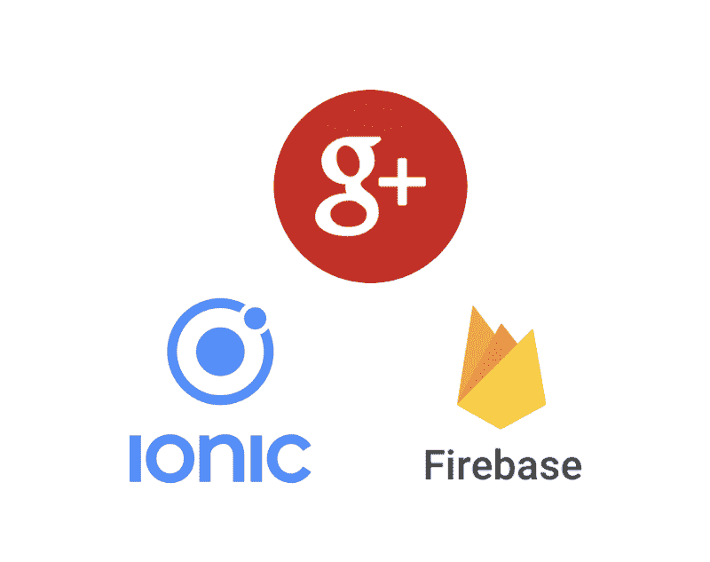
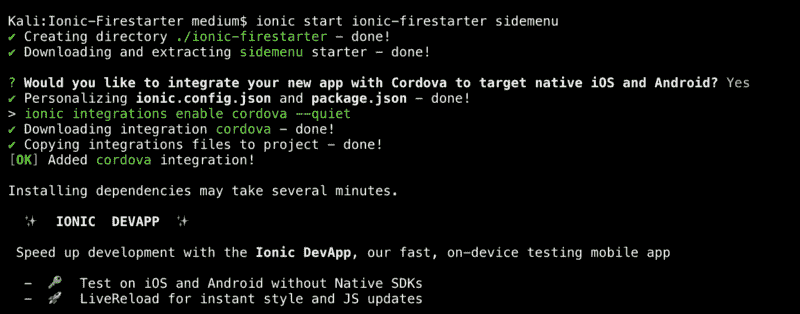
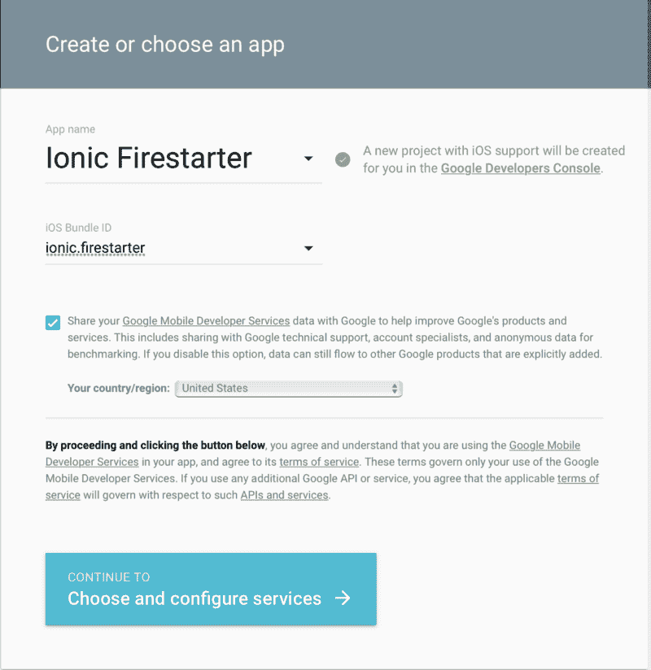
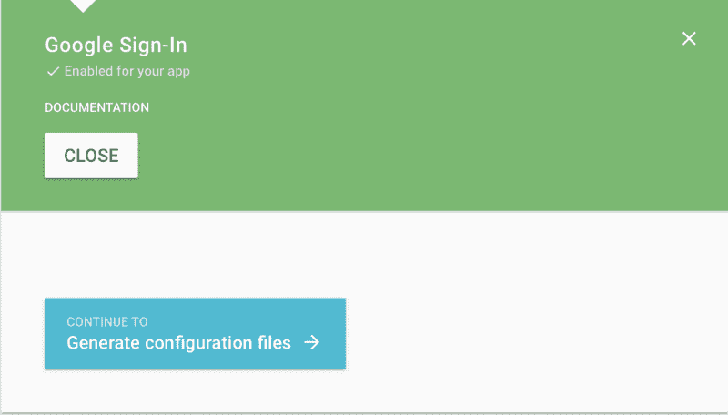
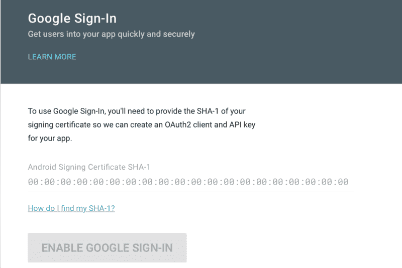

# 如何使用 Firebase 将 Google Login 集成到 Ionic 应用程序中

> 原文：<https://www.freecodecamp.org/news/how-to-integrate-google-login-into-an-ionic-app-with-firebase-41cb69234919/>

瑞安·戈登

# 如何使用 Firebase 将 Google Login 集成到 Ionic 应用程序中



如今，很多应用程序都需要维护某种形式的用户认证。这有助于用户管理他们的帐户并安全地存储他们的信息。但是对于一些用户来说，创建帐户可能是一种糟糕的体验。有些人不想在某个网站上拥有另一个帐户，因为他们必须记住另一个密码，因为他们的叔叔米克建议永远不要使用同一个密码。

为了提高这些用户的 UX，实现一种使用他们已经拥有的帐户(如 Google、脸书或 Github)登录的方法是很有帮助的。

OAuth 是我们实现这一目标的途径。这些提供者中的每一个和许多其他提供者都提供 OAuth 认证，我们可以使用这些认证用他们现有的信息来登录这些用户。此外，如果用户喜欢登录多个提供商，我们可以将一个用户帐户链接到一个或多个提供商。这意味着用户可以登录谷歌或脸书，仍然可以访问我们系统中的同一个帐户。

**是不是只要代码而不跟帖？查看一下[回购](https://github.com/Ryan-Gordon/Ionic-Firestarter)(如果你觉得有帮助，给它一颗星)！**

要完成本教程，您需要安装 Node.js 和 Ionic。

### 入门指南

要安装 Ionic 和 Cordova(目前插件需要它)，在安装 Node 后在终端中运行以下命令:

```
npm install -g ionic cordova
```

> 如果您得到 EACCES: permission denied，您可能需要使用 sudo？



用 Ionic 创建 app，启动<appname><template></template></appname>

Google signin 的代码将被放入一个 provider 类中，该类将被任何需要使用该 signin 方法的页面调用。

```
ionic g provider auth
```

### 使用 Firebase 设置应用程序并获取凭据

为了让 firebase 能够与原生 Android 和 iOS 平台一起工作，我们需要为该应用程序做两种配置，每种配置都略有不同。

对于每台设备，我们需要配置谷歌登录 API。

#### ios



对于 iOS 设置，您需要提供捆绑包 ID。这是 config.xml 中的值，通常设置为 io.ionic.starter。根据您的喜好将其更改为任何值，然后这将是您的包 ID。

确保不要将其保留为默认值。

设置完成后，您将获得一个 GoogleService-Info.plist，将该文件保存到 Ionic 项目文件夹的根目录下。完成这些步骤后，您就大功告成了！至少对于 iOS 来说是这样..

现在，您应该看到下面的 UI，并且已经下载了 Plist 文件，可以使用了。



#### 机器人

将 Google sign 添加到 Android 平台的过程几乎是相同的，但有一个额外的要求。首先，点击[链接](https://developers.google.com/mobile/add?platform=android&cntapi=signin)，开始创建你的 Android 应用。

> 需要注意的是，为了构建 Android(以及使用该插件)，你需要安装 Android 构建工具版本 19.1.0 或更高版本。

#### 获取钥匙？

一旦安装了构建工具，并且您已经确认了这一点，密钥库应该可以获得我们在 Android 过程中需要的 SHA-1 值。密钥库用于保存您为构建的应用程序使用的签名密钥。

在终端中运行此命令以获取所需的 SHA-1 值:

```
keytool -exportcert -list -v -alias androiddebugkey -keystore ~/.android/debug.keystore
```

> ***重要提示*** *:这与您将应用程序投入生产时使用的密钥库不同。在这一点上停下来，思考一下——你会发布这个吗？如果是这样的话，使用 release 密钥库可能是明智的。*



在这一步之后，点击[链接](https://developers.google.com/mobile/add?platform=android&cntapi=signin)，添加你的 Android 项目。

再次确保您已经更改了项目的 config.xml 'id '值，使它不再是`io.ionic.starter`。

它将询问我们从终端得到的 SHA-1 值。输入它，你就可以选择下载一个 google-services.json 文件。下载该文件，并将其保存到项目的根目录下。保管好它！

### 将 Google 登录安装到您的代码库中

Ionic 的好处之一是它的文档。它有大部分插件和组件的文档。Ionic [的谷歌登录文档可以在这里找到。](https://ionicframework.com/docs/native/google-plus/)

在终端中运行这些命令，将插件添加到项目中。

```
$ ionic cordova plugin add cordova-plugin-googleplus --variable REVERSED_CLIENT_ID=myreversedclientid
$ npm install --save @ionic-native/google-plus
```

在这个阶段，您已经配置了 iOS 和 Android Google 登录 API。您已经安装了两个配置文件(每个平台一个)和两个插件，可以使用了。

### 配置 Firebase

Firebase 将会是像 Google plus 一样的 OAuth 登录的主机。在项目中使用它之前，您需要在 Firebase 中设置项目。如果你以前从未这样做过，请点击[阅读这篇关于](https://medium.com/@ryangordon210/adding-firebase-and-angular-fire-to-an-ionic-project-23ca243b79a4)如何设置 Firebase 配置和初始化 Firebase 本身的文章。

至少，您需要安装这些软件包:

```
npm install angularfire2 firebase
```

#### 使用插件

第一步是设置一个侦听器，它将对事件做出反应，比如当用户登录或注销时。如果发生登录事件，用户对象将包含该用户的凭证，如他们的姓名和头像图片。

```
//Set up a listener for the when the AuthState changes (Login/Logout) and perform some action.
  firebase.auth().onAuthStateChanged( user => {
    if (user){
      this.userProfile = user;
    } else { 
        this.userProfile = null;
    }
  });
```

[firebaseListener.ts](https://gist.github.com/Ryan-Gordon/736b76f0d0f0711d48722eab3dad0dcd#file-firebaselistener-ts)

这段代码应该在这个项目的 home.ts 的构造函数中，或者在您想要跟踪 AuthState 状态的任何页面中。

#### 谷歌登录代码

你已经走到这一步了。嘟嘟嘟。？。

让用户登录的最后一部分是实际的 Google 认证流程本身。

你需要在设备上测试这个部分，因为 Ionic Native 插件使用 Cordova，这需要在设备上构建。

```
googleLogin(): Promise<any> {
  return new Promise((resolve, reject) => { 
      this.googlePlus.login({
        'webClientId': '5351366995-npuh9q89gaoiagoc4jssqck26gorj7hh.apps.googleusercontent.com',
        'offline': true
      }).then( res => {
              const googleCredential = firebase.auth.GoogleAuthProvider
                  .credential(res.idToken);

              firebase.auth().signInWithCredential(googleCredential)
            .then( response => {
                console.log("Firebase success: " + JSON.stringify(response));
                resolve(response)
            });
      }, err => {
          console.error("Error: ", err)
          reject(err);
      });
    });
    }
```

[googlePlusLogin.ts](https://gist.github.com/Ryan-Gordon/414695174718a689ad2aef7262a243ee#file-googlepluslogin-ts)

我们的目标模式是建立返回承诺的函数。然后，如果需要，我们可以对结果执行一些操作。

如果登录成功，那么我们将从结果中获得一个凭证，并将用户登录到我们的 Firebase。

最后，根据事情的进展，我们要么解决，要么拒绝这个承诺。这将触发。然后还是。调用此函数的任何地方的 catch 子句。

在 home.ts 中，这个 googleLogin 函数可以用一个. then 和。catch 子句，结果将被相应地传递，以防我们需要对它做任何事情。

当登录完成时，将触发 onAuthStateChanged 侦听器，用户信息将在页面上更新。

Google Plus 登录现在连接到 Firebase 并在设备上运行。如果您计划将该应用程序投入生产，如上所述，您需要重做一些事情，并使用不同的密钥库进行发布。

### **结论**

在本文中，我们已经设置了 Google 登录 API，并通过一个跨平台的解决方案让用户使用 Google Plus 登录我们的 Firebase。

尽管谷歌开发者控制台和 Firebase 之间需要大量的配置，但好处是我们的用户现在可以用他们现有的谷歌账户登录我们构建的任何网络应用。

这篇文章是我计划为 Firebase / Ionic 登录写的第一篇文章。

如果你想访问代码，这里也有一个回购的链接:

[**Ryan-Gordon/Ionic-Firestarter**](https://github.com/Ryan-Gordon/Ionic-Firestarter)
[*Ionic-Firestarter-Ionic Firestarter 是一个开源项目，展示了在…*](https://github.com/Ryan-Gordon/Ionic-Firestarter)
[github.com](https://github.com/Ryan-Gordon/Ionic-Firestarter)实现的不同 Firebase 特性

想在爱奥尼亚上找一些类似的帖子吗？这里是我完成的其他几个帖子:

[**如何动态主题化你的 Ionic 应用程序并让你的用户开心**
*为你的移动应用程序设计一个时尚的配色方案可能很耗时。为什么不让用户自己选择…*](https://www.freecodecamp.org/news/how-to-dynamically-theme-your-ionic-application-and-make-your-users-happy-ffa17e15dbf7/)

[**用离子型**](https://medium.com/@ryangordon210/alternative-sign-in-methods-for-firebase-with-ionic-52714ee9be83)
[*替代 Firebase 的登录方法在我关于 Firebase 登录的其他帖子中，有一个焦点放在了社交提供商上。这个重点的要点是……*](https://medium.com/@ryangordon210/alternative-sign-in-methods-for-firebase-with-ionic-52714ee9be83)
[medium.com](https://medium.com/@ryangordon210/alternative-sign-in-methods-for-firebase-with-ionic-52714ee9be83)