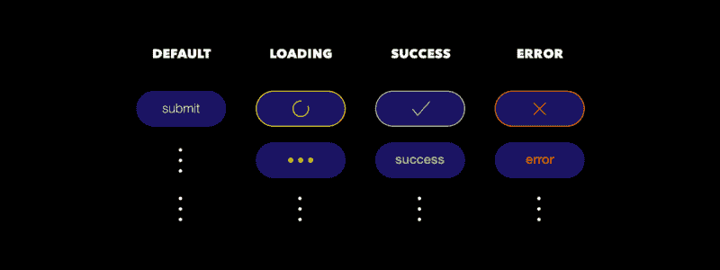
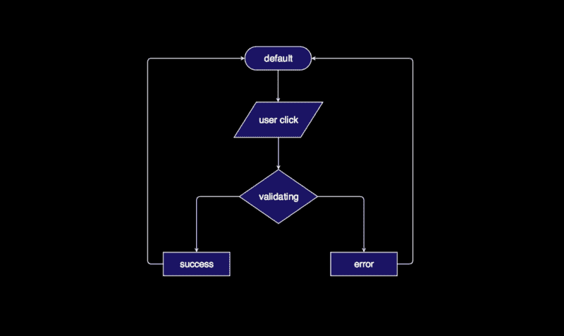
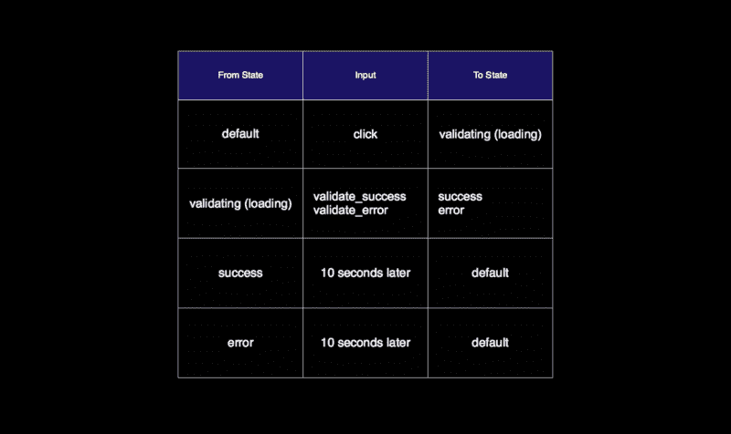
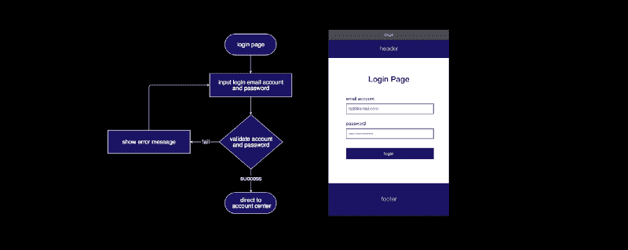
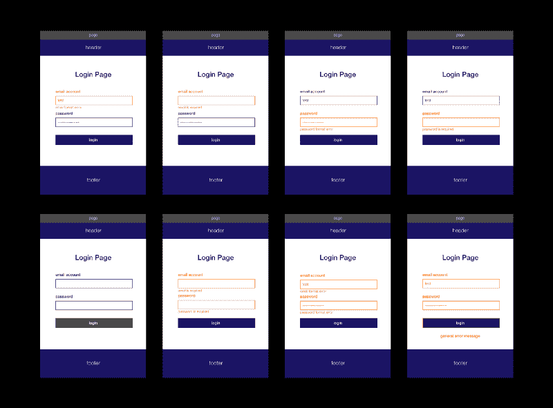
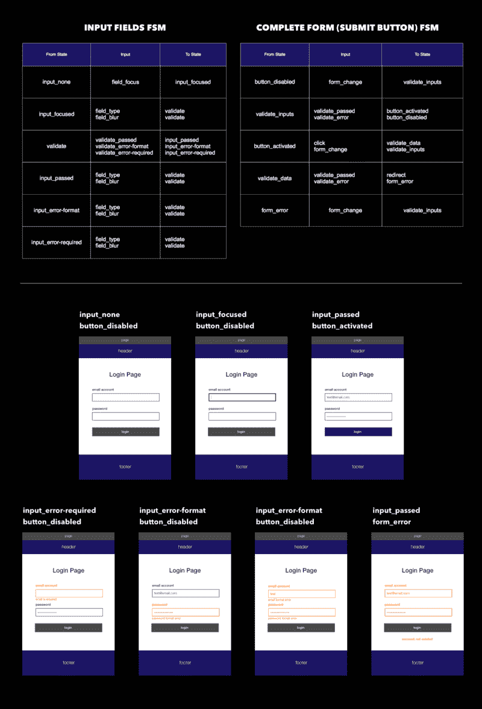
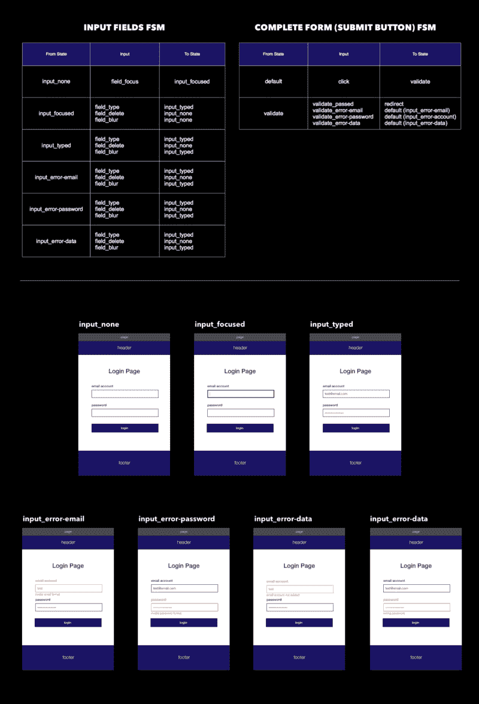
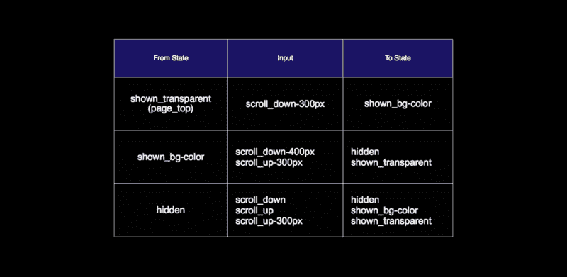

# 如何使用 FSM 表设计 UI 状态并与开发人员交流

> 原文：<https://www.freecodecamp.org/news/designing-ui-states-and-communicate-with-developers-effectively-by-fsm-fb420ca53215/>

对于 UI 设计师来说，生活有时会很艰难。当他们开始创造伟大的设计时，他们也开始处理来自客户或项目经理的压力。他们需要考虑用户体验和用户流量。而且他们往往很难找到一种有效的方式与开发者沟通。

为了减轻我的设计伙伴的压力，我想通过引入一种更好的处理 UI 组件状态变化的方法来提供帮助。我相信这是设计师面临的最大挑战之一。

处理 UI 组件的状态变化是痛苦的。起初，我认为这很难，因为你需要创建不同的视图，这可能会很无聊。但是后来我意识到设计并不是最可怕的部分。相反，缺少状态并告诉开发人员您到底想要什么才是。因此，本文将解决这两个问题。

### 状态和流程图

为了防止设计团队未能准备好必要的状态，[这些](https://medium.com/@mikehlee/designing-for-various-states-823816e49c8d) [五个](http://scotthurff.com/posts/why-your-user-interface-is-awkward-youre-ignoring-the-ui-stack) [状态](https://uxdesign.cc/a-cup-of-coffee-and-states-of-ui-screens-1873f522901e)被提出作为设计者遵循的规范。但是为了准确起见，我想先指出状态和匹配视图之间的区别。

状态实际上是 UI 组件在接收到输入后的输出。一个状态可能需要也可能不需要匹配的视图来与用户交互。

因此，一个 UI 组件只能有[五个状态](https://medium.com/@mikehlee/designing-for-various-states-823816e49c8d)，但是每个状态实际上可以有各种版本的视图。迷茫？让我们来看一个日常使用的提交按钮的例子，我想你会很快理解的。

A submit button usually includes state of default, loading, success and error, and each state could have various views

但是我们怎么知道除了初始状态之外还有其他三个状态呢？而这些状态又是如何相互切换的呢？看流程图更容易理解这个问题。

Flowchart is not enough to tell design details

帮助我们管理 UI 状态的方法至关重要。它应该传达组件在接收到某个输入后应该切换到什么状态的信息。但是，尽管流程图在大多数情况下是一个强大的工具，但它对于详细的状态变化并不理想，因为它有以下缺点:

1.  **不便**。它需要借助软件或插件(除了经典的办公或设计软件)来绘制、修改或维护图表。而且很大。
2.  **不精确**。很难判断哪些状态需要视图，哪些输入切换了状态。
3.  **复杂程度**。在选择正确的符号和颜色时，需要格外注意。

总而言之，使用流程图来管理 UI 组件的状态是低效且不准确的。我相信大多数设计师都会同意。所以，我现在要提出一个更好的方法。

### 有限状态机(FSM)表

FSM table inspired by [Krasimir’s FSM introduction](http://krasimirtsonev.com/blog/article/managing-state-in-javascript-with-state-machines-stent)

设计师们，不要被这个听起来很科技的名字吓坏了！让我来分解一下。

#### 什么是有限状态机？

有限状态机(FSM)是一种组织所有可能状态和输入的抽象机器。这种方法通常应用于编程和各种设备。看一看[维基百科](https://en.wikipedia.org/wiki/Finite-state_machine)中举例说明的十字转门的有限状态机例子，你马上就会有更好的想法。

同样，FSM 只是状态和输入的集合。就这么简单。让我们更深入地了解一下这张桌子的用法，体验一下它的威力。

#### 如何使用 FSM 表

表格中有三列:**从状态**、**输入**、**到状态**。

在来自状态的列**中，每个单元格代表组件可能具有的一种状态。**

**Input** 列包含了表中最重要的信息:在每个状态下可以执行哪些有限的动作或接收哪些输入。

最后，**到状态**列实际上是根据相应输入的输出状态。

#### 为什么这样更好？

这张表清楚地列出了三件事:

*   所有可能的状态
*   每个动作什么时候可以完成
*   完成某个动作的结果

与流程图、文本注释或交互式原型相比，我相信大多数开发人员会很高兴收到这个表格。它几乎涵盖了一个开发者需要的所有信息！

除了降低沟通成本，FSM 表还鼓励一种心态。它有助于在原因和结果之间建立清晰的联系，防止你在没有合理逻辑支持的情况下做出决定。

### 更好的团队沟通

现在，在简要介绍了 FSM 表之后，让我们考虑一个更实际、更复杂的例子，这样我们就可以真正看到它的威力。让我们看一个登录页面。

Flowchart and wireframe of authentication page

该页面包含一个标题、一个主标题、一个带有两个输入字段的表单组和一个提交按钮。为了获得认证功能的概述，我们仍然需要一个清晰的流程图。但是由于上述的缺点，它不能表达组件的详细变化。

例如，如果用户单击提交按钮，验证失败，我们会得到一条错误消息——我们从流程图中得到这条信息。但是，当用户试图聚焦、模糊或点击每个输入字段时，具体的输入验证消息是什么呢？输入验证函数应该在什么时候初始化？在用户在表单中的输入被验证之前，提交按钮应该被锁定吗？

There’re lots of conditions to consider

这些都是可能影响用户体验的细节决定，它们不应该被忽略。但是作为一名设计师，你如何告诉开发者你到底在想什么呢？交互式原型、笔记列表和面对面的会议都是无效的。

但是通过准备一个 FSM 表，事情立刻变得非常清楚。您甚至可以根据不同的用户体验问题快速准备多个版本。

如果您希望在正确完成所有输入字段之前禁用提交按钮，则该表如下所示:

Authenticate form FSM — version disabled

或者，如果你遵循[谷歌的材料设计指南](https://material.io/design/components/text-fields.html#usage)，那么表格看起来是这样的:

Authenticate form FSM — version Material Design

这难道不简单、快速、清晰吗？我认为这比其他方法好得多！

此外，FSM 表还可以处理与数据处理无关的组件。比方说，设计师希望标题的行为像这个美丽的网站一样。FSM 表可以帮助提供每个状态的阈值和视图。

Header FSM Table

就是这样！恭喜你完成了一个简单易懂的认证页面文档，结合了线框、流程图和 FSM 表！

#### 最后一点

在一个大公司里，有专门的团队在一个产品上密切合作，设计者可能不需要考虑状态管理问题。我从来没有加入过这种团队。总的来说，我认为大多数 UI 设计师仍然需要与开发人员、经理或其他设计师就职业生涯中的状态转换进行沟通。

我真诚地希望 FSM 表能够帮助设计师减少处理沟通障碍的宝贵时间资源，甚至帮助他们发现一种新的思维方式。

最后，如果你对此有什么想法，请告诉我！

* * *

[中文版](https://medium.com/@mingpushao/better-way-of-designing-ui-states-chinese-a5c43e46d391) ( [中文版連結)](https://medium.com/@mingpushao/better-way-of-designing-ui-states-chinese-a5c43e46d391) /阅读更多我在 vinceshao.com[的作品](https://www.vinceshao.com/blog/how-to-design-ui-states-and-communicate-with-developers-using-fsm-table/)