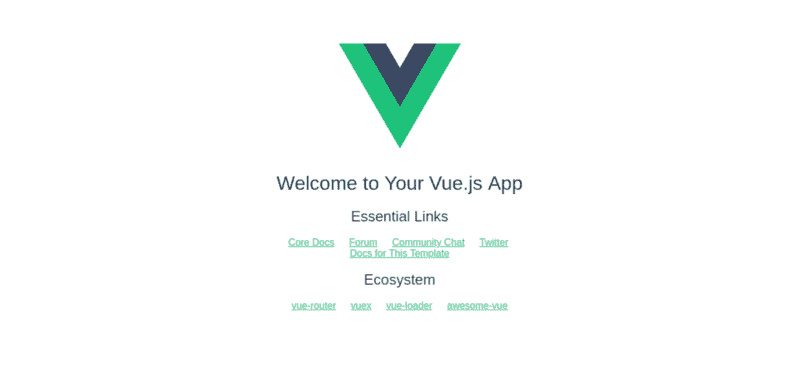
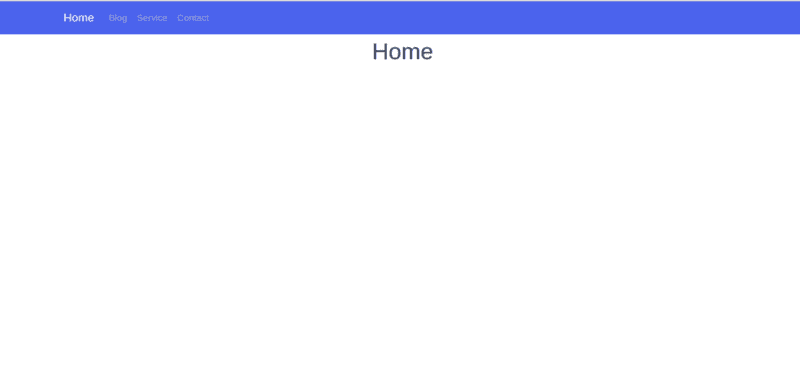
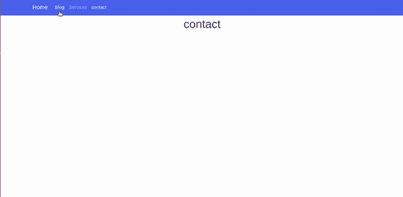
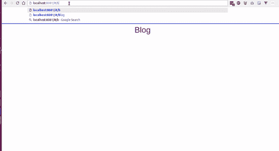
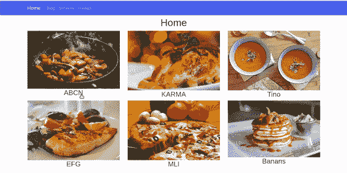
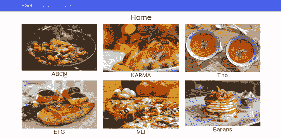
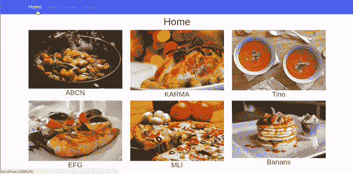

# 如何使用 Vue.js 中的路由创建更好的用户体验

> 原文：<https://www.freecodecamp.org/news/how-to-use-routing-in-vue-js-to-create-a-better-user-experience-98d225bbcdd9/>

Vue.js 是由[尤雨溪](https://twitter.com/youyuxi)创建的一个伟大的 JavaScript 框架。它用于构建单个网页应用程序和灵活的组件，是前端 web 开发中最需要的技能之一。你可以在这里了解更多关于 Vue.js [的信息。](https://vuejs.org/)


Vue.js 提供了一系列特性，允许你构建可重用的 web 组件。路由是这些方法中的一种。它允许用户在页面之间切换，而无需刷新页面。这使得在你的 web 应用程序中导航变得简单和非常好。

因此在本文中，我将通过构建一个 Vue 模板作为示例来解释 Vue.js 路由器是如何工作的。

### 入门指南

因此，让我们通过安装和创建一个新的 [Vue.js](https://www.zeolearn.com/magazine/why-must-you-choose-vuejs-over-reactjs) 项目来开始我们的 Vue.js Route **r** 项目。我们需要安装 Node.js。我们将使用 [vue-cli](https://github.com/vuejs/vue-cli) 生成一个新的 Vue.js 项目。遵循以下给出的步骤:

在终端中键入以下代码并运行:

```
vue init webpack vue-router

//
cd vue-router
//
npm run dev
```

浏览到 [http://localhost:8080](http://localhost:8080)



在文本编辑器中打开应用程序。在 components 文件夹中，打开`HellowWorld.vue`文件并遵循以下步骤:

*   将`HellowWorld.vue`重命名为`home.vue`。删除所有代码，替换为:

```
<template>
  <div class="home">
    <h1>Home</h1>
  </div>
</template>

<script>
export default {
  name: 'home',
  data () {
    return {
      msg: 'Welcome to Your Vue.js App'
    }
  }
}
</script>

<!-- Add "scoped" attribute to limit CSS to this component only -->
<style scoped>

</style>
```

*   转到**路由器**文件夹中的`index.js`，将`HelloWorld`替换为`home`:

```
import Vue from 'vue'
import Router from 'vue-router'
import home from '@/components/home'

Vue.use(Router)

export default new Router({
  routes: [
    {
      path: '/',
      name: 'home',
      component: home
    }
  ]
})
```

`App.vue`文件应该是这样的:

```
<template>
  <div id="app">

    <router-view/>
  </div>
</template>

<script>
export default {
  name: 'App'
}
</script>

<style>
#app {

}
</style>
```

现在让我们写代码吧！

我们现在要添加一个[靴子样本](https://bootswatch.com/)模板。你可以选择任何你喜欢的模板。我会选择 [Cosmo](https://bootswatch.com/cosmo/) 。点击 Ctrl + U 查看代码源代码，只需复制`Navbar`(我们只需要导航条)。将这段代码粘贴到 App.vue 组件中。

我们到了。



接下来，我们将创建另外三个组件:`Blog`、`Services`和`Contact`。

在 components 文件夹中，创建新文件，将其命名为`blog.vue`，并将以下代码放入其中:

```
<template>
 <div class="blog">
  <h1>{{blog}}</h1>
 </div>
</template>
<script>
 export default{
  name:'blog',
  data (){
   return{
    title:'Blog'
   }
  }
 }
</script>

<style scoped>

</style>
```

如果您想对服务和联系组件做同样的事情，您的组件文件夹中必须有这些文件:

*   主视图
*   博客视图
*   服务.视图
*   接触，看到了吗

### 路由器配置

创建完这四个组件后，我们需要配置路由器，以便能够在组件之间导航。

那么，我们如何使用路由器导航到每个组件呢？

我们需要学习路由规则。现在，我们必须在路由器文件夹内做一些修改，所以打开`index.js`



请遵循以下步骤:

*   首先将组件导入 index.js，使用`import`方法导入所有组件。

```
import home from '@/components/home'
import blog from '@/components/blog'
import services from '@/components/services'
import contact from '@/components/contact'
```

*   从[Vue-路由器](https://router.vuejs.org)模块第二次导入 Vue 和路由器模块:

```
import Vue from 'vue'
import Router from 'vue-router'

// use router
Vue.use(Router)
```

如果您已经安装了 Vue 和 vue-cli，您将默认导入 [vue-router](https://router.vuejs.org/) 模块。

*   最后，在路由器文件夹中，我们必须配置路由器以使它们工作。router 方法接受一个对象数组，该数组又接受每个组件的属性:

```
export default new Router({
  routes: [
    {
      path: '/',
      name: 'home',
      component: home
    },
    {
      path: '/blog',
      name: 'blog',
      component: blog
    },
    {
      path: '/services',
      name: 'services',
      component: services
    },
    {
      path: '/contact',
      name: 'contact',
      component: contact
    }
  ]
})
```

*   `path`:组件的路径
*   `name`:组件的名称
*   `component`:组件的视图

要使任何组件成为默认组件，请将斜杠('/')设置为 path 属性:

```
path:'/'
```

在我们的示例中，我们将主页设置为默认页面。现在，当您在浏览器中打开项目时，将出现的第一个页面是主页。

```
{
  path:'/',
  name:'home',
  component:home
}
```

vue 路由器具有更高级的参数和方法，但是我们现在不打算进入这一部分。

这是可用于 vue-router 的属性和方法列表:

*   [嵌套路由器](https://router.vuejs.org/en/essentials/nested-routes.html)
*   [命名视图](https://router.vuejs.org/en/essentials/named-views.html)
*   [重定向和别名](https://router.vuejs.org/en/essentials/redirect-and-alias.html)
*   [导航护栏](https://router.vuejs.org/en/advanced/navigation-guards.html)
*   [路由器实例](https://router.vuejs.org/en/api/router-instance.html)

现在，您可以通过键入组件的名称来浏览任何组件！



### 路由器链接

现在，我们将通过使用路由器链接元素创建的导航栏来设置导航。

为此，我们应该更换`<`/a>eleme`nt by <router-link>&l`t；/路由器/链接>这样:

```
<li class="nav-item">
  <router-link class="nav-link" to="/blog">Blog</router-link>
</li>
<li class="nav-item">
  <router-link class="nav-link" to="/services">Services</router-link>
 </li>
<li class="nav-item">
   <router-link class="nav-link" to="/contact">contact</router-link>
 </li>
```

router-link 接受将组件路径作为值的`to='path'`属性。

### 路由器视图

你会发现`<router-vi` ew > tag i `n the A` pp.vue 文件。它基本上是组件呈现的视图。它就像包含所有组件的主 div，它返回与当前路由匹配的组件。当我们使用动画过渡时，我们将在下一部分讨论 T2。

### 使用路由器内部的参数

此时，我们将使用参数导航到特定的组件。这些参数使得路由是动态的。

为了使用参数，我们将创建一个产品列表和一个数据数组。当您点击任何产品的链接时，它会通过一个参数将我们带到页面详细信息。

在这种情况下，我们不打算使用数据库或 API 来检索产品数据。因此，我们要做的是创建一系列产品，作为数据库。

在`home.vue`组件中，将数组放在 data()方法中，如下所示:

```
export default {
  name: 'home',
  data () {
    return {
      title: 'Home',
      products:[
      {
        productTitle:"ABCN",
        image       : require('../assets/images/product1.png'),
        productId:1
      },
      {
        productTitle:"KARMA",
        image       : require('../assets/images/product2.png'),
        productId:2
      },
      {
        productTitle:"Tino",
        image       : require('../assets/images/product3.png'),
        productId:3
      },
      {
        productTitle:"EFG",
        image       : require('../assets/images/product4.png'),
        productId:4
      },
      {
        productTitle:"MLI",
        image       : require('../assets/images/product5.png'),
        productId:5
      },
      {
        productTitle:"Banans",
        image       : require('../assets/images/product6.png'),
        productId:6
      }
      ]
    }
  }
}
```

然后使用`v-for`指令提取并循环到产品数组中。

```
<div class="row">
      <div class="col-md-4 col-lg4" v-for="(data,index) in products" :key="index">
        
         <h3>{{data.productTitle}}</h3>
      </div>
    </div>
```

结果是:


为了导航到细节组件，我们首先必须添加一个点击事件:

```
<h3 @click="goTodetail()" >{{data.productTitle}}</h3>
```

然后添加方法:

```
methods:{
  goTodetail() {
    this.$router.push({name:'details'})
  }
```

如果您单击标题，它将返回 undefined，因为我们还没有创建细节组件。所以让我们创建一个:

详细信息。视图

```
<template>
 <div class="details">
  <div class="container">
   <h1 class="text-primary text-center">{{title}}</h1>
  </div>
 </div>
</template>
<script>
 export default{
  name:'details',
  data(){
   return{
    title:"details"
   }
  }
 }
</script>
```

现在我们可以导航而不出错了？


现在，如果我们没有数据库，我们如何浏览到详细信息页面并获得匹配的数据？

我们将在细节组件中使用相同的产品数组。所以我们可以匹配来自 URL 的 id:

```
products:[
      {
        productTitle:"ABCN",
        image       : require('../assets/images/product1.png'),
        productId:1
      },
      {
        productTitle:"KARMA",
        image       : require('../assets/images/product2.png'),
        productId:2
      },
      {
        productTitle:"Tino",
        image       : require('../assets/images/product3.png'),
        productId:3
      },
      {
        productTitle:"EFG",
        image       : require('../assets/images/product4.png'),
        productId:4
      },
      {
        productTitle:"MLI",
        image       : require('../assets/images/product5.png'),
        productId:5
      },
      {
        productTitle:"Banans",
        image       : require('../assets/images/product6.png'),
        productId:6
      }
      ]
```

首先，我们必须将 goTodetail()方法的 id 设置为一个参数:

```
<h3 @click="goTodetail(data.productId)" >{{data.productTitle}}</h3>
```

然后向路由器方法添加第二个参数。

`$router`方法有两个参数:第一，我们要导航到的组件的`name`，第二，`id`参数(或任何其他参数)。

```
this.$router.push({name:'details',params:{Pid:proId}})
```

将 Pid 作为参数添加到`router`文件夹内的 **index.js** 中:

```
{
      path: '/details/:Pid',
      name: 'details',
      component: details
    }
```

家。视图

```
methods:{
  goTodetail(prodId) {
    this.$router.push({name:'details',params:{Pid:proId}})
  }
  }
```



要获取匹配的参数，请使用这行代码:

```
this.$route.params.Pid
```

详细信息。视图

```
<h2>the product id is :{{this.$route.params.Pid}}</h2>
```

然后遍历`detalils.vue`中的产品数组，检查与参数 Pid 匹配的对象并返回其数据:

```
<div class="col-md-12" v-for="(product,index) in products" :key="index">
     <div v-if="proId == product.productId">
      <h1>{{product.productTitle}}</h1>
      
     </div>
    </div>

///
export default{
  name:'details',
  data(){
   return{
    proId:this.$route.params.Pid,
    title:"details"
     }
}
```

你现在可以看到，当我们点击任何产品的链接，它会把我们带到该产品！



**detail.vue** 组件:

```
<template>
 <div class="details">
  <div class="container">
   <div class="row">
    <div class="col-md-12" v-for="(product,index) in products" :key="index">
     <div v-if="proId == product.productId">
      <h1>{{product.productTitle}}</h1>
      
     </div>
    </div>
   </div>
  </div>
 </div>
</template>
<script>
 export default{
  name:'details',
  data(){
   return{
    proId:this.$route.params.Pid,
    title:"details",
    products:[
    {
    productTitle:"ABCN",
    image       : require('../assets/images/product1.png'),
    productId:1
    },
    {
    productTitle:"KARMA",
    image       : require('../assets/images/product2.png'),
    productId:2
    },
    {
    productTitle:"Tino",
    image       : require('../assets/images/product3.png'),
    productId:3
    },
    {
    productTitle:"EFG",
    image       : require('../assets/images/product4.png'),
    productId:4
    },
    {
    productTitle:"MLI",
    image       : require('../assets/images/product5.png'),
    productId:5
    },
    {
    productTitle:"Banans",
    image       : require('../assets/images/product6.png'),
    productId:6
    }
    ]

   }
  }
 }
</script>
```

### 转变



在这一部分，我们将添加一个动画过渡到动画组件。我们将制作组件转换的动画。它让导航变得很棒，并且创造了更好的 UX 和用户界面。

要制作动画过渡，将“<router-view>”放在“<transition>”标签内，并给它一个 class 名称。</transition></router-view>

**app . view**

```
<transition name="moveInUp">
         <router-view/>
  </transition>
```

当组件进入视图时，要动画显示组件的过渡，将`enter-active` 添加到过渡标签的名称中。然后添加`leave-active` 然后给它 CSS 转场属性就这样:

```
.moveInUp-enter-active{
  opacity: 0;
  transition: opacity 1s ease-in;
}
```

#### **使用 CSS3 动画**

现在我们将在 CSS3 中使用@关键帧制作动画。

当组件进入视图时，给视图添加一个渐变效果。

```
.moveInUp-enter-active{
  animation: fadeIn 1s ease-in;
}
@keyframes fadeIn{
  0%{
    opacity: 0;
  }
  50%{
    opacity: 0.5;
  }
  100%{
    opacity: 1;
  }
}
```


当组件离开视图时，添加另一个淡入淡出效果。

现在我们要让组件在离开视图时向上移动。

```
.moveInUp-leave-active{
  animation: moveInUp .3s ease-in;
}
@keyframes moveInUp{
 0%{
  transform: translateY(0);
 }
  100%{
  transform: translateY(-400px);
 }
}
```


现在，您可以为组件创建自己的动画和过渡。

就这样——我们结束了！？

这里 **可以下载源代码 [**。**](https://github.com/hayanisaid/Vue-router)**

### 包扎

Vue.js 中的 Routing 使你的应用程序在导航方面非常出色。它赋予了单页 web 应用程序活力，并创造了更好的用户体验。

顺便说一下…

如果你想学习 Bootstrap 4，请使用此 [**推荐链接**](https://skl.sh/2ssg1nj) 在 Skillshare 上查看我的课程，并获得 2 个月免费访问 20，000 门课程的机会。

[*原载 zeolearn.com*](https://www.zeolearn.com/magazine/understand-routing-in-vuejs-with-examples)

> 订阅此[邮件列表](http://eepurl.com/dk9OJL)以了解更多关于前端主题的信息，并在 [Twitter](https://twitter.com/hayanisaid1995) 上关注我。