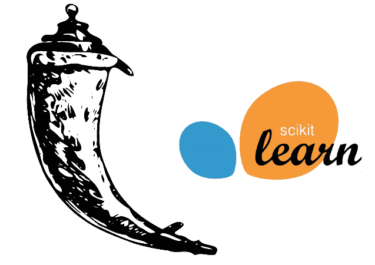
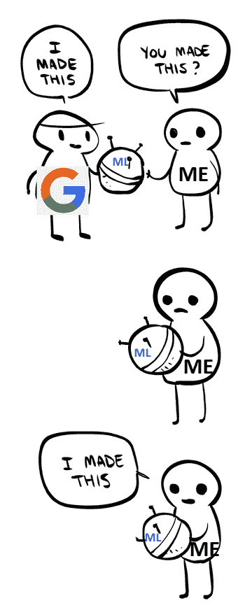
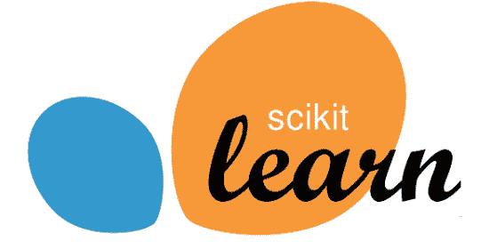
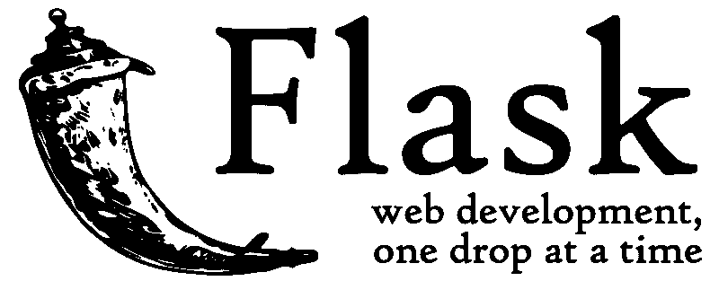

# 使用 Python 训练和部署机器学习模型的初学者指南

> 原文：<https://www.freecodecamp.org/news/a-beginners-guide-to-training-and-deploying-machine-learning-models-using-python-48a313502e5a/>

作者伊万·杨

# 使用 Python 训练和部署机器学习模型的初学者指南

当我第一次接触机器学习时，我不知道我在读什么。我读过的所有文章都是怪异的术语和疯狂的方程式。我怎么能搞清楚这一切？

我在 Chrome 中打开了一个新标签，寻找更简单的解决方案。我从亚马逊、微软和谷歌找到了为我做所有机器学习的 API。我做的每个黑客马拉松项目都会调用他们的服务器，哇——看起来真聪明！我被迷住了。

但是，一年后，我意识到我没有学到任何东西。我所做的一切都被我修改过的 Nedroid 漫画描述了:

[Original image source](https://nedroidcomics.tumblr.com/post/41879001445/the-internet).

最终，我坐下来学习如何在没有大公司的情况下使用机器学习。结果是，任何人都可以做到。我们目前在 Python 中拥有的库是惊人的。在本文中，我将解释如何使用这些库来创建一个合适的机器学习后端。

### 获取数据集

机器学习项目依赖于找到好的数据集。如果数据集不好，或者太小，我们就无法做出准确的预测。你可以在 [Kaggle](http://kaggle.com) 或者[加州大学欧文分校机器学习库](https://archive.ics.uci.edu/ml/index.php)找到一些好的数据集。

在本文中，我使用了一个具有许多特征和一个标签的葡萄酒质量数据集。**特征**是自变量，它影响被称为**标签**的因变量。在这种情况下，我们有一个**标签**列——葡萄酒质量——它受所有其他列(pH、密度、酸度等特征)的影响。

在下面的 Python 代码中，我使用一个名为 [pandas](https://pandas.pydata.org/) 的库来控制我的数据集。pandas 为数据集提供了许多选择和操作数据的功能。

首先，我将数据集加载到熊猫上，并将其分为标签和要素。然后，我通过名称(质量)获取标签列，然后放下该列以获取所有特性。

Scikits-learn, the library we will use for machine learning

### 训练模型

机器学习通过找到标签和其特征之间的关系来工作。我们通过向一个对象(我们的模型)展示我们数据集中的一系列例子来做到这一点。每个示例都有助于定义每个特征如何影响标签。我们称这个过程为**训练我们的模型**。

我使用来自 [Scikit-learn](http://scikit-learn.org/stable/index.html) 库中的 estimator 对象进行简单的机器学习。**估计器**是通过预定义算法创建关系的空模型。

对于这个葡萄酒数据集，我通过线性回归估计器创建了一个模型。(线性回归试图通过我们的数据集绘制最佳拟合直线。)模型能够通过拟合函数获得回归数据。我可以通过 predict 函数传入一组伪特征来使用该模型。下面的例子显示了一种假酒的特征。该模型将基于其训练输出答案。

这个模型和假酒的代码如下:

### 导入和导出我们的 Python 模型

[pickle](https://docs.python.org/2/library/pickle.html) 库使得将模型序列化到我创建的文件中变得容易。我还可以将模型加载回我的代码中。这允许我将模型训练代码与部署模型的代码分开。

我可以使用下面的代码导入或导出我的 Python 模型，以便在其他 Python 脚本中使用:

### 创建简单的 web 服务器

Flask, the framework we will use to create a web server.

为了部署我的模型，我首先必须创建一个服务器。服务器监听 web 流量，并在发现发给它们的请求时运行功能。运行的函数可以依赖于请求的路由和它拥有的其他数据。之后，服务器可以向请求者发回确认消息。

Python 框架允许我在创纪录的时间内创建 web 服务器。

在下面的代码中，我使用 Flask 运行一个简单的单向 web 服务器。我的 one route 监听 POST 请求并发回一个 hello。POST 请求是一种特殊类型的请求，在 JSON 对象中携带数据。

### 将模型添加到我的服务器

通过 pickle 库，我能够将我们训练好的模型加载到我的 web 服务器上。

我们的服务器现在在其初始化期间加载训练好的模型。我可以通过向我的“/echo”路由发送 post 请求来访问它。该路径从请求体中获取一组特征，并将其提供给模型。然后，模型的预测被发送回请求者。

### 结论

看完这篇文章，你应该可以创建自己的机器学习后端了。要了解更多细节，你可以找到我在[这个](https://github.com/iYung/sklearn-flask-example)仓库做的一个完整的例子。

当你有时间时，我建议从编码和阅读机器学习的角度退一步。本文只讲述了创建模型的基本要求。有一些你需要知道的话题，比如减少损失和神经网络。

祝你好运，编码快乐！