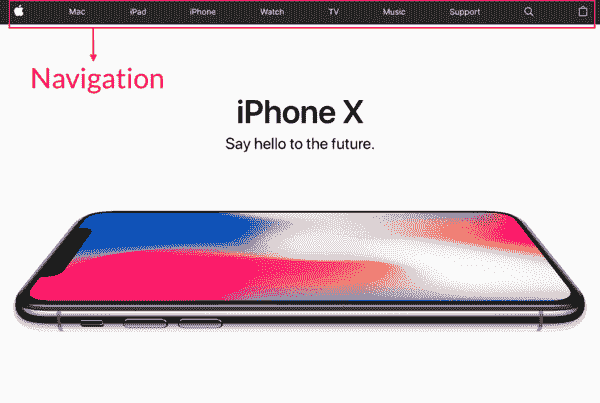
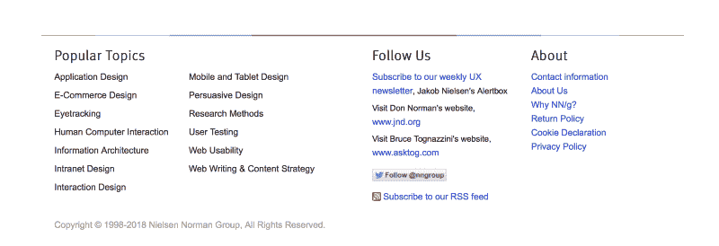
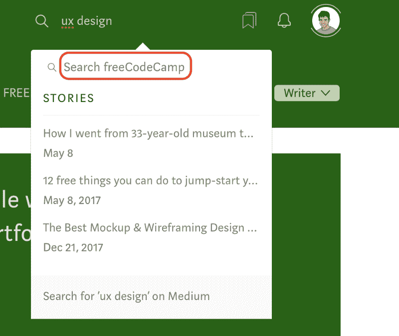
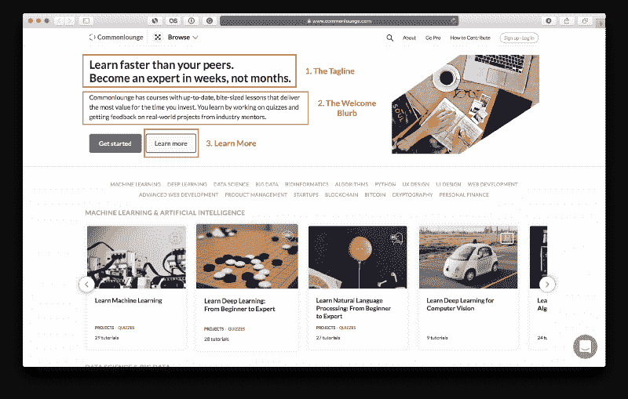
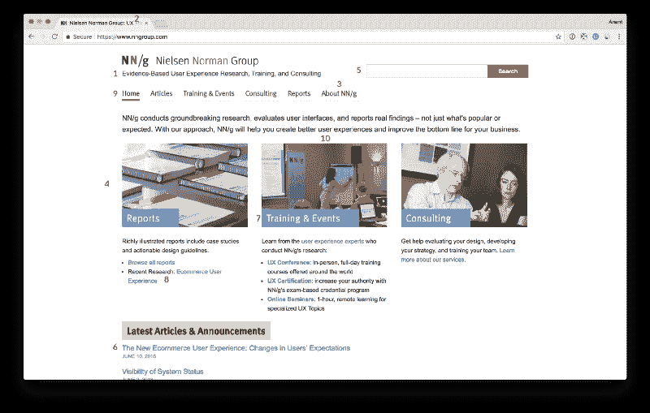

# 掌握基本知识:如何设计网站的导航、搜索和主页

> 原文：<https://www.freecodecamp.org/news/get-the-basics-right-how-to-design-your-sites-navigation-search-and-homepage-adeb57a881f4/>

由先锋耆那教

# 掌握基本知识:如何设计网站的导航、搜索和主页

#### 7 分钟指南，让这三个基本组件恰到好处。

Source: [Galymzhan Abdugalimov](https://unsplash.com/@naffiq?utm_source=medium&utm_medium=referral) on [Unsplash](https://unsplash.com?utm_source=medium&utm_medium=referral)

如果你想从五金店买一把新锤子，想象一下你会怎么做:

*   **选项 1:** 你可以在商店里逛逛——有一些过道，上面写着部门名称，在一个部门内，每个过道的尽头都有标志。
*   选择二:你可以找到最近的店员，问他们锤子放在哪里。

也可能是两者的混合——你可以试着浏览一下，看看有多简单。如果你没有找到你要找的东西，你可以问店员。

如果你仔细想想，这也正是我们使用网站的方式。我们四处寻找(**导航**)，如果找不到我们想要的，我们就点击**搜索**功能。这是你的网站的两个关键组成部分。这里的小可用性缺陷会给你的用户带来很大的困扰。

这个简短的指南部分基于史蒂夫·克鲁格的开创性著作《不要让我思考》，我将教你如何设计网站的导航、搜索和主页。让我们从导航开始。

### 正确导航

#### 为什么我们需要导航？

与我们的五金店例子不同，网站不是一个物理空间。它在三个方面不同于五金店:

1.  一个网站没有给用户提供**尺度**的感觉
2.  一个网站不能给用户提供方向感
3.  一个网站不提供给用户一种**位置**的感觉

当我们想回到网站上的某个东西时，我们不能依赖对它在哪里的物理感觉。相反，我们必须记住它在网站的概念层次结构中的位置，然后追溯我们的步骤。

**导航**将这个**概念层次**放在最前面和中心。理想情况下，它应该是每一页的一部分。它告诉我们网站上有什么以及如何使用它，使它成为你网站用户体验的一个重要部分。

#### 你应该如何设计导航？

持久导航是出现在每页顶部的一组元素。他们遵循一定的惯例，除非我们有充分的理由，否则我们应该遵守这些惯例:

*   左上角的站点 ID 告诉用户他们在哪个站点(上面截图中的苹果标志)。
*   **顶部的部分**——一种浏览网站各个部分的方式，当前部分高亮显示以指示您所在的位置(例如，上面截图中的 Mac、iPad 和 iPhon 部分)。
*   标签(可选)——标签，如果做得好，是不言而喻的，很难错过，而且很流畅。一个活动的标签应该是不同的颜色，并且和它下面的空间相连，这样它就可以“弹出”到前面。
*   **实用程序**，如“我的帐户”、“跟踪您的订单”和“商店”不要放超过五个——其余的可以放在页脚导航中。
*   **面包屑**:这是另一组“你在这里”指示器，就像顶部突出显示的部分。把面包屑放在页面的最顶端，这样不会干扰主导航。最好的方法是使用`&`gt；层次之间，粗体显示最后一个项目(您当前所在的项目，因为您在上面，所以它不应该是链接)。

Breadcrumbs on Best Buy’s product page

*   **一个页面名称:**你在哪个页面？理想情况下，每个网页都应该有一个与点击进入的单词相匹配的名称。它需要突出，并且在正确的位置。在页面的视觉层次结构中，它应该呈现出该页面特有的框架内容。
*   左侧工具条上的**本地导航**(可选):这些是当前级别可用的选项。
*   **页脚导航**:这是所有其他实用程序的位置。

Footer on [NNGroup.com](https://www.nngroup.com)

导航最关键的元素之一是主页链接，通常由站点 ID (logo)提供。如果用户迷路了，就点击它——如果他们想重新开始，就通过它回到起点。

### 让搜索变得简单

那么我们应该如何设计搜索功能呢？很简单，让搜索框成为一个没有选项的简单框，但是允许在结果页面上限制搜索范围。

此外，如果确定搜索范围，添加单词“for”，这样读起来就像一个句子:“Search ___ for ___”下面是一个很好的替代示例，占位符文本表明搜索范围仅限于出版物:

When the search is scoped to just the publication, the search area indicates so.

#### 你怎么知道导航做得好不好？

这里有一个很好的测试，可以在你的朋友身上运行，看看你是否在导航方面做得很好。把它们放在你网站深处的一个随机页面上，确保他们能够快速、毫不犹豫地回答这些问题:

*   这是什么网站？(站点 ID)
*   我在哪一页？
*   这个网站的主要部分是什么？
*   在这个层次上我有什么选择？
*   我在事情的计划中处于什么位置？
*   我该如何搜索？

### 设计主页

对于大多数网站来说，主页是用户登陆的第一页。它也是固定的北极星，如果用户迷路了，可以回到那里。你的主页必须回答这五个问题，这五个问题是每个用户第一次进入网站时都会想到的:

1.  这是什么？
2.  他们这里有什么？
3.  我在这里能做什么？
4.  为什么我应该在这里——而不是别的地方？
5.  我从哪里开始…

…如果我想搜索？

…如果我想浏览？

…如果我想品尝他们最好的东西？

回答这些问题是主页的工作。

在主页上有三个关键的地方，用户期望在那里找到关于网站的明确陈述:

1.  好的标语是清晰的、信息丰富的，并且解释了你的网站或组织是做什么的。它们足够长，但不要太长，传达出差异化——它们听起来不通用。如果他们风度翩翩、活泼且(有时)机智，会有所帮助。
2.  欢迎简介:确保它传达了网站的功能。
3.  **“了解更多”:**创新产品往往需要大量的解释。人们已经习惯于在电脑和移动设备上观看短视频，并且往往愿意在主页上观看一个。

[Commonlounge](https://www.commonlounge.com) Homepage

NN 集团发布了以下[关于主页可用性的 10 条指导方针](https://www.nngroup.com/articles/top-ten-guidelines-for-homepage-usability/)，在你发布之前，这也是一份很好的清单:

1.  包括一句标语
2.  写一个在搜索引擎和书签列表中具有良好可视性的页面标题
3.  将所有公司信息归入一个不同的区域
4.  强调站点的最高优先级任务
5.  包括搜索输入框
6.  展示真实网站内容的例子
7.  以最重要的关键字开始链接名称
8.  提供对最近主页功能的轻松访问
9.  不要过度格式化关键内容，比如导航区域
10.  使用有意义的图形

这是他们自己网站上的列表:

[NNGroup](https://www.nngroup.com) Homepage, implementing most of their guidelines.

请记住，主页是公司内所有部门之间的共享资源——至少在首先显示什么的时候是如此。主页顶部的任何东西都是最容易被推广的，所以作为一个团队，你必须集中精力，决定什么需要出现在顶部。

感谢您阅读本快速指南。这最初是作为 [UX 设计课程](https://www.commonlounge.com/discussion/d8c1c96e92024adf9f496fe41dcaad1a)的一部分发布在[公共休息室](https://www.commonlounge.com/)上的。这是一个平台，有像这样的小型课程，主题从[项目管理](https://www.commonlounge.com/discussion/1013c511951f4c47a803c32c4e1ae0f2)到[机器学习](https://www.commonlounge.com/discussion/35ccdb70826e434a876d612504297232)，为你投入的时间提供最大价值。

你通过参与真实世界的项目并从行业导师那里获得反馈来学习。你应该看看这里的！

