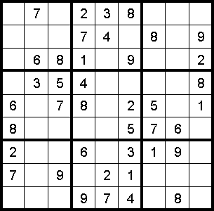
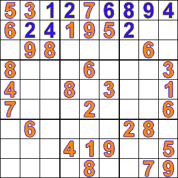

# 我如何回到一个老问题，并最终编写了一个数独求解算法

> 原文：<https://www.freecodecamp.org/news/coming-back-to-old-problems-how-i-finally-wrote-a-sudoku-solving-algorithm-3b371e6c63bd/>

作者:阿里·斯皮特尔

# 我如何回到一个老问题，并最终编写了一个数独求解算法


Photo by [Mike Wilson](https://unsplash.com/photos/vAqmcvSMWMU?utm_source=unsplash&utm_medium=referral&utm_content=creditCopyText) on [Unsplash](https://unsplash.com/search/photos/success?utm_source=unsplash&utm_medium=referral&utm_content=creditCopyText)

这篇文章部分是技术，部分是个人故事，部分是文化批判。如果您只是为了代码和解释而来，请跳到**初始方法**标题！

这个故事开始于几年前的一个大学计算机科学教室。我有一条非传统的写代码之路——我在大学二年级时随机参加了一个计算机科学班，因为我有额外的学分，我很好奇它是关于什么的。我以为我们会学习如何使用微软 Word 和 Excel——我真的不知道什么是代码。

我的高中绝对没有任何编码课，他们几乎没有正常工作的计算机！我也不玩视频游戏，也不参与传统上引导孩子学习如何编程的活动。所以当我在大学上 Python 课的时候，编码对我来说是全新的。

我一走进教室，他们就让我们在 Idle 中输入 Python 代码，Idle 是 Python 语言自带的文本编辑器。他们打印了代码，让我们输入并运行它——我立刻就被吸引住了。在那堂课的过程中，我用 GUI 创建了一个井字游戏脚本来输入片段和一个 Flappy Bird 克隆体。老实说，这对我来说很容易，我玩得很开心。我很快决定辅修计算机科学，我只想写更多的代码。

下学期，我注册了一门数据结构和算法课程，这是计算机科学序列中的下一门。这门课是用 C++教授的，我不知道，这门课应该是在上课前的一个夏天学完的。很快就很明显，教授们试图利用这门课来过滤学生——第一天大约有 50%的注册学生通过了这一学期。我们甚至把教室从演讲厅改成了休息室。我的骄傲是我留在班上的唯一原因。几乎每节课我都感到完全迷失了。我花了很多个通宵来做项目和准备考试。

有一个问题特别困扰我——我们应该用 C++编写一个程序来解决任何数独问题。同样，我在这项任务上花了无数个小时，试图让代码工作起来。到项目到期时，我的解决方案对一些测试用例有效，但不是所有的。最后我的作业得了 C+——这是我大学成绩最差的一次。

那个学期之后，我放弃了辅修计算机科学的想法，彻底放弃了编程，坚持自己认为擅长的事情——写作和政治。

当然，生活中会发生有趣的事情，我显然又开始编码了，但我花了很长时间才觉得自己是一个称职的程序员。

话虽如此，在我开始编程之旅的几年后，我决定再次尝试实现数独求解算法，以向自己证明我现在可以实现它。代码并不完美，但它将解决几乎任何数独难题。让我们先看看算法，然后再看看实现。

### 数独谜题



如果你以前没有玩过数独游戏，它们是数字游戏，其中每一行、每一列和每一个 3x3 的方块都必须有数字 1-9 出现一次。有许多方法可以解决这些难题，其中许多可以由计算机代替人来复制。通常，当我们使用计算机解决它们时，我们会使用嵌套数组来表示数独板，如下所示:

```
puzzle = [[5, 3, 0, 0, 7, 0, 0, 0, 0],          [6, 0, 0, 1, 9, 5, 0, 0, 0],          [0, 9, 8, 0, 0, 0, 0, 6, 0],          [8, 0, 0, 0, 6, 0, 0, 0, 3],          [4, 0, 0, 8, 0, 3, 0, 0, 1],          [7, 0, 0, 0, 2, 0, 0, 0, 6],          [0, 6, 0, 0, 0, 0, 2, 8, 0],          [0, 0, 0, 4, 1, 9, 0, 0, 5],          [0, 0, 0, 0, 8, 0, 0, 7, 9]]
```

求解后，零将用实际数字填充:

```
solution = [[5, 3, 4, 6, 7, 8, 9, 1, 2],            [6, 7, 2, 1, 9, 5, 3, 4, 8],            [1, 9, 8, 3, 4, 2, 5, 6, 7],            [8, 5, 9, 7, 6, 1, 4, 2, 3],            [4, 2, 6, 8, 5, 3, 7, 9, 1],            [7, 1, 3, 9, 2, 4, 8, 5, 6],            [9, 6, 1, 5, 3, 7, 2, 8, 4],            [2, 8, 7, 4, 1, 9, 6, 3, 5],            [3, 4, 5, 2, 8, 6, 1, 7, 9]]
```

### 最初的方法

因为我不想用不同的谜题编写一个完整的测试套件，所以我用 [CodeWars](https://www.codewars.com/) 上的挑战来测试自己。我尝试的第一个问题是[这个](https://www.codewars.com/kata/sudoku-solver)——所有的谜题都是“简单”的数独，不需要更复杂的算法就能解决。

我决定尝试用我自己的方式来解决数独——我会找到一个空间可能的数字，跟踪它们，如果只有一个可能的数字，就把它插入那个位置。因为这些是更容易的数独，这种方法对这个形很有效，我通过了。

这是我的(未清理的)代码！

```
class SudokuSolver:    def __init__(self, puzzle):        self.puzzle = puzzle        self.box_size = 3
```

```
 def find_possibilities(self, row_number, column_number):        possibilities = set(range(1, 10))        row = self.get_row(row_number)        column = self.get_column(column_number)        box = self.get_box(row_number, column_number)        for item in row + column + box:            if not isinstance(item, list)and item in possibilities:                possibilities.remove(item)        return possibilities
```

```
 def get_row(self, row_number):        return self.puzzle[row_number]
```

```
 def get_column(self, column_number):        return [row[column_number] for row in self.puzzle]
```

```
 def get_box(self, row_number, column_number):        start_y = column_number // 3 * 3        start_x = row_number // 3 * 3        if start_x < 0:            start_x = 0        if start_y < 0:            start_y = 0        box = []        for i in range(start_x, self.box_size + start_x):            box.extend(self.puzzle[i][start_y:start_y+self.box_size])        return box
```

```
 def find_spot(self):        unsolved = True        while unsolved:            unsolved = False            for row_number, row in enumerate(self.puzzle):                for column_number, item in enumerate(row):                    if item == 0:                        unsolved = True                        possibilities = self.find_possibilities(                            row_number, column_number)                        if len(possibilities) == 1:                            self.puzzle[row_number][column_number] = list(possibilities)[                                0]        return self.puzzle
```

```
def sudoku(puzzle):    sudoku = SudokuSolver(puzzle)    return sudoku.find_spot()
```

当然，我也想解决更难的数独难题，所以我决定实现一个更复杂的算法来解决这些难题。

### 该算法

一种解决数独难题的算法是回溯算法。本质上，你一直在空白处尝试数字，直到没有任何数字是可能的，然后你回溯并在前面的位置尝试不同的数字。



Shoutout to Wikipedia for the awesome visualization!

我做的第一件事是继续我的“简单的”数独解算器的方法，根据方块的行、列和框中已经存在的值，为每个方块找到可能的值。我将所有这些值存储在一个列表中，以便在回溯或查找该方块中要使用的值时可以快速引用它们。

接下来，我需要实现将项目放入每个空间的向前移动和向后移动。我在每个非给定的空格上做了标记(所以游戏开始时是零的空格)，这样这些空格就会包含在回溯中，而给定的点不会。然后，我遍历那些未解决的点。我会把可能值列表的第一项放在那个位置，然后移动到下一个未解决的位置。然后我会把这个点的第一个可能值放到它的位置上。如果它与前一个槽的值冲突，那么我将移动到可能值列表中的第二项，然后移动到下一个槽。

该过程将继续，直到给定点没有可能的移动，也就是说，到达了可能值列表的末尾，并且该行、列或框中没有任何值起作用。然后，回溯算法开始发挥作用。

在回溯实现中，代码将返回到最后一个填充的位置，并移动到下一个可能的值，然后再次向前移动。如果在那个点也到达了最后一个可能的值，回溯算法将继续向后移动，直到有一个点可以递增。

一旦到达谜题的终点，每个方格都有正确的数值，谜题就解决了！

### 我的方法

我喜欢面向对象的方法，所以我的解决方案中有两个不同的类:一个用于单元格，一个用于数独板。我的非常不完美的代码看起来像这样:

```
class Cell:    """One individual cell on the Sudoku board"""
```

```
 def __init__(self, column_number, row_number, number, game):        # Whether or not to include the cell in the backtracking        self.solved = True if number > 0 else False        self.number = number  # the current value of the cell        # Which numbers the cell could potentially be        self.possibilities = set(range(1, 10)) if not self.solved else []        self.row = row_number  # the index of the row the cell is in        self.column = column_number  # the index of the column the cell is in        self.current_index = 0  # the index of the current possibility        self.game = game  # the sudoku game the cell belongs to        if not self.solved:  # runs the possibility checker            self.find_possibilities()
```

```
 def check_area(self, area):        """Checks to see if the cell's current value is a valid sudoku move"""        values = [item for item in area if item != 0]        return len(values) == len(set(values))
```

```
 def set_number(self):        """changes the number attribute and also changes the cell's value in the larger puzzle"""        if not self.solved:            self.number = self.possibilities[self.current_index]            self.game.puzzle[self.row][self.column] = self.possibilities[self.current_index]
```

```
 def handle_one_possibility(self):        """If the cell only has one possibility, set the cell to that value and mark it as solved"""        if len(self.possibilities) == 1:            self.solved = True            self.set_number()
```

```
 def find_possibilities(self):        """filter the possible values for the cell"""        for item in self.game.get_row(self.row) + self.game.get_column(self.column) + self.game.get_box(self.row, self.column):            if not isinstance(item, list) and item in self.possibilities:                self.possibilities.remove(item)        self.possibilities = list(self.possibilities)        self.handle_one_possibility()
```

```
 def is_valid(self):        """checks to see if the current number is valid in its row, column, and box"""        for unit in [self.game.get_row(self.row), self.game.get_column(self.column), self.game.get_box(self.row, self.column)]:            if not self.check_area(unit):                return False        return True
```

```
 def increment_value(self):        """move number to the next possibility while the current number is invalid and there are possibilities left"""        while not self.is_valid() and self.current_index < len(self.possibilities) - 1:            self.current_index += 1            self.set_number()
```

```
class SudokuSolver:    """contains logic for solving a sudoku puzzle -- even very difficult ones using a backtracking algorithm"""
```

```
 def __init__(self, puzzle):        self.puzzle = puzzle  # the 2d list of spots on the board        self.solve_puzzle = []  # 1d list of the Cell objects        # the size of the boxes within the puzzle -- 3 for a typical puzzle        self.box_size = int(len(self.puzzle) ** .5)        self.backtrack_coord = 0  # what index the backtracking is currently at
```

```
 def get_row(self, row_number):        """Get the full row from the puzzle based on the row index"""        return self.puzzle[row_number]
```

```
 def get_column(self, column_number):        """Get the full column"""        return [row[column_number] for row in self.puzzle]
```

```
 def find_box_start(self, coordinate):        """Get the start coordinate for the small sudoku box"""        return coordinate // self.box_size * self.box_size
```

```
 def get_box_coordinates(self, row_number, column_number):        """Get the numbers of the small sudoku box"""        return self.find_box_start(column_number), self.find_box_start(row_number)
```

```
 def get_box(self, row_number, column_number):        """Get the small sudoku box for an x and y coordinate"""        start_y, start_x = self.get_box_coordinates(row_number, column_number)        box = []        for i in range(start_x, self.box_size + start_x):            box.extend(self.puzzle[i][start_y:start_y+self.box_size])        return box
```

```
 def initialize_board(self):        """create the Cells for each item in the puzzle and get its possibilities"""        for row_number, row in enumerate(self.puzzle):            for column_number, item in enumerate(row):                self.solve_puzzle.append(                    Cell(column_number, row_number, item, self))
```

```
 def move_forward(self):        """Move forwards to the next cell"""        while self.backtrack_coord < len(self.solve_puzzle) - 1 and self.solve_puzzle[self.backtrack_coord].solved:            self.backtrack_coord += 1
```

```
 def backtrack(self):        """Move forwards to the next cell"""        self.backtrack_coord -= 1        while self.solve_puzzle[self.backtrack_coord].solved:            self.backtrack_coord -= 1
```

```
 def set_cell(self):        """Set the current cell to work on"""        cell = self.solve_puzzle[self.backtrack_coord]        cell.set_number()        return cell
```

```
 def reset_cell(self, cell):        """set a cell back to zero"""        cell.current_index = 0        cell.number = 0        self.puzzle[cell.row][cell.column] = 0
```

```
 def decrement_cell(self, cell):        """runs the backtracking algorithm"""        while cell.current_index == len(cell.possibilities) - 1:            self.reset_cell(cell)            self.backtrack()            cell = self.solve_puzzle[self.backtrack_coord]        cell.current_index += 1
```

```
 def change_cells(self, cell):        """move forwards or backwards based on the validity of a cell"""        if cell.is_valid():            self.backtrack_coord += 1        else:            self.decrement_cell(cell)
```

```
 def solve(self):        """run the other functions necessary for solving the sudoku puzzle"""        self.move_forward()        cell = self.set_cell()        cell.increment_value()        self.change_cells(cell)
```

```
 def run_solve(self):        """runs the solver until we are at the end of the puzzle"""        while self.backtrack_coord <= len(self.solve_puzzle) - 1:            self.solve()
```

```
def solve(puzzle):    solver = SudokuSolver(puzzle)    solver.initialize_board()    solver.run_solve()    return solver.puzzle
```

[难数独解算器](https://www.codewars.com/kata/hard-sudoku-solver)

### 我的外卖

有时候只是需要时间和练习。几年后，我花了无数大学时间研究的数独解算器只花了我不到一个小时。

我要说的是，计算机科学项目并不倾向于以一种允许早期没有编写代码的人参与的方式开始。几年后，计算机科学教育政策可能会改变。但是现在，这排除了那些在小城镇长大的人，那些在成长过程中对编码不感兴趣的人，或者那些上过较弱的高中的人。

在某种程度上，这无疑有助于编码训练营的成功，这些训练营从基础开始，教授较不概念性的 web 开发技能，而不是繁重的算法。

我现在可以编写数独求解算法，但我不认为这是开发人员必须具备的技能——在我无法实现数独求解器后不久，我仍然成为了一名成功的软件工程师。

我确实认为一些计算机科学的基础知识会非常有帮助，甚至对新开发人员也是如此。例如，Big-O 符号背后的概念对于决定不同的方法非常有帮助。也就是说，大多数数据结构和算法并不是在日常生活中使用的，那么为什么它们是面试和计算机科学课程的基础，而不是日常使用的更重要的东西呢？

我很高兴看到自己在编码方面的个人成长；然而，我等不及有一天开发人员不再通过想象中的陷阱来证明自己，学习环境变得更有建设性。

*如果你喜欢这篇文章，请[订阅](https://tinyletter.com/ali_writes_code)我的每周简讯，在那里你会收到本周我最喜欢的链接和我的最新文章。*