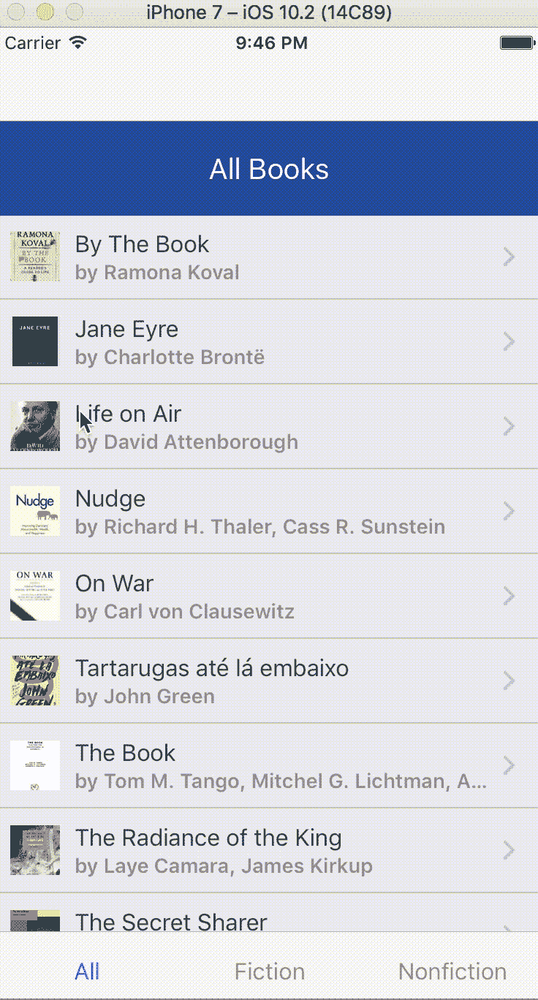
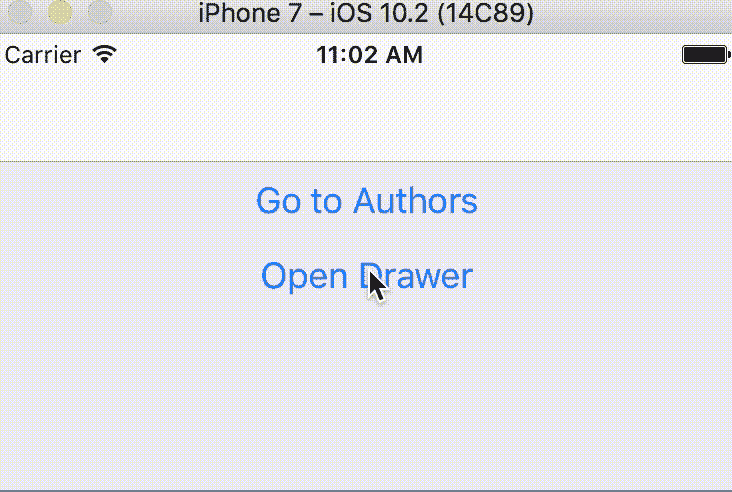
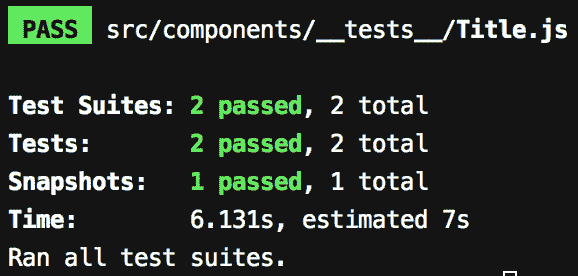
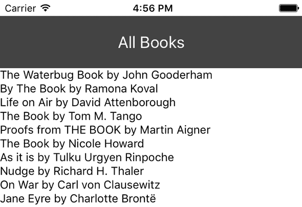

# React Native Elements、Jest 和 MobX MST 简化了真实世界的反应式应用程序

> 原文：<https://www.freecodecamp.org/news/real-world-reactnative-apps-made-easy-with-react-native-elements-jest-and-mobx-mst-15003ccefef1/>

作者:Qaiser Abbas

# React Native Elements、Jest 和 MobX MST 简化了真实世界的反应式应用程序


Source: [pixabay.com](https://pixabay.com/en/ilight-ilightmarine-abstract-2185506/)

在本帖中，我们将构建一个真实的移动应用程序。我们还将探索一些开发实践和库，包括以下内容:

*   目录结构
*   状态管理(Mobx 中)
*   代码样式和林挺工具([更漂亮的](https://prettier.io/)、 [ESLint](https://eslint.org/) 和 [Arirbnb 样式指南](https://github.com/airbnb/javascript)
*   使用[反应导航](https://reactnavigation.org/)进行屏幕导航
*   使用 [React 本地元素](https://react-native-training.github.io/react-native-elements/)的用户界面
*   还有一个重要但经常被忽视的部分:对你的应用程序进行单元测试(通过 [Jest](https://facebook.github.io/jest/) 和 [Enzyme](https://github.com/airbnb/enzyme) )。

所以让我们开始吧！

### React 中的状态管理

React 和 ReactNative 使构建单页应用程序和移动应用程序变得有趣和容易，但它们只涵盖了应用程序的视图。状态管理和 UI 设计仍然是构建应用程序的痛苦部分。

React 有几个流行的状态管理库。我用过 Redux，Mobx，RxJS。虽然这三者各有所长，但我最喜欢 MobX，因为它简单、优雅，还有强大的状态管理。

Redux 主要基于函数式编程和纯函数的概念，试图通过对何时可以更新施加一些限制来解决状态管理的复杂性。这些限制反映在三个基本原则中:单一真值来源、只读状态和纯函数。你可以在 Redux 文档中读到更多关于[这些原则的内容。](https://redux.js.org/introduction/three-principles)

虽然我是函数式编程的粉丝，但我经历过在使用 Redux 时必须处理大量不必要的样板代码。您还必须自己编写分派动作和转换状态的代码。

另一方面，Mobx 为您做了这项工作，使维护更容易，使用起来也更有趣。在 MobX 中，您需要适量的代码和限制来实现卓越的状态管理和良好的开发人员体验。

在 Redux 中，您还必须花费大量的时间来规范化和反规范化您的数据。在 MobX 中，您不需要规范化数据，MobX 会自动跟踪状态和派生之间的关系。我们稍后会讨论这个问题。

RxJS 是一个用于 JavaScript 的反应式编程库。它与 MobX 的不同之处在于，RxJS 允许您在 MobX 中对事件做出反应。你观察价值(或状态),它帮助你对状态的变化做出反应。

尽管 RxJS 和 MobX 都提供了执行反应式编程的能力，但它们的方法却大不相同。

### 关于我们的应用

我们将要构建的应用程序是为一家书店设计的。它将主要由两个简单的视图组成:图书视图和作者视图。

该应用程序将包含一个带有两个菜单选项的导航抽屉，允许用户在两种视图之间切换。第一个选项是导航到图书视图，另一个选项是导航到作者视图。

图书视图将包含图书列表，以及一个允许用户在小说和非小说图书之间切换的选项卡。作者视图将包含作者列表。

我们将在 Mac OS 上安装所有东西。当你安装了 Node 后，大部分命令都是一样的，但是如果你遇到任何问题，请告诉我，(或者谷歌一下)。

#### 涵盖的主题

我们将讨论不同的主题以及创建和测试完整的 React 本地应用程序所需的各种库:

1.  我们将安装`create-react-native-app`，并用它来引导我们的书店应用程序
2.  为我们的项目设置更漂亮，ESLint 和 Airbnb 风格指南
3.  使用反作用导航添加抽屉和标签导航
4.  用 Jest 和酶测试我们的反应成分
5.  使用 MobX (mobx-state-tree)管理应用程序的状态。它还将涉及一些用户界面的变化和更多的导航。我们将按流派对书籍进行排序和过滤，并允许用户在点击书籍时看到书籍详细信息屏幕。

这是我们将要构建的书店应用程序的演示:



Demo of our Bookstore App

#### 我们不包括的内容

有几件事我们不会在本文中涉及，但您可能希望在您的项目中考虑:

1.  在 JavaScript 中添加静态类型系统的工具，如 [flow](https://flow.org/) 和 [TypeScript](https://www.typescriptlang.org/)
2.  虽然我们会在应用程序中添加一些样式，但我们不会详细讨论在反应式应用程序中添加样式的不同选项。[样式组件](https://github.com/styled-components/styled-components)库是 React 和 React 应用程序中最流行的库之一。
3.  我们不会为我们的应用程序构建单独的后端。我们将经历与 Google Books API 的集成，但大部分时间我们将使用模拟数据。

### 使用 create-React-Native-app CLI(CRNA)创建 React 本机应用程序

[Create React Native App](https://github.com/react-community/create-react-native-app) 是由[脸书](https://code.facebook.com/)和 [Expo](https://expo.io/) 团队打造的工具，让 React Native 项目的入门变得轻而易举。我们将使用 [CRNA](https://github.com/react-community/create-react-native-app) CLI 初始化我们的反应性应用程序。所以让我们开始吧！

假设您已经安装了[节点](https://nodejs.org/en/download/)，我们需要全局安装`create-react-native-app`，这样我们就可以为我们的书店初始化一个新的 React 本地项目。

```
npm install -g create-react-native-app
```

现在，我们可以使用 create-react-native-app CLI 来创建新的 react 本机项目。我们把它命名为`bookstore-app`:

```
create-react-native-app bookstore-app
```

一旦 CRNA 完成了 React 本地应用程序的引导，它将显示一些有用的命令。让我们将目录更改为新创建的 CRNA 应用程序，并启动它。

```
cd bookstore-app npm start
```

这将启动打包程序，提供启动 iOS 或 Android 模拟器的选项，或者在真实设备上打开应用程序。

如果您遇到任何问题，请参考 [React Native 的入门指南](https://facebook.github.io/react-native/docs/getting-started.html)或 [Create React Native app (CRNA)指南](https://github.com/react-community/create-react-native-app/blob/master/react-native-scripts/template/README.md)。

#### 通过 Expo 在真实设备上打开 CRNA 应用程序

当通过`npm start`启动应用程序时，您的终端中将显示一个二维码。查看我们的自举应用程序的最简单方法是使用 Expo 应用程序。为此:

1.  在您的 iOS 或 Android 设备上安装 [Expo](https://expo.io/) 客户端应用程序。
2.  请确定您与电脑连接在同一个无线网络上。
3.  使用 Expo 应用程序，从您的终端扫描二维码，打开您的项目。

#### 在模拟器中打开 CRNA 应用程序

要在 iOS Simulator 上运行该应用程序，您需要安装 Xcode。要在 Android 虚拟设备上运行该应用程序，您需要设置 Android 开发环境。查看 react-native 入门指南了解这两种设置。

### setup beautiful、ESLint 和 Airbnb 风格指南

在这一节，我们将设置更漂亮，ESLint，和 Airbnb 风格指南，以确保我们的代码不仅看起来漂亮，而且运行代码林挺。

#### 为什么使用林挺工具？

JavaScript 是一种动态语言，不像 C++和 Java 等语言那样有静态类型系统。由于这种动态特性，JavaScript 缺少许多其他语言提供的静态分析工具。

这导致很难发现与数据类型相关的错误，并且需要更多的精力来调试和解决这些问题，尤其是对于没有经验的 JavaScript 开发人员。

因为它不是编译语言，所以在运行时执行 JavaScript 代码时会发现错误。有一些工具，比如 TypeScript 和 flow，可以通过向 JavaScript 添加静态类型系统来帮助捕捉这类错误，但是在本教程中我们不会深入讨论这两种工具。

另一方面，像 ESLint 这样的林挺工具可以根据可配置的规则对 JavaScript 代码进行静态分析。它们突出代码中可能是潜在错误的问题，这有助于开发人员在代码执行之前发现代码中的问题。

#### 安装和设置 ESLint

一个好的林挺工具对于确保质量从一开始就得到保证，并尽早发现错误是非常重要的。ESLint 还帮助您实现风格指南。

为了确保我们从书店项目的一开始就编写高质量的代码并拥有正确的工具，我们将通过首先实现林挺工具来开始我们的教程。你可以在他们的网站上了解更多关于 [ESLint 的信息。](https://eslint.org/docs/about/)

ESLint 是完全可配置和可定制的。你可以根据自己的喜好设定规则。但是，机构群体已经提供了不同的林挺规则配置。其中一个流行的是 Airbnb 风格指南，这是我们将要使用的。这将包括 Airbnb 的 ESLint 规则，包括 ECMAScript 6+和 React。

首先，我们将通过在终端中运行以下命令来安装 ESLint:

我们将使用 airbnb 的 [eslint-config-airbnb](https://github.com/airbnb/javascript/tree/master/packages/eslint-config-airbnb) ，其中包含 Airbnb 的 eslint 规则，包括 ECMAScript 6+和 React。它需要特定版本的 ESLint、eslint-plugin-import、eslint-plugin-react 和 eslint-plugin-jsx-a11y。要列出对等依赖项和版本，请运行以下命令:

```
npm info "eslint-config-airbnb@latest" peerDependencies
```

在撰写本文时，以上命令的输出中显示了这些版本:

```
{ eslint: '^4.9.0',  'eslint-plugin-import': '^2.7.0',  'eslint-plugin-jsx-a11y': '^6.0.2',  'eslint-plugin-react': '^7.4.0' }
```

因此，让我们通过运行以下命令来安装这些特定的依赖项版本:

```
npm install -D eslint@^4.9.0 eslint-plugin-import@^2.7.0 eslint-plugin-jsx-a11y@^6.0.2 eslint-plugin-react@^7.4.0
```

这将安装必要的依赖项，并在项目根目录下生成`.eslintrc.js`文件。. eslintrc.js 文件应该具有以下配置:

```
module.exports = {  "extends": "airbnb"};
```

#### 代码样式

虽然我们有 ESLint 和 Airbnb 风格指南覆盖的林挺，但代码质量的很大一部分是一致的代码风格。当您在团队中工作时，您希望确保代码格式和缩进在整个团队中保持一致。漂亮只是达到目的的工具。它确保所有代码符合一致的风格。

我们还将为更漂亮的添加 [ESLint 插件，它将更漂亮地添加为 ESLint 规则，并将差异报告为单个 ESLint 问题。](https://github.com/prettier/eslint-plugin-prettier)

现在，ESLint 规则和 Prettier 所做的代码格式化之间可能会有冲突。幸运的是，有一个名为[eslint-config-appellister](https://github.com/prettier/eslint-config-prettier)的插件可以关闭所有不必要的或可能与 appellister 冲突的规则。

#### 用 ESLint 安装和设置更漂亮

让我们安装所有必要的软件包，更漂亮的，和 eslint-plugin-更漂亮的。为此，我们还需要安装 eslint-config-airbnb:

```
npm install -D prettier prettier-eslint eslint-plugin-prettier eslint-config-prettier eslint-config-airbnb
```

**注意:**如果 ESLint 是全局安装的，那么要确保 ESLint-plugin-appellister 也是全局安装的。全局安装的 ESLint 找不到本地安装的插件。

要启用 eslint-plugin-appellister 插件，请更新您的. eslintrc.js 文件以添加“appellister”插件。为了显示更漂亮的格式规则的林挺错误，添加“规则”以显示“更漂亮/更漂亮”的错误。以下是我们更新后的. eslintrc.js:

```
module.exports = {  "extends": [    "airbnb",    "prettier"  ],  rules: {    "prettier/prettier": "error",  },}
```

eslint-config-appellister 还附带了一个 CLI 工具，帮助您检查您的配置是否包含任何不必要的规则或与 appellister 冲突的规则。让我们积极主动地去做。

首先，在 package.json 中添加一个脚本:

```
{  "scripts": {    "eslint-check": "eslint --print-config .eslintrc.js | eslint-config-prettier-check"  }}
```

现在，运行“eslint-check”命令来查看 eslint 和 appeller 的冲突规则:

```
npm run eslint-check
```

这将列出终端中的冲突规则。让我们通过更新. eslintrc.js 文件来关闭冲突规则。我也更喜欢单引号和尾随逗号，所以我也将配置这些规则。这是我们的. eslintrc.js 文件现在的样子:

```
module.exports = {  "parser": "babel-eslint",  "extends": [    "airbnb",    "prettier"  ],  "plugins": [    "prettier"  ],  "rules": {    "prettier/prettier": "error",    "react/jsx-closing-bracket-location": "off",    "react/jsx-closing-tag-location": "off",    "react/jsx-curly-spacing": "off",    "react/jsx-equals-spacing": "off",    "react/jsx-first-prop-new-line": "off",    "react/jsx-indent": "off",    "react/jsx-indent-props": "off",    "react/jsx-max-props-per-line": "off",    "react/jsx-tag-spacing": "off",    "react/jsx-wrap-multilines": "off"  }}
```

如果您现在运行带有`--fix`标志的`eslint`，代码将根据更漂亮的样式自动格式化。

#### 配置 VS 代码以在保存时运行 ESLint

我们可以配置任何 IDE 在保存或输入时自动运行 ESLint。由于我们也配置了更漂亮的 ESLint，我们的代码将自动进行预验证。VS Code 是 JavaScript 社区中流行的 IDE，所以我将展示如何使用 VS Code 设置 ESLint 的保存自动修复功能，但是在任何 IDE 中步骤都是相似的。

要配置 VS 代码在保存时自动运行 ESLint，我们首先需要安装 ESLint 扩展。转到扩展，搜索“ESLint”扩展，并安装它。一旦安装了 ESLint 扩展，转到`Preferences > User Setti` ngs，并将“eslint.autoFixOnSave”设置为 true。还要确保“文件.自动保存”设置为“关闭”、“onFocusChange”或“onWindowChange”。

现在，打开 App.js 文件。如果 ESLint 配置正确，您应该会看到一些林挺错误，比如“react/prefer-stateless-function”、“react/jsx-filename-extension”和“no-use-before-define”错误。让我们在. eslintrc.js 文件中关闭这些选项。正如我上面提到的，我也更喜欢单引号和尾随逗号，所以我也将配置这些规则。

下面是更新后的. eslintrc.js 文件。

```
module.exports = {  "parser": "babel-eslint",  "extends": [    "airbnb",    "prettier"  ],  "plugins": [    "prettier"  ],  "rules": {    "prettier/prettier": [      "error",      {        "singleQuote": true,        "trailingComma": "all",      }    ],    "react/prefer-stateless-function": "off",    "react/jsx-filename-extension": "off",    "no-use-before-define": "off",    "react/jsx-closing-bracket-location": "off",    "react/jsx-curly-spacing": "off",    "react/jsx-equals-spacing": "off",    "react/jsx-first-prop-new-line": "off",    "react/jsx-indent": "off",    "react/jsx-indent-props": "off",    "react/jsx-max-props-per-line": "off",    "react/jsx-tag-spacing": "off",    "react/jsx-wrap-multilines": "off"  }}
```

我知道这有很多工作要做，考虑到我们甚至还没有开始开发我们的应用程序！但是相信我，从长远来看，这种设置对你的项目非常有益，即使你是一个人的团队。当你与其他开发人员一起工作时，林挺和编程标准将在减少代码缺陷和确保代码风格的一致性方面大有作为。

您可以在教程库的 [this branch](https://github.com/qaiser110/ReactNative-Bookstore-App-Tutorial/tree/1-prettier-eslint-airbnb-styleguide-setup) 中找到本节所做的更改。

### 使用 react-navigation 的抽屉和标签导航

在本节中，我们将使用 react-navigation 添加抽屉和选项卡导航。

我们的书店应用程序将包含一个带有两个菜单选项的导航抽屉。**authors 屏幕**的第一个菜单项，包含作者列表。**图书屏幕**的第二个菜单项，包含图书列表。

点击一本书将把用户带到图书详情屏幕。对于不同视图之间的导航，我们将使用 [React Navigation](https://reactnavigation.org/docs/en/hello-react-navigation.html) 将导航添加到我们的应用程序中。所以让我们先安装它:

```
npm install --save react-navigation
```

#### createstackanavigator

我们的反应性应用将包含两个模块:

*   允许用户浏览作者列表的作者模块
*   书籍模块，包含书籍列表。

作者和书籍模块将使用来自 [React Navigation](https://reactnavigation.org/) 的 StackNavigator 来实现。将 StackNavigator 想象成 web 浏览器中的历史堆栈。当用户点击一个链接时，该 URL 被推送到浏览器历史堆栈，并且当用户按下后退按钮时，该 URL 从历史堆栈的顶部被移除。

```
export const BookStack = createStackNavigator({  Books: {    screen: BooksScreen,  },})
```

```
export const AuthorStack = createStackNavigator({  Authors: {    screen: AuthorsScreen,  },})
```

对于 BooksScreen 和 AuthorsScreen，我们现在将简单地添加两个无状态的 [react 组件](https://reactjs.org/docs/components-and-props.html)，用一些按钮来测试我们的屏幕导航和抽屉功能:

```
const BooksScreen = ({ navigation }) => (  <View>    <Button      onPress={() => navigation.navigate('Authors')}      title="Go to Authors"    />    <Button onPress={() => navigation.openDrawer()} title="Open Drawer" />  </View>)
```

```
const AuthorsScreen = ({ navigation }) => (  <Button    onPress={() => navigation.navigate('Books')}    title="Go back to Books"  />)
```

`navigation.openDrawer()`会触发抽屉打开。`navigation.navigate()`允许应用程序导航到不同的屏幕。

在我们的应用程序中，我们将添加一个抽屉来维护作者和书籍模块的菜单。我们将使用 React Navigation 的 [createDrawerNavigator](https://reactnavigation.org/docs/en/drawer-based-navigation.html) 来实现抽屉。

抽屉中的第一个菜单用于作者模块，第二个菜单用于书籍模块。Author 和 Book Stack 导航器都在主 DrawerStack 中。

以下是抽屉实现的代码:

```
const App = createDrawerNavigator({  Books: {    screen: BookStack,  },  Authors: {    screen: AuthorStack,  },})
```

这是我们最新变化的[差异。](https://github.com/qaiser110/ReactNative-Bookstore-App-Tutorial/tree/1-prettier-eslint-airbnb-styleguide-setup)

在 App.js 文件中，我们做了以下更改:

1.  我们将默认导出重命名为 App
2.  我们为屏幕添加了两个无状态组件，BooksScreen 和 AuthorsScreen。
3.  我们添加了来自 [React Navigation](https://reactnavigation.org/) 的 StackNavigator 来为我们的应用程序实现导航。
4.  我们使用 react-navigation 中的 [createDrawerNavigator()](https://reactnavigation.org/docs/en/drawer-based-navigation.html) 来实现抽屉导航。这将呈现抽屉内容，以及书籍和作者的菜单选项。

在做了上面的修改后，当我们点击“打开抽屉”按钮并在屏幕间导航时，这就是我们的 UI 的样子。



#### 目录结构

在项目开始时，考虑应用程序以及如何组织文件和资源是很重要的。虽然有几种方法可以构建您的应用程序代码，但我更喜欢使用基于特性的架构来共同定位文件和测试。将与特定功能或模块相关的文件放在一起有很多好处。

让我们创建一个 src 目录，我们将在其中保存所有的源文件。在其中，创建两个目录:一个用于图书视图，名为“book ”,另一个用于作者视图，名为“author”。

在我们刚刚添加的两个目录中创建 index.js 文件。这些文件将为我们的每个视图导出组件。将 BookView 和 AuthorView 组件的代码从 App.js 移动到这些文件中，然后导入它们。

值得注意的是，重构应该是开发工作流程的一个重要部分。我们应该不断地重构代码，为未来的变化和挑战做好准备。从长远来看，这对生产力和变革管理有很大的影响。

我们的应用程序应该还能像重构前一样工作。这里是我们最近的变化的[文件差异。](https://github.com/qaiser110/ReactNative-Bookstore-App-Tutorial/commit/d0377da1c3797e2dd9a35237533ae5815af1b582)

每个屏幕都有一个标题，这意味着我们将复制相同的代码和样式。为了保持代码简洁，让我们将标题移到一个单独的文件`src/components/Title.js`，并在需要的地方重用它。我们还将主视图移动到一个新的父目录`src/views`中，使它们与其他组件分开。

#### 标签导航

我们的应用程序的业务需求是在 books 视图中有三个选项卡，默认显示所有的书籍，以及显示过滤的小说和非小说书籍的附加选项卡。让我们使用 react-navigation 中的 [createBottomTabNavigator](https://reactnavigation.org/docs/en/tab-based-navigation.html) 来实现选项卡导航。

```
import { createBottomTabNavigator } from 'react-navigation'
```

```
import { AllBooksTab, FictionBooksTab, NonfictionBooksTab } from ' components/book-type-tabs'
```

```
export default createBottomTabNavigator({  'All Books': AllBooksTab,  Fiction: FictionBooksTab,  Nonfiction: NonfictionBooksTab,})
```

我们还应该在每个屏幕上添加一个标题来标识当前选择的屏幕。让我们为所有的公共组件创建一个单独的目录`src/components`，并在这个新目录中为我们的`Title`组件创建一个文件。

```
// src/components/Title.jsimport React from 'react'import { StyleSheet, Text } from 'react-native'
```

```
const styles = StyleSheet.create({  header: {    textAlign: 'center',    padding: 20,    marginTop: 20,    fontSize: 20,    color: '#fff',    backgroundColor: '#434343',  },})
```

```
export default ({ text }) => <Text style={styles.header}>{text}</Text>
```

注意，我们还向`<Te` xt >组件添加了`style`，导入了 `both Styl` eShee `t an` d Text `from react-` native。

我们将把`Title`添加到每个视图组件中，在道具中提供标题`text`。此外，由于 Authors 视图只包含作者列表，我们不需要 StackNavigator，所以我们将把它改为一个普通的 React 组件。下面是我们的`src/views/author/index.js`文件现在的样子:

```
// src/views/author/index.js
```

```
import Title from '../../components/Title'
```

```
export default ({ navigation }) => (  <View>    <Title text="Authors List" />    <Button onPress={() => navigation.openDrawer()} title="Open Drawer" />    <Button onPress={() => navigation.navigate('Books')} title="Go to Books" />  </View>)
```

现在，当我们从抽屉中打开书籍菜单时，我们可以通过点击底部的标签来切换标签。

有了这些改变，我们已经完成了应用程序的导航。这是我们最近的变化的[差异。](https://github.com/qaiser110/ReactNative-Bookstore-App-Tutorial/commit/007ec23b049f45bf38279c39e22f32db894f16a7)

### 反应本地元素

有几个 UI 组件库可以添加带有样式的 React 本地组件。一些更常见的是[反应原生元素](https://react-native-training.github.io/react-native-elements/)原生基础，[点燃](https://infinite.red/ignite)。我们将在书店应用程序中使用 React 本地元素。所以让我们首先安装 react-native-elements:

```
npm install --save react-native-elements
```

#### 使用 react-native-elements 创建作者列表

让我们使用 React 原生元素中的 **ListItem** 组件在我们的作者屏幕中添加一个作者列表。

对于作者列表，我们将使用来自 [ListItem](https://react-native-training.github.io/react-native-elements/docs/listitem.html) 演示的数据和代码。当我们实现图书列表屏幕时，我们将再次详细讨论**列表项**。

这是我们最近的变化的[差异。](https://github.com/qaiser110/ReactNative-Bookstore-App-Tutorial/commit/11435b4c79ba718f4f8d4d12fe0b28ef707e4d1c)

### 用 Jest 和酶检测反应成分

在这一节中，我们将使用 Jest 和 Enzyme 添加一些单元测试。

#### Jest 和酶设置

对你的代码进行单元测试是非常重要的，这样当你想改变一些东西的时候，你就可以对你的代码有信心。当您添加更多的功能时，它真的会有回报，并且您可以进行更改，而不必担心由于更改而破坏应用程序的一些现有功能。您知道您的单元测试为您的应用程序提供了安全网，防止任何缺陷泄漏到产品中。

我们将使用 Jest 和 Airbnb 的 JavaScript 测试工具 [Enzyme](https://github.com/airbnb/enzyme) 作为测试框架。Enzyme 具有灵活直观的界面，使得断言、操作和遍历 React 组件变得非常容易。

create-react-native-app 工具包已经包含了所有相关的 Jest 库和配置。要使用 Enzyme，我们需要安装`enzyme`和一些相关的依赖项。由于我们使用 React 16，我们将添加`react-dom@16`和`enzyme-adapter-react-16`。

```
npm install -D enzyme react-dom@16 enzyme-adapter-react-16
```

我们需要配置`enzyme-adapter-react-16`。我们将在 Jest 设置过程中这样做。用下面的代码创建`jestSetup.js`文件项目的根:

```
import { configure } from 'enzyme'import Adapter from 'enzyme-adapter-react-16'
```

```
configure({ adapter: new Adapter() })
```

现在，将这个文件添加到 Jest 的配置文件`package.json`:

```
"jest": {    "preset": "jest-expo",    "setupTestFrameworkScriptFile": "<rootDir>/jestSetup.js"  },
```

### 我们的标题组件的酶和快照测试

现在，我们都准备好加入酶测试了。我更喜欢把测试和我的代码放在一起。让我们通过在标题组件旁边添加一个测试文件来为标题组件创建一个简单的测试。在这个测试中，我们将简单地呈现标题组件，创建快照，并验证组件样式。创建文件`src/components/__tests__/Title.js`，内容如下:

```
import React from 'react'import { shallow } from 'enzyme'import Title from '../Title'
```

```
it('renders correctly', () => {  const wrapper = shallow(<Title text="Sample Text" />)  expect(wrapper).toMatchSnapshot()
```

```
expect(wrapper.prop('accessible')).toBe(true)  expect(wrapper.prop('style')).toEqual({    backgroundColor: '#434343',    color: '#fff',    fontSize: 20,    marginTop: 20,    padding: 20,    textAlign: 'center',  })})
```

让我们进行测试:

```
npm test
```

测试应该通过并生成快照，输出如下:



如果您不熟悉 Jest 快照测试，这通常是测试 React 组件或不同类型输出的好方法。

基本上，`toMatchSnapshot()`调用呈现您的组件并在`__snapshots__`目录中创建一个快照(如果快照不存在的话)。此后，每次重新运行测试时，Jest 都会将渲染组件的输出与快照的输出进行比较，如果不匹配，就会失败。它将显示预期输出和实际输出之间的差异。然后您可以检查差异，如果由于您已经实现的一些更改，这种差异是有效的，那么您可以使用`-u`标志重新运行测试，该标志通知 Jest 使用新的更新来更新快照。

这里是到目前为止 Jest 和 Enzyme test 的[差异，包括生成的快照。](https://github.com/qaiser110/ReactNative-Bookstore-App-Tutorial/commit/8280243d7c9cab6b69b2b2ed530756fe8a4bdcca)

### 酶到 json 串行器

如果您打开快照文件(`src/components/__tests__/__snapshots__/Title.js.snap`)，您会注意到内容可读性不强。它被来自酶包装器的代码混淆了，因为我们使用酶来呈现我们的组件。幸运的是，有一个 [enzyme-to-json](https://github.com/adriantoine/enzyme-to-json) 库可以将 enzyme 包装器转换成与 Jest 快照测试兼容的格式。

让我们安装酶到 json:

```
npm install -D enzyme-to-json
```

并将其添加到 Jest 配置中作为`pacakge.json`中的快照序列化程序:

```
"jest": {    ...    "snapshotSerializers": ["enzyme-to-json/serializer"]  },
```

因为我们现在期望快照与之前的快照不同，所以我们将传递`-u`标志来更新快照:

```
npm test -- -u
```

如果您再次打开快照文件，您将看到渲染标题组件的快照是正确的。

我们将在后面的章节中更深入地探讨 Jest 测试。

### 使用 React 导航和 Mobx 存储管理状态


#### 用于状态管理的 MobX 或 Redux

虽然 React 非常适合管理应用程序的视图，但是您通常需要工具来管理应用程序的存储。我说一般，因为你可能根本不需要状态管理库——这完全取决于你正在构建的应用程序的类型。

有几个状态管理库，但是最流行的是 Redux 和 MobX。我们将在书店应用程序中使用 Mobx store。

对于店铺管理，我一般更喜欢 MobX 而不是 Redux，因为我感觉在 Redux 中添加新的店铺数据比 MobX 要多花很多时间。

**Redux 的一些缺点:**

*   您需要添加大量样板代码。
*   你必须自己编写代码来分派动作和转换状态。
*   它迫使你以特定的方式实现事情。虽然这在某些应用程序中是一件好事，但我发现对于许多应用程序来说，这样花费的时间可能不值得。

**MobX 的一些优势:**

*   它为您添加了样板文件，并且做得很好。我发现它非常容易使用，无论是初始设置，还是添加更多功能。
*   它不会强迫你以一种特定的方式实现你的数据流，你有更多的自由。但是，如果您没有正确设置您的 MobX 存储，这可能会带来更多的问题，而不是帮助..

我知道这是一个敏感的话题，我也不想在这里展开争论，所以这个话题改天再说。但是如果你想更多地了解这个问题，在互联网上有很多关于这个问题的观点。Redux 和 MobX 都是商店管理的好工具。

我们将逐步向我们的商店添加功能，而不是一次性添加，只是为了向您展示向 MobX 商店添加更多功能是多么容易。

### MobX 状态树

我们不会直接用 MobX，而是用 Mobx 上的一个包装器叫做 [mobx-state-tree](https://github.com/mobxjs/mobx-state-tree) 。他们很好地描述了自己，所以我在这里引用他们的话:

> 简单地说，mobx-state-tree 试图结合不变性(事务性、可追溯性和组合)和可变性(可发现性、协同定位和封装)的最佳特性。— MST Github 页面

让我们安装 [mobx](https://github.com/mobxjs/mobx) 以及 [mobx-react](https://github.com/mobxjs/mobx-react) 和 [mobx-state-tree](https://github.com/mobxjs/mobx-state-tree)

`npm install --save mobx mobx-react mobx-state-tree`

我们将使用 Google Books API 为我们的应用程序获取图书。如果您想继续，您必须在 Google Developers 控制台中创建一个项目，在上面启用 Google Books API，并在项目中创建一个 API 键。一旦您有了 API 密匙，在项目根目录中创建一个文件`keys.json`，包含以下内容(用您的 API 密匙替换`YOUR_GOOGLE_BOOKS_API_KEY`):

```
{  "GBOOKS_KEY": "YOUR_GOOGLE_BOOKS_API_KEY"}
```

**注意**:如果你不想经历这个获取 API 密钥的过程，也不用担心。我们不会直接使用 Google API，而是模拟数据。

Google Books API 端点`books/v1/volumes`返回一个数组`items`,其中每一项都包含特定书籍的信息。这是一本书的删节版:

```
{  kind: "books#volume",  id: "r_YQVeefU28C",  etag: "HeC4avg1XlM",  selfLink: "https://www.googleapis.com/books/v1/volumes/r_YQVeefU28C",  volumeInfo: {    title: "Breaking Everyday Addictions",    subtitle: "Finding Freedom from the Things That Trip Us Up",    authors: [      "David Hawkins"    ],    publisher: "Harvest House Publishers",    publishedDate: "2008-07-01",    description: "Addiction is a rapidly growing problem among Christians and non-Christians alike. Even socially acceptable behaviors, ...",    pageCount: 256,    printType: "BOOK",    categories: [      "Addicts"    ],    imageLinks: {      smallThumbnail: "http://books.google.com/books/content?id=r_YQVeefU28C",      thumbnail: "http://books.google.com/books/content?id=r_YQVeefU28C&printsec=frontcover"    },    language: "en",    previewLink: "http://books.google.com.au/books?id=r_YQVeefU28C&printsec=frontcover",    infoLink: "https://play.google.com/store/books/details?id=r_YQVeefU28C&source=gbs_api",    canonicalVolumeLink: "https://market.android.com/details?id=book-r_YQVeefU28C"  }}
```

我们不会使用 API 响应中返回的所有字段。因此，我们将仅为我们的反应性应用程序中需要的数据创建 MST 模型。让我们在 MST 中定义我们的图书模型。

在`src`中新建一个目录结构`stores/book`，并在其中新建一个文件`index.js`:

```
// src/stores/book/index.jsimport { types as t } from 'mobx-state-tree'
```

```
const Book = t.model('Book', {  id: t.identifier(),  title: t.string,  pageCount: t.number,  authors: t.array(t.string),  image: t.string,  genre: t.maybe(t.string),  inStock: t.optional(t.boolean, true),})
```

在上面的 MST 节点定义中，我们的`Book`模型类型定义了 MobX 状态树中`Book`类型节点的形状。MST 中的`types.model`类型用于描述物体的形状。为模型命名并不是必需的，但出于调试目的，建议这样做。

第二个参数，properties 参数，是一个键-值对，其中键是属性的名称，值是属性的类型。在我们的模型中，`id`是**标识符**，`title`是类型**字符串**，`pageCount`是类型**数字**，`authors`是字符串的**数组，`genre`是类型**字符串**，`inStock`是类型**布尔型**，而`image`是类型**字符串**。**

默认情况下，在树中创建一个有效的节点需要所有的数据，所以如果我们试图插入一个没有标题的节点，MST 不会允许，并且会抛出一个错误。

`genre`将被映射到 Google Books API 数据的`categories`字段(类别数组的第一个索引值)。它可能在响应中出现，也可能不出现。因此，我们把它做成`maybe`型。如果响应中没有**流派**的数据，那么在 MST 中`genre`将被设置为`null`，但是如果有，它必须是类型**字符串**才有效。

因为`inStock`是我们自己的字段，并且不会在 Google Books API 的响应中返回，所以我们将它设为可选字段，并赋予它默认值 true。我们可以简单地给它赋值`true`，因为对于原始类型，MST 可以从默认值中推断出类型。所以`inStock: true`和`inStock: t.optional(t.boolean, true)`是一样的。

*mobx-state-tree* 文档的[创建模型](https://github.com/mobxjs/mobx-state-tree#creating-models)部分详细介绍了在 MST 中创建模型。

```
// src/stores/book/index.jsconst BookStore = t  .model('BookStore', {    books: t.array(Book),  })  .actions(self => {    function updateBooks(books) {      books.forEach(book => {        self.books.push({          id: book.id,          title: book.volumeInfo.title,          authors: book.volumeInfo.authors,          publisher: book.volumeInfo.publisher,          image: book.volumeInfo.imageLinks.smallThumbnail,        })      })    }
```

```
const loadBooks = process(function* loadBooks() {      try {        const books = yield api.fetchBooks()        updateBooks(books)      } catch (err) {        console.error('Failed to load books ', err)      }    })
```

```
return {      loadBooks,    }  })
```

默认情况下，MST 树受到保护。这意味着只有 MST 操作可以改变树的状态。

我们已经定义了两个动作:`updateBooks`是一个只被`loadBooks`函数调用的函数，所以我们没有向外界公开它。另一方面，`loadBooks`是暴露的(我们正在返回它)，并且可以从`BookStore`外部调用。

MST 中的异步操作是使用生成器编写的，并且总是返回一个承诺。在我们的例子中，`loadBooks`需要异步，因为我们正在对 Google Books API 进行 Ajax 调用。

我们将维护`BookStore`的单个实例。如果商店已经存在，我们将返回现有的商店。如果没有，我们将创建一个并返回新商店:

```
// src/stores/book/index.jslet store = null
```

```
export default () => {  if (store) return store
```

```
store = BookStore.create({ books: {} })  return store}
```

### 在我们的视图中使用 MST 存储

让我们从所有书籍视图开始。为此，我们将创建一个包含我们的`BookListView`组件的新文件:

```
import React, { Component } from 'react'import { observer } from 'mobx-react'import BookStore from '../../../stores/book'import BookList from './BookList'
```

```
@observerclass BookListView extends Component {  async componentWillMount() {    this.store = BookStore()    await this.store.loadBooks()  }
```

```
render() {    return <BookList books={this.store.books} />  }}
```

如你所见，我们正在初始化`componentWillMount`中的`BookStore`，然后调用`loadBooks()`从 Google Books API 异步获取图书。`BookList`组件迭代**书店**中的`books`数组，并为每本书呈现`Book`组件。现在，我们只需要将这个`BookListView`组件添加到`AllBooksTab`中。

如果你现在启动这个应用程序，你会看到书籍正在按预期加载。

注意，我对一个文件使用 Pascal 大小写命名约定，该文件返回一个 React 组件作为默认导出。对于其他一切，我用烤肉串的情况。您可以决定为您的项目选择不同的命名约定。

如果您现在运行`npm start`，您应该会看到 Google API 获取的图书列表。



这是我们到目前为止所做的改变的[差异。](https://github.com/qaiser110/ReactNative-Bookstore-App-Tutorial/commit/ad23749ed9ed8ba157fade215ce20df0c2312ede)

### 为我们的 MST 书店添加测试

让我们为我们的书店添加一些单元测试。但是，我们的商店正在与我们的 API 对话，API 调用 Google API。我们可以为我们的商店添加集成测试，但是要添加单元测试，我们需要以某种方式模拟 API。

模仿 API 的一个简单方法是使用 [Jest Manual 模仿](https://facebook.github.io/jest/docs/en/manual-mocks.html)，在我们现有的`api.js`文件旁边创建`__mocks__`目录。在它里面，创建另一个`api.js`，我们 API fetch 调用的模拟版本。然后，我们只是在测试中调用`jest.mock('../api')`来使用这个模拟版本。

#### MobX 状态树中的依赖注入

我们不会使用 Jest 手动模拟。我想向您展示 MST 中的另一个特性，并演示使用 MST 模仿我们的 API 是多么容易。我们将在 MobX 状态树中使用依赖注入来提供一种简单的方法来模拟 API 调用，使我们的存储易于测试。注意，我们的 MST 存储也可以在没有依赖注入的情况下使用 Jest Mocks 进行测试，但是我们这样做只是为了演示。

通过将一个对象作为第二个参数传递给`BookStore.create()`调用，可以将特定于环境的数据注入状态树。树中的任何模型都可以通过调用`getEnv()`来访问这个对象。我们将在书店中注入一个模拟 API，所以让我们首先将可选的`api`参数添加到默认导出中，并在默认情况下将其设置为实际的`bookApi`。

```
// src/stores/book/index.jslet store = null
```

```
export default () => {  if (store) return store
```

```
store = BookStore.create({ books: {} })  return store}
```

现在，通过使用`getEnv()`抓取来为注入的 API 添加一个 [MST 视图](https://github.com/mobxjs/mobx-state-tree#views)。然后在`loadBooks`函数中将其用作`self.api.fetchBooks()`:

```
// src/stores/book/index.js// ....views(self => ({    get api() {      return getEnv(self).api    },}))
```

现在让我们创建一个模拟 API，它具有与真实 API fetch 函数相同的 fetch 函数:

```
// src/stores/book/mock-api/api.jsconst books = require('./books')
```

```
const delayedPromise = (data, delaySecs = 2) =>  new Promise(resolve => setTimeout(() => resolve(data), delaySecs * 1000))
```

```
const fetchBooks = () => delayedPromise(books)
```

```
export default {  fetchBooks,}
```

我添加了一个响应延迟，这样就不会立即发送响应。我还创建了一个 JSON 文件，其中的一些数据类似于 Google Books API `src/stores/book/mock-api/books.json`发送的响应数据。

现在，我们准备将模拟 API 注入到我们的测试中。用以下内容为我们的商店创建一个新的测试文件:

```
// src/stores/book/__tests__/index.jsimport { BookStore } from '../index'import api from '../mock-api/api'
```

```
it('bookstore fetches data', async () => {  const store = BookStore.create({ books: [] }, { api })  await store.loadBooks()  expect(store.books.length).toBe(10)})
```

运行存储测试:

```
npm test src/stores/book/__tests__/index.js
```

你应该看到测试通过了。

#### 添加书籍过滤器并应用 TDD

我相信测试驱动开发的混合方法。根据我的经验，如果你在开始一个项目时，或者当你从头开始添加一个新的模块或一个主要功能时，先添加一些基本功能，效果会最好。一旦实现了基本的设置和结构，TDD 就可以很好地工作了。

但是我相信 TDD 是解决代码中问题空间的最好方法。它不仅迫使你有更好的代码质量和设计，而且确保你有原子单元测试。此外，它确保你的单元测试更关注于测试特定的功能，而不是在测试中填充太多的断言。

在我们开始添加测试和修改存储之前，我将把模拟 API 中的延迟改为 300 毫秒，以确保我们的测试运行得更快。

```
const fetchBooks = () => delayedPromise(books, 0.3)
```

我们希望在我们的`BookStore`模型中有一个`filter`字段，在我们的存储中有一个`setGenre()`动作来改变这个`filter`的值。

```
it(`filter is set when setGenre() is called with a valid filter value`, async () => {  store.setGenre('Nonfiction')  expect(store.filter).toBe('Nonfiction')})
```

我们希望只为我们的书店运行测试，并保持测试运行和观察变化。当代码被更改时，它们将重新运行。因此，我们将使用 watch 命令并使用文件路径模式匹配:

```
npm test stores/book -- --watch
```

上面的测试应该会失败，因为我们还没有编写通过测试的代码。TDD 的工作方式是，您编写一个原子测试来测试业务需求的最小单元。然后，您添加代码以使该测试通过。您迭代地经历相同的过程，直到您添加了所有的业务需求。为了让我们的测试通过，我们必须在我们的`BookStore`模型中添加一个枚举类型的`filter`字段:

```
.model('BookStore', {    books: t.array(Book),    filter: t.optional(        t.enumeration('FilterEnum', ['All', 'Fiction', 'Nonfiction']),        'All'    ),})
```

并添加一个 MST 操作，它将允许我们更改过滤器值:

```
const setGenre = genre => {  self.filter = genre}
```

```
return {  //...  setGenre,}
```

有了这两个变化，我们应该是绿色的。让我们也为无效的过滤器值添加一个否定测试:

```
it(`filter is NOT set when setGenre() is called with an invalid filter value`, async () => {  expect(() => store.setGenre('Adventure')).toThrow()})
```

而且这个测试也应该通过。这是因为我们在 MST 存储中使用了 ENUM 类型，唯一允许的值是`All`、`Fiction`和`Nonfiction`。

下面是我们最近的变化的[差异。](https://github.com/qaiser110/ReactNative-Bookstore-App-Tutorial/commit/925920c430a3449b9e1010b11d1d662c8e88ac6a)

#### 整理和过滤书籍

模拟数据的`categories`字段中的第一个索引值将书分类为**小说**或**非小说**。我们将使用它分别为我们的**小说**和**非小说**标签过滤书籍。

我们还希望我们的书总是按标题排序。让我们为此添加一个测试:

让我们首先添加一个对书籍进行分类的测试:

```
it(`Books are sorted by title`, async () => {  const books = store.sortedBooks  expect(books[0].title).toBe('By The Book')  expect(books[1].title).toBe('Jane Eyre')})
```

为了让我们的测试通过，我们将在我们的`BookStore`模型中添加一个名为`sortedBooks`的视图:

```
get sortedBooks() {  return self.books.sort(sortFn)},
```

有了这样的改变，我们应该又回到绿色了。

### 关于 MST 视图

我们刚刚在我们的`BookStore`模型中添加了`sortedBooks`视图。为了理解 MST 视图是如何工作的，我们必须理解 MobX。MobX 背后的关键概念是:任何可以从应用程序状态派生的东西都应该自动派生。

在这个 egghead.io 视频中，MobX 的创造者 [Michel Weststrate](https://twitter.com/mweststrate) 解释了 MobX 背后的关键概念。我在这里引用一个关键概念:

> MobX 是围绕四个核心概念构建的。动作、可观察状态、计算值和反应……找到你需要的最小数量的状态，并推导出所有其他的东西……——[米歇尔·韦斯特斯特](https://twitter.com/mweststrate)

计算出的值应该是纯函数，并且就仅依赖可观察值或其他计算值而言，它们应该没有副作用。计算的属性是延迟计算的，只有在请求它们的值时才计算它们的值。计算出的值也缓存在 MobX 中，当访问这个计算出的属性时，返回这个缓存的值。当其中使用的任何可观察值发生变化时，将重新计算计算属性。

[MST 视图](https://github.com/mobxjs/mobx-state-tree#views)来源于当前的可观测状态。视图可以有或没有参数。没有参数的视图基本上是来自 MobX 的[计算值](https://mobx.js.org/refguide/computed-decorator.html)，使用 getter 函数定义。当一个可观察值从一个 MST 动作改变时，受影响的视图得到重新计算，触发`@observer`组件的改变(反应)。

### 为流派过滤器添加测试

我们知道在模拟数据中有七本非小说类书籍。现在让我们通过`genre`添加一个过滤测试:

```
it(`Books are sorted by title`, async () => {  store.setGenre('Nonfiction')  const books = store.sortedBooks  expect(books.length).toBe(7)})
```

为了通过流派进行过滤，我们将在我们的`Book`模型中添加一个字符串类型的`genre`字段，并将其映射到从 API 响应接收的`volumeInfo.categories[0]`。我们还将改变我们的`BookStore`模型中的`sortedBooks`视图获取器，在对书籍进行排序之前过滤它们:

```
get sortedBooks() {  return self.filter === 'All'    ? self.books.sort(sortFn)    : self.books.filter(bk => bk.genre === self.filter).sort(sortFn)},
```

再说一次，所有的测试都通过了。

下面是我们最近的变化的[差异。](https://github.com/qaiser110/ReactNative-Bookstore-App-Tutorial/commit/620be74af6c5bbf119478405388c8bf978d85586)

### 选项卡更改时更新用户界面

**注意**:从现在开始，我们将使用模拟数据进行实际的 API 调用，而不是向 Google Books API 发出 Ajax 请求。为此，我将`stores/book/index.js`中的`bookApi`改为指向模拟 API ( `./mock-api/api.js`)。

还要注意，所有三个标签(“所有”、“小说”和“非小说”)的显示是相似的。项目的布局和格式是相同的，但唯一的区别是它们将显示的数据。由于 MobX 允许我们将数据与视图完全分离，我们可以去掉三个独立的视图，并对所有三个选项卡使用相同的组件。

这意味着我们不再需要这三个独立的选项卡。因此，我们将删除`book-type-tabs.js`文件，并在我们的 **TabNavigator** 中为所有三个选项卡直接使用`BookListView`组件。我们将使用`tabBarOnPress`回调来触发对`BookStore`中的`setGenre()`的调用。导航状态对象上可用的`routeName`被传递给`setGenre()`以在用户按下标签时更新过滤器。

下面是更新后的 TabNavigator:

```
// src/views/book/index.js
```

```
export default observer(  createBottomTabNavigator(    {      All: BookListView,      Fiction: BookListView,      Nonfiction: BookListView,    },    {      navigationOptions: ({ navigation }) => ({        tabBarOnPress: () => {          const { routeName } = navigation.state          const store = BkStore()          store.setGenre(routeName)        },      }),    }  ))
```

请注意，我们将`createBottomTabNavigator`包装在 MobX `observer`中。这就是将反应组件类或独立渲染函数转换为反应组件的原因。在我们的例子中，我们希望书店中的过滤器在调用`tabBarOnPress`时改变。

我们还将改变视图，以获得排序的书籍，而不是书籍。

```
// src/views/book/components/BookListView.js
```

```
class BookListView extends Component {  async componentWillMount() {    this.store = BkStore()    await this.store.loadBooks()  }
```

```
render() {    const { routeName } = this.props.navigation.state    return (      <View>        <Title text={`${routeName} Books`} />        <BookList books={this.store.sortedBooks} />      &lt;/View>    )  }}
```

### 设计我们的书单

我们的图书列表只是列出了每本书的名称和作者，但我们还没有给它添加任何样式。让我们使用来自`react-native-elements`的`ListItem`组件来做这件事。这是一个简单的变化:

```
// src/views/book/components/Book.js
```

```
import { ListItem } from 'react-native-elements'
```

```
export default observer(({ book }) => (  <ListItem    avatar={{ uri: book.image }}    title={book.title}    subtitle={`by ${book.authors.join(', ')}`}  />))
```

这是我们现在的视图:

！[带 react-native-elements.png 的书单](。/react-native-elements.png 的书目)

下面是我们最近的变化的[差异。](https://github.com/qaiser110/ReactNative-Bookstore-App-Tutorial/commit/b3ec126149833056e4e417218eca2e674b3b272d)

### 添加图书详细信息

我们将向我们的`BookStore`添加一个字段`selectedBook`，它将指向所选的图书型号。

```
selectedBook: t.maybe(t.reference(Book))
```

我们使用 MST 参考来表示我们的`selectedBook`可观察值。[MST 存储中的引用](https://github.com/mobxjs/mobx-state-tree#references-and-identifiers)使得引用数据和与之交互变得容易，同时在后台保持数据的规范化。

我们还将添加一个动作来更改该引用:

```
const selectBook = book => {  self.selectedBook = book}
```

当用户点击`BookListView`中的一本书时，我们希望将用户导航到`BookDetail`屏幕。因此，我们将为此创建一个`showBookDetail`函数，并将其作为道具传递给子组件:

```
// src/views/book/components/BookListView.jsconst showBookDetail = book => {  this.store.selectBook(book)  this.props.navigation.navigate('BookDetail')}
```

在`Book`组件中，我们对书本`ListItem`上的`onPress`事件调用上面的`showBookDetail`函数:

```
// src/views/book/components/Book.js
```

```
onPress={() => showBookDetail(book)}
```

现在让我们创建当用户按下一本书时将显示的`BookDetailView`:

```
// src/views/book/components/BookDetailView.js
```

```
export default observer(() => {  const store = BkStore()  const book = store.selectedBook
```

```
return (    <View>      <View>        <Card title={book.title}>          <View>            <Image              resizeMode="cover"              style={{ width: '60%', height: 300 }}              source={{ uri: book.image }}            />            <Text>Title: {book.title}</Text>            <Text>Genre: {book.genre}</Text>            <Text>No of pages: {book.pageCount}</Text>            <Text>Authors: {book.authors.join(', ')}</Text>            <Text>Published by: {book.publisher}</Text>          </View>        </Card>      </View>    </View>  )})
```

以前我们只有选项卡，但现在我们想在用户点击一本书时显示细节。所以我们会导出一个`createStackNavigator`而不是直接导出`createBottomTabNavigator`。`createStackNavigator`将有两个屏幕，分别是`BookList`和`BookDetail`屏幕:

```
// src/views/book/index.jsexport default createStackNavigator({  BookList: BookListTabs,  BookDetail: BookDetailView,})
```

注意，我们在`createStackNavigator`中有列表视图和细节视图。这是因为我们希望共享相同的`BookDetailView`，只是内容不同(过滤后的书籍)。如果我们希望从不同的选项卡中显示不同的详细视图，那么我们应该创建两个单独的 StackNavigators，并将它们包含在一个 TabNavigator 中。大概是这样的:

```
const TabStackA = createStackNavigator({  Main: MainScreen,  Detail: DetailScreen,});
```

```
const TabStackB = createStackNavigator({  Main: MainScreen,  Detail: DetailScreen,});
```

```
export default createBottomTabNavigator(  {    TabA: TabStackA,    TabB: TabStackB,  })
```

下面是我们最近的变化的[差异。](https://github.com/qaiser110/ReactNative-Bookstore-App-Tutorial/commit/0a40ffd056eb160e07e24a0dd83ada953776c703)

### 标签样式

我们的标签看起来有点小，并且在屏幕底部。让我们通过增加`fontSize`和增加一些`padding`来解决这个问题:

```
// src/views/book/index.js
```

```
const BookListTabs = observer(  createBottomTabNavigator(    {      All: BookListView,      Fiction: BookListView,      Nonfiction: BookListView,    },    {      navigationOptions: ({ navigation }) => ({        // ...      }),      tabBarOptions: {        labelStyle: {          fontSize: 16,          padding: 10,        },      },    }  ))
```

让我们运行我们的应用程序，点击一本书，图书详细信息屏幕应该显示图书详细信息。这是我们完成的应用程序的回购。

### 感谢您的阅读！

我们关于使用 MobX store 创建反应式应用程序的教程到此结束。我希望你喜欢这篇文章，并发现它很有用。

*最初发表于[qaiser.com.au](https://qaiser.com.au/react-native-tutorial)。*