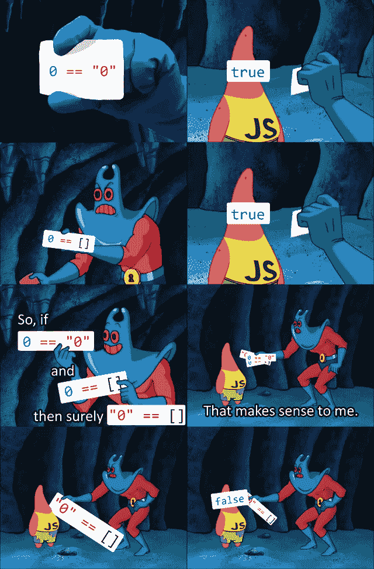
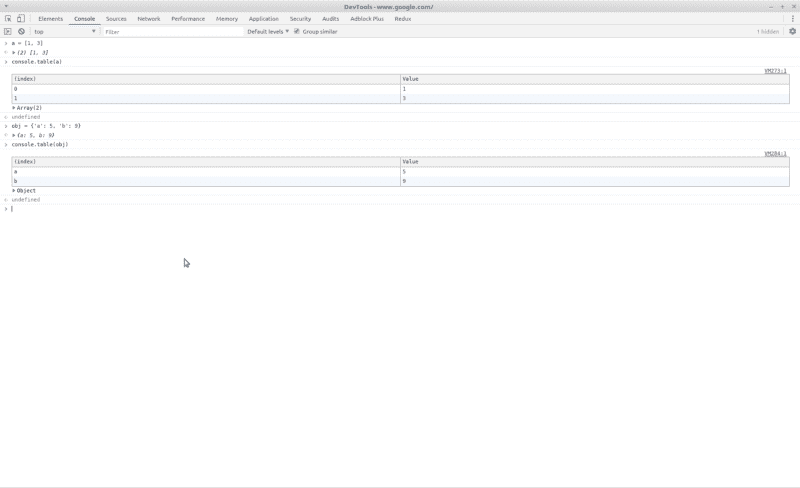

# 如何提高您的 JavaScript 调试技能

> 原文：<https://www.freecodecamp.org/news/stepping-up-your-javascript-debugging-skills-cb37355ea9a9/>

几乎所有为 Web 编写过几行代码的软件开发人员都至少对 JavaScript 有过粗略的了解。毕竟，它是目前最受欢迎的编程语言之一。

有些人喜欢它，有些人讨厌它。不管您的视图如何，如果您使用它，您最终将需要调试它。

Credits to reddit

下面我将分享一些在困难时刻帮助过我的小技巧。

### 基本的/众所周知的

#### 橡皮鸭调试

[橡皮鸭调试](https://en.wikipedia.org/wiki/Rubber_duck_debugging)是一种你向任何人或任何事(不一定是人类)解释你的问题的方法。然后解决方案神奇地停止玩弄你的善意，出现在你面前。

“鸭子”对你的项目一无所知，所以你解释一切，同时质疑你的假设。理想情况下，你会突然有一个启示，比如，“哦，亲爱的，它就在我面前，谢谢兄弟，抱歉打扰了。”

然而鸭子一直保持沉默，这就是神奇的地方。:)

#### 良好的老伐木

当您有一个问题要调试时，您通常会对什么可能出错有一个模糊的假设。这可能与实际原因完全不同，但这是另一个故事。如果您开始将日志放在可能发生错误的地方，您可能会很快找到问题所在。

即使你没有删除，也不要删除你添加的日志，因为它们可能会对将来的问题有所帮助。

我可以说为什么你永远不应该达到这一点，添加调试日志，因为日志应该是初始开发的一部分。但是埃里克·哈扎德已经完成了这项工作。

稍后将详细介绍日志。

#### 打破僵局

调试器是你武器库中的一个很好的工具，也是一个很大的帮助——如果你知道如何使用它的话。

这意味着:

*   首先了解问题
*   然后对**根本原因(而不是症状)**做几个假设
*   设置适当的断点来验证或否定它们。

在 JavaScript 中，您可以在浏览器的开发工具中设置，或者在代码中使用 debugger 关键字来强制暂停执行。

所以不要到处乱放断点。用的时候脑子里要有一个套路和一个‘终点’。

### 不太出名的

#### 控制台.表格

上面几行，我们谈到了日志的重要性。我们通常使用的命令是`console.log('text')`。但是如果输出更复杂呢？是的，`console.log`也处理数组。和物体。

但是，如果我告诉你，你可以更快地发现错误，因为一些…美化？这就是`console.table`方法，如下所示

console.table at its best

看你能从这个布局中获得多么好的概述？我强烈建议你多使用它，尤其是对于可迭代的。

#### 在事件上而不是在行上中断

让我们想象以下场景。一个 DOM 元素断断续续地改变，并且有错误的值，而你不知道为什么。变异它的 29 个函数哪一个是调皮的？(旁注:变异通常是不好的，但这是另一篇博文的主题。)

使用 **DOM 改变断点**。每次元素变异时，都会显示一个堆栈轨迹。就像你设置了正确的断点一样。你可以在这里找到更多[的细节。](https://developers.google.com/web/tools/chrome-devtools/javascript/breakpoints#dom)

#### 压型

如果您正在处理的 bug 不是面向性能的，那么这可能是多余的。但还是要提一下(嗯，这毕竟可能是性能问题:)。在 [Chrome](https://developers.google.com/web/tools/chrome-devtools/rendering-tools/js-execution) 和 [Firefox](https://developer.mozilla.org/en-US/docs/Mozilla/Performance/Profiling_with_the_Built-in_Profiler) 中，你可以使用分析器的内置功能来发现瓶颈，或者只是……查看执行的功能。嘣:)。工程过度。请明智地使用此功能。用[火箭筒](https://answers.yahoo.com/question/index?qid=20111106222906AAUSWkm)打死一只苍蝇会有一些怪异的副作用。

### 结论

感谢您阅读这篇文章。我希望你喜欢它并且今天学到一些东西。一如既往，我非常鼓励在评论中分享你的魔术技巧。

### 更多阅读

除了本文正文中引用的链接之外，我认为还有一些关于调试主题的内容值得一读:

*   [节点调试教程](https://nodejs.org/en/docs/guides/debugging-getting-started/)
*   [约翰·桑梅兹的调试指南](https://simpleprogrammer.com/effective-debugging/)
*   [调试它](https://amzn.to/2lC7kD3)
*   [调试:9 条不可或缺的规则，用于发现最难以捉摸的软件和硬件问题](https://amzn.to/2IrgI5t)
*   [Chrome 调试工具](https://developers.google.com/web/tools/chrome-devtools/javascript/)
*   [火狐调试工具](https://developer.mozilla.org/en-US/docs/Tools/Debugger)
*   “JSparty”播客，尤其是第 30 集，从那里我得到了这个帖子的灵感，并了解了“console.table”

最初发表在我的博客上的[。](http://perigk.github.io)