# 文件目录用早上穿衣服来解释

> 原文：<https://www.freecodecamp.org/news/file-directories-explained-by-getting-dressed-in-the-morning-2f5d0a69cdde/>

凯文·科诺年科

# 文件目录用早上穿衣服来解释


如果你早上穿好衣服去上班或上学，那么你就能理解文件目录。

当你用 HTML、CSS 和 JavaScript 建立你的第一个网站时，你只需要一个非常简单的文件目录。

您有一个文件夹，总共有三个文件，如果您使用背景图像或徽标，可能还有一个或两个图像文件。

但是，随着站点的增长，您将需要开始使用多个文件夹来组织不同的文件。而且，如果您使用 Node.js 或 Ruby on Rails 这样的语言编写自己的后端，那么您将需要更加关注组织。

问题是:你必须使用前缀，比如“/”和“../”来引用目录中的不同文件夹。这些简短的前缀给你绝对没有线索，他们实际上做什么！

文件目录实际上非常类似于卧室的组织方式。因此，如果你习惯于每天上班前检查多个地方来组装一套衣服，那么你就能理解如何浏览文件目录。

所以让我们开始吧！为了理解这个指南，你只需要知道 HTML，CSS 和 JavaScript 的区别。你可以点击这里查看我们的指南。

### 文件目录的设置

让我们想象一下，你有一间卧室，里面有一个衣柜和抽屉，用来放你的衣服。你每天早上 7 点起床，你需要整理一套工作服装。

在这种情况下，衣服就像单独的文件，而房间的不同部分就像文件夹，因为它们包含了衣服。我们把最顶层的文件夹叫做“/卧室”。

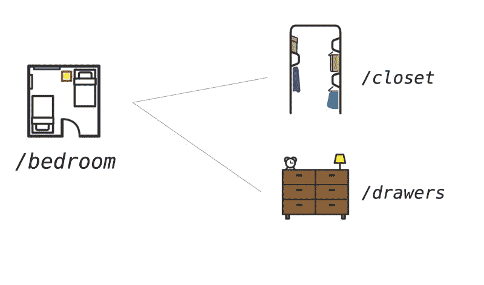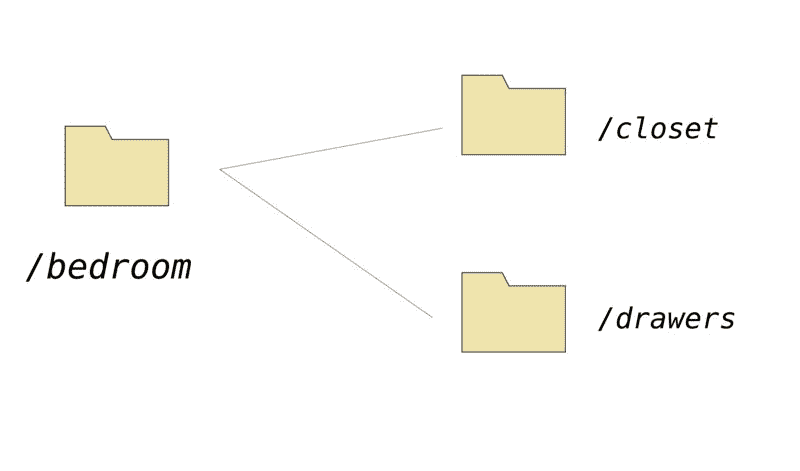

假设你穿西装上班。你的西装挂在壁橱里，而你的衬衫在抽屉里。你的西装就像一个 HTML 文件，而你的衬衫就像 CSS 文件。

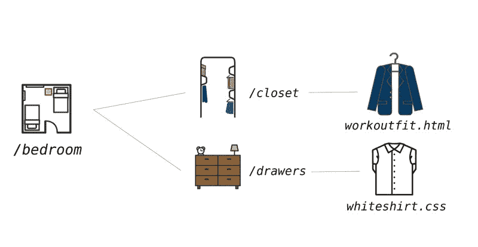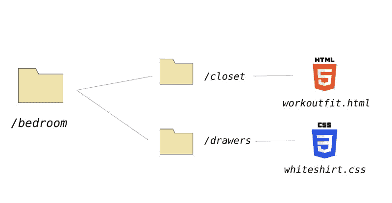

在这种情况下，“/卧室”是整个**目录**，而“/衣柜”、“/抽屉”是**子目录**。文件本身包含在子目录中。“/bedroom”是这里的**顶级**或**根**目录，因为它包含了我们的整个项目。

让我们想想你会怎么穿衣服。

1.  醒醒
2.  去衣柜里挑一套衣服
3.  离开壁橱
4.  去抽屉
5.  买一些可以搭配整套服装的衣服，比如有领衬衫和袜子

类似地，当您创建一个 HTML 文件时，您需要找到一种方法来连接您的 CSS 文件以添加样式。

1.  从 HTML 文件开始
2.  离开文件夹(如有必要)
3.  访问包含 CSS 文件的文件夹
4.  引用您将使用的特定 HTML 文件

这里有一个重要的提示。当您想要将一个 HTML 文件连接到一个 CSS 文件时，您可以从 HTML 文件本身开始文件目录的导航。就像挑选一套服装，你从一件衣服导航到另一件。你**不**从根目录开始。

下面是将 workoutfit.html 文件链接到白衬衫文件的代码。

```
<link rel="stylesheet" type="text/css" href="/drawers/whiteshirt.css">
```

以下是步骤。

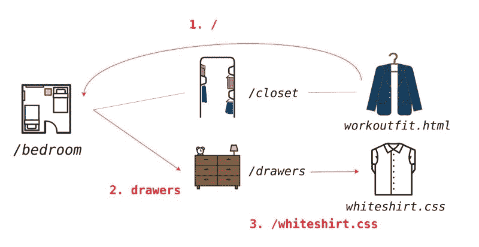

因此，将这条道路分成三个不同的部分可能更明智。

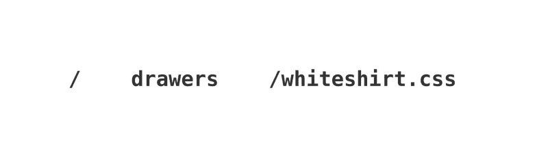

1.  **/** —将我们送回根文件夹
2.  **抽屉**–我们打开根文件夹中的抽屉文件夹
3.  **/whiteshirt.css** —这是我们想要连接的实际文件，在抽屉文件夹中

### 如何访问同一文件夹中的文件

大多数情况下，您会尝试从目录中的其他文件夹访问文件。随着项目的增长，这对于跟踪所有正在使用的不同文件尤为重要。

但有时，您会从同一个子目录中访问文件。当您的项目处于早期阶段时，这是很常见的—一个 HTML 文件、一个 CSS 文件和一个 JavaScript 文件(加上图像)。

在这种情况下，路径就简单多了。让我们回到卧室的例子，想象你也必须为你的服装挑选一条领带。那条领带也存放在壁橱里。

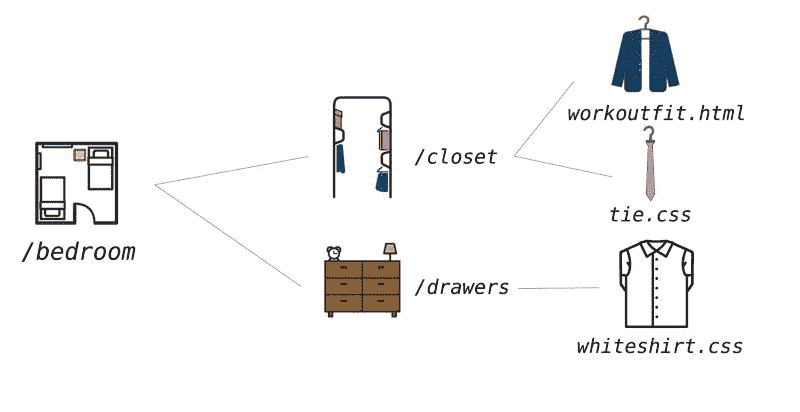

因此，我们现在想要将两个单独的样式表链接到我们的 HTML 文件。一个在同一个文件夹，一个在不同的文件夹。当许多 HTML 文件共享一个通用样式表时，这是常见的做法。

```
<link rel="stylesheet" type="text/css" href="tie.css"> <link rel="stylesheet" type="text/css" href="/drawers/whiteshirt.css">
```

注意 *tie.css* 没有任何前缀。文件路径只是文件名和后缀。这意味着该文件与 HTML 文件在同一个子目录中。这就像在你的衣柜里搜寻，然后抓住两件紧挨着的东西。

### 浏览目录的最后一种方法

一旦你的应用程序变大，你可能需要多层次的子目录来存储所有不同类型的脚本、样式表和图像。到目前为止，我们只介绍了一种导航方法:一路回到根目录，从那里访问文件。

但是，这可能会创建长的文件路径，并且当另一个人查看您的代码时，这可能会导致混乱和错误。

有时，一次向后移动一个子目录会更容易。“这是哪里../”前缀开始起作用。

让我们重新整理一下我们的壁橱，看看如何使用多层文件夹。现在，在我们的壁橱里，将有一个 *tierack* 文件夹来保存 *tie.css* 文件，还有一个*机库*文件夹来保存*workoutfit.html。*

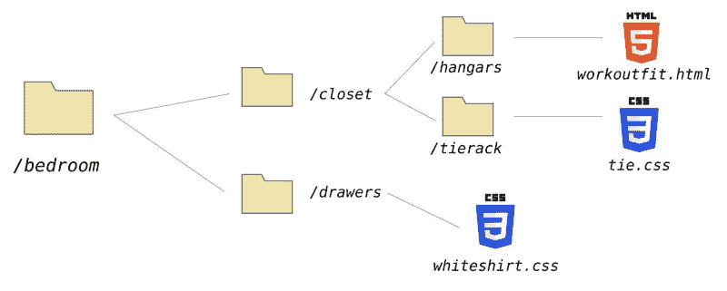

我们仍然希望将 tie.css 文件连接到 workoutfit.html。但是返回到根目录，然后一路向下导航到 *tierack* 文件夹，这没有什么意义。

相反，我们可以使用../前缀后退一个文件夹，然后导航到 tiereack。

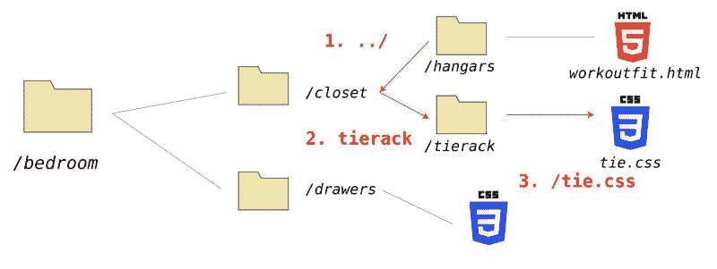

这是代码。

```
<link rel="stylesheet" type="text/css" href="../tierack/tie.css">
```

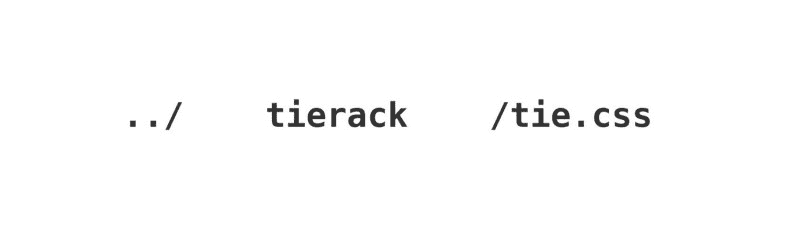

这使得我们的代码更容易维护。例如，如果我们在更高的层次上改变了目录结构的一部分会怎么样？那么我们所有的文件路径都会中断，我们将被迫进行寻宝游戏来找到所有中断的路径。这使得我们更有可能维护我们的代码。你甚至可以把多个串在一起。"../../”意味着您应该在您的目录中上升两个级别。

### 使用 Chrome 检查器查看实时网站

一旦你的网站上线，这些文件将使用相同的结构托管在服务器上。这意味着，如果这个结构在本地工作，它也应该在现场工作。

您可以使用 Chrome 检查器(或您选择的浏览器中的开发工具)来验证这一点。例如，如果您前往 codeanalogies.com，查看左上角的徽标，您会看到以下内容:

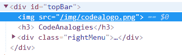

这意味着我将我的主站点徽标存储在一个名为 *img* 的文件夹中。它位于根文件夹的下一层。

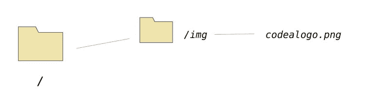

其他站点可能使用 CDN 来存储静态资产。你可以在这里了解更多信息。

### 获取更多可视化教程

你喜欢这本指南吗？给它一个“掌声”，或者在这里注册以获得我对 web 开发主题的最新视觉解释: