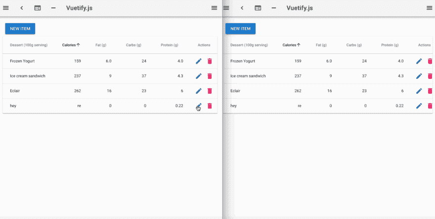

# 如何在 Vue.js 中构建实时可编辑的数据表

> 原文：<https://www.freecodecamp.org/news/how-to-build-a-real-time-editable-data-table-in-vue-js-46b7f0b11684/>

彼得·姆巴努戈

# 如何在 Vue.js 中构建实时可编辑的数据表


Photo by [Franki Chamaki](https://unsplash.com/photos/1K6IQsQbizI?utm_source=unsplash&utm_medium=referral&utm_content=creditCopyText) on [Unsplash](https://unsplash.com/search/photos/data?utm_source=unsplash&utm_medium=referral&utm_content=creditCopyText)

在数据驱动的应用程序中，数据表用于以表格格式显示数据，并能够就地编辑和删除记录。当你使用 [Vue](https://vuejs.org/) 时，有[不同的开源组件](https://github.com/vuejs/awesome-vue#table)可以用来轻松地将数据表添加到你的应用程序中。

如今许多应用程序都有实时功能，您可能想知道如何实时同步编辑和删除数据。对此有三种选择:

1.  使用 [WebSocket API](https://developer.mozilla.org/en-US/docs/Web/API/WebSockets_API) 。如果您的一些用户正在使用尚不支持 WebSocket 的浏览器，这不是一个好的选择。
2.  使用一个库，通过回退机制抽象出这些跨浏览器的差异，比如 [Socket。IO](https://socket.io/) 、[信号员](http://www.asp.net/signalr)和 [SockJS](https://github.com/sockjs/sockjs-client) 。使用这个选项，您必须管理处理大量打开的连接并处理伸缩的服务器。
3.  使用提供库的服务，该库与前一个选项做相同的事情，但是管理服务器并适当地伸缩。对于正在采用(或已经采用)无服务器方法的公司和团队来说，这是一个更好的选择。

我将向您展示如何使用 [Hamoni Sync](https://www.hamoni.tech/) 作为实时状态同步服务，在 Vue.js 中构建一个实时可编辑的数据表。下图显示了我们将构建的内容:



要继续学习，您需要对 Vue 有一些基本的了解。如果你对 Vue 一无所知，你可以阅读我的[上一篇文章](https://dev.to/pmbanugo/from-vanillajs-to-vuejs-a-guide-to-vue-essentials-5gii)来了解 Vue.js。你还需要以下工具:

1.  [Node.js & npm](https://nodejs.org/en/download/) (点击链接为你的操作系统下载安装程序)
2.  支持新的 Vue 项目。如果你没有这个，从命令行运行`npm install -g vue-cli@2.9.6`来安装它。

### 设置项目

我们将使用 Vue CLI 和来自 [Vuetify](https://vuetifyjs.com/en/) 的[模板](https://github.com/vuetifyjs/simple)来设置项目。打开命令行，运行命令`vue init vuetifyjs/simple realtime-datatable-vue`。您将被要求输入姓名和作者，所以在每个提示符下按 enter 键接受默认值。这将用一个单独的`index.html`文件搭建一个新的 Vue 项目。

该文件包含对 Vue 和 Vuetify 的脚本引用。Vuetify 是 Vue.js 的一个[材质设计](https://material.io/)组件。它有一个`v-data-table`组件，具有排序、搜索、分页、内嵌编辑、标题工具提示和行选择的功能。

### 添加数据表组件

用文本编辑器(或 IDE)打开文件`index.html`。将第 **50** 行的内容替换为以下内容:

```
<div>    <v-dialog v-model="dialog" max-width="500px">    <v-btn slot="activator" color="primary" dark class="mb-2">New Item</v-btn>    <v-card>        <v-card-title>        <span class="headline">{{ formTitle }}</span>        </v-card-title>        <v-card-text>        <v-container grid-list-md>            <v-layout wrap>            <v-flex xs12 sm6 md4>                <v-text-field v-model="editedItem.name" label="Dessert name"></v-text-field>            </v-flex>            <v-flex xs12 sm6 md4>                <v-text-field v-model="editedItem.calories" label="Calories"></v-text-field>            </v-flex>            <v-flex xs12 sm6 md4>                <v-text-field v-model="editedItem.fat" label="Fat (g)"></v-text-field>            </v-flex>            <v-flex xs12 sm6 md4>                <v-text-field v-model="editedItem.carbs" label="Carbs (g)"></v-text-field>            </v-flex>            <v-flex xs12 sm6 md4>                <v-text-field v-model="editedItem.protein" label="Protein (g)"></v-text-field>            </v-flex>            </v-layout>        </v-container>        </v-card-text>        <v-card-actions>        <v-spacer></v-spacer>        <v-btn color="blue darken-1" flat @click.native="close">Cancel</v-btn>        <v-btn color="blue darken-1" flat @click.native="save">Save</v-btn>        </v-card-actions>    </v-card>    </v-dialog>    <v-data-table :headers="headers" :items="desserts" hide-actions class="elevation-1">    <template slot="items" slot-scope="props">        <td>{{ props.item.name }}</td>        <td class="text-xs-right">{{ props.item.calories }}</td>        <td class="text-xs-right">{{ props.item.fat }}</td>        <td class="text-xs-right">{{ props.item.carbs }}</td>        <td class="text-xs-right">{{ props.item.protein }}</td>        <td class="justify-center layout px-0">        <v-btn icon class="mx-0" @click="editItem(props.item)">            <v-icon color="teal">edit</v-icon>        </v-btn>        <v-btn icon class="mx-0" @click="deleteItem(props.item)">            <v-icon color="pink">delete</v-icon>        </v-btn>        </td>    </template>    </v-data-table></div>
```

上面的代码添加了一个`v-dialog`组件，用于显示一个对话框来收集新记录的数据或编辑现有记录。此外，它还添加了呈现表格的`v-data-table`。我们需要定义这些组件使用的数据和方法。在第 **126** 行之后，将以下代码添加到数据属性中:

```
dialog: false,headers: [    {        text: 'Dessert (100g serving)',        align: 'left',        sortable: false,        value: 'name'    },    { text: 'Calories', value: 'calories' },    { text: 'Fat (g)', value: 'fat' },    { text: 'Carbs (g)', value: 'carbs' },    { text: 'Protein (g)', value: 'protein' },    { text: 'Actions', value: 'name', sortable: false }],desserts: [],editedIndex: -1,editedItem: {    name: '',    calories: 0,    fat: 0,    carbs: 0,    protein: 0},defaultItem: {    name: '',    calories: 0,    fat: 0,    carbs: 0,    protein: 0},listPrimitive: null
```

`desserts`数据属性将保存要在表格中显示的数据。属性`editedItem`将保存正在编辑的记录的值，而`editedIndex`将保存正在编辑的记录的索引。

在`data`属性定义之后，第 **189 行**之后添加以下属性:

```
computed: {    formTitle() {        return this.editedIndex === -1 ? 'New Item' : 'Edit Item'    }},
```

```
watch: {    dialog(val) {        val || this.close()    }},
```

我们添加了一个`computed`和`watch`属性。`computed`属性定义了`formTitle`，它根据`editedIndex`的值给对话框组件一个标题。属性`watch`观察`dialog`的值何时改变。如果值变为 false，它将调用函数`close()`，稍后将对其进行定义。

### Add Hamoni Sync

在这个连接处，我们需要添加 Hamoni Sync。它用于同步应用程序状态，并处理冲突解决，以避免一个用户覆盖另一个用户的数据。要使用 Hamoni Sync，您必须注册一个帐户和应用程序 ID。按照以下步骤在 Hamoni 中创建一个应用程序。

1.  注册并登录 Hamoni [仪表盘](https://dashboard.hamoni.tech/)。
2.  在文本字段中输入您首选的应用程序名称，然后单击创建按钮。这将创建应用程序，并将其显示在应用程序列表部分。
3.  单击“显示帐户 ID”按钮查看您的帐户 ID。


在第 **139** 行 Vuetify 的脚本引用下面，添加一个对 Hamoni Sync 的引用:

```
<script src="https://unpkg.com/hamoni-sync@0.4.0/hamoni.dev.js"><;/script>
```

然后，我们需要初始化 Hamoni 同步一旦 Vue 组件安装。在`watch`属性下添加一个`mounted`属性:

```
mounted: function () {    let hamoni = new Hamoni("ACCOUNT_ID", "APP_ID");
```

```
 hamoni.connect().then(() => {        hamoni          .get("vue-table")          .then(primitive => {            this.listPrimitive = primitive            this.desserts = [...primitive.getAll()]            this.subscribeToUpdate()          }).catch(error => {              if (error === "Error getting state from server") {                this.initialise(hamoni);              }              else {                 alert(error);              }          })    }).catch(alert)},
```

从上面的代码中，我们用一个帐户和应用程序 ID 初始化了 Hamoni Sync。用仪表板中的帐户和应用程序 ID 替换字符串占位符。然后通过调用返回承诺的`hamoni.connect()`连接到 Hamoni 服务器。

一旦连接上，我们就用存储在 Hamoni 中的州名调用`hamoni.get()`。为了从 Hamoni 中检索一个状态，它需要已经被创建，否则它将返回一个错误。我在这里做的是在 catch 块中处理这个错误，这样它调用另一个函数来初始化 Hamoni Sync 中的状态。

如果获取应用程序状态的调用成功，它将返回一个对象，该对象将用于修改该状态中包含的数据。这个对象被称为同步原语。有三种类型的同步原语:

1.  [值原语](https://docs.hamoni.tech/value-primitive.html):这种状态保存简单的信息，用字符串、布尔或数字等数据类型表示。它最适合于未读消息计数、切换等情况。
2.  [对象原语](https://docs.hamoni.tech/object-primitive.html):对象状态表示可以被建模为 JavaScript 对象的状态。一个示例用途可以是存储游戏的分数。
3.  [List 原语](https://docs.hamoni.tech/list-primitive.html):保存状态对象的列表。状态对象是 JavaScript 对象。您可以根据项目在列表中的索引来更新项目。

我们在这个例子中使用了 list 原语。我们调用`primitive.getAll()`来获取状态，并将其传递给`desserts`。之后，它调用函数`subscribeToUpdate()`。该函数将用于从 Hamoni Sync 订阅状态变化事件。

在第 **215** 行的`mounted`属性后添加以下代码:

```
methods: {  initialise(hamoni) {    hamoni.createList("vue-table", [      {        name: 'Frozen Yogurt',        calories: 159,        fat: 6.0,        carbs: 24,        protein: 4.0      },      {        name: 'Ice cream sandwich',        calories: 237,        fat: 9.0,        carbs: 37,        protein: 4.3      },      {        name: 'Eclair',        calories: 262,        fat: 16.0,        carbs: 23,        protein: 6.0      }    ]).then(primitive => {      this.listPrimitive = primitive      this.desserts = this.listPrimitive.getAll()      this.subscribeToUpdate();    }).catch(alert)  },
```

```
 subscribeToUpdate() {    this.listPrimitive.onItemAdded(item => {      this.desserts.push(item.value)    })
```

```
 this.listPrimitive.onItemUpdated(item => {      //update the item at item.index      this.desserts.splice(item.index, 1, item.value);    })
```

```
 this.listPrimitive.onItemDeleted(item => {      //remove the item at item.index      this.desserts.splice(item.index, 1);    })  },
```

```
 editItem(item) {    this.editedIndex = this.desserts.indexOf(item)    this.editedItem = Object.assign({}, item)    this.dialog = true  },
```

```
 deleteItem(item) {    const index = this.desserts.indexOf(item)    confirm('Are you sure you want to delete this item?') && this.listPrimitive.delete(index)  },
```

```
 close() {    this.dialog = false    setTimeout(() => {      this.editedItem = Object.assign({}, this.defaultItem)      this.editedIndex = -1    }, 300)  },
```

```
 save() {    if (this.editedIndex > -1) {      this.listPrimitive.update(this.editedIndex, this.editedItem)    } else {      this.listPrimitive.push(this.editedItem)    }
```

```
 this.close()  }}
```

上面的代码定义了我们到目前为止引用的函数。

`initialise()`函数创建名为`vue-table`的列表原语。

`subscribeToUpdate()`函数包含在列表原语中添加、更新或删除项目时要处理的代码。

`deleteItem()`函数通过用要删除的项目的索引调用`listPrimitive.delete(index)`来从列表原语中删除项目。

`save()`函数调用`listPrimitive.push(editedItem)`向 list 原语添加一个新项，并调用`listPrimitive.update(editedIndex, editedItem)`更新某个索引处的记录。

这是实现我们的实时可编辑数据表目标所需的所有代码。在浏览器中打开`index.html`文件，应用程序就可以使用了！


### 这是一个总结！

我们在 Vue.js 中构建了一个实时可编辑的数据表。 [Hamoni Sync](https://dev.to/pmbanugo/hamoni.tech) 使添加实时功能变得很容易。如果你使用构建系统和单个文件组件，那么 [Vuetify](https://vuetifyjs.com/en/) 和 [Hamoni Sync](https://www.npmjs.com/package/hamoni-sync) 都有 npm 包。你可以在 [GitHub](https://github.com/pmbanugo/realtime-datatable-vue) 上找到源代码。

### 资源

*   [Hamoni Sync](https://www.hamoni.tech/) ( [docs](https://dev.to/pmbanugo/docs.hamoni.tech) )
*   [消失](https://vuetifyjs.com/en/)
*   vista CLI
*   [vue . js 要领介绍](https://dev.to/pmbanugo/from-vanillajs-to-vuejs-a-guide-to-vue-essentials-5gii)