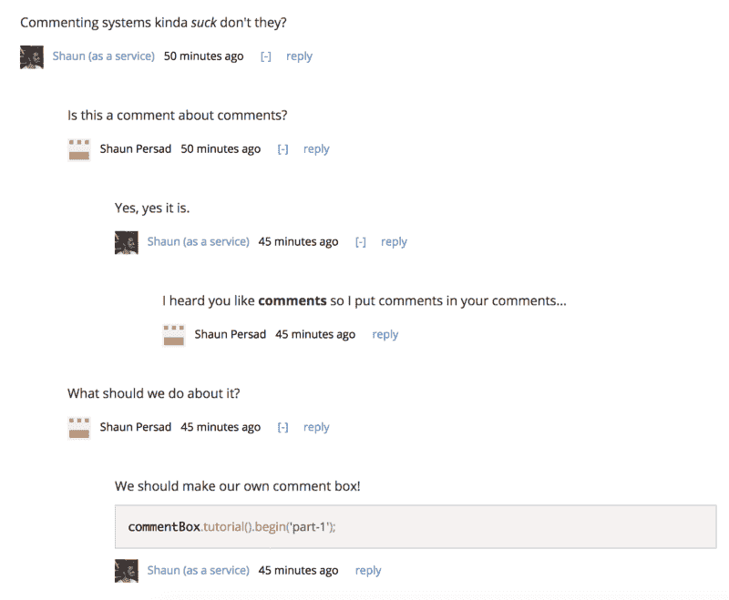
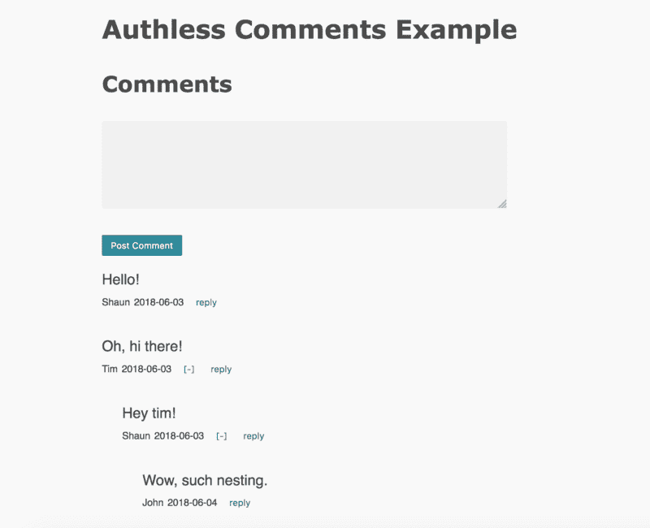

# 如何建立你自己的免费、无服务器的评论框

> 原文：<https://www.freecodecamp.org/news/how-you-can-build-your-own-free-serverless-comment-box-dc9d4f366d12/>

作者肖恩·珀塞德

# 如何建立你自己的免费、无服务器的评论框



Contentful 灵活的内容建模远远超出了博客文章。下面是如何利用 Contentful 和 Netlify 来创建一个易于调节和部署的嵌套评论系统。

### 动机

我发现大多数评论系统都…缺乏。Disqus 的渲染速度通常很慢，而且他们的用户跟踪行为也不是最好的。与此同时，脸书的评论插件相当不错，但当然仅限于脸书用户。

我真正想要的是像 Hacker News 和 Indie Hackers 这样的网站对嵌套评论和审核的本地速度和方法，但是我需要一个可以移植到多个项目的解决方案。

似乎没有合适的，所以我决定自己开发一个，并列出我想要的特性:

*   **免费**
*   **低准入门槛** —提交意见所需的最少步骤
*   **低维护** —无服务器，无需担心托管或扩展
*   **轻松审核** —使用仪表板对评论执行 *CRUD*
*   **性能** —超快出现在页面上
*   **灵活** —用户应该能够通过多个平台登录
*   **强大的** —注释应该具有智能格式功能
*   **高评论质量** —用户可以对评论投赞成票和反对票
*   **订阅** —用户可以在他们的评论得到回复时收到通知

在本系列的课程中，我们将构建一个包含上述各个方面的评论系统。

### 这个计划

我们的堆栈最初将包括:

*   [Contentful](https://www.contentful.com/) 作为数据库和审核仪表板
*   AWS Lambda via [Netlify](https://www.netlify.com/) 作为我们的后端
*   [在前端做出反应](https://reactjs.org/)

我们将创建一个 React 组件作为我们的注释框，并为它提供对 Contentful 进行 API 调用的能力，以便在必要时获取注释。它还能够对我们的 Lambda 函数进行 API 调用，向 Contentful 发布注释。

就项目而言，我们的 Lambda 函数将与我们的前端代码共存。前端和后端都将设置为通过 Netlify 持续部署。

对了，上面的栈都是免费的！嗯，大部分是。除非你要做超过 10，000 条评论，否则它是免费的。此外，我不隶属于任何这些公司…我只是喜欢他们的东西:)

### 10 秒内心满意足

如果你还不熟悉 Contentful 和[它是如何工作的](https://www.contentful.com/r/knowledgebase/contentful-101/)，它是一个“无头的”(API 驱动的)CMS。您可以使用不同的字段和字段类型对内容进行建模，然后基于这些模型创建内容。您可以按照自己喜欢的方式构建您的前端，并使用他们的 API 查询您的数据。超级灵活，他们的仪表盘用起来也挺好看的。这基本上是 CMS 有史以来最好的事情了？

我已经在用 Contentful 来写博客了，所以我想知道，它也可以托管评论吗？我很高兴地告诉大家，答案是肯定的！然而，我的愿望清单上的一些项目并没有完全用*来解决，只是用*来满足。但是不要担心，我们会实现的…在本系列的后续文章中。

我们将使用 Contentful，因为:

*   灵活的数据建模
*   便捷的 API
*   通过仪表板进行调节
*   你可能已经在你需要评论的网站/博客上使用它了

### 10 秒后起飞

我认为 Netlify 拥有迄今为止最令人愉快的前端应用部署体验。它链接到你的 GitHub repo，并设置你持续部署一个静态站点到 CDN 支持的主机。它们还有 [Netlify 函数](https://www.netlify.com/docs/functions/)，可以让你部署到 AWS Lambda，而没有任何在 AWS 中瞎折腾的痛苦。

你可以从[他们的文档](https://www.netlify.com/docs/#getting-started)开始，但是老实说，他们的仪表板非常容易使用和理解，我推荐[登录](https://app.netlify.com/)然后到处逛逛。

我们将使用 Netlify，因为:

*   无痛 AWS Lambda 集成
*   你可能已经在你需要评论的网站/博客上使用它了
*   如果您还没有使用它，您仍然可以将我们创建的 Lambda 函数部署到 AWS 本身

### 等等，不要“10 秒内做出反应”？

我不知道 10 秒钟是否足够做出公正的反应。如果你还没有学会，你应该学会！但是跳过冗余和通量的东西。很可能你不需要这些(但这是另一个话题了)。

### Contentful 中的内容建模

现在言归正传。

关于如何处理我们的用户，我们可以采取两种不同的方法:**无授权**和**登录**评论:

*   无授权——任何人都可以通过提供自己的名字来发表评论
*   已登录—只有在某些认证系统中经过认证的用户才能发表评论

我更喜欢登录评论，因为在我看来，对话往往更文明。另外，你倾向于完全避免垃圾邮件。另一方面，创建评论的门槛略高。

然而，我们将从无授权注释开始，因为它实现起来更简单。一旦我们开始尝试，我们将在第 2 部分中开始登录评论。

不管怎样，我们首先需要[创建一个内容模型](https://www.contentful.com/r/knowledgebase/content-modelling-basics/)来表示我们的评论。

对于无授权和登录方式，我们的评论内容模型也将保持基本相同，尽管稍后会对 **Author** 字段进行一些更改，如下所述。

### 评论内容模型

这是我们评论系统的核心模型。注释应该有四个字段:


The Contentful dashboard

**正文**

*   注释的实际正文
*   将此标记为条目标题
*   也可以随意设置其长度的最大值和/或最小值

**作者**

*   代表发表此评论的用户的唯一标识符。
*   对于无授权评论，您可以使用简短的文本，并在此字段中填写作者的姓名
*   对于已登录的评论，该字段将成为对即将推出的 CommentAuthor 模型的引用

**主题**

*   这些评论所属的博客文章的唯一 ID
*   它也可以是页面的 URL
*   为了获得最大的灵活性，我选择不假设您将博客文章存储在 Contentful 中，否则这将是一个引用字段而不是简短的文本

**ParentComment**

*   如果这个评论是对另一个评论的回复，我们将在这里引用那个评论
*   该字段使我们能够创建嵌套注释

### 实施无情的评论

对于这个实现，我们希望用户在能够发表评论之前输入他们的名字。我建议先通读以下步骤，然后在最后查看最终的演示项目，看看它们是如何组合在一起的。

### 前端

既然我们的评论模型已经完成，是时候创建我们的评论框了。好消息是我已经做了一个通用的“评论框”React 组件。它被设计成一个**低阶**组件，你可以在它周围包装一个**高阶**组件来处理获取和创建有内容的评论，以及其他特定于应用程序的业务逻辑。

您可以通过 npm 安装它和其他必需的软件包:

```
npm install react-commentbox contentful contentful-management --save
```

GitHub repo 有一个你可以传递给它的每个道具的列表，但是最低限度，我们将实现和传递这些:

*   `getComments`:返回承诺的函数，该承诺解析为一个注释数组，从最早的到最新的排序
*   `normalizeComment`:将您的注释数组映射到组件理解的对象的函数
*   `comment`:进行 API 调用以创建注释并返回承诺的函数
*   `disabled`:应禁用注释时设置为真
*   `disabledComponent`:禁用注释时要显示的组件

让我们创建更高级别的组件:

```
import React from 'react';import CommentBox from 'react-commentbox';
```

```
class MyCommentBox extends React.Component {
```

```
 state = { authorName: '', authorNameIsSet: false };
```

```
 onChangeAuthorName = (e) => this.setState({         authorName: e.currentTarget.value     });
```

```
 onSubmitAuthorName = (e) => {
```

```
 e.preventDefault();        this.setState({ authorNameIsSet: true });    };}
```

请注意，该组件负责设置作者的姓名。

顺便说一下，我们正在使用[transform-class-properties](https://babeljs.io/docs/plugins/transform-class-properties/)Babel 插件来避免繁琐的构造函数设置和函数绑定。你不需要使用它，但是它非常方便。

现在我们需要实现`react-commentbox`需要的业务逻辑道具。

我们将从从 Contentful 获取评论开始，并将它们规范化:

```
// fetch our comments from ContentfulgetComments = () => {
```

```
 return this.props.contentfulClient.getEntries({        'order': 'sys.createdAt',        'content_type': 'comment',        'fields.subject': this.props.subjectId,    }).then( response => {
```

```
 return response.items;
```

```
 }).catch(console.error);};
```

```
// turn Contentful entries to objects that react-commentbox expects.normalizeComment = (comment) => {
```

```
 const { id, createdAt } = comment.sys;    const { body, author, parentComment } = comment.fields;
```

```
 return {        id,        bodyDisplay: body,        userNameDisplay: author,        timestampDisplay: createdAt.split('T')[0],        belongsToAuthor: false,        parentCommentId: parentComment ? parentComment.sys.id : null    };};
```

接下来，我们需要进行 API 调用来创建注释:

```
// make an API call to post a commentcomment = (body, parentCommentId = null) => {
```

```
 return this.props.postData('/create-comment', {        body,        parentCommentId,        authorName: this.state.authorName,        subjectId: this.props.subjectId    });};
```

我们还需要在用户发表评论之前询问他们的姓名:

```
// will be shown when the comment box is initially disableddisabledComponent = (props) => {
```

```
 return (        <form             className="author-name"             onSubmit{ this.onSubmitAuthorName }        >            <input                type="text"                placeholder="Enter your name to post a comment"                value={ this.state.authorName }                onChange={ this.onChangeAuthorName }            />            <button type="submit">Submit</button>        </form>    );};
```

然后，通过将适当的道具传递给`react-commentbox`，在`render`中将所有这些集合在一起:

```
render() {
```

```
 return (        <div>            <h4>Comments</h4>            <CommentBox                disabled={ !this.state.authorNameIsSet }                getComments={ this.getComments }                normalizeComment={ this.normalizeComment }                comment={ this.comment }                disabledComponent={ this.disabledComponent }            />        </div>    );};
```

我们还将`disabled`道具设置为`true`，而作者的名字没有设置。这将禁用`textarea`，并显示我们制作的用于获取作者姓名的`disabledComponent`表单。

您可以在此查看完整的组件[。](https://github.com/shaunpersad/authless-comments-example/blob/master/src/components/MyCommentBox.jsx)

你可能已经注意到，我们新创建的`MyCommentBox`本身也需要一些道具:`subjectId`、`postData`和`contentfulClient`。

`subjectId`只是这些评论所针对的博客文章(或等效实体)的一些唯一的 ID 或 URL。

`postData`是一个进行 POST ajax 调用的函数。使用`fetch`，它可能看起来像这样:

```
function postData(url, data) {
```

```
 return fetch(`.netlify/functions${url}`, {        body: JSON.stringify(data),        headers: {            'content-type': 'application/json'        },        method: 'POST',        mode: 'cors' // if your endpoints are on a different domain    }).then(response => response.json());}
```

`contentfulClient`是您在使用 [contentful](https://www.npmjs.com/package/contentful) npm 包时获得的客户端实例(所以请确保您已经安装了它):

```
import { createClient } from 'contentful';const contentfulClient = createClient({    space: 'my-space-id',    accessToken: 'my-access-token'});
```

您可以在“共享空间设置”>“常规设置”下的内容丰富的仪表盘中获得您的共享空间 ID。

您可以从“空间设置”>“API 密钥”>“内容交付/预览令牌”>“添加 API 密钥”中获取您的访问令牌。

然后你可以在创建`MyCommentBox`时传入你的道具，如图[这里的](https://github.com/shaunpersad/authless-comments-example/blob/master/src/components/App.jsx)。

### 后端

我们将把我们的`/create-comment`端点实现为 AWS Lambda 函数。

#### 先决条件

为了能够构建、预览并最终部署这些功能，我们将使用方便的 [netlify-lambda](https://www.npmjs.com/package/netlify-lambda) npm 包。它允许您将 Lambda 函数作为常规 ES6 函数编写在特定的源目录中，然后以 Lambda 友好的方式构建它们，并将它们放在目标目录中，以备部署。更好的是，它还允许我们通过本地部署来预览这些功能。

因此，您需要创建一个特定的源目录来存储您的函数(例如`src/lambda`)，然后在根目录下创建一个`netlify.toml`文件。该文件至少应该如下所示:

```
[build] Functions = "lambda"
```

上面告诉了`netlify-lambda`将你构建的函数放在哪个目录中，这意味着它将在`src/lambda`中构建函数并将它们存储在`./lambda`中。此外，当需要部署时，Netlify 将在`./lambda`目录中查找以部署到 AWS。

要在本地运行 Lambda 函数，请使用以下命令:

```
netlify-lambda serve <source directory>
```

这将允许您在`[http://localhost:9000/{function-name}](http://localhost:9000/{function-name}.)` [上运行您的功能。](http://localhost:9000/{function-name}.)

这是默认行为，但它并不完全符合生产中会发生的情况，因为它在与我们的前端不同的域上运行我们的功能。在生产中，我们的功能将通过 URL `{domain}/.netlify/functions/{function-name}`在与我们的前端相同的域中可用。

为了在本地复制这种行为，我们需要代理从`/.netlify/functions/{function-name}`到`[http://localhost:9000/{function-name}](http://localhost:9000/{function-name}.)` [的前端调用。](http://localhost:9000/{function-name}.)

根据您的项目设置，完成此任务的方式会有所不同。我将介绍两种流行的设置:

对于 [create-react-app](https://github.com/facebook/create-react-app) 项目，将以下内容添加到您的`package.json`:

```
"proxy": {        "/.netlify/functions": {        "target": "http://localhost:9000",        "pathRewrite": {            "^/\\.netlify/functions": ""        }    }}
```

对于 [Gatsby.js](https://www.gatsbyjs.com/) 项目，将以下内容添加到您的`gatsby-config.js`中:

```
const proxy = require('http-proxy-middleware');...developMiddleware: app => {    app.use(        '/.netlify/functions/',        proxy({            target: 'http://lambda:9000',            pathRewrite: {                '/.netlify/functions/': '',            }        })    );},
```

对于大多数其他项目，您可以利用 webpack 的开发服务器，它有[代理支持](https://webpack.js.org/configuration/dev-server/#devserver-proxy)。

#### 编写我们的函数

在开始编写特定于 Lambda 的代码之前，我们将首先创建一个通用函数来处理我们的大部分逻辑。这样，我们的代码在 Lambda 之外仍然是可移植的。

让我们创建一个`createComment`函数:

```
const contentful = require('contentful-management');const client = contentful.createClient({    accessToken: process.env.CONTENTFUL_CONTENT_MANAGEMENT_ACCESS_TOKEN});
```

```
module.exports = function createComment(    body,     authorName,     subjectId,     parentCommentId = null) {
```

```
 return client.getSpace('my-space-id')        .then(space => space.getEnvironment('master'))        .then(environment => environment.createEntry('comment', {            fields: {                body: {                    'en-US': body                },                author: {                    'en-US': authorName                },                subject: {                    'en-US': subjectId                },                parentComment: {                    'en-US': {                        sys: {                            type: 'Link',                            linkType: 'Entry',                            id: parentCommentId                        }                    }                }            }        }))        .then(entry => entry.publish());};
```

你可以把上面的函数放在一个类似于`utils`目录的地方。它使用`[contentful-management](https://www.npmjs.com/package/contentful-management)` npm 包创建并发布一个新的评论条目，并返回一个承诺。注意，我们已经将管理 API 键指定为环境变量。你肯定不想硬编码那个。当部署到 Netlify 或任何其他地方时，一定要检查您的环境变量是否已设置。

您可以从 Contentful dashboard 的“空间设置”>“API 密钥”>“内容管理令牌”>“生成个人令牌”中获取管理访问令牌。

现在，让我们创建特定于 Lambda 的函数:

```
const createComment = require('../utils/createComment');
```

```
exports.handler = function (event, context, callback) {
```

```
 const { body, authorName, subjectId, parentCommentId } = JSON.parse(event.body);
```

```
 createComment(body, authorName, subjectId, parentCommentId)        .then(entry => callback(null, {            headers: {                'Content-Type': 'application/json'            },            statusCode: 200,            body: JSON.stringify({ message: 'OK' })        }))        .catch(callback);};
```

将这个函数放在您的 Lambda 源目录中，并用您希望 URL 所在的路径来命名文件，例如`create-comment.js`。这将使您的功能在 URL `/.netlify/functions/create-comment`可用。

### 整体情况

为了说明到目前为止我们完整的前端和后端设置，我创建了一个 create-react-app 项目,作为一个易于部署、功能齐全的示例。

注意，在示例项目的`netlify.toml`文件中，还有几行应该添加到您自己的文件中。`Command`告诉 Netlify 运行什么命令来构建项目。`Publish`告诉 Netlify，一旦构建完成，在哪里可以找到准备部署的静态资产。你可以在 Netlify 的[文档](https://www.netlify.com/docs/netlify-toml-reference/)中读到更多关于这个文件的信息。

通过 README 中方便的 deploy 按钮，该示例项目也可以很容易地克隆和部署到您自己的 Netlify 帐户中。

如果您已经在自己的项目中实现了这一点，请前往[Netlify 仪表板](https://app.netlify.com/)并按照他们简单明了的指示来设置您要部署的 repo。

一旦它开始运行，你就可以像老板一样发表评论了。

(注意:这只是一个截图，所以不要尝试点击它^_^)



### 直到下次

在第 2 部分中，我们将介绍如何实现登录注释，以及如何为我们的注释框提供一些超级酷的文本格式化功能。

感谢阅读！肖恩

*最初发表于[shaunasaservice.com](https://shaunasaservice.com/blog/build-your-own-free-serverless-comment-box-part-1-contentful-and-netlify/)。*