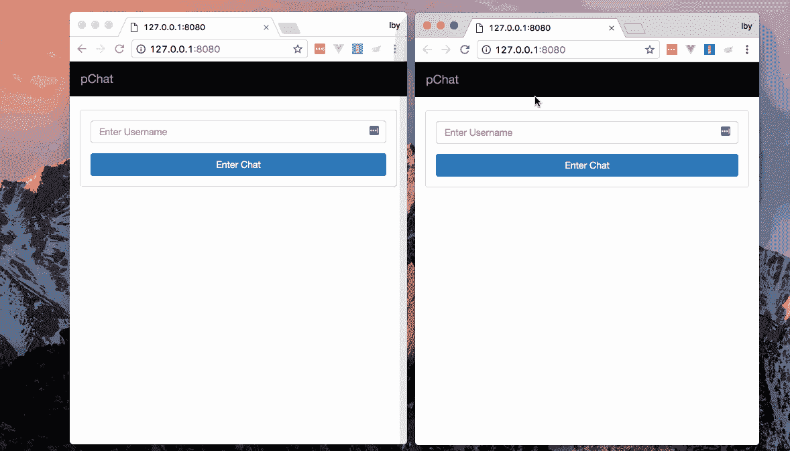
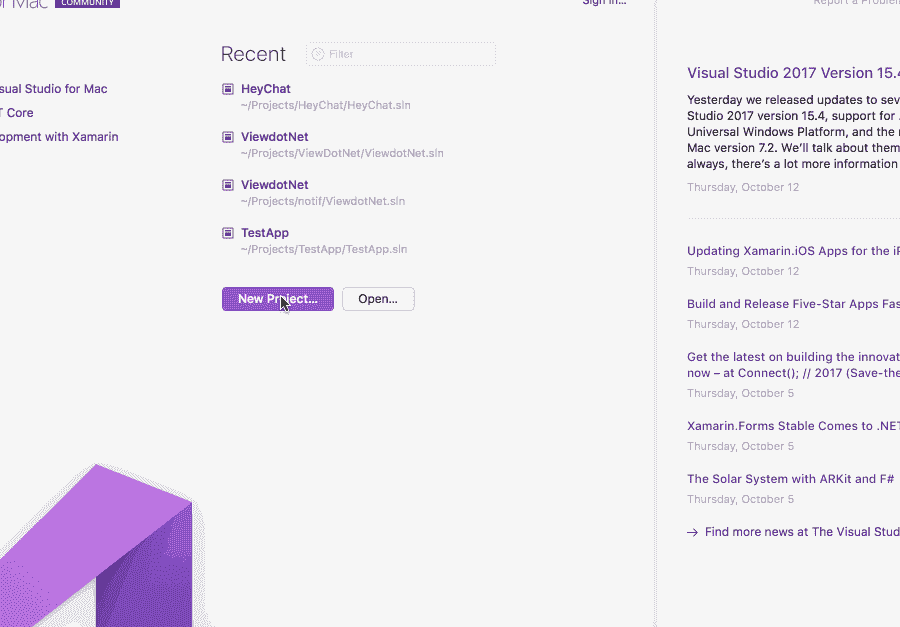
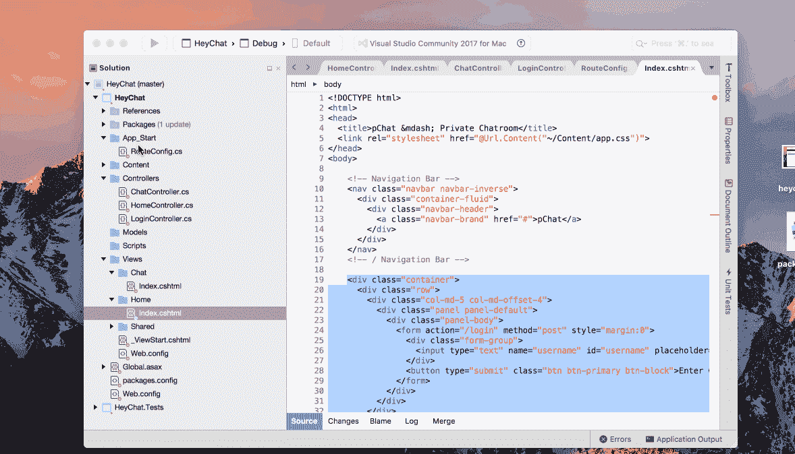

# 如何在 ASP.NET 为你的聊天应用建立一个打字指示器

> 原文：<https://www.freecodecamp.org/news/how-to-build-a-typing-indicator-for-your-chat-app-in-asp-net-2b008680a69a/>

作者:尼奥·伊戈达罗

# 如何在 ASP.NET 为你的聊天应用建立一个打字指示器


Photo by [freestocks.org](https://unsplash.com/photos/mw6Onwg4frY?utm_source=unsplash&utm_medium=referral&utm_content=creditCopyText) on [Unsplash](https://unsplash.com/search/photos/typing?utm_source=unsplash&utm_medium=referral&utm_content=creditCopyText)

> 阅读本教程需要对 ASP.NET 和 jQuery 有基本的了解。

当您使用聊天应用程序时，知道与您聊天的人何时在输入信息可以改善您的用户体验。它给你一些反馈，告诉你在谈话中你并不孤单，而且有一个信息正在向你走来。

在本教程中，我们将通过一些简单的步骤来使用 C#创建这个功能。网和推动器。

在本教程结束时，我们将会看到这样的内容:



本教程假设您事先了解:

*   C#
*   。净 MVC
*   JavaScript (jQuery)

你准备好了，我们就开始吧。

### 设置我们的项目

我们将使用 [Visual Studio](https://www.visualstudio.com/) ，这是一个广泛用于构建的 IDE。NET 项目。Visual Studio 2017 是免费的，可用于大多数操作系统。你可以在这里查看[的安装细节。](https://www.visualstudio.com/)

安装 Visual Studio 后，启动它并通过在仪表板上单击**新建项目**来创建一个新项目。跟随**新项目**向导我们:

*   将 C#设为我们的语言
*   选择。NET MVC 项目作为模板
*   填写项目名称(例如“HeyChat”，但是任何名称都可以)
*   填写解决方案名称(即应用程序名称—“hey chat”或任何名称都可以)。



### 编写服务器端(C#)代码

为了显示打字指示器，我们的聊天应用程序需要能够识别在任何给定时间谁在打字。为此，我们将添加一些有限形式的标识。我们根本不做任何认证，因为本教程不需要它。

> *？出于本教程的目的，我们将假设该聊天对所有用户开放。所有将需要的是，我们的用户在第一次进入时指定他们的名字。*

### 路线定义

我们可以定义制作该特征所需的一些路线，它们是:

*   一个 home route，它呈现带有用户名的第一个页面。
*   接受用户名的`POST`请求的登录路径。
*   呈现聊天视图的聊天路线。

> *？我们可能需要一些其他的路线，但这已经足够了。*

为了添加这些路由，我们打开应用程序的`App_Start`目录中的`RouteConfig.cs`文件。在其中，我们添加了我们定义的路线。

```
routes.MapRoute(        name: "Home",        url: "",        defaults: new { controller = "Home", action = "Index" }    );
```

```
 routes.MapRoute(        name: "Login",        url: "login",        defaults: new { controller = "Login", action = "Index" }    );
```

```
 routes.MapRoute(        name: "ChatRoom",        url: "chat",        defaults: new {controller = "Chat", action="Index"}    );
```

使用**家**路由作为示例，路由定义声明`/`请求将由在`Controllers/HomeController.cs`文件中找到的`HomeController`和该控制器的`Index`方法来处理。接下来，我们将创建我们需要的控制器。

### 创建控制器和动作方法

要创建一个新的控制器，右击**控制器**目录并选择`Add → Controller`。在生成的表单中，我们键入控制器的名称并选择空模板。

> *？当我们的应用程序被创建时，它默认包含一个带有 Index action 方法的 HomeController，因此我们将执行上述步骤来创建我们的 LoginController 和 ChatController。*

在我们的 LoginController 类中，我们创建了索引操作方法，在操作方法的顶部指定了`[HttpPost]`,以指示它处理`POST`请求。

```
public class LoginController : Controller    {        [HttpPost]        public ActionResult Index()        {
```

```
 }    }
```

LoginController 的 Index 操作将接收请求负载，从负载中读取用户名，并将其分配给当前用户会话。然后，它会将我们的用户重定向到聊天页面。当我们将它添加到我们的操作方法中时，我们将拥有:

```
public class LoginController : Controller    {        [HttpPost]        public ActionResult Index()        {            string user = Request.Form["username"];            if (user.Trim() == "") {                return Redirect("/");            }            Session["user"] = user;            return Redirect("/chat");        }    }
```

> *？在现实世界的聊天应用程序中，我们会将用户添加到数据库中，并将用户标记为已登录，以便其他用户可以看到可用的聊天选项。但是这超出了本教程的范围，所以添加一个会话就足够了。*

在我们的 ChatController 类中，我们将添加 Index action 方法。ChatController 的 Index 操作将呈现我们的聊天视图，并将当前用户传递给视图。

```
public class ChatController : Controller    {        public ActionResult Index()        {            if (Session["user"] == null) {                return Redirect("/");            }
```

```
 ViewBag.currentUser = Session["user"];
```

```
 return View ();        }    }
```

> *？默认情况下，action 方法处理 G `ET` 请求，所以我们不需要在方法的顶部添加[ `HttpGet]` 。我们还添加了一个简单的检查来防止没有登录用户访问聊天页面。*

别忘了我们的回家路线。在 HomeController 中，我们将添加代码来呈现首页。

```
public class HomeController : Controller    {        public ActionResult Index()        {            if ( Session["user"] != null ) {                return Redirect("/chat");            }
```

```
 return View();        }    }
```

> *？我们还添加了一个小检查来防止在同一个用户会话中多次登录。*

在这一点上，我们已经创建了控制器和方法来服务我们的视图(我们还没有创建)，所以试图运行它会给你一些错误！让我们解决这个问题。

### 实现应用程序的视图

基于我们目前定义的路线，我们需要两个视图:

*   带有登录表单的首页视图——由`HomeController`类的`Index`操作方法提供
*   将会看到打字指示器特性的聊天视图——由`ChatController` class' `Index`动作方法提供

#### 首页/登录页面

对于我们的首页，我们将创建一个带有表单的页面，要求用户输入用户名，并向他们显示一个提交登录的按钮。参考我们的控制器代码:

```
public class HomeController : Controller    {        public ActionResult Index()        {            if ( Session["user"] != null ) {                return Redirect("/chat");            }            return View();        }    }
```

> *？V**view**函数创建一个视图响应，我们返回这个响应。当调用 V**view()**时，C#寻找调用控制器类的默认视图。这个默认视图是在 V**views**目录中找到的 i `ndex.cshtml` 文件，该目录与控制器同名。也就是说，HomeController 类的默认视图将是 V `iews/Home/index.cshtml` 文件。*

为了创建我们的`HomeController`默认视图，我们:

*   右键单击视图目录并选择`Add New Folder`，
*   填写 **Home** 作为文件夹名称，
*   右键单击新创建的 **Home** 文件夹，选择`Add New View`，
*   填写视图名称(在我们的例子中是**索引**，选择`Razor`作为视图引擎，然后点击 OK。

现在我们已经创建了首页视图文件，我们将为登录表单添加标记。

```
<div class="container">      <div class="row">        <div class="col-md-5 col-md-offset-4">          <div class="panel panel-default">            <div class="panel-body">              <form action="/login" method="post" style="margin:0">                <div class="form-group">                  <input type="text" name="username" id="username"                       placeholder="Enter Username" class="form-control"                       required minlength="3" maxlength="15" />                </div>                <button type="submit" class="btn btn-primary btn-block">                  Enter Chat                </button>              </form>            </div>          </div>        </div>      </div>    </div>
```

#### 聊天页面

我们将按照与上面相同的步骤为聊天页面创建视图，但是使用`Chat`而不是`Home`作为我们的文件夹名称。

在聊天视图中，我们添加标记，为我们提供可用用户的侧栏和聊天区域。

```
<!DOCTYPE html>    <html>    <head>      <title>pChat — Private Chatroom</title>      <link rel="stylesheet" href="@Url.Content("~/Content/app.css")">    </head>    <body>            @{                var currentUser = ViewBag.currentUser;            }        <!-- Navigation Bar -->        <nav class="navbar navbar-inverse">          <div class="container-fluid">            <div class="navbar-header">              <a class="navbar-brand" href="#">pChat</a>            </div>            <ul class="nav navbar-nav navbar-right">              <li><a href="#">Log Out</a></li>            </ul>          </div>        </nav>        <!-- / Navigation Bar -->        <div class="container">          <div class="row">            <div class="col-xs-12 col-md-3">              <aside class="main">                <div class="row">                  <div class="col-xs-12">                    <div class="panel panel-default users__bar">                      <div class="panel-heading users__heading">                        Online Users (1)                      </div>                      <div class="panel-body users__body">                        <ul class="list-group">                        @if( @currentUser == "Daenerys" ) {                            <li class="user__item">                                <div class="avatar"></div> <a href="#">Jon</a>                            </li>                        } else if( @currentUser == "Jon") {                            <li class="user__item">                                <div class="avatar"></div> <a href="#">Daenerys</a>                            </li>                        }                        </ul>                      </div>                    </div>                  </div>                </div>              </aside>            </div>            <div class="col-xs-12 col-md-9 chat__body">              <div class="row">                <div class="col-xs-12">                  <ul class="list-group chat__main">                    <div class="row __chat__par__">                      <div class="__chat__ from__chat">                        <p>Did you see Avery's sword???</p>                      </div>                    </div>                    <div class="row __chat__par__">                      <div class="__chat__ receive__chat">                        <p>Err Looked normal to me...</p>                      </div>                    </div>                    <div class="row __chat__par__">                      <div class="__chat__ receive__chat">                        <p>maybe I'm a hater</p>                      </div>                    </div>                    <div class="row __chat__par__">                      <div class="__chat__ from__chat">                        <p>Lmaooo</p>                      </div>                    </div>                  </ul>                </div>                <div class="chat__type__body">                  <div class="chat__type">                    <textarea id="msg_box" placeholder="Type your message"></textarea>                  </div>                </div>                <div class="chat__typing">                  <span id="typerDisplay"></span>                </div>              </div>            </div>          </div>        </div>        <script src="@Url.Content("~/Content/app.js")"></script>        </body>    </html>
```

我们正在使用 [razor 模板引擎](https://en.wikipedia.org/wiki/ASP.NET_Razor)，它让我们能够读取从 C#代码传来的数据，并将它们分配给可以在我们的前端使用的变量。使用`@{ var currentUser = ViewBag.currentUser }`我们已经传入了当前用户的名字，这将很快派上用场。

> *？为了让事情变得简单快捷，我们假设只有两个可能的用户:D **埃内里斯**或 J **on。**因此，在使用剃刀@ `if{ }` 的情况下，我们将显示谁可以聊天。*

现在我们已经有了自己的视图，我们可以继续我们的输入指示器特性了！

### 实现打字指示器

#### 监听打字事件

在大多数聊天应用程序中，当有人打字时，该功能变得可见。为了实现它，我们将从使用 jQuery 监听聊天文本区域中的输入事件开始。我们还将把之前用 razor 定义的`currentUser`变量传递给我们的脚本。

```
var currentUser = @currentUser;
```

```
 $('#msg_box').on('keydown', function () {      //stub    });
```

我们在我们的输入区域为`keydown`事件添加了一个监听器，以帮助我们在有人输入时进行监控。

现在我们已经创建了我们的侦听器，我们将让它们向聊天的其他成员发送某人正在键入的消息。为此，我们将在 C#代码中创建一个端点来接收这个请求，并通过 Pusher 广播它。

我们将实现所有的客户端代码(假设我们的 C#端点存在，那么我们将在以后实际创建端点)。

> *？为了防止对 C#代码的过多请求，即在键盘上的每个键被按下或释放时发送请求，我们将使用去抖功能来抑制请求的发送。如果某个函数持续出现，这个去抖函数会暂时忽略它。*

```
// Debounce function    // Credit: https://davidwalsh.name/javascript-debounce-function
```

```
 // Returns a function, that, as long as it continues to be invoked, will not    // be triggered. The function will be called after it stops being called for    // N milliseconds. If `immediate` is passed, trigger the function on the    // leading edge, instead of the trailing.    function debounce(func, wait, immediate) {        var timeout;        return function() {            var context = this, args = arguments;            var later = function() {                timeout = null;                if (!immediate) func.apply(context, args);            };            var callNow = immediate && !timeout;            clearTimeout(timeout);            timeout = setTimeout(later, wait);            if (callNow) func.apply(context, args);        };    };
```

现在我们有了一个**去抖**函数，我们将为我们的`keydown`事件创建回调函数:

```
var isTypingCallback = debounce( function() {        $.post('/chat/typing', {            typer: currentUser,        });    }, 600, true);
```

并将回调传递给我们的事件侦听器。

```
$('#msg_box').on('keydown',isTypingCallback);
```

#### 创建由键入事件触发的端点

之前，我们让事件监听器向客户端的`/chat/typing`路由发送一个 **POST** 请求。现在我们将创建这个路由，它将使用[推送器](http://pusher.com)将输入事件传输给其他客户端用户。

首先，我们将在我们的`RouteConfig.cs`文件中为端点创建路由。

```
...    routes.MapRoute(        name: "UserTyping",        url: "chat/typing",        defaults: new { controller = "Chat", action = "Typing" }    );
```

> *？我们已经创建了这个端点，由 C **hatController 的 T**type**action 方法来处理。***

接下来，我们将在`ChatController`中创建我们的输入动作方法:

```
[HttpPost]    public ActionResult Typing()    {        //stub    }
```

### 使用 Pusher 实时更新我们的应用程序

我们的`/`` chat `/` typing` endpoint 将收到正在打字的用户的 post 有效负载。我们将使用[推进器](http://pusher.com)将此信息传递给其他所有人。

在我们的 Pusher [仪表板](https://dashboard.pusher.com/)上，我们将创建一个新的应用程序，填写所需的信息——应用程序名称、前端技术等等。如果你没有帐号，你可以免费注册。接下来，我们将使用. NET 的打包管理器 NuGet 在 C#代码中安装**推送服务器**包



> *？要安装这个包，我们右键单击 P**packages**目录，选择 a **dd Package 选项**，然后选择 P **usher Server** 包。*

然后，我们将把推送广播添加到我们的**输入**动作事件中。要使用 Pusher，我们必须将 **Pusher 服务器**名称空间导入到我们的代码中。

```
...    using PusherServer;
```

```
 namespace HeyChat.Controllers    {        public class ChatController : Controller        {          ...
```

```
 [HttpPost]          public ActionResult Typing()          {              string typer        = Request.Form["typer"];              string socket_id    = Request.Form["socket_id"];
```

```
 var options = new PusherOptions();              options.Cluster = "PUSHER_APP_CLUSTER";
```

```
 var pusher = new Pusher(              "PUSHER_APP_ID",              "PUSHER_APP_KEY",              "PUSHER_APP_SECRET", options);
```

```
 pusher.TriggerAsync(              "chat",              "typing",              new { typer = typer },              new TriggerOptions() { SocketId = socket_id });
```

```
 return new HttpStatusCodeResult(200);          }         ...
```

我们使用我们的 **PUSHER_APP_ID** 、 **PUSHER_APP_KEY** 、 **PUSHER_APP_SECRET** 和 **PUSHER_APP_CLUSTER** 来初始化 Pusher(确保用您的仪表板中的实际值来替换它们)。然后我们通过`chat`通道广播一个包含**typer** *的对象，它是在`typing`事件上输入*的人。

> *？我们在 Pusher t **riggerAsync** 函数中添加了 n `ew TriggerOptions() { SocketId = socket_id }` 。这是为了防止广播的发送者也接收广播。为此，我们假设我们在有效载荷中接收 s `ocket_id` 和 t `yper,`，因此在客户端，我们将把它添加到发送的有效载荷中。*

现在，每当有一个输入事件，我们的 C#代码就在 Pusher 上广播它。剩下的就是收听该广播并显示 xxxx 正在输入…’特征。

首先，我们将使用我们的 **PUSHER_APP_KEY** 和 **PUSHER_APP_CLUSTER** 在我们的聊天页面的脚本部分初始化 Pusher(同样，用您的仪表板中的值替换它们)。

```
var pusher = new Pusher('PUSHER_APP_KEY', {        cluster:'PUSHER_APP_CLUSTER'    });
```

为了实现我们前面提到的广播者豁免，我们将从我们的客户端`pusher`实例中获取套接字 id，并修改我们的有效负载，以便将它包含在对服务器的输入请求中。

```
var socketId = null;    pusher.connection.bind('connected', function() {      socketId = pusher.connection.socket_id;    });
```

```
 var isTypingCallback = debounce( function() {        $.post('/chat/typing', {            typer: currentUser,            socket_id: socketId // pass socket_id parameter to be used by server        });    }, 600, true);
```

现在 Pusher 已经在我们的客户端初始化了，我们将订阅聊天频道，并使用传递的`typer`实现我们的特性。

```
var channel = pusher.subscribe('chat');
```

```
 channel.bind('typing', function(data) {        $('#typerDisplay').text( data.typer + ' is typing...');
```

```
 $('.chat__typing').fadeIn(100, function() {            $('.chat__type__body').addClass('typing_display__open');        }).delay(1000).fadeOut(300, function(){            $('.chat__type__body').removeClass('typing_display__open');        });    });
```

### 结论

在本教程中，我们已经使用 Pusher 实现了流行的类型指示器特性。NET，C#代码和一些 jQuery。我们还看到了如何广播消息并避免发送者对他们发送的消息做出响应。

这个帖子最早发布给[推手](https://pusher.com/tutorials/typing-indicator-aspnet/)。