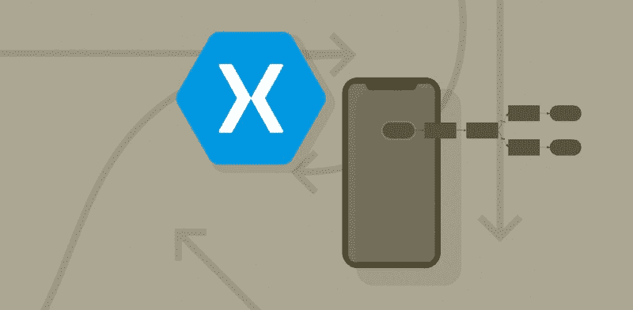

# 如何实现 Xamarin？使用代理和协调员的表单导航

> 原文：<https://www.freecodecamp.org/news/xamarin-forms-navigation-using-delegates-and-coordinator-a01fb7e3c120/>

拉斐尔的画

# 如何实现 Xamarin？使用代理和协调员的表单导航

最近我一直在思考如何在一个 Xamarin 中最好地实现页面导航。窗体移动应用程序。我对这个话题的深入研究始于一位同事发给我的一篇名为[协调者](http://khanlou.com/2015/10/coordinators-redux/)的文章，作者是[索罗什·坎卢](http://khanlou.com/)。最初，我是协调员队伍中一名非常快乐的乘客。我想我现在也是。对于 UI/UX 和一般导航来说，这是一个考虑和实现[关注点分离](https://en.wikipedia.org/wiki/Separation_of_concerns) 的好方法。

以下笔记代表了我对这个主题的想法，关于在 Xamarin 中实现的学习。表单，以及 C#中的**委托**如何有所帮助。

### 为什么是协调员？

Soroush 的解决方案主要关注过度填充的视图控制器的问题(引用 iOS UIViewController 作为主要示例)，并建议协调器的主要职责应该是接管导航和模型变化。他指出:

> 当我们将这些任务从视图控制器中取出时，我们最终得到了一个*惰性*的视图控制器。它可以被呈现，它可以获取数据，为呈现而转换数据，显示数据，但关键是它不能改变数据。

这很好。这就是我们想要的。这意味着我们可以在多个工作流中重用我们的视图控制器作为参与者，并为每个工作流建立专门的协调器。我们的页面和视图模型——在我们的 MVVM 应用程序中——将不再有混乱的导航问题。

考虑这个常见的场景。让我们假设你的应用包括一个登录页面。用户完成登录页面后，您的应用程序会显示一个仪表板页面。然后，在应用程序的后期设计中，您决定不是所有页面都需要登录。如果您想在其他地方重用该登录页面，并根据触发登录的工作流转到不同的登录后页面，该怎么办？

显而易见的(也是丑陋的)解决方案是开始用条件逻辑(通常以 IF/THEN 语句的形式)处理页面或查看模型。这永远无法扩展，在大型应用程序中，您最终会得到非常脆弱的代码。

### 救援协调人。

当我开始用 Xamarin 实现协调器的实验时。表单，我心中有几个设计目标。

首先，这与 MVVM 无关。我不想为 Xamarin 实现另一个 MVVM 框架。此外，导航不是 MVVM 关心的问题。我断言视图模型(和页面)不应该知道应用程序中的其他视图模型(和页面)。

其次，协调者不应该知道任何关于支持页面的底层视图模型的事情。我的愿望是一个协调员简单地启动页面，并对这些页面暴露的**钩子**做出响应。这有点类似于 [webhooks](https://en.wikipedia.org/wiki/Webhook) 的想法(稍后会详细介绍)。

第三，我希望实现简单明了，没有很多对象的强制，也没有减少任何使 RAD 具有 Xamarin 的特性。形式如此神奇。

### 救援代表。

在开始构建协调器之前，我们必须首先解决每个 MVVM 项目都会出现的一个基本问题。具体来说，处理 UI 交互的视图模型如何向工作流发出信号，表明它已经完成了预定的任务？

使用我前面提到的登录示例，视图模型如何通知用户成功登录(或不成功)，并将生成的访问令牌和用户信息传递给实例化页面的工作流？更重要的是，视图模型如何发布这些信息？有没有一个契约可以不需要通过大量的代码来检查？

对我来说，解决方案是使用[委托](https://docs.microsoft.com/en-us/dotnet/csharp/language-reference/keywords/delegate)。在 C#中，**委托**是一个引用类型变量，它保存对方法的引用。委托类似于 C++中的函数指针。但是，委托是类型安全的。使用委托，我创建了**钩子**，调用者可以用它来参与和影响工作流。

例如，在我的 LoginViewModel 中，我声明了一个委托定义，如下所示:

我将它添加到名称空间中，就在我的 LoginViewModel 类的实际声明之上。这定义了委托的模式，而不是实际的实现。它告诉程序员这个视图模型将在登录完成时执行回调，并定义将传递什么参数。在我的 LoginViewModel 中，我公开了这种类型的属性。这个视图模型的用户可以将*附加到它上面，以便在登录完成时得到回调。*

在 LoginViewModel 中，没有此委托的实现。相反，视图模型的调用者将实现该方法——通常作为匿名方法或 lambda——创建一种回调(或 **webhook** )模式。

LoginViewModel 中还有一个 **ICommand** 的实现，当按下登录按钮时会调用它。登录成功后，我们就是在这个命令中调用委托的。下面是命令实现的一个片段。我省略了许多与异常处理等相关的样板代码。

注意最后一行，它调用了委托。还要注意[的空条件](https://docs.microsoft.com/en-us/dotnet/csharp/language-reference/operators/null-conditional-operators)。仅当委托存在时才调用它。所以让我们看看如何使用它。

### 穿过钩子。

我们还没有完全准备好创建我们的协调员。但是我们已经解决了一个主要的设计目标。我们已经为我们的视图模型定义了一个策略，向任何关心的人公开重要的生命周期事件。继续以 LoginViewModel 为例，我们可以如下挂钩:

简单。上面演示了我们如何创建一个匿名方法，它将被我们的视图模型调用。该方法将接收访问令牌和用户对象，这样我们就可以用它做一些重要的事情，比如存储数据和导航到下一页。这就是我们的协调员发挥作用的地方。他们会用这些钩子做一些重要的事情。

### 代码隐藏页面呢？

之前我说过我们已经为视图模型定义了一个策略，向任何关心的人公开重要的生命周期事件。问题是:到底谁关心登录何时完成？好吧，我们尚未确定的*坐标会在意。但是，回想一下我的第二个设计目标:*

> 协调员不应该了解支持页面的底层视图模型。

我已经决定这将是一个不可更改的规则。我的协调员知道组成工作流的页面，但不知道这些页面的视图模型或与之交互。事实上，我的代码隐藏页面将它们的视图模型创建为受*保护的*属性。因此，为了保持契约的整洁，我的代码隐藏页面只是中继委托调用。例如，我的 LoginPage 代码隐藏如下所示:

请注意，代码隐藏页面将自己注册为对来自视图模型的回调感兴趣的对象(第 12 行)，然后——因为代码隐藏不关心自己的导航问题——它只是将回调传递给自己的委托(第 13 行)。

这似乎是多余的，但它有实际应用。首先，这意味着视图模型可以公开代码隐藏页私有的委托方法。其次，这意味着协调器和页面之间存在非常松散的耦合。

### Xamarin 协调器实现

有了这个想法，我的第三个设计目标是…

> 我希望实现简单明了，没有很多对象的强制，也没有减少任何使 RAD 具有 Xamarin 的特性。形式如此神奇。

…我决定页面可以独立存在，也可以附加协调员。我花了一段时间才做出这个决定。实际上，我首先从协调者优先的设计方法开始，即一切都由协调者驱动。我很快发现这非常有限而且超级复杂。它需要一个复杂的 push/pop 伪导航管理器，并且限制了我轻松使用 TabbedPages、MasterDetailPages 和 modals 的能力。我还发现自己在视图模型中加入了导航逻辑。我不喜欢它。

因此，我选择了页面优先的方法，即页面可以有一个附属的协调器。这解决了与垃圾收集相关的一个大问题，因为 Xamarin。Forms framework 已经基于可见性生命周期处理页面的保留和处理。如果我采用协调者优先的方法，我将不得不自己添加一堆难看的逻辑来管理堆栈。

使用页面优先的方法，您可以像平常一样创建页面，并且可以通过页面构造函数传递(附加)一个协调器。对于登录页面，它看起来像这样:

这种方法的好处是，我还可以在 XAML 安插一名协调员。这在 MasterDetailPage 或 TabbedPage 的情况下尤其有用，在这种情况下，您通常不会在代码中创建实例。比如:

在我们进入机制之前，让我们看一下 LoginCoordinator 的实现。具体来说，我们将关注这个协调者承担什么责任，这些都封装在协调者的 Start()方法中。这就是所有神奇之处——导航逻辑——发生的地方。

在我们进一步讨论之前，让我简单解释一下这个应用的一部分业务逻辑。在这个应用程序(专为音乐人打造)中，每个用户都可以属于一个或多个乐队。因此，在认证(登录)之后，用户会看到他们的乐队列表。用户然后选择一个，应用程序然后完成登录工作流，并显示登录后主详细信息页面。

因此，这个 LoginCoordinator 实际上编排了两个独立页面的呈现 LoginPage 和 BandPickerPage。每个页面都可以独立使用，也可以作为其他工作流的一部分。

例如，当用户想要在他们的活跃波段之间切换而无需再次登录时，BandPicker 页面用于应用程序的另一部分。BandPicker 页面完全不知道它是如何被使用的。它只需要专注于它所做的事情——挑选乐队。

### 框架的东西

协调器本身的实现非常容易。在我的方法中，有一个接口(称为 ICoordinator)和一个部分实现该接口的抽象基类。界面看起来像这样:

每个协调器只需要实现 Start()方法。另外两个方法——AttachToPage()和 DetachFromPage() —在抽象基类中实现。看起来是这样的:

应用程序的协调者只需要扩展这个基类并覆盖 Start()方法。差不多就是这样。**框架**只有另外一个部分，它是 ContentPage 子类的简单基类。它只是调用传递给构造函数的协调器的 AttachToPage()和 DetatchFromPage()方法。就是这样。

### 摘要

非常感谢 Soroush Khanlou 的灵感。我很想听听你们是如何在自己的 Xamarin 项目中使用协调器的，以及你们对我在这里介绍的实现有什么改进的想法。

你可以从 GitHub 下载我的示例应用程序。