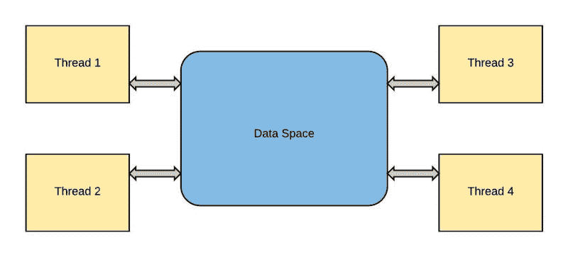
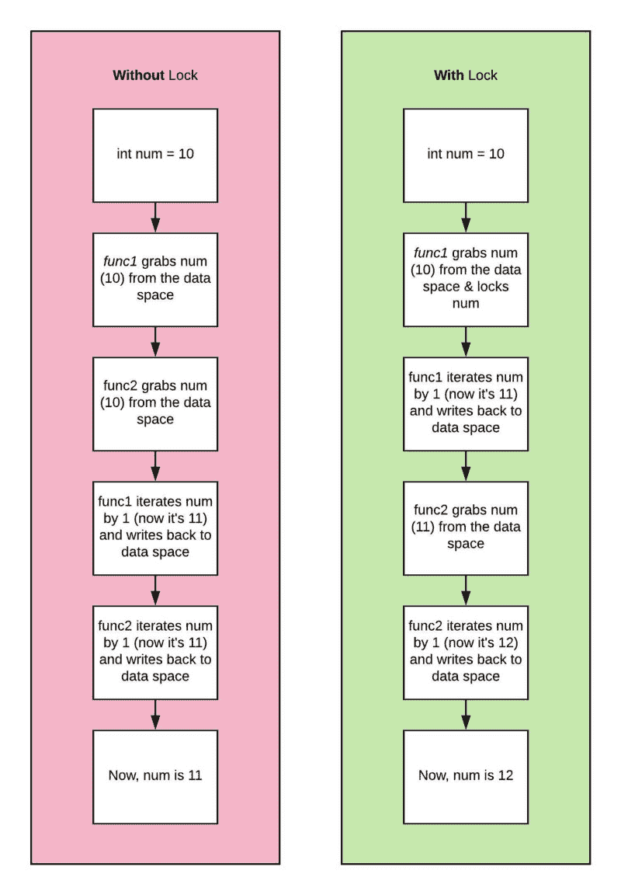

# Python 中的多重处理与多线程:你需要知道的。

> 原文：<https://www.freecodecamp.org/news/multiprocessing-vs-multithreading-in-python-what-you-need-to-know-ef6bdc13d018/>

木材。木卫一

# Python 中的多重处理与多线程:你需要知道的。


Photo by [Josep Castells](https://unsplash.com/@paniscusbcn?utm_source=medium&utm_medium=referral) on [Unsplash](https://unsplash.com?utm_source=medium&utm_medium=referral)

#### 什么是线程？你为什么想要它？

Python 是一种线性语言。然而，当您需要更多的处理能力时，线程模块就派上了用场。

Python 中的线程不能用于并行 CPU 计算。但是对于 I/O 操作，比如 web 抓取，它是完美的，因为处理器空闲着等待数据。

线程化改变了游戏规则，因为许多与网络/数据 I/O 相关的脚本花费大部分时间等待来自远程数据源的数据。

因为下载可能没有链接(例如，如果您正在抓取不同的网站)，处理器可以从不同的数据源并行下载，并在最后合并结果。

对于 CPU 密集型进程，使用线程模块没有什么好处。



标准库中包含线程:

```
import threading from queueimport Queueimport time
```

您可以使用`target`作为可调用对象，`args`向函数传递参数，`start`启动线程。

```
def testThread(num):    print numif __name__ == '__main__':    for i in range(5):        t = threading.Thread(target=testThread, arg=(i,))        t.start()
```

如果你以前从未见过`if __name__ == '__main__':`，它基本上是一种确保嵌套在其中的代码只有在脚本直接运行(而不是导入)时才会运行的方法。

#### 勇闯夺命岛

您通常希望您的线程能够使用或修改线程之间的公共变量。要做到这一点，你必须使用一种叫做`lock`的东西。

每当一个函数想要修改一个变量，它就锁定该变量。当另一个函数想要使用一个变量时，它必须等到该变量被解锁。



想象两个函数都用 1 迭代一个变量。锁允许您确保一个函数可以访问变量，执行计算，并在另一个函数可以访问同一个变量之前写回该变量。

您可以使用打印锁来确保一次只有一个线程可以打印。这可以防止打印时文本变得混乱(并导致数据损坏)。

在下面的代码中，我们有 10 个想要完成的任务和 5 个将要完成该任务的工人:

```
print_lock = threading.Lock()def threadTest():    # when this exits, the print_lock is released    with print_lock:        print(worker)def threader():  while True:    # get the job from the front of the queue    threadTest(q.get())    q.task_done()q = Queue()for x in range(5):    thread = threading.Thread(target = threader)    # this ensures the thread will die when the main thread dies    # can set t.daemon to False if you want it to keep running    t.daemon = True    t.start()for job in range(10):    q.put(job)
```

#### 多线程并不总是完美的解决方案

我发现许多向导倾向于跳过使用他们刚刚试图教你的工具的负面影响。理解使用所有这些工具的利弊是很重要的。例如:

1.  管理线程会带来开销，所以您不希望将它用于基本任务(如示例)
2.  线程增加了程序的复杂性，这使得调试更加困难

### 什么是多重处理？和线程化有什么不同？

如果没有多重处理，Python 程序会因为`GIL`(全局解释器锁)而难以最大化系统规格。Python 的设计没有考虑到个人电脑可能有不止一个内核(这显示了这种语言有多古老)。

GIL 是必要的，因为 Python 不是线程安全的，并且在访问 Python 对象时有全局强制锁。尽管并不完美，但这是一种非常有效的内存管理机制。我们能做什么？

多重处理允许你创建可以并行运行的程序(绕过 GIL ),并使用整个 CPU 内核。尽管它与线程库有着本质的不同，但语法非常相似。多重处理库为每个进程提供了自己的 Python 解释器，以及自己的 GIL。

因此，与线程相关的常见问题(如数据损坏和死锁)不再是问题。由于进程不共享内存，它们不能同时修改同一个内存。

#### 我们开始吧

```
import multiprocessingdef spawn():  print('test!')if __name__ == '__main__':  for i in range(5):    p = multiprocessing.Process(target=spawn)    p.start()
```

如果您有一个共享的数据库，您希望确保在开始新的进程之前等待相关进程完成。

```
for i in range(5):  p = multiprocessing.Process(target=spawn)  p.start()  p.join() # this line allows you to wait for processes
```

如果您想向流程传递参数，可以使用`args`来完成:

```
import multiprocessingdef spawn(num):  print(num)if __name__ == '__main__':  for i in range(25):    ## right here    p = multiprocessing.Process(target=spawn, args=(i,))    p.start()
```

这里有一个简单的例子，因为数字不会按照你期望的顺序出现(没有`p.join()`)。

#### 缺点

和线程一样，多重处理也有缺点…你必须选择你的毒药:

1.  数据在进程间来回移动会产生 I/O 开销
2.  整个内存被复制到每个子进程中，这对更重要的程序来说是一个很大的开销

### 结论

什么时候应该使用多线程还是多处理？

*   如果您的代码有大量的 I/O 或网络使用，多线程是您的最佳选择，因为它的开销很低。
*   如果你有一个 GUI，使用多线程，这样你的 UI 线程就不会被锁定。
*   如果你的代码是 CPU 受限的，你应该使用多重处理(如果你的机器有多个内核)

免责声明:我们是一家伐木公司。如果你试用我们的产品，我们会很高兴的(真的很棒！)，但我们要宣传的也就这些了。

如果你有兴趣在你的收件箱里收到更多来自 Timber 的帖子，请随意在这里注册。我们承诺不会有垃圾邮件，只是每周的伟大内容。


*最初发表于 [timber.io](https://timber.io/blog/multiprocessing-vs-multithreading-in-python-what-you-need-to-know/) 。*