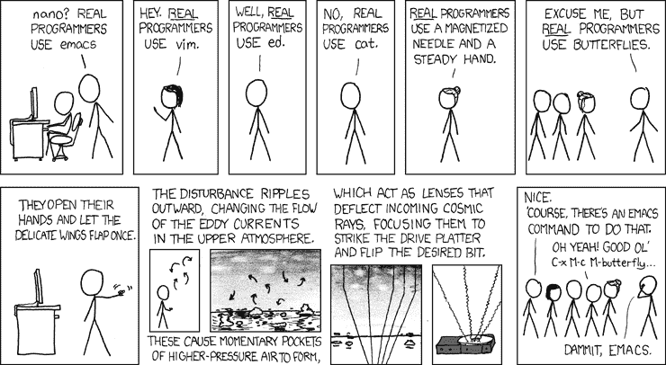

# 学习编码，艰难的方式

> 原文：<https://www.freecodecamp.org/news/learn-to-code-the-hard-way-65dece5b0005/>

#### 这些快速的技巧将使学习编码变得尽可能困难和没有回报！*

警告:包含讽刺…

### 1.选择一门非常难的语言

一定要选择难的编程语言。这将真正阻碍您的学习代码之旅，甚至在它开始之前。

不要在这里冒险。你可能听过一些人说 C++或 Java 对初学者来说很有挑战性。但是，即使是这些也可以通过一点额外的耐心和毅力来掌握。

也许你可以学一门老式的语言，比如 [COBOL](https://thenextweb.com/finance/2017/04/10/ancient-programming-language-cobol-can-make-you-bank-literally/) 或者 [PL/I](https://en.wikipedia.org/wiki/PL/I) 。或者像[汇编](https://www.tutorialspoint.com/assembly_programming/assembly_introduction.htm)，甚至[机器码](https://en.wikipedia.org/wiki/Machine_code)这样真正低级的东西呢？

当然，为什么不试试深奥的语言，比如 [Malbolge](https://esolangs.org/wiki/Malbolge) 或 [Befunge](https://esolangs.org/wiki/Befunge) 或[intercale](https://esolangs.org/wiki/INTERCAL)？从这些语言中的一种开始会让你倒退几年。另外，他们缺乏工作前景会彻底打击你的积极性。

无论你做什么，*不要* [**选择一种现代的、可访问的和通用的语言，比如 JavaScript 或 Python 或 Ruby**](https://medium.freecodecamp.org/best-programming-languages-to-learn-in-2018-ultimate-guide-bfc93e615b35) **。**

他们可能非常需要 ，并且在网上有无数的免费学习资源****。他们可能有一个大的、支持性的学习者群体。****

**但是，在这一切中，奋斗在哪里呢？**

**

If learning to code doesn’t make you melancholy, you’re doing it wrong. Photo by [Ethan Sykes](https://unsplash.com/@e_sykes?utm_source=medium&utm_medium=referral) on [Unsplash](https://unsplash.com?utm_source=medium&utm_medium=referral).** 

### **2.建立一个噩梦般的编码环境**

**您可能听说过各种文本编辑器和 ide(集成开发环境),可以免费下载或试用。例子包括 Sublime、Atom、VSCode、IntelliJ、… [以及除了](https://www.slant.co/topics/1686/~javascript-ides-or-editors)之外的很多。**

**有些人认为这些可以让编写代码更加方便和高效。别理这些人。**

**当然… **自动补全，语法高亮，代码林挺，以及访问各种扩展包** **所有的** *听起来*像是它们会**让编码更容易**。但现实完全不同。真正知道如何写软件的人不需要使用它们。**

**这些编辑器和 ide 被专业人士和有经验的开发人员广泛应用于整个行业的事实与此无关。这肯定是某种大规模的阴谋，毫无疑问是由 Big Tech 资助的。**

**基于终端的编辑器，像 [**Vim 或者 Emacs**](https://en.wikipedia.org/wiki/Editor_war) **，经常被引用为难学。[然而，即使是这些，也是可以通过练习](https://medium.freecodecamp.org/how-i-learned-to-love-vim-ce3e058d57fb)** 学会的。**

**对于更具挑战性的开发环境，请尝试 Windows 记事本。更好的是，把你的键盘倒过来，拔掉你的显示器。**

**或者，也许你更喜欢这种设置:**

**

Via [https://xkcd.com/378/](https://xkcd.com/378/).** 

### **3.尽早处理重大项目**

**如果你认真学习编码，那么每个人都知道你应该取得世界纪录的进步。**

**毕竟，你应该能够在第一周内建立一个实时、分布式视频和电影流媒体平台，在第二周后添加一个人工智能推荐系统，并在一个月左右的时间内推出一家引领时代潮流、价值数十亿美元的科技公司。招聘和解雇的时间相差几天。**

**无论如何，它不像 [**有许多初学者友好的、循序渐进的学习项目的例子**](https://medium.freecodecamp.org/every-time-you-build-a-to-do-list-app-a-puppy-dies-505b54637a5d) 。开始为流行的开源项目做贡献也不像以前那么容易了。**

**所以绝对*不要*为此烦恼。**

### **4.永远不要寻求帮助**

**尽管“初学者”这个词有着常见的日常含义，但在软件开发中，它实际上指的是具有多年经验和编程知识的人。**

**这就是为什么*真正的*程序员从来不需要求助。**

**此外，对事物的陌生感是软弱的典型表现。**

**你不想显得软弱，所以当你认为你可能需要帮助时，不要去寻求帮助。当你可以艰难地学习时，为什么还要进步呢？**

**像 [**StackOverflow 这样的问答网站可能看起来充满了各种经验水平的开发者，他们互相回答对方的问题**](https://stackoverflow.com/) 。但是他们*实际上*知道什么呢？**

**不可否认，他们中的许多人是拥有专业知识的软件专家，他们希望与各个阶段的程序员分享专业知识 。但是他们绝对不会帮助真正的*程序员……不管那实际上意味着什么。***

**

Learning web development? Don’t be asking for any help now… Photo by [Kobu Agency](https://unsplash.com/@kobuagency?utm_source=medium&utm_medium=referral) on [Unsplash](https://unsplash.com?utm_source=medium&utm_medium=referral)** 

### **5.经常休息六个月**

**你知道什么比学习编码更难吗？**

**它是在两个小时内学习编码，中间有六个月的休息时间。**

**每个人都知道在任何追求中成功的关键是不一致性。有人声称 [**练习“少而常”是学习一项新技能**](https://www.forbes.com/sites/quora/2016/07/08/science-says-this-is-the-best-way-to-learn-and-remember-new-things/#7455db533ea2) 的最好方法。这些人通常说 [**即使每天 20 分钟也能有所不同**](http://www.businessinsider.com/the-20-minute-rule-of-success-2016-2?IR=T) 。这两点他们都错了。**

**六个月的长假是完全忘记你之前所学的完美时间。如果你不能坚持六个月，那么至少要坚持三到四个月。**

**只是*不要* [**养成一个固定的习惯，让学习成为你日常生活的一部分**](https://hbr.org/tip/2016/03/make-learning-a-habit) 。日常工作包括刷牙、系鞋带和冲厕所。**

**没有人会因为每天都做这些事情而变得擅长。**

**

You never got good at this by practicing every day. Photo by [Nathan Dumlao](https://unsplash.com/@nate_dumlao?utm_source=medium&utm_medium=referral) on [Unsplash](https://unsplash.com?utm_source=medium&utm_medium=referral).** 

### **6.不要绕着题目读**

**这是互联网时代的一个众所周知的缺点——没有足够的东西可以在线阅读、观看和收听。**

**也许你听说过这些所谓的'[博客](https://tylermcginnis.com/blog/)、'[在线出版物](https://www.wired.com/category/magazine/)、'[新闻网站](https://news.ycombinator.com/news)、'[播客](https://freecodecamp.libsyn.com/)和'[视频教程](https://www.youtube.com/playlist?list=PLWKjhJtqVAbmDGFE_pZ-PDJ1GWe3KtT-M)。坏消息是，我已经检查过了，可以确认他们根本不存在。**

**此外，有人*认真*相信 [**围绕一个话题阅读有助于你拓展更广泛的理解**](https://appendto.com/2018/01/15-blogs-every-javascript-developer-follow-2018/) 吗？或者说 [**偶然的文章可以激发你对那些你可能从未考虑过的方向的兴趣**](https://www.networkworld.com/article/2914779/software/hilarious-random-startup-website-generator-is-pretty-damn-realistic.html) ？**

**即使这些神话般的资源确实存在，谁能说这些资源就是高质量的？**

**也许你想去书店或图书馆？**

**又是坏消息。没人再出实体书了，因为没人看。互联网杀死了他们。[还是做到了](https://www.theguardian.com/books/2017/mar/14/ebook-sales-continue-to-fall-nielsen-survey-uk-book-sales)？**

**

Interesting books and blogs exist only in stock photos. Photo by [Anete Lūsiņa](https://unsplash.com/@anete_lusina?utm_source=medium&utm_medium=referral) on [Unsplash](https://unsplash.com?utm_source=medium&utm_medium=referral).** 

### **7.避免与更有经验的程序员交流**

**学习任何东西的首要规则是“远离专家”。**

**这是因为大多数专家的记忆力都很差，不记得他们刚开始工作时是什么样子。这不是他们的错。他们的大脑充满了你不知道的东西。**

**无论如何，经验被高估了…对吗？*右*。**

**许多人说 [**结对编程是从更有经验的开发人员**](https://medium.freecodecamp.org/want-to-be-a-developer-you-should-probably-be-pair-programming-2c6ec12c4866) 那里学习技巧和诀窍的好方法。事实上，你更有可能染上他们的坏习惯/糟糕的姿势/愤世嫉俗的世界观。**

**此外，回想一下上一次有人尊敬你，并就他们关心的事情征求你的意见。还记得那让你感觉有多糟糕吗？**

**所以，你真的认为有经验的开发人员喜欢谈论他们做的事情吗？当然不是。他们*讨厌*那些**问他们刚开始**时同样问题的人。**

**

Are these guys pair programming? No. Photo by [Helloquence](https://unsplash.com/@helloquence?utm_source=medium&utm_medium=referral) on [Unsplash](https://unsplash.com?utm_source=medium&utm_medium=referral)** 

### **8.远离实习和工作申请**

**最后，一定要避免在谷歌上搜索你所在地区的实习和初级开发人员职位。**

**当然不要申请任何东西，除非你已经编写了成功登月所用的代码，并且可以获得比尔·盖茨和蒂姆·库克的亲笔联名推荐信。即便如此，也要三思。**

**好的，所以实习可以 [**提供作为团队**的一部分在软件领域工作的真实世界经验。](https://medium.freecodecamp.org/ace-your-developer-internship-with-these-simple-steps-38134130bab1)他们可以 [**让你得到关于你进展如何的真实反馈**](https://medium.freecodecamp.org/10-things-i-learnt-during-my-software-engineering-internship-bb88369cb13c) **。他们还可以帮你决定你是否准备好了某个特定的工作角色。****

**但是！如果你认为这些对你这个专业开发人员有用，那你就被误导了。**

**每个人都知道实习生是比雇佣办公室咖啡师更便宜的选择。事实上，你会花所有的时间煮咖啡。记住，你读过的所有[成功学习代码的故事](https://medium.freecodecamp.org/how-doing-something-i-love-landed-me-a-top-tier-tech-internship-fe78d8b74e48)都忽略了这个关键的细节。**

**同样，申请工作也是一个糟糕的主意。**

**是的，看工作申请可以帮助你判断下一个 你应该重点发展哪些技能。但请记住，公司总是希望你成为一百多种技能的专家，而不是你的简历所能容纳的，所以这将是一个永无止境的过程。**

**即使你申请了一份工作，并被邀请参加面试，也一定要拒绝。面试是可怕的，而且随着实践和经验的积累[**永远不会变得更容易。更安全的做法是闭上眼睛，等待工作来找你。**](https://medium.freecodecamp.org/how-to-make-progress-while-studying-for-coding-interviews-894c320bfa74)**

**绝对*不要* [**把自己放在那里，胸怀大志**](https://medium.freecodecamp.org/how-i-got-a-second-degree-and-earned-5-developer-certifications-in-just-one-year-while-working-and-2b902ee291ab) **！****

### **附言**

***当然，如果出于某种原因，你希望以简单的方式学习编码，请遵循与这个建议完全相反的建议。**

**或者可能只读取**粗体的位** …**

> **选择一种现代的、易理解的、通用的语言，比如 JavaScript、Python 或 Ruby。**

> ****…编辑器和 ide 在整个行业被专业人士和有经验的开发人员广泛使用****

> **自动补全、语法高亮、代码林挺以及对各种扩展包的访问……都使编码变得更加容易**

> **有许多适合初学者的循序渐进的学习项目**

> **开始为流行的开源项目做贡献比以往任何时候都容易**

> ****StackOverflow…挤满了各种经验水平的开发人员，互相回答问题…****

> ****…拥有专业知识的软件专业人员，他们希望在所有阶段与程序员分享这些专业知识****

> ****练习“少而常”是学习新技能的最佳方式****

> ****即使每天 20 分钟也会有所不同****

> ****养成让学习成为你日常生活的一部分的习惯****

> **围绕一个主题阅读有助于你获得更广泛的理解**

> ****偶然的文章可以激发你对方向的兴趣，否则你可能从未考虑过****

> **它们可以是高质量的，由专家撰写，而且通常是完全免费的**

> **去书店或图书馆**

> ****结对编程是向更有经验的开发人员学习技巧和窍门的好方法****

> ****有经验的开发人员喜欢谈论他们的工作****

> **问他们刚开始时所有相同的问题**

> ****实习可以** **提供作为团队一员在软件领域工作的真实体验**。**他们可以让你获得关于你进展的真实反馈。他们还可以帮助你决定你是否准备好了某个特定的工作角色****

> **查看求职申请可以帮助你判断下一步应该重点发展哪些技能**

> ****面试…通过实践和经验变得更容易****

> **把自己放在那里，志存高远！**

****感谢阅读！****