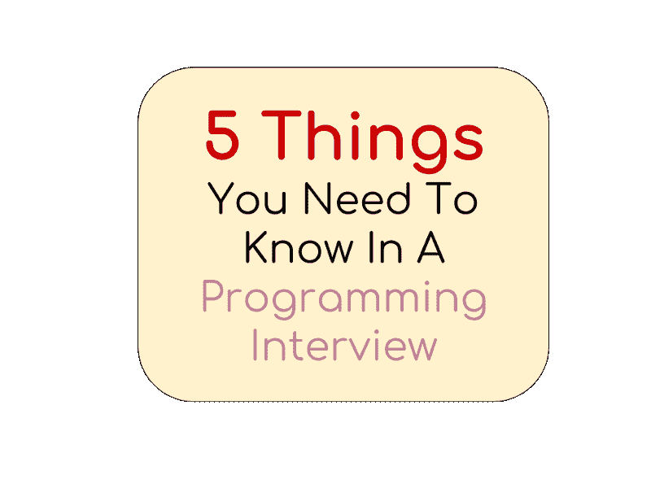
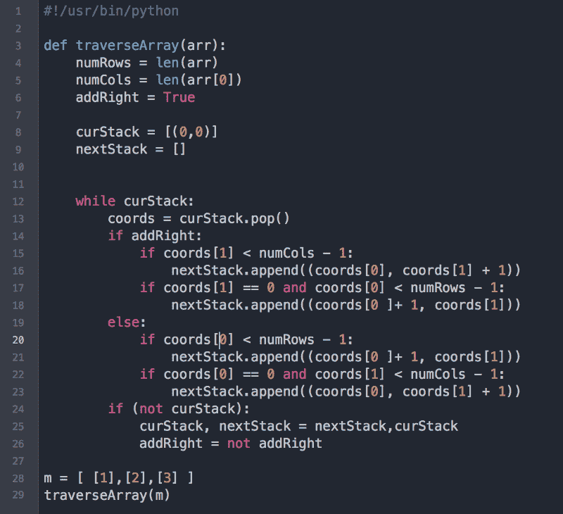
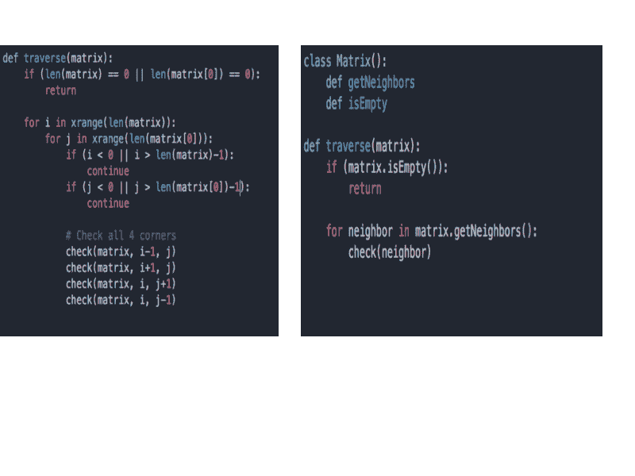

# 编程面试中你需要知道的 5 件事

> 原文：<https://www.freecodecamp.org/news/the-most-important-things-you-need-to-know-for-a-programming-interview-3429ac2454b/>

这篇文章是为那些试图开始他们的编程生涯，或者准备为他们梦想的工作面试的人准备的。作为一个曾经参加过面试的人，我理解被面试者的感受。

这个不完整的问题列表一直在我脑海中浮现。

*   "我应该通过我的代码说话吗？"
*   “我应该多久和面试官交流一次？”
*   “天哪，我忘记实例化我的变量了！我注定要失败吗？!"
*   “面试官怎么看我的回答？”
*   “我这样做可以吗？”

…这样的例子不胜枚举…

这是一次非常可怕的经历。这是非常困难的。当你说的每一句话和写的每一件事都被仔细审查时，在这种真空中工作是极其困难的。

你在为你梦想的工作面试，这是你从 12 岁起就梦想的事情。归根结底就是在 60 分钟内给你从未谋面的人留下深刻印象。

的斗争是真实的。

5 Things You Need To Know In A Programming Interview

### 1.总是提前考虑

通常，你会听到面试官这样问:“好的，我觉得这个看起来不错。现在，你会如何改进这段代码？”

**这是一个杀手级的问题**。这是因为它不仅仅是打发时间的填充物。面试官试图评估你对以下问题的看法:

*   代码质量
*   算法规划会议中没有提出的一些问题/瓶颈
*   你将如何扩展手头的解决方案。

仅仅因为你解决了问题并不意味着你会自动得到一份工作。

例如，当你看下面这段代码时，它是做什么的？你会如何改进它？什么可能导致它破裂？

请在下面的评论中告诉我。我很想听听你的想法。

Python code to do X

**惊喜？:**能够提出一个可行的解决方案是最好的**是这个职位最起码要考虑的因素。这些问题是基本能力测试。优秀的候选人和伟大的候选人之间的区别在于超越要求的思考能力。**

#### 这在编码会话中意味着什么

想想优势案例、扩展问题和问题领域。永远向前想一步。如果您使用递归方法，如果您有一个大数据集会发生什么？如果使用哈希算法，如何处理冲突？这种情况发生的可能性有多大？最糟糕的情况是什么？

### 2.答案不止一个

解决编程面试问题的方法总是不止一种。**永远**。解决一个问题通常有多种方法，其中一些可能不是最佳的。

我最喜欢的一个科技 Youtubers 视频网站告诉我，编码面试是一种观察候选人思维方式的心理训练。从面试官的角度来看，我不会检查你是否知道正确答案。是的，你能给**写一个可行的解决方案**很重要，但这不是唯一的事情。

除此之外，我还在寻找这个人有多聪明，解决方案是如何得出的，以及这个人可能在考虑哪些其他创造性的解决方案。

一个编程练习来说明我的观点:

[合并两个排序后的链表](https://leetcode.com/problems/merge-two-sorted-lists/?tab=Description)。(如果你想试着解决的话，可以链接到 Leetcode)。基本上，你可以用几种方法来解决这个问题:

1.  将所有节点放入一个数组，然后对其进行排序。然后，创建一个指针，将数组中的每个元素链接在一起。
2.  使用指针操作合并它们。比较两者，记录哪个更小，然后在最后返回结果。

你还能想到什么其他方法？

### 3.OOP 没有死

面向对象编程没有死。对一些人来说，这是一种爱恨交加的关系，但这是一项有价值的技能。这是基本技能之一——每个程序员都应该知道的编程技术。

许多候选人没有进一步考虑简化代码就一头扎进了编程问题。我曾经是这样的一群人，不可否认的是，我有时仍然这样做。

然而，通过面向对象编程将复杂问题转化为更简单、更易管理的问题的能力是一种罕见且珍贵的技能。

编写计算机能理解的代码很容易。为人类编写代码很难。

### 4.制作你的**简历**

想象一下，你和你的梦中情人去参加舞会，你穿着人字拖和无袖 t 恤出现在他们家门口。

Credits to Futurama and Imgflip.com

你的简历就是你的名片。是公司对你的第一印象。

如果你开始找工作，那么你应该做的第一件事就是准备一份出色的简历。这是求职者经常忽视的**头号问题，也可以说是最容易摘到的水果。**

我看到很多候选人花了几周甚至几个月的时间准备编码面试。但是相比之下，他们花在制作简历上的时间就相形见绌了。

### 5.早点沟通，经常沟通

当我刚开始面试时，我倾向于**过度沟通** *。*这意味着我会尝试通读我编写的每一行代码，即使它只是一个简单的 for 循环。

我不是那种能一边说话一边思考的人。有些人天生就能大声思考，但我不能。

**根据需要经常沟通**。我试着早点沟通，经常沟通。每当有问题的时候，我都会向面试官提出来，让他们知道。它帮助我确定我是否在朝着正确的方向前进，如果不是，它就能纠正我的方向。

编程面试既要看硬技能**也要看软技能**。缺少一个或另一个意味着肯定没有。为了获得更多信息，我写了一篇关于如何提高软件工程师软技能的更详细的文章[在这里](https://medium.freecodecamp.org/how-to-be-a-successful-software-engineer-6f82a5b1a82e)。

不要强迫自己阅读每一行代码。如果你正在使用一种编程语言的一些深奥的特性，你可以在写完所有的东西后解释它。

#### **这在编码会话中意味着什么**

如果你已经建立了一些解决问题的方法，那么你可以礼貌地让面试官知道你将会深入编写代码。不要觉得你需要解释每一行代码。

### 6.[额外]使用抽象

这是我在面试时得到的另一个非常有用的提示:**对复杂的方法使用抽象。**

使用抽象来隐藏复杂的实现细节并不意味着您将肮脏的细节隐藏起来。这意味着你懂得越少越好。记住，你写的是让人类理解的代码。在这里表现出良好的判断力肯定会为你赢得面试官的好感。

#### 这在编码会话中意味着什么

让我们比较这两段代码:

Traverse a matrix

在我看来，我认为右边看起来更干净，也更容易理解。然后我可以花时间实现`getNeighbors`或`isEmpty`，这取决于对我的要求。

这里重要的是，抽象现在帮助我的代码保持干净、易读、易懂。谁不喜欢鱼与熊掌兼得呢？

### 为什么我要分享我的经历？

不知何故，我奇迹般地克服了障碍，找到了我梦寐以求的工作。这绝不是我吹牛的方式。这根本不是我的本意。

我真心希望帮助像我一样正在努力寻找理想工作的人。我经历过。我理解准备编程面试的艰辛，汗水和泪水。我相信这个世界不是零和游戏——生活越好的人越多，我们的社会就变得越好，我们也会因此变得更加繁荣。这是双赢的局面。

希望这些建议能够帮助其他求职者！祝你好运！？

如果你喜欢这篇文章，这里有几篇我写的推荐文章:

*   [我如何在没有常春藤学位的情况下获得微软、亚马逊和推特的邀请](https://medium.freecodecamp.org/how-i-landed-offers-from-microsoft-amazon-and-twitter-without-an-ivy-league-degree-d62cfe286eb8)
*   [如何为软件工程师写一份出色的简历](https://medium.freecodecamp.org/how-to-write-a-great-resume-for-software-engineers-75d514dd8322)
*   [我如何通过构建一个网络爬虫来实现求职自动化](https://medium.freecodecamp.org/how-i-built-a-web-crawler-to-automate-my-job-search-f825fb5af718)
*   [如何进行系统设计](https://medium.freecodecamp.org/how-to-system-design-dda63ed27e26)

### 我推荐的资源和工具

*   [编程面试的要素](http://amzn.to/2Dcs6Qd):非常适合更难的编码问题
*   [破解编码面试](http://amzn.to/2Hj91OH):非常适合涵盖基础 CS
*   OneNote :我用它来存储所有代码片段
*   Evernote :其他的
*   [CodeRunner](https://coderunnerapp.com/) :我爱这个 Mac 应用！我多次使用它来运行特定的 Python 脚本/函数，效果非常好。？
*   [Jobscan](https://www.jobscan.co/) :一个朋友经营这家公司。我听说过很多关于它的很酷的事情，你应该试试它们作为简历筛选工具。
*   由一群前谷歌员工运营。这里的模拟面试质量如何？。面试官都是前谷歌员工。我强烈建议尝试一下。
*   CodePath:一个帮助人们为科技职业做准备的非营利组织。内森和蒂姆都是很棒的人，我从他们身上学到了很多。社区非常乐于助人，每个人都愿意伸出援手。
*   精细标记:把这些带到你的面试中。我强烈推荐他们！

阿智·钟是推特的一名软件工程师。他在西雅图的广告测量团队工作，为广告商测量广告影响和投资回报率。

你可以在 [Twitter](https://twitter.com/zhiachong) 和 [LinkedIn](https://www.linkedin.com/in/zhiachong/) 上找到他。