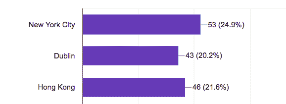

# 宣布我们的 freeCodeCamp 2018 最佳贡献者奖获奖者

> 原文：<https://www.freecodecamp.org/news/announcing-our-freecodecamp-2018-top-contributor-award-winners-861da08a77e1/>

在过去的 3 年里，[freeCodeCamp.org](http://freecodecamp.org/)已经从一个小型开源项目成长为一个拥有数百万开发者的全球社区。

freeCodeCamp 之所以成为可能，要感谢世界各地成千上万的贡献者，他们主要通过以下方式帮助扩展和改进社区:

*   领导所在城市的面对面学习小组
*   管理我们众多的在线社区
*   创作关于编程和技术的文章、视频和播客
*   为 freeCodeCamp 的课程、代码库和我们的许多开源项目做出贡献

今年，我们将表彰那些自愿为社区贡献数十小时(有时是数百小时甚至数千小时)时间的顶级贡献者。

我们邀请了该奖项的获奖者参加我们在纽约市、都柏林和香港举办的顶级贡献者聚会。尽管我们这个由捐助者支持的小型非营利组织负担不起顶级捐助者飞往这些城市的费用，但我们提供食物、饮料和大量来自 freeCodeCamp 社区的鼓舞人心的人一起出去玩。

到目前为止，许多顶级贡献者已经回复了这三个派对中的每一个，一些顶级贡献者计划参加不止一个派对。这些派对只接受邀请，但我们计划在我们的 YouTube 频道上直播。

*RSVPs so far*

我们的第一次聚会将于 8 月 18 日在纽约举行。都柏林聚会将在九月的某个时候，香港聚会将在十月的某个时候。

顶级贡献者还将在其 freeCodeCamp 组合中获得一枚特殊徽章，以表彰其 2018 年顶级贡献者身份。

这是我们颁发这些奖项的第一年，所以我们也包括了一些在 freeCodeCamp 成立的前三年中做出贡献的人。我们将在明年夏天授予 2019 年度最佳贡献者，所以如果你没有上榜，你还有 12 个月的时间来增加你对 freeCodeCamp 社区的贡献！？

以下是来自 freeCodeCamp 社区的贡献者，我们的团队将他们选为 2018 年的最佳贡献者。

这是来自我们全球社区的教师、作者、视频创作者、版主、开源贡献者和学习小组领导的良好组合。他们来自世界各地的许多城市，为我们的社区带来了各种各样的技能。

全球 freeCodeCamp 社区有 6000 多名贡献者，其中只有大约 200 人进入了这一名单。我们感谢你们所有人的贡献——即使你们不在这个短名单上。我们希望你能出现在明年的名单上！

## 祝贺我们 2018 年的最佳贡献者！

以下是按字母顺序排列的 2018 年顶级贡献者的姓名、位置和主要贡献领域，以及他们的社交媒体链接，以防你想关注他们。？

*   来自南非自由州布隆方丹的 A-J·鲁斯:自由代码营向导回购合作者|[GitHub](https://github.com/asjas)|[Twitter](https://twitter.com/asjasroos)|[自由代码营](https://www.freecodecamp.org/asjas)
*   来自卡拉奇的 Abdul Moiz an sari:freecodecamp 卡拉奇负责人兼工作坊培训师| [GitHub](https://github.com/abdul-moiz-ansari) | [Twitter](https://twitter.com/aamoizansari)
*   来自马里兰州盖瑟斯堡的阿卜杜拉齐兹·阿基布:自由代码营银色春天的主持人和社区领袖
*   来自孟买的阿布·扎法尔:学习者和贡献者
*   哥德堡的亚当·格拉文德:自由代码营悉尼研究小组组长| [GitHub](https://github.com/adamxtokyo) | [自由代码营](https://www.freecodecamp.org/adamxtokyo)
*   来自 i̇stanbul:的 Ahmad Abdolsaheb 内容开发者和版主| [GitHub](https://github.com/ahmadabdolsaheb) | [Twitter](https://twitter.com/abdolsaheb)
*   来自卡拉奇的 Ahmed Raza:了解并得到了这份工作|[GitHub](https://github.com/Raza403)|[Twitter](https://twitter.com/ahmedraza403)|[freeCodeCamp](https://www.freecodecamp.org/raza403)
*   来自中国成都的 Akagilnc:活动主持人兼黑客马拉松编程道场负责人|[GitHub](https://github.com/Akagilnc)|[Twitter](https://twitter.com/akagilnc)|[freeCodeCamp](https://www.freecodecamp.org/akagilnc)
*   来自新喀里多尼亚努美阿的 Akira Laine:摇滚明星撰稿人兼成员|[GitHub](https://github.com/AkiraLaine)|[freeCodeCamp](https://www.freecodecamp.org/akiralaine)
*   来自多伦多的 Alexander Kallaway:# 100 daysofcode 创始人兼 freeCodeCamp 撰稿人|[GitHub](https://github.com/kallaway)|[Twitter](https://twitter.com/ka11away)|[freeCodeCamp](https://www.freecodecamp.org/kallaway)
*   来自悉尼的 Allan Cheung:活动主持人、导师和脸书主持人
*   来自雅加达的 Alvin Kristanto Lim:采访准备撰稿人|[GitHub](https://github.com/alvinkl)|[freeCodeCamp](https://www.freecodecamp.org/alvinkl)
*   来自新德里的阿曼·米塔尔(Aman Mittal):主持人、测试者，总是乐于助人| [GitHub](https://github.com/amandeepmittal) | [Twitter](https://twitter.com/amanhimself)
*   来自伦敦的 Andrew Walsh:代码库贡献者| [GitHub](https://github.com/andrewghc)
*   来自瑞典哥德堡的 Amber Wilkie:写关于 Rails 和 React |[GitHub](https://github.com/amberwilkie)|[Twitter](https://twitter.com/heyamberwilkie)
*   Anand Prakash 来自印度 Bengal uru:app secure . in 的创始人和 freeCodeCamp 媒体出版物的撰稿人| [Twitter](https://twitter.com/sehacure) | [Medium](https://medium.freecodecamp.org/meet-anand-prakash-a-white-hat-hacker-whos-earned-bug-bounties-from-facebook-twitter-and-uber-74e30d709b97)
*   来自莫斯科的 Anastasia Zolotova:研究小组组长| [GitHub](https://github.com/Anastasyya) | [Twitter](https://twitter.com/zolotova17?lang=en)
*   来自田纳西州 Arco 的 Andrea Zanin:作家和代码贡献者|[GitHub](https://github.com/ZaninAndrea)|[freeCodeCamp](https://www.freecodecamp.org/zaninandrea)
*   来自海德拉巴的 Ankit:技术作者|[GitHub](https://github.com/AnkitSharma-007)|[Twitter](https://twitter.com/ankitsharma_007)|[Medium](https://medium.com/@ankitsharmablog)
*   来自科罗拉多州威斯敏斯特的 Ariel:社区领袖和讲解员|[GitHub](https://github.com/ArielLeslie)|[Twitter](https://twitter.com/arielleslie)|[freeCodeCamp](https://www.freecodecamp.org/portfolio/arielleslie)
*   来自波士顿的 Julia Chen:freeCodeCamp 媒体出版物和播客编辑
*   来自特里凡得琅的 Ashok Mohanakumar:脸书小组主持人兼撰稿人|[GitHub](https://github.com/ashokmohanakumar)|[Twitter](https://twitter.com/AshokCODES)|[freeCodeCamp](https://www.freecodecamp.org/blackmirror94)
*   阿什温·哈里哈兰(Ashwin Hariharan)，来自印度本加鲁鲁:自由代码营媒体出版物的作者和编辑，meetup 组织者| [GitHub](https://github.com/booleanhunter) | [Twitter](https://twitter.com/booleanhunter)
*   来自纽约的奥斯汀·贝尔卡克:帮助人们找到他们喜欢的工作
*   来自布里斯班的本:活动策划| [GitHub](https://github.com/benaitcheson)
*   来自都柏林的 Ben McMahon:研究小组组长和代码库贡献者| [GitHub](https://github.com/benmcmahon100)
*   来自新罕布什尔州塞勒姆的贝丝·特诺里奥:用智能资源连接有抱负的程序员| [GitHub](https://github.com/anaerobeth) | [Twitter](https://twitter.com/anaerobeth)
*   来自渥太华的比尔·索鲁尔:媒体作家| [推特](https://twitter.com/@BillSourour)
*   来自萨克拉门托的比利·勒:自由代码营学习小组的组织者|[GitHub](https://github.com/lebilly)|[Twitter](https://twitter.com/_billyle)|[自由代码营](https://www.freecodecamp.org/billyle)
*   来自埃因霍温的 Bjorn van de Peut:Gitter 版主|[GitHub](https://github.com/bjorno43)|[freeCodeCamp](https://www.freecodecamp.org/bjorno43)
*   来自中国成都的蓝调 Ram:devo PS 和贡献者| [freeCodeCamp](https://www.freecodecamp.org/captainblue2013)
*   来自西雅图的布兰登·拜尔斯。课程贡献者。| [GitHub](https://github.com/brandenbyers) | [推特](https://www.twitter.com/brandenbyers)
*   来自柏林的 Briana Swift:通过贡献计算机科学视频来学习|[GitHub](https://github.com/brianamarie)|[Twitter](https://twitter.com/brianamarie132)|[freeCodeCamp](https://www.freecodecamp.com/brianamarie)
*   来自富兰克林的伯克·霍兰德:边境线有用的科技作家| [GitHub](https://github.com/burkeholland) | [Twitter](https://twitter.com/burkeholland)
*   来自迈阿密的 Candice Davidson:只要我能有所贡献，我都会畅所欲言|[GitHub](https://github.com/cndragn)|[Twitter](https://twitter.com/candicedavidson)|[freeCodeCamp](https://www.freecodecamp.org/cndragn)
*   来自俄亥俄州科普利的卡尔·卡什尼尔。志愿者项目经理，学习小组组长。| [GitHub](http://github.com/CarlJKashnier) | [自由代码营](https://www.freecodecamp.com/carljkashnier)
*   安大略省卡罗莱纳州麦卡洛克基奇纳。学习小组组长。|[Twitter.com](https://twitter.com/carolinamc)
*   来自俄克拉荷马州俄克拉荷马城的卡森·麦金斯特里。协办单位|[GitHub](https://www.github.com/carsonmckinstry)|[Twitter](https://Twitter.com/carsonmckinstry)|[freeCodeCamp](https://www.freecodecamp.org/carsonmckinstry)
*   来自山景城的 Catherine Kim:freecode camp Santa Clara local leader |[GitHub](https://github.com/Catherinesjkim)|[Twitter](https://twitter.com/KatyKim426?lang=en)|[freecode camp](https://www.freecodecamp.org/catherinesjkim)
*   来自中国成都的魏朝新:撰稿人兼研究小组组长|[GitHub](https://github.com/Samhanx)|[freeCodeCamp](https://www.freecodecamp.org/hanx)
*   来自尼日利亚瓦里的 Charles free born Eteure:free code camp Medium Publication 编辑|[GitHub](https://github.com/charlesfreeborn)|[Twitter](https://twitter.com/charliecodes)|[free code camp](https://www.freecodecamp.org/charlesfreeborn)
*   利兹的查理·泰勒。学习小组组长。|[GitHub](https://github.com/chazmcgrill)|[Twitter](https://twitter.com/charlietcoder)|[freeCodeCamp](https://www.freecodecamp.org/chazmcgrill)
*   来自特拉维夫的 Chen Shmilovich:教人们如何创建 JavaScript 游戏|[GitHub](https://github.com/henshmi)|[Twitter](https://twitter.com/CShmilovich)|[freeCodeCamp](https://www.freecodecamp.org/henshmi)
*   来自奥克兰的 Cherry 梁。学习小组组长。| [GitHub](https://github.com/CaiYiLiang) | [推特](https://twitter.com/cherryliang0112)
*   来自科伦坡的 Chim Himidumage。学习小组组长，代码贡献者。| [GitHub](https://github.com/fidenz-chim) | [推特](https://twitter.com/himidumage)
*   来自旧金山的 Chris Gagné:敏捷教练和贡献者| [GitHub](https://github.com/chrisgagne) | [Twitter](https://twitter.com/chrisgagne)
*   来自俄克拉荷马城的 Chris Tse:学习小组组长兼学习者|[GitHub](https://github.com/chris-tse)|[Twitter](https://twitter.com/ChrisMTse)|[freecode camp](https://www.freecodecamp.org/chris-tse)
*   来自奥克兰的 Christian Zenaty:旧金山 freeCodeCamp Meetup Group 联合组织者| [GitHub](https://github.com/xChristianZx)
*   来自加州埃尔多拉多山的克里斯多夫·r·洛维里。版主| [GitHub](https://github.com/poshcodebear)
*   来自果阿的 Cicero Silva:撰稿人和当地社区领袖|[GitHub](https://github.com/cerosilva)|[Twitter](https://www.twitter.com/cerosilva)|[freeCodeCamp](https://www.freecodecamp.org/cerosilva)
*   来自田纳西州查塔努加的 Cody Seibert:开源贡献者和 YouTube 教程创建者| [Twitter](https://twitter.com/codylseibert) | [GitHub](https://github.com/codyseibert)
*   来自布加勒斯特的 Cristi Salcescu:热衷于分享想法| [Twitter](https://twitter.com/cristi_salcescu) | [Medium](https://medium.freecodecamp.org/@cristisalcescu)
*   来自卡尔加里的柯蒂斯·肖:开源贡献者| [GitHub](https://github.com/wudifeixue)
*   来自哈 Nội:的 Dang Hoang Hung 是当地自由代码营研究小组的领导人| [GitHub](https://github.com/hungHoangDang) | [Twitter](https://twitter.com/hungHoangDang)
*   来自俄克拉荷马城的丹尼尔·阿什克拉夫特(Daniel Ashcraft):当地一个用户组的联合组织者。|[GitHub](https://github.com/dashcraft)|[Twitter](https://twitter.com/@d_ofashandfire)|[freeCodeCamp](https://www.freecodecamp.org/dashcraft)
*   来自泰恩河畔纽卡斯尔的丹尼尔·库帕:偶尔有用的建议者| [GitHub](https://github.com/DanCouper) | [Twitter](https://twitter.com/DanCouper)
*   来自维也纳的 Daniel Deutsch:编程符合法律和授权|[GitHub](https://github.com/Createdd)|[Twitter](https://twitter.com/DDCreationStudi)|[freeCodeCamp](https://www.freecodecamp.org/createdd)
*   来自南卡罗来纳州皮肯斯的丹尼尔·琼斯:格林维尔自由代码营小组协调员兼导师|[GitHub](https://github.com/tortxof)|[Twitter](https://twitter.com/tortxof)|[自由代码营](https://www.freecodecamp.org/tortxof)
*   来自多伦多的达伦·乔伊:导师兼聊天室助手|[GitHub](https://github.com/Darrenfj)|[Twitter](https://twitter.com/darrenfjay)|[freeCodeCamp](https://www.freecodecamp.org/darrenfj)
*   Darryl Fernandes 来自华盛顿 DC:学习小组主持人
*   来自纳什维尔的戴夫·哈德:会面组织者|[GitHub](https://github.com/davi3blu3)|[Twitter](https://twitter.com/davi3blu3)|[freeCodeCamp](https://www.freecodecamp.org/davi3blu3)
*   来自布拉格的大卫·科帕尔:热爱知识共享的终身学习者|[GitHub](https://github.com/codinglawyer)|[Twitter](https://twitter.com/coding_lawyer)|[freeCodeCamp](https://www.freecodecamp.org/codinglawyer)
*   来自中国成都的袁院长:帮助免费代码营中国| [GitHub](https://github.com/Dean266) | [免费代码营](https://www.freecodecamp.org/dean266)进行市场推广
*   来自中国成都的 DemongodYY:首席开发者[GitHub](https://github.com/demongodYY)|[freeCodeCamp](https://www.freecodecamp.org/demongodyy)
*   来自山景城的 dhawal Shah:freeCodeCamp 媒体出版物的定期撰稿人| [GitHub](https://github.com/dhawalhshah) | [Twitter](https://twitter.com/dhawalhshah)
*   来自英国克劳伯勒的多姆·韦克林(Dom Wakeling):自由代码营指南拉请求|[GitHub](https://github.com/domwakeling)|[Twitter](https://twitter.com/domwakeling)|[自由代码营](https://www.freecodecamp.org/domwakeling)
*   来自纽约市的 Donavon West:博客作者，自由代码营的支持者和粉丝|[GitHub](https://github.com/donavon)|[Twitter](https://twitter.com/donavon)|[自由代码营](https://www.freecodecamp.org/donavon)
*   来自纽约州马萨波奎的道格·阿库里:研究小组组长| [GitHub](https://github.com/solidi) | [Twitter](https://twitter.com/dougarcuri)
*   来自 Faro 的 Eduardo Vedes:研究小组组长| [GitHub](https://github.com/evedes) | [Twitter](https://twitter.com/eduardovedes)
*   来自维尔纽斯的 Edvinas Daugirdas:一个想帮忙的人
*   来自希腊塞萨洛尼基的 eleftheria Betsou:freeCodeCamp YouTube 视频创建者|[GitHub](https://github.com/EleftheriaBatsou)|[Twitter](https://twitter.com/BatsouElef)|[freeCodeCamp](https://www.freecodecamp.org/eleftheriabatsou)
*   来自尼日利亚拉格斯的 Elvis Chidera:技术作家和 freeCodeCamp 媒体撰稿人|[GitHub](https://www.github.com/elvis10ten)|[Twitter](https://www.twitter.com/elvisnchidera)|[freeCodeCamp](https://www.freecodecamp.org/elvis10ten)
*   来自奥斯陆的伊曼纽·安东内里:我玩得很开心(还得到了两份工作)|[GitHub](https://github.com/Em-Ant)|[Twitter](https://twitter.com/_emant_)|[freeCodeCamp](https://www.freecodecamp.org/em-ant)
*   来自俄勒冈州波特兰的 Eric Leung:社区课程开发人员和数据科学家|[GitHub](https://github.com/erictleung/)|[Twitter](https://twitter.com/erictleung)|[freeCodeCamp](https://www.freecodecamp.org/erictleung)
*   来自纽约市的 Erica Hernandez:自由代码营地球版主和女士休息室创建者|[GitHub](https://github.com/EricaLFHernandez)|[Twitter](https://twitter.com/Airehcuh)|[自由代码营](https://www.freecodecamp.org/ericalfhernandez)
*   来自波士顿的 Ethan Arrowood:课程开发和媒体内容制作|[GitHub](https://github.com/Ethan-Arrowood/)|[Twitter](https://twitter.com/arrowoodtech)|[freeCodeCamp](https://www.freecodecamp.org/ethan-arrowood)
*   来自阿姆斯特丹的埃瓦里斯托·卡拉巴略。数据科学项目协调员| [GitHub](https://github.com/evaristoc) | [Twitter](https://twitter.com/ecccs_fcc)
*   来自马拉加的 Ewa Mitulska-Wójcik:一名学生分享她的学习故事|[GitHub](https://github.com/ewathedoer)|[Twitter](https://twitter.com/thedoerdoes)|[freecode camp](https://www.freecodecamp.org/ewathedoer)
*   来自普里什蒂纳的 fatos Morina:Medium publication 作者|[GitHub](https://github.com/fatosmorina)|[Twitter](https://twitter.com/fatosmorina)|[Medium](https://medium.freecodecamp.org/@fatosmorina)
*   Flavio Copes 来自意大利 Verceia:freeCodeCamp 教程投稿人| [GitHub](https://github.com/flaviocopes) | [Twitter](https://twitter.com/flaviocopes)
*   来自罗马尼亚布拉索夫的 Florin Asavei:当地活动主持人|[GitHub](https://github.com/florinasavei)|[Twitter](https://twitter.com/florin_asavei)|[freeCodeCamp](https://www.freecodecamp.org/florinasavei)
*   来自罗马尼亚布拉索夫的弗罗林·尼图(Florin Nitu):当地 meetup 组织者和 freeComeCamp 媒体撰稿人|[GitHub](https://github.com/fnitu)|[Twitter](https://twitter.com/f_n_nitu)|[free code camp](https://www.freecodecamp.org/fnitu)
*   伊斯特本的加雷斯·戴维斯。学习小组组长。|[GitHub](https://github.com/gareth-d85)|[Twitter](https://twitter.com/hoboandroid)|[freeCodeCamp](https://www.freecodecamp.org/sypher85)
*   来自伦敦的 Alex Garulli。学习小组组长。| [GitHub](https://github.com/artitudinale1) | [推特](https://twitter.com/artitudinale)
*   来自墨尔本的 George Butter:JavaScript 老师|[GitHub](https://github.com/ButsAndCats)|[freeCodeCamp](https://www.freecodecamp.org/butsandcats)
*   来自东京的 George Sawai:TGIFreeCodeCamp 的组织者
*   来自布达佩斯的 Gergely Szerovay:通过撰写文章分享知识|[GitHub](https://github.com/gergelyszerovay)|[Twitter](https://twitter.com/gergoszerovay)|[freeCodeCamp](https://www.freecodecamp.org/gergoszerovay)
*   来自伦敦的贾科莫:事件的指导者和组织者| [GitHub](https://github.com/GiacomoSorbi) | [Twitter](https://twitter.com/SorbiG)
*   来自巴尔的摩的格兰特·耶格。学习小组组长。| [GitHub](https://github.com/GrantYegge) | [推特](https://twitter.com/BmoreInspiring)
*   来自新泽西克里夫顿的格雷格·史密斯:论坛版主|[GitHub](https://github.com/portablestick)|[Twitter](https://twitter.com/portablestick)|[freeCodeCamp](https://www.freecodecamp.org/portablestick)
*   来自印第安纳波利斯的 Gwendolyn Faraday:支持友好 Awesome |[GitHub](https://github.com/gwenf)|[Twitter](https://twitter.com/gwen_faraday)|[freeCodeCamp](https://www.freecodecamp.org/gwenf)
*   来自多伦多的海登·米尔斯。设计师，开源贡献者，作者。|[GitHub](https://github.com/haydmills)|[Twitter](https://twitter.com/haydmills)|[freeCodeCamp](https://www.freecodecamp.org/haydmills)
*   来自旧金山的 har shita Arora:freeCodeCamp 媒体出版物的撰稿人|[GitHub](https://github.com/harshitaarora)|[Twitter](https://twitter.com/aroraharshita33)|[媒体](https://medium.freecodecamp.org/@harshitaisanerd)
*   来自卡拉奇的哈桑·卡帕西:研究小组组长|[GitHub](https://github.com/techkapasi)|[Twitter](https://twitter.com/tweethkapasi)|[freeCodeCamp](https://www.freecodecamp.org/techkapasi)
*   来自三藩市的 Haseeb Qureshi:博主| [GitHub](https://github.com/Haseeb-Qureshi) | [Twitter](https://twitter.com/hosseeb)
*   来自希腊阿克拉的哈桑·阿布杜:研究小组组长| [推特](https://twitter.com/hassanabudu) | [GitHub](https://github.com/meyian) | [自由代码营](https://www.freecodecamp.org/meyian)
*   来自卡拉奇的哈桑·贾汉吉尔:研究小组组长|[GitHub](https://github.com/hassanbilal621)|[Twitter](https://twitter.com/Hassantcl)|[freeCodeCamp](https://www.freecodecamp.org/hassanbilal621)
*   来自新罕布什尔州 Bow 的 Heather Kusmierz:核心免费代码营课程和指南撰稿人| [GitHub](https://github.com/HKuz) | [免费代码营](https://www.freecodecamp.org/hkuz)
*   来自 Lagos 的 Hector Johnson Okoro:帮助传播编程的福音|[GitHub](https://github.com/hector101)|[Twitter](https://twitter.com/hector_johnson)|[freeCodeCamp](https://www.freecodecamp.org/hector101)
*   来自中国成都的 Hill Chen:会员组织者
*   来自孟买的 hitarth Asrani:Guide contributor |[GitHub](https://github.com/MrAsrani1312)|[Twitter](https://twitter.com/MrAsrani1312)
*   来自中国湛江的刘华森:产品经理
*   来自中国安的 Hylerrix Han:在安的学习小组组长|[GitHub](https://github.com/hylerrix)|[Twitter](https://twitter.com/hylerrix)|[freeCodeCamp](https://www.freecodecamp.org/hylerrix)
*   来自苏黎士的 Indrek Lasn:尽我所能教授和改进编码社区|[GitHub](https://github.com/wesharehoodies)https://mobile.twitter.com/lasnindrek|[freeCodeCamp](https://www.freecodecamp.org/freeCodeCamp9020c459-2e6d-434d-a398-3184c0f6099a)
*   来自以色列海法的 Ion Varsescu:发起人、集会组织者和自豪的露营者。| [GitHub](https://github.com/Nei-V) | [推特](https://twitter.com/IonVcoding)
*   来自鹿特丹的艾萨克·亚伯拉罕森:论坛主持人|[GitHub](https://github.com/IsaacAbrahamson)|[freeCodeCamp](https://www.freecodecamp.org/isaacabrahamson)
*   来自爱荷华州蒂普顿的本·吉特:论坛主持人| [GitHub](https://github.com/bengitter/) | [自由代码营](https://www.freecodecamp.org/bengitter)
*   来自中国苏州的 jack Jin:主办方|[GitHub](https://github.com/jackjin2014)|[Twitter](https://twitter.com/JinJian5)|[freeCodeCamp](https://www.freecodecamp.org/jackjin2014)
*   来自墨尔本的 Jackson Bates:论坛主持人和社区总倡导者|[GitHub](https://github.com/JacksonBates)|[Twitter](https://twitter.com/jacksonbates)|[freeCodeCamp](https://www.freecodecamp.org/jacksonbates)
*   来自曼彻斯特的詹姆斯·达文波特:自由代码营曼彻斯特社区组织者|[GitHub](https://github.com/JD-aka-Techy)|[Twitter](https://twitter.com/JD_aka_Techy)|[自由代码营](https://www.freecodecamp.org/jd-aka-techy)
*   来自阿富汗卡布尔的贾姆希德·哈希米:研究小组组长|[GitHub](https://github.com/jamshidhashimi)|[Twitter](https://twitter.com/jamshidhashimi)|[freeCodeCamp](https://www.freecodecamp.org/jamshidhashimi)
*   来自德国埃森的 Jan Schreiber:论坛撰稿人|[GitHub](https://github.com/janschreiber)|[Twitter](https://twitter.com/janschreiber)|[freeCodeCamp](https://www.freecodecamp.org/janschreiber)
*   来自班加罗尔的杰特·雅各布:主持人| [GitHub](https://github.com/jaitjacob) | [自由代码营](https://www.freecodecamp.org/jaitjacob)
*   来自中国成都的简:freeCodeCamp 成都领队| [GitHub](https://github.com/jiangyuzhen)
*   来自墨西哥城的杰奎琳·韩日·托佩特·泰勒兹:研究小组组长| [推特](https://www.twitter.com/rihan_topete)
*   来自休斯顿的杰森·伊弗雷姆:我帮助推动当地的自由代码营活动| [GitHub](https://github.com/DigitalCrafts) | [Twitter](https://twitter.com/_JasonEphraim)
*   来自喀布尔的贾韦德·曼苏尔:自由代码营研究小组组长和代码周末的负责人
*   来自蒙大拿州的珍妮·舒斯勒:鼓励和支持分享编程之旅|[GitHub](https://github.com/virtual)|[Twitter](https://twitter.com/Graphical)|[freeCodeCamp](https://www.freecodecamp.org/virtual)
*   来自亚特兰大的詹妮弗·布兰德:我来了。我学会了。我贡献了。| [GitHub](https://github.com/ratracegrad) | [推特](https://twitter.com/ratracegrad)
*   来自 Steubenville 的 Jesse R Weigel:现场协作编码，错误包括|[GitHub](https://github.com/JesseRWeigel)|[Twitter](https://twitter.com/JesseRWeigel)|[freeCodeCamp](https://www.freecodecamp.org/jesserweigel)
*   来自奥斯汀的杰西卡·陈:媒体作者| [推特](https://www.twitter.com/thecodercoder)
*   来自弗吉尼亚州诺福克的乔·希尔:当地免费代码营 Meetup 组织者永恒的学生|[GitHub](https://github.com/cupofjoey)|[Twitter](https://twitter.com/vintagejoehill)|[免费代码营](https://www.freecodecamp.org/cupofjoey)
*   Joe“JavaScript Joe”pre vite:Guide contributor and Medium author |[Twitter](https://twitter.com/jsjoeio)|[GitHub](https://github.com/jsjoeio)|[freeCodeCamp](https://www.freecodecamp.org/jsjoeio)
*   来自加州特洛克的约翰牛:乐于助人|[GitHub](https://github.com/jbull328)|[Twitter](https://twitter.com/jbull328)|[freeCodeCamp](https://www.freecodecamp.com/jbull328)
*   来自苏格兰格拉斯哥的约翰·肯尼迪:在我力所能及的地方伸出援手|[GitHub](https://github.com/johnkennedy9147)|[Twitter](https://twitter.com/JK9147)|[freeCodeCamp](https://www.freecodecamp.org/johnkennedy9147)
*   来自英国利兹的 Johnny Bizzel:我学习，我帮助，我指导|[GitHub](https://github.com/JohnnyBizzel)|[Twitter](https://twitter.com/johnnybizzel)|[freeCodeCamp](https://www.freecodecamp.org/johnnybizzel)
*   来自贝尔法斯特的 Jonathan Graham 长期核心代码贡献者和 youtube 版主|[GitHub](https://github.com/jonathan-grah)|[freeCodeCamp](https://www.freecodecamp.org/jonathan-grah)
*   来自加州卡马里奥的 Jonathan solórza no-Hamilton |[Twitter](https://twitter.com/jhsolor)|[GitHub](https://github.com/jhsolor)
*   来自三藩市的 Jonathan Z White:freeCodeCamp 媒体出版物| [GitHub](https://github.com/JonathanZWhite) | [Twitter](https://twitter.com/jonathanzwhite) 的作者
*   来自葡萄牙法鲁的 Jorge Encarna:研究小组组长兼导师|[GitHub](https://github.com/jfgen)|[Twitter](https://twitter.com/jfgen)|[freeCodeCamp](https://www.freecodecamp.org/freeCodeCamp79dbbda3-2313-4ca3-aeab-ffc99ee4a7b8)
*   来自休斯顿的 Joshua Davidson:freeCodeCamp Meetup Leader |[GitHub](https://github.com/joshuadavidson)|[Twitter](https://twitter.com/jwaynedavidson)
*   来自葡萄牙阿尔布费拉的若昂·恩里克:一个快乐的高年级营员，喜欢帮助其他营员|[GitHub](https://github.com/Joao-Henrique)|[freecode camp](https://www.freecodecamp.org/joao-henrique)
*   JP Kriel 来自南非开普敦:撰稿人和脸书主持人。| [GitHub](https://github.com/jkriel87)
*   来自西安的 justaka:freecode camp 西安社区组织者
*   来自多伦多的贾斯汀·理查德松:研究小组组长| [GitHub](https://github.com/hallaathrad) | [Twitter](https://twitter.com/hallaathrad)
*   来自海德拉巴的 Kapil Dutta:研究小组组长| [GitHub](https://github.com/duttakapil) | [推特](https://twitter.com/duttakapil)【http://freecodecamp.org/duttakapil】T4
*   来自印度班加卢鲁的 Karan Murthy:研究小组组长
*   博尔德的凯蒂·詹金斯。学习小组组长。| [GitHub](https://github.com/katiejenkinswebdev)
*   来自旧金山的 Kenzo Mendoza:只是一个 freeCodeCamp 程序员
*   来自菲律宾的 Kev Comedia:我在论坛上回答问题|[GitHub](https://github.com/kevcomedia/)|[freeCodeCamp](https://www.freecodecamp.org/kevcomedia)
*   凯文·科诺年科(Kevin Kononenko)，来自波士顿:媒体出版物的频繁撰稿人| [GitHub](https://github.com/kbk0125) | [Twitter](https://twitter.com/codeanalogies)
*   来自艾哈迈达巴德的 Keyur Raval:印度守夜人和志愿者编辑|[GitHub](https://github.com/thandaanda)|[Twitter](https://twitter.com/thanda_anda)|[freeCodeCamp](https://www.freecodecamp.org/thandaanda)
*   来自韩国大邱的 Kris Koishigawa:教师和开放教育爱好者|[GitHub](https://github.com/scissorsneedfoodtoo)|[Twitter](https://twitter.com/kriskoishigawa)|[freeCodeCamp](https://www.freecodecamp.org/scissorsneedfoodtoo)
*   来自俄克拉荷马州诺曼的克里斯汀·加西亚:研究小组组长| [GitHub](https://twitter.com/kristingaguilar)
*   来自印第安纳州富兰克林的拉里·托雷:研究小组组长| [自由代码营](https://www.freecodecamp.org/larrytooley) | [GitHub](https://github.com/larrytooley) | [推特](https://twitter.com/larrytooley)
*   来自德克萨斯的 lance:Gitter 版主和自由代码营 GitHub 库的贡献者| [GitHub](https://github.com/texas2010) | [自由代码营](https://www.freecodecamp.org/texas2010)
*   来自洛杉矶的 Lawrence Yeo:freeCodeCamp 电台撰稿人，媒体作者| [Twitter](http://www.twitter.com/treblesandblues) | [媒体](https://medium.com/@lawrenceyeo)
*   来自上海的 Lionel Rowe:论坛问题回答者和临时 mod |[GitHub](https://github.com/lionel-rowe/)|[freeCodeCamp](https://www.freecodecamp.org/lionel-rowe)
*   来自墨尔本的 LJ Kenward:研究小组组长，Levels Conf | [Twitter](https://twitter.com/ljkenward) 的创始人
*   lmagic16 来自中国成都:freeCodeCamp 成都 IT 技术周刊创始人|[GitHub](https://github.com/Lmagic16)|[Twitter](https://twitter.com/Lmagic13/)|[freeCodeCamp](https://www.freecodecamp.org/lmagic16)
*   萨里郡的路易斯·埃斯皮纳尔。学习小组组长。|[GitHub](https://github.com/lespinalrivera)|[Twitter](https://twitter.com/lespinalrivera)|[freeCodeCamp](https://freecodecamp.com/lespinalrivera)
*   来自俄亥俄州代顿的 Luke Ciciliano:freeCodeCamp 关于自由软件开发的作者视频和文章|[GitHub](https://github.com/LukeCiciliano)|[Twitter](https://twitter.com/Luke_Ciciliano)|[freeCodeCamp](https://www.freecodecamp.org/lukeciciliano)
*   来自辛辛那提的马尼什·吉里:自豪的贡献者和积极的露营者|[GitHub](https://github.com/Manish-Giri)|[Twitter](https://twitter.com/1_infinite_loop)|[freeCodeCamp](https://www.freecodecamp.org/manish-giri)
*   来自赫尔辛基的 Marcia Villalba:讲授云和无服务器| [GitHub](https://github.com/mavi888) | [Twitter](https://twitter.com/mavi888uy)
*   来自挪威奥斯陆的 Marek Troszczynski:奥斯陆自由代码营社区组织者| [Twitter](https://twitter.com/marektro)
*   安娜堡的马克·莫克尔。学习小组组长。
*   来自蒙特利尔的 Mary Mule 测试员、论坛版主、开源贡献者|[Twitter](https://www.twitter.com/mstellaluna)|[GitHub](https://www.github.com/mstellaluna)|[freeCodeCamp](https://www.freecodecamp.org/mstellaluna)
*   来自伦敦的 matt Lewis:freeCodeCamp London meetup 组织者|[GitHub](https://github.com/matt2112)|[freeCodeCamp](https://www.freecodecamp.org/matt2112)
*   来自意大利都灵的 Matteo Giaccone:开源贡献者|[GitHub](https://github.com/matjack1/)|[Twitter](https://twitter.com/mat_jack1)|[freeCodeCamp](https://www.freecodecamp.org/matjack1)
*   来自多伦多的马修·波特:YouTube 频道负责人| [Twitter](https://twitter.com/askmp) | [GitHub](https://github.com/askmp)
*   来自各地的马克西姆·奥尔洛夫:学习小组组长和旅行自由代码营校友|[GitHub](https://github.com/Maximization)|[Twitter](https://twitter.com/_maximization)|[自由代码营](https://www.freecodecamp.org/maximization)
*   来自纽约的梅根·马洛伊:研究小组组长| [GitHub](https://github.com/mlm603) | [自由代码营](https://www.freecodecamp.org/mlm603)
*   来自中国成都的美美:freeCodeCamp 成都主办方| [GitHub](https://github.com/jiangyuzhen)
*   来自 Richardson 的 Melissa Guerrero:研究小组组织者和 freeCodeCamp Dallas 的管理员|[GitHub](https://github.com/Mmgfrog)|[Twitter](https://twitter.com/Mmgfrog)|[freeCodeCamp](https://www.freecodecamp.org/mmgfrog)
*   来自奥斯丁的迈克尔·道格拉斯:科技的学生和老师| [GitHub](https://github.com/mikedoug) | [Medium](https://medium.com/@mikedoug)
*   Ripon Happy 撰稿人迈克尔·皮门特尔| [GitHub](https://github.com/mtpjr88)
*   来自纽约的迈克尔·塞姆科:研究小组组长| [GitHub](https://github.com/MadOgre) | [自由代码营](https://www.freecodecamp.org/madogre)
*   来自下赫特的米歇尔·戈斯:媒体编辑兼作家| [GitHub](https://github.com/programgirl)
*   来自墨西哥城的米格尔·洛佩兹:研究小组组长
*   来自多伦多的 Minh Ha:多伦多社区领袖和导师|[GitHub](https://github.com/hlminh2000)|[Twitter](https://twitter.com/hlminh2000)|[freeCodeCamp](https://www.freecodecamp.org/hlminh2000)
*   来自中国苏州的刘:自由代码营中国区负责人
*   来自 DC 华盛顿州的摩根·纳什:DC 自由代码营会议的撰稿人| [GitHub](https://github.com/mnash1985) | [Twitter](https://twitter.com/mnash1985?lang=en)
*   来自卡拉奇的穆罕默德·阿里·汗:研究小组组长| [GitHub](https://github.com/Ali-Khan5) | [自由密码营](https://www.freecodecamp.org/ali-khan5)
*   来自明尼苏达州德卢斯的墨菲·斯特兰奇:励志作家巨魔猎人互联网巫师|[GitHub](https://github.com/drunkfurball/)|[Twitter](https://twitter.com/drunkfurball)|[freeCodeCamp](https://www.freecodecamp.org/drunkfurball)
*   Mustafa Ehsan，来自阿富汗卡布尔，教师兼研究小组组长| [GitHub](https://github.com/mustafaaloko) | [Twitter](https://twitter.com/mustafaaloko)
*   利兹的内森·斯科特。学习小组组长。[GitHub](https://github.com/NathanScott85/)|[Twitter](https://twitter.com/Xaensai)|[freeCodeCamp](https://www.freecodecamp.org/nathanfeely)
*   来自北卡罗来纳州教堂山的纳撒尼尔·苏希:自由代码营指南项目的撰稿人|[GitHub](https://github.com/nsuchy)|[Twitter](https://twitter.com/nathanielrsuchy)|[自由代码营](https://www.freecodecamp.org/nsuchy)
*   来自卡拉奇的 nawazish Ali:Meetup 组织者和群组管理员|[GitHub](https://github.com/nawazishali)|[Twitter](https://twitter.com/Nawazishaliejaz)|[freeCodeCamp](https://www.freecodecamp.org/nawazishali)
*   来自尼日利亚拉格斯的 Neo Ighodaro:开发者和导师|[GitHub](https://github.com/neoighodaro)|[Twitter](https://twitter.com/neoighodaro)|[Medium](https://medium.freecodecamp.org/@neo?gi=e7bcfc60a708)
*   来自加州三藩市的 Nicole Borgaard:技术教育家和社区组织者| [GitHub](https://www.github.com/Borgaard) | [自由代码营](https://www.freecodecamp.org/whygaard)
*   来自阿姆斯特丹的尼尔斯:研究小组组长
*   来自波士顿的妮可·阿香博。学习小组组长。|[GitHub](http://www.github.com/sofrlowi)|[Twitter](http://www.twitter.com/lavie_encode)|[freeCodeCamp](https://www.freecodecamp.org/sofrlowi)
*   来自阿姆斯特丹的 Niels Bom:活动组织者| [GitHub](https://github.com/nielsbom) | [Twitter](https://twitter.com/niels_bom)
*   来自加尔各答的 Nityesh Agarwal:我根据我的经验来写作教学| [GitHub](https://github.com/nityeshaga) | [Twitter](https://twitter.com/nityeshaga)
*   来自尼日利亚拉格斯的 ohans Emmanuel:freeCodeCamp Medium writer |[GitHub](https://github.com/ohansemmanuel)|[Twitter](https://twitter.com/OhansEmmanuel)
*   来自南卡罗来纳州格林维尔的帕梅拉·伍德·布朗(Pamela Wood Browne):当地领导人和 SC Codes 项目总监|[GitHub](https://github.com/pamelawoodbrowne)|[Twitter](https://twitter.com/fancyBike)|[freeCodeCamp](https://www.freecodecamp.org/pamelawoodbrowne)|[Medium](https://www.freecodecamp.org/pamelawoodbrowne)
*   来自贝尔维尤的 Pavel Tsurbeleu:学生福音传道者、讲师和撰稿人|[GitHub](https://github.com/ptsurbeleu)|[Twitter](https://twitter.com/pabloduo)|[freeCodeCamp](https://www.freecodecamp.org/ptsurbeleu)
*   来自 Valadares 的 Pedro Sampaio Maia:可以分享我的知识| [GitHub](https://github.com/PedroSMaia)
*   来自奥斯陆的 Per Harald Borgen:媒体作家| [GitHub](https://github.com/perborgen) | [Twitter](https://twitter.com/perborgen)
*   来自康涅狄格州斯坦福的 Pete Weinberg:freeCodeCamp React 课程和可测试项目的核心贡献者先锋|[GitHub](https://github.com/no-stack-dub-sack)|[freeCodeCamp](https://www.freecodecamp.org/no-stack-dub-sack)
*   来自伦敦的 Peter glee son:freeCodeCamp Medium publication |[Medium](https://medium.com/@petergleeson1)的作者和编辑
*   来自尼日利亚拉格斯的彼得·姆巴努戈:研究小组组长| [GitHub](https://github.com/pmbanugo) | [Twitter](https://twitter.com/p_mbanugo)
*   来自香港的 prashanth Chandra:2014 年以来的露营者，freeCodeCamp 香港 meetup 组织者| [GitHub](https://github.com/prashcr) | [Twitter](https://twitter.com/prashcr)
*   来自洛杉矶的 Preethi Kasireddy。作者。| [GitHub](https://github.com/iam-peekay) | [推特](https://twitter.com/iam_preethi)
*   来自中国成都的宋庆:自由代码营撰稿人
*   来自洛杉矶的昆汀·布罗格利:学习小组组长| [GitHub](https://github.com/Bearsintours) | [自由代码营](https://www.freecodecamp.org/bearsintours)
*   来自布朗克斯的 Rafael Rodriguez:自由代码营指南的主要撰稿人|[GitHub](https://github.com/Rafase282)|[Twitter](https://twitter.com/rafase282)|[自由代码营](https://www.freecodecamp.org/rafase282)
*   来自孟买的 Rajesh Pillai:媒体作家| [GitHub](https://github.com/rajeshpillai) | [推特](https://twitter.com/rajeshpillai) | [媒体](https://medium.freecodecamp.org/@rajeshpillai)
*   来自加州圣何塞的兰德尔·道森:自由代码营论坛的主持人| [GitHub](https://github.com/randelldawson) | [自由代码营](https://www.freecodecamp.org/randelldawson)
*   来自密歇根州底特律市的雷·巴特拉:帮助露营者一起自学
*   来自罗马尼亚布拉索夫的 Razvan Tudorache。学习小组组长。| [GitHub](https://github.com/razvantudorache)
*   Rem Lampa form Manila:开源贡献者|[GitHub](https://www.github.com/RemLampa)|[Twitter](https://www.twitter.com/RemLampa)|[freeCodeCamp](https://www.freecodecamp.org/remlampa)
*   来自英国索尔兹伯里的 Rich Keyzor:学习者、组织者、爱好者| [GitHub](https://github.com/Web-Dev-Rich) | [Twitter](https://twitter.com/web_dev_rich)
*   来自奥斯陆的 Richard Middleton:研究小组组长，freeCodeCamp 的 Instagram 社区负责人| [GitHub](https://github.com/middi) | [Twitter](https://twitter.com/richardcodes)
*   来自约翰尼斯堡的 Richard Sithole:脸书集团联合管理人兼 meetup 组织者|[GitHub](https://github.com/Sliqric7053)|[Twitter](https://twitter.com/sliqric)|[freeCodeCamp](https://www.freecodecamp.org/sliqric7053)
*   来自英国谢菲尔德的里克·韦斯特(Rick West):媒体出版作家和自由代码营家庭成员|[GitHub](https://github.com/rickwest)|[Twitter](https://twitter.com/rick_west8)|[自由代码营](https://www.freecodecamp.org/rickwest)
*   来自维也纳的 Robert Axelsen:奥地利维也纳 Meetup 组织者和创始人|[GitHub](https://github.com/robaxelsen)|[Twitter](https://twitter.com/robaxelsen)|[freeCodeCamp](https://www.freecodecamp.org/robaxelsen)
*   来自田纳西州布伦特伍德的鲁尔·奥金多:尽我所能帮助和鼓励
*   来自伦敦的 Ryan (ryanwhocodes):作者和代码库贡献者[GitHub](https://github.com/ryanwhocodes)|[Twitter](https://twitter.com/ryanwhocodes)|[Medium](https://medium.com/@ryanwhocodes)|[freeCodeCamp](https://www.freecodecamp.org/ryanwhocodes)
*   来自奥马哈的瑞安·马尔姆:自由代码营的早期采用者，他白天从事设计工作 [GitHub](https://github.com/rybar) | [Twitter](https://twitter.com/ryanmalm)
*   来自纽约的萨哈特·雅尔卡博夫。开源贡献者| [GitHub](http://github.com/sahat)
*   来自曼彻斯特的萨姆·威廉姆斯:科技博客和聊天机器人爱好者| [GitHub](https://github.com/SamWSoftware/) | [Twitter](https://twitter.com/SamWSoftwares)
*   来自瑞典哥德堡的 Samuel Plumppu:编程导师课程创建者&平台开发者|[GitHub](https://github.com/Greenheart)|[freeCodeCamp](https://www.freecodecamp.org/greenheart)
*   来自印度班加鲁鲁的 Santu Mahapatra:为实践创造学习环境| [GitHub](https://github.com/santumahapatra) | [Twitter](https://twitter.com/santumahapatra)
*   来自巴黎的莎拉·达扬(Sarah Dayan):一位用同理心教授他人的前沿教育家| [GitHub](https://github.com/sarahdayan) | [Twitter](https://twitter.com/frontstuff_io)
*   意大利莱切的萨维里奥·坎尼拉:地球自由代码营脸书·佩奇的主持人
*   来自田纳西州纳什维尔的 Seth Alexander:指导成长中的领导者新开发者|[GitHub](https://github.com/itzsaga/)|[Twitter](https://twitter.com/itzsaga)|[freeCodeCamp](https://www.freecodecamp.org/itzsaga)
*   来自中国成都的石爻:开源技术讲师|[GitHub](https://github.com/TechQuery)|[Twitter](https://twitter.com/TechQuery_freeCodeCamp)|[freeCodeCamp](https://www.freecodecamp.cn/techquery)
*   来自海德拉巴的 Shubheksha Jalan:让电脑对每个人都不那么可怕| [GitHub](https://github.com/shubheksha/) | [Twitter](https://twitter.com/ScribblingOn)
*   来自卡拉奇的 Shumail Mehdi:撰稿人、导师、研究小组组长|[GitHub](https://github.com/shumailmehdi)|[Twitter](https://twitter.com/MehdiShumail)|[freeCodeCamp](https://www.freecodecamp.org/shumailmehdi)
*   来自柏林的 sibylle Sehl:Medium writer |[GitHub](https://github.com/alaskaa)|[Twitter](https://twitter.com/s_ibylle)|[freeCodeCamp](https://www.freecodecamp.org/alaskaa)
*   来自爱丁堡的西格·瓦特。学习小组组长。| [网站](https://wwhatcodehaveyougit.github.io/currycafe/)
*   来自伦敦的 Sonya Moisset:技术倡导者、导师、当地研究小组组长|[GitHub](https://github.com/SonyaMoisset)|[Twitter](https://twitter.com/SonyaMoisset)|[freeCodeCamp](https://www.freecodecamp.org/sonyamoisset)
*   来自得克萨斯州奥斯丁的 Stephen Mayeux:终身学习者和 YouTube 导师|[GitHub](https://github.com/StephenMayeux)|[Twitter](https://twitter.com/ESLhiphop)|[freeCodeCamp](https://www.freecodecamp.org/stephenmayeux)
*   来自匹兹堡的苏珊·阿特金森:研究小组组长|[GitHub](http://github.com/AdventureBear)|[Twitter](https://twitter.com/SteelCityCoach)|[freeCodeCamp](https://www.freecodecamp.org/adventurebear)
*   来自马尼拉的 Theon Puyat:社区建设者|[GitHub](https://github.com/TheStunnr)|[freeCodeCamp](https://www.freecodecamp.org/thestunnr)
*   里昂的托马斯·西蒙尼尼。作者。| [GitHub](https://github.com/simoninithomas) | [推特](https://twitter.com/ThomasSimonini)
*   来自三藩市的林敏俐:学习小组组长| [GitHub](https://github.com/tymeart) | [Twitter](https://twitter.com/tymeart)
*   来自圣何塞的 Tim Chiang:freecode camp 面试准备课程的核心撰稿人|[GitHub](https://github.com/timolawl)|[freecode camp](https://www.freecodecamp.org/timolawl)
*   来自荷兰 Breda 的 Timo Keurentjes:freeCodeCamp 的开源贡献者|[GitHub](https://github.com/systimotic)|[Twitter](https://twitter.com/systimotic)|[freeCodeCamp](https://www.freecodecamp.org/systimotic)
*   来自明尼苏达州白熊湖的 Timothy Teejay Parker:对新技术专家有用的技术爱好者|[GitHub](https://github.com/TeejayParker)|[Twitter](https://www.twitter.com/majeye1)|[freeCodeCamp](https://www.freecodecamp.org/teejayparker)
*   来自圣保罗的托德·查菲:自由代码营可测试项目的核心贡献者|[GitHub](https://github.com/tchaffee)|[Twitter](https://twitter.com/chaffeet)|[自由代码营](https://www.freecodecamp.org/tchaffee)
*   来自明尼阿波利斯的 Tom Mondloch:开源贡献者|[GitHub](https://github.com/moT01)|[freeCodeCamp](https://www.freecodecamp.org/mot01)
*   来自多伦多的 Tomiwa Ademidun 工程师:企业家、学生、作家| [GitHub](https://github.com/ademidun) | [Twitter](https://twitter.com/tomiwa1a)
*   来自 Carlsbad |檀香山的 Toni short sleeve:Medium 编辑兼露营者导师|[GitHub](https://github.com/KoniKodes)|[Twitter](https://twitter.com/KoniKodes)|[freecode camp](https://www.freecodecamp.org/konikodes)|[Medium](https://medium.com/@konikodes)
*   来自渥太华的托尼·梅纳德:论坛主持人| [GitHub](https://github.com/Soupedenuit) | [Twitter](https://twitter.com/tonywhomever)
*   来自中国成都的太刘波:活动组织者|[GitHub](https://github.com/too)|[Twitter](https://twitter.com/Too)|[freeCodeCamp](https://www.freecodecamp.org/too)
*   来自中国天津的顶尖强:学习小组组长|[GitHub](https://github.com/topqiang)|[freeCodeCamp](https://www.freecodecamp.org/topqiang)
*   来自盐湖城的 Tracey Bushman:freeCodeCamp 可测试项目的核心贡献者|[GitHub](https://github.com/tbushman)|[freeCodeCamp](https://www.freecodecamp.org/tbushman)
*   来自河内的 Trung Nguyen:学习小组组长|[GitHub](https://github.com/ngminhtrung)|[freeCodeCamp](https://www.freecodecamp.org/ngminhtrung)
*   来自河内的 Tung Vu:研究小组组长和 freeCodeCamp 撰稿人| [GitHub](https://github.com/vutung3196)
*   来自芬兰埃斯波的图马斯·波伊凯拉(Tuomas Poikela):自由代码营采访准备部分的核心撰稿人| [GitHub](https://github.com/tpoikela/) | [自由代码营](https://www.freecodecamp.org/tpoikela)
*   来自犹他州伊登的泰勒·麦金尼斯:教育家|[GitHub](https://github.com/tylermcginnis)|[Twitter](https://twitter.com/tylermcginnis)|[Medium](https://medium.freecodecamp.org/@tylermcginnis)
*   来自北岭的 Tyroo J. West:社区领袖|[GitHub](https://github.com/T-Wesst)|[freeCodeCamp](https://www.freecodecamp.org/t-wesst)
*   来自中国深圳的 UShow Jack:深圳自由代码营的组织者| [GitHub](https://github.com/ushowjack)
*   来自世界各地的 Vicky Lai:文章作者、标志创作者、组织者的组织者|[GitHub](https://github.com/vickylai)|[Twitter](https://twitter.com/hivickylai)|[freeCodeCamp](https://www.freecodecamp.org/vickylai)
*   来自纽约市的维多利亚·卡里奥利克:纽约市的社区组织者和首席顾问[推特](https://www.twitter.com/niaskywalk)
*   来自布达佩斯的 Viktor Rádi:布达佩斯自由代码营活动组织者| [GitHub](https://github.com/rviktor87)
*   来自印度浦那的 Vipul Vaibhaw:教师兼 Meetup 组织者| [GitHub](https://github.com/vaibhawvipul) | [Twitter](https://twitter.com/vaibhaw_vipul)
*   来自印度 Raipur 的 Vivek Agrawal:开源贡献者|[GitHub](https://github.com/vkweb)|[Twitter](https://twitter.com/_vkWeb)|[freeCodeCamp](https://www.freecodecamp.org/vkweb)
*   来自中国成都的王波:自由代码营中国区设计师
*   来自香港的 Wendy Cheng:学习小组组长|[GitHub](https://github.com/wcccl)|[freeCodeCamp](https://www.freecodecamp.org/wcccl)
*   来自 Mansfield 的 Wesley McCann:教师和全能社区领袖| [GitHub](https://github.com/septimus) | [自由代码营](https://www.freecodecamp.org/septimus)
*   来自洛杉矶的威廉·阿达莫维奇:创建了自由代码营京都会议| [GitHub](https://github.com/wadamomo)
*   来自伦敦的 William Woodhead:全栈 JavaScript 工程课程的贡献者|[GitHub](https://github.com/william-woodhead)|[Twitter](https://twitter.com/williamwoodhead)|[Medium](https://medium.freecodecamp.org/@williamwoodhead)
*   来自加州圣马特奥的刘星:开发者兼翻译| [GitHub](https://github.com/S1ngS1ng) | [Twitter](https://twitter.com/liuxing0514)
*   来自英国伦敦的崔琰:无服务器博主|[GitHub](https://github.com/theburningmonk)|[Twitter](https://twitter.com/theburningmonk)|[Medium](https://medium.freecodecamp.org/@theburningmonk)
*   来自范库弗峰的 YK·杉:媒体作者和 YouTube |[Twitter](https://twitter.com/ykdojo)
*   来自上海的于航:freeCodeCamp 中国|[GitHub](https://github.com/Becavalier)|[freeCodeCamp](https://www.freecodecamp.org/becavalier)技术负责人
*   zaydek Michels-Gualtieri:Medium author |[GitHub](https://github.com/ZAYDEK)|[Twitter](https://twitter.com/username_ZAYDEK)
*   来自武汉的狂热者:热情与技巧的传播者|[GitHub](https://github.com/zoorz)|[Twitter](https://twitter.com/zeallean)|[freeCodeCamp](https://www.freecodecamp.org/zoorz)
*   来自利马的泽里格·马拉默德:研究小组组长|[GitHub](https://github.com/zeligm)|[freeCodeCamp](https://www.freecodecamp.org/zeligm)
*   来自新加坡的 Zell Liew:我教前端 web 开发| [GitHub](https://github.com/zellwk/) | [Twitter](https://twitter.com/zellwk)
*   来自西雅图的阿智·钟:教育家、导师、顾问、激励者| [GitHub](https://github.com/zhiachong) | [Twitter](https://twitter.com/zhiachong)
*   来自悉尼的 zo heb aina pore:freeCodeCamp 编辑

[在 Twitter 上关注 freeCodeCamp](https://twitter.com/freecodecamp)关于即将到来的派对直播的公告，[订阅我们的 YouTube 频道](https://youtube.com/freecodecamp)获得大量有用的直播和教程。