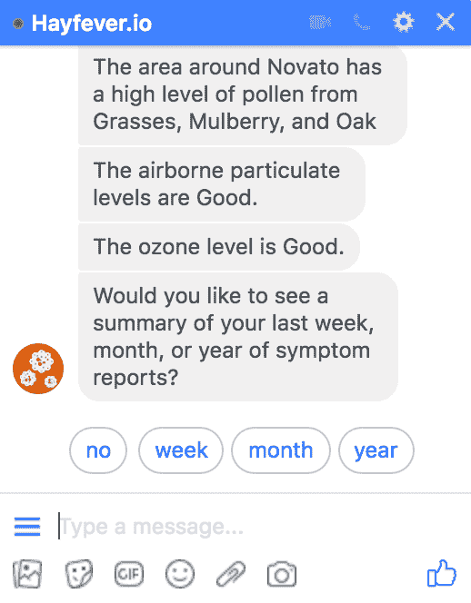
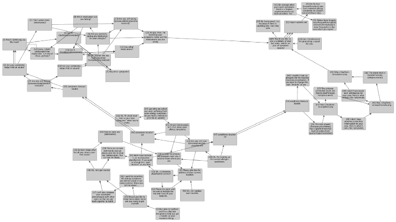
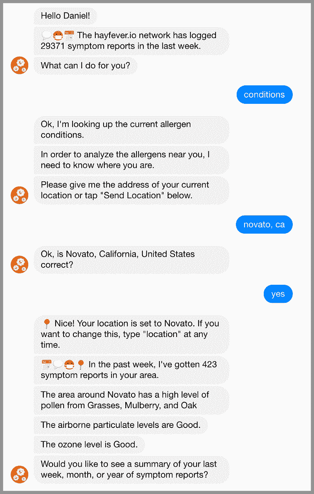
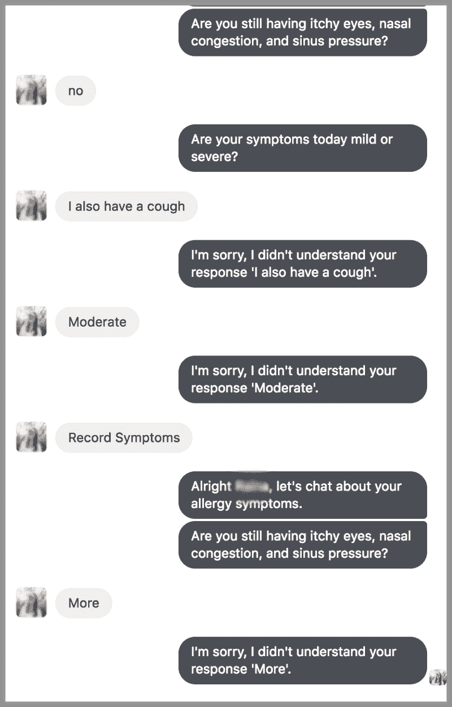
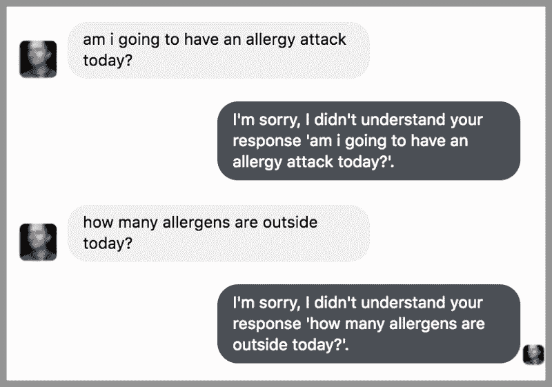

# 我如何通过帮助聊天机器人理解意图来让它变得更聪明

> 原文：<https://www.freecodecamp.org/news/how-i-made-a-smarter-chatbot-with-intents-5e6ad6e0fd71/>

丹尼尔·泰瑞斯

# 我如何通过帮助聊天机器人理解意图来让它变得更聪明

“Pollen spraying from white flowers” by [Alex Jones](https://unsplash.com/@alexjones?utm_source=medium&utm_medium=referral) on [Unsplash](https://unsplash.com?utm_source=medium&utm_medium=referral)

使用深度学习工具更好地理解关于季节性过敏的对话

很长一段时间以来，我一直在做一个聊天机器人来帮助理解季节性过敏。每年的这个时候，我的过敏症会突然发作，我改善花粉热的动力也会再次出现。

今年初春，我花了一些时间来检查我的聊天机器人与用户的交流有多好。退一步说，这个结果令人羞愧。因此，我试图通过集成一个基于深度学习的现代自然语言理解系统来提高我的聊天机器人的性能。本文讨论了我早期的方法出了什么问题，以及我如何修复它。

### 第一遍:对话树

我用一种叫做[对话树](https://en.wikipedia.org/wiki/Dialog_tree)的机制在第一个版本的聊天机器人背后建立了“智能”。任何看过角色扮演游戏的人都经历过对话树。在它的经典形式中，游戏中的一个角色说出一些对话，玩家可以选择回答。

一个更原始的祖先是交互式语音响应系统。我们大多数人在拨打银行的客户支持热线时，可能都不喜欢与 IVR 交互。这些机制很容易编程，当可能的响应范围被限制在给出的选择范围内时,**能够充分发挥作用。**

在电脑游戏中，你只能从屏幕上的选项中进行选择，而使用 IVR 时，你只能根据给出的选项按数字。

有了聊天机器人，可能的答案一点都不受限。用户可以输入他们想输入的任何内容。但当我第一次在 Facebook Messenger 中实现 Hayfever 聊天机器人时，我还没有接触到以复杂的方式解析输入的技术。所以我使用了“快速回复”功能，试图让对话沿着特定的路线进行，就像一棵对话树。

Attempting to force the conversation direction using quick reply buttons.

### 第二次尝试:对话图

在野外观察了聊天机器人之后，我几乎立刻明白这种方法行不通。即使用户得到一些快速回复，也没有什么能阻止他们输入完全不同的内容。

在第二次迭代中，我认为树结构太死板，我需要将对话建模为有向图。我找不到任何符合我需求的框架。所以我编写了自己的基于图形的对话引擎，名为 [conversation-kit](https://github.com/pdtyreus/conversation-kit) 。

一个**有向图**比树结构有一些优势，在这种情况下，因为它**可以让对话更加自然地分叉和流动**。不需要太多的细节，图上的顶点代表聊天机器人的陈述或问题。边缘代表用户可能的响应。因此，对话沿着与用户响应相匹配的边从一个顶点流向另一个顶点。

The chatbot’s conversation visualized as a graph. Each vertex represents something the bot can say, and each edge represents a possible next statement in the conversation.

只要用户没有远离由图中的边定义的一组响应，这就很好地工作了。例如，下面是我在 Facebook Messenger 上与花粉热的一次聊天。

A successful chat with Hayfever on Facebook Messenger using the graph-based conversation model.

由于我编写了模型，我基本上知道我可以说些什么来获得想要的响应。其他用户不会了解这些知识。因此，虽然这个版本更好，但它仍然有一些严重的缺点。

首先，如果用户的响应与任何边都不匹配，机器人就会陷入一个循环，说它不理解。第二，我写的匹配响应和边缘的算法**非常原始，经常误解用户所说的**。最后，如果用户想在谈话中改变话题，他或她基本上需要知道像“帮助”这样的触发短语来重新设置在图中的位置。

下面是一些导致不自然和令人沮丧的对话的例子。

Hayfever clearly misunderstanding a user resulting in an unnatural and frustrating conversation.

A user making a natural request that Hayfever could not understand since it did not match an existing edge in the graph.

在上面的例子中，很明显我的聊天机器人根本不明白用户想要表达什么。换句话说，**它不理解每个语句**的意图。

人类非常善于从口头对话中理解微妙的意图。大多数人毫不费力地结合面部表情、肢体语言和语调来判断意图。除此之外，我们还融入了对谈话对象的了解、之前谈话的背景细节以及可能的文化参考，以进一步提炼一个人对我们说的话的含义。

在这个领域，现代人工智能技术远不如人类。但是**过去几年深度学习**的进步已经**显著提高了计算机从口头或书面文本中辨别意图**的能力。至少，目前的技术水平比我用来匹配边缘反应的原始技术要好得多。

### 第三次尝试:理解意图

在研究了我的聊天机器人与用户的互动后，我意识到我需要一个更复杂的策略。我真的需要一种方法来更好地理解用户的意图。

我第一次体验 intent 是在我为亚马逊的 Alexa 服务编程定制技能的时候。Alexa 服务将你对设备说的话像回声一样转换成书面文本。然后，它检查单词是否与任何内置的意图匹配，如“帮助”或“退出”

作为开发人员，您也可以通过定义与相同的**意图**相匹配的**话语**来定义自己的意图。例如，话语“今天情况如何？”，“空气中有多少花粉？”，以及“过敏情况严重吗？”可能都是用户表达他们要求条件报告的意图。这背后的巧妙之处在于，你不必为给定的**意图**定义**话语**的每一种变化。处理算法通常足以将相似的**话语**匹配到相同的**意图**。

对于一个聊天机器人开发者来说，这太棒了。我不需要为成百上千个不同的输入生成响应，我可以只关注为一些预定义的意图生成响应。

我的原始正则表达式匹配很容易自己编写。但是将话语转换成意图的技术是相当复杂的。幸运的是，有几个知名的供应商提供自然语言理解服务。

*   微软认知服务语言理解( [LUIS](https://www.luis.ai/home)
*   亚马逊网络服务 [Lex](https://aws.amazon.com/lex/)
*   谷歌[安静](https://dialogflow.com/)
*   Facebook[wit . ai](https://wit.ai/)

所有这些服务都标榜自己是用于“构建对话界面”的“高级深度学习”技术。所有这些都是基于 API 的，这意味着它们可以集成到几乎任何连接到互联网的应用程序中。并且都提供了我当前需要的使用级别的免费层。

对于这个项目，我选择了 Dialogflow。我发现用户界面令人愉快，API 易于理解，而且几乎不需要锁定供应商。它还包括一个名为 [Small Talk](https://dialogflow.com/docs/small-talk) 的有趣插件，可以让我的机器人轻松回复像“你好吗？”和“你叫什么名字。”奇怪的是，我从日志中注意到，很多用户喜欢与我的机器人随意交流。

### 使用对话流

使用 NLU 服务时的应用程序循环实际上比我以前使用的要简单。这个机器人完全是事件驱动的。它通过 Facebook Messenger web hook 等待用户的输入，将文本传递给 Dialogflow 以解析意图，为意图生成适当的响应，并将格式化的响应发送回 Facebook Messenger API。

将 Hayfever 更新为使用 Dialogflow 相对来说比较顺利，有几个例外。

首先，我似乎在 Dialogflow 从 V1 到 V2 的 API 迁移过程中发现了它，而文档并没有完全跟上。当搜索 StackOverflow 和其他博客时，有很多关于 V1 API 的过时信息。

第二，花粉热是一个 Facebook 信使机器人。用于在 DialogFlow API 中嵌入 Facebook Messenger 响应的 JSON 格式的文档非常少。如果我选择了脸书的 wit.ai，我相信这一部分会简单一些。但是我希望未来的 Hayfever 可以在任何信息平台和语音平台上工作。

所以我将 Dialogflow 意图处理与 Messenger 响应格式完全分离。因此，Dialogflow 代码不知道输入来自 Messenger，Messenger 也不知道 Dialogflow 正在解析意图。这不是最简单的方法，但它是经得起未来考验的。

切换到对话流 NLU 立即提高了花粉热的谈话质量。这个机器人不再被预期输入的细微变化所迷惑，它可以和用户聊天，甚至可以从它以前从未见过的输入中猜出意图。我还可以做很多训练和优化，但这显然是朝着正确的方向前进。

### 包扎

花粉热是聊天机器人，旨在帮助用户跟踪和了解过敏症状。早期版本使用原始的对话树机制，在理解自然对话方面相当糟糕。像 Dialogflow 这样基于深度学习的自然语言理解(NLU)服务极大地提高了 Hayfever 与用户对话的能力。

通过将 NLU 处理与特定于平台的输入和输出分开，几乎没有增加代码复杂性，也没有平台锁定。

在未来，我希望让 Hayfever 可以在亚马逊 Alexa 和谷歌 Home 等语音设备上使用，也可以在 Telegram 等其他信息平台上使用。我还想尝试将 NLU 与我以前使用的一些基于图形的对话工具结合起来，或许可以让聊天机器人更好地记住对话中已经发生的事情。