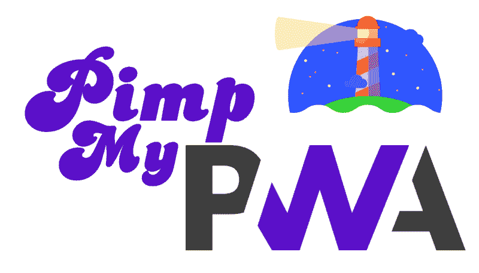
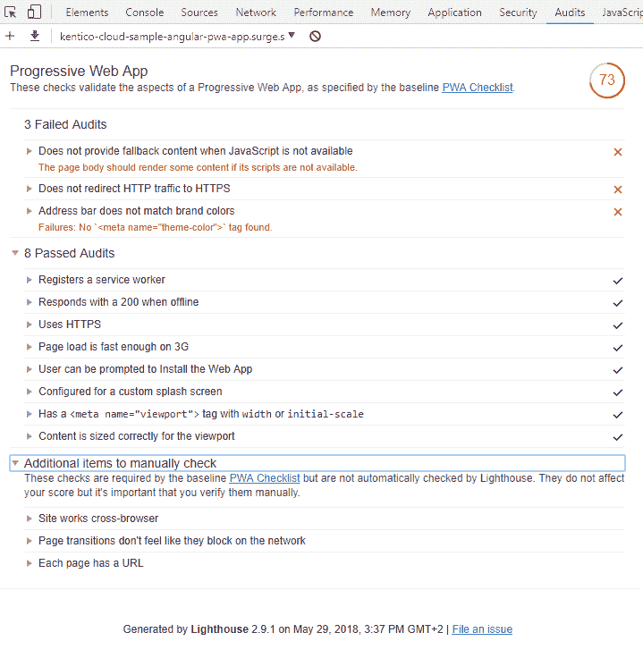
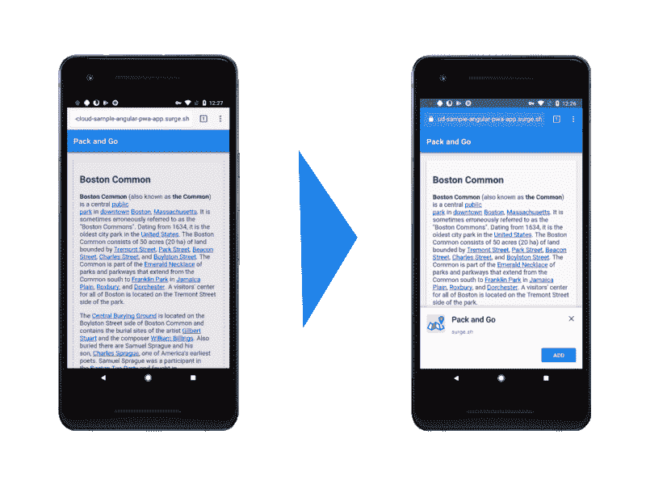
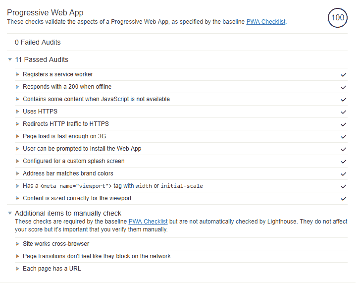
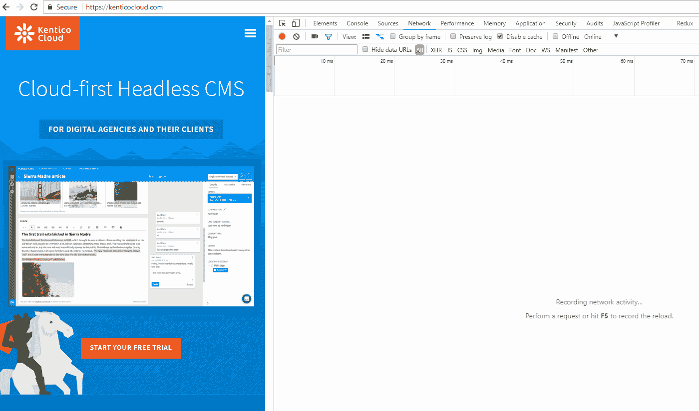

# 如何调整你的渐进式网络应用程序以获得完美的审计分数

> 原文：<https://www.freecodecamp.org/news/how-to-tune-up-your-progressive-web-app-to-get-a-perfect-audit-score-a1779d063eb7/>

by Ondrej Chrastina



去年，渐进式 Web 应用程序(PWAs)迅速成为最热门的开发平台。让我们来看看你需要做些什么来遵守 PWA 标准。

关于 PWA 概念的文章比比皆是。我将重点介绍使 PWA 完全符合规范所需的实际步骤。我将提供一个 GitHub 链接，其中列出了我执行的每一步的更改，以便您可以轻松地亲自尝试。

### 先决条件

*   [node.js](https://nodejs.org/en/download) v8+
*   [谷歌 Chrome](https://www.google.com/chrome/) 浏览器 v60+

我将从那个简单的 Angular 应用程序开始，在我的[上一篇文章](http://bit.ly/pwa-in-angular-and-headless-cms)中，我用它来展示 Angular 和 PWA 方法的结合。我已经[升级](https://github.com/Kentico/cloud-sample-angular-pwa-app/pull/1)到 Angular v6 和 [Kentico Cloud SDK v4](http://bit.ly/kc-js-cloud-sdk-v4) 。


[Upgrade changes](https://github.com/Kentico/cloud-sample-angular-pwa-app/commit/443472555e627fc149e8b6d38d84cef228e0ac21)

这个应用程序是一个简单的有趣的地方列表，存储在一个由 SDK 加载的无头 CMS 中。该应用程序已经具备了这两项优势，使其成为 PWA 应用程序:

*   `manifest.json`在系统中安装应用程序时使用的一组图标。
*   用于缓存应用程序框架(称为应用程序外壳)和来自 headless CMS 的数据的服务工作者实现。


虽然应用程序已经准备好安装和使用，但它仍然需要一些修改来满足 PWA 规范。

### 如何通过 PWA 清单

为了验证这个应用程序是否符合谷歌清单所定义的所有标准，现在人们可以使用各种工具。最受欢迎的叫做[灯塔](https://developers.google.com/web/tools/lighthouse)。


[Google checklist](https://developers.google.com/web/progressive-web-apps/checklist)

Lighthouse 已经嵌入到谷歌 Chrome 浏览器[的开发者工具](https://developers.google.com/web/tools/lighthouse/#devtools)中，位于[的审计标签](https://developers.google.com/web/updates/2017/05/devtools-release-notes#lighthouse)上。要运行它，我建议您在互联网上发布应用程序的生产版本，并从那里执行审计。

要实现这一点，只需在“初始状态”下载应用程序，然后运行以下命令。

对于部署，我使用[浪涌](https://surge.sh/)。您只需注册并安装 CLI 工具。然后，您可以将该文件夹部署到*.source.sh 子域中。


[Initial app state](http://bit.ly/git-repo-angular-pwa-before-audit)

*   `npm install`
*   `npm run build`将生产模式下的应用程序构建到`/dist`文件夹中
*   在全球安装 surge CLI
*   `surge /dist your-own-subdomain.surge.sh`将“dist”文件夹部署到指定的 URL。这需要你登录或者用登录和令牌设置浪涌环境变量。

然后，只需在 Chrome 浏览器中导航至该应用即可。进入“开发者工具”>【审计】>【执行审计】>选择“渐进式网络应用”>【运行审计】。您将看到以下结果。



如你所见，已经通过了八张支票。

现在，让我们检查 PWA 清单。

### PWA 清单

#### 没有 JavaScript 可用时的回退

要删除这条消息，您只需为非 JavaScript 浏览器提供一些消息。标签是实现这一点的理想方式。只需将下面的 HTML 代码添加到`index.html`的正文中。

```
...<noscript>    This page requires you to have the Javascript enabled.</noscript>...
```


[Add no-script content](https://github.com/Kentico/cloud-sample-angular-pwa-app/commit/65ae78f74713eb3d6719673e6d21ae0e8c8d5497)

#### 地址栏与品牌颜色不匹配

该警告告诉您应该为地址栏指定基本的主题颜色。你所需要的只是页面头部的一个`HTML` meta 标签。我选择了与顶部工具栏相同的颜色。

```
<html><head>...<meta name="theme-color" content="#1e88e5">...</head>...
```


[Add theme color meta tag](https://github.com/Kentico/cloud-sample-angular-pwa-app/commit/3293c5f93726674289186ccddedaeac99350bc0b)



#### HTTP 流量不会自动重定向到 HTTPS

这只是关于部署配置。要实现[自动 https 执行](https://surge.sh/help/using-https-by-default)，只需在您要部署应用的域前使用“https://”。

*   `surge /dist [**https://**your-own-subdomain.surge.sh](https://url-where-you-want-to-deploy-you-app.surge.sh)`

现在，您可以再次执行审计了。

*   `npm run build`
*   `surge /dist [**https://**your-own-subdomain.surge.sh](https://url-where-you-want-to-deploy-you-app.surge.sh)`



好耶！

你已经通过了所有的自动检查。现在，您可能已经注意到报告中概述了一些手动步骤:

*   网站工程跨浏览器
*   页面转换感觉不像在网络上阻塞。每当你点击一个链接/按钮，应用程序应该立即转换或显示一个加载指示器，同时等待网络的响应。
*   每个页面都应该有一个 URL——我们应该能够创建共享的 URL。这主要是为了应用于单页应用程序，以确保客户端路由器能够从给定的 URL 重建应用程序状态。

### 奖金-更快的第一次加载角度

你打算把你的应用程序做得非常大吗？您希望它在后台加载所有角度组件的同时立即呈现其应用程序外壳吗？事实上，对于较大的应用程序，您可能会在报告中得到警告，说首次加载花费了太多时间。

为了加快速度，只需在根 Angular 组件文件中添加一个静态的`HTML`代码。该 HTML 将在初始化过程中显示。在下面的提交链接中，你可以看到我还加入了一些静态样式来使事情一次渲染完成。

```
..<app-root>    <header class="static" style="width: 100%;        height: 56px;        color: #fff;        background: #1e88e5;        position: fixed;        box-shadow: 0 4px 5px 0 rgba(0, 0, 0, .14), 0 2px 9px 1px rgba(0, 0, 0, .12), 0 4px 2px -2px rgba(0, 0, 0, .2);        padding-left: 16px;        margin: auto;        z-index: 10000;">        <h2 style="font-size: 20px;">Pack and Go</h2>    </header>    <main style="padding-top: 60px;        flex: 1;        overflow-x: hidden;        overflow-y: auto;"></main></app-root>...
```

下面你可以看到在“慢速 3G”连接设置下测试的结果。



[Add static app shell](https://github.com/Kentico/cloud-sample-angular-pwa-app/commit/8521c612e273fc91670a408488dc981ad7023895)

### 关闭行

好了，我们结束了！如果你想要一个基于健壮框架的超现代 PWA 应用，现在你已经有了。

该应用运行在最新版本的 Angular 上，并由一个快速且[无头的 Kentico Cloud CMS](http://bit.ly/kc-home) 提供支持。它满足**谷歌灯塔审计工具的所有**要求。

如果您有兴趣了解如何将 Lighthouse checks 整合到您的持续集成生态系统中，请通过 [Twitter](http://bit.ly/twitter-freecodecamp) 联系我！