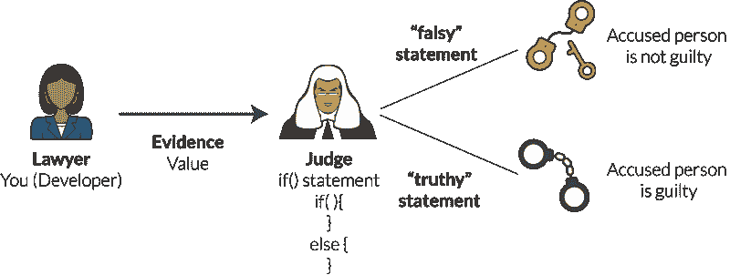
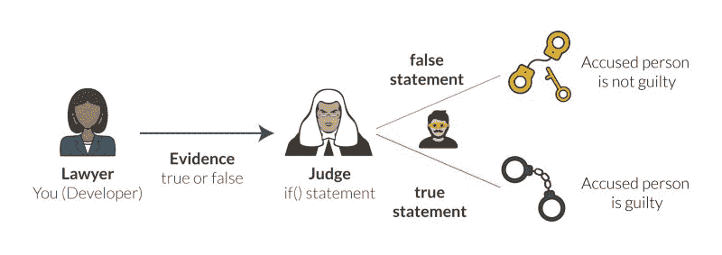
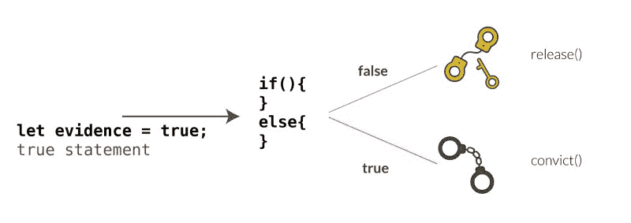
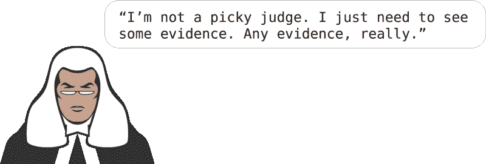
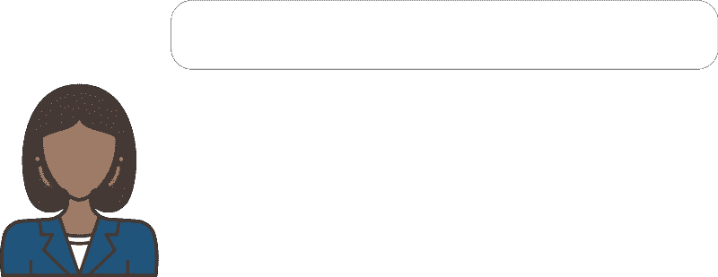
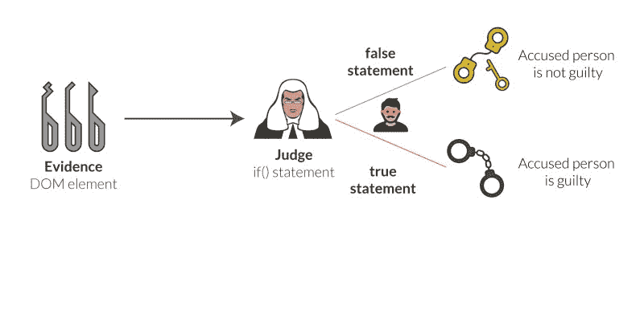
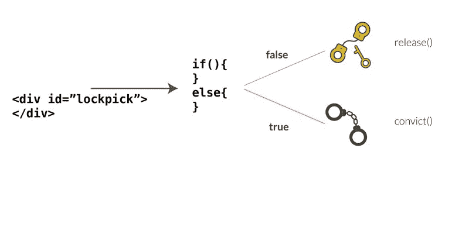
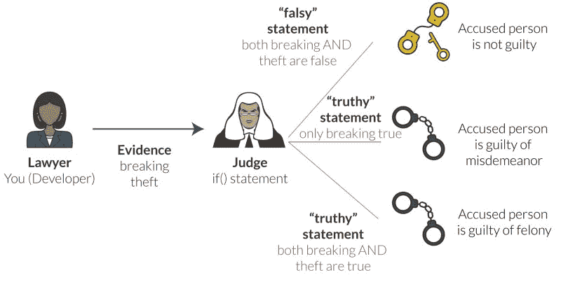

# 上法庭解释 JavaScript 布尔

> 原文：<https://www.freecodecamp.org/news/javascript-booleans-explained-by-going-to-court-a0ca1149a0dc/>

凯文·科诺年科

# 上法庭解释 JavaScript 布尔


[Photo by Brittney Bulter on Unsplash](https://unsplash.com/photos/uZnoD1xuL9A).

如果你曾经看过一个关于法庭的电视节目(或者去过法庭)，那么你就能理解 JavaScript 中的布尔值。

您可能认为布尔是 JavaScript 中最简单的主题。

毕竟，由于变量可以是以下任何一种:

*   数字
*   线
*   排列
*   目标
*   布尔型

…布尔型似乎是最简单的。

```
let bool = true;
```

```
let bool= false;
```

布尔运算仅有的两个选项是`true`或`false`。并且它们被用在`if()`语句中来决定哪个语句应该被执行。

```
if(true){
```

```
}
```

```
else{
```

```
// if value is false, this block runs
```

```
}
```

但问题是。在`if()`语句中，其他变量值可以**评估**为真或假。换句话说，一旦在`if()`语句中使用了该值，JavaScript 就会评估它是`true`还是`false`。

比如你知道值 0 是`true`还是`false`？

这不是哲学问题。JavaScript 有了答案。

不管怎样，这是因为 JavaScript 是一种弱类型的 T4 语言。这意味着在一个`if()`语句的上下文中，它会将其他变量值转换为`true`或`false`，以便运行代码。这就是所谓的确定价值的“真实性”。



其他很多语言都是**强类型**，所以不会把值转换成 true 或者 false。

这可能看起来有点疯狂，但实际上这与美国法官判定被告无罪或有罪的方式非常相似。因此，我可以通过你在《法律与秩序》或电视上任何其他基于法院的程序剧中看到的法律规则来解释 JavaScript 中“真实”和`true` / `false`的工作方式。

出于本教程的目的，假设你是一名地方检察官，正试图起诉一名被指控偷车的人。

而且，你需要理解 JavaScript 中变量的[基础来使用本教程。让我们开始吧！](https://blog.codeanalogies.com/2017/12/20/a-visual-guide-to-understanding-the-sign-in-javascript/)

### JavaScript 中的“真”是什么？

在美国，刑法制度规定，被告“在被证明有罪之前是无辜的”。这意味着起诉人(本案中是你)有责任提供足够的证据来推翻被告无罪的默认假设。

事实上，证据的标准是“排除合理怀疑”。“这在世界上很多国家都是一致的。

当我们使用`if()`语句时，我们并不总是能够插入一个值为`true`或`false`的变量。很多时候，我们必须插入一个会被 JavaScript **求值为** `true`或者`false`的语句。

这和法制差不多！虽然有可能会有一份证据使“有罪”或“无罪”的裁决显而易见，但法官或陪审团也有可能需要评估多份证据并做出决定。

让我们从基础开始。陈述是导致被告定罪的证据。一份`false`声明就是让他们无罪释放的证据。让我们创建一个名为`evidence`的变量，并将其设置为`true`。

```
let evidence = true;
```

```
if (evidence){
```

```
 convict();
```

```
}
```

```
else{
```

```
 release();
```

```
}
```

`convict()`和`release()`是虚构的函数。在这种情况下，由于证据被设定为`true`，法官会判偷车贼有罪。这是这个场景的交互图。



强盗看起来有点像“意大利的工作”里的爱德华·诺顿，嗯？


不管怎样，在现实生活中，事情从来没有这么简单。假设你有一个致命的证据——车门上的指纹。你把这个交给法官。

```
let evidence = "fingerprints";
```

```
if (evidence){
```

```
 convict();
```

```
}
```

```
else{
```

```
 release();
```

```
}
```

啊哈！我们只修改了声明变量证据的第一行。现在它是一个字符串而不是一个布尔值。但是你猜怎么着？由于**类型强制**，JavaScript 会将字符串求值为`true`。由于在`if()`语句中没有条件，所有的字符串都是`true`。我们将运行`convict()`功能！



### 真实的例子

让我们想象一下，证据变量被设置为`0`。我们再次运行相同的`if()`语句。

```
let evidence = 0;
```

```
if (evidence){
```

```
 convict();
```

```
}
```

```
else{
```

```
 release();
```

```
}
```

在这种情况下，该语句实际上会计算为`false`，我们被指控的偷车贼将被释放。


这就是为什么它被称为“真实”——因为 JavaScript 正在评估条件是`true`还是`false`。

由于变量被设置为`0`，这有点像如果你被要求出示针对小偷的证据，而你却说……什么都没有。



很明显，法官会判定你没有足够的证据，然后释放那个人！如果证据被设置为空字符串``` `` ```，也会发生同样的情况。你仍然没有提供任何东西，所以你的陈述被评估为`false` *。*

```
let evidence = '';
```

这里还有一个测试，看看你是否理解`true`对`false`。如果变量还没有初始化成一个值呢？

```
let evidence;
```

```
if (evidence){
```

```
 convict();
```

```
}
```

```
else{
```

```
 release();
```

```
}
```

这是一个非常常见的问题，因为 web 开发人员在他们的脚本中会有另一个语句给`evidence`变量赋值。而且，就像上面的两个例子一样，如果这个变量没有任何值，JavaScript 会将它评估为`false`。

这是一个很好的“无罪推定”的例子。这个变量还没有赋值，所以 JavaScript 不可能把它叫做`true`。

### 在 if()语句中使用 DOM 元素

所以我们已经讨论了“假”变量的值。但是来自 DOM 的元素呢？

**注意**:如果你需要复习，在这里查看我的[DOM 元素指南](https://blog.codeanalogies.com/2018/01/06/traversing-the-dom-visual-explanation/)。

换句话说，当我们使用 DOM 元素来决定运行一个`if/else`语句的哪个分支时会发生什么？如果您使用 jQuery 或 React(或 Angular，等等)，您可能会操作 DOM 来创建更动态的界面。

在我们的法庭例子中，假设你发誓小偷使用的开锁器位于犯罪现场附近的垃圾桶里。用 HTML 术语来说，您是说在 DOM 的某个地方有一个 ID 为`lockpick`的 div。法官会如何确认你的要求？

```
if(document.getElementById('lockpick')){
```

```
 convict()
```

```
}
```

```
else{
```

```
 release()
```

```
}
```

这是该场景的互动图像。



这里的“Truthiness”是指 JavaScript 将检查 DOM，只有在找到 ID 为`lockpick`的元素时才返回`true`。这有点像法官决定你出示的证据是否真实可信。在这种情况下，它是，所以第一个代码块将运行，该人将被定罪。

这个超级有用！我们现在扩展了`true` 的概念，使其包括一个元素是否存在。这个逻辑也适用于对象和数组。你可以检查某个特定类的元素是否存在，某个元素是否有子元素，你明白了。

### if()语句的更多变体

当你把被告带上法庭时，他们仍可能被判较轻的罪行。如果你没有足够的主要指控的证据，他们仍然可以被判较低的罪名。

在汽车盗窃的例子中，有一个破门而入的罪行，然后如果被告已经闯入汽车，盗窃是可能的。

我们可以结合`if()`、`else if()`和`else()`来为这些选项建模。假设被告**的确**闯入了汽车，但没有拿走任何东西。我们可以这样模拟选项:

```
let breaking = true;
```

```
let theft = false;
```

```
if (breaking && theft){
```

```
 convict('felony');
```

```
}
```

```
else if(breaking){
```

```
 convict ('misdemeanor');
```

```
}
```

```
else{
```

```
 release();
```

```
}
```

现在有三种情况。如果满足第一个条件，该代码块将运行。这意味着小偷会被判重罪。但是，如果只有变量`breaking`的值可以被评估为`true`，这个人仍然会被判轻罪。

法官说，“如果我要判这个人重罪，你需要向我出示破门而入和偷窃的证据。”



第一个`if()`语句会对`true && false`求值，由于`false`优先于`true`，所以会简化为`false`(记住，在被证明有罪之前是无辜的)。

如果我们使用“真实”或“虚假”的值，这仍然有效。在`if()`语句中，每一个都将被求值为`true`或`false`，然后 JavaScript 将决定执行哪个块。

### 获取更多可视化教程

你喜欢这本指南吗？给它一个“掌声”，或者在下面注册以获得我关于 web 开发主题的最新教程。