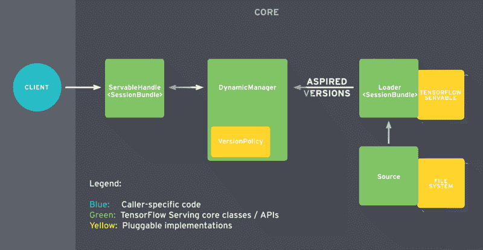
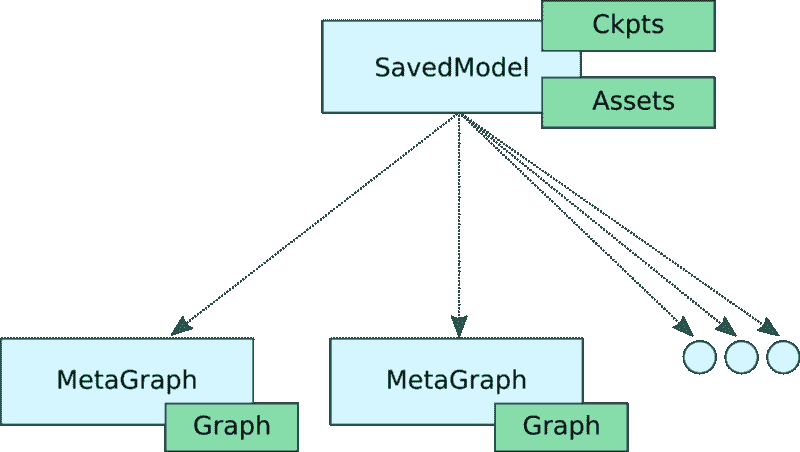
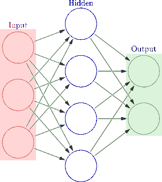
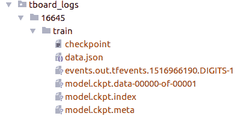
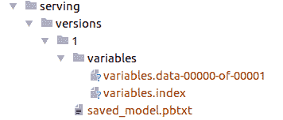
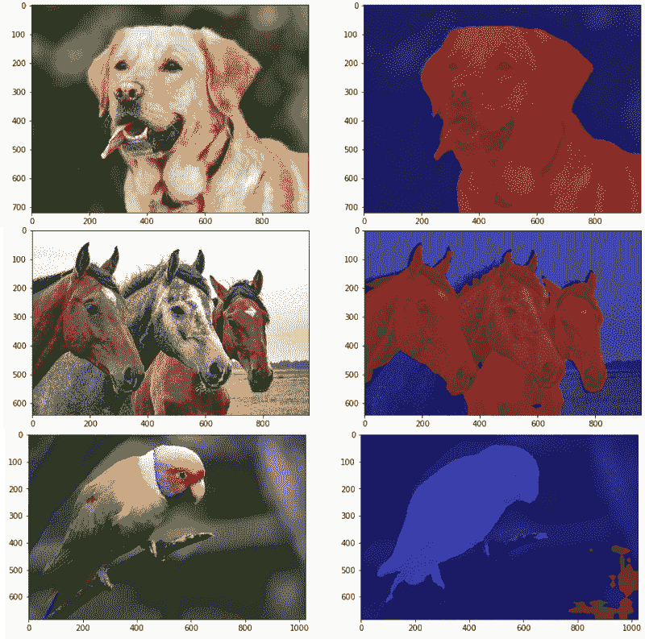

# 如何使用 TF 服务将 TensorFlow 模型部署到生产中

> 原文：<https://www.freecodecamp.org/news/how-to-deploy-tensorflow-models-to-production-using-tf-serving-4b4b78d41700/>

泰勒·席尔瓦

# 如何使用 TF 服务将 TensorFlow 模型部署到生产中


### 介绍

将机器学习(ML)模型投入生产已经成为一个流行的、反复出现的话题。许多公司和框架提供了不同的解决方案来解决这个问题。

为了解决这一问题，Google 发布了 TensorFlow (TF) Serving，希望解决将 ML 模型部署到生产中的问题。

这篇文章提供了一个服务于预先训练的卷积语义分割网络的实践教程。到本文结束时，您将能够使用 TF Serving 部署并向受过 TF 训练的深度 CNN 发出请求。此外，我将概述 TF 服务的主要模块，并讨论它的 API 以及它是如何工作的。

您马上会注意到的一件事是，实际上只需要很少的代码就可以服务于一个 TF 模型。如果您想继续学习本教程并在您的机器上运行这个示例，那么就照着做吧。但是，如果你只是想了解 TensorFlow 服务，你可以专注于前两个部分。

这篇文章强调了我们在[岱坛集团](http://www.daitangroup.com/)所做的一些工作。

### TensorFlow 服务图书馆—概述

让我们花一些时间来理解 TF 服务如何处理服务 ML 模型的整个生命周期。这里，我们将(在较高层次上)回顾一下 TF 服务的每个主要组成部分。本节的目标是提供一个 TF 服务 API 的软介绍。如需深入了解，请前往 [TF Serving](https://www.tensorflow.org/serving/) 文档页面。

TensorFlow 服务由一些抽象组成。这些抽象为不同的任务实现了 API。最重要的是 Servable、Loader、Source 和 Manager。让我们回顾一下它们是如何相互作用的。



简而言之，当 TF Serving 在磁盘上识别出一个模型时，服务生命周期就开始了。源组件会处理这些。它负责识别应该加载的新模型。在实践中，它会关注文件系统，以确定新的模型版本何时到达磁盘。当它看到一个新版本时，它会为这个模型的特定版本创建一个加载器。

总之，加载程序几乎了解模型的所有信息。它包括如何加载它以及如何估计模型所需的资源，比如请求的 RAM 和 GPU 内存。加载器有一个指向磁盘上模型的指针，以及加载它所需的所有元数据。但是这里有一个问题:加载器现在还不允许加载模型。

创建加载程序后，源代码将它作为期望的版本发送给管理器。

收到模型的期望版本后，经理继续服务流程。这里，有两种可能。一个是第一个模型版本被推送到部署。在这种情况下，经理将确保所需的资源可用。一旦完成，管理器就授予加载器加载模型的权限。

第二，我们正在推动现有模式的新版本。在这种情况下，管理器必须在进一步操作之前咨询版本策略插件。版本策略决定了加载新模型版本的过程如何进行。

具体来说，当加载一个新版本的模型时，我们可以在保留(1)可用性或(2)资源之间进行选择。在第一种情况下，我们感兴趣的是确保我们的系统对到来的客户请求总是可用的。我们知道管理器允许加载器用新的权重实例化新的图。

此时，我们同时加载了两个模型版本。但是管理器仅在加载完成后才卸载旧版本，并且在模型之间切换是安全的。

另一方面，如果我们想通过没有额外的缓冲区(对于新版本)来节省资源，我们可以选择保留资源。对于非常重的模型来说，在可用性上有一点差距可能是有用的，以换取节省内存。

最后，当客户机请求模型的句柄时，管理器返回一个 Servable 的句柄。

有了这个概述，我们就可以开始研究现实世界的应用程序了。在接下来的部分中，我们将描述如何使用 TF 服务来服务卷积神经网络(CNN)。

### 导出用于服务的模型

服务 TensorFlow 内置的 ML 模型的第一步是确保它的格式正确。为此，TensorFlow 提供了 [SavedModel](https://www.tensorflow.org/programmers_guide/saved_model) 类。

SavedModel 是 TensorFlow 模型的通用序列化格式。如果您熟悉 TF，您可能已经使用 TensorFlow 保存程序来保存模型的变量。

TensorFlow Saver 提供了将模型的检查点文件保存到磁盘或从磁盘恢复的功能。事实上，SavedModel 包装了 TensorFlow Saver，它是导出 TF 模型用于服务的标准方式。

SavedModel 对象有一些不错的特性。

首先，它允许您将多个元图保存到单个 SavedModel 对象中。换句话说，它允许我们为不同的任务使用不同的图表。

例如，假设您刚刚完成对模型的训练。在大多数情况下，要执行推理，您的图不需要一些特定于训练的操作。这些操作可能包括优化器的变量、学习率调度张量、额外的预处理操作等等。

此外，您可能希望为移动部署提供量化版本的图表。



在这种情况下，SavedModel 允许您保存具有不同配置的图形。在我们的例子中，我们有三个不同的图，带有相应的标签，如“训练”、“推理”和“移动”。此外，这三个图表将共享相同的变量集，这强调了内存效率。

不久以前，当我们想在移动设备上部署 TF 模型时，我们需要知道输入和输出张量的名称，以便向模型提供数据和从模型获取数据。这种需要迫使程序员在图的所有张量中寻找他们需要的张量。如果张量命名不恰当，这个任务可能会非常乏味。

为了让事情变得更简单，SavedModel 提供了对 [SignatureDefs](https://www.tensorflow.org/serving/signature_defs) 的支持。总之，SignatureDefs 定义了 TensorFlow 支持的计算的签名。它为计算图形确定适当的输入和输出张量。简单地说，有了这些签名，您可以指定用于输入和输出的确切节点。

为了使用其内置的服务 API，TF Serving 要求模型包含一个或多个 SignatureDefs。



为了创建这样的签名，我们需要提供输入、输出和所需方法名的定义。**输入**和**输出**表示从字符串到 TensorInfo 对象的映射(关于后者有更多信息)。这里，我们定义了默认的张量，用于向图中输入数据和从图中接收数据。 *method_name* 参数的目标是一个 TF 高级服务 API。

目前，有三种服务 API:分类、预测和回归。每个签名定义都匹配一个特定的 RPC API。分类 SegnatureDef 用于分类 RPC API。Predict SegnatureDef 用于预测 RPC API，等等。

对于分类特征，必须有一个输入张量(用于接收数据)和至少两个可能的输出张量之一:类和/或分数。回归符号定义需要一个张量作为输入，另一个张量作为输出。最后，预测签名允许动态数量的输入和输出张量。

此外，对于 ops 初始化依赖于外部文件的情况，SavedModel 支持资产存储。此外，它还具有在创建 SavedModel 之前清除设备的机制。

现在，让我们看看如何在实践中做到这一点。

### 设置环境

在我们开始之前，从 Github 克隆这个 TensorFlow **DeepLab-v3** 实现。

DeepLab 是 Google 最好的语义分割 ConvNet。基本上，该网络将一幅图像作为输入，并输出一幅类似面具的图像，将某些对象从背景中分离出来。

该版本在 [Pascal VOC](http://host.robots.ox.ac.uk/pascal/VOC/voc2012/) 分割数据集上进行训练。因此，它可以分割和识别多达 20 类。如果你想了解更多关于语义分割和 DeepLab-v3 的知识，可以看看[潜入深度卷积语义分割网络和 Deeplab_V3](https://medium.freecodecamp.org/diving-into-deep-convolutional-semantic-segmentation-networks-and-deeplab-v3-4f094fa387df) 。

所有与服务相关的文件存放在:[。/deeplab_v3/serving/](https://github.com/sthalles/deeplab_v3/tree/master/serving) 。在那里，你会发现两个重要的文件: [deeplab_saved_model.py](https://github.com/sthalles/deeplab_v3/blob/master/serving/deeplab_saved_model.py) 和 [deeplab_client.ipynb](https://github.com/sthalles/deeplab_v3/blob/master/serving/deeplab_client.ipynb)

在继续之前，请确保下载 Deeplab-v3 预训练模型。前往上面的 GitHub 库，点击 checkpoints 链接，下载名为 **16645/** 的文件夹。

最后，你应该有一个名为 **tboard_logs/** 的文件夹，里面放有 **16645/** 文件夹。



现在，我们需要创建两个 Python 虚拟环境。一个用于 Python 3，另一个用于 Python 2。对于每个 env，确保安装必要的依赖项。你可以在 [serving_requirements.txt](https://github.com/sthalles/deeplab_v3/blob/master/serving/serving_requirements.txt) 和 [client_requirements.txt](https://github.com/sthalles/deeplab_v3/blob/master/serving/client_requirements.txt) 文件中找到它们。

我们需要两个 Python envs，因为我们的模型 DeepLab-v3 是在 Python 3 下开发的。但是，TensorFlow 服务 Python API 只针对 Python 2 发布。因此，为了导出模型并运行 TF 服务，我们使用 Python 3 env。为了使用 TF Serving python API 运行客户机代码，我们使用 PIP 包(仅适用于 Python 2)。

注意，您可以通过使用来自 bazel 的服务 API 来放弃 Python 2 env。更多细节请参考 [TF 服务安装](https://www.tensorflow.org/serving/setup#aptget)。

完成这一步后，让我们从真正重要的事情开始。

### 怎么做

为了使用 SavedModel，TensorFlow 提供了一个易于使用的高级实用程序类，名为 [SavedModelBuilder](https://www.tensorflow.org/api_docs/python/tf/saved_model/builder/SavedModelBuilder) 。SavedModelBuilder 类提供了保存多个元图、相关变量和资产的功能。

让我们来看一个如何导出深度细分 CNN 模型进行服务的运行示例。

如上所述，为了导出模型，我们使用 SavedModelBuilder 类。它将生成一个 SavedModel 协议缓冲文件以及模型的变量和资产(如果需要的话)。

让我们来剖析一下代码。

SavedModelBuilder 接收(作为输入)保存模型数据的目录。这里， *export_path* 变量是 *export_path_base* 和 *model_version* 的串联。因此，不同的模型版本将保存在 *export_path_base* 文件夹内的不同目录中。

假设我们在生产中有一个模型的基线版本，但是我们想要部署它的一个新版本。我们已经提高了模型的准确性，并希望向我们的客户提供这个新版本。

要导出同一个图形的不同版本，我们只需将 *FLAGS.model_version* 设置为一个更大的整数值。然后在 *export_path_base* 文件夹中会创建一个不同的文件夹(包含我们模型的新版本)。

现在，我们需要指定模型的输入和输出张量。为此，我们使用[签名定义](https://www.tensorflow.org/serving/signature_defs)。签名定义了我们想要导出的模型类型。它提供了从字符串(逻辑张量名)到 [TensorInfo](https://www.tensorflow.org/api_docs/python/tf/TensorInfo) 对象的映射。其思想是，客户机可以引用签名定义的逻辑名称，而不是引用输入/输出的实际张量名称。

为了服务于语义分割 CNN，我们将创建一个**预测** **签名**。注意， *build_signature_def()* 函数获取输入和输出张量的映射以及所需的 API。

SignatureDef 需要指定:输入、输出和方法名。注意，我们期望三个值用于*输入—* 一个图像，另外两个张量指定它的尺寸(高度和宽度)。对于*输出*，我们只定义了一个结果——分段输出屏蔽。

请注意，字符串“image”、“height”、“width”和“segmentation_map”不是张量。相反，它们是指实际张量 *input_tensor* 、 *image_height_tensor* 和 *image_width_tensor* 的逻辑名称。因此，它们可以是您喜欢的任何独特的字符串。

此外，SignatureDefs 中的映射与 TensorInfo protobuf 对象相关，而不是实际的 tensors。创建 TensorInfo 对象，我们使用效用函数:[*TF . saved _ model . utils . build _ tensor _ info(张量)*](https://www.tensorflow.org/api_docs/python/tf/saved_model/utils/build_tensor_info) 。

就是这样。现在我们调用*add _ meta _ graph _ and _ variables()*函数来构建 SavedModel 协议缓冲区对象。然后我们运行 *save()* 方法，它会将我们模型的快照保存到包含模型变量和资产的磁盘上。

我们现在可以运行 [deeplab_saved_model.py](https://github.com/sthalles/deeplab_v3/blob/master/serving/deeplab_saved_model.py) 来导出我们的模型。

如果一切顺利，你会看到文件夹**。/服务/版本/1** 。请注意,“1”代表模型的当前版本。在每个版本子目录中，您将看到以下文件:



*   *saved_model.pb* 或 *saved_model.pbtxt.* 这是序列化的 SavedModel 文件。它包括模型的一个或多个图形定义，以及签名定义。
*   变量。该文件夹包含图表的序列化变量。

现在，我们准备启动我们的模型服务器。为此，请运行:

```
$ tensorflow_model_server --port=9000 --model_name=deeplab --model_base_path=<full/path/to/serving/versions/>
```

*model_base_path* 指的是保存导出模型的位置。此外，我们没有在路径中指定版本文件夹。模型版本控制由 TF Serving 处理。

### 生成客户端请求

客户端代码非常简单。在: [deeplab_client.ipynb](https://github.com/sthalles/deeplab_v3/blob/master/serving/deeplab_client.ipynb) 里看看吧。

首先，我们读取想要发送到服务器的图像，并将其转换为正确的格式。

接下来，我们创建一个 gRPC 存根。存根允许我们调用远程服务器的方法。为此，我们实例化了*预测 _ 服务 _pb2* 模块的*beta _ create _ prediction service _ stub*类。此时，存根保存了调用远程过程(从服务器)的必要逻辑，就像它们是本地的一样。

现在，我们需要创建并设置请求对象。因为我们的服务器实现了 TensorFlow 预测 API，所以我们需要解析一个预测请求。为了发出预测请求，首先，我们从*预测 _pb2* 模块中实例化**预测请求**类。我们还需要指定*模型规格名称*和*模型规格签名名称*参数。 *name* param 是我们在启动服务器时定义的“model_name”参数。而 *signature_name* 是指分配给 *add_meta_graph* ()例程的 *signature_def_map()* 参数的逻辑名。

接下来，我们必须提供服务器签名中定义的输入数据。记住，在服务器中，我们定义了一个 Predict API 来期望一个图像和两个标量(图像的高度和宽度)。为了将输入数据输入请求对象，TensorFlow 提供了实用程序 *tf.make_tensor_proto()* 。该方法从 numpy/Python 对象创建 TensorProto 对象。我们可以使用它将图像及其尺寸提供给请求对象。

看起来我们准备好呼叫服务器了。为此，我们调用 *Predict()* 方法(使用存根)并将请求对象作为参数传递。

对于返回单一响应的请求，gRPC 支持同步和异步调用。因此，如果您想在处理请求时做一些工作，我们可以调用 *Predict.future()* 而不是 *Predict()* 。

现在我们可以获取并享受结果了。



希望你喜欢这篇文章。感谢阅读！

### 如果您想要更多，请查看:

[**如何使用 TensorFlow 训练自己的 FaceID ConvNet 热切执行**](https://medium.freecodecamp.org/how-to-train-your-own-faceid-cnn-using-tensorflow-eager-execution-6905afe4fd5a)
[*人脸无处不在——从社交媒体网站上的照片和视频，到像…*medium.freecodecamp.org](https://medium.freecodecamp.org/how-to-train-your-own-faceid-cnn-using-tensorflow-eager-execution-6905afe4fd5a)[**潜入深度卷积语义分段网络和 Deep lab _ V3**](https://medium.freecodecamp.org/diving-into-deep-convolutional-semantic-segmentation-networks-and-deeplab-v3-4f094fa387df)
[*深度卷积神经网络(DCNNs)在各种计算机视觉应用中取得了显著成功…*medium.freecodecamp.org](https://medium.freecodecamp.org/diving-into-deep-convolutional-semantic-segmentation-networks-and-deeplab-v3-4f094fa387df)

