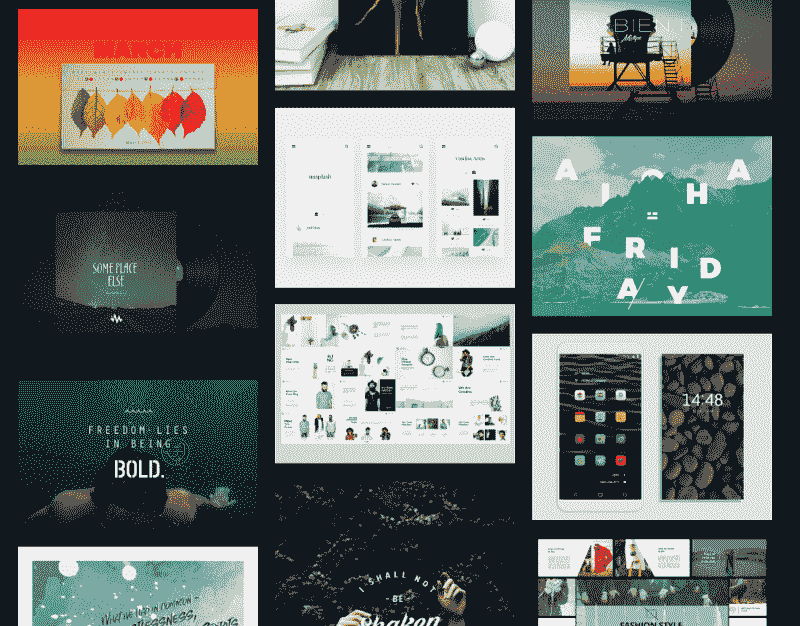
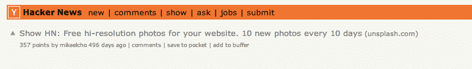
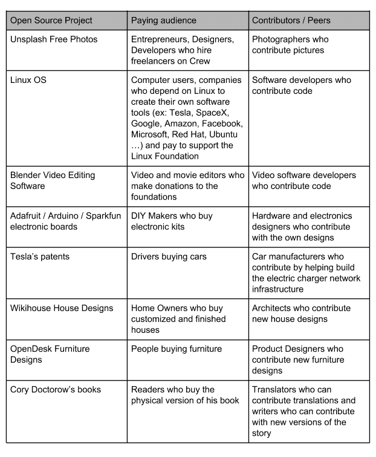
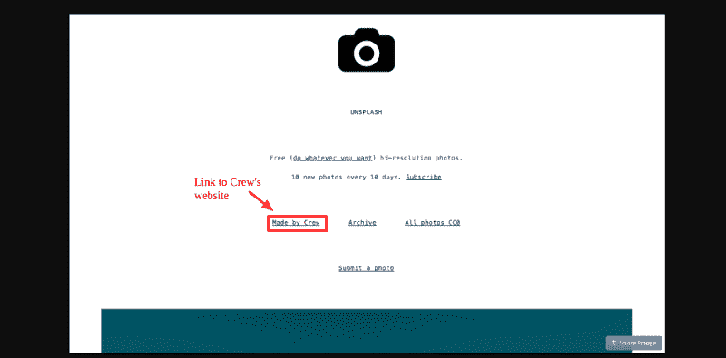
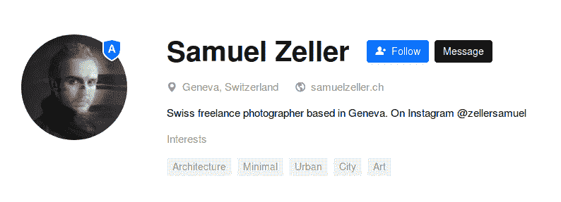
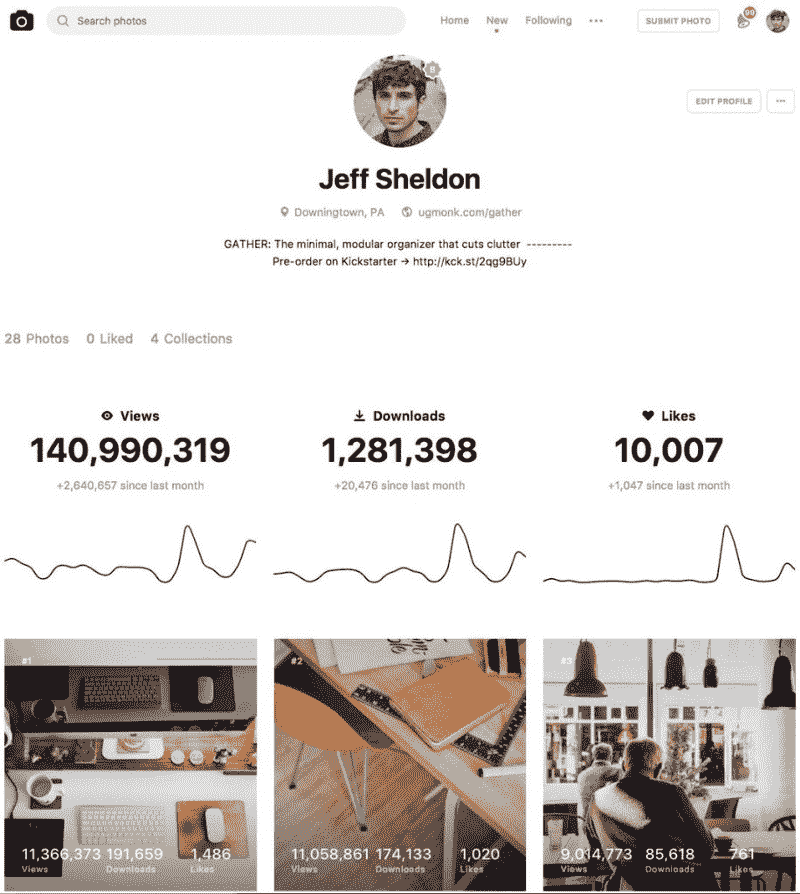
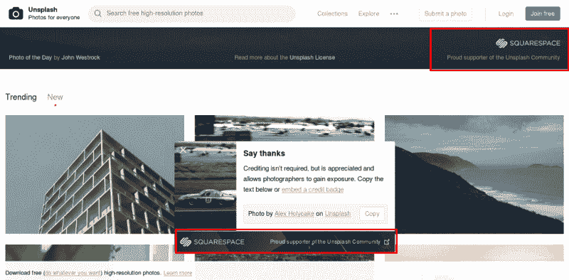

# Unsplash 公式:船员如何从几乎破产到获得 500 万游客

> 原文：<https://www.freecodecamp.org/news/the-unsplash-formula-how-crew-went-from-almost-broke-to-getting-5-million-visitors-ec4db8e7d6cd/>

你是如何从几乎没有牵引力和资金耗尽，到让数百万人访问你的网站的？

你可以像[剧组](https://crew.co/)不小心做的那样用 [Unsplash](https://unsplash.com/) 。创建一个开源项目，将数百万访问者引向你的付费产品。

一开始，当他们开始为自由职业者建立一个市场时，Crew 无法为他们的网站主页找到一张好照片。所以他们雇了一个摄影师(他们在网上找到的要么太蹩脚，要么太贵)。

一旦他们拍了照片，他们有一吨的剩菜。因此，他们选择了 10 张照片，放在 Tumblr 的博客上，供其他人免费下载——“每 10 天 10 张免费照片”。

从 Unsplash/Crew 在 HackerNews 上的一个不起眼的 Tumblr 博客上推广他们的 10 张照片的那一刻起，他们已经获得了数百万的访客，并将数千名新客户重定向到 Crew 的市场，最终挽救了他们的业务。

> (使用 Unsplash ),我们投入了大量的努力，保持了巨大的增长曲线，而在剧组，我们有一个完整的团队，我们试图获得增长，这是一场真正的战斗。最终，我们在第一年就达到了 100 万的下载量，这标志着我们的速度并没有减慢——Mikael Cho，Crew 和 Unsplash 的创始人

对于一些将在硬盘上积灰的闲置图片来说，这是一个难以置信的投资回报。

这就是为什么今天我要向大家展示 Unsplash 用来发展和销售 Crew(他们的自由职业者市场)的一些策略，并将他们的摄影平台发展到每月 10 亿张照片，有超过 300，000 张免费高分辨率照片和 50，000 多名贡献者。

### 1.带着你“未使用”的创作去开发无法到达的分销渠道

Unsplash 在他们的网站上有一些未使用过的照片。他们有三个选择。他们可以忘记他们。他们可以试着在库存照片网站上出售它们。或者他们可以直接送人。

事实证明，把它们送人远比自己留着或者试图在照片收藏平台上出售要好得多。

最近，一组研究人员发现,《纽约时报》上被分享最多的文章是那些给读者带来实际效用的文章。给某人一些有用的东西往往会对人们产生最大的影响。当你将给予和摄影这两种强大的东西结合在一起时，你会达到一个全新的影响水平。

要开始这样做，你可以使用像 WordPress 这样简单免费的工具。

Unsplash 开始在 Tumblr 博客上发布免费照片，收费 19 美元。一旦它真正获得了牵引力，吸引了客户和现金，花一些时间和金钱来建立一个合适的平台来托管 Unsplash 是有意义的。

> 我们相信，如果我们要求付款或赊账的话，放弃我们的图像所带来的好处将远远超过我们所能获得的。事实证明这是真的。通过免费提供我们的图片，Unsplash 变成了比我们出售它们可能获得的数百美元更有意义的东西。前 10 张照片已经被浏览了 5800 万次。Unsplash 已经成为一个拥有超过 2000 万创作者的社区。来自世界各地的人们慷慨地贡献了超过 250，000 张照片，推动了数以亿计的创造性行为- Mikael Cho。

Unsplash 照片不仅帮助设计师和企业家创建演示和网站，也是从教师到非营利组织到独立创作者的灵感来源。

A few things [made with Unsplash](https://madewith.unsplash.com/)

如果你是一名设计师或内容创作者——无论是代码、食谱、农业、电影剪辑、平面设计、摄影、时尚、电子硬件、材料设计、汽车、飞机、机器人，还是其他什么——并且你的工作很难获得分发，那么你的开源想法有一个位置，特别是如果你分享高质量的内容和设计。

Unsplash、Github、Instructables、Arduino、Adafruit、OS Vehicle(现为 Open Motors)、Local Motors、Wikihouse 或 Opendesk 的成功就是证明。

> 当两届《纽约时报》畅销书作家蒂姆·菲利斯被禁止在巴诺书店发行他的书时，他在 BitTorrent 上免费上传了他的书的摘录以获得发行。作家 Leo Babauta 在他受欢迎的博客 Zen Habits 上“公开”了所有的东西，以此来传播他的作品，这比他一个人传播得更远。这位说唱歌手成为第一位没有出售自己专辑的实体拷贝，也没有免费赠送大部分音乐就赢得格莱美奖的艺人——Mikael Cho

你免费分享一些东西，吸引观众和贡献者，这反过来吸引更多的观众，激励更多的贡献者去创造和贡献。

从 Unsplash 下载图片的人中，有 70%是以前从未从库存图片网站下载过任何东西的人。这同样适用于任何其他行业。70%将会下载新的无版权内容的人将会是目前没有从该行业购买任何东西的人，但他们可能会反过来成为创作者、混音师和推广者。

可以想象，如果你在开源中分享你的设计，并邀请其他人也来分享，你可以开发一个全新的观众，他们可能从来没有接触过你的作品，并帮助你建立和推广它。

takealways:

*   列出您创建的所有未使用的内容
*   **在 WordPress、Dropbox 或任何你能找到的免费工具上开源分享这些内容**。确定三件事。首先，你分享的内容不应该在其他地方广泛传播。其次，人们应该发现内容确实有用，即使它是免费的，并有动力为其创作做出贡献。第三，内容应该非常有用，以至于人们愿意为此付费。
*   **每月打开并发布 1 到 10 个想法**。例如，每月 1 至 10 张照片或设计。
*   并且**让人们订阅你的时事通讯**以便每月获得更多开放的想法，这样你就可以不断增加你的受众。

### 2.找到一个愿意为你的开源项目付费的观众，然后免费赠送

不要去你开源受众所在的地方。相反，去那些人们已经为你已经分享的开源内容付费的地方。

我看到很多人犯的一个错误，也是我自己一开始犯的一个错误，就是与其他同事分享你的工作，因为他们会理解你在做什么。许多开发人员加入其他开发人员活动或 LinkedIn 小组，而不是参加没有人做他们做的事情的活动或小组。

请注意，你的同行知道如何做你所做的事情，所以他们可能会对你的开源内容感兴趣，但他们不会为你提供的任何其他服务付费。

所以你应该寻找愿意为你的服务付费的人。如果你是一个非营利组织，这将是人们准备按下捐赠按钮。

没有比免费更好的了。因此，不管人们一直在花钱买什么，他们都会很高兴免费得到它。这应该会给你的开源项目带来大量的流量和关注，同时也会给你的付费产品带来大量的流量和关注。

在 Unsplash 的案例中，他们一开始并没有去找摄影师。他们去[黑客新闻](https://news.ycombinator.com/item?id=5794083)分享他们的免费照片，这是一个聚集了企业家和计算机科学爱好者社区的网站。

> 我们把它放在了 Hackernews 上，几个小时后，它就登上了榜首。网站开始崩溃，因为我们有公共的 Dropbox 链接。Dropbox 的工程主管碰巧看到了 Hackernews 的帖子，并说他们会将我们升级到当天的最大 pro 计划。他们不应该被用于公共 Dropbox 链接，但他说他们会保持网站，因为他们认为这很酷。这是 Unsplash - Mikael Cho 的第一天

赵承熙知道他的观众在为他们的网站寻找免费和漂亮的照片。甚至在 Flickr 上，甚至在库存摄影网站上也很难找到它们。所以 Unsplash 非常适合。

最重要的是，企业家观众也可能有兴趣在他们的团队网站上雇佣其他开发人员、自由职业者和设计师，为他们的业务创造一个良性循环。

以下是开源项目付费观众和同行的一些其他例子:

takealways:

*   **列出已经为你提供的开源内容付费的人的名单**
*   **然后列出这些人经常去的网站或活动**
*   在这些网站和活动中推广您的开源内容。例如，Unsplash 访问了 Hacker News、VentureBeat、Digital Trends、Lifehacker 和 Tech Vibes，它知道许多开发人员在这些网站上寻找人们在 Flickr 上找不到的免费和美丽的照片。

### 3.用你的开源项目将流量导向你的服务或产品页面

一旦 Unsplash 让人们来到他们的平台，他们只需添加一个到 Crew 的链接，以吸引新客户从他们的市场雇佣自由职业者。

*Source: [https://unsplash.com/@samuelzeller](https://unsplash.com/@samuelzeller)*

Unsplash 中的这个简单链接已经吸引了超过 500 万的访问者。从愿意在 Crew 上提供服务的手机和网页设计师和开发者，到有兴趣雇佣他们的自由职业者来制作定制网站或应用程序的付费客户。

但是 Unsplash 不仅仅让船员受益。任何贡献图片的摄影师都可以为自己的业务添加链接，并从 Unsplash 的流量中获益。

*Source: [https://unsplash.com/@samuelzeller](https://unsplash.com/@samuelzeller)*

事实上，通过上传 460 张图片，塞缪尔·泽勒已经获得了超过 2.55 亿的浏览量和超过 170 万的下载量。

这就是他的第一个客户，瑞士最大的银行，在他 2016 年开始成为自由职业者时找到他并给他 4 个项目的原因。

他们联系他的原因是什么？他们已经在他们的全球数据库中使用了一些他的 Unsplash 图像，并希望有更多相同风格的图像。

外卖:

*   使用你的开源项目链接并推广付费服务。例如，Unsplash 曾经链接到 Crew 的市场。Adafruits 教程链接到他们的电子商务产品，WordPress 链接到他们的虚拟主机合作伙伴，等等。
*   给贡献者一个地方，让他们可以推广自己的个人资料和服务。

### 4.与你的免费内容创建者建立双赢的关系

一旦你找到了愿意为你的服务付费并下载你的开源内容的人，是时候邀请你的同行来贡献了。

这将使你的开放内容更有价值，也将吸引你的贡献者想要达到的观众。

刚开始的时候，如果得到批准，摄影师可以每十天在 Unsplash 上发布十张照片。这就是 Unsplash 起飞到另一个水平的真正原因。

Unsplash 可以迫使摄影师免费提供他们的照片，向他们展示，提供存储在硬盘中的内容可以帮助他们为自己创造一个观众群。

他们可以从贡献中获得的其他好处包括:

*   导演前所未有的曝光率，创造了大量的网站流量
*   **获得客户推荐**
*   **将其作为社交证明**(摄影师可以告诉他的客户，他的照片在 Unsplash 上有数千次的浏览和下载)
*   **练习自己的手艺**
*   利用照片来建立一个观众群，让他们能够以此谋生。
*   **或者试图真正回馈社会**。

事实上，摄影师自己[报告说](https://community.unsplash.com/articles/why-i-share-my-photos-on-unsplash)在发布几张照片后就获得了客户的订单。其他人则在世界各地拍摄照片。有些人已经得到了足够的工作，可以离开他们的工作，成为全职摄影师。一些公司已经能够为新产品建立受众。和 Unsplash 交谈过的每一位投稿人都很享受他们的摄影作品对推动创造力的影响。

今天，Unsplash 上的一张照片比任何其他平台上的照片都多。比 Instagram 上的还多。比纽约时报的头版还多。

[*Source*](https://twitter.com/ugmonk/status/870260821678592001/photo/1)

摄影师不再需要带着观众或者有经纪人才能变得伟大。Unsplash 为他们带来了观众。

作为一名独立设计师，我理解你不能为曝光做任何事，因为曝光并不能支付账单。但是完全忽视曝光的价值也是没有意义的。

所有的艺术家都需要观众才能生存。如果没有报酬，我们为什么还要花时间在 Instagram 上发布呢？因为随着时间的推移，这些帖子会吸引更多的读者。

在过去十年中，YouTube、iPhone、Twitter、Instagram、SoundCloud 和 Medium 等平台让越来越多的人能够表达和联系。有时候，这种表达和联系是为了好玩。不为别的，只为创造。其他时候这样做是为了给其他东西创造观众。电影制作人在 YouTube 上免费分发预告片来销售一部电影。音乐家在 SoundCloud 上发布免费歌曲或整张专辑来销售音乐会门票。作者提供免费章节，并在博客中投入数千小时的无薪时间来销售一本书。

> 新的开源平台不会扼杀产业。他们改变了分布- [米凯尔·秋](https://medium.com/unsplash/the-future-of-photography-and-unsplash-811f114aab7a)

开源平台可以为如此多的人提供一个机会，让他们立即与大量观众分享他们的技术。新平台创造了一个分销渠道和社区，否则我们不会有。从这个意义上说，现在是成为一名创造者的最佳时机。

外卖:

*   **列出你的同龄人经常去的地方、网站和活动**
*   **列出并向贡献者解释他们通过贡献自己的内容将获得的好处**(例如，获得网站流量以建立他们的受众，获得客户推荐，社交证明，练习他们的手艺或回馈社区的方式)
*   **为其他人提供贡献自己内容的方式，并管理他们的内容**。这可能是一个简单的行动号召，在开始时通过电子邮件向您发送一份贡献，过一段时间后，您可以创建一个表单，人们可以通过它直接发布他们的提交内容。
*   管理他们的贡献确保高质量
*   **鼓励您的贡献者社区使用您的项目来推广他们自己的付费服务或网站，这样他们也可以从开源内容共享中受益**。贡献的动力越大，他们就越想在你的平台上构建开源内容。

### 5.为 Unsplash 的未来创造其他收入来源

现在这个团队已经被卖给了 Dribbble，Unsplash 成为了自己的实体。由于它不能再依靠船员来资助它的运营，它必须在财务上变得可持续。

因此，要想找到一个 100%开源的公司赚钱的新方法，Unsplash 可以采取以下几种方式:

#### 原生广告:

Unsplash 上有很多非常有趣的房地产。例如，如今人们使用 Unsplash 的方式很像谷歌搜索，只是它是针对图像的。计划是给 Unsplash 增加一个本地广告组件。

假设有人正在搜索鞋子，平台上已经有了这些非常漂亮的鞋子图片。再说耐克鞋也在平台上。这样，你就有了一个内置在搜索中的原生广告元素。

它仍然是一个高质量的东西。可以显示有针对性的广告，而不是使用蹩脚的横幅广告和展示一堆广告。这将增加联合国战略规划秘书处的价值，也是联合国战略规划秘书处赚取收入的一种方式。

Unsplash 还可以与贡献者合作制作一些内容，因此与品牌合作并希望参与 Unsplash 的摄影师实际上可以建立联系。

> 这是一个双重的好处。我们相信我们赚钱的最好方法是帮助别人赚钱

搜索这些图片的人可以将它们嵌入他们的网站，为品牌创造更多的广告。

其他开源项目，比如 Read the Docs，用他们所谓的“道德广告”来资助他们的项目。

*   他们尊重用户，同时为广告主提供价值。
*   他们不会存储用户的个人信息。
*   他们只记录浏览量和点击量。
*   他们不会建立一个你的个性档案来卖广告。
*   他们只展示开发者感兴趣的公司的高质量广告。
*   广告中的产品应该让用户感兴趣。
*   广告不会闪烁或移动。
*   他们报告说，他们在他们的网站上运行他们想要的广告，以一种让他们感觉良好的方式。
*   他们还把 10%的广告空间给了社区项目，以此来感谢开源社区。

> 更新:Unsplash 实际上在这篇文章写完之后就放置了他们的赞助横幅。你可以在主页和提醒中找到它们，当你下载一张图片的时候，你可以把它们归功于摄影师。

*Screenshot of Unsplash page with sponsored links to Squarespace*

#### 照片贡献者的广告收入分成

Unsplash 可以赚钱的另一种方式是插入这些道德或原生广告，并让贡献者能够选择加入广告收入共享选项。

斯科特·韦伯探索了这个想法:

> Unsplash 能不能设计出某种算法，根据照片浏览量和照片下载量来确定贡献者的广告收入？也许照片之类的东西也会被整合到算法中。

> 不管是什么情况，网站内置了高度定向的原生广告，贡献者能分享收入吗？我们能不能像在 YouTube 上看到的那样，看到内容创作者的照片？

> 我不知道这在技术上如何实现，但 Unsplash 团队很聪明，他们会找到人才来实现这一目标。

takealways:

*   找到一个简单的商业模式来资助你的开源操作。
*   如果你不知道如何或从哪里开始，**想知道如何用开源赚钱，去[到伟大的 Lars Zimmermann 的](http://bloglz.de/business-models-for-open-source-hardware-open-design/)这篇文章**。看看哪种模式最适合您的项目，并发挥创意。

### 结论

Unsplash 已经成为数码摄影行业的重要参与者。你自己也可以通过颠覆一个行业来做类似的事情。聚集你的社区，造福你的行业。

基于 Unplash 的现实营销策略，你可以借用、修改和采纳以下 5 个关键要点:

1.  **利用您创建的未使用的内容**。在 WordPress 或 Dropbox 等免费平台上分享，每月发布 1 到 10 个新想法或设计。**邀请人们订阅你的时事通讯，不断增加你的受众**
2.  **找到那些已经为你的免费服务付费的人**。
3.  **一旦你知道他们在哪里，就在他们常去的网站和活动中推广你的开源内容**。不要忘记在你的开源内容中放一个付费项目的链接。
4.  让人们毫不犹豫地做出贡献。给贡献者一个页面，他们可以在那里推广自己的个人资料和服务，列出他们从贡献中获得的好处，并邀请他们加入您的项目。
5.  **找到一个简单的[方法来为你的开源操作](http://bloglz.de/business-models-for-open-source-hardware-open-design/)**获得报酬。看看哪种模式最适合您的项目，并发挥创意。

特色图片来源:照片由[杰姆-马文·冯·哈根](https://unsplash.com/photos/_4VwJPDaQYQ?utm_source=unsplash&utm_medium=referral&utm_content=creditCopyText)在 [Unsplash](https://unsplash.com/search/photos/unsplash?utm_source=unsplash&utm_medium=referral&utm_content=creditCopyText) 上拍摄

*最初发布于 2018 年 6 月 7 日[boldandopen.com](http://boldandopen.com/unsplash-open-source-growth-hacking-formula/)。*