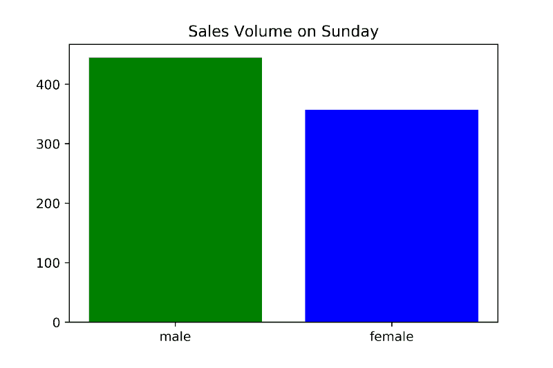
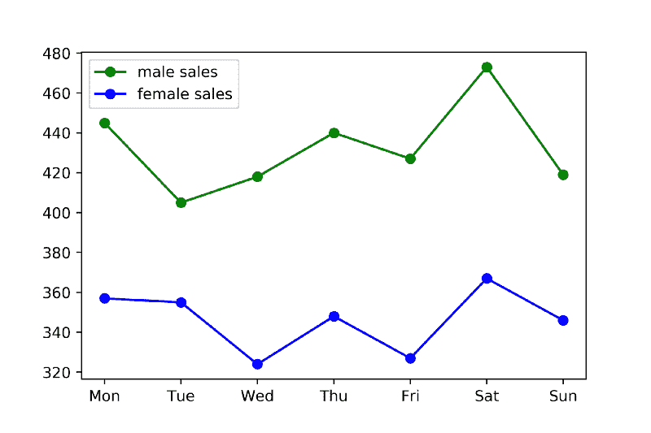
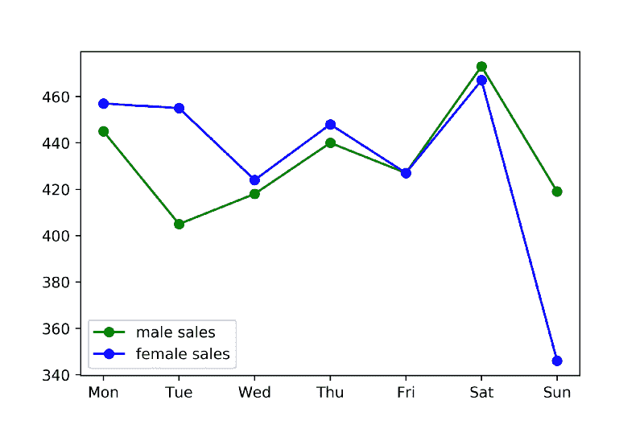

# 用 Python 到底能做什么？以下是 Python 的 3 个主要应用。

> 原文：<https://www.freecodecamp.org/news/what-can-you-do-with-python-the-3-main-applications-518db9a68a78/>

作者 YK·杉

如果您正在考虑学习 Python——或者如果您最近才开始学习——您可能会问自己:

> **“我到底能用 Python 做什么？”**

这个问题很难回答，因为 Python 有很多应用。

但是随着时间的推移，我发现 Python 有 3 个主要的流行应用:

*   Web 开发
*   数据科学—包括机器学习、数据分析和数据可视化
*   脚本

我们依次来说一下他们中的每一个。

### **网页开发**

基于 Python 的 Web 框架，如 Django T1 和 T2 Flask T3，最近在 web 开发中非常流行。

这些 web 框架帮助您用 Python 创建服务器端代码(后端代码)。这是在你的服务器上运行的代码，而不是在用户的设备和浏览器上运行的代码(前端代码)。如果你不熟悉后端代码和前端代码的区别，请看我下面的脚注。

#### 但是等等，为什么我需要一个 web 框架？

这是因为 web 框架使得构建通用后端逻辑变得更加容易。这包括将不同的 URL 映射到 Python 代码块，处理数据库，以及生成用户在浏览器上看到的 HTML 文件。

#### 我应该使用哪个 Python web 框架？

Django 和 Flask 是两个最流行的 Python web 框架。如果你刚刚开始，我推荐你使用其中的一个。

#### **Django 和 Flask 有什么区别？**

Gareth Dwyer 有一篇关于这个话题的优秀文章，让我在这里引用一下:

***<begin quo*te>**

主要对比:

*   Flask 提供了简单性、灵活性和细粒度控制。它是非独立的(它让您决定如何实现事物)。
*   Django 提供了无所不包的体验:开箱即用的管理面板、数据库接口、ORM(对象关系映射)和应用程序和项目的目录结构。

你可能应该选择:

*   Flask，如果您关注的是体验和学习机会，或者如果您希望对使用哪些组件有更多的控制(例如您希望使用什么数据库以及您希望如何与它们交互)。
*   姜戈，如果你专注于最终产品。特别是如果你正在开发一个简单的应用程序，比如一个新闻网站，一个电子商店，或者博客，你希望总是有一个单一的，明显的做事方式。

***</end quo*te>**

换句话说，如果你是初学者，Flask 可能是更好的选择，因为它需要处理的组件更少。此外，如果您想要更多的定制，Flask 是更好的选择。

另一方面，如果您希望直接构建一些东西，Django 可能会让您更快地实现。

现在，如果你想学习 Django，我推荐一本名为《Django 初学者》的书。这里可以找到[。](http://csdojo.io/dj)

你也可以在这里找到那本书的免费样本章节。

好了，我们进入下一个话题！

### **数据科学——包括机器学习、数据分析和数据可视化**

#### **首先，我们来回顾一下什么是机器学习*什么是*。**

我认为解释什么是机器学习的最好方式是给你一个简单的例子。

假设你想开发一个程序来自动检测图片中的内容。

所以，给定下面这张图(图 1)，你希望你的程序识别出它是一只狗。

Picture 1

给定下面的另一个(图 2)，您希望您的程序识别出它是一个表格。

Picture 2

你可能会说，我可以写一些代码来实现。举个例子，也许如果图片中有很多浅棕色的像素，那么我们可以说这是一只狗。

或者，你可以找出如何检测图片的边缘。然后，你可能会说，如果有很多直边，那么它就是一张桌子。

然而，这种方法很快就变得棘手了。如果图中有一只白狗没有棕毛怎么办？如果图片只显示了桌子的圆形部分呢？

这就是机器学习的用武之地。

机器学习通常实现自动检测给定输入中的模式的算法。

比方说，你可以给机器学习算法 1000 张狗的照片和 1000 张桌子的照片。然后，它会学习狗和桌子的区别。当你给它一张新的狗或桌子的图片时，它将能够认出这是哪一张。

我觉得这有点类似于婴儿学习新事物的方式。婴儿如何知道一个东西看起来像狗，另一个像桌子？可能来自一堆例子。

你可能不会明确地告诉一个婴儿，“如果一个东西是毛茸茸的，有浅棕色的毛，那么它可能是一只狗。”

你可能会说，“那是一只狗。这也是一只狗。这是一张桌子。那个也是桌子。”

机器学习算法的工作方式大致相同。

您可以将同样的想法应用于:

*   推荐系统(想想 YouTube、亚马逊和网飞)
*   人脸识别
*   声音识别

在其他应用中。

你可能听说过的流行的机器学习算法包括:

*   神经网络
*   深度学习
*   支持向量机
*   随机森林

您可以使用上述任何算法来解决我前面解释的图片标记问题。

#### **用于机器学习的 Python**

Python 有流行的机器学习库和框架。

最受欢迎的两个是 **scikit-learn** 和 **TensorFlow** 。

*   scikit-learn 内置了一些更流行的机器学习算法。我在上面提到了其中的一些。
*   TensorFlow 更多的是一个底层库，允许你构建定制的机器学习算法。

如果你刚刚开始一个机器学习项目，我建议你首先从 scikit-learn 开始。如果你开始遇到效率问题，那么我会开始研究 TensorFlow。

#### **我应该如何学习机器学习？**

要学习机器学习的基础知识，我会推荐斯坦福的或者加州理工的。

请注意，你需要微积分和线性代数的基础知识来理解那些课程中的一些材料。

然后，我会用 [Kaggle](https://www.kaggle.com/) 练习你从这些课程中学到的东西。这是一个网站，人们在这里竞争为给定的问题建立最好的机器学习算法。他们对初学者也有很好的指导。

### **数据分析和数据可视化呢？**

为了帮助你理解这些可能看起来像什么，让我在这里给你一个简单的例子。

假设你在一家在线销售产品的公司工作。

然后，作为一个数据分析师，你可能会画一个这样的条形图。

Bar Chart 1 — generated with Python

从这个图表中，我们可以看出，在这个特定的星期天，男性购买了超过 400 个单位的这种产品，女性购买了大约 350 个单位的这种产品。

作为数据分析师，您可能会对这种差异提出一些可能的解释。

一个显而易见的可能解释是，这种产品更受男性欢迎，而非女性。另一个可能的解释是样本量太小，这种差异只是偶然造成的。另一个可能的解释是，出于某种原因，男性更倾向于在周日购买这种产品。

为了理解这些解释中哪一个是正确的，你可以画另一个像这样的图。

Line Chart 1 — generated with Python

我们不是只显示周日的数据，而是查看一整周的数据。正如你所看到的，从这个图表中，我们可以看到这种差异在不同的日子里相当一致。

从这个小小的分析中，你可能会得出结论，对这种差异最有说服力的解释是，这种产品只是更受男性欢迎，而不是女性。

另一方面，如果你看到一个像这样的图表呢？

Line Chart 2 — also generated with Python

那么，如何解释周日的差异呢？

你可能会说，也许出于某种原因，男性倾向于只在周日购买更多这种产品。或者，也许这只是一个巧合，男人在周日买得更多。

这是现实世界中数据分析的一个简化例子。

我在谷歌和微软工作时做的数据分析工作与这个例子非常相似——只是更复杂。实际上，我在谷歌使用 Python 进行这种分析，而在微软使用 JavaScript。

我在这两家公司都使用 SQL 从我们的数据库中提取数据。然后，我会使用 Python 和 Matplotlib(在谷歌)或 JavaScript 和 D3.js(在微软)来可视化和分析这些数据。

#### **使用 Python 进行数据分析/可视化**

最流行的数据可视化库之一是 Matplotlib。

这是一个很好的入门库，因为:

*   这很容易上手
*   其他一些库如 [seaborn](https://seaborn.pydata.org/) 就是基于它。因此，学习 Matplotlib 将有助于您以后学习这些其他库。

**应该如何学习 Python 的数据分析/可视化？**

你应该首先学习数据分析和可视化的基础知识。当我在网上寻找这方面的好资源时，我什么也找不到。所以，我在 YouTube 上做了一个关于这个主题的视频:

我最后还在 Pluralsight 上做了一个关于这个主题的[完整课程，你可以通过注册他们的 10 天免费试用免费参加。](https://goo.gl/fZ5oVX)

我推荐他们两个。

在学习了数据分析和可视化的基础知识后，从 Coursera 和 Khan Academy 等网站学习统计学的基础知识也会有所帮助。

### **脚本**

#### **什么是脚本？**

脚本通常是指编写旨在自动化简单任务的小程序。

所以，我在这里举一个我亲身经历的例子。

我曾经在日本的一家小公司工作，那里有一个电子邮件支持系统。这是一个让我们回复客户通过电子邮件发送给我们的问题的系统。

当我在那里工作时，我的任务是统计包含特定关键字的电子邮件数量，以便我们可以分析我们收到的电子邮件。

我们可以手动完成，但是我写了一个简单的程序/简单的脚本来自动完成这个任务。

实际上，当时我们用 Ruby 做这个，但是 Python 也是做这种工作的好语言。Python 适合这种类型的任务，主要是因为它具有相对简单的语法，并且易于编写。用它写点小东西测试一下也很快。

### **嵌入式应用呢？**

我不是嵌入式应用方面的专家，但我知道 Python 与 Rasberry Pi 一起工作。这似乎是一个受硬件爱好者欢迎的应用程序。

### 游戏呢？

您可以使用名为 PyGame 的库来开发游戏，但它并不是最流行的游戏引擎。你可以用它来建立一个爱好项目，但是如果你对游戏开发很认真的话，我个人不会选择它。

相反，我会推荐用 C#开始使用 Unity，这是最流行的游戏引擎之一。它允许你为许多平台构建游戏，包括 Mac、Windows、iOS 和 Android。

### 桌面应用呢？

您可以使用 Tkinter 用 Python 创建一个，但这似乎也不是最流行的选择。

相反，像 Java、C#和 C++ 这样的语言似乎更受欢迎。

最近，一些公司也开始使用 JavaScript 创建桌面应用程序。

[比如 Slack 的桌面应用就是用一个叫电子](https://slack.engineering/building-hybrid-applications-with-electron-dc67686de5fb)的东西打造的。它允许您用 JavaScript 构建桌面应用程序。

就个人而言，如果我正在构建一个桌面应用程序，我会选择 JavaScript。如果你有网页版的话，它允许你重用一些网页版的代码。

然而，我也不是桌面应用的专家，所以如果你不同意或者同意我的观点，请在评论中告诉我。

### **Python 3 还是 Python 2？**

我会推荐 Python 3，因为它更现代，也是目前更受欢迎的选择。

### **脚注:关于后端代码 vs 前端代码的说明(以防你不熟悉术语):**

假设你想做类似 Instagram 的东西。

然后，您需要为您想要支持的每种类型的设备创建前端代码。

例如，您可以使用:

*   iOS 版 Swift
*   Android 版 Java
*   用于网络浏览器的 JavaScript

每组代码将在每种类型的设备/浏览器上运行。这将是决定应用程序布局的代码集，当你点击按钮时，按钮应该是什么样子，等等。

然而，你仍然需要存储用户信息和照片的能力。您会希望将它们存储在您的服务器上，而不仅仅是用户的设备上，以便每个用户的粉丝都可以查看他/她的照片。

这就是后端代码/服务器端代码的用武之地。您将需要编写一些后端代码来做类似这样的事情:

*   跟踪谁在跟踪谁
*   压缩照片，这样它们就不会占用太多存储空间
*   在*发现*功能中向每个用户推荐照片和新账户

所以，这就是后端代码和前端代码的区别。

顺便说一下，Python 并不是编写后端/服务器端代码的唯一好选择。还有许多其他流行的选择，包括基于 JavaScript 的 Node.js。

### 喜欢这篇文章吗？那么，你可能也会喜欢我的 YouTube 频道。

我有一个名为 [CS Dojo](https://www.youtube.com/csdojo) 的编程教育 YouTube 频道，拥有 440，000 多名订户，我在那里制作了更多类似本文的内容。

例如，您可能会喜欢这些视频:

#### 无论如何，非常感谢你阅读我的文章！