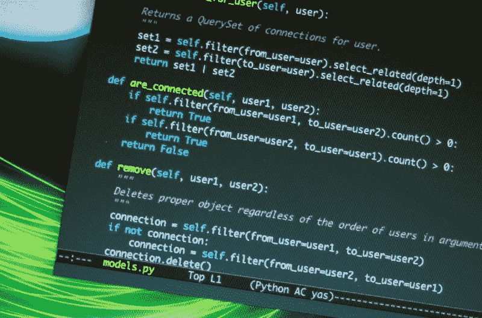
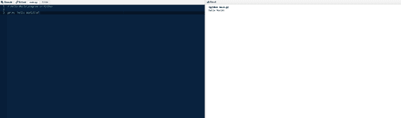

# 如何不举办“学习代码”训练营

> 原文：<https://www.freecodecamp.org/news/how-not-to-run-a-learn-to-code-bootcamp-6815a5e9d4c7/>

作者:米歇尔·琼斯

# 如何不举办“学习代码”训练营

#### 你即将看到的故事是真实的；为了保护无辜，名字被改了。

Python code by [nyuhuhuu](https://www.flickr.com/photos/nyuhuhuu/4653088356).

### 在课程开始之前

[1919 ad for a Comptometer training school](https://commons.wikimedia.org/wiki/File:Comptometer_ad_1919.png).

#### 不要确定你的目标受众

将注册页发送给世界上每一个给过你电子邮件地址的订户。没有任何关于他们背景或兴趣的信息？谁在乎，你的课程超级重要。如果你没有通知成百上千的人，他们曾经在你的网站上输入了他们的电子邮件地址，那你就是完全失职了。

#### 不要提课程内容

谁不喜欢神秘呢？

#### 不要暗示先决技能

让这个谜继续下去，只提供关于人们应该有多少编程经验的模糊建议，以及关于可能有帮助的先前语言的模糊建议。

不要涉及任何人们应该做的编程工作。

他们应该熟悉书写功能吗？如果有，有多复杂？谁在乎呢。

#### 不提供关于时间承诺的信息

还是那句话，不要破坏神秘感！每个报名参加训练营的人都有大把的空闲时间。因此，这些信息是完全不相关的。

### 一旦课程开始

#### 打印到控制台

第一天的初始代码必须向控制台打印一条消息。要新颖！让他们印出除了“Hello world”之外的东西。

程序员知道如何只打印他们在打印命令中提供的文本是非常重要的。

无论您做什么，都不要在第一天就强调如何将代码结果合并到打印命令中。埋藏这些信息。

#### 隐藏关键语法信息

有多条信息可以埋没！

学生必须学会仔细阅读你课上的每个句子。因此，在第一课开始时，不要把关键的语法点放在最上面。

相反，在第一课的中途就将这些信息隐藏起来。语法远没有学习如何将“Hello world”打印到控制台重要。这也远不如了解`+`是加法运算符重要。

#### 把你的功课和练习放在两个不同的屏幕上

学习如何使用两个屏幕是程序员最终必须学会的技能。除了拆分课程和练习，还有什么更好的方法来教他们呢？我的意思是，书往往在每章的结尾都有练习。在网络课程中使用图书模型非常重要。

#### 标题，图表

当教人们如何编码时，不要在一节课的每一小节都使用标题。通过让学生前后滚动来增强学习体验。课程页面越长越好！他们的浏览器中总是有“查找”选项！

**加分**:有时用标题，有时不用。

#### 提示和解决方案

注释掉的提示和解决方案对学生很有用。我们有时会陷入为什么我们的代码不能工作的困境。如果我们真的陷入困境，我们可以看到我们的代码与解决方案有什么不同。

通过确保提示和解决方案在学生运行时返回错误，可以增强这种体验。忽略学生提到提示和解决方案不起作用的评论。

这在训练营中尤其重要，在那里学生每天都有不同的课程，提示和解决方案在第二天的课程之前是不确定的。

#### 惩罚学生的创造力

写代码只有一种方法。使用鼓励思考用户提供的输入的例子。不要告诉学生如何获取用户提供的输入。把如何生成随机数(可以用来调试)的代码埋在标记为难的练习里。

不要期望用户擅长使用 Googlefoo。显然，因为他们有一些先前的编程经验，他们从未使用 Google 定位代码示例。

但是假设他们有 Googlefoo 来解决如何创建随机数来测试他们的代码。或者他们阅读了标记为特别具有挑战性的全部练习。

允许他们的代码在他们的课程页面上完美运行。然后，在学生提交代码并且代码是公开的之后，发布巨大的错误。

这是他们自己的错，他们应该看看提示。如果他们真的卡住了，他们可以直接使用解决方案。

#### 在第一天获得课程反馈

每个人都知道第一堂课是获得学生反馈的最佳时机。第一课最难。有多少学生能正确拼写“Hello world”？此外，对于刚接触一门新语言的程序员来说，基础代数非常复杂。

### 神秘的转折

第二天之后我就放弃了。