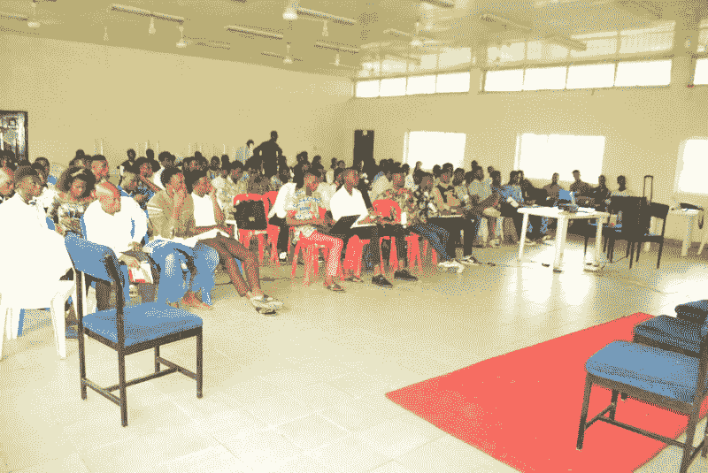
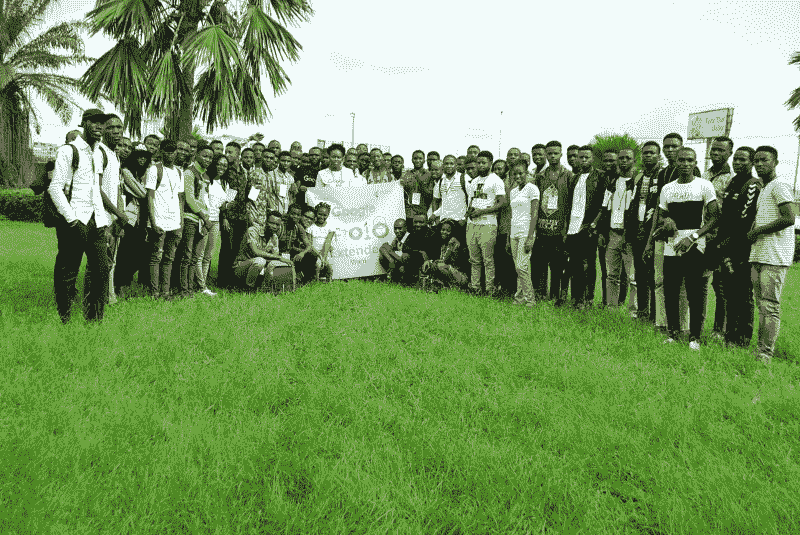
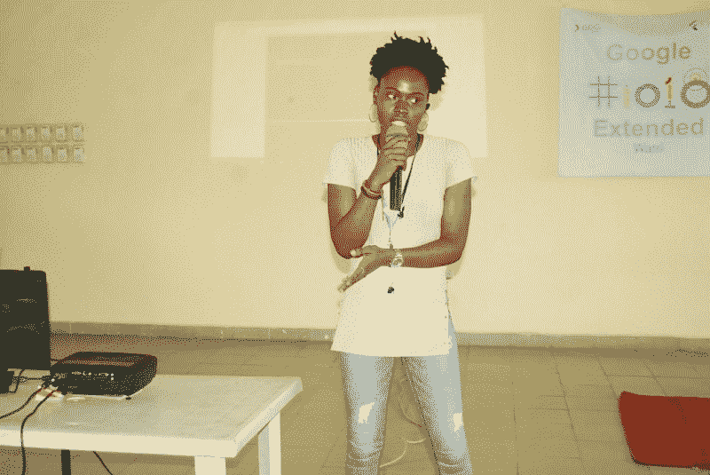
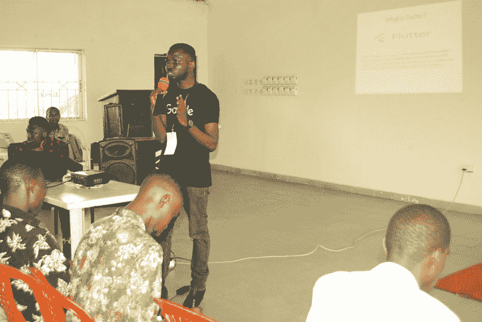

# 我如何将谷歌 I/O 2018 的兴奋带给尼日利亚瓦里的 115 个人

> 原文：<https://www.freecodecamp.org/news/how-i-brought-the-excitement-of-google-i-o-2018-to-115-people-in-warri-nigeria-cb7ac1f6cbe8/>

#### Google 开发团队 Warri 的第一个 I/O 扩展事件的故事

谷歌 I/O 是科技生态系统中最大的开发者节日之一。我是瓦里的[谷歌开发者小组的主要组织者。为了鼓励瓦里市的年轻人接受技术并成为开发者，我们于 6 月初在这里举办了首届](https://www.meetup.com/GDG-Warri/) [I/O 扩展 2018](https://www.meetup.com/GDG-Warri/events/250145818/) ，为瓦里带来了谷歌 I/O 的激动人心。

在早先的[文章](https://medium.freecodecamp.org/how-i-started-a-google-developers-group-gdg-chapter-in-warri-nigeria-and-reached-100-members-22cbd622d070)中，我谈到了我的旅程以及我如何让 100 名成员加入我们的 [GDG](https://developers.google.com/programs/community/gdg/) 分会。我讲了我是怎么去三角洲州埃富伦联邦石油资源大学的。

然而，我没有讨论的是，在我试图让第一批成员加入瓦里 GDG 的同时，另一个机构，位于三角洲州埃富伦的石油培训学院(PTI)正在进行第一学期的考试。所以，很自然地，我不得不放弃和那里的计算机科学学生谈话的计划，这样他们就可以专注于他们的考试。我知道还会有机会解决这些问题。

这个时候，我们正在计划我们的第一个 I/O 扩展 2018。

### 但是首先，这个 Google I/O 是什么？

> 谷歌 I/O 是谷歌一年一度的开发者节，聚集了来自世界各地的开发者，进行技术讲座、演示、代码实验室和谷歌的主要产品发布。— [谷歌 IO](https://events.google.com/io/)

通过开发人员团体，谷歌在世界各地的广大分布式开发人员社区可以体验在加州山景城举行的主要谷歌 I/O 聚会的精彩时刻，即使他们没有参加节日。

这怎么可能，即使对于我这样没有参加 2018 年 I/O 节的人来说？这就是 Google I/O Extended 的用武之地。这些扩展的活动聚集了来自世界各地的软件开发人员、有抱负的软件开发人员、代码新手和技术爱好者。

### 什么是 Google I/O 扩展？

> I/O 扩展事件帮助世界各地的开发人员参与 I/O 体验— [Google IO 扩展网站](https://events.google.com/io/extended/)

基本上，扩展事件可以采取不同的形式。例如，GDG 分会可以举办一场现场观摩派对，就像 GDG 在拉格斯举办的那场派对，会员们可以观看现场的主题演讲。

作为 GDG 瓦里的主要组织者，我选择在 2018 年 I/O 之后举办扩展活动。我计划于 2018 年 6 月 2 日在尼日利亚三角洲州 Effurun-Warri 的 PTI 会议中心举行。

为了迎合我们不断发展的开发者社区的不同兴趣，我决定让这个活动成为一个多方面的活动。在阵容中，我们有 [flutter](https://flutter.io) (谷歌为 Android 和 iOS 平台构建移动应用的 SDk)、录制的会议、现场演讲会议、codelabs 和炉边聊天。

### 与会者宣传:目标是 100 名与会者

随着我们第一次聚会的成功(你可以在这里阅读)，我决定更进一步:让 100 人参加 I/O extended 2018 Warri 活动。

既然石油培训学院已经结束了考试，并开始了新学期的学习，我们很容易就能约到时间向学生们介绍 GDG·瓦里，并邀请他们加入我们的 I/O extended。

我还去了 CCT Warri 学习中心(一个计算机培训机构),参观了我们第一次聚会时使用的设施。他们也给了我一个机会向他们的学生发表演讲并邀请他们参加活动。为此，我感谢该机构的管理人员。

好吧，最后，我的竞选努力得到了回报:我有 115 个人出现在 I/O extended 2018 Warri。这是我们作为 GDG 分会的第一次 I/O 活动！我们甚至把 meetup 的回复页面限制在 100。

### I/O 与 GDG 瓦里开发者社区的相关性

我不只是想举办一个对与会者没有重大影响的活动。我做了一个基本的假设，不是每个参加的人都想成为一名 web 开发人员。因此，我必须列出一个议程，以满足大多数与会者和初露头角的开发人员的需求。

为了迎合那些想要进入移动应用程序开发的人的需求，向他们介绍 Flutter 似乎是让他们开始走上这条道路的自然选择。

为了鼓励女性参与科技行业，我联系了 UI/UX 设计师佩里·费德利斯。佩里做了一个关于优秀设计的重要性的报告。好吧，佩里作为 GDG 瓦里的第一位女性发言人进入了记录册！

Perrie on the Importance of Good Design

我们从 Flutter 开始，我负责现场演讲环节。我的会议旨在帮助开发人员在利用 [codelabs](https://codelabs.developers.google.com/?cat=Flutter) 的同时，为使用 Flutter 构建应用奠定基础。

但我们面临着互联网服务提供商的挑战，没有机会继续进行代码实验室。为此我真的很抱歉。我们将为 Flutter 举办一次聚会，作为挑战的补偿。

Getting started with Flutter being handled by me

Fireside chat featuring Kelvin Omereshone, Perrie Fidelis and myself

### 前方的路

这是瓦里和三角洲州激动人心的时刻。有时候，直到你看到人们向你打招呼时脸上的笑容，你才会意识到你对他们的生活产生了多大的影响。

展望未来，我们将为 Warri 不断发展的开发者社区做更多的事情，看看这会把我们带到哪里。

*感谢阅读。如果你觉得这篇文章值得一读，那就给它一些掌声，分享给其他人看。*