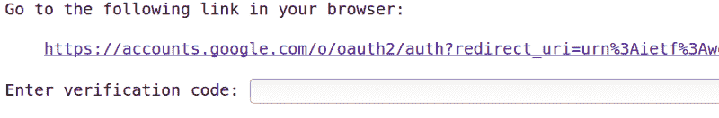
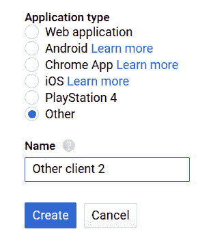
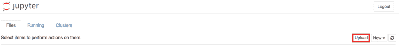

# 如何将大文件上传到 Google Colab 和远程 Jupyter 笔记本

> 原文：<https://www.freecodecamp.org/news/how-to-transfer-large-files-to-google-colab-and-remote-jupyter-notebooks-26ca252892fa/>

作者 Bharath Raj

# 如何将大文件上传到 Google Colab 和远程 Jupyter 笔记本


Photo by [Thomas Kelley](https://unsplash.com/photos/hHL08lF7Ikc?utm_source=unsplash&utm_medium=referral&utm_content=creditCopyText) on [Unsplash](https://unsplash.com/search/photos/books?utm_source=unsplash&utm_medium=referral&utm_content=creditCopyText)

如果你没有听说过， [Google Colab](http://g.co/colab) 是一个广泛用于在其**免费 K80 GPU** 上测试 ML 原型的平台。如果你听说过，很可能你已经尝试过了。但是您可能会因为传输大型数据集所涉及的复杂性而感到恼火。

这篇博客收集了一些我发现对从本地系统上传和**下载** **大文件**到 **Google Colab** 有用的方法。我还包括了一些额外的方法，这些方法有助于更轻松地传输**较小的文件**。其中一些方法可以扩展到其他**远程 Jupyter 笔记本服务，**如 Paperspace Gradient。

### 传输大文件

传输大文件最有效的方法是使用云存储系统，如 **Dropbox** 或 **Google Drive** 。

#### 1.Dropbox

Dropbox 为每个账户提供高达 2GB 的免费存储空间。这为您在任何时候可以传输的数据量设置了上限。通过 Dropbox 转账相对**容易**。对于**的其他笔记本服务**，你也可以遵循同样的步骤，比如**的 Paperspace Gradient** 。

**第一步:存档并上传**

单独上传大量图像(或文件)将需要很长时间，因为 Dropbox(或 Google Drive)必须单独为每张图像分配 id 和属性。因此，我建议您首先归档数据集。

一种可能的存档方法是将包含数据集的文件夹转换为。tar”文件。下面的代码片段展示了如何从 Linux 终端将主目录中名为“Dataset”的文件夹转换为“dataset.tar”文件。

```
tar -cvf dataset.tar ~/Dataset
```

或者，你可以使用 WinRar 或 7zip，只要对你来说更方便。将存档的数据集上传到 Dropbox。

**步骤 2:克隆存储库**

打开 Google Colab，开始一个新的笔记本。

克隆这个 [GitHub 库](https://github.com/thatbrguy/Dropbox-Uploader.git)。我修改了[原来的](https://github.com/andreafabrizi/Dropbox-Uploader)代码，这样它就可以从笔记本上添加 Dropbox 访问令牌。逐一执行以下命令**。**

```
`!git clone https://github.com/thatbrguy/Dropbox-Uploader.git
cd Dropbox-Uploader
!chmod +x dropbox_uploader.sh`
```

****步骤 3:创建访问令牌****

**执行以下命令查看初始设置说明。**

```
`!bash dropbox_uploader.sh`
```

**它将显示如何获取访问令牌的说明，并要求您执行以下命令。用您的访问令牌替换粗体字母，然后执行:**

```
`!echo "INPUT_YOUR_ACCESS_TOKEN_HERE" > token.txt`
```

**执行**！bash dropbox_uploader.sh** 再次链接你的 dropbox 账户到 Google Colab。现在，您可以从笔记本下载和上传文件。**

****第四步:传输内容****

****从 Dropbox 下载到 Colab】****

**执行以下命令。参数是 Dropbox 上文件的名称。**

```
`!bash dropbox_uploader.sh download YOUR_FILE.tar`
```

****从 Colab 上传到 Dropbox:****

**执行以下命令。第一个参数(result_on_colab.txt)是要上传的文件的名称。第二个参数(dropbox.txt)是您希望在 dropbox 上保存文件的名称。**

```
`!bash dropbox_uploader.sh upload result_on_colab.txt dropbox.txt`
```

#### **2.Google Drive**

**Google Drive 为每个 Google 帐户提供高达 15GB 的免费存储空间。这为您在任何时候可以传输的数据量设置了上限。您可以随时将此限制扩大到更大的金额。Colab 简化了 Google Drive 的认证过程。**

**也就是说，我还包括了您可以执行的必要修改，这样您也可以从其他 Python 笔记本服务访问 Google Drive。**

****第一步:存档并上传****

**就像 Dropbox 一样，单独上传大量图像(或文件)将需要很长时间，因为 Google Drive 必须单独为每张图像分配 id 和属性。因此，我建议您首先归档数据集。**

**一种可能的存档方法是将包含数据集的文件夹转换为。tar”文件。下面的代码片段展示了如何从 Linux 终端将主目录中名为“Dataset”的文件夹转换为“dataset.tar”文件。**

```
`tar -cvf dataset.tar ~/Dataset`
```

**同样，如果你愿意，你可以使用 WinRar 或 7zip。将存档的数据集上传到 Google Drive。**

****第二步:安装依赖关系****

**打开 Google Colab，开始一个新的笔记本。使用以下命令安装 PyDrive:**

```
`!pip install PyDrive`
```

**导入必要的库和方法(只有 Google Colab 需要 **bold** 导入。如果您不使用 Colab，请不要导入它们)。**

```
`import os
from pydrive.auth import GoogleAuth
from pydrive.drive import GoogleDrive
from google.colab import auth
from oauth2client.client import GoogleCredentials`
```

****第三步:授权谷歌 SDK****

****对于谷歌 Colab:****

**现在，你必须授权 Google SDK 从 Colab 访问 Google Drive。首先，执行以下命令:**

```
`auth.authenticate_user()
gauth = GoogleAuth()
gauth.credentials = GoogleCredentials.get_application_default()
drive = GoogleDrive(gauth)`
```

**您将得到如下所示的提示。按照链接获取密钥。将其复制并粘贴到输入框中，然后按 enter 键。**

**

Prompt to authenticate user** 

****对于其他 Jupyter 笔记本服务(例如:Paperspace Gradient):****

**以下一些步骤来自 PyDrive 的[快速入门指南](https://pythonhosted.org/PyDrive/quickstart.html)。**

**转到[API 控制台](https://console.developers.google.com/iam-admin/projects)并创建自己的项目。然后，搜索“Google Drive API”，选择条目，并单击“启用”。从左侧菜单中选择“凭据”，单击“创建凭据”，选择“OAuth 客户端 ID”。您应该会看到如下图所示的菜单:**

****

**将“应用类型”设置为“其他”。给出一个合适的名称，然后点击“保存”。**

**下载刚刚创建的 OAuth 2.0 客户端 ID。**将**更名为 **client_secrets.json****

**将这个 JSON 文件上传到您的笔记本上。您可以通过点击笔记本主页上的“上传”按钮来完成此操作(如下所示)。**(注意:不要**使用此按钮上传数据集，因为这将非常耗时。)**

**

Upload button shown in red** 

**现在，执行以下命令:**

```
`gauth = GoogleAuth()
gauth.CommandLineAuth()
drive = GoogleDrive(gauth)`
```

**剩下的过程**与 Google Colab 的**相似。**

****第四步:获取你的文件 ID****

**为要传输的文件启用链接共享。复制链接。您可能会看到这样的链接:**

```
`https://drive.google.com/open?id=YOUR_FILE_ID`
```

**只复制上面链接的粗体部分。**

****第五步:传输内容****

****从 Google Drive 下载到 Colab】****

**执行以下命令。这里， **YOUR_FILE_ID** 是上一步得到的，【DOWNLOAD.tar】T2 是你要保存文件的名称(或路径)。**

```
`download = drive.CreateFile({'id': 'YOUR_FILE_ID'})
download.GetContentFile('DOWNLOAD.tar')`
```

****从 Colab 上传到 Google Drive】****

**执行以下命令。这里， **FILE_ON_COLAB.txt** 是 COLAB 上文件的名称(或路径)，而 **DRIVE.txt** 是你想要保存文件的名称(或路径)(在 Google Drive 上)。**

```
`upload = drive.CreateFile({'title': 'DRIVE.txt'})
upload.SetContentFile('FILE_ON_COLAB.txt')
upload.Upload()`
```

### **传输较小的文件**

**有时，您可能只想传递一个 csv 文件，而不想经历整个麻烦。别担心——有更简单的方法。**

#### **1.Google Colab 文件模块**

**Google Colab 内置了**文件模块**，你可以用它上传或下载文件。您可以通过执行以下命令来导入它:**

```
`from google.colab import files`
```

****上传:****

**使用以下命令将文件上传到 Google Colab:**

```
`files.upload()`
```

**您将看到一个 GUI，您可以通过它选择要上传的文件。不建议对大文件使用这种方法。它非常慢。**

****下载:****

**使用以下命令从 Google Colab 下载文件:**

```
`files.download('example.txt')`
```

**这个功能在**谷歌 Chrome** 中效果最好。根据我的经验，在 Firefox 上大约 10 次尝试中，它只成功了一次。**

#### **2.开源代码库**

**这是一种“黑客式”的文件传输方式。您可以用想要传输的小文件创建一个 GitHub 存储库。**

**一旦创建了存储库，就可以在 Google Colab 中克隆它。然后，您可以将您的更改推送到远程存储库，并将更新拉到您的本地系统上。**

**但是请注意，GitHub 的硬限制是每个文件 25MB，软限制是每个存储库 1GB。**

> **感谢您阅读本文！如果你觉得有趣，请留点掌声！如果你有任何问题，你可以在社交媒体上给我打电话或者给我发邮件。**